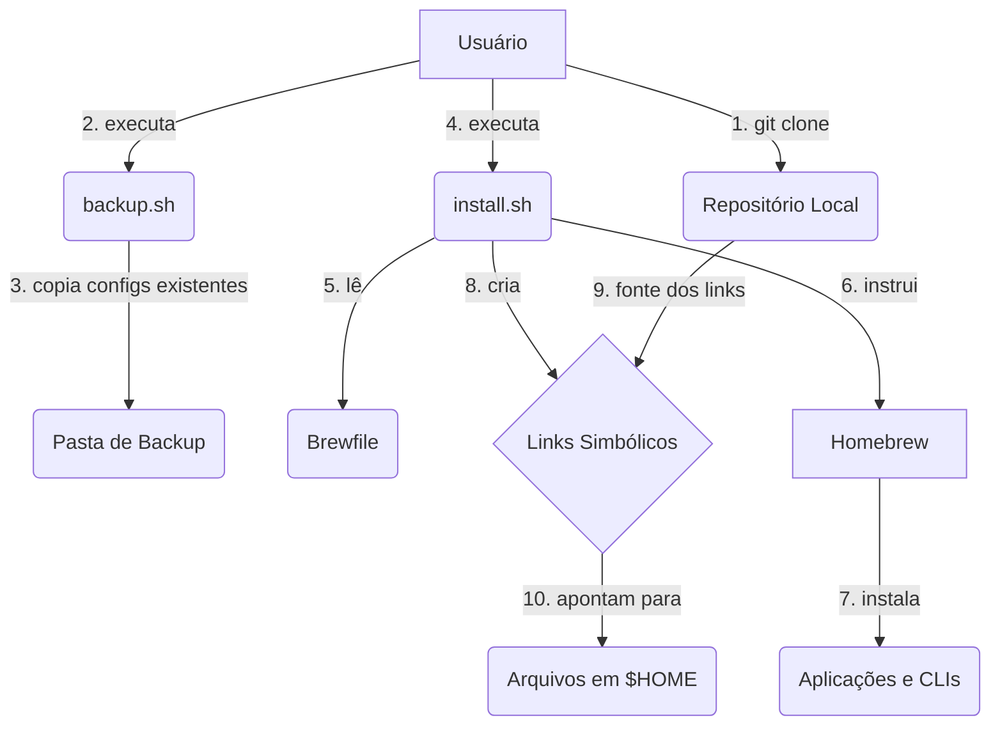
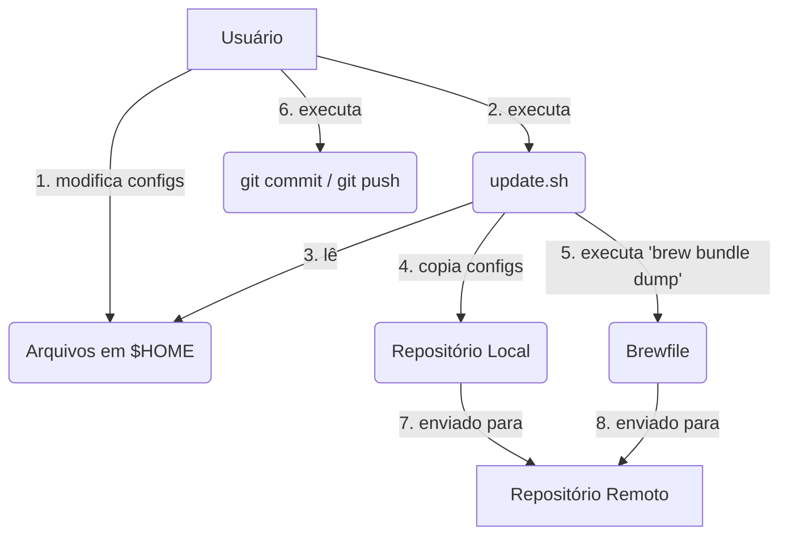

# Arquitetura do Sistema de Dotfiles

Este documento descreve a arquitetura, os componentes e as decisões de design por trás deste repositório de dotfiles. O objetivo é fornecer uma visão clara de como o sistema funciona, facilitando sua manutenção e futuras modificações.

## 1. Visão Geral de Alto Nível

Este sistema foi projetado para automatizar e gerenciar a configuração de um ambiente de desenvolvimento em **macOS**. A filosofia central é tratar a configuração do ambiente como **"Infraestrutura como Código" (IaC)**. Em vez de configurar manualmente cada nova máquina, o sistema utiliza scripts e arquivos de configuração versionados para criar um ambiente padronizado, reprodutível e portátil.

Os principais objetivos da arquitetura são:
- **Automação:** Reduzir a configuração manual a quase zero.
- **Consistência:** Garantir que o ambiente de desenvolvimento seja o mesmo em diferentes máquinas.
- **Versionamento:** Manter um histórico de todas as alterações de configuração através do Git.
- **Portabilidade:** Facilitar a migração para uma nova máquina macOS.

## 2. Interações de Componentes

O sistema é composto por três tipos principais de componentes que interagem entre si e com o sistema do usuário:

1.  **Arquivos de Configuração (`config/`)**: O "coração" do sistema. São os dotfiles reais, organizados em subdiretórios por categoria (zsh, git, editor, etc.). Eles contêm as definições de comportamento para as respectivas ferramentas.
2.  **Scripts de Orquestração (`*.sh`)**: A "inteligência" do sistema. São scripts de shell que automatizam o processo de instalação, atualização e backup.
    - `install.sh`: Lê o `Brewfile` para instalar dependências e cria links simbólicos dos arquivos em `config/` para os locais corretos no diretório `$HOME` do usuário.
    - `update.sh`: Faz o caminho inverso do `install.sh`. Ele copia as configurações modificadas do diretório `$HOME` de volta para o repositório e atualiza o `Brewfile`.
    - `backup.sh`: Fornece uma camada de segurança, copiando os dotfiles existentes do usuário para uma pasta de backup antes que o `install.sh` os sobrescreva.
    - `validate.sh`: Verifica a integridade da instalação, confirmando que os links simbólicos existem e apontam para os locais corretos.
3.  **Definição de Pacotes (`Brewfile`)**: Um arquivo declarativo que lista todas as aplicações, CLIs e fontes a serem gerenciadas pelo Homebrew. Ele atua como o manifesto de dependências de software do ambiente.

## 3. Diagramas de Fluxo de Dados

Os diagramas abaixo ilustram os dois principais fluxos de trabalho do sistema.

### Fluxo 1: Instalação em uma Nova Máquina

Este fluxo descreve como a configuração do repositório é aplicada ao sistema do usuário.

### Fluxo 2: Atualizando o Repositório com Mudanças Locais

Este fluxo descreve como as modificações feitas no ambiente local são salvas de volta no repositório.

## 4. Decisões de Design e Justificativa

- **Uso de Scripts Shell Nativos vs. Ferramentas de Gerenciamento (Ansible, etc.)**
    - **Decisão:** Utilizar scripts de shell (`bash`/`zsh`).
    - **Justificativa:** Para um caso de uso de dotfiles pessoais, ferramentas como Ansible adicionam uma camada de complexidade desnecessária. Scripts de shell são leves, universais em sistemas Unix-like e não possuem dependências externas, alinhando-se à simplicidade e ao controle total sobre o processo.

- **Centralização das Configurações na Pasta `config/`**
    - **Decisão:** Todos os dotfiles residem em um único diretório `config/`, categorizados por função.
    - **Justificativa:** Isso mantém o repositório organizado e limpo. Em vez de ter dezenas de dotfiles na raiz, eles são agrupados logicamente, facilitando a localização e a manutenção de configurações específicas.

- **Uso de Links Simbólicos (Symlinks)**
    - **Decisão:** O script `install.sh` cria links simbólicos em vez de copiar os arquivos.
    - **Justificativa:** Esta é a decisão de design mais crucial. Os links simbólicos garantem que o repositório Git seja a **única fonte da verdade**. Qualquer alteração feita diretamente nos arquivos dentro do repositório `~/Dotfiles` é refletida imediatamente no sistema, permitindo testes rápidos. O fluxo de atualização (`update.sh`) formaliza o processo de salvar as mudanças de volta.

- **Separação dos Scripts `install.sh` e `update.sh`**
    - **Decisão:** Criar scripts distintos para aplicar e para salvar as configurações.
    - **Justificativa:** Separa as responsabilidades e torna a intenção do usuário explícita. `install.sh` é para "onboarding" (configurar uma máquina), enquanto `update.sh` é para "manutenção" (persistir mudanças). Isso evita ações acidentais, como sobrescrever o repositório ao tentar instalar.

## 5. Restrições e Limitações do Sistema

- **Dependência de Plataforma:** O sistema é projetado **exclusivamente para macOS**. A forte dependência do Homebrew e de caminhos de sistema específicos do macOS (`/opt/homebrew`) impede sua portabilidade direta para Linux ou Windows.
- **Gerenciamento de Segredos:** O sistema **não gerencia segredos** (chaves de API, tokens, etc.). A convenção de usar um arquivo `~/.zsh/env.private` (que é ignorado pelo Git) é sugerida, mas a criação e o gerenciamento desse arquivo são responsabilidades do usuário.
- **Sincronização Não Automática:** O script `update.sh` apenas atualiza o **repositório local**. O usuário é responsável por executar `git commit` e `git push` para sincronizar as mudanças com o repositório remoto. Isso é intencional para dar ao usuário controle total sobre o histórico de commits.
- **Não é Idempotente (Parcialmente):** Embora o `install.sh` possa ser executado várias vezes, ele não é totalmente idempotente no sentido de "reparar" o sistema. Por exemplo, se um link simbólico for excluído manualmente, o script não o recriará a menos que seja modificado para tal. A validação (`validate.sh`) detecta o problema, mas a correção requer uma nova execução do `install.sh`.
