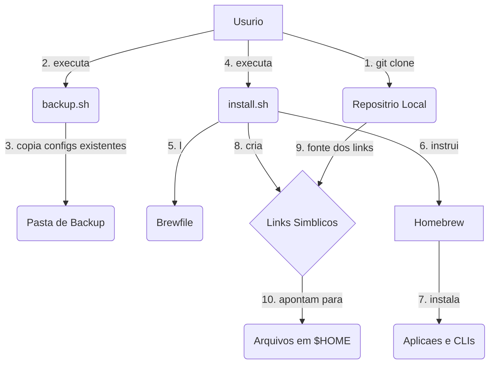
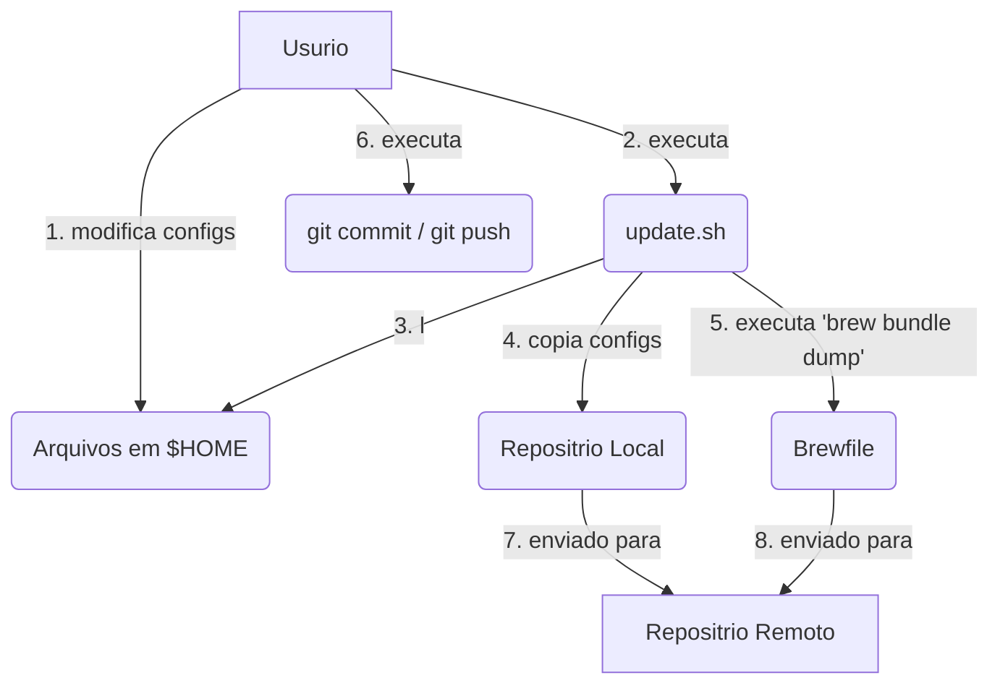

This file is a merged representation of the entire codebase, combined into a single document by Repomix.

# File Summary

## Purpose
This file contains a packed representation of the entire repository's contents.
It is designed to be easily consumable by AI systems for analysis, code review,
or other automated processes.

## File Format
The content is organized as follows:
1. This summary section
2. Repository information
3. Directory structure
4. Repository files (if enabled)
5. Multiple file entries, each consisting of:
  a. A header with the file path (## File: path/to/file)
  b. The full contents of the file in a code block

## Usage Guidelines
- This file should be treated as read-only. Any changes should be made to the
  original repository files, not this packed version.
- When processing this file, use the file path to distinguish
  between different files in the repository.
- Be aware that this file may contain sensitive information. Handle it with
  the same level of security as you would the original repository.

## Notes
- Some files may have been excluded based on .gitignore rules and Repomix's configuration
- Binary files are not included in this packed representation. Please refer to the Repository Structure section for a complete list of file paths, including binary files
- Files matching patterns in .gitignore are excluded
- Files matching default ignore patterns are excluded
- Files are sorted by Git change count (files with more changes are at the bottom)

# Directory Structure
```
config/
  editor/
    Cursor/
      keybindings.json
      settings.json
  git/
    .gitconfig
    .gitignore_global
  terminal/
    ghostty/
      config
    zellij/
      config.kdl
  zsh/
    .zsh/
      aliases.zsh
      functions.zsh
      paths.zsh
      scheduling.zsh
    .zshrc
tests/
  libs/
    bats-assert/
      .github/
        workflows/
          sync-default-branch.yml
          test.yml
      src/
        assert_equal.bash
        assert_failure.bash
        assert_line.bash
        assert_not_equal.bash
        assert_output.bash
        assert_regex.bash
        assert_success.bash
        assert.bash
        refute_line.bash
        refute_output.bash
        refute_regex.bash
        refute.bash
      test/
        assert_equal.bats
        assert_failure.bats
        assert_line.bats
        assert_not_equal.bats
        assert_output.bats
        assert_regex.bats
        assert_stderr_line.bats
        assert_stderr.bats
        assert_success.bats
        assert.bats
        refute_line.bats
        refute_output.bats
        refute_regex.bats
        refute_stderr_line.bats
        refute_stderr.bats
        refute.bats
        test_helper.bash
      .git
      .gitignore
      LICENSE
      load.bash
      package.json
      README.md
    bats-core/
      .devcontainer/
        devcontainer.json
        Dockerfile
      .github/
        ISSUE_TEMPLATE/
          bug_report.md
          feature_request.md
        workflows/
          check_pr_label.sh
          codespell.yml
          dependency-review.yml
          release_dockerhub.yml
          release.yml
          scorecard.yml
          set_nounset.bash
          tests.yml
        dependabot.yml
      bin/
        bats
      contrib/
        rpm/
          bats.spec
        release.sh
        semver
      docker/
        install_libs.sh
        install_tini.sh
        tini.pubkey.gpg
      docs/
        examples/
          package-tarball
          package-tarball.bats
          README.md
        source/
          assets/
            dark_mode_bat.svg
            dark_mode_cube.svg
            dark_mode_wordmark_lowercase.svg
            dark_mode_wordmark_uppercase.svg
            light_mode_bat.svg
            light_mode_cube.svg
            light_mode_wordmark_lowercase.svg
            light_mode_wordmark_uppercase.svg
            README.md
          warnings/
            BW01.rst
            BW02.rst
            BW03.rst
            index.rst
          conf.py
          docker-usage.md
          faq.rst
          gotchas.rst
          index.rst
          installation.rst
          requirements.txt
          support-matrix.rst
          tutorial.rst
          usage.md
          writing-tests.md
        .markdownlint.json
        CHANGELOG.md
        CODE_OF_CONDUCT.md
        CODEOWNERS
        CONTRIBUTING.md
        list-links.py
        make.bat
        Makefile
        PULL_REQUEST_TEMPLATE.md
        releasing.md
        versions.md
      lib/
        bats-core/
          common.bash
          formatter.bash
          preprocessing.bash
          semaphore.bash
          test_functions.bash
          tracing.bash
          validator.bash
          warnings.bash
      libexec/
        bats-core/
          bats
          bats-exec-file
          bats-exec-suite
          bats-exec-test
          bats-format-cat
          bats-format-junit
          bats-format-pretty
          bats-format-tap
          bats-format-tap13
          bats-gather-tests
          bats-preprocess
      man/
        bats.1
        bats.1.ronn
        bats.7
        bats.7.ronn
        Makefile
        README.md
      test/
        fixtures/
          bats/
            evaluation_count/
              file1.bats
              file2.bats
            failure_callback_setup_suite/
              dummy.bats
              setup_suite.bash
            issue-433/
              repro1.bats
              repro2.bats
            preserve_IFS/
              helper.bash
              setup_suite.bash
              test.bats
            teardown_suite_override_status/
              setup_suite.bash
              test.bats
            BATS_TMPDIR.bats
            BATS_variables_dont_contain_double_slashes.bats
            cmd_using_stdin.bash
            comment_style.bats
            date
            dos_line_no_shellcheck.bats
            duplicate-tests_no_shellcheck.bats
            dynamic_test_registration.bats
            empty.bats
            environment.bats
            exit_11.bash
            expand_var_in_test_name.bats
            exported_function.bats
            external_function_calls.bats
            external_functions.bash
            external_functions.bats
            failing_and_passing.bats
            failing_helper.bats
            failing_setup.bats
            failing_teardown.bats
            failing_with_bash_cond.bats
            failing_with_bash_expression.bats
            failing_with_negated_command.bats
            failing.bats
            failure_callback_setup_file.bats
            failure_callback.bats
            failure_in_free_code.bats
            focus.bats
            focused_filtered_out.bats
            gobble_up_stdin_sleep_and_print_finish.bash
            hang_after_run.bats
            hang_in_run.bats
            hang_in_setup_file.bats
            hang_in_teardown_file.bats
            hang_in_teardown.bats
            hang_in_test.bats
            intact.bats
            issue-205.bats
            issue-519.bats
            load.bats
            loop_keep_IFS.bats
            many_passing_and_one_failing.bats
            no-final-newline.bats
            output.bats
            override_date_on_path.bats
            parallel.bats
            passing_and_failing.bats
            passing_and_skipping.bats
            passing_failing_and_skipping.bats
            passing.bats
            print_output_on_failure_with_stderr.bats
            print_output_on_failure.bats
            quoted_and_unquoted_test_names_no_shellcheck.bats
            read_from_stdin.bats
            reference_unset_parameter_in_setup.bats
            reference_unset_parameter_in_teardown.bats
            reference_unset_parameter.bats
            retry_success.bats
            retry.bats
            run_long_command.bats
            set_-eu_in_setup_and_teardown.bats
            setup.bats
            show-output-of-passing-tests.bats
            sigint_in_failing_test.bats
            single_line_no_shellcheck.bats
            skipped_with_parens.bats
            skipped.bats
            source_nonexistent_file_in_setup.bats
            source_nonexistent_file_in_teardown.bats
            source_nonexistent_file.bats
            tab in filename.bats
            teardown_file_override_status.bats
            teardown_override_status.bats
            teardown.bats
            test_helper.bash
            test_with_slash.bats
            unbound_variable.bats
            unofficial_bash_strict_mode.bash
            unofficial_bash_strict_mode.bats
            update_path_env.bats
            verbose-run.bats
            whitespace_no_shellcheck.bats
            without_trailing_newline.bats
          file_setup_teardown/
            error_in_setup_and_teardown_file.bats
            no_setup_file.bats
            no_teardown_file.bats
            setup_file_does_not_leak_env.bats
            setup_file_does_not_leak_env2.bats
            setup_file_even_if_all_tests_are_skipped.bats
            setup_file_failed.bats
            setup_file_halfway_error.bats
            setup_file.bats
            setup_file2.bats
            teardown_file_after_failing_test.bats
            teardown_file_after_long_test.bats
            teardown_file_does_not_leak.bats
            teardown_file_does_not_leak2.bats
            teardown_file_even_if_all_tests_are_skipped.bats
            teardown_file_failed.bats
            teardown_file_halfway_error.bats
            teardown_file.bats
            teardown_file2.bats
          formatter/
            dummy-formatter
            echo-formatter
            failing.bats
            passing_and_skipping.bats
            passing_failing_and_skipping.bats
            passing.bats
            retry.bats
            skipped_with_parens.bats
          junit-formatter/
            duplicate/
              first/
                file1.bats
              second/
                file1.bats
            suite/
              file1.bats
              file2.bats
            issue_360.bats
            issue_531.bats
            skipped.bats
            xml-escape.bats
          load/
            ambiguous
            ambiguous.bash
            bats_load_library.bats
            exit1.bash
            failing_bats_load_library.bats
            failing_load.bats
            find_library_helper_err.bats
            find_library_helper.bats
            load_in_teardown_after_failure.bats
            load.bats
            return1.bash
            test_helper.bash
          parallel/
            must_not_parallelize_across_files/
              file1.bats
              file2.bats
            setup_file/
              setup_file.bats
            suite/
              parallel1.bats
            must_not_parallelize_within_file.bats
            parallel_factor.bats
            parallel-preserve-environment.bats
            parallel.bats
          run/
            failing.bats
            invalid.bats
          suite/
            errors_in_multiple_load/
              a.bats
              b.bats
              c.bats
              test_helper.bash
            filter/
              a.bats
              b.bats
              c.bats
            multiple/
              a.bats
              b.bats
            multiple_load_constants/
              a.bats
              b.bats
              test_helper.bash
            override_BATS_FILE_EXTENSION/
              subfolder/
                test.other_extension
              test.bats
              test.test
            recursive/
              subsuite/
                test2.bats
              test.bats
            single/
              test.bats
            skip/
              skip-in-setup-and-teardown.bats
              skip-in-setup.bats
              skip-in-teardown.bats
              skip-in-test-and-teardown.bats
              skip-in-test.bats
            test_number/
              file1.bats
              file2.bats
          suite_setup_teardown/
            call_load/
              setup_suite.bash
              test_helper.bash
              test.bats
            default_name/
              setup_suite.bash
              test.bats
            error_in_free_code/
              setup_suite.bash
              test.bats
            error_in_setup_suite/
              setup_suite.bash
              test.bats
            error_in_teardown_suite/
              setup_suite.bash
              test.bats
            exported_vars/
              setup_suite.bash
              test.bats
            failure_in_setup_suite/
              setup_suite.bash
              test.bats
            failure_in_teardown_suite/
              setup_suite.bash
              test.bats
            no_failure_no_output/
              setup_suite.bash
              test.bats
            no_setup_suite_function/
              setup_suite.bash
              test.bats
            non_default_name/
              setup_suite_non_default.bash
              test.bats
            output_with_failure/
              setup_suite.bash
              test.bats
            pick_up_toplevel/
              folder1/
                test.bats
              folder2/
                test.bats
              setup_suite.bash
              test.bats
            return_nonzero_in_teardown_suite/
              setup_suite.bash
              test.bats
            stderr_in_setup_teardown_suite/
              setup_suite.bash
              test.bats
            syntax_error/
              setup_suite_no_shellcheck
              test.bats
            skip_in_setup_file.bats
          tagging/
            BATS_TEST_TAGS.bats
            invalid_tags.bats
            print_tags_on_error.bats
            tagged.bats
            trimming.bats
          timeout/
            sleep2.bats
          trace/
            failing_complex.bats
            failing_recursive.bats
          warnings/
            BW03/
              define_setup_suite_in_wrong_file.bats
              non_default_setup_suite.bash
              suppress_warning.bats
            BW01_check_exit_code_is_127.bats
            BW01_no_exit_code_check_no_exit_code_127.bats
            BW01.bats
            BW02.bats
        bats_pipe.bats
        bats.bats
        cat-formatter.bats
        common.bats
        concurrent-coordination.bash
        file_setup_teardown.bats
        filter.bats
        formatter.bats
        install.bats
        junit-formatter.bats
        load.bats
        parallel.bats
        pretty-formatter.bats
        root.bats
        run.bats
        suite_setup_teardown.bats
        suite.bats
        tagging.bats
        tap13-formatter.bats
        test_helper.bash
        timeout.bats
        trace.bats
        warnings.bats
      test2/
        setup_suite.bash
        test.bats
      .codespellrc
      .editorconfig
      .git
      .gitattributes
      .gitignore
      .pre-commit-config.yaml
      .readthedocs.yml
      AUTHORS
      docker-compose.override.dist
      docker-compose.yml
      Dockerfile
      install.sh
      LICENSE.md
      package.json
      README.md
      report.xml
      SECURITY.md
      shellcheck.sh
      uninstall.sh
    bats-support/
      .github/
        workflows/
          scorecard.yaml
          sync-default-branch.yml
          tests.yml
        dependabot.yaml
      src/
        error.bash
        lang.bash
        output.bash
      test/
        50-output-10-batslib_err.bats
        50-output-11-batslib_count_lines.bats
        50-output-12-batslib_is_single_line.bats
        50-output-13-batslib_get_max_single_line_key_width.bats
        50-output-14-batslib_print_kv_single.bats
        50-output-15-batslib_print_kv_multi.bats
        50-output-16-batslib_print_kv_single_or_multi.bats
        50-output-17-batslib_prefix.bats
        50-output-18-batslib_mark.bats
        50-output-19-batslib_decorate.bats
        51-error-10-fail.bats
        52-lang-10-batslib_is_caller.bats
        cat
        test_helper.bash
      .git
      .gitignore
      CHANGELOG.md
      LICENSE
      load.bash
      package.json
      README.md
  backup.bats
  install.bats
.gitignore
.gitmodules
ARQUITETURA.md
backup.sh
Brewfile
install.sh
LICENSE
README.md
run-tests.sh
test-install.sh
update.sh
validate.sh
```

# Files

## File: tests/libs/bats-assert/.github/workflows/sync-default-branch.yml
````yaml
name: Sync Default Branch
on:
  push: { branches: main }
  workflow_dispatch:
permissions: {}

jobs:
  sync-default-branch:
    if: github.ref_name == github.event.repository.default_branch
    permissions: {contents: write}
    runs-on: ubuntu-latest
    steps:
    - uses: step-security/harden-runner@f086349bfa2bd1361f7909c78558e816508cdc10 # v2.8.0
      with: {egress-policy: audit}
    - uses: actions/checkout@a5ac7e51b41094c92402da3b24376905380afc29 # v4.1.6
    - run: git push --force origin HEAD:refs/heads/master

# One-time commands for users to switch-over:
#
# ```console
# git branch -m master main
# git fetch origin
# git branch -u origin/main main
# git remote set-head origin -a
# ```
````

## File: tests/libs/bats-assert/.github/workflows/test.yml
````yaml
name: Test
on:
  push:
  pull_request:
  workflow_dispatch:

jobs:
  test:
    uses: bats-core/.github/.github/workflows/test.yml@v1
````

## File: tests/libs/bats-assert/src/assert_equal.bash
````bash
# assert_equal
# ============
#
# Summary: Fail if the actual and expected values are not equal.
#
# Usage: assert_equal <actual> <expected>
#
# Options:
#   <actual>      The value being compared.
#   <expected>    The value to compare against.
#
#   ```bash
#   @test 'assert_equal()' {
#     assert_equal 'have' 'want'
#   }
#   ```
#
# IO:
#   STDERR - expected and actual values, on failure
# Globals:
#   none
# Returns:
#   0 - if values equal
#   1 - otherwise
#
# On failure, the expected and actual values are displayed.
#
#   ```
#   -- values do not equal --
#   expected : want
#   actual   : have
#   --
#   ```
assert_equal() {
  if [[ $1 != "$2" ]]; then
    batslib_print_kv_single_or_multi 8 \
    'expected' "$2" \
    'actual'   "$1" \
    | batslib_decorate 'values do not equal' \
    | fail
  fi
}
````

## File: tests/libs/bats-assert/src/assert_failure.bash
````bash
# assert_failure
# ==============
#
# Summary: Fail if `$status` is 0; or is not equal to the optionally provided status.
#
# Usage: assert_failure [<expected_status>]
#
# Options:
#   <expected_status>    The specific status code to check against.
#                        If not provided, simply asserts status is != 0.
#
# IO:
#   STDERR - `$output`, on failure;
#          - also, `$status` and `expected_status`, if provided
# Globals:
#   status
#   output
# Returns:
#   0 - if `$status' is 0,
#       or if expected_status is provided but does not equal `$status'
#   1 - otherwise
#
#   ```bash
#   @test 'assert_failure() status only' {
#     run echo 'Success!'
#     assert_failure
#   }
#   ```
#
# On failure, `$output` is displayed.
#
#   ```
#   -- command succeeded, but it was expected to fail --
#   output : Success!
#   --
#   ```
#
# ## Expected status
#
# When `expected_status` is provided, fail if `$status` does not equal the `expected_status`.
#
#   ```bash
#   @test 'assert_failure() with expected status' {
#     run bash -c "echo 'Error!'; exit 1"
#     assert_failure 2
#   }
#   ```
#
# On failure, both the expected and actual statuses, and `$output` are displayed.
#
#   ```
#   -- command failed as expected, but status differs --
#   expected : 2
#   actual   : 1
#   output   : Error!
#   --
#   ```
assert_failure() {
  : "${output?}"
  : "${status?}"

  (( $# > 0 )) && local -r expected="$1"
  if (( status == 0 )); then
    { local -ir width=6
      batslib_print_kv_single_or_multi "$width" 'output' "$output"
      if [[ -n "${stderr-}" ]]; then
        batslib_print_kv_single_or_multi "$width" 'stderr' "$stderr"
      fi
    } \
    | batslib_decorate 'command succeeded, but it was expected to fail' \
    | fail
  elif (( $# > 0 )) && (( status != expected )); then
    { local -ir width=8
      batslib_print_kv_single "$width" \
      'expected' "$expected" \
      'actual'   "$status"
      batslib_print_kv_single_or_multi "$width" \
      'output' "$output"
      if [[ -n "${stderr-}" ]]; then
      	batslib_print_kv_single_or_multi "$width" 'stderr' "$stderr"
      fi
    } \
    | batslib_decorate 'command failed as expected, but status differs' \
    | fail
  fi
}
````

## File: tests/libs/bats-assert/src/assert_line.bash
````bash
# assert_line
# ===========
#
# Summary: Fail if the expected line is not found in the output (default) or at a specific line number.
#
# Usage: assert_line [-n index] [-p | -e] [--] <expected>
#
# Options:
#   -n, --index <idx> Match the <idx>th line
#   -p, --partial     Match if `expected` is a substring of `$output` or line <idx>
#   -e, --regexp      Treat `expected` as an extended regular expression
#   <expected>        The expected line string, substring, or regular expression
#
# IO:
#   STDERR - details, on failure
#            error message, on error
# Globals:
#   output
#   lines
# Returns:
#   0 - if matching line found
#   1 - otherwise
#
# Similarly to `assert_output`, this function verifies that a command or function produces the expected output.
# (It is the logical complement of `refute_line`.)
# It checks that the expected line appears in the output (default) or at a specific line number.
# Matching can be literal (default), partial or regular expression.
#
# *__Warning:__
# Due to a [bug in Bats][bats-93], empty lines are discarded from `${lines[@]}`,
# causing line indices to change and preventing testing for empty lines.*
#
# [bats-93]: https://github.com/sstephenson/bats/pull/93
#
# ## Looking for a line in the output
#
# By default, the entire output is searched for the expected line.
# The assertion fails if the expected line is not found in `${lines[@]}`.
#
#   ```bash
#   @test 'assert_line() looking for line' {
#     run echo $'have-0\nhave-1\nhave-2'
#     assert_line 'want'
#   }
#   ```
#
# On failure, the expected line and the output are displayed.
#
#   ```
#   -- output does not contain line --
#   line : want
#   output (3 lines):
#     have-0
#     have-1
#   have-2
#   --
#   ```
#
# ## Matching a specific line
#
# When the `--index <idx>` option is used (`-n <idx>` for short), the expected line is matched only against the line identified by the given index.
# The assertion fails if the expected line does not equal `${lines[<idx>]}`.
#
#   ```bash
#   @test 'assert_line() specific line' {
#     run echo $'have-0\nhave-1\nhave-2'
#     assert_line --index 1 'want-1'
#   }
#   ```
#
# On failure, the index and the compared lines are displayed.
#
#   ```
#   -- line differs --
#   index    : 1
#   expected : want-1
#   actual   : have-1
#   --
#   ```
#
# ## Partial matching
#
# Partial matching can be enabled with the `--partial` option (`-p` for short).
# When used, a match fails if the expected *substring* is not found in the matched line.
#
#   ```bash
#   @test 'assert_line() partial matching' {
#     run echo $'have 1\nhave 2\nhave 3'
#     assert_line --partial 'want'
#   }
#   ```
#
# On failure, the same details are displayed as for literal matching, except that the substring replaces the expected line.
#
#   ```
#   -- no output line contains substring --
#   substring : want
#   output (3 lines):
#     have 1
#     have 2
#     have 3
#   --
#   ```
#
# ## Regular expression matching
#
# Regular expression matching can be enabled with the `--regexp` option (`-e` for short).
# When used, a match fails if the *extended regular expression* does not match the line being tested.
#
# *__Note__:
# As expected, the anchors `^` and `$` bind to the beginning and the end (respectively) of the matched line.*
#
#   ```bash
#   @test 'assert_line() regular expression matching' {
#     run echo $'have-0\nhave-1\nhave-2'
#     assert_line --index 1 --regexp '^want-[0-9]$'
#   }
#   ```
#
# On failure, the same details are displayed as for literal matching, except that the regular expression replaces the expected line.
#
#   ```
#   -- regular expression does not match line --
#   index  : 1
#   regexp : ^want-[0-9]$
#   line   : have-1
#   --
#   ```
# FIXME(ztombol): Display `${lines[@]}' instead of `$output'!
assert_line() {
  __assert_line "$@"
}

# assert_stderr_line
# ===========
#
# Summary: Fail if the expected line is not found in the stderr (default) or at a specific line number.
#
# Usage: assert_stderr_line [-n index] [-p | -e] [--] <expected>
#
# Options:
#   -n, --index <idx> Match the <idx>th line
#   -p, --partial     Match if `expected` is a substring of `$stderr` or line <idx>
#   -e, --regexp      Treat `expected` as an extended regular expression
#   <expected>        The expected line string, substring, or regular expression
#
# IO:
#   STDERR - details, on failure
#            error message, on error
# Globals:
#   stderr
#   stderr_lines
# Returns:
#   0 - if matching line found
#   1 - otherwise
#
# Similarly to `assert_stderr`, this function verifies that a command or function produces the expected stderr.
# (It is the logical complement of `refute_stderr_line`.)
# It checks that the expected line appears in the stderr (default) or at a specific line number.
# Matching can be literal (default), partial or regular expression.
#
assert_stderr_line() {
  __assert_line "$@"
}

__assert_line() {
  local -r caller=${FUNCNAME[1]}
  local -i is_match_line=0
  local -i is_mode_partial=0
  local -i is_mode_regexp=0

  if [[ "${caller}" == "assert_line" ]]; then
    : "${lines?}"
    local -ar stream_lines=("${lines[@]}")
    local -r stream_type=output
  elif [[ "${caller}" == "assert_stderr_line" ]]; then
    : "${stderr_lines?}"
    local -ar stream_lines=("${stderr_lines[@]}")
    local -r stream_type=stderr
  else
    # Unknown caller
    echo "Unexpected call to \`${FUNCNAME[0]}\`
Did you mean to call \`assert_line\` or \`assert_stderr_line\`?" \
    | batslib_decorate "ERROR: ${FUNCNAME[0]}" \
    | fail
    return $?
  fi

  # Handle options.
  while (( $# > 0 )); do
    case "$1" in
    -n|--index)
      if (( $# < 2 )) || ! [[ $2 =~ ^-?([0-9]|[1-9][0-9]+)$ ]]; then
        echo "\`--index' requires an integer argument: \`$2'" \
        | batslib_decorate "ERROR: ${caller}" \
        | fail
        return $?
      fi
      is_match_line=1
      local -ri idx="$2"
      shift 2
      ;;
    -p|--partial) is_mode_partial=1; shift ;;
    -e|--regexp) is_mode_regexp=1; shift ;;
    --) shift; break ;;
    *) break ;;
    esac
  done

  if (( is_mode_partial )) && (( is_mode_regexp )); then
    echo "\`--partial' and \`--regexp' are mutually exclusive" \
    | batslib_decorate "ERROR: ${caller}" \
    | fail
    return $?
  fi

  # Arguments.
  local -r expected="$1"

  if (( is_mode_regexp == 1 )) && [[ '' =~ $expected ]] || (( $? == 2 )); then
    echo "Invalid extended regular expression: \`$expected'" \
    | batslib_decorate "ERROR: ${caller}" \
    | fail
    return $?
  fi

  # Matching.
  if (( is_match_line )); then
    # Specific line.
    if (( is_mode_regexp )); then
      if ! [[ ${stream_lines[$idx]} =~ $expected ]]; then
        batslib_print_kv_single 6 \
        'index' "$idx" \
        'regexp' "$expected" \
        'line'  "${stream_lines[$idx]}" \
        | batslib_decorate 'regular expression does not match line' \
        | fail
      fi
    elif (( is_mode_partial )); then
      if [[ ${stream_lines[$idx]} != *"$expected"* ]]; then
        batslib_print_kv_single 9 \
        'index'     "$idx" \
        'substring' "$expected" \
        'line'      "${stream_lines[$idx]}" \
        | batslib_decorate 'line does not contain substring' \
        | fail
      fi
    else
      if [[ ${stream_lines[$idx]} != "$expected" ]]; then
        batslib_print_kv_single 8 \
        'index'    "$idx" \
        'expected' "$expected" \
        'actual'   "${stream_lines[$idx]}" \
        | batslib_decorate 'line differs' \
        | fail
      fi
    fi
  else
    # Contained in output/error stream.
    if (( is_mode_regexp )); then
      local -i idx
      for (( idx = 0; idx < ${#stream_lines[@]}; ++idx )); do
        [[ ${stream_lines[$idx]} =~ $expected ]] && return 0
      done
      { local -ar single=( 'regexp' "$expected" )
        local -ar may_be_multi=( "${stream_type}" "${!stream_type}" )
        local -ir width="$( batslib_get_max_single_line_key_width "${single[@]}" "${may_be_multi[@]}" )"
        batslib_print_kv_single "$width" "${single[@]}"
        batslib_print_kv_single_or_multi "$width" "${may_be_multi[@]}"
      } \
      | batslib_decorate "no ${stream_type} line matches regular expression" \
      | fail
    elif (( is_mode_partial )); then
      local -i idx
      for (( idx = 0; idx < ${#stream_lines[@]}; ++idx )); do
        [[ ${stream_lines[$idx]} == *"$expected"* ]] && return 0
      done
      { local -ar single=( 'substring' "$expected" )
        local -ar may_be_multi=( "${stream_type}" "${!stream_type}" )
        local -ir width="$( batslib_get_max_single_line_key_width "${single[@]}" "${may_be_multi[@]}" )"
        batslib_print_kv_single "$width" "${single[@]}"
        batslib_print_kv_single_or_multi "$width" "${may_be_multi[@]}"
      } \
      | batslib_decorate "no ${stream_type} line contains substring" \
      | fail
    else
      local -i idx
      for (( idx = 0; idx < ${#stream_lines[@]}; ++idx )); do
        [[ ${stream_lines[$idx]} == "$expected" ]] && return 0
      done
      { local -ar single=( 'line' "$expected" )
        local -ar may_be_multi=( "${stream_type}" "${!stream_type}" )
        local -ir width="$( batslib_get_max_single_line_key_width "${single[@]}" "${may_be_multi[@]}" )"
        batslib_print_kv_single "$width" "${single[@]}"
        batslib_print_kv_single_or_multi "$width" "${may_be_multi[@]}"
      } \
      | batslib_decorate "${stream_type} does not contain line" \
      | fail
    fi
  fi
}
````

## File: tests/libs/bats-assert/src/assert_not_equal.bash
````bash
# assert_not_equal
# ============
#
# Summary: Fail if the actual and unexpected values are equal.
#
# Usage: assert_not_equal <actual> <unexpected>
#
# Options:
#   <actual>      The value being compared.
#   <unexpected>  The value to compare against.
#
#   ```bash
#   @test 'assert_not_equal()' {
#     assert_not_equal 'foo' 'foo'
#   }
#   ```
#
# IO:
#   STDERR - expected and actual values, on failure
# Globals:
#   none
# Returns:
#   0 - if actual does not equal unexpected
#   1 - otherwise
#
# On failure, the unexpected and actual values are displayed.
#
#   ```
#   -- values should not be equal --
#   unexpected : foo
#   actual     : foo
#   --
#   ```
assert_not_equal() {
  if [[ "$1" == "$2" ]]; then
    batslib_print_kv_single_or_multi 10 \
    'unexpected' "$2" \
    'actual'     "$1" \
    | batslib_decorate 'values should not be equal' \
    | fail
  fi
}
````

## File: tests/libs/bats-assert/src/assert_output.bash
````bash
# assert_output
# =============
#
# Summary: Fail if `$output' does not match the expected output.
#
# Usage: assert_output [-p | -e] [- | [--] <expected>]
#
# Options:
#   -p, --partial  Match if `expected` is a substring of `$output`
#   -e, --regexp   Treat `expected` as an extended regular expression
#   -, --stdin     Read `expected` value from STDIN
#   <expected>     The expected value, substring or regular expression
#
# IO:
#   STDIN - [=$1] expected output
#   STDERR - details, on failure
#            error message, on error
# Globals:
#   output
# Returns:
#   0 - if output matches the expected value/partial/regexp
#   1 - otherwise
#
# This function verifies that a command or function produces the expected output.
# (It is the logical complement of `refute_output`.)
# Output matching can be literal (the default), partial or by regular expression.
# The expected output can be specified either by positional argument or read from STDIN by passing the `-`/`--stdin` flag.
#
# ## Literal matching
#
# By default, literal matching is performed.
# The assertion fails if `$output` does not equal the expected output.
#
#   ```bash
#   @test 'assert_output()' {
#     run echo 'have'
#     assert_output 'want'
#   }
#
#   @test 'assert_output() with pipe' {
#     run echo 'hello'
#     echo 'hello' | assert_output -
#   }
#
#   @test 'assert_output() with herestring' {
#     run echo 'hello'
#     assert_output - <<< hello
#   }
#   ```
#
# On failure, the expected and actual output are displayed.
#
#   ```
#   -- output differs --
#   expected : want
#   actual   : have
#   --
#   ```
#
# ## Existence
#
# To assert that any output exists at all, omit the `expected` argument.
#
#   ```bash
#   @test 'assert_output()' {
#     run echo 'have'
#     assert_output
#   }
#   ```
#
# On failure, an error message is displayed.
#
#   ```
#   -- no output --
#   expected non-empty output, but output was empty
#   --
#   ```
#
# ## Partial matching
#
# Partial matching can be enabled with the `--partial` option (`-p` for short).
# When used, the assertion fails if the expected _substring_ is not found in `$output`.
#
#   ```bash
#   @test 'assert_output() partial matching' {
#     run echo 'ERROR: no such file or directory'
#     assert_output --partial 'SUCCESS'
#   }
#   ```
#
# On failure, the substring and the output are displayed.
#
#   ```
#   -- output does not contain substring --
#   substring : SUCCESS
#   output    : ERROR: no such file or directory
#   --
#   ```
#
# ## Regular expression matching
#
# Regular expression matching can be enabled with the `--regexp` option (`-e` for short).
# When used, the assertion fails if the *extended regular expression* does not match `$output`.
#
# *__Note__:
# The anchors `^` and `$` bind to the beginning and the end (respectively) of the entire output;
# not individual lines.*
#
#   ```bash
#   @test 'assert_output() regular expression matching' {
#     run echo 'Foobar 0.1.0'
#     assert_output --regexp '^Foobar v[0-9]+\.[0-9]+\.[0-9]$'
#   }
#   ```
#
# On failure, the regular expression and the output are displayed.
#
#   ```
#   -- regular expression does not match output --
#   regexp : ^Foobar v[0-9]+\.[0-9]+\.[0-9]$
#   output : Foobar 0.1.0
#   --
#   ```
assert_output() {
  __assert_stream "$@"
}

# assert_stderr
# =============
#
# Summary: Fail if `$stderr' does not match the expected stderr.
#
# Usage: assert_stderr [-p | -e] [- | [--] <expected>]
#
# Options:
#   -p, --partial  Match if `expected` is a substring of `$stderr`
#   -e, --regexp   Treat `expected` as an extended regular expression
#   -, --stdin     Read `expected` value from STDIN
#   <expected>     The expected value, substring or regular expression
#
# IO:
#   STDIN - [=$1] expected stderr
#   STDERR - details, on failure
#            error message, on error
# Globals:
#   stderr
# Returns:
#   0 - if stderr matches the expected value/partial/regexp
#   1 - otherwise
#
# Similarly to `assert_output`, this function verifies that a command or function produces the expected stderr.
# (It is the logical complement of `refute_stderr`.)
# The stderr matching can be literal (the default), partial or by regular expression.
# The expected stderr can be specified either by positional argument or read from STDIN by passing the `-`/`--stdin` flag.
#
assert_stderr() {
  __assert_stream "$@"
}

__assert_stream() {
  local -r caller=${FUNCNAME[1]}
  local -r stream_type=${caller/assert_/}
  local -i is_mode_partial=0
  local -i is_mode_regexp=0
  local -i is_mode_nonempty=0
  local -i use_stdin=0

  if [[ ${stream_type} == "output" ]]; then
    : "${output?}"
  elif [[ ${stream_type} == "stderr" ]]; then
    : "${stderr?}"
  else
    # Unknown caller
    echo "Unexpected call to \`${FUNCNAME[0]}\`
Did you mean to call \`assert_output\` or \`assert_stderr\`?" |
      batslib_decorate "ERROR: ${FUNCNAME[0]}" |
      fail
    return $?
  fi
  local -r stream="${!stream_type}"

  # Handle options.
  if (( $# == 0 )); then
    is_mode_nonempty=1
  fi

  while (( $# > 0 )); do
    case "$1" in
    -p|--partial) is_mode_partial=1; shift ;;
    -e|--regexp) is_mode_regexp=1; shift ;;
    -|--stdin) use_stdin=1; shift ;;
    --) shift; break ;;
    *) break ;;
    esac
  done

  if (( is_mode_partial )) && (( is_mode_regexp )); then
    echo "\`--partial' and \`--regexp' are mutually exclusive" \
    | batslib_decorate "ERROR: ${caller}" \
    | fail
    return $?
  fi

  # Arguments.
  local expected
  if (( use_stdin )); then
    expected="$(cat -)"
  else
    expected="${1-}"
  fi

  # Matching.
  if (( is_mode_nonempty )); then
    if [ -z "$stream" ]; then
      echo "expected non-empty $stream_type, but $stream_type was empty" \
      | batslib_decorate "no $stream_type" \
      | fail
    fi
  elif (( is_mode_regexp )); then
    # shellcheck disable=2319
    if [[ '' =~ $expected ]] || (( $? == 2 )); then
      echo "Invalid extended regular expression: \`$expected'" \
      | batslib_decorate "ERROR: ${caller}" \
      | fail
    elif ! [[ $stream =~ $expected ]]; then
      batslib_print_kv_single_or_multi 6 \
      'regexp'  "$expected" \
      "$stream_type" "$stream" \
      | batslib_decorate "regular expression does not match $stream_type" \
      | fail
    fi
  elif (( is_mode_partial )); then
    if [[ $stream != *"$expected"* ]]; then
      batslib_print_kv_single_or_multi 9 \
      'substring' "$expected" \
      "$stream_type"    "$stream" \
      | batslib_decorate "$stream_type does not contain substring" \
      | fail
    fi
  else
    if [[ $stream != "$expected" ]]; then
      batslib_print_kv_single_or_multi 8 \
      'expected' "$expected" \
      'actual'   "$stream" \
      | batslib_decorate "$stream_type differs" \
      | fail
    fi
  fi
}
````

## File: tests/libs/bats-assert/src/assert_regex.bash
````bash
# `assert_regex`
#
# This function is similar to `assert_equal` but uses pattern matching instead
# of equality, by wrapping `[[ value =~ pattern ]]`.
#
# Fail if the value (first parameter) does not match the pattern (second
# parameter).
#
# ```bash
# @test 'assert_regex()' {
#   assert_regex 'what' 'x$'
# }
# ```
#
# On failure, the value and the pattern are displayed.
#
# ```
# -- values does not match regular expression --
# value    : what
# pattern  : x$
# --
# ```
#
# If the value is longer than one line then it is displayed in *multi-line*
# format.
#
# An error is displayed if the specified extended regular expression is invalid.
#
# For description of the matching behavior, refer to the documentation of the
# `=~` operator in the
# [Bash manual]: https://www.gnu.org/software/bash/manual/html_node/Conditional-Constructs.html.
# Note that the `BASH_REMATCH` array is available immediately after the
# assertion succeeds but is fragile, i.e. prone to being overwritten as a side
# effect of other actions.
assert_regex() {
	local -r value="${1}"
	local -r pattern="${2}"

	if [[ '' =~ ${pattern} ]]; (( ${?} == 2 )); then
		echo "Invalid extended regular expression: \`${pattern}'" \
		| batslib_decorate 'ERROR: assert_regex' \
		| fail
	elif ! [[ "${value}" =~ ${pattern} ]]; then
		if shopt -p nocasematch &>/dev/null; then
			local case_sensitive=insensitive
		else
			local case_sensitive=sensitive
		fi
		batslib_print_kv_single_or_multi 8 \
			'value' "${value}" \
			'pattern'  "${pattern}" \
			'case' "${case_sensitive}" \
		| batslib_decorate 'value does not match regular expression' \
		| fail
	fi
}
````

## File: tests/libs/bats-assert/src/assert_success.bash
````bash
# assert_success
# ==============
#
# Summary: Fail if `$status` is not 0.
#
# Usage: assert_success
#
# IO:
#   STDERR - `$status` and `$output`, on failure
# Globals:
#   status
#   output
# Returns:
#   0 - if `$status' is 0
#   1 - otherwise
#
#   ```bash
#   @test 'assert_success() status only' {
#     run bash -c "echo 'Error!'; exit 1"
#     assert_success
#   }
#   ```
#
# On failure, `$status` and `$output` are displayed.
#
#   ```
#   -- command failed --
#   status : 1
#   output : Error!
#   --
#   ```
assert_success() {
  : "${output?}"
  : "${status?}"

  if (( status != 0 )); then
    { local -ir width=6
      batslib_print_kv_single "$width" 'status' "$status"
      batslib_print_kv_single_or_multi "$width" 'output' "$output"
      if [[ -n "${stderr-}" ]]; then
      	batslib_print_kv_single_or_multi "$width" 'stderr' "$stderr"
      fi
    } \
    | batslib_decorate 'command failed' \
    | fail
  fi
}
````

## File: tests/libs/bats-assert/src/assert.bash
````bash
# assert
# ======
#
# Summary: Fail if the given expression evaluates to false.
#
# Usage: assert <expression>

# Options:
#   <expression>    The expression to evaluate for truthiness.
#                   *__Note:__ The expression must be a simple command.
#                   [Compound commands](https://www.gnu.org/software/bash/manual/bash.html#Compound-Commands),
#                   such as `[[`, can be used only when executed with `bash -c`.*
#
# IO:
#   STDERR - the failed expression, on failure
# Globals:
#   none
# Returns:
#   0 - if expression evaluates to true
#   1 - otherwise
#
#   ```bash
#   @test 'assert()' {
#     touch '/var/log/test.log'
#     assert [ -e '/var/log/test.log' ]
#   }
#   ```
#
# On failure, the failed expression is displayed.
#
#   ```
#   -- assertion failed --
#   expression : [ -e /var/log/test.log ]
#   --
#   ```
assert() {
  if ! "$@"; then
    batslib_print_kv_single 10 'expression' "$*" \
    | batslib_decorate 'assertion failed' \
    | fail
  fi
}
````

## File: tests/libs/bats-assert/src/refute_line.bash
````bash
# refute_line
# ===========
#
# Summary: Fail if the unexpected line is found in the output (default) or at a specific line number.
#
# Usage: refute_line [-n index] [-p | -e] [--] <unexpected>
#
# Options:
#   -n, --index <idx> Match the <idx>th line
#   -p, --partial     Match if `unexpected` is a substring of `$output` or line <idx>
#   -e, --regexp      Treat `unexpected` as an extended regular expression
#   <unexpected>      The unexpected line string, substring, or regular expression.
#
# IO:
#   STDERR - details, on failure
#            error message, on error
# Globals:
#   output
#   lines
# Returns:
#   0 - if match not found
#   1 - otherwise
#
# Similarly to `refute_output`, this function verifies that a command or function does not produce the unexpected output.
# (It is the logical complement of `assert_line`.)
# It checks that the unexpected line does not appear in the output (default) or at a specific line number.
# Matching can be literal (default), partial or regular expression.
#
# ## Looking for a line in the output
#
# By default, the entire output is searched for the unexpected line.
# The assertion fails if the unexpected line is found in `${lines[@]}`.
#
#   ```bash
#   @test 'refute_line() looking for line' {
#     run echo $'have-0\nwant\nhave-2'
#     refute_line 'want'
#   }
#   ```
#
# On failure, the unexpected line, the index of its first match and the output with the matching line highlighted are displayed.
#
#   ```
#   -- line should not be in output --
#   line  : want
#   index : 1
#   output (3 lines):
#     have-0
#   > want
#     have-2
#   --
#   ```
#
# ## Matching a specific line
#
# When the `--index <idx>` option is used (`-n <idx>` for short), the unexpected line is matched only against the line identified by the given index.
# The assertion fails if the unexpected line equals `${lines[<idx>]}`.
#
#   ```bash
#   @test 'refute_line() specific line' {
#     run echo $'have-0\nwant-1\nhave-2'
#     refute_line --index 1 'want-1'
#   }
#   ```
#
# On failure, the index and the unexpected line are displayed.
#
#   ```
#   -- line should differ --
#   index : 1
#   line  : want-1
#   --
#   ```
#
# ## Partial matching
#
# Partial matching can be enabled with the `--partial` option (`-p` for short).
# When used, a match fails if the unexpected *substring* is found in the matched line.
#
#   ```bash
#   @test 'refute_line() partial matching' {
#     run echo $'have 1\nwant 2\nhave 3'
#     refute_line --partial 'want'
#   }
#   ```
#
# On failure, in addition to the details of literal matching, the substring is also displayed.
# When used with `--index <idx>` the substring replaces the unexpected line.
#
#   ```
#   -- no line should contain substring --
#   substring : want
#   index     : 1
#   output (3 lines):
#     have 1
#   > want 2
#     have 3
#   --
#   ```
#
# ## Regular expression matching
#
# Regular expression matching can be enabled with the `--regexp` option (`-e` for short).
# When used, a match fails if the *extended regular expression* matches the line being tested.
#
# *__Note__:
# As expected, the anchors `^` and `$` bind to the beginning and the end (respectively) of the matched line.*
#
#   ```bash
#   @test 'refute_line() regular expression matching' {
#     run echo $'Foobar v0.1.0\nRelease date: 2015-11-29'
#     refute_line --index 0 --regexp '^Foobar v[0-9]+\.[0-9]+\.[0-9]$'
#   }
#   ```
#
# On failure, in addition to the details of literal matching, the regular expression is also displayed.
# When used with `--index <idx>` the regular expression replaces the unexpected line.
#
#   ```
#   -- regular expression should not match line --
#   index  : 0
#   regexp : ^Foobar v[0-9]+\.[0-9]+\.[0-9]$
#   line   : Foobar v0.1.0
#   --
#   ```
# FIXME(ztombol): Display `${lines[@]}' instead of `$output'!
refute_line() {
  __refute_stream_line "$@"
}

# refute_stderr_line
# ==================
#
# Summary: Fail if the unexpected line is found in the stderr (default) or at a specific line number.
#
# Usage: refute_stderr_line [-n index] [-p | -e] [--] <unexpected>
#
# Options:
#   -n, --index <idx> Match the <idx>th line
#   -p, --partial     Match if `unexpected` is a substring of `$stderr` or line <idx>
#   -e, --regexp      Treat `unexpected` as an extended regular expression
#   <unexpected>      The unexpected line string, substring, or regular expression.
#
# IO:
#   STDERR - details, on failure
#            error message, on error
# Globals:
#   stderr
#   stderr_lines
# Returns:
#   0 - if match not found
#   1 - otherwise
#
# Similarly to `refute_stderr`, this function verifies that a command or function does not produce the unexpected stderr.
# (It is the logical complement of `assert_stderr_line`.)
# It checks that the unexpected line does not appear in the stderr (default) or at a specific line number.
# Matching can be literal (default), partial or regular expression.
#
refute_stderr_line() {
  __refute_stream_line "$@"
}

__refute_stream_line() {
  local -r caller=${FUNCNAME[1]}
  local -i is_match_line=0
  local -i is_mode_partial=0
  local -i is_mode_regexp=0

  if [[ "${caller}" == "refute_line" ]]; then
    : "${lines?}"
    local -ar stream_lines=("${lines[@]}")
    local -r stream_type=output
  elif [[ "${caller}" == "refute_stderr_line" ]]; then
    : "${stderr_lines?}"
    local -ar stream_lines=("${stderr_lines[@]}")
    local -r stream_type=stderr
  else
    # Unknown caller
    echo "Unexpected call to \`${FUNCNAME[0]}\`
Did you mean to call \`refute_line\` or \`refute_stderr_line\`?" |
      batslib_decorate "ERROR: ${FUNCNAME[0]}" |
      fail
    return $?
  fi

  # Handle options.
  while (( $# > 0 )); do
    case "$1" in
    -n|--index)
      if (( $# < 2 )) || ! [[ $2 =~ ^-?([0-9]|[1-9][0-9]+)$ ]]; then
        echo "\`--index' requires an integer argument: \`$2'" \
        | batslib_decorate "ERROR: ${caller}" \
        | fail
        return $?
      fi
      is_match_line=1
      local -ri idx="$2"
      shift 2
      ;;
    -p|--partial) is_mode_partial=1; shift ;;
    -e|--regexp) is_mode_regexp=1; shift ;;
    --) shift; break ;;
    *) break ;;
    esac
  done

  if (( is_mode_partial )) && (( is_mode_regexp )); then
    echo "\`--partial' and \`--regexp' are mutually exclusive" \
    | batslib_decorate "ERROR: ${caller}" \
    | fail
    return $?
  fi

  # Arguments.
  local -r unexpected="$1"

  if (( is_mode_regexp == 1 )) && [[ '' =~ $unexpected ]] || (( $? == 2 )); then
    echo "Invalid extended regular expression: \`$unexpected'" \
    | batslib_decorate "ERROR: ${caller}" \
    | fail
    return $?
  fi

  # Matching.
  if (( is_match_line )); then
    # Specific line.
    if (( is_mode_regexp )); then
      if [[ ${stream_lines[$idx]} =~ $unexpected ]]; then
        batslib_print_kv_single 6 \
        'index' "$idx" \
        'regexp' "$unexpected" \
        'line'  "${stream_lines[$idx]}" \
        | batslib_decorate 'regular expression should not match line' \
        | fail
      fi
    elif (( is_mode_partial )); then
      if [[ ${stream_lines[$idx]} == *"$unexpected"* ]]; then
        batslib_print_kv_single 9 \
        'index'     "$idx" \
        'substring' "$unexpected" \
        'line'      "${stream_lines[$idx]}" \
        | batslib_decorate 'line should not contain substring' \
        | fail
      fi
    else
      if [[ ${stream_lines[$idx]} == "$unexpected" ]]; then
        batslib_print_kv_single 5 \
        'index' "$idx" \
        'line'  "${stream_lines[$idx]}" \
        | batslib_decorate 'line should differ' \
        | fail
      fi
    fi
  else
    # Line contained in output/error stream.
    if (( is_mode_regexp )); then
      local -i idx
      for (( idx = 0; idx < ${#stream_lines[@]}; ++idx )); do
        if [[ ${stream_lines[$idx]} =~ $unexpected ]]; then
          { local -ar single=( 'regexp' "$unexpected" 'index' "$idx" )
            local -a may_be_multi=( "${stream_type}" "${!stream_type}" )
            local -ir width="$( batslib_get_max_single_line_key_width "${single[@]}" "${may_be_multi[@]}" )"
            batslib_print_kv_single "$width" "${single[@]}"
            if batslib_is_single_line "${may_be_multi[1]}"; then
              batslib_print_kv_single "$width" "${may_be_multi[@]}"
            else
              may_be_multi[1]="$( printf '%s' "${may_be_multi[1]}" | batslib_prefix | batslib_mark '>' "$idx" )"
              batslib_print_kv_multi "${may_be_multi[@]}"
            fi
          } \
          | batslib_decorate 'no line should match the regular expression' \
          | fail
          return $?
        fi
      done
    elif (( is_mode_partial )); then
      local -i idx
      for (( idx = 0; idx < ${#stream_lines[@]}; ++idx )); do
        if [[ ${stream_lines[$idx]} == *"$unexpected"* ]]; then
          { local -ar single=( 'substring' "$unexpected" 'index' "$idx" )
            local -a may_be_multi=( "${stream_type}" "${!stream_type}" )
            local -ir width="$( batslib_get_max_single_line_key_width "${single[@]}" "${may_be_multi[@]}" )"
            batslib_print_kv_single "$width" "${single[@]}"
            if batslib_is_single_line "${may_be_multi[1]}"; then
              batslib_print_kv_single "$width" "${may_be_multi[@]}"
            else
              may_be_multi[1]="$( printf '%s' "${may_be_multi[1]}" | batslib_prefix | batslib_mark '>' "$idx" )"
              batslib_print_kv_multi "${may_be_multi[@]}"
            fi
          } \
          | batslib_decorate 'no line should contain substring' \
          | fail
          return $?
        fi
      done
    else
      local -i idx
      for (( idx = 0; idx < ${#stream_lines[@]}; ++idx )); do
        if [[ ${stream_lines[$idx]} == "$unexpected" ]]; then
          { local -ar single=( 'line' "$unexpected" 'index' "$idx" )
            local -a may_be_multi=( "${stream_type}" "${!stream_type}" )
            local -ir width="$( batslib_get_max_single_line_key_width "${single[@]}" "${may_be_multi[@]}" )"
            batslib_print_kv_single "$width" "${single[@]}"
            if batslib_is_single_line "${may_be_multi[1]}"; then
              batslib_print_kv_single "$width" "${may_be_multi[@]}"
            else
              may_be_multi[1]="$( printf '%s' "${may_be_multi[1]}" | batslib_prefix | batslib_mark '>' "$idx" )"
              batslib_print_kv_multi "${may_be_multi[@]}"
            fi
          } \
          | batslib_decorate "line should not be in ${stream_type}" \
          | fail
          return $?
        fi
      done
    fi
  fi
}
````

## File: tests/libs/bats-assert/src/refute_output.bash
````bash
# refute_output
# =============
#
# Summary: Fail if `$output' matches the unexpected output.
#
# Usage: refute_output [-p | -e] [- | [--] <unexpected>]
#
# Options:
#   -p, --partial  Match if `unexpected` is a substring of `$output`
#   -e, --regexp   Treat `unexpected` as an extended regular expression
#   -, --stdin     Read `unexpected` value from STDIN
#   <unexpected>   The unexpected value, substring, or regular expression
#
# IO:
#   STDIN - [=$1] unexpected output
#   STDERR - details, on failure
#            error message, on error
# Globals:
#   output
# Returns:
#   0 - if output matches the unexpected value/partial/regexp
#   1 - otherwise
#
# This function verifies that a command or function does not produce the unexpected output.
# (It is the logical complement of `assert_output`.)
# Output matching can be literal (the default), partial or by regular expression.
# The unexpected output can be specified either by positional argument or read from STDIN by passing the `-`/`--stdin` flag.
#
# ## Literal matching
#
# By default, literal matching is performed.
# The assertion fails if `$output` equals the unexpected output.
#
#   ```bash
#   @test 'refute_output()' {
#     run echo 'want'
#     refute_output 'want'
#   }
#
#   @test 'refute_output() with pipe' {
#     run echo 'hello'
#     echo 'world' | refute_output -
#   }
#
#   @test 'refute_output() with herestring' {
#     run echo 'hello'
#     refute_output - <<< world
#   }
#   ```
#
# On failure, the output is displayed.
#
#   ```
#   -- output equals, but it was expected to differ --
#   output : want
#   --
#   ```
#
# ## Existence
#
# To assert that there is no output at all, omit the matching argument.
#
#   ```bash
#   @test 'refute_output()' {
#     run foo --silent
#     refute_output
#   }
#   ```
#
# On failure, an error message is displayed.
#
#   ```
#   -- unexpected output --
#   expected no output, but output was non-empty
#   --
#   ```
#
# ## Partial matching
#
# Partial matching can be enabled with the `--partial` option (`-p` for short).
# When used, the assertion fails if the unexpected _substring_ is found in `$output`.
#
#   ```bash
#   @test 'refute_output() partial matching' {
#     run echo 'ERROR: no such file or directory'
#     refute_output --partial 'ERROR'
#   }
#   ```
#
# On failure, the substring and the output are displayed.
#
#   ```
#   -- output should not contain substring --
#   substring : ERROR
#   output    : ERROR: no such file or directory
#   --
#   ```
#
# ## Regular expression matching
#
# Regular expression matching can be enabled with the `--regexp` option (`-e` for short).
# When used, the assertion fails if the *extended regular expression* matches `$output`.
#
# *__Note__:
# The anchors `^` and `$` bind to the beginning and the end (respectively) of the entire output;
# not individual lines.*
#
#   ```bash
#   @test 'refute_output() regular expression matching' {
#     run echo 'Foobar v0.1.0'
#     refute_output --regexp '^Foobar v[0-9]+\.[0-9]+\.[0-9]$'
#   }
#   ```
#
# On failure, the regular expression and the output are displayed.
#
#   ```
#   -- regular expression should not match output --
#   regexp : ^Foobar v[0-9]+\.[0-9]+\.[0-9]$
#   output : Foobar v0.1.0
#   --
#   ```
refute_output() {
  __refute_stream "$@"
}

# refute_stderr
# =============
#
# Summary: Fail if `$stderr' matches the unexpected output.
#
# Usage: refute_stderr [-p | -e] [- | [--] <unexpected>]
#
# Options:
#   -p, --partial  Match if `unexpected` is a substring of `$stderr`
#   -e, --regexp   Treat `unexpected` as an extended regular expression
#   -, --stdin     Read `unexpected` value from STDIN
#   <unexpected>   The unexpected value, substring, or regular expression
#
# IO:
#   STDIN - [=$1] unexpected stderr
#   STDERR - details, on failure
#            error message, on error
# Globals:
#   stderr
# Returns:
#   0 - if stderr matches the unexpected value/partial/regexp
#   1 - otherwise
#
# Similar to `refute_output`, this function verifies that a command or function does not produce the unexpected stderr.
# (It is the logical complement of `assert_stderr`.)
# The stderr matching can be literal (the default), partial or by regular expression.
# The unexpected stderr can be specified either by positional argument or read from STDIN by passing the `-`/`--stdin` flag.
#
refute_stderr() {
  __refute_stream "$@"
}

__refute_stream() {
  local -r caller=${FUNCNAME[1]}
  local -r stream_type=${caller/refute_/}
  local -i is_mode_partial=0
  local -i is_mode_regexp=0
  local -i is_mode_empty=0
  local -i use_stdin=0

  if [[ ${stream_type} == "output" ]]; then
    : "${output?}"
  elif [[ ${stream_type} == "stderr" ]]; then
    : "${stderr?}"
  else
    # Not reachable: should be either output or stderr
    :
  fi
  local -r stream="${!stream_type}"

  # Handle options.
  if (( $# == 0 )); then
    is_mode_empty=1
  fi

  while (( $# > 0 )); do
    case "$1" in
    -p|--partial) is_mode_partial=1; shift ;;
    -e|--regexp) is_mode_regexp=1; shift ;;
    -|--stdin) use_stdin=1; shift ;;
    --) shift; break ;;
    *) break ;;
    esac
  done

  if (( is_mode_partial )) && (( is_mode_regexp )); then
    echo "\`--partial' and \`--regexp' are mutually exclusive" \
    | batslib_decorate "ERROR: ${caller}" \
    | fail
    return $?
  fi

  # Arguments.
  local unexpected
  if (( use_stdin )); then
    unexpected="$(cat -)"
  else
    unexpected="${1-}"
  fi

  if (( is_mode_regexp == 1 )) && [[ '' =~ $unexpected ]] || (( $? == 2 )); then
    echo "Invalid extended regular expression: \`$unexpected'" \
    | batslib_decorate "ERROR: ${caller}" \
    | fail
    return $?
  fi

  # Matching.
  if (( is_mode_empty )); then
    if [ -n "${stream}" ]; then
      batslib_print_kv_single_or_multi 6 \
      "${stream_type}" "${stream}" \
      | batslib_decorate "${stream_type} non-empty, but expected no ${stream_type}" \
      | fail
    fi
  elif (( is_mode_regexp )); then
    if [[ ${stream} =~ $unexpected ]]; then
      batslib_print_kv_single_or_multi 6 \
      'regexp'  "$unexpected" \
      "${stream_type}" "${stream}" \
      | batslib_decorate "regular expression should not match ${stream_type}" \
      | fail
    fi
  elif (( is_mode_partial )); then
    if [[ ${stream} == *"$unexpected"* ]]; then
      batslib_print_kv_single_or_multi 9 \
      'substring' "$unexpected" \
      "${stream_type}" "${stream}" \
      | batslib_decorate "${stream_type} should not contain substring" \
      | fail
    fi
  else
    if [[ ${stream} == "$unexpected" ]]; then
      batslib_print_kv_single_or_multi 6 \
      "${stream_type}" "${stream}" \
      | batslib_decorate "${stream_type} equals, but it was expected to differ" \
      | fail
    fi
  fi
}
````

## File: tests/libs/bats-assert/src/refute_regex.bash
````bash
# `refute_regex`
#
# This function is similar to `refute_equal` but uses pattern matching instead
# of equality, by wrapping `! [[ value =~ pattern ]]`.
#
# Fail if the value (first parameter) matches the pattern (second parameter).
#
# ```bash
# @test 'refute_regex()' {
#   refute_regex 'WhatsApp' 'Threema'
# }
# ```
#
# On failure, the value, the pattern and the match are displayed.
#
# ```
# @test 'refute_regex()' {
#   refute_regex 'WhatsApp' 'What.'
# }
#
# -- value matches regular expression --
# value    : WhatsApp
# pattern  : What.
# match    : Whats
# case     : sensitive
# --
# ```
#
# If the value or pattern is longer than one line then it is displayed in
# *multi-line* format.
#
# An error is displayed if the specified extended regular expression is invalid.
#
# For description of the matching behavior, refer to the documentation of the
# `=~` operator in the
# [Bash manual]: https://www.gnu.org/software/bash/manual/html_node/Conditional-Constructs.html.
#
# Note that the `BASH_REMATCH` array is available immediately after the
# assertion fails but is fragile, i.e. prone to being overwritten as a side
# effect of other actions like calling `run`. Thus, it's good practice to avoid
# using `BASH_REMATCH` in conjunction with `refute_regex()`. The valuable
# information the array contains is the matching part of the value which is
# printed in the failing test log, as mentioned above.
refute_regex() {
	local -r value="${1}"
	local -r pattern="${2}"

	if [[ '' =~ ${pattern} ]] || (( ${?} == 2 )); then
		echo "Invalid extended regular expression: \`${pattern}'" \
		| batslib_decorate 'ERROR: refute_regex' \
		| fail
	elif [[ "${value}" =~ ${pattern} ]]; then
		if shopt -p nocasematch &>/dev/null; then
			local case_sensitive=insensitive
		else
			local case_sensitive=sensitive
		fi
		batslib_print_kv_single_or_multi 8 \
			'value' "${value}" \
			'pattern'  "${pattern}" \
			'match' "${BASH_REMATCH[0]}" \
			'case' "${case_sensitive}" \
		| batslib_decorate 'value matches regular expression' \
		| fail
	fi
}
````

## File: tests/libs/bats-assert/src/refute.bash
````bash
# refute
# ======
#
# Summary: Fail if the given expression evaluates to true.
#
# Usage: refute <expression>
#
# Options:
#   <expression>    The expression to evaluate for falsiness.
#                   *__Note:__ The expression must be a simple command.
#                   [Compound commands](https://www.gnu.org/software/bash/manual/bash.html#Compound-Commands),
#                   such as `[[`, can be used only when executed with `bash -c`.*
#
# IO:
#   STDERR - the successful expression, on failure
# Globals:
#   none
# Returns:
#   0 - if expression evaluates to false
#   1 - otherwise
#
#   ```bash
#   @test 'refute()' {
#     rm -f '/var/log/test.log'
#     refute [ -e '/var/log/test.log' ]
#   }
#   ```
#
# On failure, the successful expression is displayed.
#
#   ```
#   -- assertion succeeded, but it was expected to fail --
#   expression : [ -e /var/log/test.log ]
#   --
#   ```
refute() {
  if "$@"; then
    batslib_print_kv_single 10 'expression' "$*" \
    | batslib_decorate 'assertion succeeded, but it was expected to fail' \
    | fail
  fi
}
````

## File: tests/libs/bats-assert/test/assert_equal.bats
````
#!/usr/bin/env bats

load test_helper

@test 'assert_equal() <actual> <expected>: returns 0 if <actual> equals <expected>' {
  run assert_equal 'a' 'a'
  assert_test_pass
}

@test 'assert_equal() <actual> <expected>: returns 1 and displays details if <actual> does not equal <expected>' {
  run assert_equal 'a' 'b'

  assert_test_fail <<'ERR_MSG'

-- values do not equal --
expected : b
actual   : a
--
ERR_MSG
}

@test 'assert_equal() <actual> <expected>: displays details in multi-line format if <actual> is longer than one line' {
  run assert_equal $'a 0\na 1' 'b'

  assert_test_fail <<'ERR_MSG'

-- values do not equal --
expected (1 lines):
  b
actual (2 lines):
  a 0
  a 1
--
ERR_MSG
}

@test 'assert_equal() <actual> <expected>: displays details in multi-line format if <expected> is longer than one line' {
  run assert_equal 'a' $'b 0\nb 1'

  assert_test_fail <<'ERR_MSG'

-- values do not equal --
expected (2 lines):
  b 0
  b 1
actual (1 lines):
  a
--
ERR_MSG
}

@test 'assert_equal() <actual> <expected>: performs literal matching' {
  run assert_equal 'a' '*'

  assert_test_fail <<'ERR_MSG'

-- values do not equal --
expected : *
actual   : a
--
ERR_MSG
}
````

## File: tests/libs/bats-assert/test/assert_failure.bats
````
#!/usr/bin/env bats

load test_helper

@test "assert_failure(): returns 0 if \`\$status' is not 0" {
  run false
  run assert_failure
  assert_test_pass
}

@test "assert_failure(): returns 1 and displays details if \`\$status' is 0" {
  run bash -c 'echo "a"
               exit 0'
  run assert_failure

  assert_test_fail <<'ERR_MSG'

-- command succeeded, but it was expected to fail --
output : a
--
ERR_MSG
}

@test "assert_failure(): returns 1 and displays \`\$stderr' if it is set" {
  bats_require_minimum_version 1.5.0
	run --separate-stderr \
			bash -c 'echo "a"
							 echo "b" >&2
							 exit 0'
  echo "Stderr: $stderr" >&3
	run assert_failure

	assert_test_fail <<'ERR_MSG'

-- command succeeded, but it was expected to fail --
output : a
stderr : b
--
ERR_MSG
}

@test "assert_failure(): displays \`\$output' in multi-line format if it is longer then one line" {
  run bash -c 'printf "a 0\na 1"
               exit 0'
  run assert_failure

  assert_test_fail <<'ERR_MSG'

-- command succeeded, but it was expected to fail --
output (2 lines):
  a 0
  a 1
--
ERR_MSG
}

@test "assert_failure() <status>: returns 0 if \`\$status' equals <status>" {
  run bash -c 'exit 1'
  run assert_failure 1
  assert_test_pass
}

@test "assert_failure() <status>: returns 1 and displays details if \`\$status' does not equal <status>" {
  run bash -c 'echo "a"
               exit 1'
  run assert_failure 2

  assert_test_fail <<'ERR_MSG'

-- command failed as expected, but status differs --
expected : 2
actual   : 1
output   : a
--
ERR_MSG
}

@test "assert_failure() <status>: displays \`\$output' in multi-line format if it is longer then one line" {
  run bash -c 'printf "a 0\na 1"
               exit 1'
  run assert_failure 2

  assert_test_fail <<'ERR_MSG'

-- command failed as expected, but status differs --
expected : 2
actual   : 1
output (2 lines):
  a 0
  a 1
--
ERR_MSG
}
````

## File: tests/libs/bats-assert/test/assert_line.bats
````
#!/usr/bin/env bats

load test_helper


###############################################################################
# Containing a line
###############################################################################

#
# Literal matching
#

# Correctness
@test "assert_line() <expected>: returns 0 if <expected> is a line in \`\${lines[@]}'" {
  run printf 'a\nb\nc'
  run assert_line 'b'
  assert_test_pass
}

@test "assert_line() <expected>: returns 1 and displays details if <expected> is not a line in \`\${lines[@]}'" {
  run echo 'b'
  run assert_line 'a'

  assert_test_fail <<'ERR_MSG'

-- output does not contain line --
line   : a
output : b
--
ERR_MSG
}

# Output formatting
@test "assert_line() <expected>: displays \`\$output' in multi-line format if it is longer than one line" {
  run printf 'b 0\nb 1'
  run assert_line 'a'

  assert_test_fail <<'ERR_MSG'

-- output does not contain line --
line : a
output (2 lines):
  b 0
  b 1
--
ERR_MSG
}

# Options
@test 'assert_line() <expected>: performs literal matching by default' {
  run echo 'a'
  run assert_line '*'

  assert_test_fail <<'ERR_MSG'

-- output does not contain line --
line   : *
output : a
--
ERR_MSG
}


#
# Partial matching: `-p' and `--partial'
#

# Options
@test 'assert_line() -p <partial>: enables partial matching' {
  run printf 'a\n_b_\nc'
  run assert_line -p 'b'
  assert_test_pass
}

@test 'assert_line() --partial <partial>: enables partial matching' {
  run printf 'a\n_b_\nc'
  run assert_line --partial 'b'
  assert_test_pass
}

# Correctness
@test "assert_line() --partial <partial>: returns 0 if <partial> is a substring in any line in \`\${lines[@]}'" {
  run printf 'a\n_b_\nc'
  run assert_line --partial 'b'
  assert_test_pass
}

@test "assert_line() --partial <partial>: returns 1 and displays details if <partial> is not a substring in any lines in \`\${lines[@]}'" {
  run echo 'b'
  run assert_line --partial 'a'

  assert_test_fail <<'ERR_MSG'

-- no output line contains substring --
substring : a
output    : b
--
ERR_MSG
}

# Output formatting
@test "assert_line() --partial <partial>: displays \`\$output' in multi-line format if it is longer than one line" {
  run printf 'b 0\nb 1'
  run assert_line --partial 'a'

  assert_test_fail <<'ERR_MSG'

-- no output line contains substring --
substring : a
output (2 lines):
  b 0
  b 1
--
ERR_MSG
}


#
# Regular expression matching: `-e' and `--regexp'
#

# Options
@test 'assert_line() -e <regexp>: enables regular expression matching' {
  run printf 'a\n_b_\nc'
  run assert_line -e '^.b'
  assert_test_pass
}

@test 'assert_line() --regexp <regexp>: enables regular expression matching' {
  run printf 'a\n_b_\nc'
  run assert_line --regexp '^.b'
  assert_test_pass
}

# Correctness
@test "assert_line() --regexp <regexp>: returns 0 if <regexp> matches any line in \`\${lines[@]}'" {
  run printf 'a\n_b_\nc'
  run assert_line --regexp '^.b'
  assert_test_pass
}

@test "assert_line() --regexp <regexp>: returns 1 and displays details if <regexp> does not match any lines in \`\${lines[@]}'" {
  run echo 'b'
  run assert_line --regexp '^.a'

  assert_test_fail <<'ERR_MSG'

-- no output line matches regular expression --
regexp : ^.a
output : b
--
ERR_MSG
}

# Output formatting
@test "assert_line() --regexp <regexp>: displays \`\$output' in multi-line format if longer than one line" {
  run printf 'b 0\nb 1'
  run assert_line --regexp '^.a'

  assert_test_fail <<'ERR_MSG'

-- no output line matches regular expression --
regexp : ^.a
output (2 lines):
  b 0
  b 1
--
ERR_MSG
}


###############################################################################
# Matching single line: `-n' and `--index'
###############################################################################

# Options
@test 'assert_line() -n <idx> <expected>: matches against the <idx>-th line only' {
  run printf 'a\nb\nc'
  run assert_line -n 1 'b'
  assert_test_pass
}

@test 'assert_line() --index <idx> <expected>: matches against the <idx>-th line only' {
  run printf 'a\nb\nc'
  run assert_line --index 1 'b'
  assert_test_pass
}

@test 'assert_line() --index <idx>: returns 1 and displays an error message if <idx> is not an integer' {
  run assert_line --index 1a

  assert_test_fail <<'ERR_MSG'

-- ERROR: assert_line --
`--index' requires an integer argument: `1a'
--
ERR_MSG
}


#
# Literal matching
#

# Correctness
@test "assert_line() --index <idx> <expected>: returns 0 if <expected> equals \`\${lines[<idx>]}'" {
  run printf 'a\nb\nc'
  run assert_line --index 1 'b'
  assert_test_pass
}

@test "assert_line() --index <idx> <expected>: returns 1 and displays details if <expected> does not equal \`\${lines[<idx>]}'" {
  run printf 'a\nb\nc'
  run assert_line --index 1 'a'

  assert_test_fail <<'ERR_MSG'

-- line differs --
index    : 1
expected : a
actual   : b
--
ERR_MSG
}

# Options
@test 'assert_line() --index <idx> <expected>: performs literal matching by default' {
  run printf 'a\nb\nc'
  run assert_line --index 1 '*'

  assert_test_fail <<'ERR_MSG'

-- line differs --
index    : 1
expected : *
actual   : b
--
ERR_MSG
}


#
# Partial matching: `-p' and `--partial'
#

# Options
@test 'assert_line() --index <idx> -p <partial>: enables partial matching' {
  run printf 'a\n_b_\nc'
  run assert_line --index 1 -p 'b'
  assert_test_pass
}

@test 'assert_line() --index <idx> --partial <partial>: enables partial matching' {
  run printf 'a\n_b_\nc'
  run assert_line --index 1 --partial 'b'
  assert_test_pass
}

# Correctness
@test "assert_line() --index <idx> --partial <partial>: returns 0 if <partial> is a substring in \`\${lines[<idx>]}'" {
  run printf 'a\n_b_\nc'
  run assert_line --index 1 --partial 'b'
  assert_test_pass
}

@test "assert_line() --index <idx> --partial <partial>: returns 1 and displays details if <partial> is not a substring in \`\${lines[<idx>]}'" {
  run printf 'b 0\nb 1'
  run assert_line --index 1 --partial 'a'

  assert_test_fail <<'ERR_MSG'

-- line does not contain substring --
index     : 1
substring : a
line      : b 1
--
ERR_MSG
}


#
# Regular expression matching: `-e' and `--regexp'
#

# Options
@test 'assert_line() --index <idx> -e <regexp>: enables regular expression matching' {
  run printf 'a\n_b_\nc'
  run assert_line --index 1 -e '^.b'
  assert_test_pass
}

@test 'assert_line() --index <idx> --regexp <regexp>: enables regular expression matching' {
  run printf 'a\n_b_\nc'
  run assert_line --index 1 --regexp '^.b'
  assert_test_pass
}

# Correctness
@test "assert_line() --index <idx> --regexp <regexp>: returns 0 if <regexp> matches \`\${lines[<idx>]}'" {
  run printf 'a\n_b_\nc'
  run assert_line --index 1 --regexp '^.b'
  assert_test_pass
}

@test "assert_line() --index <idx> --regexp <regexp>: returns 1 and displays details if <regexp> does not match \`\${lines[<idx>]}'" {
  run printf 'a\nb\nc'
  run assert_line --index 1 --regexp '^.a'

  assert_test_fail <<'ERR_MSG'

-- regular expression does not match line --
index  : 1
regexp : ^.a
line   : b
--
ERR_MSG
}


###############################################################################
# Common
###############################################################################

@test "assert_line(): \`--partial' and \`--regexp' are mutually exclusive" {
  run assert_line --partial --regexp

  assert_test_fail <<'ERR_MSG'

-- ERROR: assert_line --
`--partial' and `--regexp' are mutually exclusive
--
ERR_MSG
}

@test 'assert_line() --regexp <regexp>: returns 1 and displays an error message if <regexp> is not a valid extended regular expression' {
  run assert_line --regexp '[.*'

  assert_test_fail <<'ERR_MSG'

-- ERROR: assert_line --
Invalid extended regular expression: `[.*'
--
ERR_MSG
}

@test "assert_line(): \`--' stops parsing options" {
  run printf 'a\n-p\nc'
  run assert_line -- '-p'
  assert_test_pass
}

@test "__assert_line(): call to __assert_line shows error" {
  run __assert_line
  assert_test_fail <<'ERR_MSG'

-- ERROR: __assert_line --
Unexpected call to `__assert_line`
Did you mean to call `assert_line` or `assert_stderr_line`?
--
ERR_MSG
}
````

## File: tests/libs/bats-assert/test/assert_not_equal.bats
````
#!/usr/bin/env bats

load test_helper

@test 'assert_not_equal() <actual> <unexpected>: returns 0 if <actual> does not equal <unexpected>' {
  run assert_not_equal foo bar
  assert_test_pass

  run assert_not_equal "foo" "bar"
  assert_test_pass

  run assert_not_equal "foo" ""
  assert_test_pass

  run assert_not_equal "" "foo"
  assert_test_pass
}

@test 'assert_not_equal() <actual> <unexpected>: returns 1 and displays details if <actual> equals <unexpected>' {
  run assert_not_equal 'foobar' 'foobar'
  assert_test_fail <<'ERR_MSG'

-- values should not be equal --
unexpected : foobar
actual     : foobar
--
ERR_MSG

  run assert_not_equal 1 1
  assert_test_fail <<'ERR_MSG'

-- values should not be equal --
unexpected : 1
actual     : 1
--
ERR_MSG
}

@test 'assert_not_equal() <actual> <unexpected>: displays details in multi-line format if <actual> and <unexpected> are longer than one line' {
  run assert_not_equal $'foo\nbar' $'foo\nbar'
  assert_test_fail <<'ERR_MSG'

-- values should not be equal --
unexpected (2 lines):
  foo
  bar
actual (2 lines):
  foo
  bar
--
ERR_MSG
}

@test 'assert_not_equal() <actual> <unexpected>: performs literal matching' {
    run assert_not_equal 'a' '*'
    assert_test_pass
}
````

## File: tests/libs/bats-assert/test/assert_output.bats
````
#!/usr/bin/env bats

load test_helper

#
# Literal matching
#

# Correctness
@test "assert_output() <expected>: returns 0 if <expected> equals \`\$output'" {
  run echo 'a'
  run assert_output 'a'
  assert_test_pass
}

@test "assert_output() <expected>: returns 1 and displays details if <expected> does not equal \`\$output'" {
  run echo 'b'
  run assert_output 'a'

  assert_test_fail <<'ERR_MSG'

-- output differs --
expected : a
actual   : b
--
ERR_MSG
}

@test 'assert_output(): succeeds if output is non-empty' {
  run echo 'a'
  run assert_output

  assert_test_pass
}

@test 'assert_output(): fails if output is empty' {
  run echo ''
  run assert_output

  assert_test_fail <<'ERR_MSG'

-- no output --
expected non-empty output, but output was empty
--
ERR_MSG
}

@test 'assert_output() - : reads <expected> from STDIN' {
  run echo 'a'
  run assert_output - <<STDIN
a
STDIN

  assert_test_pass
}

@test 'assert_output() --stdin : reads <expected> from STDIN' {
  run echo 'a'
  run assert_output --stdin <<STDIN
a
STDIN

  assert_test_pass
}

# Output formatting
@test "assert_output() <expected>: displays details in multi-line format if \`\$output' is longer than one line" {
  run printf 'b 0\nb 1'
  run assert_output 'a'

  assert_test_fail <<'ERR_MSG'

-- output differs --
expected (1 lines):
  a
actual (2 lines):
  b 0
  b 1
--
ERR_MSG
}

@test 'assert_output() <expected>: displays details in multi-line format if <expected> is longer than one line' {
  run echo 'b'
  run assert_output $'a 0\na 1'

  assert_test_fail <<'ERR_MSG'

-- output differs --
expected (2 lines):
  a 0
  a 1
actual (1 lines):
  b
--
ERR_MSG
}

# Options
@test 'assert_output() <expected>: performs literal matching by default' {
  run echo 'a'
  run assert_output '*'

  assert_test_fail <<'ERR_MSG'

-- output differs --
expected : *
actual   : a
--
ERR_MSG
}


#
# Partial matching: `-p' and `--partial'
#

@test 'assert_output() -p <partial>: enables partial matching' {
  run echo 'abc'
  run assert_output -p 'b'
  assert_test_pass
}

@test 'assert_output() --partial <partial>: enables partial matching' {
  run echo 'abc'
  run assert_output --partial 'b'
  assert_test_pass
}

# Correctness
@test "assert_output() --partial <partial>: returns 0 if <partial> is a substring in \`\$output'" {
  run printf 'a\nb\nc'
  run assert_output --partial 'b'
  assert_test_pass
}

@test "assert_output() --partial <partial>: returns 1 and displays details if <partial> is not a substring in \`\$output'" {
  run echo 'b'
  run assert_output --partial 'a'

  assert_test_fail <<'ERR_MSG'

-- output does not contain substring --
substring : a
output    : b
--
ERR_MSG
}

# Output formatting
@test "assert_output() --partial <partial>: displays details in multi-line format if \`\$output' is longer than one line" {
  run printf 'b 0\nb 1'
  run assert_output --partial 'a'

  assert_test_fail <<'ERR_MSG'

-- output does not contain substring --
substring (1 lines):
  a
output (2 lines):
  b 0
  b 1
--
ERR_MSG
}

@test 'assert_output() --partial <partial>: displays details in multi-line format if <partial> is longer than one line' {
  run echo 'b'
  run assert_output --partial $'a 0\na 1'

  assert_test_fail <<'ERR_MSG'

-- output does not contain substring --
substring (2 lines):
  a 0
  a 1
output (1 lines):
  b
--
ERR_MSG
}


#
# Regular expression matching: `-e' and `--regexp'
#

@test 'assert_output() -e <regexp>: enables regular expression matching' {
  run echo 'abc'
  run assert_output -e '^a'
  assert_test_pass
}

@test 'assert_output() --regexp <regexp>: enables regular expression matching' {
  run echo 'abc'
  run assert_output --regexp '^a'
  assert_test_pass
}

# Correctness
@test "assert_output() --regexp <regexp>: returns 0 if <regexp> matches \`\$output'" {
  run printf 'a\nb\nc'
  run assert_output --regexp '.*b.*'
  assert_test_pass
}

@test "assert_output() --regexp <regexp>: returns 1 and displays details if <regexp> does not match \`\$output'" {
  run echo 'b'
  run assert_output --regexp '.*a.*'

  assert_test_fail <<'ERR_MSG'

-- regular expression does not match output --
regexp : .*a.*
output : b
--
ERR_MSG
}

# Output formatting
@test "assert_output() --regexp <regexp>: displays details in multi-line format if \`\$output' is longer than one line" {
  run printf 'b 0\nb 1'
  run assert_output --regexp '.*a.*'

  assert_test_fail <<'ERR_MSG'

-- regular expression does not match output --
regexp (1 lines):
  .*a.*
output (2 lines):
  b 0
  b 1
--
ERR_MSG
}

@test 'assert_output() --regexp <regexp>: displays details in multi-line format if <regexp> is longer than one line' {
  run echo 'b'
  run assert_output --regexp $'.*a\nb.*'

  assert_test_fail <<'ERR_MSG'

-- regular expression does not match output --
regexp (2 lines):
  .*a
  b.*
output (1 lines):
  b
--
ERR_MSG
}

# Error handling
@test 'assert_output() --regexp <regexp>: returns 1 and displays an error message if <regexp> is not a valid extended regular expression' {
  run assert_output --regexp '[.*'

  assert_test_fail <<'ERR_MSG'

-- ERROR: assert_output --
Invalid extended regular expression: `[.*'
--
ERR_MSG
}


#
# Common
#

@test "assert_output(): \`--partial' and \`--regexp' are mutually exclusive" {
  run assert_output --partial --regexp

  assert_test_fail <<'ERR_MSG'

-- ERROR: assert_output --
`--partial' and `--regexp' are mutually exclusive
--
ERR_MSG
}

@test "assert_output(): \`--' stops parsing options" {
  run echo '-p'
  run assert_output -- '-p'
  assert_test_pass
}

@test "__assert_stream(): call to __assert_stream shows error" {
  run __assert_stream
  assert_test_fail <<'ERR_MSG'

-- ERROR: __assert_stream --
Unexpected call to `__assert_stream`
Did you mean to call `assert_output` or `assert_stderr`?
--
ERR_MSG
}
````

## File: tests/libs/bats-assert/test/assert_regex.bats
````
#!/usr/bin/env bats

load test_helper

#
# Literal matching
#

# Correctness
@test "assert_regex() <value> <pattern>: succeeds if a <value> substring matches extended regular expression <pattern>" {
  run assert_regex 'abc' '^[a-z]b[c-z]+'
  assert_test_pass
}

@test "assert_regex() <value> <pattern>: fails if no <value> substring matches extended regular expression <pattern>" {
  run assert_regex 'bcd' '^[a-z]b[c-z]+'
  assert_test_fail <<'ERR_MSG'

-- value does not match regular expression --
value    : bcd
pattern  : ^[a-z]b[c-z]+
case     : sensitive
--
ERR_MSG
}

@test "assert_regex() <value> <pattern>: provides results in BASH_REMATCH" {
  unset -v BASH_REMATCH

  assert_regex 'abcd' 'b.d'
  declare -p BASH_REMATCH
  [ "${BASH_REMATCH[0]}" = 'bcd' ]
}

@test "assert_regex() <value> <pattern>: matches case-insensitively when 'nocasematch' is set" {
  shopt -s nocasematch

  assert_regex 'aBc' 'ABC'
}

@test "assert_regex() <value> <pattern>: outputs multi-line <value> nicely when it fails" {
  run assert_regex $'bcd\n123' '^[a-z]b[c-z]+'
  assert_test_fail <<'ERR_MSG'

-- value does not match regular expression --
value (2 lines):
  bcd
  123
pattern (1 lines):
  ^[a-z]b[c-z]+
case (1 lines):
  sensitive
--
ERR_MSG

  shopt -s nocasematch
  run assert_regex $'bcd\n123' '^[a-z]b[c-z]+'
  assert_test_fail <<'ERR_MSG'

-- value does not match regular expression --
value (2 lines):
  bcd
  123
pattern (1 lines):
  ^[a-z]b[c-z]+
case (1 lines):
  insensitive
--
ERR_MSG
}

# Error handling
@test "assert_regex() <value> <pattern>: returns 1 and displays an error message if <pattern> is not a valid extended regular expression" {
  run assert_regex value '[.*'

  assert_test_fail <<'ERR_MSG'

-- ERROR: assert_regex --
Invalid extended regular expression: `[.*'
--
ERR_MSG
}

@test "assert_regex allows regex matching empty string (see #53)" {
  run assert_regex any_value '.*'
  assert_success
}
````

## File: tests/libs/bats-assert/test/assert_stderr_line.bats
````
#!/usr/bin/env bats

load test_helper

setup_file() {
  bats_require_minimum_version 1.5.0
}

echo_err() {
  echo "$@" >&2
}

printf_err() {
  # shellcheck disable=2059
  printf "$@" >&2
}


###############################################################################
# Containing a line
###############################################################################

#
# Literal matching
#

# Correctness
@test "assert_stderr_line() <expected>: returns 0 if <expected> is a line in \`\${stderr_lines[@]}'" {
  run --separate-stderr printf_err 'a\nb\nc'
  run assert_stderr_line 'b'
  assert_test_pass
}

@test "assert_stderr_line() <expected>: returns 1 and displays details if <expected> is not a line in \`\${stderr_lines[@]}'" {
  run --separate-stderr echo_err 'b'
  run assert_stderr_line 'a'

  assert_test_fail <<'ERR_MSG'

-- stderr does not contain line --
line   : a
stderr : b
--
ERR_MSG
}

# stderr formatting
@test "assert_stderr_line() <expected>: displays \`\$stderr' in multi-line format if it is longer than one line" {
  run --separate-stderr printf_err 'b 0\nb 1'
  run assert_stderr_line 'a'

  assert_test_fail <<'ERR_MSG'

-- stderr does not contain line --
line : a
stderr (2 lines):
  b 0
  b 1
--
ERR_MSG
}

# Options
@test 'assert_stderr_line() <expected>: performs literal matching by default' {
  run --separate-stderr echo_err 'a'
  run assert_stderr_line '*'

  assert_test_fail <<'ERR_MSG'

-- stderr does not contain line --
line   : *
stderr : a
--
ERR_MSG
}


#
# Partial matching: `-p' and `--partial'
#

# Options
@test 'assert_stderr_line() -p <partial>: enables partial matching' {
  run --separate-stderr printf_err 'a\n_b_\nc'
  run assert_stderr_line -p 'b'
  assert_test_pass
}

@test 'assert_stderr_line() --partial <partial>: enables partial matching' {
  run --separate-stderr printf_err 'a\n_b_\nc'
  run assert_stderr_line --partial 'b'
  assert_test_pass
}

# Correctness
@test "assert_stderr_line() --partial <partial>: returns 0 if <partial> is a substring in any line in \`\${stderr_lines[@]}'" {
  run --separate-stderr printf_err 'a\n_b_\nc'
  run assert_stderr_line --partial 'b'
  assert_test_pass
}

@test "assert_stderr_line() --partial <partial>: returns 1 and displays details if <partial> is not a substring in any lines in \`\${stderr_lines[@]}'" {
  run --separate-stderr echo_err 'b'
  run assert_stderr_line --partial 'a'

  assert_test_fail <<'ERR_MSG'

-- no stderr line contains substring --
substring : a
stderr    : b
--
ERR_MSG
}

# stderr formatting
@test "assert_stderr_line() --partial <partial>: displays \`\$stderr' in multi-line format if it is longer than one line" {
  run --separate-stderr printf_err 'b 0\nb 1'
  run assert_stderr_line --partial 'a'

  assert_test_fail <<'ERR_MSG'

-- no stderr line contains substring --
substring : a
stderr (2 lines):
  b 0
  b 1
--
ERR_MSG
}


#
# Regular expression matching: `-e' and `--regexp'
#

# Options
@test 'assert_stderr_line() -e <regexp>: enables regular expression matching' {
  run --separate-stderr printf_err 'a\n_b_\nc'
  run assert_stderr_line -e '^.b'
  assert_test_pass
}

@test 'assert_stderr_line() --regexp <regexp>: enables regular expression matching' {
  run --separate-stderr printf_err 'a\n_b_\nc'
  run assert_stderr_line --regexp '^.b'
  assert_test_pass
}

# Correctness
@test "assert_stderr_line() --regexp <regexp>: returns 0 if <regexp> matches any line in \`\${stderr_lines[@]}'" {
  run --separate-stderr printf_err 'a\n_b_\nc'
  run assert_stderr_line --regexp '^.b'
  assert_test_pass
}

@test "assert_stderr_line() --regexp <regexp>: returns 1 and displays details if <regexp> does not match any lines in \`\${stderr_lines[@]}'" {
  run --separate-stderr echo_err 'b'
  run assert_stderr_line --regexp '^.a'

  assert_test_fail <<'ERR_MSG'

-- no stderr line matches regular expression --
regexp : ^.a
stderr : b
--
ERR_MSG
}

# stderr formatting
@test "assert_stderr_line() --regexp <regexp>: displays \`\$stderr' in multi-line format if longer than one line" {
  run --separate-stderr printf_err 'b 0\nb 1'
  run assert_stderr_line --regexp '^.a'

  assert_test_fail <<'ERR_MSG'

-- no stderr line matches regular expression --
regexp : ^.a
stderr (2 lines):
  b 0
  b 1
--
ERR_MSG
}


###############################################################################
# Matching single line: `-n' and `--index'
###############################################################################

# Options
@test 'assert_stderr_line() -n <idx> <expected>: matches against the <idx>-th line only' {
  run --separate-stderr printf_err 'a\nb\nc'
  run assert_stderr_line -n 1 'b'
  assert_test_pass
}

@test 'assert_stderr_line() --index <idx> <expected>: matches against the <idx>-th line only' {
  run --separate-stderr printf_err 'a\nb\nc'
  run assert_stderr_line --index 1 'b'
  assert_test_pass
}

@test 'assert_stderr_line() --index <idx>: returns 1 and displays an error message if <idx> is not an integer' {
  run assert_stderr_line --index 1a

  assert_test_fail <<'ERR_MSG'

-- ERROR: assert_stderr_line --
`--index' requires an integer argument: `1a'
--
ERR_MSG
}


#
# Literal matching
#

# Correctness
@test "assert_stderr_line() --index <idx> <expected>: returns 0 if <expected> equals \`\${stderr_lines[<idx>]}'" {
  run --separate-stderr printf_err 'a\nb\nc'
  run assert_stderr_line --index 1 'b'
  assert_test_pass
}

@test "assert_stderr_line() --index <idx> <expected>: returns 1 and displays details if <expected> does not equal \`\${stderr_lines[<idx>]}'" {
  run --separate-stderr printf_err 'a\nb\nc'
  run assert_stderr_line --index 1 'a'

  assert_test_fail <<'ERR_MSG'

-- line differs --
index    : 1
expected : a
actual   : b
--
ERR_MSG
}

# Options
@test 'assert_stderr_line() --index <idx> <expected>: performs literal matching by default' {
  run --separate-stderr printf_err 'a\nb\nc'
  run assert_stderr_line --index 1 '*'

  assert_test_fail <<'ERR_MSG'

-- line differs --
index    : 1
expected : *
actual   : b
--
ERR_MSG
}


#
# Partial matching: `-p' and `--partial'
#

# Options
@test 'assert_stderr_line() --index <idx> -p <partial>: enables partial matching' {
  run --separate-stderr printf_err 'a\n_b_\nc'
  run assert_stderr_line --index 1 -p 'b'
  assert_test_pass
}

@test 'assert_stderr_line() --index <idx> --partial <partial>: enables partial matching' {
  run --separate-stderr printf_err 'a\n_b_\nc'
  run assert_stderr_line --index 1 --partial 'b'
  assert_test_pass
}

# Correctness
@test "assert_stderr_line() --index <idx> --partial <partial>: returns 0 if <partial> is a substring in \`\${stderr_lines[<idx>]}'" {
  run --separate-stderr printf_err 'a\n_b_\nc'
  run assert_stderr_line --index 1 --partial 'b'
  assert_test_pass
}

@test "assert_stderr_line() --index <idx> --partial <partial>: returns 1 and displays details if <partial> is not a substring in \`\${stderr_lines[<idx>]}'" {
  run --separate-stderr printf_err 'b 0\nb 1'
  run assert_stderr_line --index 1 --partial 'a'

  assert_test_fail <<'ERR_MSG'

-- line does not contain substring --
index     : 1
substring : a
line      : b 1
--
ERR_MSG
}


#
# Regular expression matching: `-e' and `--regexp'
#

# Options
@test 'assert_stderr_line() --index <idx> -e <regexp>: enables regular expression matching' {
  run --separate-stderr printf_err 'a\n_b_\nc'
  run assert_stderr_line --index 1 -e '^.b'
  assert_test_pass
}

@test 'assert_stderr_line() --index <idx> --regexp <regexp>: enables regular expression matching' {
  run --separate-stderr printf_err 'a\n_b_\nc'
  run assert_stderr_line --index 1 --regexp '^.b'
  assert_test_pass
}

# Correctness
@test "assert_stderr_line() --index <idx> --regexp <regexp>: returns 0 if <regexp> matches \`\${stderr_lines[<idx>]}'" {
  run --separate-stderr printf_err 'a\n_b_\nc'
  run assert_stderr_line --index 1 --regexp '^.b'
  assert_test_pass
}

@test "assert_stderr_line() --index <idx> --regexp <regexp>: returns 1 and displays details if <regexp> does not match \`\${stderr_lines[<idx>]}'" {
  run --separate-stderr printf_err 'a\nb\nc'
  run assert_stderr_line --index 1 --regexp '^.a'

  assert_test_fail <<'ERR_MSG'

-- regular expression does not match line --
index  : 1
regexp : ^.a
line   : b
--
ERR_MSG
}


###############################################################################
# Common
###############################################################################

@test "assert_stderr_line(): \`--partial' and \`--regexp' are mutually exclusive" {
  run assert_stderr_line --partial --regexp

  assert_test_fail <<'ERR_MSG'

-- ERROR: assert_stderr_line --
`--partial' and `--regexp' are mutually exclusive
--
ERR_MSG
}

@test 'assert_stderr_line() --regexp <regexp>: returns 1 and displays an error message if <regexp> is not a valid extended regular expression' {
  run assert_stderr_line --regexp '[.*'

  assert_test_fail <<'ERR_MSG'

-- ERROR: assert_stderr_line --
Invalid extended regular expression: `[.*'
--
ERR_MSG
}

@test "assert_stderr_line(): \`--' stops parsing options" {
  run --separate-stderr printf_err 'a\n-p\nc'
  run assert_stderr_line -- '-p'
  assert_test_pass
}
````

## File: tests/libs/bats-assert/test/assert_stderr.bats
````
#!/usr/bin/env bats

load test_helper

setup_file() {
  bats_require_minimum_version 1.5.0
}

echo_err() {
  echo "$@" >&2
}

printf_err() {
  # shellcheck disable=2059
  printf "$@" >&2
}

#
# Literal matching
#

# Correctness
@test "assert_stderr() <expected>: returns 0 if <expected> equals \`\$stderr'" {
  run --separate-stderr echo_err 'a'
  run assert_stderr 'a'
  assert_test_pass
}

@test "assert_stderr() <expected>: returns 1 and displays details if <expected> does not equal \`\$stderr'" {
  run --separate-stderr echo_err 'b'
  run assert_stderr 'a'

  assert_test_fail <<'ERR_MSG'

-- stderr differs --
expected : a
actual   : b
--
ERR_MSG
}

@test 'assert_stderr(): succeeds if stderr is non-empty' {
  run --separate-stderr echo_err 'a'
  run assert_stderr

  assert_test_pass
}

@test 'assert_stderr(): fails if stderr is empty' {
  run --separate-stderr echo_err ''
  run assert_stderr

  assert_test_fail <<'ERR_MSG'

-- no stderr --
expected non-empty stderr, but stderr was empty
--
ERR_MSG
}

@test 'assert_stderr() - : reads <expected> from STDIN' {
  run --separate-stderr echo_err 'a'
  run assert_stderr - <<STDIN
a
STDIN

  assert_test_pass
}

@test 'assert_stderr() --stdin : reads <expected> from STDIN' {
  run --separate-stderr echo_err 'a'
  run assert_stderr --stdin <<STDIN
a
STDIN

  assert_test_pass
}

# stderr formatting
@test "assert_stderr() <expected>: displays details in multi-line format if \`\$stderr' is longer than one line" {
  run --separate-stderr printf_err 'b 0\nb 1'
  run assert_stderr 'a'

  assert_test_fail <<'ERR_MSG'

-- stderr differs --
expected (1 lines):
  a
actual (2 lines):
  b 0
  b 1
--
ERR_MSG
}

@test 'assert_stderr() <expected>: displays details in multi-line format if <expected> is longer than one line' {
  run --separate-stderr echo_err 'b'
  run assert_stderr $'a 0\na 1'

  assert_test_fail <<'ERR_MSG'

-- stderr differs --
expected (2 lines):
  a 0
  a 1
actual (1 lines):
  b
--
ERR_MSG
}

# Options
@test 'assert_stderr() <expected>: performs literal matching by default' {
  run --separate-stderr echo_err 'a'
  run assert_stderr '*'

  assert_test_fail <<'ERR_MSG'

-- stderr differs --
expected : *
actual   : a
--
ERR_MSG
}


#
# Partial matching: `-p' and `--partial'
#

@test 'assert_stderr() -p <partial>: enables partial matching' {
  run --separate-stderr echo_err 'abc'
  run assert_stderr -p 'b'
  assert_test_pass
}

@test 'assert_stderr() --partial <partial>: enables partial matching' {
  run --separate-stderr echo_err 'abc'
  run assert_stderr --partial 'b'
  assert_test_pass
}

# Correctness
@test "assert_stderr() --partial <partial>: returns 0 if <partial> is a substring in \`\$stderr'" {
  run --separate-stderr printf_err 'a\nb\nc'
  run assert_stderr --partial 'b'
  assert_test_pass
}

@test "assert_stderr() --partial <partial>: returns 1 and displays details if <partial> is not a substring in \`\$stderr'" {
  run --separate-stderr echo_err 'b'
  run assert_stderr --partial 'a'

  assert_test_fail <<'ERR_MSG'

-- stderr does not contain substring --
substring : a
stderr    : b
--
ERR_MSG
}

# stderr formatting
@test "assert_stderr() --partial <partial>: displays details in multi-line format if \`\$stderr' is longer than one line" {
  run --separate-stderr printf_err 'b 0\nb 1'
  run assert_stderr --partial 'a'

  assert_test_fail <<'ERR_MSG'

-- stderr does not contain substring --
substring (1 lines):
  a
stderr (2 lines):
  b 0
  b 1
--
ERR_MSG
}

@test 'assert_stderr() --partial <partial>: displays details in multi-line format if <partial> is longer than one line' {
  run --separate-stderr echo_err 'b'
  run assert_stderr --partial $'a 0\na 1'

  assert_test_fail <<'ERR_MSG'

-- stderr does not contain substring --
substring (2 lines):
  a 0
  a 1
stderr (1 lines):
  b
--
ERR_MSG
}


#
# Regular expression matching: `-e' and `--regexp'
#

@test 'assert_stderr() -e <regexp>: enables regular expression matching' {
  run --separate-stderr echo_err 'abc'
  run assert_stderr -e '^a'
  assert_test_pass
}

@test 'assert_stderr() --regexp <regexp>: enables regular expression matching' {
  run --separate-stderr echo_err 'abc'
  run assert_stderr --regexp '^a'
  assert_test_pass
}

# Correctness
@test "assert_stderr() --regexp <regexp>: returns 0 if <regexp> matches \`\$stderr'" {
  run --separate-stderr printf_err 'a\nb\nc'
  run assert_stderr --regexp '.*b.*'
  assert_test_pass
}

@test "assert_stderr() --regexp <regexp>: returns 1 and displays details if <regexp> does not match \`\$stderr'" {
  run --separate-stderr echo_err 'b'
  run assert_stderr --regexp '.*a.*'

  assert_test_fail <<'ERR_MSG'

-- regular expression does not match stderr --
regexp : .*a.*
stderr : b
--
ERR_MSG
}

# stderr formatting
@test "assert_stderr() --regexp <regexp>: displays details in multi-line format if \`\$stderr' is longer than one line" {
  run --separate-stderr printf_err 'b 0\nb 1'
  run assert_stderr --regexp '.*a.*'

  assert_test_fail <<'ERR_MSG'

-- regular expression does not match stderr --
regexp (1 lines):
  .*a.*
stderr (2 lines):
  b 0
  b 1
--
ERR_MSG
}

@test 'assert_stderr() --regexp <regexp>: displays details in multi-line format if <regexp> is longer than one line' {
  run --separate-stderr echo_err 'b'
  run assert_stderr --regexp $'.*a\nb.*'

  assert_test_fail <<'ERR_MSG'

-- regular expression does not match stderr --
regexp (2 lines):
  .*a
  b.*
stderr (1 lines):
  b
--
ERR_MSG
}

# Error handling
@test 'assert_stderr() --regexp <regexp>: returns 1 and displays an error message if <regexp> is not a valid extended regular expression' {
  run assert_stderr --regexp '[.*'

  assert_test_fail <<'ERR_MSG'

-- ERROR: assert_stderr --
Invalid extended regular expression: `[.*'
--
ERR_MSG
}


#
# Common
#

@test "assert_stderr(): \`--partial' and \`--regexp' are mutually exclusive" {
  run assert_stderr --partial --regexp

  assert_test_fail <<'ERR_MSG'

-- ERROR: assert_stderr --
`--partial' and `--regexp' are mutually exclusive
--
ERR_MSG
}

@test "assert_stderr(): \`--' stops parsing options" {
  run --separate-stderr echo_err '-p'
  run assert_stderr -- '-p'
  assert_test_pass
}
````

## File: tests/libs/bats-assert/test/assert_success.bats
````
#!/usr/bin/env bats

load test_helper

@test "assert_success(): returns 0 if \`\$status' is 0" {
  run true
  run assert_success

  assert_test_pass
}

@test "assert_success(): returns 1 and displays details if \`\$status' is not 0" {
  run bash -c 'echo "a"
               exit 1'
  run assert_success

  assert_test_fail <<'ERR_MSG'

-- command failed --
status : 1
output : a
--
ERR_MSG
}

@test "assert_success(): displays \`\$output' in multi-line format if it is longer than one line" {
  run bash -c 'printf "a 0\na 1"
               exit 1'
  run assert_success

  assert_test_fail <<'ERR_MSG'

-- command failed --
status : 1
output (2 lines):
  a 0
  a 1
--
ERR_MSG
}

@test "assert_success(): displays \`\$stderr' if it is set" {
  bats_require_minimum_version 1.5.0
	run --separate-stderr \
			bash -c 'echo "a"
							 echo "b" >&2
							 exit 1'
	run assert_success

	assert_test_fail <<'ERR_MSG'

-- command failed --
status : 1
output : a
stderr : b
--
ERR_MSG
}
````

## File: tests/libs/bats-assert/test/assert.bats
````
#!/usr/bin/env bats

load test_helper

@test 'assert() <expression>: returns 0 if <expression> evaluates to TRUE' {
  run assert true
  assert_test_pass
}

@test 'assert() <expression>: returns 1 and displays <expression> if it evaluates to FALSE' {
  run assert false

  assert_test_fail <<'ERR_MSG'

-- assertion failed --
expression : false
--
ERR_MSG
}
````

## File: tests/libs/bats-assert/test/refute_line.bats
````
#!/usr/bin/env bats

load test_helper


###############################################################################
# Containing a line
###############################################################################

#
# Literal matching
#

# Correctness
@test "refute_line() <unexpected>: returns 0 if <unexpected> is not a line in \`\${lines[@]}'" {
  run printf 'a\nb\nc'
  run refute_line 'd'
  assert_test_pass
}

@test "refute_line() <unexpected>: returns 1 and displays details if <unexpected> is not a line in \`\${lines[@]}'" {
  run echo 'a'
  run refute_line 'a'

  assert_test_fail <<'ERR_MSG'

-- line should not be in output --
line   : a
index  : 0
output : a
--
ERR_MSG
}

# Output formatting
@test "refute_line() <unexpected>: displays \`\$output' in multi-line format if it is longer than one line" {
  run printf 'a 0\na 1\na 2'
  run refute_line 'a 1'

  assert_test_fail <<'ERR_MSG'

-- line should not be in output --
line  : a 1
index : 1
output (3 lines):
  a 0
> a 1
  a 2
--
ERR_MSG
}

# Options
@test 'refute_line() <unexpected>: performs literal matching by default' {
  run echo 'a'
  run refute_line '*'
  assert_test_pass
}


#
# Partial matching: `-p' and `--partial'
#

# Options
@test 'refute_line() -p <partial>: enables partial matching' {
  run printf 'a\nb\nc'
  run refute_line -p 'd'
  assert_test_pass
}

@test 'refute_line() --partial <partial>: enables partial matching' {
  run printf 'a\nb\nc'
  run refute_line --partial 'd'
  assert_test_pass
}

# Correctness
@test "refute_line() --partial <partial>: returns 0 if <partial> is not a substring in any line in \`\${lines[@]}'" {
  run printf 'a\nb\nc'
  run refute_line --partial 'd'
  assert_test_pass
}

@test "refute_line() --partial <partial>: returns 1 and displays details if <partial> is a substring in any line in \`\${lines[@]}'" {
  run echo 'a'
  run refute_line --partial 'a'

  assert_test_fail <<'ERR_MSG'

-- no line should contain substring --
substring : a
index     : 0
output    : a
--
ERR_MSG
}

# Output formatting
@test "refute_line() --partial <partial>: displays \`\$output' in multi-line format if it is longer than one line" {
  run printf 'a\nabc\nc'
  run refute_line --partial 'b'

  assert_test_fail <<'ERR_MSG'

-- no line should contain substring --
substring : b
index     : 1
output (3 lines):
  a
> abc
  c
--
ERR_MSG
}


#
# Regular expression matching: `-e' and `--regexp'
#

# Options
@test 'refute_line() -e <regexp>: enables regular expression matching' {
  run printf 'a\nb\nc'
  run refute_line -e '^.d'
  assert_test_pass
}

@test 'refute_line() --regexp <regexp>: enables regular expression matching' {
  run printf 'a\nb\nc'
  run refute_line --regexp '^.d'
  assert_test_pass
}

# Correctness
@test "refute_line() --regexp <regexp>: returns 0 if <regexp> does not match any line in \`\${lines[@]}'" {
  run printf 'a\nb\nc'
  run refute_line --regexp '.*d.*'
  assert_test_pass
}

@test "refute_line() --regexp <regexp>: returns 1 and displays details if <regexp> matches any lines in \`\${lines[@]}'" {
  run echo 'a'
  run refute_line --regexp '.*a.*'

  assert_test_fail <<'ERR_MSG'

-- no line should match the regular expression --
regexp : .*a.*
index  : 0
output : a
--
ERR_MSG
}

# Output formatting
@test "refute_line() --regexp <regexp>: displays \`\$output' in multi-line format if longer than one line" {
  run printf 'a\nabc\nc'
  run refute_line --regexp '.*b.*'

  assert_test_fail <<'ERR_MSG'

-- no line should match the regular expression --
regexp : .*b.*
index  : 1
output (3 lines):
  a
> abc
  c
--
ERR_MSG
}


###############################################################################
# Matching single line: `-n' and `--index'
###############################################################################

# Options
@test 'refute_line() -n <idx> <expected>: matches against the <idx>-th line only' {
  run printf 'a\nb\nc'
  run refute_line -n 1 'd'
  assert_test_pass
}

@test 'refute_line() --index <idx> <expected>: matches against the <idx>-th line only' {
  run printf 'a\nb\nc'
  run refute_line --index 1 'd'
  assert_test_pass
}

@test 'refute_line() --index <idx>: returns 1 and displays an error message if <idx> is not an integer' {
  run refute_line --index 1a

  assert_test_fail <<'ERR_MSG'

-- ERROR: refute_line --
`--index' requires an integer argument: `1a'
--
ERR_MSG
}


#
# Literal matching
#

# Correctness
@test "refute_line() --index <idx> <unexpected>: returns 0 if <unexpected> does not equal \`\${lines[<idx>]}'" {
  run printf 'a\nb\nc'
  run refute_line --index 1 'd'
  assert_test_pass
}

@test "refute_line() --index <idx> <unexpected>: returns 1 and displays details if <unexpected> equals \`\${lines[<idx>]}'" {
  run printf 'a\nb\nc'
  run refute_line --index 1 'b'

  assert_test_fail <<'ERR_MSG'

-- line should differ --
index : 1
line  : b
--
ERR_MSG
}

# Options
@test 'refute_line() --index <idx> <unexpected>: performs literal matching by default' {
  run printf 'a\nb\nc'
  run refute_line --index 1 '*'
  assert_test_pass
}


#
# Partial matching: `-p' and `--partial'
#

# Options
@test 'refute_line() --index <idx> -p <partial>: enables partial matching' {
  run printf 'a\nb\nc'
  run refute_line --index 1 -p 'd'
  assert_test_pass
}

@test 'refute_line() --index <idx> --partial <partial>: enables partial matching' {
  run printf 'a\nb\nc'
  run refute_line --index 1 --partial 'd'
  assert_test_pass
}

# Correctness
@test "refute_line() --index <idx> --partial <partial>: returns 0 if <partial> is not a substring in \`\${lines[<idx>]}'" {
  run printf 'a\nabc\nc'
  run refute_line --index 1 --partial 'd'
  assert_test_pass
}

@test "refute_line() --index <idx> --partial <partial>: returns 1 and displays details if <partial> is a substring in \`\${lines[<idx>]}'" {
  run printf 'a\nabc\nc'
  run refute_line --index 1 --partial 'b'

  assert_test_fail <<'ERR_MSG'

-- line should not contain substring --
index     : 1
substring : b
line      : abc
--
ERR_MSG
}


#
# Regular expression matching: `-e' and `--regexp'
#

# Options
@test 'refute_line() --index <idx> -e <regexp>: enables regular expression matching' {
  run printf 'a\nb\nc'
  run refute_line --index 1 -e '^.b'
  assert_test_pass
}

@test 'refute_line() --index <idx> --regexp <regexp>: enables regular expression matching' {
  run printf 'a\nb\nc'
  run refute_line --index 1 --regexp '^.b'
  assert_test_pass
}

# Correctness
@test "refute_line() --index <idx> --regexp <regexp>: returns 0 if <regexp> does not match \`\${lines[<idx>]}'" {
  run printf 'a\nabc\nc'
  run refute_line --index 1 --regexp '.*d.*'
  assert_test_pass
}

@test "refute_line() --index <idx> --regexp <regexp>: returns 1 and displays details if <regexp> matches \`\${lines[<idx>]}'" {
  run printf 'a\nabc\nc'
  run refute_line --index 1 --regexp '.*b.*'

  assert_test_fail <<'ERR_MSG'

-- regular expression should not match line --
index  : 1
regexp : .*b.*
line   : abc
--
ERR_MSG
}


###############################################################################
# Common
###############################################################################

@test "refute_line(): \`--partial' and \`--regexp' are mutually exclusive" {
  run refute_line --partial --regexp

  assert_test_fail <<'ERR_MSG'

-- ERROR: refute_line --
`--partial' and `--regexp' are mutually exclusive
--
ERR_MSG
}

@test 'refute_line() --regexp <regexp>: returns 1 and displays an error message if <regexp> is not a valid extended regular expression' {
  run refute_line --regexp '[.*'

  assert_test_fail <<'ERR_MSG'

-- ERROR: refute_line --
Invalid extended regular expression: `[.*'
--
ERR_MSG
}

@test "refute_line(): \`--' stops parsing options" {
  run printf 'a\n--\nc'
  run refute_line -- '-p'
  assert_test_pass
}

@test "__refute_stream_line(): call to __refute_stream_line shows error" {
  run __refute_stream_line
  assert_test_fail <<'ERR_MSG'

-- ERROR: __refute_stream_line --
Unexpected call to `__refute_stream_line`
Did you mean to call `refute_line` or `refute_stderr_line`?
--
ERR_MSG
}
````

## File: tests/libs/bats-assert/test/refute_output.bats
````
#!/usr/bin/env bats

load test_helper


#
# Literal matching
#

# Correctness
@test "refute_output() <unexpected>: returns 0 if <unexpected> does not equal \`\$output'" {
  run echo 'b'
  run refute_output 'a'
  assert_test_pass
}

@test "refute_output() <unexpected>: returns 1 and displays details if <unexpected> equals \`\$output'" {
  run echo 'a'
  run refute_output 'a'

  assert_test_fail <<'ERR_MSG'

-- output equals, but it was expected to differ --
output : a
--
ERR_MSG
}

@test 'refute_output(): succeeds if output is empty' {
  run echo ''
  run refute_output

  assert_test_pass
}

@test 'refute_output(): fails if output is non-empty' {
  run echo 'a'
  run refute_output

  assert_test_fail <<'ERR_MSG'

-- output non-empty, but expected no output --
output : a
--
ERR_MSG
}

@test 'refute_output() - : reads <unexpected> from STDIN' {
  run echo '-'
  run refute_output - <<INPUT
b
INPUT

  assert_test_pass
}

@test 'refute_output() --stdin : reads <unexpected> from STDIN' {
  run echo '--stdin'
  run refute_output --stdin <<INPUT
b
INPUT

  assert_test_pass
}

# Output formatting
@test 'refute_output() <unexpected>: displays details in multi-line format if necessary' {
  run printf 'a 0\na 1'
  run refute_output $'a 0\na 1'

  assert_test_fail <<'ERR_MSG'

-- output equals, but it was expected to differ --
output (2 lines):
  a 0
  a 1
--
ERR_MSG
}

# Options
@test 'refute_output() <unexpected>: performs literal matching by default' {
  run echo 'a'
  run refute_output '*'
  assert_test_pass
}


#
# Partial matching: `-p' and `--partial'
#

# Options
@test 'refute_output() -p <partial>: enables partial matching' {
  run echo 'abc'
  run refute_output -p 'd'
  assert_test_pass
}

@test 'refute_output() --partial <partial>: enables partial matching' {
  run echo 'abc'
  run refute_output --partial 'd'
  assert_test_pass
}

# Correctness
@test "refute_output() --partial <partial>: returns 0 if <partial> is not a substring in \`\$output'" {
  run printf 'a\nb\nc'
  run refute_output --partial 'd'
  assert_test_pass
}

@test "refute_output() --partial <partial>: returns 1 and displays details if <partial> is a substring in \`\$output'" {
  run echo 'a'
  run refute_output --partial 'a'

  assert_test_fail <<'ERR_MSG'

-- output should not contain substring --
substring : a
output    : a
--
ERR_MSG
}

# Output formatting
@test 'refute_output() --partial <partial>: displays details in multi-line format if necessary' {
  run printf 'a 0\na 1'
  run refute_output --partial 'a'

  assert_test_fail <<'ERR_MSG'

-- output should not contain substring --
substring (1 lines):
  a
output (2 lines):
  a 0
  a 1
--
ERR_MSG
}


#
# Regular expression matching: `-e' and `--regexp'
#

# Options
@test 'refute_output() -e <regexp>: enables regular expression matching' {
  run echo 'abc'
  run refute_output -e '^d'
  assert_test_pass
}

@test 'refute_output() --regexp <regexp>: enables regular expression matching' {
  run echo 'abc'
  run refute_output --regexp '^d'
  assert_test_pass
}

# Correctness
@test "refute_output() --regexp <regexp>: returns 0 if <regexp> does not match \`\$output'" {
  run printf 'a\nb\nc'
  run refute_output --regexp '.*d.*'
  assert_test_pass
}

@test "refute_output() --regexp <regexp>: returns 1 and displays details if <regexp> matches \`\$output'" {
  run echo 'a'
  run refute_output --regexp '.*a.*'

  assert_test_fail <<'ERR_MSG'

-- regular expression should not match output --
regexp : .*a.*
output : a
--
ERR_MSG
}

# Output formatting
@test 'refute_output() --regexp <regexp>: displays details in multi-line format if necessary' {
  run printf 'a 0\na 1'
  run refute_output --regexp '.*a.*'

  assert_test_fail <<'ERR_MSG'

-- regular expression should not match output --
regexp (1 lines):
  .*a.*
output (2 lines):
  a 0
  a 1
--
ERR_MSG
}

# Error handling
@test 'refute_output() --regexp <regexp>: returns 1 and displays an error message if <regexp> is not a valid extended regular expression' {
  run refute_output --regexp '[.*'

  assert_test_fail <<'ERR_MSG'

-- ERROR: refute_output --
Invalid extended regular expression: `[.*'
--
ERR_MSG
}


#
# Common
#

@test "refute_output(): \`--partial' and \`--regexp' are mutually exclusive" {
  run refute_output --partial --regexp

  assert_test_fail <<'ERR_MSG'

-- ERROR: refute_output --
`--partial' and `--regexp' are mutually exclusive
--
ERR_MSG
}

@test "refute_output(): \`--' stops parsing options" {
  run echo '--'
  run refute_output -- '-p'
  assert_test_pass
}
````

## File: tests/libs/bats-assert/test/refute_regex.bats
````
#!/usr/bin/env bats

load test_helper

#
# Literal matching
#

# Correctness
@test "refute_regex() <value> <pattern>: fails if a <value> substring matches extended regular expression <pattern>" {
  run refute_regex 'abc' '^[a-z]b'
  assert_test_fail <<'ERR_MSG'

-- value matches regular expression --
value    : abc
pattern  : ^[a-z]b
match    : ab
case     : sensitive
--
ERR_MSG
}

@test "refute_regex() <value> <pattern>: succeeds if no <value> substring matches extended regular expression <pattern>" {
  run refute_regex 'bcd' '^[a-z]b[c-z]+'
  assert_test_pass
}

@test "refute_regex() <value> <pattern>: provides results in BASH_REMATCH on failure" {
  unset -v BASH_REMATCH

  refute_regex 'abcd' 'b.d' \
  || {
      declare -p BASH_REMATCH && \
      [ "${BASH_REMATCH[0]}" = 'bcd' ]
  }
}

@test "refute_regex() <value> <pattern>: matches case-insensitively when 'nocasematch' is set" {
  shopt -s nocasematch

  run refute_regex 'aBc' 'ABC'
  assert_test_fail <<'ERR_MSG'

-- value matches regular expression --
value    : aBc
pattern  : ABC
match    : aBc
case     : insensitive
--
ERR_MSG
}

@test "refute_regex() <value> <pattern>: outputs multi-line <value> nicely when it fails" {
  run refute_regex $'abc\n123' '^[a-z]b[c-z]+'
  assert_test_fail <<'ERR_MSG'

-- value matches regular expression --
value (2 lines):
  abc
  123
pattern (1 lines):
  ^[a-z]b[c-z]+
match (1 lines):
  abc
case (1 lines):
  sensitive
--
ERR_MSG

  shopt -s nocasematch
  run refute_regex $'aBc\n123' '^[a-z]b[c-z]+'
  assert_test_fail <<'ERR_MSG'

-- value matches regular expression --
value (2 lines):
  aBc
  123
pattern (1 lines):
  ^[a-z]b[c-z]+
match (1 lines):
  aBc
case (1 lines):
  insensitive
--
ERR_MSG
}

# Error handling
@test "refute_regex() <value> <pattern>: returns 1 and displays an error message if <pattern> is not a valid extended regular expression" {
  run refute_regex value '[.*'

  assert_test_fail <<'ERR_MSG'

-- ERROR: refute_regex --
Invalid extended regular expression: `[.*'
--
ERR_MSG
}
````

## File: tests/libs/bats-assert/test/refute_stderr_line.bats
````
#!/usr/bin/env bats

load test_helper

setup_file() {
  bats_require_minimum_version 1.5.0
}

echo_err() {
  echo "$@" >&2
}

printf_err() {
  # shellcheck disable=2059
  printf "$@" >&2
}

###############################################################################
# Containing a line
###############################################################################

#
# Literal matching
#

# Correctness
@test "refute_stderr_line() <unexpected>: returns 0 if <unexpected> is not a line in \`\${stderr_lines[@]}'" {
  run --separate-stderr printf_err 'a\nb\nc'
  run refute_stderr_line 'd'
  assert_test_pass
}

@test "refute_stderr_line() <unexpected>: returns 1 and displays details if <unexpected> is not a line in \`\${stderr_lines[@]}'" {
  run --separate-stderr echo_err 'a'
  run refute_stderr_line 'a'

  assert_test_fail <<'ERR_MSG'

-- line should not be in stderr --
line   : a
index  : 0
stderr : a
--
ERR_MSG
}

# Output formatting
@test "refute_stderr_line() <unexpected>: displays \`\$stderr' in multi-line format if it is longer than one line" {
  run --separate-stderr printf_err 'a 0\na 1\na 2'
  run refute_stderr_line 'a 1'

  assert_test_fail <<'ERR_MSG'

-- line should not be in stderr --
line  : a 1
index : 1
stderr (3 lines):
  a 0
> a 1
  a 2
--
ERR_MSG
}

# Options
@test 'refute_stderr_line() <unexpected>: performs literal matching by default' {
  run --separate-stderr echo_err 'a'
  run refute_stderr_line '*'
  assert_test_pass
}


#
# Partial matching: `-p' and `--partial'
#

# Options
@test 'refute_stderr_line() -p <partial>: enables partial matching' {
  run --separate-stderr printf_err 'a\nb\nc'
  run refute_stderr_line -p 'd'
  assert_test_pass
}

@test 'refute_stderr_line() --partial <partial>: enables partial matching' {
  run --separate-stderr printf_err 'a\nb\nc'
  run refute_stderr_line --partial 'd'
  assert_test_pass
}

# Correctness
@test "refute_stderr_line() --partial <partial>: returns 0 if <partial> is not a substring in any line in \`\${stderr_lines[@]}'" {
  run --separate-stderr printf_err 'a\nb\nc'
  run refute_stderr_line --partial 'd'
  assert_test_pass
}

@test "refute_stderr_line() --partial <partial>: returns 1 and displays details if <partial> is a substring in any line in \`\${stderr_lines[@]}'" {
  run --separate-stderr echo_err 'a'
  run refute_stderr_line --partial 'a'

  assert_test_fail <<'ERR_MSG'

-- no line should contain substring --
substring : a
index     : 0
stderr    : a
--
ERR_MSG
}

# Output formatting
@test "refute_stderr_line() --partial <partial>: displays \`\$stderr' in multi-line format if it is longer than one line" {
  run --separate-stderr printf_err 'a\nabc\nc'
  run refute_stderr_line --partial 'b'

  assert_test_fail <<'ERR_MSG'

-- no line should contain substring --
substring : b
index     : 1
stderr (3 lines):
  a
> abc
  c
--
ERR_MSG
}


#
# Regular expression matching: `-e' and `--regexp'
#

# Options
@test 'refute_stderr_line() -e <regexp>: enables regular expression matching' {
  run --separate-stderr printf_err 'a\nb\nc'
  run refute_stderr_line -e '^.d'
  assert_test_pass
}

@test 'refute_stderr_line() --regexp <regexp>: enables regular expression matching' {
  run --separate-stderr printf_err 'a\nb\nc'
  run refute_stderr_line --regexp '^.d'
  assert_test_pass
}

# Correctness
@test "refute_stderr_line() --regexp <regexp>: returns 0 if <regexp> does not match any line in \`\${stderr_lines[@]}'" {
  run --separate-stderr printf_err 'a\nb\nc'
  run refute_stderr_line --regexp '.*d.*'
  assert_test_pass
}

@test "refute_stderr_line() --regexp <regexp>: returns 1 and displays details if <regexp> matches any lines in \`\${stderr_lines[@]}'" {
  run --separate-stderr echo_err 'a'
  run refute_stderr_line --regexp '.*a.*'

  assert_test_fail <<'ERR_MSG'

-- no line should match the regular expression --
regexp : .*a.*
index  : 0
stderr : a
--
ERR_MSG
}

# Output formatting
@test "refute_stderr_line() --regexp <regexp>: displays \`\$stderr' in multi-line format if longer than one line" {
  run --separate-stderr printf_err 'a\nabc\nc'
  run refute_stderr_line --regexp '.*b.*'

  assert_test_fail <<'ERR_MSG'

-- no line should match the regular expression --
regexp : .*b.*
index  : 1
stderr (3 lines):
  a
> abc
  c
--
ERR_MSG
}


###############################################################################
# Matching single line: `-n' and `--index'
###############################################################################

# Options
@test 'refute_stderr_line() -n <idx> <expected>: matches against the <idx>-th line only' {
  run --separate-stderr printf_err 'a\nb\nc'
  run refute_stderr_line -n 1 'd'
  assert_test_pass
}

@test 'refute_stderr_line() --index <idx> <expected>: matches against the <idx>-th line only' {
  run --separate-stderr printf_err 'a\nb\nc'
  run refute_stderr_line --index 1 'd'
  assert_test_pass
}

@test 'refute_stderr_line() --index <idx>: returns 1 and displays an error message if <idx> is not an integer' {
  run refute_stderr_line --index 1a

  assert_test_fail <<'ERR_MSG'

-- ERROR: refute_stderr_line --
`--index' requires an integer argument: `1a'
--
ERR_MSG
}


#
# Literal matching
#

# Correctness
@test "refute_stderr_line() --index <idx> <unexpected>: returns 0 if <unexpected> does not equal \`\${stderr_lines[<idx>]}'" {
  run --separate-stderr printf_err 'a\nb\nc'
  run refute_stderr_line --index 1 'd'
  assert_test_pass
}

@test "refute_stderr_line() --index <idx> <unexpected>: returns 1 and displays details if <unexpected> equals \`\${stderr_lines[<idx>]}'" {
  run --separate-stderr printf_err 'a\nb\nc'
  run refute_stderr_line --index 1 'b'

  assert_test_fail <<'ERR_MSG'

-- line should differ --
index : 1
line  : b
--
ERR_MSG
}

# Options
@test 'refute_stderr_line() --index <idx> <unexpected>: performs literal matching by default' {
  run --separate-stderr printf_err 'a\nb\nc'
  run refute_stderr_line --index 1 '*'
  assert_test_pass
}


#
# Partial matching: `-p' and `--partial'
#

# Options
@test 'refute_stderr_line() --index <idx> -p <partial>: enables partial matching' {
  run --separate-stderr printf_err 'a\nb\nc'
  run refute_stderr_line --index 1 -p 'd'
  assert_test_pass
}

@test 'refute_stderr_line() --index <idx> --partial <partial>: enables partial matching' {
  run --separate-stderr printf_err 'a\nb\nc'
  run refute_stderr_line --index 1 --partial 'd'
  assert_test_pass
}

# Correctness
@test "refute_stderr_line() --index <idx> --partial <partial>: returns 0 if <partial> is not a substring in \`\${stderr_lines[<idx>]}'" {
  run --separate-stderr printf_err 'a\nabc\nc'
  run refute_stderr_line --index 1 --partial 'd'
  assert_test_pass
}

@test "refute_stderr_line() --index <idx> --partial <partial>: returns 1 and displays details if <partial> is a substring in \`\${stderr_lines[<idx>]}'" {
  run --separate-stderr printf_err 'a\nabc\nc'
  run refute_stderr_line --index 1 --partial 'b'

  assert_test_fail <<'ERR_MSG'

-- line should not contain substring --
index     : 1
substring : b
line      : abc
--
ERR_MSG
}


#
# Regular expression matching: `-e' and `--regexp'
#

# Options
@test 'refute_stderr_line() --index <idx> -e <regexp>: enables regular expression matching' {
  run --separate-stderr printf_err 'a\nb\nc'
  run refute_stderr_line --index 1 -e '[^.b]'
  assert_test_pass
}

@test 'refute_stderr_line() --index <idx> --regexp <regexp>: enables regular expression matching' {
  run --separate-stderr printf_err 'a\nb\nc'
  run refute_stderr_line --index 1 --regexp '^.b'
  assert_test_pass
}

# Correctness
@test "refute_stderr_line() --index <idx> --regexp <regexp>: returns 0 if <regexp> does not match \`\${stderr_lines[<idx>]}'" {
  run --separate-stderr printf_err 'a\nabc\nc'
  run refute_stderr_line --index 1 --regexp '.*d.*'
  assert_test_pass
}

@test "refute_stderr_line() --index <idx> --regexp <regexp>: returns 1 and displays details if <regexp> matches \`\${stderr_lines[<idx>]}'" {
  run --separate-stderr printf_err 'a\nabc\nc'
  run refute_stderr_line --index 1 --regexp '.*b.*'

  assert_test_fail <<'ERR_MSG'

-- regular expression should not match line --
index  : 1
regexp : .*b.*
line   : abc
--
ERR_MSG
}


###############################################################################
# Common
###############################################################################

@test "refute_stderr_line(): \`--partial' and \`--regexp' are mutually exclusive" {
  run refute_stderr_line --partial --regexp

  assert_test_fail <<'ERR_MSG'

-- ERROR: refute_stderr_line --
`--partial' and `--regexp' are mutually exclusive
--
ERR_MSG
}

@test 'refute_stderr_line() --regexp <regexp>: returns 1 and displays an error message if <regexp> is not a valid extended regular expression' {
  run refute_stderr_line --regexp '[.*'

  assert_test_fail <<'ERR_MSG'

-- ERROR: refute_stderr_line --
Invalid extended regular expression: `[.*'
--
ERR_MSG
}

@test "refute_stderr_line(): \`--' stops parsing options" {
  run --separate-stderr printf_err 'a\n--\nc'
  run refute_stderr_line -- '-p'
  assert_test_pass
}
````

## File: tests/libs/bats-assert/test/refute_stderr.bats
````
#!/usr/bin/env bats

load test_helper

setup_file() {
  bats_require_minimum_version 1.5.0
}

echo_err() {
  echo "$@" >&2
}

printf_err() {
  # shellcheck disable=2059
  printf "$@" >&2
}

#
# Literal matching
#

# Correctness
@test "refute_stderr() <unexpected>: returns 0 if <unexpected> does not equal \`\$stderr'" {
  run --separate-stderr echo_err 'b'
  run refute_stderr 'a'
  assert_test_pass
}

@test "refute_stderr() <unexpected>: returns 1 and displays details if <unexpected> equals \`\$stderr'" {
  run --separate-stderr echo_err 'a'
  run refute_stderr 'a'

  assert_test_fail <<'ERR_MSG'

-- stderr equals, but it was expected to differ --
stderr : a
--
ERR_MSG
}

@test 'refute_stderr(): succeeds if stderr is empty' {
  run --separate-stderr echo_err ''
  run refute_stderr

  assert_test_pass
}

@test 'refute_stderr(): fails if stderr is non-empty' {
  run --separate-stderr echo_err 'a'
  run refute_stderr

  assert_test_fail <<'ERR_MSG'

-- stderr non-empty, but expected no stderr --
stderr : a
--
ERR_MSG
}

@test 'refute_stderr() - : reads <unexpected> from STDIN' {
  run --separate-stderr echo_err '-'
  run refute_stderr - <<INPUT
b
INPUT

  assert_test_pass
}

@test 'refute_stderr() --stdin : reads <unexpected> from STDIN' {
  run --separate-stderr echo_err '--stdin'
  run refute_stderr --stdin <<INPUT
b
INPUT

  assert_test_pass
}

# Output formatting
@test 'refute_stderr() <unexpected>: displays details in multi-line format if necessary' {
  run --separate-stderr printf_err 'a 0\na 1'
  run refute_stderr $'a 0\na 1'

  assert_test_fail <<'ERR_MSG'

-- stderr equals, but it was expected to differ --
stderr (2 lines):
  a 0
  a 1
--
ERR_MSG
}

# Options
@test 'refute_stderr() <unexpected>: performs literal matching by default' {
  run --separate-stderr echo_err 'a'
  run refute_stderr '*'
  assert_test_pass
}


#
# Partial matching: `-p' and `--partial'
#

# Options
@test 'refute_stderr() -p <partial>: enables partial matching' {
  run --separate-stderr echo_err 'abc'
  run refute_stderr -p 'd'
  assert_test_pass
}

@test 'refute_stderr() --partial <partial>: enables partial matching' {
  run --separate-stderr echo_err 'abc'
  run refute_stderr --partial 'd'
  assert_test_pass
}

# Correctness
@test "refute_stderr() --partial <partial>: returns 0 if <partial> is not a substring in \`\$stderr'" {
  run --separate-stderr printf_err 'a\nb\nc'
  run refute_stderr --partial 'd'
  assert_test_pass
}

@test "refute_stderr() --partial <partial>: returns 1 and displays details if <partial> is a substring in \`\$stderr'" {
  run --separate-stderr echo_err 'a'
  run refute_stderr --partial 'a'

  assert_test_fail <<'ERR_MSG'

-- stderr should not contain substring --
substring : a
stderr    : a
--
ERR_MSG
}

# Output formatting
@test 'refute_stderr() --partial <partial>: displays details in multi-line format if necessary' {
  run --separate-stderr printf_err 'a 0\na 1'
  run refute_stderr --partial 'a'

  assert_test_fail <<'ERR_MSG'

-- stderr should not contain substring --
substring (1 lines):
  a
stderr (2 lines):
  a 0
  a 1
--
ERR_MSG
}


#
# Regular expression matching: `-e' and `--regexp'
#

# Options
@test 'refute_stderr() -e <regexp>: enables regular expression matching' {
  run --separate-stderr echo_err 'abc^d'
  run refute_stderr -e '^d'
  assert_test_pass
}

@test 'refute_stderr() --regexp <regexp>: enables regular expression matching' {
  run --separate-stderr echo_err 'abc'
  run refute_stderr --regexp '^d'
  assert_test_pass
}

# Correctness
@test "refute_stderr() --regexp <regexp>: returns 0 if <regexp> does not match \`\$stderr'" {
  run --separate-stderr printf_err 'a\nb\nc'
  run refute_stderr --regexp '.*d.*'
  assert_test_pass
}

@test "refute_stderr() --regexp <regexp>: returns 1 and displays details if <regexp> matches \`\$stderr'" {
  run --separate-stderr echo_err 'a'
  run refute_stderr --regexp '.*a.*'

  assert_test_fail <<'ERR_MSG'

-- regular expression should not match stderr --
regexp : .*a.*
stderr : a
--
ERR_MSG
}

# Output formatting
@test 'refute_stderr() --regexp <regexp>: displays details in multi-line format if necessary' {
  run --separate-stderr printf_err 'a 0\na 1'
  run refute_stderr --regexp '.*a.*'

  assert_test_fail <<'ERR_MSG'

-- regular expression should not match stderr --
regexp (1 lines):
  .*a.*
stderr (2 lines):
  a 0
  a 1
--
ERR_MSG
}

# Error handling
@test 'refute_stderr() --regexp <regexp>: returns 1 and displays an error message if <regexp> is not a valid extended regular expression' {
  run refute_stderr --regexp '[.*'

  assert_test_fail <<'ERR_MSG'

-- ERROR: refute_stderr --
Invalid extended regular expression: `[.*'
--
ERR_MSG
}


#
# Common
#

@test "refute_stderr(): \`--partial' and \`--regexp' are mutually exclusive" {
  run refute_stderr --partial --regexp

  assert_test_fail <<'ERR_MSG'

-- ERROR: refute_stderr --
`--partial' and `--regexp' are mutually exclusive
--
ERR_MSG
}

@test "refute_stderr(): \`--' stops parsing options" {
  run --separate-stderr echo_err '--'
  run refute_stderr -- '-p'
  assert_test_pass
}
````

## File: tests/libs/bats-assert/test/refute.bats
````
#!/usr/bin/env bats

load test_helper

@test 'refute() <expression>: returns 0 if <expression> evaluates to FALSE' {
  run refute false
  assert_test_pass
}

@test 'refute() <expression>: returns 1 and displays <expression> if it evaluates to TRUE' {
  run refute true
  assert_test_fail <<'ERR_MSG'

-- assertion succeeded, but it was expected to fail --
expression : true
--
ERR_MSG
}
````

## File: tests/libs/bats-assert/test/test_helper.bash
````bash
# Load dependencies.
BATS_LIB_PATH=$PWD/node_modules:${BATS_LIB_PATH-}
bats_load_library 'bats-support'

# Load library.
load '../load'

# validate that bats-assert is safe to use under -u
set -u

: "${status:=}"
: "${lines:=}"
: "${output:=}"
: "${stderr:=}"
: "${stderr_lines:=}"

assert_test_pass() {
  test "$status" -eq 0
  test "${#lines[@]}" -eq 0
}

assert_test_fail() {
  local err_msg="${1-$(cat -)}"
  local num_lines
  num_lines="$(printf '%s' "$err_msg" | wc -l)"

  test "$status" -eq 1
  test "${#lines[@]}" -eq "$num_lines"
  test "$output" == "$err_msg"
}
````

## File: tests/libs/bats-assert/.git
````
gitdir: ../../../.git/modules/tests/libs/bats-assert
````

## File: tests/libs/bats-assert/.gitignore
````
/node_modules
/yarn.lock
/bats-assert-*.tgz
````

## File: tests/libs/bats-assert/LICENSE
````
CC0 1.0 Universal

Statement of Purpose

The laws of most jurisdictions throughout the world automatically confer
exclusive Copyright and Related Rights (defined below) upon the creator and
subsequent owner(s) (each and all, an "owner") of an original work of
authorship and/or a database (each, a "Work").

Certain owners wish to permanently relinquish those rights to a Work for the
purpose of contributing to a commons of creative, cultural and scientific
works ("Commons") that the public can reliably and without fear of later
claims of infringement build upon, modify, incorporate in other works, reuse
and redistribute as freely as possible in any form whatsoever and for any
purposes, including without limitation commercial purposes. These owners may
contribute to the Commons to promote the ideal of a free culture and the
further production of creative, cultural and scientific works, or to gain
reputation or greater distribution for their Work in part through the use and
efforts of others.

For these and/or other purposes and motivations, and without any expectation
of additional consideration or compensation, the person associating CC0 with a
Work (the "Affirmer"), to the extent that he or she is an owner of Copyright
and Related Rights in the Work, voluntarily elects to apply CC0 to the Work
and publicly distribute the Work under its terms, with knowledge of his or her
Copyright and Related Rights in the Work and the meaning and intended legal
effect of CC0 on those rights.

1. Copyright and Related Rights. A Work made available under CC0 may be
protected by copyright and related or neighboring rights ("Copyright and
Related Rights"). Copyright and Related Rights include, but are not limited
to, the following:

  i. the right to reproduce, adapt, distribute, perform, display, communicate,
  and translate a Work;

  ii. moral rights retained by the original author(s) and/or performer(s);

  iii. publicity and privacy rights pertaining to a person's image or likeness
  depicted in a Work;

  iv. rights protecting against unfair competition in regards to a Work,
  subject to the limitations in paragraph 4(a), below;

  v. rights protecting the extraction, dissemination, use and reuse of data in
  a Work;

  vi. database rights (such as those arising under Directive 96/9/EC of the
  European Parliament and of the Council of 11 March 1996 on the legal
  protection of databases, and under any national implementation thereof,
  including any amended or successor version of such directive); and

  vii. other similar, equivalent or corresponding rights throughout the world
  based on applicable law or treaty, and any national implementations thereof.

2. Waiver. To the greatest extent permitted by, but not in contravention of,
applicable law, Affirmer hereby overtly, fully, permanently, irrevocably and
unconditionally waives, abandons, and surrenders all of Affirmer's Copyright
and Related Rights and associated claims and causes of action, whether now
known or unknown (including existing as well as future claims and causes of
action), in the Work (i) in all territories worldwide, (ii) for the maximum
duration provided by applicable law or treaty (including future time
extensions), (iii) in any current or future medium and for any number of
copies, and (iv) for any purpose whatsoever, including without limitation
commercial, advertising or promotional purposes (the "Waiver"). Affirmer makes
the Waiver for the benefit of each member of the public at large and to the
detriment of Affirmer's heirs and successors, fully intending that such Waiver
shall not be subject to revocation, rescission, cancellation, termination, or
any other legal or equitable action to disrupt the quiet enjoyment of the Work
by the public as contemplated by Affirmer's express Statement of Purpose.

3. Public License Fallback. Should any part of the Waiver for any reason be
judged legally invalid or ineffective under applicable law, then the Waiver
shall be preserved to the maximum extent permitted taking into account
Affirmer's express Statement of Purpose. In addition, to the extent the Waiver
is so judged Affirmer hereby grants to each affected person a royalty-free,
non transferable, non sublicensable, non exclusive, irrevocable and
unconditional license to exercise Affirmer's Copyright and Related Rights in
the Work (i) in all territories worldwide, (ii) for the maximum duration
provided by applicable law or treaty (including future time extensions), (iii)
in any current or future medium and for any number of copies, and (iv) for any
purpose whatsoever, including without limitation commercial, advertising or
promotional purposes (the "License"). The License shall be deemed effective as
of the date CC0 was applied by Affirmer to the Work. Should any part of the
License for any reason be judged legally invalid or ineffective under
applicable law, such partial invalidity or ineffectiveness shall not
invalidate the remainder of the License, and in such case Affirmer hereby
affirms that he or she will not (i) exercise any of his or her remaining
Copyright and Related Rights in the Work or (ii) assert any associated claims
and causes of action with respect to the Work, in either case contrary to
Affirmer's express Statement of Purpose.

4. Limitations and Disclaimers.

  a. No trademark or patent rights held by Affirmer are waived, abandoned,
  surrendered, licensed or otherwise affected by this document.

  b. Affirmer offers the Work as-is and makes no representations or warranties
  of any kind concerning the Work, express, implied, statutory or otherwise,
  including without limitation warranties of title, merchantability, fitness
  for a particular purpose, non infringement, or the absence of latent or
  other defects, accuracy, or the present or absence of errors, whether or not
  discoverable, all to the greatest extent permissible under applicable law.

  c. Affirmer disclaims responsibility for clearing rights of other persons
  that may apply to the Work or any use thereof, including without limitation
  any person's Copyright and Related Rights in the Work. Further, Affirmer
  disclaims responsibility for obtaining any necessary consents, permissions
  or other rights required for any use of the Work.

  d. Affirmer understands and acknowledges that Creative Commons is not a
  party to this document and has no duty or obligation with respect to this
  CC0 or use of the Work.

For more information, please see
<http://creativecommons.org/publicdomain/zero/1.0/>
````

## File: tests/libs/bats-assert/load.bash
````bash
# bats-assert - Common assertions for Bats
#
# Written in 2016 by Zoltan Tombol <zoltan dot tombol at gmail dot com>
#
# To the extent possible under law, the author(s) have dedicated all
# copyright and related and neighboring rights to this software to the
# public domain worldwide. This software is distributed without any
# warranty.
#
# You should have received a copy of the CC0 Public Domain Dedication
# along with this software. If not, see
# <http://creativecommons.org/publicdomain/zero/1.0/>.
#
# Assertions are functions that perform a test and output relevant
# information on failure to help debugging. They return 1 on failure
# and 0 otherwise.
#
# All output is formatted for readability using the functions of
# `output.bash' and sent to the standard error.

# shellcheck disable=1090
source "$(dirname "${BASH_SOURCE[0]}")/src/assert.bash"
source "$(dirname "${BASH_SOURCE[0]}")/src/refute.bash"
source "$(dirname "${BASH_SOURCE[0]}")/src/assert_equal.bash"
source "$(dirname "${BASH_SOURCE[0]}")/src/assert_not_equal.bash"
source "$(dirname "${BASH_SOURCE[0]}")/src/assert_success.bash"
source "$(dirname "${BASH_SOURCE[0]}")/src/assert_failure.bash"
source "$(dirname "${BASH_SOURCE[0]}")/src/assert_output.bash"
source "$(dirname "${BASH_SOURCE[0]}")/src/refute_output.bash"
source "$(dirname "${BASH_SOURCE[0]}")/src/assert_line.bash"
source "$(dirname "${BASH_SOURCE[0]}")/src/refute_line.bash"
source "$(dirname "${BASH_SOURCE[0]}")/src/assert_regex.bash"
source "$(dirname "${BASH_SOURCE[0]}")/src/refute_regex.bash"
````

## File: tests/libs/bats-assert/package.json
````json
{
  "name": "bats-assert",
  "version": "2.1.0",
  "description": "Common assertions for Bats",
  "homepage": "https://github.com/bats-core/bats-assert",
  "license": "CC0-1.0",
  "author": "Zoltn Tmbl (https://github.com/ztombol)",
  "contributors": [
    "Sam Stephenson <sstephenson@gmail.com> (http://sstephenson.us/)",
    "Jason Karns <jason.karns@gmail.com> (http://jason.karns.name)",
    "Mislav Marohni <mislav.marohnic@gmail.com> (http://mislav.net/)",
    "Tim Pope (https://github.com/tpope)"
  ],
  "repository": "github:bats-core/bats-assert",
  "bugs": "https://github.com/bats-core/bats-assert/issues",
  "directories": {
    "lib": "src",
    "test": "test"
  },
  "files": [
    "load.bash",
    "src"
  ],
  "scripts": {
    "test": "bats ${CI+-t} test",
    "postversion": "npm publish",
    "prepublishOnly": "npm run publish:github",
    "publish:github": "git push --follow-tags"
  },
  "devDependencies": {
    "bats": "^1",
    "bats-support": "^0.3"
  },
  "peerDependencies": {
    "bats": "0.4 || ^1",
    "bats-support": "^0.3"
  },
  "keywords": [
    "bats",
    "bash",
    "shell",
    "test",
    "unit",
    "assert",
    "assertion",
    "helper"
  ]
}
````

## File: tests/libs/bats-assert/README.md
````markdown
# bats-assert

[](https://github.com/bats-core/bats-assert/blob/master/LICENSE)
[](https://github.com/bats-core/bats-assert/releases/latest)
[](https://www.npmjs.com/package/bats-assert)
[](https://github.com/bats-core/bats-assert/actions/workflows/test.yml)

`bats-assert` is a helper library providing common assertions for [Bats][bats].

- [Install](#install)
- [Usage](#usage)
- [Options](#options)
- [Full Assertion API](#full-assertion-api)

In the context of this project, an [assertion][wikipedia-assertions] is a function that perform a test and returns `1` on failure or `0` on success.
To make debugging easier, the assertion also outputs relevant information on failure.
The output is [formatted][bats-support-output] for readability.
To make assertions usable outside of `@test` blocks, the output is sent to [stderr][wikipedia-stderr].

The most recent invocation of Bats' `run` function is used for testing assertions on output and status code.

[wikipedia-assertions]: https://en.wikipedia.org/wiki/Assertion_(software_development)
[wikipedia-stderr]: https://en.wikipedia.org/wiki/Standard_streams#Standard_error_(stderr)

## Install

This project has one dependency, for output formatting: [`bats-support`][bats-support]

Read the [shared documentation][bats-docs] to learn how to install and load both libraries.

## Usage

This project provides the following functions:

 - [assert](#assert) / [refute](#refute) Assert a given expression evaluates to `true` or `false`.
 - [assert_equal](#assert_equal) Assert two parameters are equal.
 - [assert_not_equal](#assert_not_equal) Assert two parameters are not equal.
 - [assert_success](#assert_success) / [assert_failure](#assert_failure) Assert exit status is `0` or `1`.
 - [assert_output](#assert_output) / [refute_output](#refute_output) Assert output does (or does not) contain given content.
 - [assert_line](#assert_line) / [refute_line](#refute_line) Assert a specific line of output does (or does not) contain given content.
 - [assert_regex](#assert_regex) / [refute_regex](#refute_regex) Assert a parameter does (or does not) match given pattern.
 - [assert_stderr](#assert_stderr) / [refute_stderr](#refute_stderr) Assert stderr does (or does not) contain given content.
 - [assert_stderr_line](#assert_stderr_line) / [refute_stderr_line](#refute_stderr_line) Assert a specific line of stderr does (or does not) contain given content.

These commands are described in more detail below.

## Options

For functions that have options, `--` disables option parsing for the remaining arguments to allow using arguments identical to one of the allowed options.

```bash
assert_output -- '-p'
```

Specifying `--` as an argument is similarly simple.

```bash
refute_line -- '--'
```


## Full Assertion API

### `assert`

Fail if the given expression evaluates to false.

> _**Note**:
> The expression must be a simple command.
> [Compound commands][bash-comp-cmd], such as `[[`, can be used only when executed with `bash -c`._

```bash
@test 'assert()' {
  assert [ 1 -lt 0 ]
}
```

On failure, the failed expression is displayed.

```
-- assertion failed --
expression : [ 1 -lt 0 ]
--
```


### `refute`

Fail if the given expression evaluates to true.

> _**Note**
> The expression must be a simple command.
> [Compound commands][bash-comp-cmd], such as `[[`, can be used only when executed with `bash -c`._

```bash
@test 'refute()' {
  refute [ 1 -gt 0 ]
}
```

On failure, the successful expression is displayed.

```
-- assertion succeeded, but it was expected to fail --
expression : [ 1 -gt 0 ]
--
```


### `assert_equal`

Fail if the two parameters, actual and expected value respectively, do not equal.

```bash
@test 'assert_equal()' {
  assert_equal 'have' 'want'
}
```

On failure, the expected and actual values are displayed.

```
-- values do not equal --
expected : want
actual   : have
--
```

If either value is longer than one line both are displayed in *multi-line* format.


### `assert_not_equal`

Fail if the two parameters, actual and unexpected value respectively, are equal.

```bash
@test 'assert_not_equal()' {
  assert_not_equal 'foobar' 'foobar'
}
```

On failure, the expected and actual values are displayed.

```
-- values should not be equal --
unexpected : foobar
actual     : foobar
--
```

If either value is longer than one line both are displayed in *multi-line* format.


### `assert_success`

Fail if `$status` is not 0.

```bash
@test 'assert_success() status only' {
  run bash -c "echo 'Error!'; exit 1"
  assert_success
}
```

On failure, `$status` and `$output` are displayed.

```
-- command failed --
status : 1
output : Error!
--
```

If `$output` is longer than one line, it is displayed in *multi-line* format.


### `assert_failure`

Fail if `$status` is 0.

```bash
@test 'assert_failure() status only' {
  run echo 'Success!'
  assert_failure
}
```

On failure, `$output` is displayed.

```
-- command succeeded, but it was expected to fail --
output : Success!
--
```

If `$output` is longer than one line, it is displayed in *multi-line* format.

#### Expected status

When one parameter is specified, fail if `$status` does not equal the expected status specified by the parameter.

```bash
@test 'assert_failure() with expected status' {
  run bash -c "echo 'Error!'; exit 1"
  assert_failure 2
}
```

On failure, the expected and actual status, and `$output` are displayed.

```
-- command failed as expected, but status differs --
expected : 2
actual   : 1
output   : Error!
--
```

If `$output` is longer than one line, it is displayed in *multi-line* format.


### `assert_output`

This function helps to verify that a command or function produces the correct output by checking that the specified expected output matches the actual output.
Matching can be literal (default), partial or regular expression.
This function is the logical complement of `refute_output`.

#### Literal matching

By default, literal matching is performed.
The assertion fails if `$output` does not equal the expected output.

```bash
@test 'assert_output()' {
  run echo 'have'
  assert_output 'want'
}
```

On failure, the expected and actual output are displayed.

```
-- output differs --
expected : want
actual   : have
--
```

If either value is longer than one line both are displayed in *multi-line* format.

#### Existence

To assert that any (non-empty) output exists at all, simply omit the matching argument.

```bash
@test 'assert_output()' {
  run echo 'have'
  assert_output
}
```

On failure, an error message is displayed.

```
-- no output --
expected non-empty output, but output was empty
--
```

#### Partial matching

Partial matching can be enabled with the `--partial` option (`-p` for short).
When used, the assertion fails if the expected *substring* is not found in `$output`.

```bash
@test 'assert_output() partial matching' {
  run echo 'ERROR: no such file or directory'
  assert_output --partial 'SUCCESS'
}
```

On failure, the substring and the output are displayed.

```
-- output does not contain substring --
substring : SUCCESS
output    : ERROR: no such file or directory
--
```

This option and regular expression matching (`--regexp` or `-e`) are mutually exclusive.
An error is displayed when used simultaneously.

#### Regular expression matching

Regular expression matching can be enabled with the `--regexp` option (`-e` for short).
When used, the assertion fails if the *[extended regular expression]* does not match `$output`.

[extended regular expression]: https://en.wikibooks.org/wiki/Regular_Expressions/POSIX-Extended_Regular_Expressions

> [!IMPORTANT]  
> Bash [doesn't support](https://stackoverflow.com/a/48898886/5432315) certain parts of regular expressions you may be used to:
>  * `\d` `\D` `\s` `\S` `\w` `\W`  these can be replaced with POSIX character class equivalents `[[:digit:]]`, `[^[:digit:]]`, `[[:space:]]`, `[^[:space:]]`, `[_[:alnum:]]`, and `[^_[:alnum:]]`, respectively.  (Notice the last case, where the `[:alnum:]` POSIX character class is augmented with underscore to be exactly equivalent to the Perl `\w` shorthand.)
>  * Non-greedy matching. You can sometimes replace `a.*?b` with something like `a[^ab]*b` to get a similar effect in practice, though the two are not exactly equivalent.
>  * Non-capturing parentheses `(?:...)`. In the trivial case, just use capturing parentheses `(...)` instead; though of course, if you use capture groups and/or backreferences, this will renumber your capture groups.
>  * Lookarounds like `(?<=before)` or `(?!after)`. (In fact anything with `(?` is a Perl extension.)  There is no simple general workaround for these, though you can sometimes rephrase your problem into one where lookarounds can be avoided.

> _**Note**:
> The anchors `^` and `$` bind to the beginning and the end of the entire output (not individual lines), respectively._

```bash
@test 'assert_output() regular expression matching' {
  run echo 'Foobar 0.1.0'
  assert_output --regexp '^Foobar v[0-9]+\.[0-9]+\.[0-9]$'
}
```

On failure, the regular expression and the output are displayed.

```
-- regular expression does not match output --
regexp : ^Foobar v[0-9]+\.[0-9]+\.[0-9]$
output : Foobar 0.1.0
--
```

An error is displayed if the specified extended regular expression is invalid.

This option and partial matching (`--partial` or `-p`) are mutually exclusive.
An error is displayed when used simultaneously.

#### Standard Input, HereDocs and HereStrings

The expected output can be specified via standard input (also heredoc/herestring) with the `-`/`--stdin` option.

```bash
@test 'assert_output() with pipe' {
  run echo 'hello'
  echo 'hello' | assert_output -
}

@test 'assert_output() with herestring' {
  run echo 'hello'
  assert_output - <<< hello
}
```


### `refute_output`

This function helps to verify that a command or function produces the correct output by checking that the specified unexpected output does not match the actual output.
Matching can be literal (default), partial or regular expression.
This function is the logical complement of `assert_output`.

#### Literal matching

By default, literal matching is performed.
The assertion fails if `$output` equals the unexpected output.

```bash
@test 'refute_output()' {
  run echo 'want'
  refute_output 'want'
}
```

On failure, the output is displayed.

```
-- output equals, but it was expected to differ --
output : want
--
```

If output is longer than one line it is displayed in *multi-line* format.

#### Existence

To assert that there is no output at all, simply omit the matching argument.

```bash
@test 'refute_output()' {
  run foo --silent
  refute_output
}
```

On failure, an error message is displayed.

```
-- unexpected output --
expected no output, but output was non-empty
--
```

#### Partial matching

Partial matching can be enabled with the `--partial` option (`-p` for short).
When used, the assertion fails if the unexpected *substring* is found in `$output`.

```bash
@test 'refute_output() partial matching' {
  run echo 'ERROR: no such file or directory'
  refute_output --partial 'ERROR'
}
```

On failure, the substring and the output are displayed.

```
-- output should not contain substring --
substring : ERROR
output    : ERROR: no such file or directory
--
```

This option and regular expression matching (`--regexp` or `-e`) are mutually exclusive.
An error is displayed when used simultaneously.

#### Regular expression matching

Regular expression matching can be enabled with the `--regexp` option (`-e` for short).
When used, the assertion fails if the *extended regular expression* matches `$output`.

> _**Note**:
> The anchors `^` and `$` bind to the beginning and the end of the entire output (not individual lines), respectively._

```bash
@test 'refute_output() regular expression matching' {
  run echo 'Foobar v0.1.0'
  refute_output --regexp '^Foobar v[0-9]+\.[0-9]+\.[0-9]$'
}
```

On failure, the regular expression and the output are displayed.

```
-- regular expression should not match output --
regexp : ^Foobar v[0-9]+\.[0-9]+\.[0-9]$
output : Foobar v0.1.0
--
```

An error is displayed if the specified extended regular expression is invalid.

This option and partial matching (`--partial` or `-p`) are mutually exclusive.
An error is displayed when used simultaneously.

#### Standard Input, HereDocs and HereStrings

The unexpected output can be specified via standard input (also heredoc/herestring) with the `-`/`--stdin` option.

```bash
@test 'refute_output() with pipe' {
  run echo 'hello'
  echo 'world' | refute_output -
}

@test 'refute_output() with herestring' {
  run echo 'hello'
  refute_output - <<< world
}
```


### `assert_line`

Similarly to `assert_output`, this function helps to verify that a command or function produces the correct output.
It checks that the expected line appears in the output (default) or in a specific line of it.
Matching can be literal (default), partial or regular expression.
This function is the logical complement of `refute_line`.

> _**Warning**:
> Due to a [bug in Bats][bats-93], empty lines are discarded from `${lines[@]}`,
> causing line indices to change and preventing testing for empty lines._

[bats-93]: https://github.com/sstephenson/bats/pull/93

#### Looking for a line in the output

By default, the entire output is searched for the expected line.
The assertion fails if the expected line is not found in `${lines[@]}`.

```bash
@test 'assert_line() looking for line' {
  run echo $'have-0\nhave-1\nhave-2'
  assert_line 'want'
}
```

On failure, the expected line and the output are displayed.

> _**Warning**:
> The output displayed does not contain empty lines.
> See the Warning above for more._

```
-- output does not contain line --
line : want
output (3 lines):
  have-0
  have-1
  have-2
--
```

If output is not longer than one line, it is displayed in *two-column* format.

#### Matching a specific line

When the `--index <idx>` option is used (`-n <idx>` for short), the expected line is matched only against the line identified by the given index.
The assertion fails if the expected line does not equal `${lines[<idx>]}`.

```bash
@test 'assert_line() specific line' {
  run echo $'have-0\nhave-1\nhave-2'
  assert_line --index 1 'want-1'
}
```

On failure, the index and the compared lines are displayed.

```
-- line differs --
index    : 1
expected : want-1
actual   : have-1
--
```

#### Partial matching

Partial matching can be enabled with the `--partial` option (`-p` for short).
When used, a match fails if the expected *substring* is not found in the matched line.

```bash
@test 'assert_line() partial matching' {
  run echo $'have 1\nhave 2\nhave 3'
  assert_line --partial 'want'
}
```

On failure, the same details are displayed as for literal matching, except that the substring replaces the expected line.

```
-- no output line contains substring --
substring : want
output (3 lines):
  have 1
  have 2
  have 3
--
```

This option and regular expression matching (`--regexp` or `-e`) are mutually exclusive.
An error is displayed when used simultaneously.

#### Regular expression matching

Regular expression matching can be enabled with the `--regexp` option (`-e` for short).
When used, a match fails if the *extended regular expression* does not match the line being tested.

> _**Note**: 
> As expected, the anchors `^` and `$` bind to the beginning and the end of the matched line, respectively._

```bash
@test 'assert_line() regular expression matching' {
  run echo $'have-0\nhave-1\nhave-2'
  assert_line --index 1 --regexp '^want-[0-9]$'
}
```

On failure, the same details are displayed as for literal matching, except that the regular expression replaces the expected line.

```
-- regular expression does not match line --
index  : 1
regexp : ^want-[0-9]$
line   : have-1
--
```

An error is displayed if the specified extended regular expression is invalid.

This option and partial matching (`--partial` or `-p`) are mutually exclusive.
An error is displayed when used simultaneously.


### `refute_line`

Similarly to `refute_output`, this function helps to verify that a command or function produces the correct output.
It checks that the unexpected line does not appear in the output (default) or in a specific line of it.
Matching can be literal (default), partial or regular expression.
This function is the logical complement of `assert_line`.

> _**Warning**:
> Due to a [bug in Bats][bats-93], empty lines are discarded from `${lines[@]}`, 
> causing line indices to change and preventing testing for empty lines._

[bats-93]: https://github.com/sstephenson/bats/pull/93

#### Looking for a line in the output

By default, the entire output is searched for the unexpected line.
The assertion fails if the unexpected line is found in `${lines[@]}`.

```bash
@test 'refute_line() looking for line' {
  run echo $'have-0\nwant\nhave-2'
  refute_line 'want'
}
```

On failure, the unexpected line, the index of its first match and the output with the matching line highlighted are displayed.

> _**Warning**:
> The output displayed does not contain empty lines.
> See the Warning above for more._

```
-- line should not be in output --
line  : want
index : 1
output (3 lines):
  have-0
> want
  have-2
--
```

If output is not longer than one line, it is displayed in *two-column* format.

#### Matching a specific line

When the `--index <idx>` option is used (`-n <idx>` for short), the unexpected line is matched only against the line identified by the given index.
The assertion fails if the unexpected line equals `${lines[<idx>]}`.

```bash
@test 'refute_line() specific line' {
  run echo $'have-0\nwant-1\nhave-2'
  refute_line --index 1 'want-1'
}
```

On failure, the index and the unexpected line are displayed.

```
-- line should differ --
index : 1
line  : want-1
--
```

#### Partial matching

Partial matching can be enabled with the `--partial` option (`-p` for short).
When used, a match fails if the unexpected *substring* is found in the matched line.

```bash
@test 'refute_line() partial matching' {
  run echo $'have 1\nwant 2\nhave 3'
  refute_line --partial 'want'
}
```

On failure, in addition to the details of literal matching, the substring is also displayed.
When used with `--index <idx>` the substring replaces the unexpected line.

```
-- no line should contain substring --
substring : want
index     : 1
output (3 lines):
  have 1
> want 2
  have 3
--
```

This option and regular expression matching (`--regexp` or `-e`) are mutually exclusive.
An error is displayed when used simultaneously.

#### Regular expression matching

Regular expression matching can be enabled with the `--regexp` option (`-e` for short).
When used, a match fails if the *extended regular expression* matches the line being tested.

> _**Note**:
> As expected, the anchors `^` and `$` bind to the beginning and the end of the matched line, respectively._

```bash
@test 'refute_line() regular expression matching' {
  run echo $'Foobar v0.1.0\nRelease date: 2015-11-29'
  refute_line --index 0 --regexp '^Foobar v[0-9]+\.[0-9]+\.[0-9]$'
}
```

On failure, in addition to the details of literal matching, the regular expression is also displayed.
When used with `--index <idx>` the regular expression replaces the unexpected line.

```
-- regular expression should not match line --
index  : 0
regexp : ^Foobar v[0-9]+\.[0-9]+\.[0-9]$
line   : Foobar v0.1.0
--
```

An error is displayed if the specified extended regular expression is invalid.

This option and partial matching (`--partial` or `-p`) are mutually exclusive.
An error is displayed when used simultaneously.

### `assert_regex`

This function is similar to `assert_equal` but uses pattern matching instead of
equality, by wrapping `[[ value =~ pattern ]]`.

Fail if the value (first parameter) does not match the pattern (second
parameter).

```bash
@test 'assert_regex()' {
  assert_regex 'what' 'x$'
}
```

On failure, the value and the pattern are displayed.

```
-- values does not match regular expression --
value    : what
pattern  : x$
--
```

If the value is longer than one line then it is displayed in *multi-line*
format.

An error is displayed if the specified extended regular expression is invalid.

For description of the matching behavior, refer to the documentation of the
`=~` operator in the [Bash manual][bash-conditional].

> _**Note**:
> the `BASH_REMATCH` array is available immediately after the assertion succeeds but is fragile;
> i.e. prone to being overwritten as a side effect of other actions._

### `refute_regex`

This function is similar to `refute_equal` but uses pattern matching instead of
equality, by wrapping `! [[ value =~ pattern ]]`.

Fail if the value (first parameter) matches the pattern (second parameter).

```bash
@test 'refute_regex()' {
  refute_regex 'WhatsApp' 'Threema'
}
```

On failure, the value, the pattern and the match are displayed.

```bash
@test 'refute_regex()' {
  refute_regex 'WhatsApp' 'What.'
}

-- value matches regular expression --
value    : WhatsApp
pattern  : What.
match    : Whats
case     : sensitive
--
```

If the value or pattern is longer than one line then it is displayed in
*multi-line* format.

An error is displayed if the specified extended regular expression is invalid.

For description of the matching behavior, refer to the documentation of the
`=~` operator in the [Bash manual][bash-conditional].

> _**Note**:
> the `BASH_REMATCH` array is available immediately after the assertion fails but is fragile;
> i.e. prone to being overwritten as a side effect of other actions like calling `run`.
> Thus, it's good practice to avoid using `BASH_REMATCH` in conjunction with `refute_regex()`.
> The valuable information the array contains is the matching part of the value which is printed in the failing test log, as mentioned above._

### `assert_stderr`

> _**Note**:
> `run` has to be called with `--separate-stderr` to separate stdout and stderr into `$output` and `$stderr`.
> If not, `$stderr` will be empty, causing `assert_stderr` to always fail.

Similarly to `assert_output`, this function verifies that a command or function produces the expected stderr.
The stderr matching can be literal (the default), partial or by regular expression.
The expected stderr can be specified either by positional argument or read from STDIN by passing the `-`/`--stdin` flag.

#### Literal matching

By default, literal matching is performed.
The assertion fails if `$stderr` does not equal the expected stderr.

  ```bash
  echo_err() {
    echo "$@" >&2
  }

  @test 'assert_stderr()' {
    run --separate-stderr echo_err 'have'
    assert_stderr 'want'
  }

  @test 'assert_stderr() with pipe' {
    run --separate-stderr echo_err 'hello'
    echo_err 'hello' | assert_stderr -
  }

  @test 'assert_stderr() with herestring' {
    run --separate-stderr echo_err 'hello'
    assert_stderr - <<< hello
  }
  ```

On failure, the expected and actual stderr are displayed.

  ```
  -- stderr differs --
  expected : want
  actual   : have
  --
  ```

#### Existence

To assert that any stderr exists at all, omit the `expected` argument.

  ```bash
  @test 'assert_stderr()' {
    run --separate-stderr echo_err 'have'
    assert_stderr
  }
  ```

On failure, an error message is displayed.

  ```
  -- no stderr --
  expected non-empty stderr, but stderr was empty
  --
  ```

#### Partial matching

Partial matching can be enabled with the `--partial` option (`-p` for short).
When used, the assertion fails if the expected _substring_ is not found in `$stderr`.

  ```bash
  @test 'assert_stderr() partial matching' {
    run --separate-stderr echo_err 'ERROR: no such file or directory'
    assert_stderr --partial 'SUCCESS'
  }
  ```

On failure, the substring and the stderr are displayed.

  ```
  -- stderr does not contain substring --
  substring : SUCCESS
  stderr    : ERROR: no such file or directory
  --
  ```

#### Regular expression matching

Regular expression matching can be enabled with the `--regexp` option (`-e` for short).
When used, the assertion fails if the *extended regular expression* does not match `$stderr`.

*Note: The anchors `^` and `$` bind to the beginning and the end (respectively) of the entire stderr; not individual lines.*

  ```bash
  @test 'assert_stderr() regular expression matching' {
    run --separate-stderr echo_err 'Foobar 0.1.0'
    assert_stderr --regexp '^Foobar v[0-9]+\.[0-9]+\.[0-9]$'
  }
  ```

On failure, the regular expression and the stderr are displayed.

  ```
  -- regular expression does not match stderr --
  regexp : ^Foobar v[0-9]+\.[0-9]+\.[0-9]$
  stderr : Foobar 0.1.0
  --
  ```

### `refute_stderr`

> _**Note**:
> `run` has to be called with `--separate-stderr` to separate stdout and stderr into `$output` and `$stderr`.
> If not, `$stderr` will be empty, causing `refute_stderr` to always pass.

Similar to `refute_output`, this function verifies that a command or function does not produce the unexpected stderr.
(It is the logical complement of `assert_stderr`.)
The stderr matching can be literal (the default), partial or by regular expression.
The unexpected stderr can be specified either by positional argument or read from STDIN by passing the `-`/`--stdin` flag.

### `assert_stderr_line`

> _**Note**:
> `run` has to be called with `--separate-stderr` to separate stdout and stderr into `$output` and `$stderr`.
> If not, `$stderr` will be empty, causing `assert_stderr_line` to always fail.

Similarly to `assert_stderr`, this function verifies that a command or function produces the expected stderr.
It checks that the expected line appears in the stderr (default) or at a specific line number.
Matching can be literal (default), partial or regular expression.
This function is the logical complement of `refute_stderr_line`.

#### Looking for a line in the stderr

By default, the entire stderr is searched for the expected line.
The assertion fails if the expected line is not found in `${stderr_lines[@]}`.

  ```bash
  echo_err() {
    echo "$@" >&2
  }

  @test 'assert_stderr_line() looking for line' {
    run --separate-stderr echo_err $'have-0\nhave-1\nhave-2'
    assert_stderr_line 'want'
  }
  ```

On failure, the expected line and the stderr are displayed.

  ```
  -- stderr does not contain line --
  line : want
  stderr (3 lines):
    have-0
    have-1
  have-2
  --
  ```

#### Matching a specific line

When the `--index <idx>` option is used (`-n <idx>` for short), the expected line is matched only against the line identified by the given index.
The assertion fails if the expected line does not equal `${stderr_lines[<idx>]}`.

  ```bash
  @test 'assert_stderr_line() specific line' {
    run --separate-stderr echo_err $'have-0\nhave-1\nhave-2'
    assert_stderr_line --index 1 'want-1'
  }
  ```

On failure, the index and the compared stderr_lines are displayed.

  ```
  -- line differs --
  index    : 1
  expected : want-1
  actual   : have-1
  --
  ```

#### Partial matching

Partial matching can be enabled with the `--partial` option (`-p` for short).
When used, a match fails if the expected *substring* is not found in the matched line.

  ```bash
  @test 'assert_stderr_line() partial matching' {
    run --separate-stderr echo_err $'have 1\nhave 2\nhave 3'
    assert_stderr_line --partial 'want'
  }
  ```

On failure, the same details are displayed as for literal matching, except that the substring replaces the expected line.

  ```
  -- no stderr line contains substring --
  substring : want
  stderr (3 lines):
    have 1
    have 2
    have 3
  --
  ```

#### Regular expression matching

Regular expression matching can be enabled with the `--regexp` option (`-e` for short).
When used, a match fails if the *extended regular expression* does not match the line being tested.

*Note: As expected, the anchors `^` and `$` bind to the beginning and the end (respectively) of the matched line.*

  ```bash
  @test 'assert_stderr_line() regular expression matching' {
    run --separate-stderr echo_err $'have-0\nhave-1\nhave-2'
    assert_stderr_line --index 1 --regexp '^want-[0-9]$'
  }
  ```

On failure, the same details are displayed as for literal matching, except that the regular expression replaces the expected line.

  ```
  -- regular expression does not match line --
  index  : 1
  regexp : ^want-[0-9]$
  line   : have-1
  --
  ```

### `refute_stderr_line`

> _**Note**:
> `run` has to be called with `--separate-stderr` to separate stdout and stderr into `$output` and `$stderr`.
> If not, `$stderr` will be empty, causing `refute_stderr_line` to always pass.

Similarly to `refute_stderr`, this function helps to verify that a command or function produces the correct stderr.
It checks that the unexpected line does not appear in the stderr (default) or in a specific line of it.
Matching can be literal (default), partial or regular expression.
This function is the logical complement of `assert_stderr_line`.

<!-- REFERENCES -->

[bats]: https://github.com/bats-core/bats-core
[bash-comp-cmd]: https://www.gnu.org/software/bash/manual/bash.html#Compound-Commands
[bash-conditional]: https://www.gnu.org/software/bash/manual/bash.html#Conditional-Constructs

[bats-docs]: https://bats-core.readthedocs.io/
[bats-support-output]: https://github.com/bats-core/bats-support#output-formatting
[bats-support]: https://github.com/bats-core/bats-support
````

## File: tests/libs/bats-core/.devcontainer/devcontainer.json
````json
{
    "name": "Bats core development environment",
    "dockerFile": "Dockerfile",
    "build": {"args": {"bashver": "4.3"}}
}
````

## File: tests/libs/bats-core/.devcontainer/Dockerfile
````
ARG bashver=latest

FROM bash:${bashver}

# Install parallel and accept the citation notice (we aren't using this in a
# context where it make sense to cite GNU Parallel).
RUN echo "@edgecomm http://dl-cdn.alpinelinux.org/alpine/edge/community"  >> /etc/apk/repositories && \
    apk update && \
    apk add --no-cache parallel ncurses shellcheck@edgecomm && \
    mkdir -p ~/.parallel && touch ~/.parallel/will-cite && \
    curl -sSfL https://github.com/shenwei356/rush/releases/download/v0.5.0/rush_linux_amd64.tar.gz | tar xzf - -C /usr/local/bin && \
    chmod +x /usr/local/bin/rush

RUN ln -s /opt/bats/bin/bats /usr/sbin/bats
COPY . /opt/bats/

ENTRYPOINT ["bash", "/usr/sbin/bats"]
````

## File: tests/libs/bats-core/.github/ISSUE_TEMPLATE/bug_report.md
````markdown
---
name: Bug report
about: Create a report to help us improve
title: ''
labels: 'Priority: NeedsTriage, Type: Bug'
assignees: ''

---

**Describe the bug**
A clear and concise description of what the bug is.

**To Reproduce**
Steps to reproduce the behavior:

1. Create example `file.bats` with following contents
2. run `bats --foo file.bats`
3. ...

**Expected behavior**
A clear and concise description of what you expected to happen.

**Environment (please complete the following information):**
 - Bats version [e.g. 1.4.0 or commit hash if applicable]
 - operating system (including version): [e.g. Linux (please name your distribution!), FreeBSD, MacOS]
 - `bash --version`: [e.g. 5.1]
 - Install method: [e.g. git submodule, distribution package manager, npm, homebrew, ...]

**Additional context**
Add any other context about the problem here.
````

## File: tests/libs/bats-core/.github/ISSUE_TEMPLATE/feature_request.md
````markdown
---
name: Feature request
about: Suggest an idea for this project
title: ''
labels: 'Priority: NeedsTriage, Type: Enhancement'
assignees: ''

---

**Is your feature request related to a problem? Please describe.**
A clear and concise description of what the problem is. Ex. I'm always frustrated when [...]

**Describe the solution you'd like**
A clear and concise description of what you want to happen.

**Describe alternatives you've considered**
A clear and concise description of any alternative solutions or features you've considered.

**Additional context**
Add any other context about the feature request here.
````

## File: tests/libs/bats-core/.github/workflows/check_pr_label.sh
````bash
#!/usr/bin/bash

get_pr_json() {
  curl -s -H "Accept: application/vnd.github.v3+json" "https://api.github.com/repos/bats-core/bats-core/pulls/$1"
}

PR_NUMBER="$1"
LABEL="$2"

get_pr_json "$PR_NUMBER" | jq .labels[].name | grep "$LABEL"
````

## File: tests/libs/bats-core/.github/workflows/codespell.yml
````yaml
---
name: Codespell

on:
  push:
    branches: [master]
  pull_request:
    branches: [master]

permissions:
  contents: read

jobs:
  codespell:
    name: Check for spelling errors
    runs-on: ubuntu-latest

    steps:
      - name: Checkout
        uses: actions/checkout@b4ffde65f46336ab88eb53be808477a3936bae11 # v4.1.1
      - name: Codespell
        uses: codespell-project/actions-codespell@406322ec52dd7b488e48c1c4b82e2a8b3a1bf630 # v2.1
````

## File: tests/libs/bats-core/.github/workflows/dependency-review.yml
````yaml
# Dependency Review Action
#
# This Action will scan dependency manifest files that change as part of a Pull Request,
# surfacing known-vulnerable versions of the packages declared or updated in the PR.
# Once installed, if the workflow run is marked as required,
# PRs introducing known-vulnerable packages will be blocked from merging.
#
# Source repository: https://github.com/actions/dependency-review-action
name: 'Dependency Review'
on: [pull_request]

permissions:
  contents: read

jobs:
  dependency-review:
    runs-on: ubuntu-latest
    steps:
      - name: 'Checkout Repository'
        uses: actions/checkout@b4ffde65f46336ab88eb53be808477a3936bae11 # v4.1.1
      - name: 'Dependency Review'
        uses: actions/dependency-review-action@3b139cfc5fae8b618d3eae3675e383bb1769c019 # v4.5.0
````

## File: tests/libs/bats-core/.github/workflows/release_dockerhub.yml
````yaml
name: Release to docker hub

on:
  release: { types: [published] }
  workflow_dispatch:

permissions:
  contents: read

jobs:
    dockerhub:
        runs-on: ubuntu-latest
        permissions: 
          packages: write
        steps:
        - uses: actions/checkout@b4ffde65f46336ab88eb53be808477a3936bae11 # v4.1.1

        - id: version
          run: |
            TAG_VERSION=${GITHUB_REF#refs/tags/v} # refs/tags/v1.2.3 -> 1.2.3
            echo ::set-output name=version::$TAG_VERSION
        - name: Set up QEMU
          uses: docker/setup-qemu-action@68827325e0b33c7199eb31dd4e31fbe9023e06e3 # v3.0.0


        - name: Login to DockerHub
          uses: docker/login-action@9780b0c442fbb1117ed29e0efdff1e18412f7567 # v3.3.0
          with:
            username: ${{ secrets.DOCKER_USERNAME }}
            password: ${{ secrets.DOCKER_PASSWORD }}

        - name: Log in to the GitHub Container registry
          uses: docker/login-action@9780b0c442fbb1117ed29e0efdff1e18412f7567
          with:
            registry: ghcr.io
            username: ${{ github.actor }}
            password: ${{ secrets.GITHUB_TOKEN }}

        - name: Set up Docker Buildx
          id: buildx
          uses: docker/setup-buildx-action@c47758b77c9736f4b2ef4073d4d51994fabfe349 # v3.7.1

        - uses: docker/build-push-action@471d1dc4e07e5cdedd4c2171150001c434f0b7a4 # v6.15.0
          with:
            platforms: linux/amd64,linux/arm64,linux/ppc64le,linux/s390x,linux/386,linux/arm/v7,linux/arm/v6
            tags: ${{ secrets.DOCKER_USERNAME }}/bats:${{ steps.version.outputs.version }},${{ secrets.DOCKER_USERNAME }}/bats:latest
            push: true

        - uses: docker/build-push-action@471d1dc4e07e5cdedd4c2171150001c434f0b7a4 # v6.15.0
          with:
            platforms: linux/amd64,linux/arm64,linux/ppc64le,linux/s390x,linux/386,linux/arm/v7,linux/arm/v6
            tags: ${{ secrets.DOCKER_USERNAME }}/bats:${{ steps.version.outputs.version }}-no-faccessat2,${{ secrets.DOCKER_USERNAME }}/bats:latest-no-faccessat2
            push: true
            build-args: bashver=5.1.4
````

## File: tests/libs/bats-core/.github/workflows/release.yml
````yaml
name: Release

on:
  release: { types: [published] }
  workflow_dispatch:

permissions:
  contents: read

jobs:
  npmjs:
    runs-on: ubuntu-latest
    steps:
      - uses: actions/checkout@b4ffde65f46336ab88eb53be808477a3936bae11 # v4.1.1
      - uses: actions/setup-node@39370e3970a6d050c480ffad4ff0ed4d3fdee5af # v4.1.0
        with:
          registry-url: "https://registry.npmjs.org"
      - run: npm publish --ignore-scripts
        env:
          NODE_AUTH_TOKEN: ${{ secrets.NPM_TOKEN }}

  github-npm:
    runs-on: ubuntu-latest
    permissions:
      packages: write
    steps:
      - uses: actions/checkout@b4ffde65f46336ab88eb53be808477a3936bae11 # v4.1.1
      - uses: actions/setup-node@39370e3970a6d050c480ffad4ff0ed4d3fdee5af # v4.1.0
        with:
          registry-url: "https://npm.pkg.github.com"
      - name: scope package name as required by GitHub Packages
        run: npm init -y --scope ${{ github.repository_owner }}
      - run: npm publish --ignore-scripts
        env:
          NODE_AUTH_TOKEN: ${{ secrets.GITHUB_TOKEN }}
````

## File: tests/libs/bats-core/.github/workflows/scorecard.yml
````yaml
# This workflow uses actions that are not certified by GitHub. They are provided
# by a third-party and are governed by separate terms of service, privacy
# policy, and support documentation.

name: Scorecard supply-chain security
on:
  # For Branch-Protection check. Only the default branch is supported. See
  # https://github.com/ossf/scorecard/blob/main/docs/checks.md#branch-protection
  branch_protection_rule:
  # To guarantee Maintained check is occasionally updated. See
  # https://github.com/ossf/scorecard/blob/main/docs/checks.md#maintained
  schedule:
    - cron: '44 10 * * 6'
  push:
    branches: [ "master" ]

# Declare default permissions as read only.
permissions: read-all

jobs:
  analysis:
    name: Scorecard analysis
    runs-on: ubuntu-latest
    permissions:
      # Needed to upload the results to code-scanning dashboard.
      security-events: write
      # Needed to publish results and get a badge (see publish_results below).
      id-token: write
      # Uncomment the permissions below if installing in a private repository.
      # contents: read
      # actions: read

    steps:
      - name: "Checkout code"
        uses: actions/checkout@b4ffde65f46336ab88eb53be808477a3936bae11 # v4.1.1
        with:
          persist-credentials: false

      - name: "Run analysis"
        uses: ossf/scorecard-action@62b2cac7ed8198b15735ed49ab1e5cf35480ba46 # v2.4.0
        with:
          results_file: results.sarif
          results_format: sarif
          # (Optional) "write" PAT token. Uncomment the `repo_token` line below if:
          # - you want to enable the Branch-Protection check on a *public* repository, or
          # - you are installing Scorecard on a *private* repository
          # To create the PAT, follow the steps in https://github.com/ossf/scorecard-action#authentication-with-pat.
          # repo_token: ${{ secrets.SCORECARD_TOKEN }}

          # Public repositories:
          #   - Publish results to OpenSSF REST API for easy access by consumers
          #   - Allows the repository to include the Scorecard badge.
          #   - See https://github.com/ossf/scorecard-action#publishing-results.
          # For private repositories:
          #   - `publish_results` will always be set to `false`, regardless
          #     of the value entered here.
          publish_results: true

      # Upload the results as artifacts (optional). Commenting out will disable uploads of run results in SARIF
      # format to the repository Actions tab.
      - name: "Upload artifact"
        uses: actions/upload-artifact@4cec3d8aa04e39d1a68397de0c4cd6fb9dce8ec1 # v4.6.1
        with:
          name: SARIF file
          path: results.sarif
          retention-days: 5

      # Upload the results to GitHub's code scanning dashboard.
      - name: "Upload to code-scanning"
        uses: github/codeql-action/upload-sarif@b56ba49b26e50535fa1e7f7db0f4f7b4bf65d80d # v3.28.10
        with:
          sarif_file: results.sarif
````

## File: tests/libs/bats-core/.github/workflows/set_nounset.bash
````bash
set -uo noclobber
````

## File: tests/libs/bats-core/.github/workflows/tests.yml
````yaml
name: Tests

# Controls when the action will run.
on: [push, pull_request, workflow_dispatch]

permissions:
  contents: read

jobs:
  changelog:
    runs-on: ubuntu-22.04
    steps:
      - uses: actions/checkout@b4ffde65f46336ab88eb53be808477a3936bae11 # v4.1.1
      - name: Check that PR is mentioned in Changelog
        run: |
          if ! ./.github/workflows/check_pr_label.sh "${{github.event.pull_request.number}}" "no changelog"; then
            grep "#${{github.event.pull_request.number}}" docs/CHANGELOG.md
          fi
    if: ${{github.event.pull_request}}

  shfmt:
    runs-on: ubuntu-22.04
    steps:
      - uses: actions/checkout@b4ffde65f46336ab88eb53be808477a3936bae11 # v4.1.1
      - run: |
          curl https://github.com/mvdan/sh/releases/download/v3.5.1/shfmt_v3.5.1_linux_amd64 -o shfmt
          chmod a+x shfmt
      - run: ./shfmt --diff .

  # Ensure we detect when a change disables Bats from reporting failure.
  # This would not be detectable by Bats' selftests.
  failsafe:
    runs-on: ubuntu-22.04
    steps:
      - uses: actions/checkout@v4
      - name: Check failing tests fail suite,
        run: "! bin/bats test/fixtures/bats/failing.bats"

  shellcheck:
    runs-on: ubuntu-22.04
    steps:
      - uses: actions/checkout@b4ffde65f46336ab88eb53be808477a3936bae11 # v4.1.1
      - name: Run shellcheck
        run: |
          sudo apt-get update -y
          sudo apt-get install shellcheck
          ./shellcheck.sh

  linux:
    strategy:
      matrix:
        os: ['ubuntu-22.04', 'ubuntu-24.04']
        env_vars:
          - ''
          # allow for some parallelity without GNU parallel, since it is not installed by default
          - 'BATS_NO_PARALLELIZE_ACROSS_FILES=1 BATS_NUMBER_OF_PARALLEL_JOBS=2'
          - 'BATS_PARALLEL_BINARY_NAME=rush'
    runs-on: ${{ matrix.os }}
    steps:
      - uses: actions/checkout@b4ffde65f46336ab88eb53be808477a3936bae11 # v4.1.1
      - name: Install rush
        run: |
          curl -sSfL https://github.com/shenwei356/rush/releases/download/v0.5.0/rush_linux_amd64.tar.gz | sudo tar xzf - -C /usr/local/bin
        if: contains(matrix.env_vars, 'rush')
      - name: Run test on OS ${{ matrix.os }}
        shell: 'script -q -e -c "bash {0}"' # work around tty issues
        env:
          TERM: linux # fix tput for tty issue work around
        run: |
          bash --version
          bash -c "time ${{ matrix.env_vars }} bin/bats  --print-output-on-failure --formatter tap test"

  unset_variables:
    runs-on: ubuntu-latest
    steps:
      - uses: actions/checkout@b4ffde65f46336ab88eb53be808477a3936bae11 # v4.1.1
      - name: Check unset variables
        shell: 'script -q -e -c "bash {0}"' # work around tty issues
        env:
          TERM: linux # fix tput for tty issue work around
          BASH_ENV: ${GITHUB_WORKSPACE}/.github/workflows/set_nounset.bash
        run: bin/bats test --print-output-on-failure

  npm_on_linux:
    strategy:
      matrix:
        os: ['ubuntu-22.04', 'ubuntu-24.04']
    runs-on: ${{ matrix.os }}
    steps:
      - uses: actions/checkout@b4ffde65f46336ab88eb53be808477a3936bae11 # v4.1.1
      - uses: actions/setup-node@39370e3970a6d050c480ffad4ff0ed4d3fdee5af # v4.1.0
        with:
          node-version: v18.20.2
      - run: npm pack ./
      - run: npm install -g ./bats-*.tgz
      - name: Run test on OS ${{ matrix.os }}
        shell: 'script -q -e -c "bash {0}"' # work around tty issues
        env:
          TERM: linux # fix tput for tty issue work around
        run: bats test --print-output-on-failure

  windows:
    runs-on: windows-2019
    steps:
      - uses: actions/checkout@b4ffde65f46336ab88eb53be808477a3936bae11 # v4.1.1
      - name: Check failing tests fail suite,
        run: bash -c "! bin/bats test/fixtures/bats/failing.bats"
      - run: |
          bash --version
          bash -c "time bin/bats  --print-output-on-failure --formatter tap test"

  npm_on_windows:
    strategy:
      matrix:
        os: ['windows-2019']
    runs-on: ${{ matrix.os }}
    steps:
      - uses: actions/checkout@b4ffde65f46336ab88eb53be808477a3936bae11 # v4.1.1
      - uses: actions/setup-node@39370e3970a6d050c480ffad4ff0ed4d3fdee5af # v4.1.0
        with:
          node-version: v18.20.2
      - run: npm pack ./
      - run: npm install -g (get-item .\bats-*.tgz).FullName
      - run: bats  -T --print-output-on-failure test

  macos:
    strategy:
      matrix:
        os: ['macos-13', 'macos-14', 'macos-15']
        env_vars:
          - ''
          # allow for some parallelity without GNU parallel, since it is not installed by default
          - 'BATS_NO_PARALLELIZE_ACROSS_FILES=1 BATS_NUMBER_OF_PARALLEL_JOBS=2'
          - 'BATS_PARALLEL_BINARY_NAME=rush'
    runs-on: ${{ matrix.os }}
    steps:
      - uses: actions/checkout@b4ffde65f46336ab88eb53be808477a3936bae11 # v4.1.1
      - name: Install unbuffer via expect
        run: brew install expect
      - name: Install rush
        run: |
          curl -sSfL https://github.com/shenwei356/rush/releases/download/v0.5.0/rush_darwin_amd64.tar.gz | sudo tar xzf - -C /usr/local/bin
        if: contains(matrix.env_vars, 'rush')

      - name: Check failing tests fail suite,
        shell: 'unbuffer bash {0}' # work around tty issues
        env:
          TERM: linux # fix tput for tty issue work around
        run: bash -c '! bin/bats test/fixtures/bats/failing.bats'

      - name: Run test on OS ${{ matrix.os }}
        shell: 'unbuffer bash {0}' # work around tty issues
        env:
          TERM: linux # fix tput for tty issue work around
        run: |
          bash --version
          bash -c "time ${{ matrix.env_vars }} bin/bats  --print-output-on-failure --formatter tap test"

  npm_on_macos:
    strategy:
      matrix:
        os: ['macos-13', 'macos-14', 'macos-15']
    runs-on: ${{ matrix.os }}
    steps:
      - uses: actions/checkout@b4ffde65f46336ab88eb53be808477a3936bae11 # v4.1.1
      - uses: actions/setup-node@39370e3970a6d050c480ffad4ff0ed4d3fdee5af # v4.1.0
        with:
          node-version: v18.20.2
      - name: Install unbuffer via expect
        run: brew install expect
      - name: Run test on OS ${{ matrix.os }}
        shell: 'unbuffer bash {0}' # work around tty issues
        env:
          TERM: linux # fix tput for tty issue work around
        run: |
          npm pack ./
          # somehow there is already an installed bats version around
          npm install --force -g ./bats-*.tgz
          bats  --print-output-on-failure test

  bash-version:
    strategy:
      matrix:
        version: ['3.2', '4.0', '4.1', '4.2', '4.3', '4.4', '4', '5.0', '5.1', '5', 'rc']
        env_vars:
            - ''
            # also test running (recursively!) in parallel
            - '-e BATS_NUMBER_OF_PARALLEL_JOBS=2'
    runs-on: ubuntu-latest
    steps:
      - uses: actions/checkout@b4ffde65f46336ab88eb53be808477a3936bae11 # v4.1.1
      - name: Run test on bash version ${{ matrix.version }}
        shell: 'script -q -e -c "bash {0}"' # work around tty issues
        run: |
          set -e
          docker build --build-arg bashver="${{ matrix.version }}" --tag "bats/bats:bash-${{ matrix.version }}" .
          docker run -it "bash:${{ matrix.version }}" --version
          time docker run -it ${{ matrix.env_vars }} "bats/bats:bash-${{ matrix.version }}"  --print-output-on-failure --tap /opt/bats/test

  lib64-install:
    runs-on: ubuntu-latest
    permissions:
        checks: write
        pull-requests: write
    steps:
      - uses: actions/checkout@b4ffde65f46336ab88eb53be808477a3936bae11 # v4.1.1
      - name: Install in lib64
        run: sudo ./install.sh /usr/ lib64
      - name: Run from env
        shell: 'script -q -e -c "bash {0}"' # work around tty issues
        env:
          TERM: linux # fix tput for tty issue work around
        run: |
          mkdir test-results/
          time bats test --print-output-on-failure --report-formatter junit --output test-results
      - name: Publish Test Results
        uses: EnricoMi/publish-unit-test-result-action@v2
        if: always()
        with:
          files: |
            test-results/**/*.xml

  alpine:
    runs-on: ubuntu-latest
    container: alpine:latest
    steps:
      - uses: actions/checkout@b4ffde65f46336ab88eb53be808477a3936bae11 # v4.1.1
      - name: Install dependencies
        run: apk add bash ncurses util-linux
      - name: Run test on bash version ${{ matrix.version }}
        shell: 'script -q -e -c "bash {0}"' # work around tty issues
        env:
          TERM: linux # fix tput for tty issue work around
        run:
          time ./bin/bats  --print-output-on-failure test/

  freebsd:
    runs-on: ubuntu-latest
    strategy:
      matrix:
        packages:
          - flock
          - ""
    steps:
      - uses: actions/checkout@b4ffde65f46336ab88eb53be808477a3936bae11 # v4.1.1
      - uses: vmactions/freebsd-vm@848dac7e118679d08e2c2f9d42cd96608d834323 # v1.1.8
        with:
          prepare: pkg install -y bash parallel ${{ matrix.packages }}
          run: |
            time ./bin/bats --print-output-on-failure test/

  find_broken_symlinks:
    runs-on: ubuntu-latest
    steps:
      - uses: actions/checkout@b4ffde65f46336ab88eb53be808477a3936bae11 # v4.1.1
      # list symlinks that are broken and force non-zero exit if there are any
      - run: "! find . -xtype l | grep ."

  rpm:
    runs-on: ubuntu-latest
    container: almalinux:8
    steps:
      - uses: actions/checkout@b4ffde65f46336ab88eb53be808477a3936bae11 # v4.1.1
      - run: dnf install -y rpm-build rpmdevtools
      - name: Build and install RPM and dependencies
        run: |
          rpmdev-setuptree
          version=$(rpmspec -q --qf '%{version}' contrib/rpm/bats.spec)
          tar --transform "s,^,bats-core-${version}/," -cf /github/home/rpmbuild/SOURCES/v${version}.tar.gz ./
          rpmbuild -v -bb ./contrib/rpm/bats.spec
          ls -al /github/home/rpmbuild/RPMS/noarch/
          dnf install -y /github/home/rpmbuild/RPMS/noarch/bats-*.rpm
          dnf -y install procps-ng # avoid timeout failure
      - name: Run tests
        shell: 'script -q -e -c "bash {0}"' # work around tty issues
        env:
          TERM: linux # fix tput for tty issue work around
        run: bats --print-output-on-failure --filter-tags !dep:install_sh test/

  dockerfile:
    runs-on: ubuntu-latest
    steps:
      - uses: actions/checkout@b4ffde65f46336ab88eb53be808477a3936bae11 # v4.1.1

      - name: Set up Docker Buildx
        id: buildx
        uses: docker/setup-buildx-action@c47758b77c9736f4b2ef4073d4d51994fabfe349 # v3.7.1

      - uses: docker/build-push-action@471d1dc4e07e5cdedd4c2171150001c434f0b7a4 # v6.15.0
        with:
          platforms: linux/amd64
          tags: bats:test
          load: true

      - run: docker run -itv "$PWD":/code bats:test  --tap --print-output-on-failure test/
        shell: 'script -q -e -c "bash {0}"' # work around tty issues
        env:
          TERM: linux # fix tput for tty issue work around

      - uses: actions/checkout@b4ffde65f46336ab88eb53be808477a3936bae11 # v4.1.1
        with:
          repository: bats-core/bats-assert
          path: bats-assert

      - uses: actions/checkout@b4ffde65f46336ab88eb53be808477a3936bae11 # v4.1.1
        with:
          repository: bats-core/bats-support
          path: bats-support

      - uses: actions/checkout@b4ffde65f46336ab88eb53be808477a3936bae11 # v4.1.1
        with:
          repository: bats-core/bats-file
          path: bats-file

      - run: |
          <<EOF cat >test.sh
            apk add sudo python3 # install bats-file's dependencies
            ln -sf python3 /usr/bin/python # bats-file uses python without version
            bats --tap --print-output-on-failure bats-*/test/
          EOF
          docker run -itv "$PWD":/code --entrypoint bash bats:test test.sh
        shell: 'script -q -e -c "bash {0}"' # work around tty issues
        env:
          TERM: linux # fix tput for tty issue work around

  coverage:
    runs-on: ubuntu-22.04
    steps:
      - uses: actions/checkout@b4ffde65f46336ab88eb53be808477a3936bae11 # v4.1.1
      - run: |
          wget https://github.com/SimonKagstrom/kcov/releases/download/v42/kcov-amd64.tar.gz
          tar -xf kcov-amd64.tar.gz
      - run: |
          ./usr/local/bin/kcov --exclude-path=/tmp $PWD/coverage ./bin/bats --filter-tags '!no-kcov' test/
        shell: 'script -q -e -c "bash {0}"' # work around tty issues
        env:
          TERM: linux # fix tput for tty issue work around

      - name: Archive code coverage results
        uses: actions/upload-artifact@4cec3d8aa04e39d1a68397de0c4cd6fb9dce8ec1 # v4.6.1
        with:
          name: code-coverage-report
          path: coverage/*

      - name: Print the Total Coverage
        id: coverage-percent
        shell: bash
        env:
          minimum_coverage: 86.40
        run: |
          value=$(jq '.percent_covered' <coverage/bats/coverage.json)
          fixed_point() { # <float val>
            int=${1%.*}
            decimals=${1#*.}
            echo $int${decimals::2}
          }
          echo "Coverage: $value%" | tee "$GITHUB_STEP_SUMMARY"
          if (( $(fixed_point $value) < $(fixed_point $expected) )); then
            echo "  is below required minimum coverage ($minimum_coverage%)." | tee -a "$GITHUB_STEP_SUMMARY"
            exit 1
          fi
````

## File: tests/libs/bats-core/.github/dependabot.yml
````yaml
version: 2
updates:
  - package-ecosystem: docker
    directory: /.devcontainer
    schedule:
      interval: daily
    labels:
      - docker
      - devcontainer
      - dependencies
      - no changelog

  - package-ecosystem: github-actions
    directory: /
    schedule:
      interval: daily
    labels:
      - github-actions
      - dependencies
      - no changelog

  - package-ecosystem: docker
    directory: /
    schedule:
      interval: daily
    labels:
      - docker
      - dependencies
      - no changelog

  - package-ecosystem: pip
    directory: /docs/source
    schedule:
      interval: daily
    labels:
      - pip
      - dependencies
      - no changelog

  - package-ecosystem: npm
    directory: /
    schedule:
      interval: daily
    labels:
      - npm
      - dependencies
      - no changelog
````

## File: tests/libs/bats-core/bin/bats
````
#!/usr/bin/env bash

set -euo pipefail

# Note: We first need to use POSIX's `[ ... ]' instead of Bash's `[[ ... ]]'
# because this is the check for Bash, where the shell may not be Bash.  Once we
# confirm that we are in Bash, we can use [[ ... ]] and (( ... )).  Note that
# these [[ ... ]] and (( ... )) do not cause syntax errors in POSIX shells,
# though they can be parsed differently.
if [ -z "${BASH_VERSION-}" ] ||
    [[ -z "${BASH_VERSINFO-}" ]] ||
    ((BASH_VERSINFO[0] < 3 || (BASH_VERSINFO[0] == 3 && BASH_VERSINFO[1] < 2)))
then
  printf 'bats: this program needs to be run by Bash >= 3.2\n' >&2
  exit 1
fi

if command -v greadlink >/dev/null; then
  bats_readlinkf() {
    greadlink -f "$1"
  }
else
  bats_readlinkf() {
    readlink -f "$1"
  }
fi

fallback_to_readlinkf_posix() {
  bats_readlinkf() {
    [ "${1:-}" ] || return 1
    max_symlinks=40
    CDPATH='' # to avoid changing to an unexpected directory

    target=$1
    [ -e "${target%/}" ] || target=${1%"${1##*[!/]}"} # trim trailing slashes
    [ -d "${target:-/}" ] && target="$target/"

    cd -P . 2>/dev/null || return 1
    while [ "$max_symlinks" -ge 0 ] && max_symlinks=$((max_symlinks - 1)); do
      if [ ! "$target" = "${target%/*}" ]; then
        case $target in
        /*) cd -P "${target%/*}/" 2>/dev/null || break ;;
        *) cd -P "./${target%/*}" 2>/dev/null || break ;;
        esac
        target=${target##*/}
      fi

      if [ ! -L "$target" ]; then
        target="${PWD%/}${target:+/}${target}"
        printf '%s\n' "${target:-/}"
        return 0
      fi

      # `ls -dl` format: "%s %u %s %s %u %s %s -> %s\n",
      #   <file mode>, <number of links>, <owner name>, <group name>,
      #   <size>, <date and time>, <pathname of link>, <contents of link>
      # https://pubs.opengroup.org/onlinepubs/9699919799/utilities/ls.html
      link=$(ls -dl -- "$target" 2>/dev/null) || break
      target=${link#*" $target -> "}
    done
    return 1
  }
}

if ! BATS_PATH=$(bats_readlinkf "${BASH_SOURCE[0]}" 2>/dev/null); then
  fallback_to_readlinkf_posix
  BATS_PATH=$(bats_readlinkf "${BASH_SOURCE[0]}")
fi

export BATS_SAVED_PATH=$PATH
BATS_BASE_LIBDIR=lib # this will be patched with the true value in install.sh

export BATS_ROOT=${BATS_PATH%/*/*}
export -f bats_readlinkf
exec env BATS_ROOT="$BATS_ROOT" BATS_LIBDIR="${BATS_BASE_LIBDIR:-lib}" "$BATS_ROOT/libexec/bats-core/bats" "$@"
````

## File: tests/libs/bats-core/contrib/rpm/bats.spec
````
%global provider        github.com
%global project         bats-core
%global repo            bats-core

Name:           bats
Version:        1.12.0
Release:        1%{?dist}
Summary:        Bash Automated Testing System

Group:          Development/Libraries
License:        MIT
URL:            https://%{provider}/%{project}/%{repo}
Source0:        https://%{provider}/%{project}/%{repo}/archive/v%{version}.tar.gz

BuildArch:      noarch

Requires:       bash

%description
Bats is a TAP-compliant testing framework for Bash.
It provides a simple way to verify that the UNIX programs you write behave as expected.
Bats is most useful when testing software written in Bash, but you can use it to test any UNIX program.

%prep
%setup -q -n %{repo}-%{version}

%install
mkdir -p ${RPM_BUILD_ROOT}%{_prefix} ${RPM_BUILD_ROOT}%{_libexecdir} ${RPM_BUILD_ROOT}%{_mandir}
./install.sh ${RPM_BUILD_ROOT}%{_prefix}

%clean
rm -rf $RPM_BUILD_ROOT

%check

%files
%doc README.md LICENSE.md
%{_bindir}/%{name}
%{_libexecdir}/%{repo}
%{_mandir}/man1/%{name}.1.gz
%{_mandir}/man7/%{name}.7.gz
/usr/lib/%{repo}/common.bash
/usr/lib/%{repo}/formatter.bash
/usr/lib/%{repo}/preprocessing.bash
/usr/lib/%{repo}/semaphore.bash
/usr/lib/%{repo}/test_functions.bash
/usr/lib/%{repo}/tracing.bash
/usr/lib/%{repo}/validator.bash
/usr/lib/%{repo}/warnings.bash

%changelog
* Wed Sep 07 2022 Marcel Hecko <marcel@blava.net> - 1.2.0-1
- Fix and test RPM build on Rocky Linux release 8.6

* Sun Jul 08 2018 mbland <mbland@acm.org> - 1.1.0-1
- Increase version to match upstream release

* Mon Jun 18 2018 pixdrift <support@pixeldrift.net> - 1.0.2-1
- Increase version to match upstream release
- Relocate libraries to bats-core subdirectory

* Sat Jun 09 2018 pixdrift <support@pixeldrift.net> - 1.0.1-1
- Increase version to match upstream release

* Fri Jun 08 2018 pixdrift <support@pixeldrift.net> - 1.0.0-1
- Initial package build of forked (bats-core) github project
````

## File: tests/libs/bats-core/contrib/release.sh
````bash
#!/usr/bin/env bash
#
# bats-core git releaser
#
## Usage: %SCRIPT_NAME% [options]
##
## Options:
##   --major            Major version bump
##   --minor            Minor version bump
##   --patch            Patch version bump
##
##   -v, --version      Print version
##   --debug            Enable debug mode
##   -h, --help         Display this message
##

set -Eeuo pipefail

DIR=$(cd "$(dirname "${0}")" && pwd)
THIS_SCRIPT="${DIR}/$(basename "${0}")"
BATS_VERSION=$(
  # shellcheck disable=SC1090
  source <(grep '^export BATS_VERSION=' libexec/bats-core/bats)
  echo "${BATS_VERSION}"
)
declare -r DIR
declare -r THIS_SCRIPT
declare -r BATS_VERSION

BUMP_INTERVAL=""
NEW_BATS_VERSION=""

main() {
  handle_arguments "${@}"

  if [[ "${BUMP_INTERVAL:-}" == "" ]]; then
    echo "${BATS_VERSION}"
    exit 0
  fi

  local NEW_BATS_VERSION
  NEW_BATS_VERSION=$(semver bump "${BUMP_INTERVAL}" "${BATS_VERSION}")
  declare -r NEW_BATS_VERSION

  local BATS_RELEASE_NOTES="/tmp/bats-release-${NEW_BATS_VERSION}"

  echo "Releasing: ${BATS_VERSION} to ${NEW_BATS_VERSION}"
  echo

  echo "Ensure docs/CHANGELOG.md is correctly updated"

  replace_in_files

  write_changelog

  git diff --staged

  cat <<EOF
1. Version numbers have been updated. Commit the changes:

git commit -m "feat: release Bats v${NEW_BATS_VERSION}"

2. Verify this autogenerated changelog (from docs/CHANGELOG.md):

# changelog start
EOF

  local DELIM
  DELIM=$(echo -en "\001")
  sed -E -n "\\${DELIM}^## \[${NEW_BATS_VERSION}\]${DELIM},\\${DELIM}^## ${DELIM}p" docs/CHANGELOG.md |
    head -n -1 |
    sed -E \
      -e 's,^## \[([0-9\.]+)] - (.*),Bats \1\n\nReleased: \2,' \
      -e 's,^### (.*),\1:,g' |
    tee "${BATS_RELEASE_NOTES}"

  cat <<EOF
# changelog end

3. Tag the release using the autogenerated changelog:

git tag -a -s "v${NEW_BATS_VERSION}" --message "${BATS_RELEASE_NOTES}"

4. Push the changes:

git push --follow-tags

5. Use GitHub hub to make a draft release:

hub release create "v${NEW_BATS_VERSION}" --draft --file "${BATS_RELEASE_NOTES}"

6. Navigate to the provided URL, verify changes, and release Bats ${NEW_BATS_VERSION}.
EOF

  exit 0
}

replace_in_files() {
  declare -a FILE_REPLACEMENTS=(
    "contrib/rpm/bats.spec,^Version:"
    "libexec/bats-core/bats,^export BATS_VERSION="
    "package.json,^  \"version\":"
  )

  for FILE_REPLACEMENT in "${FILE_REPLACEMENTS[@]}"; do
    FILE="${FILE_REPLACEMENT/,*/}"
    MATCH="${FILE_REPLACEMENT/*,/}"
    sed -E -i.bak "/${MATCH}/ { s,${BATS_VERSION},${NEW_BATS_VERSION},g; }" "${FILE}"
    rm "${FILE}.bak" || true
    git add -f "${FILE}"
  done
}

write_changelog() {
  local FILE="docs/CHANGELOG.md"
  sed -E -i.bak "/## \[Unreleased\]/ a \\\n## [${NEW_BATS_VERSION}] - $(date +%Y-%m-%d)" "${FILE}"

  rm "${FILE}.bak" || true

  cp "${FILE}" "${FILE}.new"
  sed -E -i.bak '/## \[Unreleased\]/,+1d' "${FILE}"
  git add -f "${FILE}"
  mv "${FILE}.new" "${FILE}"
}

handle_arguments() {
  parse_arguments "${@:-}"
}

parse_arguments() {
  local CURRENT_ARG

  if [[ "${#}" == 1 && "${1:-}" == "" ]]; then
    return 0
  fi

  while [[ "${#}" -gt 0 ]]; do
    CURRENT_ARG="${1}"

    case ${CURRENT_ARG} in
    --major)
      BUMP_INTERVAL="major"
      ;;
    # ---
    --minor)
      BUMP_INTERVAL="minor"
      ;;
    --patch)
      BUMP_INTERVAL="patch"
      ;;
    -h | --help) usage ;;
    -v | --version)
      get_version
      exit 0
      ;;
    --debug)
      set -xe
      ;;
    -*) usage "${CURRENT_ARG}: unknown option" ;;
    esac
    shift
  done
}

semver() {
  "${DIR}/semver" "${@:-}"
}

usage() {
  sed -n '/^##/,/^$/s/^## \{0,1\}//p' "${THIS_SCRIPT}" | sed "s/%SCRIPT_NAME%/$(basename "${THIS_SCRIPT}")/g"
  exit 2
} 2>/dev/null

get_version() {
  echo "${THIS_SCRIPT_VERSION:-0.1}"
}

main "${@}"
````

## File: tests/libs/bats-core/contrib/semver
````
#!/usr/bin/env bash

# v3.0.0
# https://github.com/fsaintjacques/semver-tool

set -o errexit -o nounset -o pipefail

NAT='0|[1-9][0-9]*'
ALPHANUM='[0-9]*[A-Za-z-][0-9A-Za-z-]*'
IDENT="$NAT|$ALPHANUM"
FIELD='[0-9A-Za-z-]+'

SEMVER_REGEX="\
^[vV]?\
($NAT)\\.($NAT)\\.($NAT)\
(\\-(${IDENT})(\\.(${IDENT}))*)?\
(\\+${FIELD}(\\.${FIELD})*)?$"

PROG=semver
PROG_VERSION="3.0.0"

USAGE="\
Usage:
  $PROG bump (major|minor|patch|release|prerel <prerel>|build <build>) <version>
  $PROG compare <version> <other_version>
  $PROG get (major|minor|patch|release|prerel|build) <version>
  $PROG --help
  $PROG --version

Arguments:
  <version>  A version must match the following regular expression:
             \"${SEMVER_REGEX}\"
             In English:
             -- The version must match X.Y.Z[-PRERELEASE][+BUILD]
                where X, Y and Z are non-negative integers.
             -- PRERELEASE is a dot separated sequence of non-negative integers and/or
                identifiers composed of alphanumeric characters and hyphens (with
                at least one non-digit). Numeric identifiers must not have leading
                zeros. A hyphen (\"-\") introduces this optional part.
             -- BUILD is a dot separated sequence of identifiers composed of alphanumeric
                characters and hyphens. A plus (\"+\") introduces this optional part.

  <other_version>  See <version> definition.

  <prerel>  A string as defined by PRERELEASE above.

  <build>   A string as defined by BUILD above.

Options:
  -v, --version          Print the version of this tool.
  -h, --help             Print this help message.

Commands:
  bump     Bump by one of major, minor, patch; zeroing or removing
           subsequent parts. \"bump prerel\" sets the PRERELEASE part and
           removes any BUILD part. \"bump build\" sets the BUILD part.
           \"bump release\" removes any PRERELEASE or BUILD parts.
           The bumped version is written to stdout.

  compare  Compare <version> with <other_version>, output to stdout the
           following values: -1 if <other_version> is newer, 0 if equal, 1 if
           older. The BUILD part is not used in comparisons.

  get      Extract given part of <version>, where part is one of major, minor,
           patch, prerel, build, or release.

See also:
  https://semver.org -- Semantic Versioning 2.0.0"

function error {
  echo -e "$1" >&2
  exit 1
}

function usage-help {
  error "$USAGE"
}

function usage-version {
  echo -e "${PROG}: $PROG_VERSION"
  exit 0
}

function validate-version {
  local version=$1
  if [[ "$version" =~ $SEMVER_REGEX ]]; then
    # if a second argument is passed, store the result in var named by $2
    if [ "$#" -eq "2" ]; then
      local major=${BASH_REMATCH[1]}
      local minor=${BASH_REMATCH[2]}
      local patch=${BASH_REMATCH[3]}
      local prere=${BASH_REMATCH[4]}
      local build=${BASH_REMATCH[8]}
      eval "$2=(\"$major\" \"$minor\" \"$patch\" \"$prere\" \"$build\")"
    else
      echo "$version"
    fi
  else
    error "version $version does not match the semver scheme 'X.Y.Z(-PRERELEASE)(+BUILD)'. See help for more information."
  fi
}

function is-nat {
  [[ "$1" =~ ^($NAT)$ ]]
}

function is-null {
  [ -z "$1" ]
}

function order-nat {
  [ "$1" -lt "$2" ] && {
    echo -1
    return
  }
  [ "$1" -gt "$2" ] && {
    echo 1
    return
  }
  echo 0
}

function order-string {
  [[ $1 < $2 ]] && {
    echo -1
    return
  }
  [[ $1 > $2 ]] && {
    echo 1
    return
  }
  echo 0
}

# given two (named) arrays containing NAT and/or ALPHANUM fields, compare them
# one by one according to semver 2.0.0 spec. Return -1, 0, 1 if left array ($1)
# is less-than, equal, or greater-than the right array ($2).  The longer array
# is considered greater-than the shorter if the shorter is a prefix of the longer.
#
function compare-fields {
  local l="$1[@]"
  local r="$2[@]"
  local leftfield=("${!l}")
  local rightfield=("${!r}")
  local left
  local right

  local i=$((-1))
  local order=$((0))

  while true; do
    [ $order -ne 0 ] && {
      echo $order
      return
    }

    : $((i++))
    left="${leftfield[$i]}"
    right="${rightfield[$i]}"

    is-null "$left" && is-null "$right" && {
      echo 0
      return
    }
    is-null "$left" && {
      echo -1
      return
    }
    is-null "$right" && {
      echo 1
      return
    }

    is-nat "$left" && is-nat "$right" && {
      order=$(order-nat "$left" "$right")
      continue
    }
    is-nat "$left" && {
      echo -1
      return
    }
    is-nat "$right" && {
      echo 1
      return
    }
    {
      order=$(order-string "$left" "$right")
      continue
    }
  done
}

# shellcheck disable=SC2206     # checked by "validate"; ok to expand prerel id's into array
function compare-version {
  local order
  validate-version "$1" V
  validate-version "$2" V_

  # compare major, minor, patch

  local left=("${V[0]}" "${V[1]}" "${V[2]}")
  local right=("${V_[0]}" "${V_[1]}" "${V_[2]}")

  order=$(compare-fields left right)
  [ "$order" -ne 0 ] && {
    echo "$order"
    return
  }

  # compare pre-release ids when M.m.p are equal

  local prerel="${V[3]:1}"
  local prerel_="${V_[3]:1}"
  local left=(${prerel//./ })
  local right=(${prerel_//./ })

  # if left and right have no pre-release part, then left equals right
  # if only one of left/right has pre-release part, that one is less than simple M.m.p

  [ -z "$prerel" ] && [ -z "$prerel_" ] && {
    echo 0
    return
  }
  [ -z "$prerel" ] && {
    echo 1
    return
  }
  [ -z "$prerel_" ] && {
    echo -1
    return
  }

  # otherwise, compare the pre-release id's

  compare-fields left right
}

function command-bump {
  local new
  local version
  local sub_version
  local command

  case $# in
  2) case $1 in
    major | minor | patch | release)
      command=$1
      version=$2
      ;;
    *) usage-help ;;
    esac ;;
  3) case $1 in
    prerel | build)
      command=$1
      sub_version=$2 version=$3
      ;;
    *) usage-help ;;
    esac ;;
  *) usage-help ;;
  esac

  validate-version "$version" parts
  # shellcheck disable=SC2154
  local major="${parts[0]}"
  local minor="${parts[1]}"
  local patch="${parts[2]}"
  local prere="${parts[3]}"
  local build="${parts[4]}"

  case "$command" in
  major) new="$((major + 1)).0.0" ;;
  minor) new="${major}.$((minor + 1)).0" ;;
  patch) new="${major}.${minor}.$((patch + 1))" ;;
  release) new="${major}.${minor}.${patch}" ;;
  prerel) new=$(validate-version "${major}.${minor}.${patch}-${sub_version}") ;;
  build) new=$(validate-version "${major}.${minor}.${patch}${prere}+${sub_version}") ;;
  *) usage-help ;;
  esac

  echo "$new"
  exit 0
}

function command-compare {
  local v
  local v_

  case $# in
  2)
    v=$(validate-version "$1")
    v_=$(validate-version "$2")
    ;;
  *) usage-help ;;
  esac

  set +u # need unset array element to evaluate to null
  compare-version "$v" "$v_"
  exit 0
}

# shellcheck disable=SC2034
function command-get {
  local part version

  if [[ "$#" -ne "2" ]] || [[ -z "$1" ]] || [[ -z "$2" ]]; then
    usage-help
    exit 0
  fi

  part="$1"
  version="$2"

  validate-version "$version" parts
  local major="${parts[0]}"
  local minor="${parts[1]}"
  local patch="${parts[2]}"
  local prerel="${parts[3]:1}"
  local build="${parts[4]:1}"
  local release="${major}.${minor}.${patch}"

  case "$part" in
  major | minor | patch | release | prerel | build) echo "${!part}" ;;
  *) usage-help ;;
  esac

  exit 0
}

case $# in
0)
  echo "Unknown command: $*"
  usage-help
  ;;
esac

case $1 in
--help | -h)
  echo -e "$USAGE"
  exit 0
  ;;
--version | -v) usage-version ;;
bump)
  shift
  command-bump "$@"
  ;;
get)
  shift
  command-get "$@"
  ;;
compare)
  shift
  command-compare "$@"
  ;;
*)
  echo "Unknown arguments: $*"
  usage-help
  ;;
esac
````

## File: tests/libs/bats-core/docker/install_libs.sh
````bash
#!/usr/bin/env bash

set -o errexit
set -o nounset


LIBNAME="${1:-support}"
LIVERSION="${2:-0.3.0}"
BASEURL='https://github.com/bats-core'
DESTDIR="${BATS_LIBS_DEST_DIR:-/usr/lib/bats}"
TMPDIR=$(mktemp -d -t bats-libs-XXXXXX)
USAGE="Please provide the bats libe name and version \nFor example: install_libs.sh support 2.0.0\n"

trap 'test -d "${TMPDIR}" && rm -fr "${TMPDIR}"' EXIT ERR SIGINT SIGTERM

[[ $# -ne 2 ]] && { _log FATAL "$USAGE"; exit 1; }

_log() {
    printf "$(date "+%Y-%m-%d %H:%M:%S") - %s - %s\n" "${1}" "${2}"
}

create_temp_dirs() {
    mkdir -p "${TMPDIR}/${1}"
    if [[ ${LIBNAME} != "detik" ]]; then
        mkdir -p "${DESTDIR}/bats-${1}/src"
    else
        _log INFO "Skipping src 'cause Detik does not need it"
    fi
}

download_extract_source() {
    wget -qO- ${BASEURL}/bats-"${1}"/archive/refs/tags/v"${2}".tar.gz | tar xz -C "${TMPDIR}/${1}" --strip-components 1
}

install_files() {
    if [[ ${LIBNAME} != "detik" ]]; then
        install -Dm755 "${TMPDIR}/${1}/load.bash" "${DESTDIR}/bats-${1}/load.bash"
        for fn in "${TMPDIR}/${1}/src/"*.bash; do install -Dm755 "$fn" "${DESTDIR}/bats-${1}/src/$(basename "$fn")"; done
    else
        for fn in "${TMPDIR}/${1}/lib/"*.bash; do install -Dm755 "$fn" "${DESTDIR}/bats-${1}/$(basename "$fn")"; done
    fi
}

_log INFO "Starting to install ${LIBNAME} ver ${LIVERSION}"
_log INFO "Creating directories"
create_temp_dirs "${LIBNAME}"
_log INFO "Downloading"
download_extract_source "${LIBNAME}" "${LIVERSION}"
_log INFO "Installation"
install_files "${LIBNAME}"
_log INFO "Done, cleaning.."
````

## File: tests/libs/bats-core/docker/install_tini.sh
````bash
#!/usr/bin/env bash

set -e

case ${1#linux/} in
386)
  TINI_PLATFORM=i386
  ;;
arm/v7)
  TINI_PLATFORM=armhf
  ;;
arm/v6)
  TINI_PLATFORM=armel
  ;;
*)
  TINI_PLATFORM=${1#linux/}
  ;;
esac

echo "Installing tini for $TINI_PLATFORM"

wget "https://github.com/krallin/tini/releases/download/${TINI_VERSION}/tini-static-${TINI_PLATFORM}" -O /tini
wget "https://github.com/krallin/tini/releases/download/${TINI_VERSION}/tini-static-${TINI_PLATFORM}.asc" -O /tini.asc

chmod +x /tini

apk add gnupg
gpg --import </tmp/docker/tini.pubkey.gpg
gpg --batch --verify /tini.asc /tini
apk del gnupg
````

## File: tests/libs/bats-core/docker/tini.pubkey.gpg
````
-----BEGIN PGP PUBLIC KEY BLOCK-----

mQINBFANDtsBEACpb69Ul0Ko7D4XxRIvPGnDMuGdocb8PxR+EGbnHe0uS2tCbsfj
TOoWWUrjufrWYxGlKNqOxbEhzFA2wSQ6VD6xROPQT5dAdKaGnSCiaUg7XTzcb9u3
a5Qbx99EDZWaYDNMnLZnIElDX+YmkkEyrrmjiML63m+1P88Bz7ag18hLkqpCiIVM
TMRfQluBJVvndX7Stzm35utugN+xeTQryjLx74CO6TUWyC7hAjvQhR5IdAk4H0oT
RsOKZ9OQmpO0CJ1XXpKkDdDc60WVrLp1jwq2M7fx/Nz+z13nTHa3fDw8j10+1k0+
c2HafM+GLR5CHlXVMqveWJrimII1ZILxRj/86fFCEC8ZhVW1ym4j+mqEENrzP4I7
L3OnyKLxNKIY9CFDhfzLhNAuNeuIp6KgynzuyxWnJO4q7m/B0zcRIBcjXPrpblIx
QlT3qQ/vFdcylDDSdbgtjD+9URG6bFR9PVlRTllBDPGQEK8vjV44pxLCenm/TzdB
Y4RlEePf+3y7wVrkjg+l4rIDH57Vl188RODuWVGeLZ3IYWqvRUnYxHmta27UH6zY
7FNN5p7H2VqP6v9GFhiHOCTKdUbQhOoPLmUTyBas0WsC8sXdwpTy3mJthzfUwgVN
2SIXPnndz7RcHwZtW1x9ZtVMDr6ll99kT63+sdZJHmUdlnDr+EGEd/L61QARAQAB
tCBUaG9tYXMgT3JvemNvIDx0aG9tYXNAb3JvemNvLmZyPokCOAQTAQIAIgUCUA0O
2wIbAwYLCQgHAwIGFQgCCQoLBBYCAwECHgECF4AACgkQmoQVnXABpOViYA//dDQt
4f7NGbZNnQ0DgOGgBQjAabeaup6HX1UBVMBmU3OEKkUQoA62Aix8kOz19HJcuOl0
Y3koZ7pOrf/39s+tlZKvVuX7F6RFiJpx1+8f+f4IfQEPJRiurwkEp2zwTQfEOlo4
Jzv57pLUtmyJVnxMDi2vFeUue+j9BePp20Z1ZEaMBJDjmMZao3iVCVvSHZnS28vk
D5+y8VUbyhH4dyaDtu8sb06vCu2uD7ZsMfDTtdkDWRqOLs8FdamZLf8P8AD6AX2c
PhhASMWF7Ty2kRvhzHriuplzDUBqod38iLxoC2l5xoDjNMZsY0q9dOXBS5RsKws2
qxrJLa/F672lpxlMA9Xnm0LMCNMcnXreldUhl18zVNofIDGex5yP20djOxl7WsQ6
0VBAzbbiGLaKyfko5CuSmulzTJNOUNxHTiXjSi6Qz5+5lh0wYnHFulhiYE16EX25
/rhvDzN5BgsT3Kdyk/XT/klIB5k4eLXK8PgMsRzp+FDVUL7HKM1HpHMY65gdSR8y
ZuXzKXVC43MFPYJMrjdxoEJXJjnzhf+KO6jkyrna0OQoM1YTH6/5X9XoXzQz8TDe
7pJt4S27PZCv1NhuqNv7nPhUANr7nFMRzrbx2DNHyxUrxPvuyNmYx/KkoAzw3yaT
frbFXU6ccwsXWW6zdcyLEYI2ZqGDfLS7zkjmRsa5AQ0EUzNVzQEIAKxWZf55R676
M3IURgx8Ovt8+F3M4Tj+ifePcpY5JHSj9sGkJRugW9Nye5WehuJjFYOEhKrljCTP
/mjnE7iQqVTyYC1Ar+cTtNQpadWvQR2MW/UzimdZjBtZxdtGFCWR203jtnG+LGRs
R7HyR6A8OBKLl0heTSHx92f+dJCGESZJeVgY49xNOlG4ILl8NseYhaD36QQZReLn
Cazy2aOep2H/jz7vnzye38QMkdHcjaw/WfQHWDKzM5Wlf+5TLF/2VTPlKcmtn0QF
Rw/vw6kjwsv9eCQ3ThIn/FV/ycdUkhOfz9Su2aIbwYC4C6Xi82RxJKbnqUGOExeC
PG2luuWnyQcAEQEAAYkDRAQYAQIADwUCUzNVzQIbAgUJA8JnAAEpCRCahBWdcAGk
5cBdIAQZAQIABgUCUzNVzQAKCRAqiuDav/LlpshzCACnQxndwXLZYWwiXOiYvmUI
U9mPKynUW2vfTwaIpFBIYnqLAjVsPspwfx7zYCoMtQ+UK9d+Jhyts8vCaPwJHPqC
CrBbP/y9K2zRdcDA1DYW/cuubwcstypmO6Eh6iC6xRxa5IHZogK6U+Trqf/EGfI/
Y/sc3KBVYSdLkngASdVr5TQltVH9LsxDUo7Ba382Ci0g/VmKkUht/aFRkEfvMrrj
ONEGbyCwk2hZuwK1aE6Yweq3tbzrByOF4wqIIe6e1pwPz7lchoGYm7XJ7uckpbGi
lZojvu9ruxbGl8tirY/Bj0UZYjASDNCcXXRMvri2FZhDyWMMoeRLj7Mw8xpeWjr7
NhoP/2AA16HHwRjfPQo5fDXe7eGXIebwWhbr1nAYQtL2PHFeHG/imEVozcftENNt
tVwq/JcfjyiIcKA0niGZmroQCO0HRzRs7T85ITWfWcn/Hqaok6gmLh6QJ6daC7E9
Mse07zYM52S2/cS4osfzZj4JEC2n82VuqK9fqzR58GCkPn9rshwljEkMgEfYfTvA
k/tm8jACpSdH3bCpSP2rL6FBtm+RuL8zbAucg8BCaVPoOhtp3326MWCnxH7QdiHl
1dT4Dgmq4UluXOvyMZY7HI1cq4RXW5eXG5mG0ATQh1JIhIJUaEPzdaEtP5LOVqKE
4220MVCWWak/27O9mAFm+lBA5d8O8MWW2ERqpwyYMWg/DVvQP/pB/D6wO4Dp7CMD
MLl1LszHab9oRo8vW2cWNVS6mQ/56jgS10nRe8o/VQROfd1De6sk5k9ypk2y2iC7
pp7sime3MsnzjR0fKcxjCDAX1Sopi9QzkypM66WHO46Uamn0GeL7OhcwjcoURzJc
y5ue1jeeKmmR7ATexlgE87rA4nuMZak1uVz0s6Fsb1ekYIKFEFqwEpqNnyKgBrvt
GA8yn9Zp4wF+6luaKMqwptx0q1PmMZacN9E62XdOyGBaVXPq599F3R6049zo04oW
WMW7s7V10Vn/pqRkB4bhhUzatiUHWVuamhpR8SligZ4kWPHZuQINBFANDtsBEADJ
MvBhyWEBoLgi9nO9hgbbLxiLjKnotKzRpu5m79rhpmtqEN2k0APmoRdUUrE2Y8sd
Z551jT0TE2O1j70qLV9c5puK6qyV3BZb9OgQ8wqyCFFjmIdPQAEgnD3K92SOh8Mu
lqJW++EsxSqDBt2iVbLyzQuklbIJOg4nVK8ZgswIyewiHVeh3xgcGxJtVb3QjKSz
xhj0GYM6X7mo5rjzxEFVyiJXd8ZH79y4FHUr+tJQEzJbvWAGJClPx9czh9Drw2r+
Tgq+2v/EkAoyXdv3z7uChh/9s33oQtssJ5TVfAbC06QsPp55RJCkGbTrBQgRB8Xa
idPJhG9sIbhVgrRejn5kmK5L/8ACngbSU4zO1NTaquLZGZMzI7Jbx/QeG2DbVqjV
6BLA3X+WieM9IUa1vi/CXiKedzlOMv7+CX9N76y4Wls4zsTwXTIzmPCDoysG+75D
AoFZW1XJlMeEOGPhBDlR6X47qdLGzOI14NJZELni14+Iih6VvxhvUWmJfTnT+zE+
PWb03C0EHsF8uTYqBPag9LYw2cDqvP31bUSiV+Z5YR+4sDcfiVT40rXECd1752Ia
yANeL7uG/gBvl+6LHzb3VhI5ILkknVummVY0ry8YpAA0r1GfBE/mFLE3jwTqYkMx
nr/SDa3HIql7qBh9k9AhTMId8tXX6p3lO6jd6TeewQARAQABiQIfBBgBAgAJBQJQ
DQ7bAhsMAAoJEJqEFZ1wAaTlTeIP/R6/0EAqKyISxnx/6+VCy2j5mj4v8b+KauTT
deXJhP37i2EMsosGqUD1LMo8Wv9Az7XOSA/2lW4v8UHQolGwssLFm9L4DDTZBH8M
gOFzB++wHNxgIoD2u9vC2eehhMfVlCcH+YWtzTSs94+5gI9xcy8rejkO+AHhXYDR
0nr5MM076CWEjWtORgZdHbXWilmr/SdKnIdvkXDXvNcd7tC6izIfnDxN7/4beWOF
nv/1s0JLzIFIutFtqqYDC8Y/4JxoMcALhmop+FyYk+RUHT5uGeDauJunjwdBS3VY
5NrMcw4LxapV0OQExxu8RAMcYXx6FZmoBMlFI+J6R5ZMS6y1TKLKIpq46CsOSz2V
X1SAactdOpXuNOXLe2cv0mYswWGAURebcmcmN49n9JEn1IN8hhawFgFuYdUWjpYx
K2K6NZ0vFgRHkRnei9xrf2mW7ob1vKwzeBYGvZj/xIEu/Fv3kizS6t1IeMJKUKlp
semAObW+sEO0jLOelL+ZfUO+fImL+0fFxQyzkfNKk5dpxztPlNmv3DY6KTddc1L1
uOGCznAmsg8Jp0v0OmCB2Xl15WPwwnYi3CkLGbEcK9stFmu2pZuEeR2DuVGlz3Nr
Bu1W/34cXeyudUTxveehuvfkjYBMXVfEM35BHEUqgCtA49b5ZM8SpYgqU3omVsNz
7RjMAIe3uQINBFaoGQEBEACypQbnC5fMhpCft6augXnnVzmEh0Se2wBxUum3DMFl
U48DJYNlEsKQYsgzEvaayTI0gA1ZyeDg3E4Fnk6ysQmzW9BJ/3Q2pa0GKIkvXOgL
nwvSXSnTTqK3zCDuJI0Nj4u9gI8bX7d4PHqQyyFzPWjiIbg9tWHbhT8wwCaay1iG
qCZsTa8Iwyve0WaV+7YtRJQeXEfY9Z6oEGqjis7QJNef1MKy1gS1Kq+4sqvdwgo3
f3AFSNR14gagYv2myA30ehf4EzzIi8dh9DATc4T86CBuK3TszILLSUwFnrUVT00j
3sr2WiqWrxIq/paky8zNEV3Q0vaf2kheLSZRSZsoVH1AfCsVHj4OoWH3BOAzdr5w
sTPsV2HVR0O9K98NoA0f45eqfMFBiGVsFuJamBJatPsTVVXZ6fR9aDDKySSB540W
egHoABwai+s4FhUtjjZarLPJo47/gFmxF7HHUyNIYYKj5j99h00zcM7XOtKeyHzH
vfZvmu150u2DccY9XX5xdzDsWuBeQJQ7VdyVVTPoZGIBZ1Mw3EIfFyAzYvglTCKo
MMHH6912PnsMLcbcmF/7pJ4rrehp8bkfS7R3BBNMglLWtoZIYBSWoK8Nl0OyBzQ5
lsPvRdUHuMe6rxwA11gRnx4yLd91bWRw/xIBwxz6Jq/lk0ySgdum/hIcOmrNdg73
swARAQABiQQ+BBgBAgAJBQJWqBkBAhsCAikJEJqEFZ1wAaTlwV0gBBkBAgAGBQJW
qBkBAAoJEAtYjf8FJ6m3uPQP/jonQ5QrOEN+B7ddYmotAwj6wL9whs7rcgb+TJfI
rJskyBQG+kHymWEBiODo/AcqkKglGzTNcaDG153l38/IQ/Lo9mxZmkNHtLD6Srkb
GjNrBIksRSR+hWbr8UjA/WuqAmDQvFWebmyF4p6deEAf3Rsv2Ml/a0lvC6TyWRds
dMyWlDPtlKYn9q2qHjCVX4e2m4uB38Vq3fo8+Ypags5KRC9KyGgZFEGy3F37p+4U
/rDT+t/6oKuo5/8RWAixeWNWIli7DQ9DbA4w9qdwL4KGwcnOCcCClT9KqKA3MOds
r+dcAF+LkNrG3yvnp+eZ7LHF6PVJAkXnSLOzuEZzXp90pA+1Sw7QWGWpyV/v6CSP
sxZInLPjBPJmdVhjMrma2s9SGKs2k4eivDeK4Gr6oF3GRK3VQzsRPDYk9vr8wSbA
BR4Qh6Fy/WiME1SyEdcs2UWc+eGZ0ya7QEkQqz7Cvjp6VezUtXWFgy28pVkgEORE
sqogypjbSnybeis6Rzvxf0g681fWjWSTcMBGXKTvgW7XnLqG9XMWdx0n6pa6s5yL
nkoM5zYcjL+V6wDVQwnF9uoallcO11PEjsEMeK3gz0Y81EmLuHN6411IK1cWfxAI
HunwOoPe7nzGOH2EX1+IkCv4PPJqMloEcIIPlwP0ILxTaPuy17wed0pH3dvRZglv
J7qQU/AP/3Nhh5AjUtMRI+mDgJpXpYuMy7tNdgKAvgGIL1bP+1LnLtP2+7uy1Pok
3938/eAJwAT9sOhpG3qRPs15zj4tc20/Jsypbk4032EhRFWGL5TBtYf9LVl9doFY
hGHUgAzREWcw8l7h0/p5VNPm9K0kElCw2fN3z7xwreSPa1WGVsqMdM3nc/B44ocZ
HFqrd9kg6N4al6IxkbL7DYAUjfhjkhOQXZXU+MLPVA9lflF4694lbrr7F4GwnzfF
8/SOw9LHVh9K3agno6jHB64P/Vqtka4a5+9AKcEkojWEHDoLU8BMUXDZZu9OkFSJ
tzqByAzti0dsLE+8GGfas47b3/rjf6qyKvh2+iPw+I6zHH4k7LKpIiK+MkQ2+ZfM
zB3jQ9NPNAc63AL/YbnF5XDSFxGBRkcFZo50rZJV5WHA3p+UMISsjoNizE7agLqI
2JPnKBzB3aQFFpI3QiivWhKfsO02Vtzl+1TjqReWu4qS1uwJbSsLectAy+4K2WFn
RNZ1m/r9/enzEhyKo8zOmUBUzVLhRR/GG7S1MmxB8FSOZh7aHg1xbTYVvq62AW6a
0PKvEpn1g0wvPEoKQ+41/dc/ieWgnkZiKJJFxDshKGmxfDznWnZqnOESLz/3hbGy
U41nk0UPzHlkUZwsLo9UBdr9fUVYvlYUylBp2dV0jEc5qL62gypA
=4tCW
-----END PGP PUBLIC KEY BLOCK-----
````

## File: tests/libs/bats-core/docs/examples/package-tarball
````
#!/usr/bin/env bash

# "unofficial" bash strict mode
# See: http://redsymbol.net/articles/unofficial-bash-strict-mode
set -o errexit  # Exit when simple command fails               'set -e'
set -o errtrace # Exit on error inside any functions or subshells.
set -o nounset  # Trigger error when expanding unset variables 'set -u'
set -o pipefail # Do not hide errors within pipes              'set -o pipefail'
set -o xtrace   # Display expanded command and arguments       'set -x'
IFS=$'\n\t'     # Split words on \n\t rather than spaces

main() {
  tar -czf "$dst_tarball" -C "$src_dir" .
}

main "$@"
````

## File: tests/libs/bats-core/docs/examples/package-tarball.bats
````
#!/usr/bin/env bats

setup() {
  export dst_tarball="${BATS_TMPDIR}/dst.tar.gz"
  export src_dir="${BATS_TMPDIR}/src_dir"

  rm -rf "${dst_tarball}" "${src_dir}"
  mkdir "${src_dir}"
  touch "${src_dir}"/{a,b,c}
}

main() {
  bash "${BATS_TEST_DIRNAME}"/package-tarball
}

@test "fail when \$src_dir and \$dst_tarball are unbound" {
  unset src_dir dst_tarball

  run main
  [ "${status}" -ne 0 ]
}

@test "fail when \$src_dir is a non-existent directory" {
  # shellcheck disable=SC2030
  src_dir='not-a-dir'

  run main
  [ "${status}" -ne 0 ]
}

# shellcheck disable=SC2016
@test "pass when \$src_dir directory is empty" {
  # shellcheck disable=SC2031,SC2030
  rm -rf "${src_dir:?}/*"

  run main
  echo "$output"
  [ "${status}" -eq 0 ]
}

# shellcheck disable=SC2016
@test "files in \$src_dir are added to tar archive" {
  run main
  [ "${status}" -eq 0 ]

  run tar tf "$dst_tarball"
  [ "${status}" -eq 0 ]
  [[ "${output}" =~ a ]]
  [[ "${output}" =~ b ]]
  [[ "${output}" =~ c ]]
}
````

## File: tests/libs/bats-core/docs/examples/README.md
````markdown
# Examples

This directory contains example .bats files.
See the [bats-core wiki][examples] for more details.

[examples]: https://github.com/bats-core/bats-core/wiki/Examples
````

## File: tests/libs/bats-core/docs/source/assets/dark_mode_bat.svg
````
<?xml version="1.0" encoding="UTF-8" standalone="no"?>
<!-- Created with Inkscape (http://www.inkscape.org/) -->

<svg
   width="54.261147mm"
   height="43.081844mm"
   viewBox="0 0 54.261147 43.081844"
   version="1.1"
   id="svg2478"
   xmlns="http://www.w3.org/2000/svg"
   xmlns:svg="http://www.w3.org/2000/svg">
  <defs
     id="defs2475" />
  <g
     id="layer1"
     transform="translate(-71.195776,-139.44713)">
    <g
       id="g9615">
      <g
         id="g41739"
         transform="matrix(0.85714226,0,0,0.85714226,-1218.3151,927.76689)"
         style="display:inline;stroke-width:1.16667">
        <g
           id="g24595"
           transform="matrix(1.8087061,0,0,1.8087061,-1236.9066,713.01919)"
           style="stroke-width:0.64503">
          <path
             style="fill:#b1bbc0;fill-opacity:1;stroke:none;stroke-width:0.51199;stroke-linecap:butt;stroke-linejoin:miter;stroke-miterlimit:4;stroke-dasharray:none;stroke-opacity:1"
             d="m 1533.1344,-889.4993 2.9413,-2.92919 0.8498,3.37817 13.7088,-13.65367 -1.5371,6.21648 1.1421,4.5359 -3.0032,2.99127 -1.666,6.73802 -8.7932,3.67943 -3.6425,3.62793 -3.6425,-3.62793 -8.7932,-3.67943 -1.666,-6.73802 -3.0033,-2.99127 1.1421,-4.5359 -1.537,-6.21648 13.7088,13.65367 0.8498,-3.37817 z"
             id="path41727" />
          <g
             id="g41737"
             style="fill:#ffffff;fill-opacity:1;stroke-width:0.64503">
            <path
               style="fill:#ffffff;fill-opacity:1;stroke:none;stroke-width:0.170933;stroke-linecap:round;stroke-linejoin:bevel;stroke-miterlimit:4;stroke-dasharray:none;stroke-opacity:1"
               d="m 1545.57,-882.22245 -8.7932,3.67942 4.7021,-4.68334 z"
               id="path41729" />
            <path
               style="fill:#ffffff;fill-opacity:1;stroke:none;stroke-width:0.170933;stroke-linecap:round;stroke-linejoin:bevel;stroke-miterlimit:4;stroke-dasharray:none;stroke-opacity:1"
               d="m 1533.1343,-885.27404 17.5,-17.42995 -3.3983,13.74351 -5.7571,5.73411 z"
               id="path41731" />
            <path
               style="fill:#ffffff;fill-opacity:1;stroke:none;stroke-width:0.170933;stroke-linecap:round;stroke-linejoin:bevel;stroke-miterlimit:4;stroke-dasharray:none;stroke-opacity:1"
               d="m 1520.6986,-882.22245 8.7932,3.67942 -4.7021,-4.68334 z"
               id="path41733" />
            <path
               style="fill:#ffffff;fill-opacity:1;stroke:none;stroke-width:0.170933;stroke-linecap:round;stroke-linejoin:bevel;stroke-miterlimit:4;stroke-dasharray:none;stroke-opacity:1"
               d="m 1533.1343,-885.27404 -17.5,-17.42995 3.3983,13.74351 5.7571,5.73411 z"
               id="path41735" />
          </g>
        </g>
      </g>
    </g>
  </g>
</svg>
````

## File: tests/libs/bats-core/docs/source/assets/dark_mode_cube.svg
````
<?xml version="1.0" encoding="UTF-8" standalone="no"?>
<!-- Created with Inkscape (http://www.inkscape.org/) -->

<svg
   width="54mm"
   height="49.773262mm"
   viewBox="0 0 54 49.773262"
   version="1.1"
   id="svg2478"
   sodipodi:docname="dark_mode_cube.svg"
   inkscape:version="1.1.2 (b8e25be833, 2022-02-05)"
   xmlns:inkscape="http://www.inkscape.org/namespaces/inkscape"
   xmlns:sodipodi="http://sodipodi.sourceforge.net/DTD/sodipodi-0.dtd"
   xmlns="http://www.w3.org/2000/svg"
   xmlns:svg="http://www.w3.org/2000/svg">
  <sodipodi:namedview
     id="namedview22"
     pagecolor="#ffffff"
     bordercolor="#666666"
     borderopacity="1.0"
     inkscape:pageshadow="2"
     inkscape:pageopacity="0.0"
     inkscape:pagecheckerboard="true"
     inkscape:document-units="mm"
     showgrid="false"
     inkscape:zoom="1.5617892"
     inkscape:cx="16.007282"
     inkscape:cy="85.158741"
     inkscape:window-width="1920"
     inkscape:window-height="1017"
     inkscape:window-x="-8"
     inkscape:window-y="-8"
     inkscape:window-maximized="1"
     inkscape:current-layer="g9615" />
  <defs
     id="defs2475" />
  <g
     id="layer1"
     transform="translate(-71.28524,-137.37328)">
    <g
       id="g9615">
      <g
         id="g1124">
        <path
           id="path41791"
           style="fill:#ffffff;fill-opacity:1;stroke-width:0.22665;stroke-linecap:round;stroke-linejoin:round"
           d="m 96.963564,151.38471 23.654566,-13.59708 a 3.1148255,3.1148255 0 0 1 4.66711,2.70047 v 27.80743 a 5.5821378,5.5821378 0 0 1 -2.80027,4.83957 l -23.654571,13.59709 a 3.1148255,3.1148255 0 0 1 -4.667106,-2.70048 v -27.80743 a 5.5821378,5.5821378 0 0 1 2.800271,-4.83957 z" />
        <path
           id="path41803"
           style="display:inline;fill:#45b34f;stroke-width:0.118768;stroke-linecap:round;stroke-linejoin:round"
           d="m 114.81168,169.4541 5.56851,-3.20545 a 0.09387282,0.09387282 0 0 1 0.14066,0.0782 l 0.0603,1.77975 a 0.19488658,0.19488658 0 0 1 -0.0976,0.17551 l -5.5685,3.20545 a 0.09387286,0.09387286 0 0 1 -0.14066,-0.0782 l -0.0603,-1.77976 a 0.19488664,0.19488664 0 0 1 0.0976,-0.1755 z" />
        <g
           id="g1108">
          <g
             id="g9585">
            <path
               id="path41793"
               style="fill:#b1bbc0;fill-opacity:1;stroke:none;stroke-width:0.793752;stroke-linecap:butt;stroke-linejoin:miter;stroke-miterlimit:4;stroke-dasharray:none;stroke-opacity:1"
               d="m 71.285354,146.05562 2.00944,8.127 -1.49302,5.92984 3.92614,3.91052 2.17795,8.80874 11.4956,4.81002 4.76194,4.74298 v -4e-4 -19.06604 0 l -3.84523,-3.82922 -1.11095,4.41624 z" />
            <g
               id="g9208">
              <path
                 style="fill:#ffffff;fill-opacity:1;stroke:none;stroke-width:0.265;stroke-linecap:round;stroke-linejoin:bevel;stroke-miterlimit:4;stroke-dasharray:none;stroke-opacity:1"
                 d="m 77.905907,172.83169 11.49544,4.81016 -6.147116,-6.12259 z"
                 id="path41799" />
              <path
                 style="fill:#ffffff;fill-opacity:1;stroke:none;stroke-width:0.265;stroke-linecap:round;stroke-linejoin:bevel;stroke-miterlimit:4;stroke-dasharray:none;stroke-opacity:1"
                 d="m 94.163216,168.8423 -22.877976,-22.78639 4.442674,17.96707 7.526317,7.49628 z"
                 id="path41801" />
            </g>
          </g>
          <g
             id="g1090">
            <g
               id="g9214">
              <path
                 id="path41805"
                 style="fill:#3e474b;fill-opacity:1;stroke:none;stroke-width:0.264583px;stroke-linecap:butt;stroke-linejoin:miter;stroke-opacity:1"
                 d="m 117.04103,146.05561 -2.00944,8.1268 1.49326,5.92985 -3.92634,3.91052 -2.17795,8.80874 -11.495396,4.81022 -4.76176,4.74257 v 0 -19.06603 l 3.84524,-3.82942 1.11094,4.41623 z" />
            </g>
            <g
               id="g1081"
               transform="translate(-5e-5,-2e-4)">
              <path
                 style="fill:#515b60;fill-opacity:1;stroke:none;stroke-width:0.265;stroke-linecap:round;stroke-linejoin:bevel;stroke-miterlimit:4;stroke-dasharray:none;stroke-opacity:1"
                 d="m 110.42056,172.83169 -11.495474,4.81016 6.147114,-6.12259 z"
                 id="path41795" />
              <path
                 style="fill:#515b60;fill-opacity:1;stroke:none;stroke-width:0.265;stroke-linecap:round;stroke-linejoin:bevel;stroke-miterlimit:4;stroke-dasharray:none;stroke-opacity:1"
                 d="m 94.163216,168.8423 22.877974,-22.78639 -4.44263,17.96707 -7.52636,7.49628 z"
                 id="path41797" />
            </g>
          </g>
        </g>
      </g>
    </g>
  </g>
</svg>
````

## File: tests/libs/bats-core/docs/source/assets/dark_mode_wordmark_lowercase.svg
````
<?xml version="1.0" encoding="UTF-8" standalone="no"?>
<!-- Created with Inkscape (http://www.inkscape.org/) -->

<svg
   width="70.001816mm"
   height="22.666498mm"
   viewBox="0 0 70.001816 22.666498"
   version="1.1"
   id="svg2478"
   sodipodi:docname="dark_mode_wordmark_lowercase.svg"
   inkscape:version="1.1.2 (b8e25be833, 2022-02-05)"
   xmlns:inkscape="http://www.inkscape.org/namespaces/inkscape"
   xmlns:sodipodi="http://sodipodi.sourceforge.net/DTD/sodipodi-0.dtd"
   xmlns="http://www.w3.org/2000/svg"
   xmlns:svg="http://www.w3.org/2000/svg">
  <sodipodi:namedview
     id="namedview12"
     pagecolor="#ffffff"
     bordercolor="#666666"
     borderopacity="1.0"
     inkscape:pageshadow="2"
     inkscape:pageopacity="0.0"
     inkscape:pagecheckerboard="true"
     inkscape:document-units="mm"
     showgrid="false"
     fit-margin-top="0"
     fit-margin-left="0"
     fit-margin-right="0"
     fit-margin-bottom="0"
     inkscape:zoom="1.9994422"
     inkscape:cx="123.03431"
     inkscape:cy="-15.504324"
     inkscape:window-width="1920"
     inkscape:window-height="1017"
     inkscape:window-x="-8"
     inkscape:window-y="-8"
     inkscape:window-maximized="1"
     inkscape:current-layer="svg2478" />
  <defs
     id="defs2475" />
  <g
     id="g967"
     transform="translate(-2.2495861,-17.599696)">
    <g
       id="g9615"
       transform="translate(-59.217329,-138.31344)">
      <g
         id="g41739"
         transform="matrix(0.85714226,0,0,0.85714226,-1218.3151,927.76689)"
         style="display:inline;stroke-width:1.16667">
        <g
           id="g41829"
           style="display:inline"
           transform="matrix(1.1666675,0,0,1.1666675,-235.22352,200.90935)">
          <path
             d="m 1481.5343,-921.52789 v -22.40145 h 11.8268 c 2.2494,0 3.9423,0.53337 5.0786,1.6001 1.1595,1.06674 1.7393,2.57408 1.7393,4.52204 0,1.18268 -0.2319,2.17985 -0.6957,2.99149 -0.4406,0.78846 -1.032,1.40299 -1.7741,1.8436 1.0204,0.37104 1.8204,0.916 2.4002,1.63489 0.5797,0.71889 0.8696,1.79722 0.8696,3.23499 0,2.13347 -0.6261,3.76836 -1.8784,4.90466 -1.2522,1.11312 -3.0494,1.66968 -5.3916,1.66968 z m 4.4993,-13.28782 h 6.8068 c 0.9739,0 1.6812,-0.2203 2.1218,-0.66091 0.4406,-0.44061 0.661,-1.05514 0.661,-1.8436 0,-0.85802 -0.2204,-1.49575 -0.661,-1.91316 -0.4406,-0.44061 -1.2406,-0.66092 -2.4001,-0.66092 h -6.5285 z m 0,9.28756 h 7.3633 c 1.0204,0 1.774,-0.20871 2.261,-0.62613 0.5102,-0.41742 0.7653,-1.15949 0.7653,-2.22623 0,-0.85802 -0.2435,-1.49575 -0.7305,-1.91317 -0.487,-0.4406 -1.3218,-0.66091 -2.5045,-0.66091 h -7.1546 z"
             id="path41821"
             style="font-weight:600;font-size:135.945px;line-height:1.25;font-family:Kanit;-inkscape-font-specification:'Kanit Semi-Bold';word-spacing:0px;fill:#ffffff;stroke:#ffffff;stroke-width:0.264583;stroke-miterlimit:4;stroke-dasharray:none;stroke-opacity:1" />
          <path
             id="path41823"
             style="font-weight:600;font-size:135.945px;line-height:1.25;font-family:Kanit;-inkscape-font-specification:'Kanit Semi-Bold';word-spacing:0px;fill:#ffffff;stroke:#ffffff;stroke-width:0.264583;stroke-miterlimit:4;stroke-dasharray:none;stroke-opacity:1"
             d="m 1506.4181,-940.01134 v 3.60332 h 4.173 c 2.6047,0 4.2857,-0.0426 4.4195,1.62757 v 0.87865 c -0.037,0 -0.2304,6.8e-4 -0.3233,8.1e-4 h -2.4927 c 0,0 -0.049,6.8e-4 -0.099,10e-4 -0.3506,-6.8e-4 -0.6995,-10e-4 -1.0639,-0.002 -5.2023,0 -6.9053,2.88353 -7.1561,5.75075 -0.015,5.2321 3.7291,6.56658 7.1561,6.61879 2.1165,-0.009 4.173,0 4.173,0 h 3.9656 v -6.1849 -6.18478 -0.49069 c 0,-4.48165 -2.4644,-5.61832 -7.2996,-5.61832 z m 4.2893,10.10451 h 4.3032 v 2.18928 2.18941 h -1.7445 -2.5587 c -0.9821,0 -1.7058,-0.19377 -2.171,-0.58128 -0.4652,-0.38748 -0.6978,-0.91705 -0.6978,-1.5887 0,-0.007 7e-4,-0.0129 7e-4,-0.0194 h 7e-4 v -0.007 c 0,-0.15019 0.012,-0.29241 0.033,-0.4271 0.079,-0.47856 0.2998,-0.87018 0.6646,-1.17403 0.4652,-0.38751 1.1889,-0.58128 2.171,-0.58128 z" />
          <path
             d="m 1528.5277,-921.52789 c -3.1768,-0.15406 -4.4238,-2.60536 -4.3648,-5.87864 v -8.59296 h -2.4895 v -4.01186 h 2.4895 v -3.91799 h 4.0169 v 3.91799 h 4.4177 v 4.01186 h -4.4177 v 8.21032 c 0,0.78846 0.1971,1.48415 0.5914,1.80881 0.3942,0.30147 0.9855,0.45221 1.774,0.45221 l 2.0523,0.006 v 3.99471 z"
             id="path41825"
             style="font-weight:600;font-size:135.945px;line-height:1.25;font-family:Kanit;-inkscape-font-specification:'Kanit Semi-Bold';word-spacing:0px;fill:#ffffff;stroke:#ffffff;stroke-width:0.264583;stroke-miterlimit:4;stroke-dasharray:none;stroke-opacity:1" />
          <path
             id="path41827"
             style="fill:#ffffff;stroke:#ffffff;stroke-width:0.264583;stroke-linecap:round;stroke-miterlimit:4;stroke-dasharray:none;stroke-opacity:1"
             d="m 1543.5776,-940.01134 c -5.3998,0 -7.8157,1.34284 -7.9478,5.27667 0.1079,1.84396 0.6367,3.10179 2.0737,3.96515 h 0.024 c 0.1601,0.0968 0.3347,0.18873 0.5194,0.28834 3.2668,1.76133 7.8402,1.45762 8.1892,3.67678 0,0 0.092,1.20801 -1.2599,1.28157 h -3.1895 -2.7156 -3.6349 v 3.9951 h 3.9693 3.7181 c 5.3998,0 7.8156,-1.34284 7.9478,-5.27667 -0.108,-1.84396 -0.6368,-3.10176 -2.0737,-3.96512 h -0.024 c -0.16,-0.0968 -0.3346,-0.18875 -0.5193,-0.28837 -3.2668,-1.76133 -7.8403,-1.45764 -8.1892,-3.67678 0,0 -0.092,-1.20801 1.2599,-1.28156 h 3.1895 2.7155 3.635 v -3.99511 h -3.9693 z" />
        </g>
      </g>
    </g>
  </g>
</svg>
````

## File: tests/libs/bats-core/docs/source/assets/dark_mode_wordmark_uppercase.svg
````
<?xml version="1.0" encoding="UTF-8" standalone="no"?>
<!-- Created with Inkscape (http://www.inkscape.org/) -->

<svg
   width="80.745293mm"
   height="21.625351mm"
   viewBox="0 0 80.745293 21.625351"
   version="1.1"
   id="svg2478"
   inkscape:version="1.1.2 (b8e25be833, 2022-02-05)"
   sodipodi:docname="dark_mode_wordmark_uppercase.svg"
   xmlns:inkscape="http://www.inkscape.org/namespaces/inkscape"
   xmlns:sodipodi="http://sodipodi.sourceforge.net/DTD/sodipodi-0.dtd"
   xmlns="http://www.w3.org/2000/svg"
   xmlns:svg="http://www.w3.org/2000/svg">
  <sodipodi:namedview
     id="namedview2480"
     pagecolor="#ffffff"
     bordercolor="#666666"
     borderopacity="1.0"
     inkscape:pageshadow="2"
     inkscape:pageopacity="0.0"
     inkscape:pagecheckerboard="true"
     inkscape:document-units="mm"
     showgrid="false"
     fit-margin-top="0"
     fit-margin-left="0"
     fit-margin-right="0"
     fit-margin-bottom="0"
     inkscape:zoom="1.0469406"
     inkscape:cx="102.20255"
     inkscape:cy="46.325454"
     inkscape:window-width="1284"
     inkscape:window-height="1040"
     inkscape:window-x="632"
     inkscape:window-y="71"
     inkscape:window-maximized="0"
     inkscape:current-layer="g41739" />
  <defs
     id="defs2475" />
  <g
     inkscape:label="Layer 1"
     inkscape:groupmode="layer"
     id="layer1"
     transform="translate(-69.238415,-136.04173)">
    <g
       id="g9615">
      <g
         id="g41739"
         transform="matrix(0.85714226,0,0,0.85714226,-1218.3151,927.76689)"
         style="display:inline;stroke-width:1.16667">
        <g
           aria-label="BATS"
           id="g41789"
           style="font-size:15.875px;line-height:1.25;word-spacing:0px;display:inline;fill:#ffffff;stroke-width:0.128968"
           transform="matrix(2.3934725,0,0,2.3934725,1452.4353,-1069.4974)"
           inkscape:export-filename="D:\Art2021\2023\Bats-refined.png"
           inkscape:export-xdpi="150"
           inkscape:export-ydpi="150">
          <path
             d="m 20.76962,71.305199 v -10.2235 h 5.3975 q 1.539875,0 2.31775,0.73025 0.79375,0.73025 0.79375,2.06375 0,0.809625 -0.3175,1.36525 -0.301625,0.53975 -0.809625,0.841375 0.6985,0.254 1.095375,0.746125 0.396875,0.492125 0.396875,1.476375 0,1.4605 -0.85725,2.238375 -0.85725,0.762 -2.460625,0.762 z m 2.555875,-6.06425 h 2.079625 q 0.66675,0 0.968375,-0.301625 0.301625,-0.301625 0.301625,-0.841375 0,-0.587375 -0.301625,-0.873125 -0.301625,-0.301625 -1.095375,-0.301625 h -1.952625 z m 0,4.238625 h 2.333625 q 0.6985,0 1.031875,-0.28575 0.34925,-0.28575 0.34925,-1.016 0,-0.587375 -0.333375,-0.873125 -0.333375,-0.301625 -1.143,-0.301625 h -2.238375 z"
             style="font-weight:600;font-family:Kanit;-inkscape-font-specification:'Kanit Semi-Bold';stroke-width:0.128968"
             id="path41781" />
          <path
             d="m 31.152168,71.305199 3.90525,-10.2235 h 2.76225 l 3.90525,10.2235 h -2.667 l -0.92075,-2.31775 h -3.413125 l -0.904875,2.31775 z m 3.921125,-4.206875 h 2.714625 l -1.36525,-3.556 z"
             style="font-weight:600;font-family:Kanit;-inkscape-font-specification:'Kanit Semi-Bold';stroke-width:0.128968"
             id="path41783" />
          <path
             d="m 44.89475,71.305199 v -8.255 h -3.000375 v -1.9685 H 50.451 v 1.9685 h -3.000375 v 8.255 z"
             style="font-weight:600;font-family:Kanit;-inkscape-font-specification:'Kanit Semi-Bold';stroke-width:0.128968"
             id="path41785" />
          <path
             d="m 55.873376,71.463949 q -1.016,0 -1.905,-0.15875 -0.873125,-0.142875 -1.508125,-0.428625 v -2.174875 q 0.6985,0.301625 1.539875,0.492125 0.85725,0.1905 1.61925,0.1905 0.9525,0 1.412875,-0.174625 0.47625,-0.174625 0.47625,-0.762 0,-0.396875 -0.238125,-0.635 -0.22225,-0.238125 -0.746125,-0.41275 -0.508,-0.1905 -1.397,-0.4445 -1.04775,-0.3175 -1.666875,-0.6985 -0.619125,-0.396875 -0.889,-0.9525 -0.269875,-0.555625 -0.269875,-1.36525 0,-1.4605 1.04775,-2.238375 1.04775,-0.777875 3.095625,-0.777875 0.889,0 1.730375,0.142875 0.841375,0.127 1.36525,0.301625 v 2.19075 q -0.682625,-0.269875 -1.381125,-0.396875 -0.682625,-0.127 -1.3335,-0.127 -0.85725,0 -1.397,0.15875 -0.523875,0.15875 -0.523875,0.73025 0,0.333375 0.1905,0.53975 0.1905,0.1905 0.650875,0.34925 0.47625,0.15875 1.285875,0.381 1.254125,0.333375 1.920875,0.809625 0.66675,0.460375 0.92075,1.0795 0.254,0.60325 0.254,1.36525 0,1.349375 -1.04775,2.19075 -1.04775,0.8255 -3.20675,0.8255 z"
             style="font-weight:600;font-family:Kanit;-inkscape-font-specification:'Kanit Semi-Bold';stroke-width:0.128968"
             id="path41787" />
        </g>
      </g>
    </g>
  </g>
</svg>
````

## File: tests/libs/bats-core/docs/source/assets/light_mode_bat.svg
````
<?xml version="1.0" encoding="UTF-8" standalone="no"?>
<!-- Created with Inkscape (http://www.inkscape.org/) -->

<svg
   width="54.261147mm"
   height="43.081844mm"
   viewBox="0 0 54.261147 43.081844"
   version="1.1"
   id="svg2478"
   inkscape:version="1.1.2 (b8e25be833, 2022-02-05)"
   sodipodi:docname="light_mode_bat.svg"
   xmlns:inkscape="http://www.inkscape.org/namespaces/inkscape"
   xmlns:sodipodi="http://sodipodi.sourceforge.net/DTD/sodipodi-0.dtd"
   xmlns="http://www.w3.org/2000/svg"
   xmlns:svg="http://www.w3.org/2000/svg">
  <sodipodi:namedview
     id="namedview2480"
     pagecolor="#ffffff"
     bordercolor="#666666"
     borderopacity="1.0"
     inkscape:pageshadow="2"
     inkscape:pageopacity="0.0"
     inkscape:pagecheckerboard="true"
     inkscape:document-units="mm"
     showgrid="false"
     fit-margin-top="0"
     fit-margin-left="0"
     fit-margin-right="0"
     fit-margin-bottom="0"
     inkscape:zoom="1.0469406"
     inkscape:cx="95.5164"
     inkscape:cy="32.953158"
     inkscape:window-width="1284"
     inkscape:window-height="1040"
     inkscape:window-x="632"
     inkscape:window-y="71"
     inkscape:window-maximized="0"
     inkscape:current-layer="g41739" />
  <defs
     id="defs2475" />
  <g
     inkscape:label="Layer 1"
     inkscape:groupmode="layer"
     id="layer1"
     transform="translate(-71.195776,-139.44713)">
    <g
       id="g9615">
      <g
         id="g41739"
         transform="matrix(0.85714226,0,0,0.85714226,-1218.3151,927.76689)"
         style="display:inline;stroke-width:1.16667">
        <g
           id="g24595"
           transform="matrix(1.8087061,0,0,1.8087061,-1236.9066,713.01919)"
           style="stroke-width:0.64503">
          <path
             style="fill:#3e474b;fill-opacity:1;stroke:none;stroke-width:0.51199;stroke-linecap:butt;stroke-linejoin:miter;stroke-miterlimit:4;stroke-dasharray:none;stroke-opacity:1"
             d="m 1533.1344,-889.4993 2.9413,-2.92919 0.8498,3.37817 13.7088,-13.65367 -1.5371,6.21648 1.1421,4.5359 -3.0032,2.99127 -1.666,6.73802 -8.7932,3.67943 -3.6425,3.62793 -3.6425,-3.62793 -8.7932,-3.67943 -1.666,-6.73802 -3.0033,-2.99127 1.1421,-4.5359 -1.537,-6.21648 13.7088,13.65367 0.8498,-3.37817 z"
             id="path41727"
             inkscape:export-filename="D:\Art2021\2023\BatsLogo\test.png"
             inkscape:export-xdpi="150"
             inkscape:export-ydpi="150" />
          <g
             id="g41737"
             style="fill:#515b60;fill-opacity:1;stroke-width:0.64503">
            <path
               style="fill:#515b60;fill-opacity:1;stroke:none;stroke-width:0.170933;stroke-linecap:round;stroke-linejoin:bevel;stroke-miterlimit:4;stroke-dasharray:none;stroke-opacity:1"
               d="m 1545.57,-882.22245 -8.7932,3.67942 4.7021,-4.68334 z"
               id="path41729"
               inkscape:export-filename="D:\Art2021\2023\BatsLogo\test.png"
               inkscape:export-xdpi="150"
               inkscape:export-ydpi="150" />
            <path
               style="fill:#515b60;fill-opacity:1;stroke:none;stroke-width:0.170933;stroke-linecap:round;stroke-linejoin:bevel;stroke-miterlimit:4;stroke-dasharray:none;stroke-opacity:1"
               d="m 1533.1343,-885.27404 17.5,-17.42995 -3.3983,13.74351 -5.7571,5.73411 z"
               id="path41731"
               inkscape:export-filename="D:\Art2021\2023\BatsLogo\test.png"
               inkscape:export-xdpi="150"
               inkscape:export-ydpi="150" />
            <path
               style="fill:#515b60;fill-opacity:1;stroke:none;stroke-width:0.170933;stroke-linecap:round;stroke-linejoin:bevel;stroke-miterlimit:4;stroke-dasharray:none;stroke-opacity:1"
               d="m 1520.6986,-882.22245 8.7932,3.67942 -4.7021,-4.68334 z"
               id="path41733"
               inkscape:export-filename="D:\Art2021\2023\BatsLogo\test.png"
               inkscape:export-xdpi="150"
               inkscape:export-ydpi="150" />
            <path
               style="fill:#515b60;fill-opacity:1;stroke:none;stroke-width:0.170933;stroke-linecap:round;stroke-linejoin:bevel;stroke-miterlimit:4;stroke-dasharray:none;stroke-opacity:1"
               d="m 1533.1343,-885.27404 -17.5,-17.42995 3.3983,13.74351 5.7571,5.73411 z"
               id="path41735"
               inkscape:export-filename="D:\Art2021\2023\BatsLogo\test.png"
               inkscape:export-xdpi="150"
               inkscape:export-ydpi="150" />
          </g>
        </g>
      </g>
    </g>
  </g>
</svg>
````

## File: tests/libs/bats-core/docs/source/assets/light_mode_cube.svg
````
<?xml version="1.0" encoding="UTF-8" standalone="no"?>
<!-- Created with Inkscape (http://www.inkscape.org/) -->

<svg
   width="54mm"
   height="49.773262mm"
   viewBox="0 0 54 49.773262"
   version="1.1"
   id="svg2478"
   sodipodi:docname="light_mode_cube.svg"
   inkscape:version="1.1.2 (b8e25be833, 2022-02-05)"
   xmlns:inkscape="http://www.inkscape.org/namespaces/inkscape"
   xmlns:sodipodi="http://sodipodi.sourceforge.net/DTD/sodipodi-0.dtd"
   xmlns="http://www.w3.org/2000/svg"
   xmlns:svg="http://www.w3.org/2000/svg">
  <sodipodi:namedview
     id="namedview22"
     pagecolor="#ffffff"
     bordercolor="#666666"
     borderopacity="1.0"
     inkscape:pageshadow="2"
     inkscape:pageopacity="0.0"
     inkscape:pagecheckerboard="0"
     inkscape:document-units="mm"
     showgrid="false"
     inkscape:zoom="3.1235784"
     inkscape:cx="81.797212"
     inkscape:cy="86.439323"
     inkscape:window-width="1920"
     inkscape:window-height="1017"
     inkscape:window-x="-8"
     inkscape:window-y="-8"
     inkscape:window-maximized="1"
     inkscape:current-layer="svg2478" />
  <defs
     id="defs2475" />
  <g
     id="g1227">
    <path
       id="path41791"
       style="fill:#3e474b;fill-opacity:1;stroke-width:0.22665;stroke-linecap:round;stroke-linejoin:round"
       d="M 25.678324,14.01143 49.33289,0.41435 A 3.1148255,3.1148255 0 0 1 54,3.11482 v 27.80743 a 5.5821378,5.5821378 0 0 1 -2.80027,4.83957 L 27.545159,49.35891 A 3.1148255,3.1148255 0 0 1 22.878053,46.65843 V 18.851 a 5.5821378,5.5821378 0 0 1 2.800271,-4.83957 z" />
    <path
       id="path41803"
       style="display:inline;fill:#45b34f;stroke-width:0.118768;stroke-linecap:round;stroke-linejoin:round"
       d="m 43.52644,32.08082 5.56851,-3.20545 a 0.09387282,0.09387282 0 0 1 0.14066,0.0782 l 0.0603,1.77975 a 0.19488658,0.19488658 0 0 1 -0.0976,0.17551 l -5.5685,3.20545 a 0.09387286,0.09387286 0 0 1 -0.14066,-0.0782 l -0.0603,-1.77976 a 0.19488664,0.19488664 0 0 1 0.0976,-0.1755 z" />
    <g
       id="g1212">
      <g
         id="g9585"
         transform="translate(-71.28524,-137.37328)">
        <path
           id="path41793"
           style="fill:#3e474b;fill-opacity:1;stroke:none;stroke-width:0.793752;stroke-linecap:butt;stroke-linejoin:miter;stroke-miterlimit:4;stroke-dasharray:none;stroke-opacity:1"
           d="m 71.285354,146.05562 2.00944,8.127 -1.49302,5.92984 3.92614,3.91052 2.17795,8.80874 11.4956,4.81002 4.76194,4.74298 v -4e-4 -19.06604 0 l -3.84523,-3.82922 -1.11095,4.41624 z" />
        <g
           id="g9208">
          <path
             style="fill:#515b60;fill-opacity:1;stroke:none;stroke-width:0.265;stroke-linecap:round;stroke-linejoin:bevel;stroke-miterlimit:4;stroke-dasharray:none;stroke-opacity:1"
             d="m 77.905907,172.83169 11.49544,4.81016 -6.147116,-6.12259 z"
             id="path41799" />
          <path
             style="fill:#515b60;fill-opacity:1;stroke:none;stroke-width:0.265;stroke-linecap:round;stroke-linejoin:bevel;stroke-miterlimit:4;stroke-dasharray:none;stroke-opacity:1"
             d="m 94.163216,168.8423 -22.877976,-22.78639 4.442674,17.96707 7.526317,7.49628 z"
             id="path41801" />
        </g>
      </g>
      <g
         id="g9214"
         transform="translate(-71.28524,-137.37328)">
        <path
           id="path41805"
           style="fill:#b1bbc0;fill-opacity:1;stroke:none;stroke-width:0.264583px;stroke-linecap:butt;stroke-linejoin:miter;stroke-opacity:1"
           d="m 117.04096,146.05572 -2.00944,8.1268 1.49326,5.92985 -3.92634,3.91052 -2.17795,8.80874 -11.495404,4.81022 -4.761755,4.74257 v 0 -19.06603 l 3.845235,-3.82942 1.110946,4.41623 z" />
        <g
           id="g9204"
           style="fill:#ffffff;fill-opacity:1">
          <path
             style="fill:#ffffff;fill-opacity:1;stroke:none;stroke-width:0.265;stroke-linecap:round;stroke-linejoin:bevel;stroke-miterlimit:4;stroke-dasharray:none;stroke-opacity:1"
             d="m 110.42056,172.83169 -11.495474,4.81016 6.147114,-6.12259 z"
             id="path41807" />
          <path
             style="fill:#ffffff;fill-opacity:1;stroke:none;stroke-width:0.265;stroke-linecap:round;stroke-linejoin:bevel;stroke-miterlimit:4;stroke-dasharray:none;stroke-opacity:1"
             d="m 94.163216,168.8423 22.877974,-22.78639 -4.44263,17.96707 -7.52636,7.49628 z"
             id="path41809" />
        </g>
      </g>
    </g>
  </g>
</svg>
````

## File: tests/libs/bats-core/docs/source/assets/light_mode_wordmark_lowercase.svg
````
<?xml version="1.0" encoding="UTF-8" standalone="no"?>
<!-- Created with Inkscape (http://www.inkscape.org/) -->

<svg
   width="70.001816mm"
   height="22.666498mm"
   viewBox="0 0 70.001816 22.666498"
   version="1.1"
   id="svg2478"
   inkscape:version="1.1.2 (b8e25be833, 2022-02-05)"
   sodipodi:docname="wordmark_lowercase_dark.svg"
   xmlns:inkscape="http://www.inkscape.org/namespaces/inkscape"
   xmlns:sodipodi="http://sodipodi.sourceforge.net/DTD/sodipodi-0.dtd"
   xmlns="http://www.w3.org/2000/svg"
   xmlns:svg="http://www.w3.org/2000/svg">
  <sodipodi:namedview
     id="namedview2480"
     pagecolor="#ffffff"
     bordercolor="#666666"
     borderopacity="1.0"
     inkscape:pageshadow="2"
     inkscape:pageopacity="0.0"
     inkscape:pagecheckerboard="true"
     inkscape:document-units="mm"
     showgrid="false"
     fit-margin-top="0"
     fit-margin-left="0"
     fit-margin-right="0"
     fit-margin-bottom="0"
     inkscape:zoom="1.0469406"
     inkscape:cx="115.57484"
     inkscape:cy="-0.477582"
     inkscape:window-width="1284"
     inkscape:window-height="1040"
     inkscape:window-x="632"
     inkscape:window-y="71"
     inkscape:window-maximized="0"
     inkscape:current-layer="g41739" />
  <defs
     id="defs2475" />
  <g
     inkscape:label="Layer 1"
     inkscape:groupmode="layer"
     id="layer1"
     transform="translate(-65.637684,-148.3707)">
    <g
       id="g9615">
      <g
         id="g41739"
         transform="matrix(0.85714226,0,0,0.85714226,-1218.3151,927.76689)"
         style="display:inline;stroke-width:1.16667">
        <g
           id="g41939"
           transform="matrix(1.1666675,0,0,1.1666675,-230.35762,192.10983)"
           style="display:inline;fill:#3e474b;fill-opacity:1;stroke:#3e474b;stroke-opacity:1">
          <path
             d="m 1481.5343,-921.52789 v -22.40145 h 11.8268 c 2.2494,0 3.9423,0.53337 5.0786,1.6001 1.1595,1.06674 1.7393,2.57408 1.7393,4.52204 0,1.18268 -0.2319,2.17985 -0.6957,2.99149 -0.4406,0.78846 -1.032,1.40299 -1.7741,1.8436 1.0204,0.37104 1.8204,0.916 2.4002,1.63489 0.5797,0.71889 0.8696,1.79722 0.8696,3.23499 0,2.13347 -0.6261,3.76836 -1.8784,4.90466 -1.2522,1.11312 -3.0494,1.66968 -5.3916,1.66968 z m 4.4993,-13.28782 h 6.8068 c 0.9739,0 1.6812,-0.2203 2.1218,-0.66091 0.4406,-0.44061 0.661,-1.05514 0.661,-1.8436 0,-0.85802 -0.2204,-1.49575 -0.661,-1.91316 -0.4406,-0.44061 -1.2406,-0.66092 -2.4001,-0.66092 h -6.5285 z m 0,9.28756 h 7.3633 c 1.0204,0 1.774,-0.20871 2.261,-0.62613 0.5102,-0.41742 0.7653,-1.15949 0.7653,-2.22623 0,-0.85802 -0.2435,-1.49575 -0.7305,-1.91317 -0.487,-0.4406 -1.3218,-0.66091 -2.5045,-0.66091 h -7.1546 z"
             id="path41931"
             sodipodi:nodetypes="ccscsccsscsccssscscccscscscc"
             style="font-weight:600;font-size:135.945px;line-height:1.25;font-family:Kanit;-inkscape-font-specification:'Kanit Semi-Bold';word-spacing:0px;fill:#3e474b;fill-opacity:1;stroke:#3e474b;stroke-width:0.264583;stroke-miterlimit:4;stroke-dasharray:none;stroke-opacity:1" />
          <path
             id="path41933"
             style="font-weight:600;font-size:135.945px;line-height:1.25;font-family:Kanit;-inkscape-font-specification:'Kanit Semi-Bold';word-spacing:0px;fill:#3e474b;fill-opacity:1;stroke:#3e474b;stroke-width:0.264583;stroke-miterlimit:4;stroke-dasharray:none;stroke-opacity:1"
             d="m 1506.4181,-940.01134 v 3.60332 h 4.173 c 2.6047,0 4.2857,-0.0426 4.4195,1.62757 v 0.87865 c -0.037,0 -0.2304,6.8e-4 -0.3233,8.1e-4 h -2.4927 c 0,0 -0.049,6.8e-4 -0.099,10e-4 -0.3506,-6.8e-4 -0.6995,-10e-4 -1.0639,-0.002 -5.2023,0 -6.9053,2.88353 -7.1561,5.75075 -0.015,5.2321 3.7291,6.56658 7.1561,6.61879 2.1165,-0.009 4.173,0 4.173,0 h 3.9656 v -6.1849 -6.18478 -0.49069 c 0,-4.48165 -2.4644,-5.61832 -7.2996,-5.61832 z m 4.2893,10.10451 h 4.3032 v 2.18928 2.18941 h -1.7445 -2.5587 c -0.9821,0 -1.7058,-0.19377 -2.171,-0.58128 -0.4652,-0.38748 -0.6978,-0.91705 -0.6978,-1.5887 0,-0.007 7e-4,-0.0129 7e-4,-0.0194 h 7e-4 v -0.007 c 0,-0.15019 0.012,-0.29241 0.033,-0.4271 0.079,-0.47856 0.2998,-0.87018 0.6646,-1.17403 0.4652,-0.38751 1.1889,-0.58128 2.171,-0.58128 z"
             sodipodi:nodetypes="ccsccccccccccccscccccccsssccccscc" />
          <path
             d="m 1528.5277,-921.52789 c -3.1768,-0.15406 -4.4238,-2.60536 -4.3648,-5.87864 v -8.59296 h -2.4895 v -4.01186 h 2.4895 v -3.91799 h 4.0169 v 3.91799 h 4.4177 v 4.01186 h -4.4177 v 8.21032 c 0,0.78846 0.1971,1.48415 0.5914,1.80881 0.3942,0.30147 0.9855,0.45221 1.774,0.45221 l 2.0523,0.006 v 3.99471 z"
             id="path41935"
             style="font-weight:600;font-size:135.945px;line-height:1.25;font-family:Kanit;-inkscape-font-specification:'Kanit Semi-Bold';word-spacing:0px;fill:#3e474b;fill-opacity:1;stroke:#3e474b;stroke-width:0.264583;stroke-miterlimit:4;stroke-dasharray:none;stroke-opacity:1"
             sodipodi:nodetypes="ccccccccccccscsccc" />
          <path
             id="path41937"
             style="fill:#3e474b;fill-opacity:1;stroke:#3e474b;stroke-width:0.264583;stroke-linecap:round;stroke-miterlimit:4;stroke-dasharray:none;stroke-opacity:1"
             d="m 1543.5776,-940.01134 c -5.3998,0 -7.8157,1.34284 -7.9478,5.27667 0.1079,1.84396 0.6367,3.10179 2.0737,3.96515 h 0.024 c 0.1601,0.0968 0.3347,0.18873 0.5194,0.28834 3.2668,1.76133 7.8402,1.45762 8.1892,3.67678 0,0 0.092,1.20801 -1.2599,1.28157 h -3.1895 -2.7156 -3.6349 v 3.9951 h 3.9693 3.7181 c 5.3998,0 7.8156,-1.34284 7.9478,-5.27667 -0.108,-1.84396 -0.6368,-3.10176 -2.0737,-3.96512 h -0.024 c -0.16,-0.0968 -0.3346,-0.18875 -0.5193,-0.28837 -3.2668,-1.76133 -7.8403,-1.45764 -8.1892,-3.67678 0,0 -0.092,-1.20801 1.2599,-1.28156 h 3.1895 2.7155 3.635 v -3.99511 h -3.9693 z" />
        </g>
      </g>
    </g>
  </g>
</svg>
````

## File: tests/libs/bats-core/docs/source/assets/light_mode_wordmark_uppercase.svg
````
<?xml version="1.0" encoding="UTF-8" standalone="no"?>
<!-- Created with Inkscape (http://www.inkscape.org/) -->

<svg
   width="80.745293mm"
   height="21.625351mm"
   viewBox="0 0 80.745293 21.625351"
   version="1.1"
   id="svg2478"
   xmlns="http://www.w3.org/2000/svg"
   xmlns:svg="http://www.w3.org/2000/svg">
  <defs
     id="defs2475" />
  <g
     id="layer1"
     transform="translate(-69.301072,-141.15047)">
    <g
       id="g9615">
      <g
         id="g41739"
         transform="matrix(0.85714226,0,0,0.85714226,-1218.3151,927.76689)"
         style="display:inline;stroke-width:1.16667">
        <g
           aria-label="BATS"
           id="g41869"
           style="font-size:15.875px;line-height:1.25;word-spacing:0px;display:inline;fill:#3e474b;fill-opacity:1;stroke-width:0.128968"
           transform="matrix(2.3934725,0,0,2.3934725,1452.5084,-1063.5372)">
          <path
             d="m 20.76962,71.305199 v -10.2235 h 5.3975 q 1.539875,0 2.31775,0.73025 0.79375,0.73025 0.79375,2.06375 0,0.809625 -0.3175,1.36525 -0.301625,0.53975 -0.809625,0.841375 0.6985,0.254 1.095375,0.746125 0.396875,0.492125 0.396875,1.476375 0,1.4605 -0.85725,2.238375 -0.85725,0.762 -2.460625,0.762 z m 2.555875,-6.06425 h 2.079625 q 0.66675,0 0.968375,-0.301625 0.301625,-0.301625 0.301625,-0.841375 0,-0.587375 -0.301625,-0.873125 -0.301625,-0.301625 -1.095375,-0.301625 h -1.952625 z m 0,4.238625 h 2.333625 q 0.6985,0 1.031875,-0.28575 0.34925,-0.28575 0.34925,-1.016 0,-0.587375 -0.333375,-0.873125 -0.333375,-0.301625 -1.143,-0.301625 h -2.238375 z"
             style="font-weight:600;font-family:Kanit;-inkscape-font-specification:'Kanit Semi-Bold';fill:#3e474b;fill-opacity:1;stroke-width:0.128968"
             id="path41861" />
          <path
             d="m 31.152168,71.305199 3.90525,-10.2235 h 2.76225 l 3.90525,10.2235 h -2.667 l -0.92075,-2.31775 h -3.413125 l -0.904875,2.31775 z m 3.921125,-4.206875 h 2.714625 l -1.36525,-3.556 z"
             style="font-weight:600;font-family:Kanit;-inkscape-font-specification:'Kanit Semi-Bold';fill:#3e474b;fill-opacity:1;stroke-width:0.128968"
             id="path41863" />
          <path
             d="m 44.89475,71.305199 v -8.255 h -3.000375 v -1.9685 H 50.451 v 1.9685 h -3.000375 v 8.255 z"
             style="font-weight:600;font-family:Kanit;-inkscape-font-specification:'Kanit Semi-Bold';fill:#3e474b;fill-opacity:1;stroke-width:0.128968"
             id="path41865" />
          <path
             d="m 55.873376,71.463949 q -1.016,0 -1.905,-0.15875 -0.873125,-0.142875 -1.508125,-0.428625 v -2.174875 q 0.6985,0.301625 1.539875,0.492125 0.85725,0.1905 1.61925,0.1905 0.9525,0 1.412875,-0.174625 0.47625,-0.174625 0.47625,-0.762 0,-0.396875 -0.238125,-0.635 -0.22225,-0.238125 -0.746125,-0.41275 -0.508,-0.1905 -1.397,-0.4445 -1.04775,-0.3175 -1.666875,-0.6985 -0.619125,-0.396875 -0.889,-0.9525 -0.269875,-0.555625 -0.269875,-1.36525 0,-1.4605 1.04775,-2.238375 1.04775,-0.777875 3.095625,-0.777875 0.889,0 1.730375,0.142875 0.841375,0.127 1.36525,0.301625 v 2.19075 q -0.682625,-0.269875 -1.381125,-0.396875 -0.682625,-0.127 -1.3335,-0.127 -0.85725,0 -1.397,0.15875 -0.523875,0.15875 -0.523875,0.73025 0,0.333375 0.1905,0.53975 0.1905,0.1905 0.650875,0.34925 0.47625,0.15875 1.285875,0.381 1.254125,0.333375 1.920875,0.809625 0.66675,0.460375 0.92075,1.0795 0.254,0.60325 0.254,1.36525 0,1.349375 -1.04775,2.19075 -1.04775,0.8255 -3.20675,0.8255 z"
             style="font-weight:600;font-family:Kanit;-inkscape-font-specification:'Kanit Semi-Bold';fill:#3e474b;fill-opacity:1;stroke-width:0.128968"
             id="path41867" />
        </g>
      </g>
    </g>
  </g>
</svg>
````

## File: tests/libs/bats-core/docs/source/assets/README.md
````markdown
# Our Logo

<div align="center">
<picture>
  <source media="(prefers-color-scheme: dark)" srcset="dark_mode_cube.svg">
  
</picture>
</div>

## Usage Guide for Third Parties

There may be cases where you want to use our logo. Please follow these rules:

**DO** use our logo as a part of thumbnails, banners/images in articles, or on a README in reference to the this project.

**DO** use our logo to relate resources back to the Bats project, like file associations or links to the project page.

**DO NOT** use our logo as the face of a third-party tool or extension that is not affiliated with the Bats project or Bats maintainers.

If in doubt, ask if your intended usecase is approved.

## Credits

The Bats Logo was created by [Vukory](https://www.artstation.com/vukory) ([Github](https://github.com/vukory)) and sponsored by [SethFalco](https://github.com/SethFalco).
````

## File: tests/libs/bats-core/docs/source/warnings/BW01.rst
````
BW01: `run`'s command `<command>` exited with code 127, indicating 'Command not found'. Use run's return code checks, e.g. `run -127`, to fix this message.
===========================================================================================================================================================

Due to `run`'s default behavior of always succeeding, errors in the command string can remain hidden from the user, e.g.[here](https://github.com/bats-core/bats-core/issues/578).
As a proxy for this problem, the return code is checked for value 127 ("Command not found").

How to fix
----------

If your command should actually return code 127, then you can simply use `run -127 <your command>` to state your intent and the message will go away.

If your command should not return 127, you should fix the problem with the command.
Take a careful look at the command string in the warning message, to see if it contains code that you did not intend to run.

If your command should sometimes return 127, but never 0, you can use `run ! <your command>`.

If your command can sometimes return 127 and sometimes 0, the please submit an issue.
````

## File: tests/libs/bats-core/docs/source/warnings/BW02.rst
````
BW02: <feature> requires at least BATS_VERSION=<version>. Use `bats_require_minimum_version <version>` to fix this message.
===========================================================================================================================

Using a feature that is only available starting with a certain version can be a problem when your tests also run on older versions of Bats.
In most cases, running this code in older versions will generate an error due to a missing command.
However, in cases like `run`'s where old version simply take all parameters as command to execute, the failure can be silent.

How to fix BW02
---------------

When you encounter this warning, you can simply guard your code with `bats_require_minimum_version <version>` as the message says.
For example, consider the following code:

.. code-block:: bash

    @test test {
        bats_require_minimum_version 1.5.0
        # pre 1.5.0 the flag --separate-stderr would be interpreted as command to run
        run --separate-stderr some-command 
        [ $output = "blablabla" ]
    }


The call to `bats_require_minimum_version` can be put anywhere before the warning generating command, even in `setup`, `setup_file`, or even outside any function.
This can be used to give fine control over the version dependencies:

.. code-block:: bash

    @test test {
        bats_require_minimum_version 1.5.0
        # pre 1.5.0 the flag --separate-stderr would be interpreted as command to run
        run --separate-stderr some-command 
        [ $output = "blablabla" ]
    }

    @test test2 {
        run some-other-command # no problem executing on earlier version
    }


If the above code is executed on a system with a `BATS_VERSION` pre 1.5.0, the first test will fail on `bats_require_minimum_version 1.5.0`.

Instances:
----------

- run's non command parameters like `--keep-empty-lines` are only available since 1.5.0
````

## File: tests/libs/bats-core/docs/source/warnings/BW03.rst
````
BW03: `setup_suite` is visible to test file '<path>', but was not executed. It belongs into 'setup_suite.bash' to be picked up automatically.
=============================================================================================================================================

In contrast to the other setup functions, `setup_suite` must not be defined in `*.bats` files but in `setup_suite.bash`.
When a file is executed and sees `setup_suite` defined but not run before the tests, this warning will be printed.

How to fix BW03
---------------

The fix depends on your actual intention. There are basically two cases:

1. You want a setup before all tests and accidentally put `setup_suite` into a test file instead of `setup_suite.bash`.
   Simply move `setup_suite` (and `teardown_suite`!) into `setup_suite.bash`.
2. You did not mean to run a setup before any test but need to defined a function named `setup_suite` in your test file.
   In this case, you can silence this warning by assigning `BATS_SETUP_SUITE_COMPLETED='suppress BW03'`.
````

## File: tests/libs/bats-core/docs/source/warnings/index.rst
````
Warnings
========

Starting with version 1.7.0 Bats shows warnings about issues it found during the test run.
They are printed on stderr after all other output:

.. code-block:: bash

     BW01.bats
      Trigger BW01
    
     1 test, 0 failures
    
    
     The following warnings were encountered during tests:
     BW01: `run`'s command `=0 actually-intended-command with some args` exited with code 127, indicating 'Command not found'. Use run's return code checks, e.g. `run -127`, to fix this message.
           (from function `run' in file lib/bats-core/test_functions.bash, line 299,
            in test file test/fixtures/warnings/BW01.bats, line 3)

A warning will not make a successful run fail but should be investigated and taken seriously, since it hints at a possible error.

Currently, Bats emits the following warnings:

.. toctree::

    BW01
    BW02
    BW03
````

## File: tests/libs/bats-core/docs/source/conf.py
````python
# Configuration file for the Sphinx documentation builder.
#
# This file only contains a selection of the most common options. For a full
# list see the documentation:
# https://www.sphinx-doc.org/en/master/usage/configuration.html

# -- Path setup --------------------------------------------------------------

# If extensions (or modules to document with autodoc) are in another directory,
# add these directories to sys.path here. If the directory is relative to the
# documentation root, use os.path.abspath to make it absolute, like shown here.
#
# import os
# import sys
# sys.path.insert(0, os.path.abspath('.'))


# -- Project information -----------------------------------------------------

project = 'bats-core'
copyright = '2022, bats-core organization'
author = 'bats-core organization'

# The full version, including alpha/beta/rc tags
release = '1'


# -- General configuration ---------------------------------------------------

# Add any Sphinx extension module names here, as strings. They can be
# extensions coming with Sphinx (named 'sphinx.ext.*') or your custom
# ones.
extensions = [
    'recommonmark',
    'sphinxcontrib.programoutput',
    'sphinx.ext.autosectionlabel'
]

# Add any paths that contain templates here, relative to this directory.
templates_path = ['_templates']

html_sidebars = {  '**': [
        'about.html',
        'navigation.html',
        'relations.html',
        'searchbox.html',
        'donate.html'] }

# List of patterns, relative to source directory, that match files and
# directories to ignore when looking for source files.
# This pattern also affects html_static_path and html_extra_path.
exclude_patterns = []


# -- Options for HTML output -------------------------------------------------

# The theme to use for HTML and HTML Help pages.  See the documentation for
# a list of builtin themes.
#
#html_theme = 'alabaster'

# Add any paths that contain custom static files (such as style sheets) here,
# relative to this directory. They are copied after the builtin static files,
# so a file named "default.css" will overwrite the builtin "default.css".
html_static_path = ['_static', 'assets']
html_logo = "assets/light_mode_cube.svg"

#man_pages = [ ('man.1', 'bats', 'bats documentation', ['bats-core Contributors'], 1)]

def setup(app):
    app.add_config_value('recommonmark_config', {'enable_eval_rst': True}, True)
    import recommonmark
    from recommonmark.transform import AutoStructify
    app.add_transform(AutoStructify)
````

## File: tests/libs/bats-core/docs/source/docker-usage.md
````markdown
# Docker Usage Guide

- [Docker Usage Guide](#docker-usage-guide)
  * [Basic Usage](#basic-usage)
  * [Basic Usage for bats project](#basic-usage-for-bats-project)
  * [Docker Gotchas](#docker-gotchas)
  * [Extending from the base image](#extending-from-the-base-image)
  
## Basic Usage

For test suites that are intended to run in isolation from their project code, you can mount the test directory and run the [official bats docker image](https://hub.docker.com/r/bats/bats):

```bash
$ docker run -it -v "$PWD:/code" bats/bats:latest /code/test
```

This Docker image includes libraries like [bats-support](https://github.com/bats-core/bats-support) and [bats-assert](https://github.com/bats-core/bats-assert), which can be loaded in `setup` like this:

```bash
setup() {
    bats_load_library bats-support
    bats_load_library bats-assert
}
```

## Basic Usage for Bats Project

To build and run `bats`' own tests:
```bash
$ git clone https://github.com/bats-core/bats-core.git
Cloning into 'bats-core'...
remote: Counting objects: 1222, done.
remote: Compressing objects: 100% (53/53), done.
remote: Total 1222 (delta 34), reused 55 (delta 21), pack-reused 1146
Receiving objects: 100% (1222/1222), 327.28 KiB | 1.70 MiB/s, done.
Resolving deltas: 100% (661/661), done.

$ cd bats-core/
$ docker build --tag bats/bats:latest .
...
$ docker run -it bats/bats:latest --formatter tap /opt/bats/test
```

To mount your tests into the container, first build the image as above. Then, for example with `bats`:
```bash
$ docker run -it -v "$PWD:/opt/bats" bats/bats:latest /opt/bats/test
```
This runs the `test/` directory from the bats-core repository inside the bats Docker container.

## Docker Gotchas

Relying on functionality provided by your environment (ssh keys or agent, installed binaries, fixtures outside the mounted test directory) will fail when running inside Docker. 

`--interactive`/`-i` attaches an interactive terminal and is useful to kill hanging processes (otherwise has to be done via docker stop command). `--tty`/`-t` simulates a tty (often not used, but most similar to test runs from a Bash prompt). Interactivity is important to a user, but not a build, and TTYs are probably more important to a headless build. Everything's least-surprising to a new Docker use if both are used.

## Extending from the base image

Docker operates on a principle of isolation, and bundles all dependencies required into the Docker image. These can be mounted in at runtime (for test files, configuration, etc). For binary dependencies it may be better to extend the base Docker image with further tools and files.

```dockerfile
FROM bats/bats

RUN \ 
  apk \
  --no-cache \
  --update \
  add \
  openssh 

```
````

## File: tests/libs/bats-core/docs/source/faq.rst
````
FAQ
===

How do I set the working directory?
-----------------------------------

The working directory is simply the directory where you started when executing bats.
If you want to enforce a specific directory, you can use `cd` in the `setup_file`/`setup` functions.
However, be aware that code outside any function will run before any of these setup functions and might interfere with bats' internals.


How do I see the output of the command under `run` when a test fails?
---------------------------------------------------------------------

`run` captures stdout and stderr of its command and stores it in the `$output` and `${lines[@]}` variables.
If you want to see this output, you need to print it yourself, or use functions like `assert_output` that will reproduce it on failure.

Can I use `--filter` to exclude files/tests?
--------------------------------------------

No, not directly. `--filter` uses a regex to match against test names. So you could try to invert the regex.
The filename won't be part of the strings that are tested, so you cannot filter against files.

How can I exclude a single test from a test run?
------------------------------------------------

If you want to exclude only few tests from a run, you can either `skip` them:

.. code-block:: bash

    @test "Testname" {
        # yadayada
    }

becomes 

.. code-block:: bash

    @test "Testname" {
        skip 'Optional skip message'
        # yadayada
    }

or comment them out, e.g.:

.. code-block:: bash

    @test "Testname" {

becomes 

.. code-block:: bash

    disabled() { # @test "Testname" {

For multiple tests or all tests of a file, this becomes tedious, so read on.

How can I exclude all tests of a file from a test run?
--------------------------------------------------------

If you run your test suite by naming individual files like:

.. code-block:: bash

    $ bats test/a.bats test/b.bats ...

you can simply omit your file. When running a folder like


.. code-block:: bash

    $ bats test/

you can prevent test files from being picked up by changing their extension to something other than `.bats`.

It is also possible to `skip` in `setup_file`/`setup` which will skip all tests in the file.

How can I include my own `.sh` files for testing?
-------------------------------------------------

You can simply `source <your>.sh` files. However, be aware that `source`ing files with errors outside of any function (or inside `setup_file`) will trip up bats
and lead to hard to diagnose errors.
Therefore, it is safest to only `source` inside `setup` or the test functions themselves.

How can I debug a failing test?
-------------------------------

Short of using a bash debugger you should make sure to use appropriate asserts for your task instead of raw bash comparisons, e.g.:

.. code-block:: bash

    @test test {
        run echo test failed
        assert_output "test"
        # instead of 
        [ "$output" = "test" ]
    }

Because the former will print the output when the test fails while the latter won't.
Similarly, you should use `assert_success`/`assert_failure` instead of `[ "$status" -eq 0 ]` for return code checks.

Is there a mechanism to add file/test specific functionality to a common setup function?
----------------------------------------------------------------------------------------

Often the setup consists of parts that are common between different files of a test suite and parts that are specific to each file.
There is no suite wide setup functionality yet, so you should extract these common setup steps into their own file (e.g. `common-test-setup.sh`) and function (e.g. `commonSetup() {}`),
which can be `source`d or `load`ed and call it in `setup_file` or `setup`.

How can I use helper libraries like bats-assert?
------------------------------------------------

This is a short reproduction of https://github.com/ztombol/bats-docs.

At first, you should make sure the library is installed. This is usually done in the `test_helper/` folders alongside the `.bats` files, giving you a filesystem layout like this:

.. code-block::

    test/
        test.bats
        test_helper/
            bats-support/
            bats-assert/

Next, you should load those helper libraries:

.. code-block:: bash

    setup() {
        load 'test_helper/bats-support/load' # this is required by bats-assert!
        load 'test_helper/bats-assert/load'
    }    

Now, you should be able to use the functions from these helpers inside your tests, e.g.:

.. code-block:: bash

    @test "test" {
        run echo test
        assert_output "test"
    }

Note that you obviously need to load the library before using it.
If you need the library inside `setup_file` or `teardown_file` you need to load it in `setup_file`.

How to set a test timeout in bats?
----------------------------------

Set the variable `$BATS_TEST_TIMEOUT` before `setup()` starts. This means you can set it either on the command line,
in free code in the test file or in `setup_file()`.

How can I lint/shell-format my bats tests?
------------------------------------------

Due to their custom syntax (`@test`), `.bats` files are not standard bash. This prevents most tools from working with bats.
However, there is an alternative syntax `function_name { # @test` to declare tests in a bash compliant manner.

- shellcheck support since version 0.7
- shfmt support since version 3.2.0 (using `-ln bats`)


How can I check if a test failed/succeeded during teardown?
-----------------------------------------------------------

You can check `BATS_TEST_COMPLETED` which will be set to 1 if the test was successful or empty if it was not.
There is also `BATS_TEST_SKIPPED` which will be non-empty (contains the skip message or -1) when `skip` was called.

How can I setup/cleanup before/after all tests?
-----------------------------------------------

Setup/cleanup before/after all tests can be achieved using the special `setup_suite` and `teardown_suite` functions.
These functions must be placed into a dedicated `setup_suite.bash` file next to your `.bats` files. 
For more information check out the :ref:`setup and teardown section <setup and teardown: pre- and post-test hooks>`.
````

## File: tests/libs/bats-core/docs/source/gotchas.rst
````
Gotchas
=======

My test fails although I return true?
-------------------------------------

Using `return 1` to signify `true` for a success as is done often in other languages does not mesh well with Bash's 
convention of using return code 0 to signify success and everything non-zero to indicate a failure.

Please adhere to this idiom while using bats, or you will constantly work against your environment.

My negated statement (e.g. ! true) does not fail the test, even when it should.
-------------------------------------------------------------------------------

Bash deliberately excludes negated return values from causing a pipeline to exit (see bash's `-e` option).
Use `run !` on Bats 1.5.0 and above. For older bats versions, use one of `! x || false` or `run` with `[ $status != 0 ]`.

If the negated command is the final statement in a test, that final statement's (negated) exit status will propagate through to the test's return code as usual.
Negated statements of one of the correct forms mentioned above will explicitly fail the test when the pipeline returns true, regardless of where they occur in the test.

I cannot register a test multiple times via for loop.
-----------------------------------------------------

The usual bats tests (`@test`) are preprocessed into functions.
Wrapping them into a for loop only redeclares this function.

If you are interested in registering multiple calls to the same function, contribute your wishes to issue `#306 <https://github.com/bats-core/bats-core/issues/306>`_.

I cannot pass parameters to test or .bats files.
------------------------------------------------

Especially while using bats via shebang:

.. code-block:: bash

    #!/usr/bin/env bats

    @test "test" {
        # ...
    }

You could be tempted to pass parameters to the test invocation like `./test.bats param1 param2`.
However, bats does not support passing parameters to files or tests.
If you need such a feature, please let us know about your usecase.

As a workaround you can use environment variables to pass parameters.

Why can't my function return results via a variable when using `run`?
---------------------------------------------------------------------

The `run` function executes its command in a subshell which means the changes to variables won't be available in the calling shell.

If you want to test these functions, you should call them without `run`.

`run` doesn't fail, although the same command without `run` does.
-----------------------------------------------------------------

`run` is a wrapper that always succeeds. The wrapped command's exit code is stored in `$status` and the stdout/stderr in `$output`.
If you want to fail the test, you should explicitly check `$status` or omit `run`. See also `when not to use run <writing-tests.html#when-not-to-use-run>`_.

`load` won't load my `.sh` files.
---------------------------------

`load` is intended as an internal helper function that always loads `.bash` files (by appending this suffix).
If you want to load an `.sh` file, you can simple `source` it.

I can't lint/shell-format my bats tests.
----------------------------------------

Bats uses a custom syntax for annotating tests (`@test`) that is not bash compliant.
Therefore, standard bash tooling won't be able to interact directly with `.bats` files.
Shellcheck supports bats' native syntax as of version 0.7.

Additionally, there is bash compatible syntax for tests: 

.. code-block:: bash 

    function bash_compliant_function_name_as_test_name { # @test
        # your code
    }


The output (stdout/err) from commands under `run` is not visible in failed tests.
---------------------------------------------------------------------------------

By default, `run` only stores stdout/stderr in `$output` (and `${lines[@]}`).
If you want to see this output, you either should use bat-assert's assertions or have to print `$output` before the check that fails.

My piped command does not work under run.
-----------------------------------------

Be careful with using pipes and with `run`. While your mind model of `run` might wrap the whole command behind it, bash's parser won't

.. code-block:: bash

    run echo foo | grep bar

Won't `run (echo foo | grep bar)` but will `(run echo foo) | grep bar`. If you need to incorporate pipes, you either should do

.. code-block:: bash

    run bash -c 'echo foo | grep bar'

or use a function to wrap the pipe in:

.. code-block:: bash

    fun_with_pipes() {
        echo foo | grep bar
    }

    run fun_with_pipes

`[[ ]]` (or `(( ))` did not fail my test
----------------------------------------

The `set -e` handling of `[[ ]]` and `(( ))` changed in Bash 4.1. Older versions, like 3.2 on MacOS,
don't abort the test when they fail, unless they are the last command before the (test) function returns,
making their exit code the return code.

`[ ]`  does not suffer from this, but is no replacement for all `[[ ]]` usecases. Appending ` || false` will work in all cases.

Background tasks prevent the test run from terminating when finished
--------------------------------------------------------------------

When running a task in background, it will inherit the opened FDs of the process it was forked from.
This means that the background task forked from a Bats test will hold the FD for the pipe to the formatter that prints to the terminal,
thus keeping it open until the background task finished.
Due to implementation internals of Bats and bash, this pipe might be held in multiple FDs which all have to be closed by the background task.

You can use `close_non_std_fds from `test/fixtures/bats/issue-205.bats` in the background job to close all FDs except stdin, stdout and stderr, thus solving the problem.
More details about the issue can be found in [#205](https://github.com/bats-core/bats-core/issues/205#issuecomment-973572596).
````

## File: tests/libs/bats-core/docs/source/index.rst
````
Welcome to bats-core's documentation!
=====================================

Bats (Bash Automated Testing System) is a `TAP <https://testanything.org/>`_-compliant testing framework for Bash 3.2 or above. It provides a simple way to verify that the UNIX programs you write behave as expected.

Bats is most useful when testing software written in Bash, but you can use it to test any UNIX program.

Versions before v1.2.1 are documented over in `docs/versions.md <https://github.com/bats-core/bats-core/blob/master/docs/versions.md>`_.

.. toctree::
   :maxdepth: 2
   :caption: Contents:

   tutorial
   installation
   usage
   docker-usage
   writing-tests
   gotchas
   faq
   warnings/index
   support-matrix
````

## File: tests/libs/bats-core/docs/source/installation.rst
````
Installation
============

Linux: Distribution Package Manager
^^^^^^^^^^^^^^^^^^^^^^^^^^^^^^^^^^^

Following Linux distributions provide Bats via their package manager:

* Arch Linux: `extra/bats <https://archlinux.org/packages/extra/any/bats/>`__
* Alpine Linux: `bats <https://pkgs.alpinelinux.org/package/edge/main/x86/bats>`__
* Debian Linux: `shells/bats <https://packages.debian.org/search?keywords=bats>`__
* Fedora Linux: `rpms/bats <https://src.fedoraproject.org/rpms/bats>`__
* Gentoo Linux `dev-util/bats <https://packages.gentoo.org/packages/dev-util/bats>`__
* OpenSUSE Linux: `bats <https://software.opensuse.org/package/bats>`__
* Ubuntu Linux `shells/bats <https://packages.ubuntu.com/search?keywords=bats>`__

**Note**: Bats versions pre 1.0 are from sstephenson's original project.
Consider using one of the other installation methods below to get the latest Bats release.
The test matrix above only applies to the latest Bats version.

If your favorite distribution is not listed above,
you can try one of the following package managers or install from source.

MacOS: Homebrew
^^^^^^^^^^^^^^^

On macOS, you can install `Homebrew <https://brew.sh/>`__ if you haven't already,
then run:

.. code-block:: bash

   $ brew install bats-core

Any OS: npm
^^^^^^^^^^^

You can install the `Bats npm package <https://www.npmjs.com/package/bats>`__ via:

.. code-block::

   # To install globally:
   $ npm install -g bats

   # To install into your project and save it as one of the "devDependencies" in
   # your package.json:
   $ npm install --save-dev bats

Any OS: Installing Bats from source
^^^^^^^^^^^^^^^^^^^^^^^^^^^^^^^^^^^

Check out a copy of the Bats repository. Then, either add the Bats ``bin``
directory to your ``$PATH``\ , or run the provided ``install.sh`` command with the
location to the prefix in which you want to install Bats. For example, to
install Bats into ``/usr/local``\ ,

.. code-block::

   $ git clone https://github.com/bats-core/bats-core.git
   $ cd bats-core
   $ ./install.sh /usr/local


**Note:** You may need to run ``install.sh`` with ``sudo`` if you do not have
permission to write to the installation prefix.

Windows: Installing Bats from source via Git Bash
^^^^^^^^^^^^^^^^^^^^^^^^^^^^^^^^^^^^^^^^^^^^^^^^^

Check out a copy of the Bats repository and install it to ``$HOME``. This
will place the ``bats`` executable in ``$HOME/bin``\ , which should already be
in ``$PATH``.

.. code-block::

   $ git clone https://github.com/bats-core/bats-core.git
   $ cd bats-core
   $ ./install.sh $HOME


Running Bats in Docker
^^^^^^^^^^^^^^^^^^^^^^

There is an official image on the Docker Hub:

.. code-block::

   $ docker run -it bats/bats:latest --version


Building a Docker image
~~~~~~~~~~~~~~~~~~~~~~~

Check out a copy of the Bats repository, then build a container image:

.. code-block::

   $ git clone https://github.com/bats-core/bats-core.git
   $ cd bats-core
   $ docker build --tag bats/bats:latest .


This creates a local Docker image called ``bats/bats:latest`` based on `Alpine
Linux <https://github.com/gliderlabs/docker-alpine/blob/master/docs/usage.md>`__
(to push to private registries, tag it with another organisation, e.g.
``my-org/bats:latest``\ ).

To run Bats' internal test suite (which is in the container image at
``/opt/bats/test``\ ):

.. code-block::

   $ docker run -it bats/bats:latest /opt/bats/test


To run a test suite from a directory called ``test`` in the current directory of
your local machine, mount in a volume and direct Bats to its path inside the
container:

.. code-block::

   $ docker run -it -v "${PWD}:/code" bats/bats:latest test


..

   ``/code`` is the working directory of the Docker image. "${PWD}/test" is the
   location of the test directory on the local machine.


This is a minimal Docker image. If more tools are required this can be used as a
base image in a Dockerfile using ``FROM <Docker image>``.  In the future there may
be images based on Debian, and/or with more tools installed (\ ``curl`` and ``openssl``\ ,
for example). If you require a specific configuration please search and +1 an
issue or `raise a new issue <https://github.com/bats-core/bats-core/issues>`__.

Further usage examples are in
`the wiki <https://github.com/bats-core/bats-core/wiki/Docker-Usage-Examples>`__.
````

## File: tests/libs/bats-core/docs/source/requirements.txt
````
sphinxcontrib-programoutput
recommonmark
````

## File: tests/libs/bats-core/docs/source/support-matrix.rst
````
Support Matrix
==============

Supported Bash versions
^^^^^^^^^^^^^^^^^^^^^^^

The following is a list of Bash versions that are currently supported by Bats and verified through automated tests:

  * 3.2.57(1) (macOS's highest bundled version)
  * 4.0, 4.1, 4.2, 4.3, 4.4
  * 5.0, 5.1, 5.2

Supported Operating systems
^^^^^^^^^^^^^^^^^^^^^^^^^^^

The following Operating Systems are supported and tested automatically (CI) or manually during development:

 * Linux: Alpine (CI), Alma 8 (CI), Arch Linux (manual), Ubuntu 22.04/24.04 (CI)
 * FreeBSD: 11 (CI)
 * macOS: 11 (CI), 12 (CI)
 * Windows: Server 2019 (CI), 10 (manual)

   * Git for Windows Bash (MSYS2 based)
   * Windows Subsystem for Linux
   * MSYS2
   * Cygwin
````

## File: tests/libs/bats-core/docs/source/tutorial.rst
````
Tutorial
========

This tutorial is intended for beginners with bats and possibly bash.
Make sure to also read the list of gotchas and the faq.

For this tutorial we are assuming you already have a project in a git repository and want to add tests.
Ultimately they should run in the CI environment but will also be started locally during development.

..
    TODO: link to example repository?

Quick installation
------------------

Since we already have an existing git repository, it is very easy to include bats and its libraries as submodules.
We are aiming for following filesystem structure:

.. code-block:: 

    src/
        project.sh
        ...
    test/
        bats/               <- submodule
        test_helper/
            bats-support/   <- submodule
            bats-assert/    <- submodule
        test.bats
        ...

So we start from the project root:

.. code-block:: console
    
    git submodule add https://github.com/bats-core/bats-core.git test/bats
    git submodule add https://github.com/bats-core/bats-support.git test/test_helper/bats-support
    git submodule add https://github.com/bats-core/bats-assert.git test/test_helper/bats-assert

Your first test
---------------

Now we want to add our first test.

In the tutorial repository, we want to build up our project in a TDD fashion.
Thus, we start with an empty project and our first test is to just run our (nonexistent) shell script.

We start by creating a new test file `test/test.bats`

.. code-block:: bash

    @test "can run our script" {
        ./project.sh
    }

and run it by

.. code-block:: console

    $ ./test/bats/bin/bats test/test.bats
      can run our script
       (in test file test/test.bats, line 2)
         `./project.sh' failed with status 127
       /tmp/bats-run-19605/bats.19627.src: line 2: ./project.sh: No such file or directory

    1 test, 1 failure

Okay, our test is red. Obviously, the project.sh doesn't exist, so we create the file `src/project.sh`:

.. code-block:: console

    mkdir src/
    echo '#!/usr/bin/env bash' > src/project.sh
    chmod a+x src/project.sh

A new test run gives us

.. code-block:: console

    $ ./test/bats/bin/bats test/test.bats
      can run our script
       (in test file test/test.bats, line 2)
         `./project.sh' failed with status 127
       /tmp/bats-run-19605/bats.19627.src: line 2: ./project.sh: No such file or directory

    1 test, 1 failure

Oh, we still used the wrong path. No problem, we just need to use the correct path to `project.sh`.
Since we're still in the same directory as when we started `bats`, we can simply do:

.. code-block:: bash

    @test "can run our script" {
        ./src/project.sh
    }

and get:

.. code-block:: console

    $ ./test/bats/bin/bats test/test.bats 
      can run our script

    1 test, 0 failures

Yesss! But that victory feels shallow: What if somebody less competent than us starts bats from another directory?

Let's do some setup
-------------------

The obvious solution to becoming independent of `$PWD` is using some fixed anchor point in the filesystem.
We can use the path to the test file itself as an anchor and rely on the internal project structure.
Since we are lazy people and want to treat our project's files as first class citizens in the executable world, we will also put them on the `$PATH`.
Our new `test/test.bats` now looks like this:

.. code-block:: bash

    setup() {
        # get the containing directory of this file
        # use $BATS_TEST_FILENAME instead of ${BASH_SOURCE[0]} or $0,
        # as those will point to the bats executable's location or the preprocessed file respectively
        DIR="$( cd "$( dirname "$BATS_TEST_FILENAME" )" >/dev/null 2>&1 && pwd )"
        # make executables in src/ visible to PATH
        PATH="$DIR/../src:$PATH"
    }

    @test "can run our script" {
        # notice the missing ./ 
        # As we added src/ to $PATH, we can omit the relative path to `src/project.sh`.
        project.sh
    }

still giving us:

.. code-block:: console

    $ ./test/bats/bin/bats test/test.bats 
      can run our script

    1 test, 0 failures

It still works as expected. This is because the newly added `setup` function put the absolute path to `src/` onto `$PATH`.
This setup function is automatically called before each test.
Therefore, our test could execute `project.sh` directly, without using a (relative) path.

.. important::

    The `setup` function will be called before each individual test in the file. 
    Each file can only define one setup function for all tests in the file.
    However, the setup functions can differ between different files.

Dealing with output
-------------------

Okay, we have a green test but our executable does not do anything useful.
To keep things simple, let us start with an error message. Our new `src/project.sh` now reads:

.. code-block:: bash

    #!/usr/bin/env bash

    echo "Welcome to our project!"

    echo "NOT IMPLEMENTED!" >&2
    exit 1

And gives is this test output:

.. code-block:: console

    $ ./test/bats/bin/bats test/test.bats 
      can run our script
       (in test file test/test.bats, line 11)
         `project.sh' failed
       Welcome to our project!
       NOT IMPLEMENTED!

    1 test, 1 failure

Okay, our test failed, because we now exit with 1 instead of 0.
Additionally, we see the stdout and stderr of the failing program.

Our goal now is to retarget our test and check that we get the welcome message.
bats-assert gives us some help with this, so we should now load it (and its dependency bats-support),
so we change `test/test.bats` to

.. code-block:: bash

    setup() {
        load 'test_helper/bats-support/load'
        load 'test_helper/bats-assert/load'
        # ... the remaining setup is unchanged

        # get the containing directory of this file
        # use $BATS_TEST_FILENAME instead of ${BASH_SOURCE[0]} or $0,
        # as those will point to the bats executable's location or the preprocessed file respectively
        DIR="$( cd "$( dirname "$BATS_TEST_FILENAME" )" >/dev/null 2>&1 && pwd )"
        # make executables in src/ visible to PATH
        PATH="$DIR/../src:$PATH"
    }

    @test "can run our script" {
        run project.sh # notice `run`!
        assert_output 'Welcome to our project!'
    }

which gives us the following test output:

.. code-block:: console

    $ LANG=C ./test/bats/bin/bats test/test.bats 
      can run our script
       (from function `assert_output' in file test/test_helper/bats-assert/src/assert_output.bash, line 194,
        in test file test/test.bats, line 14)
         `assert_output 'Welcome to our project!'' failed
    
       -- output differs --
       expected (1 lines):
         Welcome to our project!
       actual (2 lines):
         Welcome to our project!
         NOT IMPLEMENTED!
       --
    

    1 test, 1 failure

The first change in this output is the failure description. We now fail on assert_output instead of the call itself.
We prefixed our call to `project.sh` with `run`, which is a function provided by bats that executes the command it gets passed as parameters.
Then, `run` sucks up the stdout and stderr of the command it ran and stores it in `$output`, stores the exit code in `$status` and returns 0.
This means `run` never fails the test and won't generate any context/output in the log of a failed test on its own.

Marking the test as failed and printing context information is up to the consumers of `$status` and `$output`. 
`assert_output` is such a consumer, it compares `$output` to the parameter it got and tells us quite succinctly that it did not match in this case.

For our current test we don't care about any other output or the error message, so we want it gone.
`grep` is always at our fingertips, so we tape together this ramshackle construct

.. code-block:: bash

    run project.sh 2>&1 | grep Welcome

which gives us the following test result:

.. code-block:: console

    $ ./test/bats/bin/bats test/test.bats 
      can run our script
       (in test file test/test.bats, line 13)
         `run project.sh | grep Welcome' failed

    1 test, 1 failure

Huh, what is going on? Why does it fail the `run` line again?

This is a common mistake that can happen when our mind parses the file differently than the bash parser.
`run` is just a function, so the pipe won't actually be forwarded into the function. Bash reads this as `(run project.sh) | grep Welcome`, 
instead of our intended `run (project.sh | grep Welcome)`.

Unfortunately, the latter is not valid bash syntax, so we have to work around it, e.g. by using a function:

.. code-block:: bash

    get_projectsh_welcome_message() {
        project.sh  2>&1 | grep Welcome
    }

    @test "Check welcome message" {
        run get_projectsh_welcome_message
        assert_output 'Welcome to our project!'
    }

Now our test passes again but having to write a function each time we want only a partial match does not accommodate our laziness.
Isn't there an app for that? Maybe we should look at the documentation?

    Partial matching can be enabled with the --partial option (-p for short). When used, the assertion fails if the expected substring is not found in $output.

    -- the documentation for `assert_output <https://github.com/bats-core/bats-assert#partial-matching>`_

Okay, so maybe we should try that:

.. code-block:: bash

    @test "Check welcome message" {
        run project.sh
        assert_output --partial 'Welcome to our project!'
    }

Aaannnd ... the test stays green. Yay!

There are many other asserts and options but this is not the place for all of them.
Skimming the documentation of `bats-assert <https://github.com/bats-core/bats-assert>`_ will give you a good idea what you can do.
You should also have a look at the other helper libraries `here <https://github.com/bats-core>`_ like `bats-file <https://github.com/bats-core/bats-file>`_, 
to avoid reinventing the wheel.


Cleaning up your mess
---------------------

Often our setup or tests leave behind some artifacts that clutter our test environment.
You can define a `teardown` function which will be called after each test, regardless whether it failed or not.

For example, we now want our project.sh to only show the welcome message on the first invocation.
So we change our test to this:

.. code-block:: bash

    @test "Show welcome message on first invocation" {
        run project.sh
        assert_output --partial 'Welcome to our project!'

        run project.sh
        refute_output --partial 'Welcome to our project!'
    }

This test fails as expected:

.. code-block:: console

    $ ./test/bats/bin/bats test/test.bats 
      Show welcome message on first invocation
       (from function `refute_output' in file test/test_helper/bats-assert/src/refute_output.bash, line 189,
        in test file test/test.bats, line 17)
         `refute_output --partial 'Welcome to our project!'' failed
    
       -- output should not contain substring --
       substring (1 lines):
         Welcome to our project!
       output (2 lines):
         Welcome to our project!
         NOT IMPLEMENTED!
       --
    

    1 test, 1 failure

Now, to get the test green again, we want to store the information that we already ran in the file `/tmp/bats-tutorial-project-ran`,
so our `src/project.sh` becomes:

.. code-block:: bash

    #!/usr/bin/env bash

    FIRST_RUN_FILE=/tmp/bats-tutorial-project-ran

    if [[ ! -e "$FIRST_RUN_FILE" ]]; then
        echo "Welcome to our project!"
        touch "$FIRST_RUN_FILE"
    fi

    echo "NOT IMPLEMENTED!" >&2
    exit 1

And our test says:

.. code-block:: console

    $ ./test/bats/bin/bats test/test.bats 
      Show welcome message on first invocation

    1 test, 0 failures

Nice, we're done, or are we? Running the test again now gives:

.. code-block:: console

    $ ./test/bats/bin/bats test/test.bats 
      Show welcome message on first invocation
       (from function `assert_output' in file test/test_helper/bats-assert/src/assert_output.bash, line 186,
        in test file test/test.bats, line 14)
         `assert_output --partial 'Welcome to our project!'' failed
    
       -- output does not contain substring --
       substring : Welcome to our project!
       output    : NOT IMPLEMENTED!
       --
    

    1 test, 1 failure

Now the first assert failed, because of the leftover `$FIRST_RUN_FILE` from the last test run.

Luckily, bats offers the `teardown` function, which can take care of that, we add the following code to `test/test.bats`:

.. code-block:: bash

    teardown() {
        rm -f /tmp/bats-tutorial-project-ran
    }

Now running the test again first give us the same error, as the teardown has not run yet. 
On the second try we get a clean `/tmp` folder again and our test passes consistently now.

It is worth noting that we could do this `rm` in the test code itself but it would get skipped on failures.

.. important::

    A test ends at its first failure. None of the subsequent commands in this test will be executed.
    The `teardown` function runs after each individual test in a file, regardless of test success or failure.
    Similarly to `setup`, each `.bats` file can have its own `teardown` function which will be the same for all tests in the file.

Test what you can
-----------------

Sometimes tests rely on the environment to provide infrastructure that is needed for the test.
If not all test environments provide this infrastructure but we still want to test on them,
it would be unhelpful to get errors on parts that are not testable.

Bats provides you with the `skip` command which can be used in `setup` and `test`.

.. tip::    
    
    You should `skip` as early as you know it does not make sense to continue.

In our example project we rewrite the welcome message test to `skip` instead of doing cleanup:

.. code-block:: bash

    teardown() {
        : # Look Ma! No cleanup!
    } 

    @test "Show welcome message on first invocation" {
        if [[ -e /tmp/bats-tutorial-project-ran ]]; then
            skip 'The FIRST_RUN_FILE already exists'
        fi
        
        run project.sh
        assert_output --partial 'Welcome to our project!'

        run project.sh
        refute_output --partial 'Welcome to our project!'
    }

The first test run still works due to the cleanup from the last round. However, our second run gives us:

.. code-block:: console

    $ ./test/bats/bin/bats test/test.bats 
     - Show welcome message on first invocation (skipped: The FIRST_RUN_FILE already exists)

    1 test, 0 failures, 1 skipped

.. important::

    Skipped tests won't fail a test suite and are counted separately.
    No test command after `skip` will be executed. If an error occurs before `skip`, the test will fail.
    An optional reason can be passed to `skip` and will be printed in the test output.

Setting up a multifile test suite
---------------------------------

With a growing project, putting all tests into one file becomes unwieldy.
For our example project, we will extract functionality into the additional file `src/helper.sh`:

.. code-block:: bash

    #!/usr/bin/env bash

    _is_first_run() {
        local FIRST_RUN_FILE=${1-/tmp/bats-tutorial-project-ran}
        if [[ ! -e "$FIRST_RUN_FILE" ]]; then
            touch "$FIRST_RUN_FILE"
            return 0
        fi
        return 1
    }

This allows for testing it separately in a new file `test/helper.bats`:

.. code-block:: bash

    setup() {
        load 'test_helper/common-setup'
        _common_setup

        source "$PROJECT_ROOT/src/helper.sh"
    }

    teardown() {
        rm -f "$NON_EXISTENT_FIRST_RUN_FILE"
        rm -f "$EXISTING_FIRST_RUN_FILE"
    }

    @test "Check first run" {
        NON_EXISTENT_FIRST_RUN_FILE=$(mktemp -u) # only create the name, not the file itself

        assert _is_first_run "$NON_EXISTENT_FIRST_RUN_FILE"
        refute _is_first_run "$NON_EXISTENT_FIRST_RUN_FILE"
        refute _is_first_run "$NON_EXISTENT_FIRST_RUN_FILE"

        EXISTING_FIRST_RUN_FILE=$(mktemp)
        refute _is_first_run "$EXISTING_FIRST_RUN_FILE"
        refute _is_first_run "$EXISTING_FIRST_RUN_FILE"
    }

Since the setup function would have duplicated much of the other files', we split that out into the file `test/test_helper/common-setup.bash`:

.. code-block:: bash

    #!/usr/bin/env bash

    _common_setup() {
        load 'test_helper/bats-support/load'
        load 'test_helper/bats-assert/load'
        # get the containing directory of this file
        # use $BATS_TEST_FILENAME instead of ${BASH_SOURCE[0]} or $0,
        # as those will point to the bats executable's location or the preprocessed file respectively
        PROJECT_ROOT="$( cd "$( dirname "$BATS_TEST_FILENAME" )/.." >/dev/null 2>&1 && pwd )"
        # make executables in src/ visible to PATH
        PATH="$PROJECT_ROOT/src:$PATH"
    }

with the following `setup` in `test/test.bats`:

.. code-block:: bash

    setup() {
        load 'test_helper/common-setup'
        _common_setup
    }

Please note, that we gave our helper the extension `.bash`, which is automatically appended by `load`.

.. important:: 

    `load` automatically tries to append `.bash` to its argument.

In our new `test/helper.bats` we can see, that loading `.sh` is simply done via `source`.

.. tip::

    Avoid using `load` and `source` outside of any functions.
    If there is an error in the test file's "free code", the diagnostics are much worse than for code in `setup` or `@test`.

With the new changes in place, we can run our tests again. However, our previous run command does not include the new file.
You could add the new file to the parameter list, e.g. by running `./test/bats/bin/bats test/*.bats`.
However, bats also can handle directories:

.. code-block:: console

    $ ./test/bats/bin/bats test/
      Check first run
     - Show welcome message on first invocation (skipped: The FIRST_RUN_FILE already exists)

    2 tests, 0 failures, 1 skipped

In this mode, bats will pick up all `.bats` files in the directory it was given. There is an additional `-r` switch that will recursively search for more `.bats` files.
However, in our project layout this would pick up the test files of bats itself from `test/bats/test`. We don't have test subfolders anyways, so we can do without `-r`.


Avoiding costly repeated setups
-------------------------------

We already have seen the `setup` function in use, which is called before each test.
Sometimes our setup is very costly, such as booting up a service just for testing. 
If we can reuse the same setup across multiple tests, we might want to do only one setup before all these tests.

This usecase is exactly what the `setup_file` function was created for.
It can be defined per file and will run before all tests of the respective file.
Similarly, we have `teardown_file`, which will run after all tests of the file, even when you abort a test run or a test failed.

As an example, we want to add an echo server capability to our project. First, we add the following `server.bats` to our suite:

.. code-block:: bash

    setup_file() {
        load 'test_helper/common-setup'
        _common_setup
        PORT=$(project.sh start-echo-server 2>&1 >/dev/null)
        export PORT
    }

    @test "server is reachable" {
        nc -z localhost "$PORT"
    }

Which will obviously fail:

Note that `export PORT` to make it visible to the test!
Running this gives us:

..
    TODO: Update this example with fixed test name reporting from setup_file? (instead of " ")

.. code-block:: console

   $ ./test/bats/bin/bats test/server.bats 
      
       (from function `setup_file' in test file test/server.bats, line 4)
         `PORT=$(project.sh start-echo-server >/dev/null 2>&1)' failed

    1 test, 1 failure 

Now that we got our red test, we need to get it green again.
Our new `project.sh` now ends with:

.. code-block:: bash

    case $1 in
        start-echo-server)
            echo "Starting echo server"
            PORT=2000
            ncat -l $PORT -k -c 'xargs -n1 echo' 2>/dev/null & # don't keep open this script's stderr
            echo $! > /tmp/project-echo-server.pid
            echo "$PORT" >&2
        ;;
        *)
            echo "NOT IMPLEMENTED!" >&2
            exit 1
        ;;
    esac

and the tests now say

.. code-block:: console

    $ LANG=C ./test/bats/bin/bats test/server.bats 
      server is reachable

    1 test, 0 failures

However, running this a second time gives:

.. code-block:: console

    $ ./test/bats/bin/bats test/server.bats
      server is reachable
       (in test file test/server.bats, line 14)
         `nc -z -w 2 localhost "$PORT"' failed
       2000
       Ncat: bind to :::2000: Address already in use. QUITTING.
       nc: port number invalid: 2000
       Ncat: bind to :::2000: Address already in use. QUITTING.

    1 test, 1 failure

Obviously, we did not turn off our server after testing.
This is a task for `teardown_file` in `server.bats`:

.. code-block:: bash

    teardown_file() {
        project.sh stop-echo-server
    }

Our `project.sh` should also get the new command:

.. code-block:: bash

    stop-echo-server)
        kill "$(< "/tmp/project-echo-server.pid")"
        rm /tmp/project-echo-server.pid
    ;;

Now starting our tests again will overwrite the .pid file with the new instance's, so we have to do manual cleanup once.
From now on, our test should clean up after itself.

.. note:: 

    `teardown_file` will run regardless of tests failing or succeeding.
````

## File: tests/libs/bats-core/docs/source/usage.md
````markdown
# Usage

Bats comes with two manual pages. After installation you can view them with `man
1 bats` (usage manual) and `man 7 bats` (writing test files manual). Also, you
can view the available command line options that Bats supports by calling Bats
with the `-h` or `--help` options. These are the options that Bats currently
supports:

``` eval_rst
.. program-output:: ../../bin/bats --help
```

To run your tests, invoke the `bats` interpreter with one or more paths to test
files ending with the `.bats` extension, or paths to directories containing test
files. (`bats` will only execute `.bats` files at the top level of each
directory; it will not recurse unless you specify the `-r` flag.)

Test cases from each file are run sequentially and in isolation. If all the test
cases pass, `bats` exits with a `0` status code. If there are any failures,
`bats` exits with a `1` status code.

When you run Bats from a terminal, you'll see output as each test is performed,
with a check-mark next to the test's name if it passes or an "X" if it fails.

```text
$ bats addition.bats
  addition using bc
  addition using dc

2 tests, 0 failures
```

If Bats is not connected to a terminalin other words, if you run it from a
continuous integration system, or redirect its output to a filethe results are
displayed in human-readable, machine-parsable [TAP format][tap-format].

You can force TAP output from a terminal by invoking Bats with the `--formatter tap`
option.

```text
$ bats --formatter tap addition.bats
1..2
ok 1 addition using bc
ok 2 addition using dc
```

With `--formatter junit`, it is possible
to output junit-compatible report files.

```text
$ bats --formatter junit addition.bats
1..2
ok 1 addition using bc
ok 2 addition using dc
```

If you have your own formatter, you can use an absolute path to the executable
to use it:

```bash
$ bats --formatter /absolute/path/to/my-formatter addition.bats
addition using bc WORKED
addition using dc FAILED
```

You can also generate test report files via `--report-formatter` which accepts
the same options as `--formatter`. By default, the file is stored in the current
workdir. However, it may be placed elsewhere by specifying the `--output` flag.

```text
$ bats --report-formatter junit addition.bats --output /tmp
1..2
ok 1 addition using bc
ok 2 addition using dc

$ cat /tmp/report.xml
<?xml version="1.0" encoding="UTF-8"?>
<testsuites time="0.073">
<testsuite name="addition.bats" tests="2" failures="0" errors="0" skipped="0">
    <testcase classname="addition.bats" name="addition using bc" time="0.034" />
    <testcase classname="addition.bats" name="addition using dc" time="0.039" />
</testsuite>
</testsuites>
```

## Parallel Execution

``` eval_rst
.. versionadded:: 1.0.0
```

By default, Bats will execute your tests serially. However, Bats supports
parallel execution of tests (provided you have [GNU parallel][gnu-parallel] or
a compatible replacement installed) using the `--jobs` parameter. This can
result in your tests completing faster (depending on your tests and the testing
hardware).

Ordering of parallelised tests is not guaranteed, so this mode may break suites
with dependencies between tests (or tests that write to shared locations). When
enabling `--jobs` for the first time be sure to re-run bats multiple times to
identify any inter-test dependencies or non-deterministic test behaviour.

When parallelizing, the results of a file only become visible after it has been finished.
You can use `--no-parallelize-across-files` to get immediate output at the cost of reduced
overall parallelity, as parallelization will only happen within files and files will be run
sequentially.

If you have files where tests within the file would interfere with each other, you can use
`--no-parallelize-within-files` to disable parallelization within all files.
If you want more fine-grained control, you can `export BATS_NO_PARALLELIZE_WITHIN_FILE=true` in `setup_file()`
or outside any function to disable parallelization only within the containing file.

[tap-format]: https://testanything.org
[gnu-parallel]: https://www.gnu.org/software/parallel/
````

## File: tests/libs/bats-core/docs/source/writing-tests.md
````markdown
# Writing tests

Each Bats test file is evaluated _n+1_ times, where _n_ is the number of
test cases in the file. The first run counts the number of test cases,
then iterates over the test cases and executes each one in its own
process.

For more details about how Bats evaluates test files, see [Bats Evaluation
Process][bats-eval] on the wiki.

For sample test files, see [examples](https://github.com/bats-core/bats-core/tree/master/docs/examples).

[bats-eval]: https://github.com/bats-core/bats-core/wiki/Bats-Evaluation-Process

## Tagging tests

Starting with version 1.8.0, Bats comes with a tagging system that allows users
to categorize their tests and filter according to those categories.

Each test has a list of tags attached to it. Without specification, this list is empty.
Tags can be defined in two ways. The first being `# bats test_tags=`:

```bash
# bats test_tags=tag:1, tag:2, tag:3
@test "first test" {
  # ...
}

@test "second test" {
  # ...
}
```

These tags (`tag:1`, `tag:2`, `tag:3`) will be attached to the test `first test`.
The second test will have no tags attached. Values defined in the `# bats test_tags=`
directive will be assigned to the next `@test` that is being encountered in the
file and forgotten after that. Only the value of the last `# bats test_tags=` directive
before a given test will be used.

Sometimes, we want to give all tests in a file a set of the same tags. This can
be achieved via `# bats file_tags=`. They will be added to all tests in the file
after that directive. An additional `# bats file_tags=` directive will override
the previously defined values:

```bash
@test "Zeroth test" { 
  # will have no tags
}

# bats file_tags=a:b
# bats test_tags=c:d

@test "First test" { 
  # will be tagged a:b, c:d
}

# bats file_tags=

@test "Second test" {
  # will have no tags
}
```

Tags are case sensitive and must only consist of alphanumeric characters and `_`,
 `-`, or `:`. They must not contain whitespaces!
The colon is intended as a separator for (recursive) namespacing.

Tag lists must be separated by commas and are allowed to contain whitespace.
They must not contain empty tags like `test_tags=,b` (first tag is empty),
`test_tags=a,,c`, `test_tags=a,  ,c` (second tag is only whitespace/empty),
`test_tags=a,b,` (third tag is empty).

Every tag starting with `bats:` (case insensitive!) is reserved for Bats'
internal use.

### Special tags

#### Focusing on tests with `bats:focus` tag

If a test with the tag `bats:focus` is encountered in a test suite,
all other tests will be filtered out and only those tagged with this tag will be executed.

In focus mode, the exit code of successful runs will be overridden to 1 to prevent CI from silently running on a subset of tests due to an accidentally committed `bats:focus` tag.    
Should you require the true exit code, e.g. for a `git bisect` operation, you can disable this behavior by setting
`BATS_NO_FAIL_FOCUS_RUN=1` when running `bats`, but make sure not to commit this to CI!

### Filtering execution

Tags can be used for more finegrained filtering of which tests to run via `--filter-tags`.
This accepts a comma separated list of tags. Only tests that match all of these
tags will be executed. For example, `bats --filter-tags a,b,c` will pick up tests
with tags `a,b,c`, but not tests that miss one or more of those tags.

Additionally, you can specify negative tags via `bats --filter-tags a,!b,c`,
which now won't match tests with tags `a,b,c`, due to the `b`, but will select `a,c`.
To put it more formally, `--filter-tags` is a boolean conjunction.

To allow for more complex queries, you can specify multiple `--filter-tags`.
A test will be executed, if it matches at least one of them.
This means multiple `--filter-tags` form a boolean disjunction.

A query of `--filter-tags a,!b --filter-tags b,c` can be translated to:
Execute only tests that (have tag a, but not tag b) or (have tag b and c).

An empty tag list matches tests without tags.

## Comment syntax

External tools (like `shellcheck`, `shfmt`, and various IDE's) may not support
the standard `.bats` syntax.  Because of this, we provide a valid `bash`
alternative:

```bash
function invoking_foo_without_arguments_prints_usage { #@test
  run foo
  [ "$status" -eq 1 ]
  [ "${lines[0]}" = "usage: foo <filename>" ]
}
```

When using this syntax, the function name will be the title in the result output
and the value checked when using `--filter`.

## `run`: Test other commands

Many Bats tests need to run a command and then make assertions about its exit
status and output. Bats includes a `run` helper that invokes its arguments as a
command, saves the exit status and output into special global variables, and
then returns with a `0` status code so you can continue to make assertions in
your test case.

For example, let's say you're testing that the `foo` command, when passed a
nonexistent filename, exits with a `1` status code and prints an error message.

```bash
@test "invoking foo with a nonexistent file prints an error" {
  run foo nonexistent_filename
  [ "$status" -eq 1 ]
  [ "$output" = "foo: no such file 'nonexistent_filename'" ]
  [ "$BATS_RUN_COMMAND" = "foo nonexistent_filename" ]

}
```

The `$status` variable contains the status code of the command, the
`$output` variable contains the combined contents of the command's standard
output and standard error streams, and the `$BATS_RUN_COMMAND` string contains the
command and command arguments passed to `run` for execution.

If invoked with one of the following as the first argument, `run`
will perform an implicit check on the exit status of the invoked command:

```pre
    -N  expect exit status N (0-255), fail if otherwise
    ! expect nonzero exit status (1-255), fail if command succeeds
```

We can then write the above more elegantly as:

```bash
@test "invoking foo with a nonexistent file prints an error" {
  run -1 foo nonexistent_filename
  [ "$output" = "foo: no such file 'nonexistent_filename'" ]
}
```

A third special variable, the `$lines` array, is available for easily accessing
individual lines of output. For example, if you want to test that invoking `foo`
without any arguments prints usage information on the first line:

```bash
@test "invoking foo without arguments prints usage" {
  run -1 foo
  [ "${lines[0]}" = "usage: foo <filename>" ]
}
```

__Note:__ The `run` helper executes its argument(s) in a subshell, so if
writing tests against environmental side-effects like a variable's value
being changed, these changes will not persist after `run` completes.

By default `run` leaves out empty lines in `${lines[@]}`. Use
`run --keep-empty-lines` to retain them.

Additionally, you can use `--separate-stderr` to split stdout and stderr
into `$output`/`$stderr` and `${lines[@]}`/`${stderr_lines[@]}`.

All additional parameters to run should come before the command.
If you want to run a command that starts with `-`, prefix it with `--` to
prevent `run` from parsing it as an option.

### When not to use `run`

In case you only need to check the command succeeded, it is better to not use `run`, since the following code

```bash
run -0 command args ...
```

is equivalent to

```bash
command args ...
```

(because bats sets `set -e` for all tests).

__Note__: In contrast to the above, testing that a command failed is best done via

```bash
run ! command args ...
```

because 

```bash
! command args ...
```

will only fail the test if it is the last command and thereby determines the test function's exit code.
This is due to Bash's decision to (counterintuitively?) not trigger `set -e` on `!` commands.
(See also [the associated gotcha](gotchas.html#my-negated-statement-e-g-true-does-not-fail-the-test-even-when-it-should))


### `run` and pipes

Don't fool yourself with pipes when using `run`. Bash parses the pipe outside of `run`, not internal to its command. Take this example:

```bash
run command args ... | jq -e '.limit == 42'
```

Here, `jq` receives no input (which is captured by `run`), 
executes no filters, and always succeeds, so the test does not work as 
expected.

To correctly handle commands with pipes see `bats_pipe`.

## `bats_pipe`: Run commands with pipes

The `bats_pipe` helper command is meant to handle piping between commands. Its
main purpose is to aide the `run` helper command (which cannot handle pipes, due
to bash parsing priority). `run command0 | command1` will parse `|` before
`run`, which is commonly not intended by test authors.

Running `run bats_pipe command0 \| command1` will have the piped commands run
within the context of the `run` command, and thus have the output and status
variables properly contained within the normal `output` and `status` variables.

Note that this requires the usage of `\|`, not `|`. This is to avoid bash
parsing out `|` first, instead sending `\|` to the `bats_pipe` command for it to
parse and set up intended piping. Running `bats_pipe` with no instances of `\|`
will always fail; this is intended to catch typos (accidentally using `|`) by
the test author.

The `bats_pipe` command will also properly propagate exit status from the piped
commands. The default behavior mimics `set -o pipefail`, returning the status of
the last (rightmost) command that exits with a non-zero status. This ensures
that usage of pipes do not mask the exit statuses of earlier commands.

```bash
@test "invoking foo piped to bar" {
  run bats_pipe foo \| bar
  # asserting foo or bar would return 17 (from foo if bar returns 0).
  [ "$status" -eq 17 ]
  [ "$output" = "bar output." ]
}
```

Alternatively, if the test always cares about the status of a specific command,
the `-<N>` option can be given (e.g. `-0`) to always return the status of the
command of interest.

```bash
@test "invoking foo piped to bar always return foo status" {
  run bats_pipe -0 foo \| bar
  # status of bar is ignored, status is always from foo.
  [ "$status" -eq 2 ]
  [ "$output" = "bar output." ]
}
```

Similarly, `--returned-status N` (or `--returned-status=N`) can be used for
similar functionality. This option supports negative values, which always return
the of the command starting from the end and in reverse order.

```bash
@test "invoking foo piped to bar always return foo status" {
  run bats_pipe --returned-status -2 foo \| bar
  # status of bar is ignored, status is always from foo.
  [ "$status" -eq 2 ]
  [ "$output" = "bar output." ]
}
```

Piping of command output is especially helpful when the output needs to be
modified in some way (e.g. the command outputs binary data into stdout, which
cannot be stored as-is in an environment variable).

```bash
@test "invoking foo that returns binary data" {
  run bats_pipe foo \| hexdump -v -e "1/1 \"0x%02X \""
  [ "$status" -eq 17 ]
  [[ "$output" =~ 0xDE\ 0xAD ]]
}
```

Any number of pipes can be used in conjunction to chain output between some set
of running commands.

## `load`: Share common code

You may want to share common code across multiple test files. Bats
includes a convenient `load` command for sourcing a Bash source files
relative to the current test file and from absolute paths.

For example, if you have a Bats test in `test/foo.bats`, the command

```bash
load test_helper.bash
```

will source the script `test/test_helper.bash` in your test file (limitations
apply, see below). This can be useful for sharing functions to set up your
environment or load fixtures. `load` delegates to Bash's `source` command after
resolving paths.

If `load` encounters errors - e.g. because the targeted source file
errored - it will print a message with the failing library and Bats
exits.

To allow to use `load` in conditions `bats_load_safe` has been added.
`bats_load_safe` prints a message and returns `1` if a source file cannot be
loaded instead of exiting Bats.
Aside from that `bats_load_safe` acts exactly like `load`.

__Note:__ : As pointed out by @iatrou in the [Advanced Bash Scripting Guide
(section 9.2)](https://www.tldp.org/LDP/abs/html/declareref.html),
using the `declare` builtin restricts scope of a variable. Thus, since actual
`source`-ing is performed in context of the `load` function, symbols
defined using `declare` will _not_ be made available to callers of `load` (unless `declare -g`
is used).

### `load` argument resolution

`load` supports the following arguments:

- absolute paths
- relative paths (to the current test file)

> For backwards compatibility `load` first searches for a file ending in
> `.bash` (e.g. `load test_helper` searches for `test_helper.bash` before
> it looks for `test_helper`). This behaviour is deprecated and subject to
> change, please use exact filenames instead.

If `argument` is an absolute path `load` tries to determine the load
path directly.

If `argument` is a relative path or a name `load` looks for a matching
path in the directory of the current test.

## `bats_load_library`: Load system wide libraries

Some libraries are installed on the system, e.g. by `npm` or `brew`.
These should not be `load`ed, as their path depends on the installation method.
Instead, one should use `bats_load_library` together with setting
`BATS_LIB_PATH`, a `PATH`-like colon-delimited variable.

`bats_load_library` has two modes of resolving requests:

1. by relative path from the `BATS_LIB_PATH` to a file in the library
2. by library name, expecting libraries to have a `load.bash` entrypoint

For example if your `BATS_LIB_PATH` is set to
`~/.bats/libs:/usr/lib/bats`, then `bats_load_library test_helper`
would look for existing files with the following paths:

- `~/.bats/libs/test_helper`
- `~/.bats/libs/test_helper/load.bash`
- `/usr/lib/bats/test_helper`
- `/usr/lib/bats/test_helper/load.bash`

The first existing file in this list will be sourced.

If you want to load only part of a library or the entry point is not named `load.bash`,
you have to include it in the argument:
`bats_load_library library_name/file_to_load` will try

- `~/.bats/libs/library_name/file_to_load`
- `~/.bats/libs/library_name/file_to_load/load.bash`
- `/usr/lib/bats/library_name/file_to_load`
- `/usr/lib/bats/library_name/file_to_load/load.bash`

Apart from the changed lookup rules, `bats_load_library` behaves like `load`.

__Note:__ As seen above `load.bash` is the entry point for libraries and
meant to load more files from its directory or other libraries.

__Note:__ Obviously, the actual `BATS_LIB_PATH` is highly dependent on the environment.
To maintain a uniform location across systems, (distribution) package maintainers
are encouraged to use `/usr/lib/bats/` as the install path for libraries where possible.
However, if the package manager has another preferred location, like `npm` or `brew`,
you should use this instead.

## `skip`: Easily skip tests

Tests can be skipped by using the `skip` command at the point in a test you wish
to skip.

```bash
@test "A test I don't want to execute for now" {
  skip
  run foo
  [ "$status" -eq 0 ]
}
```

Optionally, you may include a reason for skipping:

```bash
@test "A test I don't want to execute for now" {
  skip "This command will return zero soon, but not now"
  run foo
  [ "$status" -eq 0 ]
}
```

Or you can skip conditionally:

```bash
@test "A test which should run" {
  if [ foo != bar ]; then
    skip "foo isn't bar"
  fi

  run foo
  [ "$status" -eq 0 ]
}
```

__Note:__ `setup` and `teardown` hooks still run for skipped tests.

## `setup` and `teardown`: Pre- and post-test hooks

You can define special `setup` and `teardown` functions, which run before and
after each test case, respectively. Use these to load fixtures, set up your
environment, and clean up when you're done.

You can also define `setup_file` and `teardown_file`, which will run once before
the first test's `setup` and after the last test's `teardown` for the containing
file. Variables that are exported in `setup_file` will be visible to all following
functions (`setup`, the test itself, `teardown`, `teardown_file`).

Similarly, there is `setup_suite` (and `teardown_suite`) which run once before (and
after) all tests of the test run.

__Note:__ As `setup_suite` and `teardown_suite` are intended for all files in a suite,
they must be defined in a separate `setup_suite.bash` file. Automatic discovery works
by searching for `setup_suite.bash` in the folder of the first `*.bats` file of the suite.
If this automatism does not work for your usecase, you can work around by specifying
`--setup-suite-file` on the `bats` command. If you have a `setup_suite.bash`, it must define
`setup_suite`! However, defining `teardown_suite` is optional.

<!-- markdownlint-disable  MD033 -->
<details>
  <summary>Example of setup/{,_file,_suite} (and teardown{,_file,_suite}) call order</summary>
For example the following call order would result from two files (file 1 with
tests 1 and 2, and file 2 with test3) with a corresponding `setup_suite.bash` file being tested:

```text
setup_suite # from setup_suite.bash
  setup_file # from file 1, on entering file 1
    setup
      test1
    teardown
    setup
      test2
    teardown
  teardown_file # from file 1, on leaving file 1
  setup_file # from file 2,  on enter file 2
    setup
      test3
    teardown
  teardown_file # from file 2,  on leaving file 2
teardown_suite # from setup_suite.bash
```

</details>
<!-- markdownlint-enable MD033 -->

Note that the `teardown*` functions can fail a test, if their return code is nonzero.
This means, using `return 1` or having the last command in teardown fail, will
fail the teardown. Unlike `@test`, failing commands within `teardown` won't
trigger failure as ERREXIT is disabled.

<!-- markdownlint-disable MD033 -->
<details>
  <summary>Example of different teardown failure modes</summary>

```bash
teardown() {
  false # this will fail the test, as it determines the return code
}

teardown() {
  false # this won't fail the test ...
  echo some more code # ... and this will be executed too!
}

teardown() {
  return 1 # this will fail the test, but the rest won't be executed
  echo some more code
}

teardown() {
  if true; then
    false # this will also fail the test, as it is the last command in this function
  else
    true
  fi
}
```

</details>
<!-- markdownlint-enable MD033 -->

## `bats::on_failure` hook

While `teardown` unconditionally handles cleanup after the test ends, the `bats::on_failure` hook gets called 
only when a test is aborted due to an error. `bats::on_failure` will be called before `teardown`.

You can define `bats::on_failure` anywhere in your test files, even inside the test functions, to change its behavior midtest:

```bash
@test "my awesome test" {
  simple_test_setup

  bats::on_failure() {
    handle_simple_error_case
  }

  complex_test_setup

  bats::on_failure() {
    print_debug_information_only_on_error
  }

  do_actual_tests

  check_results
}
```

The `bats::on_failure` hook is available in `setup_suite`/`setup_file`/`setup`, their respective teardown functions, and test functions.

## `bats_require_minimum_version <Bats version number>`

Added in [v1.7.0](https://github.com/bats-core/bats-core/releases/tag/v1.7.0)

Code for newer versions of Bats can be incompatible with older versions.
In the best case this will lead to an error message and a failed test suite.
In the worst case, the tests will pass erroneously, potentially masking a failure.

Use `bats_require_minimum_version <Bats version number>` to avoid this.
It communicates in a concise manner, that you intend the following code to be run
under the given Bats version or higher.

Additionally, this function will communicate the current Bats version floor to
subsequent code, allowing e.g. Bats' internal warning to give more informed warnings.

__Note__: By default, calling `bats_require_minimum_version` with versions before
Bats 1.7.0 will fail regardless of the required version as the function is not
available. However, you can use the
[bats-backports plugin](https://github.com/bats-core/bats-backports) to make
your code usable with older versions, e.g. during migration while your CI system
is not yet upgraded.

## Code outside of test cases

In general you should avoid code outside tests, because each test file will be evaluated many times.
However, there are situations in which this might be useful, e.g. when you want to check for dependencies
and fail immediately if they're not present. 

In general, you should avoid printing outside of `@test`, `setup*` or `teardown*` functions.
Have a look at section [printing to the terminal](#printing-to-the-terminal) for more details.
## File descriptor 3 (read this if Bats hangs)

Bats makes a separation between output from the code under test and output that
forms the TAP stream (which is produced by Bats internals). This is done in
order to produce TAP-compliant output. In the [Printing to the
terminal](#printing-to-the-terminal) section, there are details on how to use
file descriptor 3 to print custom text properly.

A side effect of using file descriptor 3 is that, under some circumstances, it
can cause Bats to block and execution to seem dead without reason. This can
happen if a child process is spawned in the background from a test. In this
case, the child process will inherit file descriptor 3. Bats, as the parent
process, will wait for the file descriptor to be closed by the child process
before continuing execution. If the child process takes a lot of time to
complete (eg if the child process is a `sleep 100` command or a background
service that will run indefinitely), Bats will be similarly blocked for the same
amount of time.

**To prevent this from happening, close FD 3 explicitly when running any command
that may launch long-running child processes**, e.g. `command_name 3>&-` .

## Printing to the terminal

Bats produces output compliant with [version 12 of the TAP protocol](https://testanything.org/tap-specification.html). The
produced TAP stream is by default piped to a pretty formatter for human
consumption, but if Bats is called with the `-t` flag, then the TAP stream is
directly printed to the console.

This has implications if you try to print custom text to the terminal. As
mentioned in [File descriptor 3](#file-descriptor-3-read-this-if-bats-hangs),
bats provides a special file descriptor, `&3`, that you should use to print
your custom text. Here are some detailed guidelines to refer to:

- Printing **from within a test function**:
  - First you should consider if you want the text to be always visible or only
    when the test fails. Text that is output directly to stdout or stderr (file
    descriptor 1 or 2), ie `echo 'text'` is considered part of the test function
    output and is printed only on test failures for diagnostic purposes,
    regardless of the formatter used (TAP or pretty).
  - To have text printed unconditionally from within a test function you need to
    redirect the output to file descriptor 3, eg `echo 'text' >&3`. This output
    will become part of the TAP stream. You are encouraged to prepend text printed
    this way with a hash (eg `echo '# text' >&3`) in order to produce 100% TAP compliant
    output. Otherwise, depending on the 3rd-party tools you use to analyze the
    TAP stream, you can encounter unexpected behavior or errors.

- Printing **from within the `setup*` or `teardown*` functions**: The same hold
  true as for printing with test functions.

- Printing **outside test or `setup*`/`teardown*` functions**:
  - You should avoid printing in free code: Due to the multiple executions
    contexts (`setup_file`, multiple `@test`s)  of test files, output
    will be printed more than once.

  - Regardless of where text is redirected to (stdout, stderr or file descriptor 3)
    text is immediately visible in the terminal, as it is not piped into the formatter.

  - Text printed to stdout may interfere with formatters as it can
    make output non-compliant with the TAP spec. The reason for this is that
    such output will be produced before the [_plan line_][tap-plan] is printed,
    contrary to the spec that requires the _plan line_ to be either the first or
    the last line of the output.

  - Due to internal pipes/redirects, output to stderr is always printed first.

[tap-plan]: https://testanything.org/tap-specification.html#the-plan

## Special variables

There are several global variables you can use to introspect on Bats tests:

- `$BATS_RUN_COMMAND` is the run command used in your test case.
- `$BATS_TEST_FILENAME` is the fully expanded path to the Bats test file.
- `$BATS_TEST_DIRNAME` is the directory in which the Bats test file is located.
- `$BATS_TEST_NAMES` is an array of function names for each test case.
- `$BATS_TEST_NAME` is the name of the function containing the current test case.
- `BATS_TEST_NAME_PREFIX` will be prepended to the description of each test on 
   stdout and in reports.
- `$BATS_TEST_DESCRIPTION` is the description of the current test case.
- `BATS_TEST_RETRIES` is the maximum number of additional attempts that will be
  made on a failed test before it is finally considered failed.
  The default of 0 means the test must pass on the first attempt.
- `BATS_TEST_TIMEOUT` is the number of seconds after which a test (including setup)
  will be aborted and marked as failed. Updates to this value in `setup()` or `@test`
  cannot change the running timeout countdown, so the latest useful update location
  is `setup_file()`.
- `$BATS_TEST_NUMBER` is the (1-based) index of the current test case in the test file.
- `$BATS_SUITE_TEST_NUMBER` is the (1-based) index of the current test case in the test suite (over all files).
- `$BATS_TEST_TAGS` the tags of the current test.
- `$BATS_TMPDIR` is the base temporary directory used by bats to create its
   temporary files / directories.
   (default: `$TMPDIR`. If `$TMPDIR` is not set, `/tmp` is used.)
- `$BATS_RUN_TMPDIR` is the location to the temporary directory used by bats to
   store all its internal temporary files during the tests.
   (default: `$BATS_TMPDIR/bats-run-$BATS_ROOT_PID-XXXXXX`)
- `$BATS_FILE_EXTENSION` (default: `bats`) specifies the extension of test files that should be found when running a suite (via `bats [-r] suite_folder/`)
- `$BATS_SUITE_TMPDIR` is a temporary directory common to all tests of a suite.
  Could be used to create files required by multiple tests.
- `$BATS_FILE_TMPDIR` is a temporary directory common to all tests of a test file.
  Could be used to create files required by multiple tests in the same test file.
- `$BATS_TEST_TMPDIR` is a temporary directory unique for each test.
  Could be used to create files required only for specific tests.
- `$BATS_VERSION` is the version of Bats running the test.

## Libraries and Add-ons

Bats supports loading external assertion libraries and helpers. Those under `bats-core` are officially supported libraries (integration tests welcome!):

- <https://github.com/bats-core/bats-assert> - common assertions for Bats
- <https://github.com/bats-core/bats-support> - supporting library for Bats test helpers
- <https://github.com/bats-core/bats-file> - common filesystem assertions for Bats
- <https://github.com/bats-core/bats-detik> - e2e tests of applications in K8s environments

Furthermore, you can find a list of [3rd-party libraries](https://github.com/bats-core/bats-core/wiki/3rd%E2%80%90party-Libraries-for-Bats) in our Wiki.
````

## File: tests/libs/bats-core/docs/.markdownlint.json
````json
{
  "MD024": { "siblings_only": true }
}
````

## File: tests/libs/bats-core/docs/CHANGELOG.md
````markdown
# Changelog

All notable changes to this project will be documented in this file.

The format is based on [Keep a Changelog][kac] and this project adheres to
[Semantic Versioning][semver].

[kac]: https://keepachangelog.com/en/1.0.0/
[semver]: https://semver.org/


## [Unreleased]

### Fixed

* unset `output`, `stderr`, `lines`, `stderr_lines` at the start of `run` to avoid crosstalk 
  between successive invocations (#1105)
* junit: XML escape fully removes ANSI sequences, e.g. color codes, cursor movements (#1103)

### Documentation

* moved 3rd-party libraries list into wiki (#1078)

## [1.12.0] - 2025-05-18

### Added 

* `bats::on_failure` hook that gets called when a test or `setup*` function fails (#1031)

### Fixed

* increase compatibility with Solaris (#1043)
* fix `noclobber` breaking `bats-gather-tests` (#1042)
* fix exiting with `0` despite `bats:focus` when all tests have been filtered out (#1058)
* remove deprecated ubuntu 20.04 from CI config (#1083)

### Documentation

* Fix hyperlink to external Bash resource (#1033)
* Remove mentions to no longer existing `find_library_load_path` in
  `lib/bats-core` docstrings (#1032)
* Add missing "status" word in `--returned-status` documentation (#1077)

## [1.11.1] - 2024-11-29

### Added

* make Dockerfile compatible with `#!/bin/bash` files (#967)

#### Documentation

* document `bats_pipe` function (#901)

### Fixed

* unbreak test suites with multiple files loading common constants (#904), introduced in v1.11.0
* docker image won't crash if a file or directory named 'bats' exists (#920)
* use $BATS_LIBDIR instead of hardcoded lib in 'bats-gather-tests' (#985, #990)

### Changed

* update Docker image with the latest `bats-detik` version 1.3.2 (#1017)
* cleanup: remove unused `$BATS_FILTER` (#907)

#### Documentation

* fix hard-coded link to readthedocs (#901)
* fix tutorial code for multiline test suite (#1011)

## [1.11.0] - 2024-03-24

### Added

* hardened CI scripts by using hashes instead of versions for actions and restricting permissions (#754, #770)
* add security.md (#762)
* add codespell CI checks (#720)
* dynamic test registration via `bats_test_function` (#349)
* add check that Bats is executed with Bash >= 3.2 (#873)

### Fixed

* `install.sh` now works for deviating `lib/` dirs (like `lib32`,`lib64`) (#487)
* catch unset `BATS_TEST_SOURCE` in `lib/bats-core/tracing.bash` so
  `set -u`/`set -o nounset` works as expected (#827)
* fix `--gather-test-outputs-in` fails on tests with multiple `/` (#789)
* install does not create unused `/usr/share/bats` anymore (#857)
* ensure IFS is unchanged in `{setup,teardown}{_suite,_file,}`, `@test` and free code (#879)
* junit formatter: remove ANSI Codes to avoid invalid XML character (#886)

### Changed

* update Docker image with the latest `bats-file` version 0.4.0 (#780)
* update Docker image with the latest `bats-detik` version 1.3.0 (#876)

#### Documentation

* clarify docker usage (#741)
* update Arch Linux package URL in installation.rst (#821)
* rename bash-bats to bats for Arch Linux in installation.rst (#836)
* fix FAQ entry about setup-/teardown_suite, as they are available now (#861)
* added logo (#881)

## [1.10.0] - 2023-07-15

### Added

* add `${BATS_TEST_TAGS[@]}` for querying the tags during a test (#705)
* print tags on failing tests (#705)
* test for negative arguments to `--jobs` (#693)
* add tests for `--formatter cat` (#710)
* test coverage in CI (#718)
* Support for [rush](https://github.com/shenwei356/rush) as alternative to GNU parallel (#729)
* add `bats_pipe` helper function for `run` that executes `\|` as pipes (#663)
* publish docker images to ghcr.io (additionally to Dockerhub) (#740)

### Documentation

* clarify use cases of `--formatter cat` (#710)

### Fixed

* fix `run` with options overwriting the value of `i` (#726, #727)
* fix `${BATS_TEST_NAMES[@]}` containing only `--tags` instead of test name since Bats v1.8.0 (#705)
* fix `run --keep-empty-lines` counting trailing `\n` as (empty) new line (#711)
* fix short flag unpacker creating bogus command lines with valued flags (#732)
* fix formatter becoming confused with retries (#734)
* fix `--gather-test-outputs-in` fails on tests with `/` (#735)
* fix overriding `date` breaks `--timing` (#736)

#### Documentation

* typos, minor edits (#704)
* simplified contributing.md (#718)

## [1.9.0] - 2023-02-12

### Added

* add installation instructions for Debian, Fedora, Gentoo, and OpenSUSE (#659)
* add `--line-reference-format` to switch file/line references in stack traces (#665)
  * `comma_line` (default): `file.bats, line 1`
  * `colon`: `file.bats:1`
  * `uri`: `file:///path/to/file.bats:1`
  * `custom`: define your own formatter in `bats_format_file_line_reference_custom`
* add `bats:focus` tag to run only focused tests (#679)
* add bats-support, bats-assert, bats-file and bats-detik to Dockerfile (#674)

### Documentation

* add `--help` text and `man` page content for `--filter-tags` (#679)

### Fixed

* explicitly check for GNU parallel (#691)
* wait for report-formatter to finish before ending `bats`' execution,
  to fix empty files with `--report-fomatter junit` under Docker (#692)

#### Documentation

* improved clarity of section about output in free code (#671)
* fixed typos (#673)
* clarify use cases of `run` (#366)

## [1.8.2] - 2022-10-19

### Fixed

* fix non zero return code on successful retried tests (#670)
* fix `skip` in `setup_file` failing test suite (#687)

## [1.8.1] - 2022-10-19

### Fixed

* `shfmt` all files and enforce via CI (#651)
* avoid kernel warning flood/hang with CTRL+C on Bash 5.2 RC (#656)
* Fix infinite wait with (invalid) `-j<n>` (without space) (#657)

## [1.8.0] - 2022-09-15

### Added

* using external formatters via `--formatter <absolute path>` (also works for
  `--report-formatter`) (#602)
* running only tests that failed in the last run via `--filter-status failed` (#483)
* variable `BATS_TEST_RETRIES` that specifies how often a test should be
  reattempted before it is considered failed (#618)
* Docker tags `latest-no-faccessat2` and `<bats-version\>-no-faccessat2` for
  avoiding `bash: bats: No such file or directory` on `docker<20.10` (or
  `runc<v1.0.0-rc93`) (#622)
* `BATS_TEST_TIMEOUT` variable to force a timeout on test (including `setup()`) (#491)
* also print (nonempty) `$stderr` (from `run --separate-stderr`) with
  `--print-output-on-failure` (#631)
* `# bats test_tags=<tag list>`/`# bats file_tags=<tag list>` and
  `--filter-tags <tag list>` for tagging tests for execution filters (#642)
* warning BW03: inform about `setup_suite` in wrong file (`.bats` instead of `setup_suite.bash`) (#652)

#### Documentation

* update gotcha about negated statements: Recommend using `run !` on Bats
  versions >=1.5.0 (#593)
* add documentation for `bats_require_minimum_version` (#595)
* improve documentation about `setup_suite` (#652)

### Fixed

* added missing shebang  (#597)
* remaining instances of `run -<N>` being incorrectly documented as `run =<N>` (#599)
* allow `--gather-test-outputs-in <directory>` to work with existing, empty
  directories (#603)
  * also add `--clean-and-gather-test-outputs-in <directory>` for improved UX
* double slashes in paths derived from TMPDIR on MacOS (#607)
* fix `load` in `teardown` marking failed tests as not run (#612)
* fix unset variable errors (with set -u) and add regression test (#621)
* `teardown_file` errors don't swallow `setup_file` errors anymore, the behavior
  is more like `teardown`'s now (only `return`/last command can trigger `teardown`
   errors) (#623)
* upgraded from deprecated CI envs for MacOS (10 -> 11,12) and Ubuntu
  (18.04 -> 22.04) (#630)
* add `/usr/lib/bats` as default value for `BATS_LIB_PATH` (#628)
* fix unset variable in `bats-formatter-junit` when `setup_file` fails (#632)
* unify error behavior of `teardown`/`teardown_file`/`teardown_suite` functions:
  only fail via return code, not via ERREXIT (#633)
* fix unbound variable errors with `set -u` on `setup_suite` failures (#643)
* fix `load` not being available in `setup_suite` (#644)
* fix RPM spec, add regression test (#648)
* fix handling of `IFS` by `run` (#650)
* only print `setup_suite`'s stderr on errors (#649)

#### Documentation

* fix typos, spelling and links (#596, #604, #619, #627)
* fix redirection order of an example in the tutorial (#617)

## [1.7.0] - 2022-05-14

### Added

* Pretty formatter print filename when entering file (#561)
* BATS_TEST_NAME_PREFIX allows prefixing test names on stdout and in reports (#561)
* setup_suite and teardown_suite (#571, #585)
* out-of-band warning infrastructure, with following warnings:
  * BW01: run command not found (exit code 127)  (#586)
  * BW02: run uses flags without proper `bats_require_minimum_version` guard (#587)
* `bats_require_minimum_version` to guard code that would not run on older
  versions (#587)

#### Documentation

* document `$BATS_VERSION` (#557)
* document new warning infrastructure (#589, #587, #586)

### Fixed

* unbound variable errors in formatters when using `SHELLOPTS=nounset` (`-u`) (#558)
* don't require `flock` *and* `shlock` for parallel mode test (#554)
* print name of failing test when using TAP13 with timing information (#559, #555)
* removed broken symlink, added regression test (#560)
* don't show empty lines as `#` with pretty formatter  (#561)
* prevent `teardown`, `teardown_file`, and `teardown_suite` from overriding bats'
  exit code by setting `$status` (e.g. via calling `run`) (#581, #575)
  * **CRITICAL**: this can return exit code 0 despite failed tests, thus preventing
    your CI from reporting test failures! The regression happened in version 1.6.0.
* `run --keep-empty-lines` now reports 0 lines on empty `$output` (#583)

#### Documentation

* remove 2018 in title, update copyright dates in README.md (#567)
* fix broken links (#568)
* corrected invalid documentation of `run -N` (had `=N` instead) (#579)
  * **CRITICAL**: using the incorrect form can lead to silent errors. See
    [issue #578](https://github.com/bats-core/bats-core/issues/578) for more
    details and how to find out if your tests are affected.

## [1.6.1] - 2022-05-14

### Fixed

* prevent `teardown`, `teardown_file`, and `teardown_suite` from overriding bats'
  exit code by setting `$status` (e.g. via calling `run`) (#581, #575)
  * **CRITICAL**: this can return exit code 0 despite failed tests, thus preventing
    your CI from reporting test failures! The regression happened in version 1.6.0.

#### Documentation

* corrected invalid documentation of `run -N` (had `=N` instead) (#579)
  * **CRITICAL**: using the incorrect form can lead to silent errors. See
    [issue #578](https://github.com/bats-core/bats-core/issues/578) for more
    details and how to find out if your tests are affected.

## [1.6.0] - 2022-02-24

### Added

* new flag `--code-quote-style` (and `$BATS_CODE_QUOTE_STYLE`) to customize
quotes around code blocks in error output (#506)
* an example/regression test for running background tasks without blocking the
  test run (#525, #535)
* `bats_load_library` for loading libraries from the search path
  `$BATS_LIB_PATH` (#548)

### Fixed

* improved error trace for some broken cases (#279)
* removed leftover debug file `/tmp/latch` in selftest suite
  (single use latch) (#516)
* fix recurring errors on CTRL+C tests with NPM on Windows in selftest suite (#516)
* fixed leaking of local variables from debug trap (#520)
* don't mark FD3 output from `teardown_file` as `<failure>` in junit output (#532)
* fix unbound variable error with Bash pre 4.4 (#550)

#### Documentation

* remove links to defunct freenode IRC channel (#515)
* improved grammar (#534)
* fixed link to TAP spec (#537)

## [1.5.0] - 2021-10-22

### Added

* new command line flags (#488)
  * `--verbose-run`: Make `run` print `$output` by default
  * `-x`, `--trace`: Print test commands as they are executed (like `set -x`)`
  * `--show-output-of-passing-tests`: Print output of passing tests
  * `--print-output-on-failure`: Automatically print the value of  `$output` on
    failed tests
  * `--gather-test-outputs-in <directory>`: Gather the output of failing **and**
    passing tests as files in directory
* Experimental: add return code checks to `run` via `!`/`-<N>` (#367, #507)
* `install.sh` and `uninstall.sh` take an optional second parameter for the lib
  folder name to allow for multilib install, e.g. into lib64 (#452)
* add `run` flag `--keep-empty-lines` to retain empty lines in `${lines[@]}` (#224,
  a894fbfa)
* add `run` flag `--separate-stderr` which also fills `$stderr` and
  `$stderr_lines` (#47, 5c9b173d, #507)

### Fixed

* don't glob `run`'s `$output` when splitting into `${lines[@]}`
  (#151, #152, #158, #156, #281, #289)
* remove empty line after test with pretty formatter on some terminals (#481)
* don't run setup_file/teardown_file on files without tests, e.g. due to
  filtering (#484)
* print final line without newline on Bash 3.2 for midtest (ERREXIT) failures
  too (#495, #145)
* abort with error on missing flock/shlock when running in parallel mode  (#496)
* improved `set -u` test and fixed some unset variable accesses (#498, #501)
* shorten suite/file/test temporary folder paths to leave enough space even on
  restricted systems (#503)

#### Documentation

* minor edits (#478)

## [1.4.1] - 2021-07-24

### Added

* Docker image architectures amd64, 386, arm64, arm/v7, arm/v6, ppc64le, s390x (#438)

### Fixed

* automatic push to Dockerhub (#438)

## [1.4.0] - 2021-07-23

### Added

* added BATS_TEST_TMPDIR, BATS_FILE_TMPDIR, BATS_SUITE_TMPDIR (#413)
* added checks and improved documentation for `$BATS_TMPDIR` (#410)
* the docker container now uses [tini](https://github.com/krallin/tini) as the
  container entrypoint to improve signal forwarding (#407)
* script to uninstall bats from a given prefix (#400)
* replace preprocessed file path (e.g. `/tmp/bats-run-22908-NP0f9h/bats.23102.src`)
  with original filename in stdout/err (but not FD3!) (#429)
* print aborted command on SIGINT/CTRL+C (#368)
* print error message when BATS_RUN_TMPDIR could not be created (#422)

#### Documentation

* added tutorial for new users (#397)
* fixed example invocation of docker container (#440)
* minor edits (#431, #439, #445, #463, #464, #465)

### Fixed

* fix `bats_tap_stream_unknown: command not found` with pretty formatter, when
  writing non compliant extended output (#412)
* avoid collisions on `$BATS_RUN_TMPDIR` with `--no-tempdir-cleanup` and docker
  by using `mktemp` additionally to PID (#409)
* pretty printer now puts text that is printed to FD 3 below the test name (#426)
* `rm semaphores/slot-: No such file or directory` in parallel mode on MacOS
  (#434, #433)
* fix YAML blocks in TAP13 formatter using `...` instead of `---` to start
  a block (#442)
* fixed some typos in comments (#441, #447)
* ensure `/code` exists in docker container, to make examples work again  (#440)
* also display error messages from free code (#429)
* npm installed version on Windows: fix broken internal LIBEXEC paths (#459)

## [1.3.0] - 2021-03-08

### Added

* custom test-file extension via `BATS_FILE_EXTENSION` when searching for test
  files in a directory (#376)
* TAP13 formatter, including millisecond timing (#337)
* automatic release to NPM via GitHub Actions (#406)

#### Documentation

* added documentation about overusing `run` (#343)
* improved documentation of `load` (#332)

### Changed

* recursive suite mode will follow symlinks now (#370)
* split options for (file-) `--report-formatter` and (stdout) `--formatter` (#345)
  * **WARNING**: This changes the meaning of `--formatter junit`.
    stdout will now show unified xml instead of TAP. From now on, please use
    `--report-formatter junit` to obtain the `.xml` report file!
* removed `--parallel-preserve-environment` flag, as this is the default
  behavior (#324)
* moved CI from Travis/AppVeyor to GitHub Actions (#405)
* preprocessed files are no longer removed if `--no-tempdir-cleanup` is
  specified (#395)

#### Documentation

* moved documentation to [readthedocs](https://bats-core.readthedocs.io/en/latest/)

### Fixed

#### Correctness

* fix internal failures due to unbound variables when test files use `set -u` (#392)
* fix internal failures due to changes to `$PATH` in test files (#387)
* fix test duration always being 0 on busybox installs (#363)
* fix hangs on CTRL+C (#354)
* make `BATS_TEST_NUMBER` count per file again (#326)
* include `lib/` in npm package (#352)

#### Performance

* don't fork bomb in parallel mode (#339)
* preprocess each file only once (#335)
* avoid running duplicate files n^2 times (#338)

#### Documentation

* fix documentation for `--formatter junit` (#334)
* fix documentation for `setup_file` variables (#333)
* fix link to examples page (#331)
* fix link to "File Descriptor 3" section (#301)

## [1.2.1] - 2020-07-06

### Added

* JUnit output and extensible formatter rewrite (#246)
* `load` function now reads from absolute and relative paths, and $PATH (#282)
* Beginner-friendly examples in /docs/examples (#243)
* @peshay's `bats-file` fork contributed to `bats-core/bats-file` (#276)

### Changed

* Duplicate test names now error (previous behaviour was to issue a warning) (#286)
* Changed default formatter in Docker to pretty by adding `ncurses` to
  Dockerfile, override with `--tap` (#239)
* Replace "readlink -f" dependency with Bash solution (#217)

## [1.2.0] - 2020-04-25

Support parallel suite execution and filtering by test name.

### Added

* docs/CHANGELOG.md and docs/releasing.md (#122)
* The `-f, --filter` flag to run only the tests matching a regular expression  (#126)
* Optimize stack trace capture (#138)
* `--jobs n` flag to support parallel execution of tests with GNU parallel (#172)

### Changed

* AppVeyor builds are now semver-compliant (#123)
* Add Bash 5 as test target (#181)
* Always use upper case signal names to avoid locale dependent err (#215)
* Fix for tests reading from stdin (#227)
* Fix wrong line numbers of errors in bash < 4.4 (#229)
* Remove preprocessed source after test run (#232)

## [1.1.0] - 2018-07-08

This is the first release with new features relative to the original Bats 0.4.0.

### Added

* The `-r, --recursive` flag to scan directory arguments recursively for
  `*.bats` files (#109)
* The `contrib/rpm/bats.spec` file to build RPMs (#111)

### Changed

* Travis exercises latest versions of Bash from 3.2 through 4.4 (#116, #117)
* Error output highlights invalid command line options (#45, #46, #118)
* Replaced `echo` with `printf` (#120)

### Fixed

* Fixed `BATS_ERROR_STATUS` getting lost when `bats_error_trap` fired multiple
  times under Bash 4.2.x (#110)
* Updated `bin/bats` symlink resolution, handling the case on CentOS where
  `/bin` is a symlink to `/usr/bin` (#113, #115)

## [1.0.2] - 2018-06-18

* Fixed sstephenson/bats#240, whereby `skip` messages containing parentheses
  were truncated (#48)
* Doc improvements:
  * Docker usage (#94)
  * Better README badges (#101)
  * Better installation instructions (#102, #104)
* Packaging/installation improvements:
  * package.json update (#100)
  * Moved `libexec/` files to `libexec/bats-core/`, improved `install.sh` (#105)

## [1.0.1] - 2018-06-09

* Fixed a `BATS_CWD` bug introduced in #91 whereby it was set to the parent of
  `PWD`, when it should've been set to `PWD` itself (#98). This caused file
  names in stack traces to contain the basename of `PWD` as a prefix, when the
  names should've been purely relative to `PWD`.
* Ensure the last line of test output prints when it doesn't end with a newline
  (#99). This was a quasi-bug introduced by replacing `sed` with `while` in #88.

## [1.0.0] - 2018-06-08

`1.0.0` generally preserves compatibility with `0.4.0`, but with some Bash
compatibility improvements and a massive performance boost. In other words:

* all existing tests should remain compatible
* tests that might've failed or exhibited unexpected behavior on earlier
  versions of Bash should now also pass or behave as expected

Changes:

* Added support for Docker.
* Added support for test scripts that have the [unofficial strict
  mode](http://redsymbol.net/articles/unofficial-bash-strict-mode/) enabled.
* Improved stability on Windows and macOS platforms.
* Massive performance improvements, especially on Windows (#8)
* Workarounds for inconsistent behavior between Bash versions (#82)
* Workaround for preserving stack info after calling an exported function under
  Bash < 4.4 (#87)
* Fixed TAP compliance for skipped tests
* Added support for tabs in test names.
* `bin/bats` and `install.sh` now work reliably on Windows (#91)

## [0.4.0] - 2014-08-13

* Improved the display of failing test cases. Bats now shows the source code of
  failing test lines, along with full stack traces including function names,
  filenames, and line numbers.
* Improved the display of the pretty-printed test summary line to include the
  number of skipped tests, if any.
* Improved the speed of the preprocessor, dramatically shortening test and suite
  startup times.
* Added support for absolute pathnames to the `load` helper.
* Added support for single-line `@test` definitions.
* Added bats(1) and bats(7) manual pages.
* Modified the `bats` command to default to TAP output when the `$CI` variable
  is set, to better support environments such as Travis CI.

## [0.3.1] - 2013-10-28

* Fixed an incompatibility with the pretty formatter in certain environments
  such as tmux.
* Fixed a bug where the pretty formatter would crash if the first line of a test
  file's output was invalid TAP.

## [0.3.0] - 2013-10-21

* Improved formatting for tests run from a terminal. Failing tests are now
  colored in red, and the total number of failing tests is displayed at the end
  of the test run. When Bats is not connected to a terminal (e.g. in CI runs),
  or when invoked with the `--tap` flag, output is displayed in standard TAP
  format.
* Added the ability to skip tests using the `skip` command.
* Added a message to failing test case output indicating the file and line
  number of the statement that caused the test to fail.
* Added "ad-hoc" test suite support. You can now invoke `bats` with multiple
  filename or directory arguments to run all the specified tests in aggregate.
* Added support for test files with Windows line endings.
* Fixed regular expression warnings from certain versions of Bash.
* Fixed a bug running tests containing lines that begin with `-e`.

## [0.2.0] - 2012-11-16

* Added test suite support. The `bats` command accepts a directory name
  containing multiple test files to be run in aggregate.
* Added the ability to count the number of test cases in a file or suite by
  passing the `-c` flag to `bats`.
* Preprocessed sources are cached between test case runs in the same file for
  better performance.

## [0.1.0] - 2011-12-30

* Initial public release.

[Unreleased]: https://github.com/bats-core/bats-core/compare/v1.7.0...HEAD
[1.7.0]: https://github.com/bats-core/bats-core/compare/v1.6.1...v1.7.0
[1.6.1]: https://github.com/bats-core/bats-core/compare/v1.6.0...v1.6.1
[1.6.0]: https://github.com/bats-core/bats-core/compare/v1.5.0...v1.6.0
[1.5.0]: https://github.com/bats-core/bats-core/compare/v1.4.1...v1.5.0
[1.4.1]: https://github.com/bats-core/bats-core/compare/v1.4.0...v1.4.1
[1.4.0]: https://github.com/bats-core/bats-core/compare/v1.3.0...v1.4.0
[1.3.0]: https://github.com/bats-core/bats-core/compare/v1.2.1...v1.3.0
[1.2.1]: https://github.com/bats-core/bats-core/compare/v1.2.0...v1.2.1
[1.2.0]: https://github.com/bats-core/bats-core/compare/v1.1.0...v1.2.0
[1.1.0]: https://github.com/bats-core/bats-core/compare/v1.0.2...v1.1.0
[1.0.2]: https://github.com/bats-core/bats-core/compare/v1.0.1...v1.0.2
[1.0.1]: https://github.com/bats-core/bats-core/compare/v1.0.0...v1.0.1
[1.0.0]: https://github.com/bats-core/bats-core/compare/v0.4.0...v1.0.0
[0.4.0]: https://github.com/bats-core/bats-core/compare/v0.3.1...v0.4.0
[0.3.1]: https://github.com/bats-core/bats-core/compare/v0.3.0...v0.3.1
[0.3.0]: https://github.com/bats-core/bats-core/compare/v0.2.0...v0.3.0
[0.2.0]: https://github.com/bats-core/bats-core/compare/v0.1.0...v0.2.0
[0.1.0]: https://github.com/bats-core/bats-core/commits/v0.1.0
````

## File: tests/libs/bats-core/docs/CODE_OF_CONDUCT.md
````markdown
# Contributor Covenant Code of Conduct

## Our Pledge

In the interest of fostering an open and welcoming environment, we as
contributors and maintainers pledge to making participation in our project and
our community a harassment-free experience for everyone, regardless of age, body
size, disability, ethnicity, gender identity and expression, level of experience,
nationality, personal appearance, race, religion, or sexual identity and
orientation.

## Our Standards

Examples of behavior that contributes to creating a positive environment
include:

* Using welcoming and inclusive language
* Being respectful of differing viewpoints and experiences
* Gracefully accepting constructive criticism
* Focusing on what is best for the community
* Showing empathy towards other community members

Examples of unacceptable behavior by participants include:

* The use of sexualized language or imagery and unwelcome sexual attention or
advances
* Trolling, insulting/derogatory comments, and personal or political attacks
* Public or private harassment
* Publishing others' private information, such as a physical or electronic
  address, without explicit permission
* Other conduct which could reasonably be considered inappropriate in a
  professional setting

## Our Responsibilities

Project maintainers are responsible for clarifying the standards of acceptable
behavior and are expected to take appropriate and fair corrective action in
response to any instances of unacceptable behavior.

Project maintainers have the right and responsibility to remove, edit, or
reject comments, commits, code, wiki edits, issues, and other contributions
that are not aligned to this Code of Conduct, or to ban temporarily or
permanently any contributor for other behaviors that they deem inappropriate,
threatening, offensive, or harmful.

## Scope

This Code of Conduct applies both within project spaces and in public spaces
when an individual is representing the project or its community. Examples of
representing a project or community include using an official project e-mail
address, posting via an official social media account, or acting as an appointed
representative at an online or offline event. Representation of a project may be
further defined and clarified by project maintainers.

## Enforcement

Instances of abusive, harassing, or otherwise unacceptable behavior may be
reported by contacting one of the current [project maintainers](#project-maintainers) listed below. All
complaints will be reviewed and investigated and will result in a response that
is deemed necessary and appropriate to the circumstances. The project team is
obligated to maintain confidentiality with regard to the reporter of an incident.
Further details of specific enforcement policies may be posted separately.

Project maintainers who do not follow or enforce the Code of Conduct in good
faith may face temporary or permanent repercussions as determined by other
members of the project's leadership.

## Project Maintainers

### Current Maintainers

* [Bianca Tamayo][bt-gh]
* [Mike Bland][mb-gh]
* [Jason Karns][jk-gh]
* [Andrew Martin][am-gh]

### Past Maintainers

* Sam Stephenson <<sstephenson@gmail.com>> (Original author)

## Attribution

This Code of Conduct is adapted from the [Contributor Covenant][homepage], version 1.4,
available at [http://contributor-covenant.org/version/1/4][version]

[bt-gh]: https://github.com/btamayo
[mb-gh]: https://github.com/mbland
[jk-gh]: https://github.com/jasonkarns
[am-gh]: https://github.com/sublimino

[homepage]: https://contributor-covenant.org
[version]: https://contributor-covenant.org/version/1/4/
````

## File: tests/libs/bats-core/docs/CODEOWNERS
````
# This enables automatic code review requests per:
# - https://help.github.com/articles/about-codeowners/
# - https://help.github.com/articles/enabling-required-reviews-for-pull-requests/
* @bats-core/bats-core
````

## File: tests/libs/bats-core/docs/CONTRIBUTING.md
````markdown
# Contributing Guidelines

## Welcome!

Thank you for considering contributing to this project's 
development and/or documentation. Just a reminder: if you're new to this project
or to OSS and want to find issues to work on, please check the following labels 
on issues:

- [help wanted][helpwantedlabel]
- [docs][docslabel]
- [good first issue][goodfirstissuelabel]

[docslabel]:           https://github.com/bats-core/bats-core/labels/docs
[helpwantedlabel]:     https://github.com/bats-core/bats-core/labels/help%20wanted
[goodfirstissuelabel]: https://github.com/bats-core/bats-core/labels/good%20first%20issue

To see all labels and their meanings, [check this wiki page][labelswiki].

[labelswiki]: https://github.com/bats-core/bats-core/wiki/GitHub-Issue-Labels

## Table of contents

* [Contributing Guidelines](#contributing-guidelines)
  * [Welcome!](#welcome)
  * [Table of contents](#table-of-contents)
  * [Quick links](#quick-links)
  * [Code of conduct](#code-of-conduct)
  * [Asking questions](#asking-questions)
  * [Updating documentation](#updating-documentation)
  * [Testing](#testing)
  * [Coding conventions](#coding-conventions)
      * [Function declarations](#function-declarations)
      * [Variable and parameter declarations](#variable-and-parameter-declarations)
      * [Command substitution](#command-substitution)
      * [Process substitution](#process-substitution)
      * [Conditionals and loops](#conditionals-and-loops)
      * [Generating output](#generating-output)
      * [Signal names](#signal-names)
      * [Gotchas](#gotchas)
  * [Open Source License](#open-source-license)
  * [Credits](#credits)

## Quick links

- [Gitter channel ][gitterurl]: Feel free to come chat with us on Gitter
- [README ][README]
- [Code of conduct ][CODE_OF_CONDUCT]
- [License information ][LICENSE]
- [Original repository ][repohome]
- [Issues ][repoissues]
- [Pull requests ][repoprs]
- [Milestones ][repomilestones]
- [Projects ][repoprojects]

[README]: https://github.com/bats-core/bats-core/blob/master/README.md
[CODE_OF_CONDUCT]: https://github.com/bats-core/bats-core/blob/master/docs/CODE_OF_CONDUCT.md
[LICENSE]: https://github.com/bats-core/bats-core/blob/master/LICENSE.md

## Code of conduct

Harassment or rudeness of any kind will not be tolerated, period. For
specifics, see the [CODE_OF_CONDUCT][] file.

## Asking questions

Please check the [documentation][documentation] or existing [discussions][] and [issues][repoissues] first.

If you cannot find an answer to your question, please feel free to hop on our 
[Gitter][gitterurl]. [](https://gitter.im/bats-core/bats-core)

## Updating documentation

We love documentation and people who love documentation!

If you love writing clear, accessible docs, please don't be shy about pull 
requests. Remember: docs are just as important as code.

Also: _no typo is too small to fix!_ Really. Of course, batches of fixes are
preferred, but even one nit is one nit too many.

## Testing

- Continuous integration status: [](https://github.com/bats-core/bats-core/actions?query=workflow%3ATests)

To run all tests:
```sh
bin/bats test
```

To run a single test file:
```sh
bin/bats test/file.bats
```

When running from a terminal, Bats uses the *pretty* formatter by default.
However, to debug Bats you might need to see the raw test output. 
The **cat** formatter is intended as an internal debugging tool because
it does not process test outputs.
To use it, run Bats with the `--formatter cat` option.

## Coding conventions

Use [`shfmt`](https://github.com/mvdan/sh#shfmt) and [ShellCheck](https://www.shellcheck.net/). The CI will enforce this.

Use `snake_case` for all identifiers.

### Function declarations

- Declare functions without the `function` keyword.
- Strive to always use `return`, never `exit`, unless an error condition is
  severe enough to warrant it.
  - Calling `exit` makes it difficult for the caller to recover from an error,
    or to compose new commands from existing ones.

### Variable and parameter declarations

- Declare all variables inside functions using `local`.
- Declare temporary file-level variables using `declare`. Use `unset` to remove
  them when finished.
- Don't use `local -r`, as a readonly local variable in one scope can cause a
  conflict when it calls a function that declares a `local` variable of the same
  name.
- Don't use type flags with `declare` or `local`. Assignments to integer
  variables in particular may behave differently, and it has no effect on array
  variables.
- For most functions, the first lines should use `local` declarations to
  assign the original positional parameters to more meaningful names, e.g.:
  ```bash
  format_summary() {
    local cmd_name="$1"
    local summary="$2"
    local longest_name_len="$3"
  ```
  For very short functions, this _may not_ be necessary, e.g.:
  ```bash
  has_spaces() {
    [[ "$1" != "${1//[[:space:]]/}" ]]
  }
  ```

### Command substitution

- If possible, don't. While this capability is one of Bash's core strengths,
  every new process created by Bats makes the framework slower, and speed is
  critical to encouraging the practice of automated testing. (This is especially
  true on Windows, [where process creation is one or two orders of magnitude
  slower][win-slow]. See [bats-core/bats-core#8][pr-8] for an illustration of
  the difference avoiding subshells makes.) Bash is quite powerful; see if you
  can do what you need in pure Bash first.
- If you need to capture the output from a function, store the output using
  `printf -v` instead if possible. `-v` specifies the name of the variable into
  which to write the result; the caller can supply this name as a parameter.
- If you must use command substitution, use `$()` instead of backticks, as it's
  more robust, more searchable, and can be nested.

[win-slow]: https://rufflewind.com/2014-08-23/windows-bash-slow
[pr-8]: https://github.com/bats-core/bats-core/pull/8

### Process substitution

- If possible, don't use it. See the advice on avoiding subprocesses and using
  `printf -v` in the **Command substitution** section above.
- Use wherever necessary and possible, such as when piping input into a `while`
  loop (which avoids having the loop body execute in a subshell) or running a
  command taking multiple filename arguments based on output from a function or
  pipeline (e.g.  `diff`).
- *Warning*: It is impossible to directly determine the exit status of a process
  substitution; emitting an exit status as the last line of output is a possible
  workaround.

### Conditionals and loops

- Always use `[[` and `]]` for evaluating variables. Per the guideline under
  **Formatting**, quote variables and strings within the brackets, but not
  regular expressions (or variables containing regular expressions) appearing
  on the right side of the `=~` operator.

### Generating output

- Use `printf` instead of `echo`. Both are Bash builtins, and there's no
  perceptible performance difference when running Bats under the `time` builtin.
  However, `printf` provides a more consistent experience in general, as `echo`
  has limitations to the arguments it accepts, and even the same version of Bash
  may produce different results for `echo` based on how the binary was compiled.
  See [Stack Overflow: Why is printf better than echo?][printf-vs-echo] for
  excruciating details.

[printf-vs-echo]: https://unix.stackexchange.com/a/65819

### Signal names

Always use upper case signal names (e.g. `trap - INT EXIT`) to avoid locale 
dependent errors. In some locales (for example Turkish, see 
[Turkish dotless i](https://en.wikipedia.org/wiki/Dotted_and_dotless_I)) lower 
case signal names cause Bash to error. An example of the problem:

```bash
$ echo "tr_TR.UTF-8 UTF-8" >> /etc/locale.gen && locale-gen tr_TR.UTF-8 # Ubuntu derivatives
$ LC_CTYPE=tr_TR.UTF-8 LC_MESSAGES=C bash -c 'trap - int && echo success'
bash: line 0: trap: int: invalid signal specification
$ LC_CTYPE=tr_TR.UTF-8 LC_MESSAGES=C bash -c 'trap - INT && echo success'
success
```


## Credits

The [official bash logo](https://github.com/odb/official-bash-logo) is copyrighted
by the [Free Software Foundation](https://www.fsf.org/), 2016 under the [Free Art License](http://artlibre.org/licence/lal/en/)

This guide borrows **heavily** from [@mbland's go-script-bash][gsb] (with some 
sections directly quoted), which in turn was
drafted with tips from [Wrangling Web Contributions: How to Build
a CONTRIBUTING.md][moz] and with some inspiration from [the Atom project's
CONTRIBUTING.md file][atom].

[gsb]:  https://github.com/mbland/go-script-bash/blob/master/CONTRIBUTING.md
[moz]:  https://mozillascience.github.io/working-open-workshop/contributing/
[atom]: https://github.com/atom/atom/blob/master/CONTRIBUTING.md

[discussions]:    https://github.com/bats-core/bats-core/discussions
[documentation]:  https://bats-core.readthedocs.io/
[repoprojects]:   https://github.com/bats-core/bats-core/projects
[repomilestones]: https://github.com/bats-core/bats-core/milestones
[repoprs]:        https://github.com/bats-core/bats-core/pulls
[repoissues]:     https://github.com/bats-core/bats-core/issues
[repohome]:       https://github.com/bats-core/bats-core

[osmit]:          https://opensource.org/licenses/MIT

[gitterurl]:      https://gitter.im/bats-core/bats-core
````

## File: tests/libs/bats-core/docs/list-links.py
````python
import pickle
with open("build/doctrees/environment.pickle", "rb") as f:
    dat = pickle.load(f)
print(dat.domaindata['std']['labels'])
````

## File: tests/libs/bats-core/docs/make.bat
````
@ECHO OFF

pushd %~dp0

REM Command file for Sphinx documentation

if "%SPHINXBUILD%" == "" (
	set SPHINXBUILD=sphinx-build
)
set SOURCEDIR=source
set BUILDDIR=build

if "%1" == "" goto help

%SPHINXBUILD% >NUL 2>NUL
if errorlevel 9009 (
	echo.
	echo.The 'sphinx-build' command was not found. Make sure you have Sphinx
	echo.installed, then set the SPHINXBUILD environment variable to point
	echo.to the full path of the 'sphinx-build' executable. Alternatively you
	echo.may add the Sphinx directory to PATH.
	echo.
	echo.If you don't have Sphinx installed, grab it from
	echo.http://sphinx-doc.org/
	exit /b 1
)

%SPHINXBUILD% -M %1 %SOURCEDIR% %BUILDDIR% %SPHINXOPTS% %O%
goto end

:help
%SPHINXBUILD% -M help %SOURCEDIR% %BUILDDIR% %SPHINXOPTS% %O%

:end
popd
````

## File: tests/libs/bats-core/docs/Makefile
````
# Minimal makefile for Sphinx documentation
#

# You can set these variables from the command line, and also
# from the environment for the first two.
SPHINXOPTS    ?=
SPHINXBUILD   ?= sphinx-build
SOURCEDIR     = source
BUILDDIR      = build

# Put it first so that "make" without argument is like "make help".
help:
	@$(SPHINXBUILD) -M help "$(SOURCEDIR)" "$(BUILDDIR)" $(SPHINXOPTS) $(O)

.PHONY: help Makefile

# Catch-all target: route all unknown targets to Sphinx using the new
# "make mode" option.  $(O) is meant as a shortcut for $(SPHINXOPTS).
%: Makefile
	@$(SPHINXBUILD) -M $@ "$(SOURCEDIR)" "$(BUILDDIR)" $(SPHINXOPTS) $(O)
````

## File: tests/libs/bats-core/docs/PULL_REQUEST_TEMPLATE.md
````markdown
- [ ] I have reviewed the [Contributor Guidelines][contributor].
- [ ] I have reviewed the [Code of Conduct][coc] and agree to abide by it

[contributor]: https://github.com/bats-core/bats-core/blob/master/docs/CONTRIBUTING.md
[coc]:         https://github.com/bats-core/bats-core/blob/master/docs/CODE_OF_CONDUCT.md
````

## File: tests/libs/bats-core/docs/releasing.md
````markdown
# Releasing a new Bats version

These notes reflect the current process. There's a lot more we could do, in
terms of automation and expanding the number of platforms to which we formally
release (see #103).

## Update docs/CHANGELOG.md

Create a new entry at the top of `docs/CHANGELOG.md` that enumerates the
significant updates to the new version.

## Bumping the version number

Bump the version numbers in the following files:

- contrib/rpm/bats.spec
- libexec/bats-core/bats
- package.json

Commit these changes (including the `docs/CHANGELOG.md` changes) in a commit
with the message `Bats <VERSION>`, where `<VERSION>` is the new version number.

Create a new signed, annotated tag with:

```bash
$ git tag -a -s <VERSION>
```

Include the `docs/CHANGELOG.md` notes corresponding to the new version as the
tag annotation, except the first line should be: `Bats <VERSION> - YYYY-MM-DD`
and any Markdown headings should become plain text, e.g.:

```md
### Added
```

should become:

```md
Added:
```

## Create a GitHub release

Push the new version commit and tag to GitHub via the following:

```bash
$ git push --follow-tags
```

Then visit https://github.com/bats-core/bats-core/releases, and:

* Click **Draft a new release**.
* Select the new version tag.
* Name the release: `Bats <VERSION>`.
* Paste the same notes from the version tag annotation as the description,
  except change the first line to read: `Released: YYYY-MM-DD`.
* Click **Publish release**.

For more on `git push --follow-tags`, see:

* [git push --follow-tags in the online manual][ft-man]
* [Stack Overflow: How to push a tag to a remote repository using Git?][ft-so]

[ft-man]: https://git-scm.com/docs/git-push#git-push---follow-tags
[ft-so]: https://stackoverflow.com/a/26438076

## NPM

`npm publish`. Pretty easy!

For the paranoid, use `npm pack` and install the resulting tarball locally with
`npm install` before publishing.

## Homebrew

The basic instructions are in the [Submit a new version of an existing
formula][brew] section of the Homebrew docs.

[brew]: https://github.com/Homebrew/brew/blob/master/docs/How-To-Open-a-Homebrew-Pull-Request.md#submit-a-new-version-of-an-existing-formula

An example using v1.1.0 (notice that this uses the sha256 sum of the tarball):

```bash
$ curl -LOv https://github.com/bats-core/bats-core/archive/v1.1.0.tar.gz
$ openssl sha256 v1.1.0.tar.gz
SHA256(v1.1.0.tar.gz)=855d8b8bed466bc505e61123d12885500ef6fcdb317ace1b668087364717ea82

# Add the --dry-run flag to see the individual steps without executing.
$ brew bump-formula-pr \
  --url=https://github.com/bats-core/bats-core/archive/v1.1.0.tar.gz \
  --sha256=855d8b8bed466bc505e61123d12885500ef6fcdb317ace1b668087364717ea82
```
This resulted in https://github.com/Homebrew/homebrew-core/pull/29864, which was
automatically merged once the build passed.

## Alpine Linux

An example using v1.1.0 (notice that this uses the sha512 sum of the Zip file):

```bash
$ curl -LOv https://github.com/bats-core/bats-core/archive/v1.1.0.zip
$ openssl sha512 v1.1.0.zip
SHA512(v1.1.0.zip)=accd83cfec0025a2be40982b3f9a314c2bbf72f5c85daffa9e9419611904a8d34e376919a5d53e378382e0f3794d2bd781046d810225e2a77812474e427bed9e
```

After cloning alpinelinux/aports, I used the above information to create:
https://github.com/alpinelinux/aports/pull/4696

**Note:** Currently users must enable the `edge` branch of the `community` repo
by adding/uncommenting the corresponding entry in `/etc/apk/repositories`.

## Announce

It's worth making a brief announcement like [the v1.1.0 announcement via
Gitter][gitter]:

[gitter]: https://gitter.im/bats-core/bats-core?at=5b42c9a57b811a6d63daacb5

```
v1.1.0 is now available via Homebrew and npm:
https://github.com/bats-core/bats-core/releases/tag/v1.1.0

It'll eventually be available in Alpine via the edge branch of the community
repo once alpinelinux/aports#4696 gets merged. (Check /etc/apk/repositories to
ensure this repo is enabled.)
```
````

## File: tests/libs/bats-core/docs/versions.md
````markdown
Here are the docs of following versions:

* [v1.2.0](../../v1.2.0/README.md)
* [v1.1.0](../../v1.1.0/README.md)
* [v1.0.2](../../v1.0.2/README.md)
* [v0.4.0](../../v0.4.0/README.md)
* [v0.3.1](../../v0.3.1/README.md)
* [v0.2.0](../../v0.2.0/README.md)
* [v0.1.0](../../v0.1.0/README.md)
````

## File: tests/libs/bats-core/lib/bats-core/common.bash
````bash
#!/usr/bin/env bash

bats_prefix_lines_for_tap_output() {
  while IFS= read -r line; do
    printf '# %s\n' "$line" || break # avoid feedback loop when errors are redirected into BATS_OUT (see #353)
  done
  if [[ -n "$line" ]]; then
    printf '# %s\n' "$line"
  fi
}

function bats_replace_filename() {
  local line
  while read -r line; do
    printf "%s\n" "${line//$BATS_TEST_SOURCE/$BATS_TEST_FILENAME}"
  done
  if [[ -n "$line" ]]; then
    printf "%s\n" "${line//$BATS_TEST_SOURCE/$BATS_TEST_FILENAME}"
  fi
}

bats_quote_code() { # <var> <code>
  printf -v "$1" -- "%s%s%s" "$BATS_BEGIN_CODE_QUOTE" "$2" "$BATS_END_CODE_QUOTE"
}

bats_check_valid_version() {
  if [[ ! $1 =~ [0-9]+.[0-9]+.[0-9]+ ]]; then
    printf "ERROR: version '%s' must be of format <major>.<minor>.<patch>!\n" "$1" >&2
    exit 1
  fi
}

# compares two versions. Return 0 when version1 < version2
bats_version_lt() { # <version1> <version2>
  bats_check_valid_version "$1"
  bats_check_valid_version "$2"

  local -a version1_parts version2_parts
  IFS=. read -ra version1_parts <<<"$1"
  IFS=. read -ra version2_parts <<<"$2"

  local -i i
  for i in {0..2}; do
    if ((version1_parts[i] < version2_parts[i])); then
      return 0
    elif ((version1_parts[i] > version2_parts[i])); then
      return 1
    fi
  done
  # if we made it this far, they are equal -> also not less then
  return 2 # use other failing return code to distinguish equal from gt
}

# ensure a minimum version of bats is running or exit with failure
bats_require_minimum_version() { # <required version>
  local required_minimum_version=$1

  if bats_version_lt "$BATS_VERSION" "$required_minimum_version"; then
    printf "BATS_VERSION=%s does not meet required minimum %s\n" "$BATS_VERSION" "$required_minimum_version"
    exit 1
  fi

  if bats_version_lt "$BATS_GUARANTEED_MINIMUM_VERSION" "$required_minimum_version"; then
    BATS_GUARANTEED_MINIMUM_VERSION="$required_minimum_version"
  fi
}

bats_binary_search() { # <search-value> <array-name>
  if [[ $# -ne 2 ]]; then
    printf "ERROR: bats_binary_search requires exactly 2 arguments: <search value> <array name>\n" >&2
    return 2
  fi

  local -r search_value=$1 array_name=$2

  # we'd like to test if array is set but we cannot distinguish unset from empty arrays, so we need to skip that

  local start=0 mid end mid_value
  # start is inclusive, end is exclusive ...
  eval "end=\${#${array_name}[@]}"

  # so start == end means empty search space
  while ((start < end)); do
    mid=$(((start + end) / 2))
    eval "mid_value=\${${array_name}[$mid]}"
    if [[ "$mid_value" == "$search_value" ]]; then
      return 0
    elif [[ "$mid_value" < "$search_value" ]]; then
      # This branch excludes equality -> +1 to skip the mid element.
      # This +1 also avoids endless recursion on odd sized search ranges.
      start=$((mid + 1))
    else
      end=$mid
    fi
  done

  # did not find it -> its not there
  return 1
}

# store the values in ascending (string!) order in result array
# Intended for short lists! (uses insertion sort)
bats_sort() { # <result-array-name> <values to sort...>
  local -r result_name=$1
  shift

  if (($# == 0)); then
    eval "$result_name=()"
    return 0
  fi

  local -a sorted_array=()
  local -i i
  while (( $# > 0 )); do # loop over input values
    local current_value="$1"
    shift
    for ((i = ${#sorted_array[@]}; i >= 0; --i)); do # loop over output array from end
      if (( i == 0 )) || [[ ${sorted_array[i - 1]} < $current_value ]]; then
        # shift bigger elements one position to the end
        sorted_array[i]=$current_value
        break
      else
        # insert new element at (freed) desired location
        sorted_array[i]=${sorted_array[i - 1]}
      fi
    done
  done

  eval "$result_name=(\"\${sorted_array[@]}\")"
}

# check if all search values (must be sorted!) are in the (sorted!) array
# Intended for short lists/arrays!
bats_all_in() { # <sorted-array> <sorted search values...>
  local -r haystack_array=$1
  shift

  local -i haystack_length # just to appease shellcheck
  eval "local -r haystack_length=\${#${haystack_array}[@]}"

  local -i haystack_index=0         # initialize only here to continue from last search position
  local search_value haystack_value # just to appease shellcheck
  local -i i
  for ((i = 1; i <= $#; ++i)); do
    eval "local search_value=${!i}"
    for (( ; haystack_index < haystack_length; ++haystack_index)); do
      eval "local haystack_value=\${${haystack_array}[$haystack_index]}"
      if [[ $haystack_value > "$search_value" ]]; then
        # we passed the location this value would have been at -> not found
        return 1
      elif [[ $haystack_value == "$search_value" ]]; then
        continue 2 # search value found  -> try the next one
      fi
    done
    return 1 # we ran of the end of the haystack without finding the value!
  done

  # did not return from loop above -> all search values were found
  return 0
}

# check if any search value (must be sorted!) is in the (sorted!) array
# intended for short lists/arrays
bats_any_in() { # <sorted-array> <sorted search values>
  local -r haystack_array=$1
  shift

  local -i haystack_length # just to appease shellcheck
  eval "local -r haystack_length=\${#${haystack_array}[@]}"

  local -i haystack_index=0         # initialize only here to continue from last search position
  local search_value haystack_value # just to appease shellcheck
  local -i i
  for ((i = 1; i <= $#; ++i)); do
    eval "local search_value=${!i}"
    for (( ; haystack_index < haystack_length; ++haystack_index)); do
      eval "local haystack_value=\${${haystack_array}[$haystack_index]}"
      if [[ $haystack_value > "$search_value" ]]; then
        continue 2 # search value not in array! -> try next
      elif [[ $haystack_value == "$search_value" ]]; then
        return 0 # search value found
      fi
    done
  done

  # did not return from loop above -> no search value was found
  return 1
}

bats_trim() {                                            # <output-variable> <string>
  local -r bats_trim_ltrimmed=${2#"${2%%[![:space:]]*}"} # cut off leading whitespace
  # shellcheck disable=SC2034 # used in eval!
  local -r bats_trim_trimmed=${bats_trim_ltrimmed%"${bats_trim_ltrimmed##*[![:space:]]}"} # cut off trailing whitespace
  eval "$1=\$bats_trim_trimmed"
}

# a helper function to work around unbound variable errors with ${arr[@]} on Bash 3
bats_append_arrays_as_args() { # <array...> -- <command ...>
  local -a trailing_args=()
  while (($# > 0)) && [[ $1 != -- ]]; do
    local array=$1
    shift

    if eval "(( \${#${array}[@]} > 0 ))"; then
      eval "trailing_args+=(\"\${${array}[@]}\")"
    fi
  done
  shift # remove -- separator

  if (($# == 0)); then
    printf "Error: append_arrays_as_args is missing a command or -- separator\n" >&2
    return 1
  fi

  if ((${#trailing_args[@]} > 0)); then
    "$@" "${trailing_args[@]}"
  else
    "$@"
  fi
}

bats_format_file_line_reference() { # <output> <file> <line>
  # shellcheck disable=SC2034 # will be used in subimplementation
  local output="${1?}"
  shift
  "bats_format_file_line_reference_${BATS_LINE_REFERENCE_FORMAT?}" "$@"
}

bats_format_file_line_reference_comma_line() {
  printf -v "$output" "%s, line %d" "$@"
}

bats_format_file_line_reference_colon() {
  printf -v "$output" "%s:%d" "$@"
}

# approximate realpath without subshell
bats_approx_realpath() { # <output-variable> <path>
  local output=$1 path=$2
  if [[ $path != /* ]]; then
    path="$PWD/$path"
  fi
  # x/./y -> x/y
  path=${path//\/.\//\/}
  printf -v "$output" "%s" "$path"
}

bats_format_file_line_reference_uri() {
  local filename=${1?} line=${2?}
  bats_approx_realpath filename "$filename"
  printf -v "$output" "file://%s:%d" "$filename" "$line"
}

# execute command with backed up path
# to prevent path mocks from interfering with our internals
bats_execute() { # <command...>
  PATH="${BATS_SAVED_PATH?}" "$@"
}
````

## File: tests/libs/bats-core/lib/bats-core/formatter.bash
````bash
#!/usr/bin/env bash

# reads (extended) bats tap streams from stdin and calls callback functions for each line
#
# Segmenting functions
# ====================
# bats_tap_stream_plan <number of tests>                                      -> when the test plan is encountered
# bats_tap_stream_suite <file name>                                           -> when a new file is begun WARNING: extended only
# bats_tap_stream_begin <test index> <test name>                              -> when a new test is begun WARNING: extended only
#
# Test result functions
# =====================
# If timing was enabled, BATS_FORMATTER_TEST_DURATION will be set to their duration in milliseconds
# bats_tap_stream_ok <test index> <test name>                                 -> when a test was successful
# bats_tap_stream_not_ok <test index> <test name>                             -> when a test has failed. If the failure was due to a timeout,
#                                                                                BATS_FORMATTER_TEST_TIMEOUT is set to the timeout duration in seconds
# bats_tap_stream_skipped <test index> <test name> <skip reason>              -> when a test was skipped
#
# Context functions
# =================
# bats_tap_stream_comment <comment text without leading '# '> <scope>         -> when a comment line was encountered,
#                                                                                scope tells the last encountered of plan, begin, ok, not_ok, skipped, suite
# bats_tap_stream_unknown <full line> <scope>                                 -> when a line is encountered that does not match the previous entries,
#                                                                                scope @see bats_tap_stream_comment
# forwards all input as is, when there is no TAP test plan header
function bats_parse_internal_extended_tap() {
  local header_pattern='[0-9]+\.\.[0-9]+'
  IFS= read -r header

  if [[ "$header" =~ $header_pattern ]]; then
    bats_tap_stream_plan "${header:3}"
  else
    # If the first line isn't a TAP plan, print it and pass the rest through
    printf '%s\n' "$header"
    exec cat
  fi

  ok_line_regexpr="ok ([0-9]+) (.*)"
  skip_line_regexpr="ok ([0-9]+) (.*) # skip( (.*))?$"
  timeout_line_regexpr="not ok ([0-9]+) (.*) # timeout after ([0-9]+)s$"
  not_ok_line_regexpr="not ok ([0-9]+) (.*)"

  timing_expr="in ([0-9]+)ms$"
  local test_name begin_index last_begin_index try_index ok_index not_ok_index index scope
  begin_index=0
  last_begin_index=-1
  try_index=0
  index=0
  scope=plan
  while IFS= read -r line; do
    unset BATS_FORMATTER_TEST_DURATION BATS_FORMATTER_TEST_TIMEOUT
    case "$line" in
    'begin '*) # this might only be called in extended tap output
      scope=begin
      begin_index=${line#begin }
      begin_index=${begin_index%% *}
      if [[ $begin_index == "$last_begin_index" ]]; then
        (( ++try_index ))
      else
        try_index=0
      fi
      test_name="${line#begin "$begin_index" }"
      bats_tap_stream_begin "$begin_index" "$test_name"
      ;;
    'ok '*)
      ((++index))
      if [[ "$line" =~ $ok_line_regexpr ]]; then
        ok_index="${BASH_REMATCH[1]}"
        test_name="${BASH_REMATCH[2]}"
        if [[ "$line" =~ $skip_line_regexpr ]]; then
          scope=skipped
          test_name="${BASH_REMATCH[2]}" # cut off name before "# skip"
          local skip_reason="${BASH_REMATCH[4]}"
          if [[ "$test_name" =~ $timing_expr ]]; then
            local BATS_FORMATTER_TEST_DURATION="${BASH_REMATCH[1]}"
            test_name="${test_name% in "${BATS_FORMATTER_TEST_DURATION}"ms}"
            bats_tap_stream_skipped "$ok_index" "$test_name" "$skip_reason"
          else
            bats_tap_stream_skipped "$ok_index" "$test_name" "$skip_reason"
          fi
        else
          scope=ok
          if [[ "$line" =~ $timing_expr ]]; then
            local BATS_FORMATTER_TEST_DURATION="${BASH_REMATCH[1]}"
            bats_tap_stream_ok "$ok_index" "${test_name% in "${BASH_REMATCH[1]}"ms}"
          else
            bats_tap_stream_ok "$ok_index" "$test_name"
          fi
        fi
      else
        printf "ERROR: could not match ok line: %s" "$line" >&2
        exit 1
      fi
      ;;
    'not ok '*)
      ((++index))
      scope=not_ok
      if [[ "$line" =~ $not_ok_line_regexpr ]]; then
        not_ok_index="${BASH_REMATCH[1]}"
        test_name="${BASH_REMATCH[2]}"
        if [[ "$line" =~ $timeout_line_regexpr ]]; then
          not_ok_index="${BASH_REMATCH[1]}"
          test_name="${BASH_REMATCH[2]}"
          # shellcheck disable=SC2034 # used in bats_tap_stream_ok
          local BATS_FORMATTER_TEST_TIMEOUT="${BASH_REMATCH[3]}"
        fi
        if [[ "$test_name" =~ $timing_expr ]]; then
          # shellcheck disable=SC2034 # used in bats_tap_stream_ok
          local BATS_FORMATTER_TEST_DURATION="${BASH_REMATCH[1]}"
          test_name="${test_name% in "${BASH_REMATCH[1]}"ms}"
        fi
        bats_tap_stream_not_ok "$not_ok_index" "$test_name"
      else
        printf "ERROR: could not match not ok line: %s" "$line" >&2
        exit 1
      fi
      ;;
    '# '*)
      bats_tap_stream_comment "${line:2}" "$scope"
      ;;
    '#')
      bats_tap_stream_comment "" "$scope"
      ;;
    'suite '*)
      scope=suite
      # pass on the
      bats_tap_stream_suite "${line:6}"
      ;;
    *)
      bats_tap_stream_unknown "$line" "$scope"
      ;;
    esac
  done
}

normalize_base_path() { # <target variable> <base path>
  # the relative path root to use for reporting filenames
  # this is mainly intended for suite mode, where this will be the suite root folder
  local base_path="$2"
  # use the containing directory when --base-path is a file
  if [[ ! -d "$base_path" ]]; then
    base_path="$(dirname "$base_path")"
  fi
  # get the absolute path
  base_path="$(cd "$base_path" && pwd)"
  # ensure the path ends with / to strip that later on
  if [[ "${base_path}" != *"/" ]]; then
    base_path="$base_path/"
  fi
  printf -v "$1" "%s" "$base_path"
}
````

## File: tests/libs/bats-core/lib/bats-core/preprocessing.bash
````bash
#!/usr/bin/env bash

bats_export_preprocess_source_BATS_TEST_SOURCE() {
  # export to make it visible to bats_evaluate_preprocessed_source
  # since the latter runs in bats-exec-test's bash while this runs in bats-exec-file's
  export BATS_TEST_SOURCE="$BATS_RUN_TMPDIR/${BATS_TEST_FILE_NUMBER?}-${BATS_TEST_FILENAME##*/}.src"
}

bats_preprocess_source() { # index
  bats_export_preprocess_source_BATS_TEST_SOURCE
  # shellcheck disable=SC2153
  CHECK_BATS_COMMENT_COMMANDS=1 "$BATS_ROOT/libexec/bats-core/bats-preprocess" "$BATS_TEST_FILENAME" >"$BATS_TEST_SOURCE"
}

bats_evaluate_preprocessed_source() {
  # Dynamically loaded user files provided outside of Bats.
  # shellcheck disable=SC1090
  source "${BATS_TEST_SOURCE?}"
}
````

## File: tests/libs/bats-core/lib/bats-core/semaphore.bash
````bash
#!/usr/bin/env bash

bats_run_under_flock() {
  flock "$BATS_SEMAPHORE_DIR" "$@"
}

bats_run_under_shlock() {
      local lockfile="$BATS_SEMAPHORE_DIR/shlock.lock"
      while ! shlock -p $$ -f "$lockfile"; do
        sleep 1
      done
      # we got the lock now, execute the command
      "$@"
      local status=$?
      # free the lock
      rm -f "$lockfile"
      return $status
    }

# setup the semaphore environment for the loading file
bats_semaphore_setup() {
  export -f bats_semaphore_get_free_slot_count
  export -f bats_semaphore_acquire_while_locked
  export BATS_SEMAPHORE_DIR="$BATS_RUN_TMPDIR/semaphores"

  if command -v flock >/dev/null; then
    BATS_LOCKING_IMPLEMENTATION=flock
  elif command -v shlock >/dev/null; then
    BATS_LOCKING_IMPLEMENTATION=shlock
  else
    printf "ERROR: flock/shlock is required for parallelization within files!\n" >&2
    exit 1
  fi
}

# $1 - output directory for stdout/stderr
# $@ - command to run
# run the given command in a semaphore
# block when there is no free slot for the semaphore
# when there is a free slot, run the command in background
# gather the output of the command in files in the given directory
bats_semaphore_run() {
  local output_dir=$1
  shift
  local semaphore_slot
  semaphore_slot=$(bats_semaphore_acquire_slot)
  bats_semaphore_release_wrapper "$output_dir" "$semaphore_slot" "$@" &
  printf "%d\n" "$!"
}

# $1 - output directory for stdout/stderr
# $@ - command to run
# this wraps the actual function call to install some traps on exiting
bats_semaphore_release_wrapper() {
  local output_dir="$1"
  local semaphore_name="$2"
  shift 2 # all other parameters will be use for the command to execute

  # shellcheck disable=SC2064 # we want to expand the semaphore_name right now!
  trap "status=$?; bats_semaphore_release_slot '$semaphore_name'; exit $status" EXIT

  mkdir -p "$output_dir"
  "$@" 2>"$output_dir/stderr" >"$output_dir/stdout"
  local status=$?

  # bash bug: the exit trap is not called for the background process
  bats_semaphore_release_slot "$semaphore_name"
  trap - EXIT # avoid calling release twice
  return $status
}

bats_semaphore_acquire_while_locked() {
  if [[ $(bats_semaphore_get_free_slot_count) -gt 0 ]]; then
    local slot=0
    while [[ -e "$BATS_SEMAPHORE_DIR/slot-$slot" ]]; do
      ((++slot))
    done
    if [[ $slot -lt $BATS_SEMAPHORE_NUMBER_OF_SLOTS ]]; then
      touch "$BATS_SEMAPHORE_DIR/slot-$slot" && printf "%d\n" "$slot" && return 0
    fi
  fi
  return 1
}

# block until a semaphore slot becomes free
# prints the number of the slot that it received
bats_semaphore_acquire_slot() {
  mkdir -p "$BATS_SEMAPHORE_DIR"
  # wait for a slot to become free
  # TODO: avoid busy waiting by using signals -> this opens op prioritizing possibilities as well
  while true; do
    # don't lock for reading, we are fine with spuriously getting no free slot
    if [[ $(bats_semaphore_get_free_slot_count) -gt 0 ]]; then
      bats_run_under_"$BATS_LOCKING_IMPLEMENTATION" \
        bash -c bats_semaphore_acquire_while_locked \
      && break
    fi
    sleep 1
  done
}

bats_semaphore_release_slot() {
  # we don't need to lock this, since only our process owns this file
  # and freeing a semaphore cannot lead to conflicts with others
  rm "$BATS_SEMAPHORE_DIR/slot-$1" # this will fail if we had not acquired a semaphore!
}

bats_semaphore_get_free_slot_count() {
  # find might error out without returning something useful when a file is deleted,
  # while the directory is traversed ->  only continue when there was no error
  until used_slots=$(find "$BATS_SEMAPHORE_DIR" -name 'slot-*' 2>/dev/null | wc -l); do :; done
  echo $((BATS_SEMAPHORE_NUMBER_OF_SLOTS - used_slots))
}
````

## File: tests/libs/bats-core/lib/bats-core/test_functions.bash
````bash
#!/usr/bin/env bash

# this must be called for each test file!
_bats_test_functions_setup() { # <BATS_TEST_NUMBER>
  BATS_TEST_DIRNAME="${BATS_TEST_FILENAME%/*}"
  BATS_TEST_NAMES=()
  # shellcheck disable=SC2034
  BATS_TEST_NUMBER=${1?}
}

# shellcheck source=lib/bats-core/warnings.bash
source "$BATS_ROOT/$BATS_LIBDIR/bats-core/warnings.bash"

# find_in_bats_lib_path echoes the first recognized load path to
# a library in BATS_LIB_PATH or relative to BATS_TEST_DIRNAME.
#
# Libraries relative to BATS_TEST_DIRNAME take precedence over
# BATS_LIB_PATH.
#
# If no library is found find_in_bats_lib_path returns 1.
find_in_bats_lib_path() { # <return-var> <library-name>
  local return_var="${1:?}"
  local library_name="${2:?}"

  local -a bats_lib_paths
  IFS=: read -ra bats_lib_paths <<<"$BATS_LIB_PATH"

  for path in "${bats_lib_paths[@]}"; do
    if [[ -f "$path/$library_name" ]]; then
      printf -v "$return_var" "%s" "$path/$library_name"
      # A library load path was found, return
      return 0
    elif [[ -f "$path/$library_name/load.bash" ]]; then
      printf -v "$return_var" "%s" "$path/$library_name/load.bash"
      # A library load path was found, return
      return 0
    fi
  done

  return 1
}

# bats_internal_load expects an absolute path that is a library load path.
#
# If the library load path points to a file (a library loader) it is
# sourced.
#
# If it points to a directory all files ending in .bash inside of the
# directory are sourced.
#
# If the sourcing of the library loader or of a file in a library
# directory fails bats_internal_load prints an error message and returns 1.
#
# If the passed library load path is not absolute or is not a valid file
# or directory bats_internal_load prints an error message and returns 1.
bats_internal_load() {
  local library_load_path="${1:?}"

  if [[ "${library_load_path:0:1}" != / ]]; then
    printf "Passed library load path is not an absolute path: %s\n" "$library_load_path" >&2
    return 1
  fi

  # library_load_path is a library loader
  if [[ -f "$library_load_path" ]]; then
    # shellcheck disable=SC1090
    if ! source "$library_load_path"; then
      printf "Error while sourcing library loader at '%s'\n" "$library_load_path" >&2
      return 1
    fi
    return 0
  fi

  printf "Passed library load path is neither a library loader nor library directory: %s\n" "$library_load_path" >&2
  return 1
}

# bats_load_safe accepts an argument called 'slug' and attempts to find and
# source a library based on the slug.
#
# A slug can be an absolute path or a relative path.
#
# If the slug is not an absolute path it is resolved relative to
# BATS_TEST_DIRNAME
#
# The resolved slug is passed to bats_internal_load.
# If bats_internal_load fails bats_load_safe returns 1.
#
# If no library load path can be found bats_load_safe prints an error message
# and returns 1.
bats_load_safe() {
  local slug="${1:?}"
  if [[ ${slug:0:1} != / ]]; then # relative paths are relative to BATS_TEST_DIRNAME
    slug="$BATS_TEST_DIRNAME/$slug"
  fi

  if [[ -f "$slug.bash" ]]; then
    bats_internal_load "$slug.bash"
    return $?
  elif [[ -f "$slug" ]]; then
    bats_internal_load "$slug"
    return $?
  fi

  # loading from PATH (retained for backwards compatibility)
  if [[ ! -f "$1" ]] && type -P "$1" >/dev/null; then
    # shellcheck disable=SC1090
    source "$1"
    return $?
  fi

  # No library load path can be found
  printf "bats_load_safe: Could not find '%s'[.bash]\n" "$slug" >&2
  return 1
}

bats_load_library_safe() { # <slug>
  local slug="${1:?}" library_path

  # Check for library load paths in BATS_TEST_DIRNAME and BATS_LIB_PATH
  if [[ ${slug:0:1} != / ]]; then
    if ! find_in_bats_lib_path library_path "$slug"; then
      printf "Could not find library '%s' relative to test file or in BATS_LIB_PATH\n" "$slug" >&2
      return 1
    fi
  else
    # absolute paths are taken as is
    library_path="$slug"
    if [[ ! -f "$library_path" ]]; then
      printf "Could not find library on absolute path '%s'\n" "$library_path" >&2
      return 1
    fi
  fi

  bats_internal_load "$library_path"
  return $?
}

# immediately exit on error, use bats_load_library_safe to catch and handle errors
bats_load_library() { # <slug>
  if ! bats_load_library_safe "$@"; then
    exit 1
  fi
}

# load acts like bats_load_safe but exits the shell instead of returning 1.
load() {
  if ! bats_load_safe "$@"; then
    exit 1
  fi
}

bats_redirect_stderr_into_file() {
  "$@" 2>>"$bats_run_separate_stderr_file" # use >> to see collisions' content
}

bats_merge_stdout_and_stderr() {
  "$@" 2>&1
}

# write separate lines from <input-var> into <output-array>
bats_separate_lines() { # <output-array> <input-var>
  local -r output_array_name="$1"
  local -r input_var_name="$2"
  local input="${!input_var_name}"
  if [[ $keep_empty_lines ]]; then
    local bats_separate_lines_lines=()
    if [[ -n "$input" ]]; then # avoid getting an empty line for empty input
      # remove one trailing \n if it exists to compensate its addition by <<<
      input=${input%$'\n'}
      while IFS= read -r line; do
        bats_separate_lines_lines+=("$line")
      done <<<"${input}"
    fi
    eval "${output_array_name}=(\"\${bats_separate_lines_lines[@]}\")"
  else
    # shellcheck disable=SC2034,SC2206
    IFS=$'\n' read -d '' -r -a "$output_array_name" <<<"${!input_var_name}" || true # don't fail due to EOF
  fi
}

bats_pipe() { # [-N] [--] command0 [ \| command1 [ \| command2 [...]]]
  # This will run each command given, piping them appropriately.
  # Meant to be used in combination with `run` helper to allow piped commands
  # to be used.
  # Note that `\|` must be used, not `|`.
  # By default, the exit code of this command will be the last failure in the
  # chain of piped commands (similar to `set -o pipefail`).
  # Supplying -N (e.g. -0) will instead always use the exit code of the command
  # at that position in the chain.
  # --returned-status=N could be used as an alternative to -N. This also allows
  # for negative values (which count from the end in reverse order).

  local pipestatus_position=

  # parse options starting with -
  while [[ $# -gt 0 ]] && [[ $1 == -* ]]; do
    case "$1" in
    -[0-9]*)
      pipestatus_position="${1#-}"
      ;;
    --returned-status*)
      if [ "$1" = "--returned-status" ]; then
        pipestatus_position="$2"
        shift
      elif [[ "$1" =~ ^--returned-status= ]]; then
        pipestatus_position="${1#--returned-status=}"
      else
        printf "Usage error: unknown flag '%s'" "$1" >&2
        return 1
      fi
      ;;
    --)
      shift # eat the -- before breaking away
      break
      ;;
    *)
      printf "Usage error: unknown flag '%s'" "$1" >&2
      return 1
      ;;
    esac
    shift
  done

  # parse and validate arguments, escape as necessary
  local -a commands_and_args=("$@")
  local -a escaped_args=()
  local -i pipe_count=0
  local -i previous_pipe_index=-1
  local -i index=0
  for (( index = 0; index < $#; index++ )); do
    local current_command_or_arg="${commands_and_args[$index]}"
    local escaped_arg="$current_command_or_arg"
    if [[ "$current_command_or_arg" != '|' ]]; then
      # escape args to protect them when eval'd (e.g. if they contain whitespace).
      printf -v escaped_arg "%q" "$current_command_or_arg"
    elif [ "$current_command_or_arg" = "|" ]; then
      if [ "$index" -eq 0 ]; then
        printf "Usage error: Cannot have leading \`\\|\`.\n" >&2
        return 1
      fi
      if (( (previous_pipe_index + 1) >= index )); then
        printf "Usage error: Cannot have consecutive \`\\|\`. Found at argument position '%s'.\n" "$index" >&2
        return 1
      fi
      (( ++pipe_count ))
      previous_pipe_index="$index"
    fi
    escaped_args+=("$escaped_arg")
  done

  if (( (previous_pipe_index > 0) && (previous_pipe_index == ($# - 1)) )); then
    printf "Usage error: Cannot have trailing \`\\|\`.\n" >&2
    return 1
  fi

  if (( pipe_count == 0 )); then
    # Don't allow for no pipes. This might be a typo in the test,
    # e.g. `run bats_pipe command0 | command1`
    # instead of `run bats_pipe command0 \| command1`
    # Unfortunately, we can't catch `run bats_pipe command0 \| command1 | command2`.
    # But this check is better than just allowing no pipes.
    printf "Usage error: No \`\\|\`s found. Is this an error?\n" >&2
    return 1
  fi

  # there will be pipe_count + 1 entries in PIPE_STATUS (pipe_count number of \|'s between each entry).
  # valid indices are [-(pipe_count + 1), pipe_count]
  if [ -n "$pipestatus_position" ] && (( (pipestatus_position > pipe_count) || (-pipestatus_position > (pipe_count + 1)) )); then
    printf "Usage error: Too large of -N argument (or --returned-status) given. Argument value: '%s'.\n" "$pipestatus_position" >&2
    return 1
  fi

  # run commands and return appropriate pipe status
  local -a __bats_pipe_eval_pipe_status=()
  eval "${escaped_args[*]}" '; __bats_pipe_eval_pipe_status=(${PIPESTATUS[@]})'

  local result_status=
  if [ -z "$pipestatus_position" ]; then
    # if we are performing default "last failure" behavior,
    # iterate backwards through pipe_status to find the last error.
    result_status=0
    for index in "${!__bats_pipe_eval_pipe_status[@]}"; do
      # OSX bash doesn't support negative indexing.
      local backward_iter_index="$((${#__bats_pipe_eval_pipe_status[@]} - index - 1))"
      local status_at_backward_iter_index="${__bats_pipe_eval_pipe_status[$backward_iter_index]}"
      if (( status_at_backward_iter_index != 0 )); then
        result_status="$status_at_backward_iter_index"
        break;
      fi
    done
  elif (( pipestatus_position >= 0 )); then
    result_status="${__bats_pipe_eval_pipe_status[$pipestatus_position]}"
  else
    # Must use positive values for some bash's (like OSX).
    local backward_iter_index="$((${#__bats_pipe_eval_pipe_status[@]} + pipestatus_position))"
    result_status="${__bats_pipe_eval_pipe_status[$backward_iter_index]}"
  fi

  return "$result_status"
}

run() { # [!|-N] [--keep-empty-lines] [--separate-stderr] [--] <command to run...>
  # This has to be restored on exit from this function to avoid leaking our trap INT into surrounding code.
  # Non zero exits won't restore under the assumption that they will fail the test before it can be aborted,
  # which allows us to avoid duplicating the restore code on every exit path
  trap bats_interrupt_trap_in_run INT
  local expected_rc=
  local keep_empty_lines=
  local output_case=merged
  local has_flags=
  # parse options starting with -
  while [[ $# -gt 0 ]] && [[ $1 == -* || $1 == '!' ]]; do
    has_flags=1
    case "$1" in
    '!')
      expected_rc=-1
      ;;
    -[0-9]*)
      expected_rc=${1#-}
      if [[ $expected_rc =~ [^0-9] ]]; then
        printf "Usage error: run: '-NNN' requires numeric NNN (got: %s)\n" "$expected_rc" >&2
        return 1
      elif [[ $expected_rc -gt 255 ]]; then
        printf "Usage error: run: '-NNN': NNN must be <= 255 (got: %d)\n" "$expected_rc" >&2
        return 1
      fi
      ;;
    --keep-empty-lines)
      keep_empty_lines=1
      ;;
    --separate-stderr)
      output_case="separate"
      ;;
    --)
      shift # eat the -- before breaking away
      break
      ;;
    *)
      printf "Usage error: unknown flag '%s'" "$1" >&2
      return 1
      ;;
    esac
    shift
  done

  if [[ -n $has_flags ]]; then
    bats_warn_minimum_guaranteed_version "Using flags on \`run\`" 1.5.0
  fi

  local pre_command=

  case "$output_case" in
  merged) # redirects stderr into stdout and fills only $output/$lines
    pre_command=bats_merge_stdout_and_stderr
    ;;
  separate) # splits stderr into own file and fills $stderr/$stderr_lines too
    local bats_run_separate_stderr_file
    bats_run_separate_stderr_file="$(mktemp "${BATS_TEST_TMPDIR}/separate-stderr-XXXXXX")"
    pre_command=bats_redirect_stderr_into_file
    ;;
  esac

  local origFlags="$-"
  set +eET
  if [[ $keep_empty_lines ]]; then
    # 'output', 'status', 'lines' are global variables available to tests.
    # preserve trailing newlines by appending . and removing it later
    # shellcheck disable=SC2034
    output="$(
      "$pre_command" "$@"
      status=$?
      printf .
      exit $status
    )" && status=0 || status=$?
    output="${output%.}"
  else
    # 'output', 'status', 'lines' are global variables available to tests.
    # shellcheck disable=SC2034
    output="$("$pre_command" "$@")" && status=0 || status=$?
  fi

  bats_separate_lines lines output

  if [[ "$output_case" == separate ]]; then
    # shellcheck disable=SC2034
    read -d '' -r stderr <"$bats_run_separate_stderr_file" || true
    bats_separate_lines stderr_lines stderr
  else
    unset stderr stderr_lines
  fi

  # shellcheck disable=SC2034
  BATS_RUN_COMMAND="${*}"
  set "-$origFlags"

  bats_run_print_output() {
    if [[ -n "$output" ]]; then
      printf "%s\n" "$output"
    fi
    if [[ "$output_case" == separate && -n "$stderr" ]]; then
      printf "stderr:\n%s\n" "$stderr"
    fi
  }

  if [[ -n "$expected_rc" ]]; then
    if [[ "$expected_rc" = "-1" ]]; then
      if [[ "$status" -eq 0 ]]; then
        BATS_ERROR_SUFFIX=", expected nonzero exit code!"
        bats_run_print_output
        return 1
      fi
    elif [ "$status" -ne "$expected_rc" ]; then
      # shellcheck disable=SC2034
      BATS_ERROR_SUFFIX=", expected exit code $expected_rc, got $status"
      bats_run_print_output
      return 1
    fi
  elif [[ "$status" -eq 127 ]]; then # "command not found"
    bats_generate_warning 1 "$BATS_RUN_COMMAND"
  fi

  if [[ ${BATS_VERBOSE_RUN:-} ]]; then
    bats_run_print_output
  fi
  
  # don't leak our trap into surrounding code
  trap bats_interrupt_trap INT
}

setup() {
  return 0
}

teardown() {
  return 0
}

skip() {
  # if this is a skip in teardown ...
  if [[ -n "${BATS_TEARDOWN_STARTED-}" ]]; then
    # ... we want to skip the rest of teardown.
    # communicate to bats_exit_trap that the teardown was completed without error
    # shellcheck disable=SC2034
    BATS_TEARDOWN_COMPLETED=1
    # if we are already in the exit trap (e.g. due to previous skip) ...
    if [[ "$BATS_TEARDOWN_STARTED" == as-exit-trap ]]; then
      # ... we need to do the rest of the tear_down_trap that would otherwise be skipped after the next call to exit
      bats_exit_trap
      # and then do the exit (at the end of this function)
    fi
    # if we aren't in exit trap, the normal exit handling should suffice
  else
    # ... this is either skip in test or skip in setup.
    # Following variables are used in bats-exec-test which sources this file
    # shellcheck disable=SC2034
    BATS_TEST_SKIPPED="${1:-1}"
    # shellcheck disable=SC2034
    BATS_TEST_COMPLETED=1
  fi
  exit 0
}

bats_test_function() {
  local tags=()
  while (( $# > 0 )); do
    case "$1" in
      --description)
        local test_description=
        # use eval to resolve variable references in test names
        eval "printf -v test_description '%s' \"$2\""
        shift 2
      ;;
      --tags)
        IFS=',' read -ra tags <<<"$2"
        shift 2
      ;;
      --)
        shift
        break
      ;;
      *)
        printf "ERROR: unknown option %s for bats_test_function" "$1" >&2
        exit 1
      ;;
    esac
  done
  BATS_TEST_NAMES+=("$*")
  local quoted_parameters
  printf -v quoted_parameters " %q" "$@"
  quoted_parameters=${quoted_parameters:1} # cut off leading space

  # if this is the currently selected test, set tags and name
  # this should only be entered from bats-exec-test
  if [[ ${BATS_TEST_NAME-} == "$quoted_parameters"  ]]; then
    # shellcheck disable=SC2034
    BATS_TEST_TAGS=("${tags[@]+${tags[@]}}")
    export BATS_TEST_DESCRIPTION="${test_description-$*}"
    # shellcheck disable=SC2034
    BATS_TEST_COMMAND=("$@")    
  fi
}

# decides whether a failed test should be run again
bats_should_retry_test() {
  # test try number starts at 1
  # 0 retries means run only first try
  ((BATS_TEST_TRY_NUMBER <= BATS_TEST_RETRIES))
}
````

## File: tests/libs/bats-core/lib/bats-core/tracing.bash
````bash
#!/usr/bin/env bash

# shellcheck source=lib/bats-core/common.bash
source "$BATS_ROOT/$BATS_LIBDIR/bats-core/common.bash"

# set limit such that traces are only captured for calls at the same depth as this function in the calltree
bats_set_stacktrace_limit() {
  BATS_STACK_TRACE_LIMIT=$(( ${#FUNCNAME[@]} - 1 )) # adjust by -1 to account for call to this functions
}

bats_capture_stack_trace() {
  local test_file
  local funcname
  local i

  BATS_DEBUG_LAST_STACK_TRACE=()
  local limit=$(( ${#FUNCNAME[@]} - ${BATS_STACK_TRACE_LIMIT-0} ))
  # TODO: why is the line number off by one in  @test "--trace recurses into functions but not into run"
  for ((i = 2; i < limit ; ++i)); do
    # Use BATS_TEST_SOURCE if necessary to work around Bash < 4.4 bug whereby
    # calling an exported function erases the test file's BASH_SOURCE entry.
    test_file="${BASH_SOURCE[$i]:-$BATS_TEST_SOURCE}"
    funcname="${FUNCNAME[$i]}"
    BATS_DEBUG_LAST_STACK_TRACE+=("${BASH_LINENO[$((i - 1))]} $funcname $test_file")
  done
}

bats_get_failure_stack_trace() {
  local stack_trace_var
  # See bats_debug_trap for details.
  if [[ -n "${BATS_DEBUG_LAST_STACK_TRACE_IS_VALID:-}" ]]; then
    stack_trace_var=BATS_DEBUG_LAST_STACK_TRACE
  else
    stack_trace_var=BATS_DEBUG_LASTLAST_STACK_TRACE
  fi
  # shellcheck disable=SC2016
  eval "$(printf \
    '%s=(${%s[@]+"${%s[@]}"})' \
    "${1}" \
    "${stack_trace_var}" \
    "${stack_trace_var}")"
}

bats_print_stack_trace() {
  local frame
  local index=1
  local count="${#@}"
  local filename
  local lineno

  for frame in "$@"; do
    bats_frame_filename "$frame" 'filename'
    bats_trim_filename "$filename" 'filename'
    bats_frame_lineno "$frame" 'lineno'

    printf '%s' "${BATS_STACK_TRACE_PREFIX-# }"
    if [[ $index -eq 1 ]]; then
      printf '('
    else
      printf ' '
    fi

    local fn
    bats_frame_function "$frame" 'fn'
    if [[ "$fn" != "${BATS_TEST_NAME-}" ]] &&
      # don't print "from function `source'"",
      # when failing in free code during `source $test_file` from bats-exec-file
      ! [[ "$fn" == 'source' && $index -eq $count ]]; then
      local quoted_fn
      bats_quote_code quoted_fn "$fn"
      printf "from function %s " "$quoted_fn"
    fi

    local reference
    bats_format_file_line_reference reference "$filename" "$lineno"
    if [[ $index -eq $count ]]; then
      printf 'in test file %s)\n' "$reference"
    else
      printf 'in file %s,\n' "$reference"
    fi

    ((++index))
  done
}

bats_print_failed_command() {
  local stack_trace=("${@}")
  if [[ ${#stack_trace[@]} -eq 0 ]]; then
    return 0
  fi
  local frame="${stack_trace[${#stack_trace[@]} - 1]}"
  local filename
  local lineno
  local failed_line
  local failed_command

  bats_frame_filename "$frame" 'filename'
  bats_frame_lineno "$frame" 'lineno'
  bats_extract_line "$filename" "$lineno" 'failed_line'
  bats_strip_string "$failed_line" 'failed_command'
  local quoted_failed_command
  bats_quote_code quoted_failed_command "$failed_command"
  printf '#   %s ' "${quoted_failed_command}"

  if [[ "${BATS_TIMED_OUT-NOTSET}" != NOTSET ]]; then
    # the other values can be safely overwritten here,
    # as the timeout is the primary reason for failure
    BATS_ERROR_SUFFIX=" due to timeout"
  fi

  if [[ "$BATS_ERROR_STATUS" -eq 1 ]]; then
    printf 'failed%s\n' "$BATS_ERROR_SUFFIX"
  else
    printf 'failed with status %d%s\n' "$BATS_ERROR_STATUS" "$BATS_ERROR_SUFFIX"
  fi
}

bats_frame_lineno() {
  printf -v "$2" '%s' "${1%% *}"
}

bats_frame_function() {
  local __bff_function="${1#* }"
  printf -v "$2" '%s' "${__bff_function%% *}"
}

bats_frame_filename() {
  local __bff_filename="${1#* }"
  __bff_filename="${__bff_filename#* }"

  if [[ "$__bff_filename" == "${BATS_TEST_SOURCE-}" ]]; then
    __bff_filename="$BATS_TEST_FILENAME"
  fi
  printf -v "$2" '%s' "$__bff_filename"
}

bats_extract_line() {
  local __bats_extract_line_line
  local __bats_extract_line_index=0

  while IFS= read -r __bats_extract_line_line; do
    if [[ "$((++__bats_extract_line_index))" -eq "$2" ]]; then
      printf -v "$3" '%s' "${__bats_extract_line_line%$'\r'}"
      break
    fi
  done <"$1"
}

bats_strip_string() {
  [[ "$1" =~ ^[[:space:]]*(.*)[[:space:]]*$ ]]
  printf -v "$2" '%s' "${BASH_REMATCH[1]}"
}

bats_trim_filename() {
  printf -v "$2" '%s' "${1#"$BATS_CWD"/}"
}

# normalize a windows path from e.g. C:/directory to /c/directory
# The path must point to an existing/accessible directory, not a file!
bats_normalize_windows_dir_path() { # <output-var> <path>
  local output_var="$1" path="$2"
  if [[ "$output_var" != NORMALIZED_INPUT ]]; then
    local NORMALIZED_INPUT
  fi
  if [[ $path == ?:* ]]; then
    NORMALIZED_INPUT="$(
      cd "$path" || exit 1
      pwd
    )"
  else
    NORMALIZED_INPUT="$path"
  fi
  printf -v "$output_var" "%s" "$NORMALIZED_INPUT"
}

bats_emit_trace_context() {
  local padding='$$$$$$$$$$$$$$$$$$$$$$$$$$$$$$$$$$$$$$$$$$$$$$$$'
  local reference
  bats_format_file_line_reference reference "${file##*/}" "$line"
  printf '%s [%s]\n' "${padding::${#BASH_LINENO[@]}-limit-3}" "$reference" >&4
}

bats_emit_trace_command() {
  local padding='$$$$$$$$$$$$$$$$$$$$$$$$$$$$$$$$$$$$$$$$$$$$$$$$'
  printf '%s %s\n' "${padding::${#BASH_LINENO[@]}-limit-3}" "$BASH_COMMAND" >&4

  # keep track of printed commands
  BATS_LAST_BASH_COMMAND="$BASH_COMMAND"
  BATS_LAST_BASH_LINENO="$line"
}

BATS_EMIT_TRACE_LAST_STACK_DIFF=0

bats_emit_trace() {
  if [[ ${BATS_TRACE_LEVEL:-0} -gt 0 ]]; then
    local line=${BASH_LINENO[1]} limit=${BATS_STACK_TRACE_LIMIT-0}
    # shellcheck disable=SC2016
    if (( ${#FUNCNAME[@]} > limit + 2 ))  # only emit below BATS_STRACK_TRACE_LIMIT (adjust by 2 for trap+this function call)
      # avoid printing the same line twice on errexit
      [[ $BASH_COMMAND != "$BATS_LAST_BASH_COMMAND" || $line != "$BATS_LAST_BASH_LINENO" ]]; then
      local file="${BASH_SOURCE[2]}" # index 2: skip over bats_emit_trace and bats_debug_trap
      if [[ $file == "${BATS_TEST_SOURCE:-}" ]]; then
        file="$BATS_TEST_FILENAME"
      fi
      # stack size difference since last call of this function
      # <0: means new function call  
      # >0: means return
      # =0: in same function as before (assuming we did not skip return/call)
      local stack_diff=$(( BATS_LAST_STACK_DEPTH - ${#BASH_LINENO[@]} ))
      # show context immediately when returning or on second command in new function
      # as the first "command" is the function itself
      if (( stack_diff > 0 )) || (( BATS_EMIT_TRACE_LAST_STACK_DIFF < 0 )); then
          bats_emit_trace_context
      fi
      # only print command when moving up or staying in same function
      # again, avoids printing the first command (the function itself) in new function
      if (( stack_diff >= 0 )); then
        bats_emit_trace_command
      fi

      BATS_EMIT_TRACE_LAST_STACK_DIFF=$stack_diff
    fi
    # always update to detect stack depth changes regardless of printing
    BATS_LAST_STACK_DEPTH="${#BASH_LINENO[@]}"
  fi
}

# bats_debug_trap tracks the last line of code executed within a test. This is
# necessary because $BASH_LINENO is often incorrect inside of ERR and EXIT
# trap handlers.
#
# Below are tables describing different command failure scenarios and the
# reliability of $BASH_LINENO within different the executed DEBUG, ERR, and EXIT
# trap handlers. Naturally, the behaviors change between versions of Bash.
#
# Table rows should be read left to right. For example, on bash version
# 4.0.44(2)-release, if a test executes `false` (or any other failing external
# command), bash will do the following in order:
# 1. Call the DEBUG trap handler (bats_debug_trap) with $BASH_LINENO referring
#    to the source line containing the `false` command, then
# 2. Call the DEBUG trap handler again, but with an incorrect $BASH_LINENO, then
# 3. Call the ERR trap handler, but with a (possibly-different) incorrect
#    $BASH_LINENO, then
# 4. Call the DEBUG trap handler again, but with $BASH_LINENO set to 1, then
# 5. Call the EXIT trap handler, with $BASH_LINENO set to 1.
#
# bash version 4.4.20(1)-release
#  command     | first DEBUG | second DEBUG | ERR     | third DEBUG | EXIT
# -------------+-------------+--------------+---------+-------------+--------
#  false       | OK          | OK           | OK      | BAD[1]      | BAD[1]
#  [[ 1 = 2 ]] | OK          | BAD[2]       | BAD[2]  | BAD[1]      | BAD[1]
#  (( 1 = 2 )) | OK          | BAD[2]       | BAD[2]  | BAD[1]      | BAD[1]
#  ! true      | OK          | ---          | BAD[4]  | ---         | BAD[1]
#  $var_dne    | OK          | ---          | ---     | BAD[1]      | BAD[1]
#  source /dne | OK          | ---          | ---     | BAD[1]      | BAD[1]
#
# bash version 4.0.44(2)-release
#  command     | first DEBUG | second DEBUG | ERR     | third DEBUG | EXIT
# -------------+-------------+--------------+---------+-------------+--------
#  false       | OK          | BAD[3]       | BAD[3]  | BAD[1]      | BAD[1]
#  [[ 1 = 2 ]] | OK          | ---          | BAD[3]  | ---         | BAD[1]
#  (( 1 = 2 )) | OK          | ---          | BAD[3]  | ---         | BAD[1]
#  ! true      | OK          | ---          | BAD[3]  | ---         | BAD[1]
#  $var_dne    | OK          | ---          | ---     | BAD[1]      | BAD[1]
#  source /dne | OK          | ---          | ---     | BAD[1]      | BAD[1]
#
# [1] The reported line number is always 1.
# [2] The reported source location is that of the beginning of the function
#     calling the command.
# [3] The reported line is that of the last command executed in the DEBUG trap
#     handler.
# [4] The reported source location is that of the call to the function calling
#     the command.
bats_debug_trap() {
  # on windows we sometimes get a mix of paths (when install via nmp install -g)
  # which have C:/... or /c/... comparing them is going to be problematic.
  # We need to normalize them to a common format!
  local NORMALIZED_INPUT
  bats_normalize_windows_dir_path NORMALIZED_INPUT "${1%/*}"
  local path
  for path in "${BATS_DEBUG_EXCLUDE_PATHS[@]}"; do
    if [[ "$NORMALIZED_INPUT" == "$path"* ]]; then
      return # skip this call
    fi
  done

  # don't update the trace within library functions or we get backtraces from inside traps
  # also don't record new stack traces while handling interruptions, to avoid overriding the interrupted command
  if [[ "${BATS_INTERRUPTED-NOTSET}" == NOTSET &&
        "${BATS_TIMED_OUT-NOTSET}" == NOTSET ]]; then
    BATS_DEBUG_LASTLAST_STACK_TRACE=(
      ${BATS_DEBUG_LAST_STACK_TRACE[@]+"${BATS_DEBUG_LAST_STACK_TRACE[@]}"}
    )

    BATS_DEBUG_LAST_LINENO=(${BASH_LINENO[@]+"${BASH_LINENO[@]}"})
    BATS_DEBUG_LAST_SOURCE=(${BASH_SOURCE[@]+"${BASH_SOURCE[@]}"})
    bats_capture_stack_trace
    bats_emit_trace
  fi
}

# For some versions of Bash, the `ERR` trap may not always fire for every
# command failure, but the `EXIT` trap will. Also, some command failures may not
# set `$?` properly. See #72 and #81 for details.
#
# For this reason, we call `bats_check_status_from_trap` at the very beginning
# of `bats_teardown_trap` and check the value of `$BATS_TEST_COMPLETED` before
# taking other actions. We also adjust the exit status value if needed.
#
# See `bats_exit_trap` for an additional EXIT error handling case when `$?`
# isn't set properly during `teardown()` errors.
bats_check_status_from_trap() {
  local status="$?"
  if [[ -z "${BATS_TEST_COMPLETED:-}" ]]; then
    BATS_ERROR_STATUS="${BATS_ERROR_STATUS:-$status}"
    if [[ "$BATS_ERROR_STATUS" -eq 0 ]]; then
      BATS_ERROR_STATUS=1
    fi
    trap - DEBUG
  fi
}

bats_add_debug_exclude_path() { # <path>
  if [[ -z "$1" ]]; then        # don't exclude everything
    printf "bats_add_debug_exclude_path: Exclude path must not be empty!\n" >&2
    return 1
  fi
  if [[ "$OSTYPE" == cygwin || "$OSTYPE" == msys ]]; then
    local normalized_dir
    bats_normalize_windows_dir_path normalized_dir "$1"
    BATS_DEBUG_EXCLUDE_PATHS+=("$normalized_dir")
  else
    BATS_DEBUG_EXCLUDE_PATHS+=("$1")
  fi
}

bats_setup_tracing() {
  # Variables for capturing accurate stack traces. See bats_debug_trap for
  # details.
  #
  # BATS_DEBUG_LAST_LINENO, BATS_DEBUG_LAST_SOURCE, and
  # BATS_DEBUG_LAST_STACK_TRACE hold data from the most recent call to
  # bats_debug_trap.
  #
  # BATS_DEBUG_LASTLAST_STACK_TRACE holds data from two bats_debug_trap calls
  # ago.
  #
  # BATS_DEBUG_LAST_STACK_TRACE_IS_VALID indicates that
  # BATS_DEBUG_LAST_STACK_TRACE contains the stack trace of the test's error. If
  # unset, BATS_DEBUG_LAST_STACK_TRACE is unreliable and
  # BATS_DEBUG_LASTLAST_STACK_TRACE should be used instead.
  BATS_DEBUG_LASTLAST_STACK_TRACE=()
  BATS_DEBUG_LAST_LINENO=()
  BATS_DEBUG_LAST_SOURCE=()
  BATS_DEBUG_LAST_STACK_TRACE=()
  BATS_DEBUG_LAST_STACK_TRACE_IS_VALID=
  BATS_ERROR_SUFFIX=
  BATS_DEBUG_EXCLUDE_PATHS=()
  # exclude some paths by default
  bats_add_debug_exclude_path "$BATS_ROOT/$BATS_LIBDIR/"
  bats_add_debug_exclude_path "$BATS_ROOT/libexec/"

  exec 4<&1 # used for tracing
  if [[ "${BATS_TRACE_LEVEL:-0}" -gt 0 ]]; then
    # avoid undefined variable errors
    BATS_LAST_BASH_COMMAND=
    BATS_LAST_BASH_LINENO=
    BATS_LAST_STACK_DEPTH=
    # try to exclude helper libraries if found, this is only relevant for tracing
    while read -r path; do
      bats_add_debug_exclude_path "$path"
    done < <(find "$PWD" -type d -name bats-assert -o -name bats-support)
  fi

  local exclude_paths path
  # exclude user defined libraries
  IFS=':' read -r exclude_paths <<<"${BATS_DEBUG_EXCLUDE_PATHS:-}"
  for path in "${exclude_paths[@]}"; do
    if [[ -n "$path" ]]; then
      bats_add_debug_exclude_path "$path"
    fi
  done

  # turn on traps after setting excludes to avoid tracing the exclude setup
  trap 'bats_debug_trap "$BASH_SOURCE"' DEBUG
  trap 'bats_error_trap' ERR
}

# predefine to avoid problems when the user does not declare one
bats::on_failure() {
  :
}

bats_error_trap() {
  bats_check_status_from_trap
  bats::on_failure "$BATS_ERROR_STATUS"

  # If necessary, undo the most recent stack trace captured by bats_debug_trap.
  # See bats_debug_trap for details.
  if [[ "${BASH_LINENO[*]}" = "${BATS_DEBUG_LAST_LINENO[*]:-}" &&
    "${BASH_SOURCE[*]}" = "${BATS_DEBUG_LAST_SOURCE[*]:-}" &&
    -z "$BATS_DEBUG_LAST_STACK_TRACE_IS_VALID" ]]; then
    BATS_DEBUG_LAST_STACK_TRACE=(
      ${BATS_DEBUG_LASTLAST_STACK_TRACE[@]+"${BATS_DEBUG_LASTLAST_STACK_TRACE[@]}"}
    )
  fi
  BATS_DEBUG_LAST_STACK_TRACE_IS_VALID=1
}

bats_interrupt_trap() {
  # mark the interruption, to handle during exit
  BATS_INTERRUPTED=true
  BATS_ERROR_STATUS=130
  # debug trap fires before interrupt trap but gets wrong linenumber (line 1)
  # -> use last stack trace instead of BATS_DEBUG_LAST_STACK_TRACE_IS_VALID=true
}

# this is used inside run()
bats_interrupt_trap_in_run() {
  # mark the interruption, to handle during exit
  BATS_INTERRUPTED=true
  BATS_ERROR_STATUS=130
  BATS_DEBUG_LAST_STACK_TRACE_IS_VALID=true
  exit 130
}
````

## File: tests/libs/bats-core/lib/bats-core/validator.bash
````bash
#!/usr/bin/env bash

bats_test_count_validator() {
  trap '' INT # continue forwarding
  header_pattern='[0-9]+\.\.[0-9]+'
  IFS= read -r header
  # repeat the header
  printf "%s\n" "$header"

  # if we detect a TAP plan
  if [[ "$header" =~ $header_pattern ]]; then
    # extract the number of tests ...
    local expected_number_of_tests="${header:3}"
    # ... count the actual number of [not ] oks...
    local actual_number_of_tests=0
    while IFS= read -r line; do
      # forward line
      printf "%s\n" "$line"
      case "$line" in
      'ok '*)
        ((++actual_number_of_tests))
        ;;
      'not ok'*)
        ((++actual_number_of_tests))
        ;;
      esac
    done
    # ... and error if they are not the same
    if [[ "${actual_number_of_tests}" != "${expected_number_of_tests}" ]]; then
      printf '# bats warning: Executed %s instead of expected %s tests\n' "$actual_number_of_tests" "$expected_number_of_tests"
      return 1
    fi
  else
    # forward output unchanged
    cat
  fi
}
````

## File: tests/libs/bats-core/lib/bats-core/warnings.bash
````bash
#!/usr/bin/env bash

# shellcheck source=lib/bats-core/tracing.bash
source "$BATS_ROOT/$BATS_LIBDIR/bats-core/tracing.bash"

# generate a warning report for the parent call's call site
bats_generate_warning() { # <warning number> [--no-stacktrace] [<printf args for warning string>...]
  local warning_number="${1-}" padding="00"
  shift
  local no_stacktrace=
  if [[ ${1-} == --no-stacktrace ]]; then
    no_stacktrace=1
    shift
  fi
  if [[ $warning_number =~ [0-9]+ ]] && ((warning_number < ${#BATS_WARNING_SHORT_DESCS[@]})); then
    {
      printf "BW%s: ${BATS_WARNING_SHORT_DESCS[$warning_number]}\n" "${padding:${#warning_number}}${warning_number}" "$@"
      if [[ -z "$no_stacktrace" ]]; then
        bats_capture_stack_trace
        BATS_STACK_TRACE_PREFIX='      ' bats_print_stack_trace "${BATS_DEBUG_LAST_STACK_TRACE[@]}"
      fi
    } >>"$BATS_WARNING_FILE" 2>&3
  else
    printf "Invalid Bats warning number '%s'. It must be an integer between 1 and %d." "$warning_number" "$((${#BATS_WARNING_SHORT_DESCS[@]} - 1))" >&2
    exit 1
  fi
}

# generate a warning if the BATS_GUARANTEED_MINIMUM_VERSION is not high enough
bats_warn_minimum_guaranteed_version() { # <feature> <minimum required version>
  if bats_version_lt "$BATS_GUARANTEED_MINIMUM_VERSION" "$2"; then
    bats_generate_warning 2 "$1" "$2" "$2"
  fi
}

# put after functions to avoid line changes in tests when new ones get added
BATS_WARNING_SHORT_DESCS=(
  # to start with 1
  'PADDING'
  # see issue #578 for context
  "\`run\`'s command \`%s\` exited with code 127, indicating 'Command not found'. Use run's return code checks, e.g. \`run -127\`, to fix this message."
  "%s requires at least BATS_VERSION=%s. Use \`bats_require_minimum_version %s\` to fix this message."
  "\`setup_suite\` is visible to test file '%s', but was not executed. It belongs into 'setup_suite.bash' to be picked up automatically."
)
````

## File: tests/libs/bats-core/libexec/bats-core/bats
````
#!/usr/bin/env bash
set -e

export BATS_VERSION='1.12.0'
VALID_FORMATTERS="pretty, junit, tap, tap13"

version() {
  printf 'Bats %s\n' "$BATS_VERSION"
}

abort() {
  local print_usage=1
  if [[ ${1:-} == --no-print-usage ]]; then
    print_usage=
    shift
  fi
  printf 'Error: %s\n' "$1" >&2
  if [[ -n $print_usage ]]; then
    usage >&2
  fi
  exit 1
}

usage() {
  local cmd="${0##*/}"
  local line

  cat <<HELP_TEXT_HEADER
Usage: ${cmd} [OPTIONS] <tests>
       ${cmd} [-h | -v]

HELP_TEXT_HEADER

  cat <<'HELP_TEXT_BODY'
  <tests> is the path to a Bats test file, or the path to a directory
  containing Bats test files (ending with ".bats")

  -c, --count               Count test cases without running any tests
  --code-quote-style <style>
                            A two character string of code quote delimiters
                            or 'custom' which requires setting $BATS_BEGIN_CODE_QUOTE and
                            $BATS_END_CODE_QUOTE. Can also be set via $BATS_CODE_QUOTE_STYLE
  --line-reference-format   Controls how file/line references e.g. in stack traces are printed:
                              - comma_line (default): a.bats, line 1
                              - colon:  a.bats:1
                              - uri: file:///tests/a.bats:1
                              - custom: provide your own via defining bats_format_file_line_reference_custom
                                        with parameters <filename> <line>, store via `printf -v "$output"`
  -f, --filter <regex>      Only run tests that match the regular expression
  --filter-status <status>  Only run tests with the given status in the last completed (no CTRL+C/SIGINT) run.
                            Valid <status> values are:
                              failed - runs tests that failed or were not present in the last run
                              missed - runs tests that were not present in the last run
  --filter-tags <comma-separated-tag-list>
                            Only run tests that match all the tags in the list (&&).
                            You can negate a tag via prepending '!'.
                            Specifying this flag multiple times allows for logical or (||):
                            `--filter-tags A,B --filter-tags A,!C` matches tags (A && B) || (A && !C)
  -F, --formatter <type>    Switch between formatters: pretty (default),
                              tap (default w/o term), tap13, junit, /<absolute path to formatter>
  --gather-test-outputs-in <directory>
                            Gather the output of failing *and* passing tests
                            as files in directory (if existing, must be empty)
  -h, --help                Display this help message
  -j, --jobs <jobs>         Number of parallel jobs (requires GNU parallel or shenwei356/rush)
  --parallel-binary-name    Name of parallel binary
  --no-tempdir-cleanup      Preserve test output temporary directory
  --no-parallelize-across-files
                            Serialize test file execution instead of running
                            them in parallel (requires --jobs >1)
  --no-parallelize-within-files
                            Serialize test execution within files instead of
                            running them in parallel (requires --jobs >1)
  --report-formatter <type> Switch between reporters (same options as --formatter)
  -o, --output <dir>        Directory to write report files (must exist)
  -p, --pretty              Shorthand for "--formatter pretty"
  --print-output-on-failure Automatically print the value of `$output` on failed tests
  -r, --recursive           Include tests in subdirectories
  --show-output-of-passing-tests
                            Print output of passing tests
  -t, --tap                 Shorthand for "--formatter tap"
  -T, --timing              Add timing information to tests
  -x, --trace               Print test commands as they are executed (like `set -x`)
  --verbose-run             Make `run` print `$output` by default
  -v, --version             Display the version number

  For more information, see https://github.com/bats-core/bats-core
HELP_TEXT_BODY
}

expand_path() {
  local path="${1%/}"
  local dirname="${path%/*}"
  if [[ -z "$dirname" ]]; then
    dirname=/
  fi
  local result="$2"
  local OLDPWD="$PWD"

  if [[ "$dirname" == "$path" ]]; then
    dirname="$PWD"
  else
    cd "$dirname"
    dirname="$PWD"
    cd "$OLDPWD"
  fi
  printf -v "$result" '%s/%s' "$dirname" "${path##*/}"
}

BATS_LIBEXEC="$(
  cd "$(dirname "$(bats_readlinkf "${BASH_SOURCE[0]}")")"
  pwd
)"
export BATS_LIBEXEC
export BATS_CWD="$PWD"
export PATH="$BATS_LIBEXEC:$PATH"
export BATS_ROOT_PID=$$
export BATS_TMPDIR="${TMPDIR:-/tmp}"
BATS_TMPDIR=${BATS_TMPDIR%/} # chop off trailing / to avoid duplication
export BATS_RUN_TMPDIR=
export BATS_GUARANTEED_MINIMUM_VERSION=0.0.0
export BATS_LIB_PATH=${BATS_LIB_PATH-/usr/lib/bats}
BATS_REPORT_OUTPUT_DIR=${BATS_REPORT_OUTPUT_DIR-.}
export BATS_LINE_REFERENCE_FORMAT=${BATS_LINE_REFERENCE_FORMAT-comma_line}

if [[ ! -d "${BATS_TMPDIR}" ]]; then
  printf "Error: BATS_TMPDIR (%s) does not exist or is not a directory" "${BATS_TMPDIR}" >&2
  exit 1
elif [[ ! -w "${BATS_TMPDIR}" ]]; then
  printf "Error: BATS_TMPDIR (%s) is not writable" "${BATS_TMPDIR}" >&2
  exit 1
fi

arguments=()

# list of single char options that don't expect a value
single_char_flags="hvcprtTx"

# Unpack single-character options bundled together, e.g. -cr, -pr.
for arg in "$@"; do
  if [[ "$arg" =~ ^-[^-]. ]]; then
    index=1
    while option="${arg:$((index++)):1}"; do
      if [[ -z "$option" ]]; then
        break
      fi
      if [[ "$single_char_flags" != *$option* && -n "${arg:index}" ]]; then
        printf "Error: -%s is not allowed within pack of flags.\n" "$option"
        printf "       Please put it last (e.g. \`-rF junit\` instead of \`-Fr junit\`), or on its own (\`-r -F junit\`)!\n"
        exit 1
      fi
      arguments+=("-$option")
    done
  else
    arguments+=("$arg")
  fi
  shift
done

set -- "${arguments[@]}"
arguments=()

unset flags recursive formatter_flags
flags=('--dummy-flag')           # add a dummy flag to prevent unset variable errors on empty array expansion in old bash versions
formatter_flags=('--dummy-flag') # add a dummy flag to prevent unset variable errors on empty array expansion in old bash versions
formatter=${BATS_FORMATTER:-'tap'}
report_formatter=''
recursive=
setup_suite_file=''
export BATS_TEMPDIR_CLEANUP=1
if [[ -z "${CI:-}" && -t 0 && -t 1 ]] && command -v tput >/dev/null; then
  formatter='pretty'
fi

while [[ "$#" -ne 0 ]]; do
  case "$1" in
  -h | --help)
    version
    usage
    exit 0
    ;;
  -v | --version)
    version
    exit 0
    ;;
  -c | --count)
    flags+=('-c')
    ;;
  -f | --filter)
    shift
    flags+=('-f' "$1")
    ;;
  -F | --formatter)
    shift
    # allow cat formatter to see extended output but don't advertise to users
    if [[ $1 =~ ^(pretty|junit|tap|tap13|cat|/.*)$ ]]; then
      formatter="$1"
    else
      printf "Unknown formatter '%s', valid options are %s\n" "$1" "${VALID_FORMATTERS}"
      exit 1
    fi
    ;;
  --report-formatter)
    shift
    if [[ $1 =~ ^(cat|pretty|junit|tap|tap13|/.*)$ ]]; then
      report_formatter="$1"
    else
      printf "Unknown report formatter '%s', valid options are %s\n" "$1" "${VALID_FORMATTERS}"
      exit 1
    fi
    ;;
  -o | --output)
    shift
    BATS_REPORT_OUTPUT_DIR="$1"
    ;;
  -p | --pretty)
    formatter='pretty'
    ;;
  -j | --jobs)
    shift
    flags+=('-j' "$1")
    ;;
  --parallel-binary-name)
    shift
    flags+=('--parallel-binary-name' "$1")
    ;;
  -r | --recursive)
    recursive=1
    ;;
  -t | --tap)
    formatter='tap'
    ;;
  -T | --timing)
    flags+=('-T')
    formatter_flags+=('-T')
    ;;
  # this flag is now a no-op, as it is the parallel default
  --parallel-preserve-environment) ;;

  --no-parallelize-across-files)
    flags+=("--no-parallelize-across-files")
    ;;
  --no-parallelize-within-files)
    flags+=("--no-parallelize-within-files")
    ;;
  --no-tempdir-cleanup)
    BATS_TEMPDIR_CLEANUP=''
    ;;
  --tempdir) # for internal test consumption only!
    BATS_RUN_TMPDIR="$2"
    shift
    ;;
  -x | --trace)
    flags+=(--trace)
    ;;
  --print-output-on-failure)
    flags+=(--print-output-on-failure)
    ;;
  --show-output-of-passing-tests)
    flags+=(--show-output-of-passing-tests)
    ;;
  --verbose-run)
    flags+=(--verbose-run)
    ;;
  --gather-test-outputs-in)
    shift
    output_dir="$1"
    if [ -d "$output_dir" ]; then
      if ! find "$output_dir" -mindepth 1 -exec false {} + 2>/dev/null; then
        abort --no-print-usage "Directory '$output_dir' must be empty for --gather-test-outputs-in"
      fi
    elif ! mkdir "$output_dir" 2>/dev/null; then
      abort --no-print-usage "Could not create '$output_dir' for --gather-test-outputs-in"
    fi
    flags+=(--gather-test-outputs-in "$output_dir")
    ;;
  --setup-suite-file)
    shift
    setup_suite_file="$1"
    ;;
  --code-quote-style)
    shift
    BATS_CODE_QUOTE_STYLE="$1"
    ;;
  --filter-status)
    shift
    flags+=('--filter-status' "$1")
    ;;
  --filter-tags)
    shift
    flags+=('--filter-tags' "$1")
    ;;
  --line-reference-format)
    shift
    BATS_LINE_REFERENCE_FORMAT=$1
    ;;
  -*)
    abort "Bad command line option '$1'"
    ;;
  *)
    arguments+=("$1")
    ;;
  esac
  shift
done

if [[ ! $BATS_LINE_REFERENCE_FORMAT =~ (custom|comma_line|colon|uri) ]]; then
  abort "Invalid BATS_LINE_REFERENCE_FORMAT '$BATS_LINE_REFERENCE_FORMAT' (e.g. via --line-reference-format)"
fi

if [[ -n "${BATS_RUN_TMPDIR:-}" ]]; then
  if [[ -d "$BATS_RUN_TMPDIR" ]]; then
    printf "Error: BATS_RUN_TMPDIR (%s) already exists\n" "$BATS_RUN_TMPDIR" >&2
    printf "Reusing old run directories can lead to unexpected results ... aborting!\n" >&2
    exit 1
  elif ! mkdir -p "$BATS_RUN_TMPDIR"; then
    printf "Error: Failed to create BATS_RUN_TMPDIR (%s)\n" "$BATS_RUN_TMPDIR" >&2
    exit 1
  fi
elif ! BATS_RUN_TMPDIR=$(mktemp -d "${BATS_TMPDIR}/bats-run-XXXXXX"); then
  printf "Error: Failed to create BATS_RUN_TMPDIR (%s) with mktemp\n" "${BATS_TMPDIR}/bats-run-XXXXXX" >&2
  exit 1
fi

export BATS_WARNING_FILE="${BATS_RUN_TMPDIR}/warnings.log"

bats_exit_trap() {
  if [[ -s "$BATS_WARNING_FILE" ]]; then
    local pre_cat='' post_cat=''
    if [[ $formatter == pretty ]]; then
      pre_cat=$'\x1B[31m'
      post_cat=$'\x1B[0m'
    fi
    printf "\nThe following warnings were encountered during tests:\n%s" "$pre_cat"
    cat "$BATS_WARNING_FILE"
    printf "%s" "$post_cat"
  fi >&2

  if [[ -n "$BATS_TEMPDIR_CLEANUP" ]]; then
    rm -rf "$BATS_RUN_TMPDIR"
  else
    printf "BATS_RUN_TMPDIR: %s\n" "$BATS_RUN_TMPDIR" >&2
  fi
}

trap bats_exit_trap EXIT

if [[ "$formatter" != "tap" ]]; then
  flags+=('-x')
fi

if [[ -n "$report_formatter" && "$report_formatter" != "tap" ]]; then
  flags+=('-x')
fi

if [[ "$formatter" == "junit" ]]; then
  flags+=('-T')
  formatter_flags+=('--base-path' "${arguments[0]}")
fi
if [[ "$report_formatter" == "junit" ]]; then
  flags+=('-T')
  report_formatter_flags+=('--base-path' "${arguments[0]}")
fi

if [[ "$formatter" == "pretty" ]]; then
  formatter_flags+=('--base-path' "${arguments[0]}")
fi

# if we don't need to filter extended syntax, use the faster formatter
if [[ "$formatter" == tap && -z "$report_formatter" ]]; then
  formatter="cat"
fi

bats_check_formatter() { # <formatter-path>
  local -r formatter="$1"
  if [[ ! -f "$formatter" ]]; then
    printf "ERROR: Formatter '%s' is not readable!\n" "$formatter"
    exit 1
  elif [[ ! -x "$formatter" ]]; then
    printf "ERROR: Formatter '%s' is not executable!\n" "$formatter"
    exit 1
  fi
}

if [[ $formatter == /* ]]; then # absolute paths are direct references to formatters
  bats_check_formatter "$formatter"
  interpolated_formatter="$formatter"
else
  interpolated_formatter="bats-format-${formatter}"
fi

if [[ "${#arguments[@]}" -eq 0 ]]; then
  abort 'Must specify at least one <test>'
fi

if [[ -n "$report_formatter" ]]; then
  if [[ ! -w "${BATS_REPORT_OUTPUT_DIR}" ]]; then
    abort "Output path ${BATS_REPORT_OUTPUT_DIR} is not writeable"
  fi
  # only set BATS_REPORT_FILENAME if none was given
  if [[ -z "${BATS_REPORT_FILENAME:-}" ]]; then
    case "$report_formatter" in
    tap | tap13)
      BATS_REPORT_FILENAME="report.tap"
      ;;
    junit)
      BATS_REPORT_FILENAME="report.xml"
      ;;
    *)
      BATS_REPORT_FILENAME="report.log"
      ;;
    esac
  fi
fi

if [[ $report_formatter == /* ]]; then # absolute paths are direct references to formatters
  bats_check_formatter "$report_formatter"
  interpolated_report_formatter="${report_formatter}"
else
  interpolated_report_formatter="bats-format-${report_formatter}"
fi

if [[ "${BATS_CODE_QUOTE_STYLE-BATS_CODE_QUOTE_STYLE_UNSET}" == BATS_CODE_QUOTE_STYLE_UNSET ]]; then
  BATS_CODE_QUOTE_STYLE="\`'"
fi

case "${BATS_CODE_QUOTE_STYLE}" in
??)
  BATS_BEGIN_CODE_QUOTE="${BATS_CODE_QUOTE_STYLE::1}"
  BATS_END_CODE_QUOTE="${BATS_CODE_QUOTE_STYLE:1:1}"
  export BATS_BEGIN_CODE_QUOTE BATS_END_CODE_QUOTE
  ;;
custom)
  if [[ ${BATS_BEGIN_CODE_QUOTE-BATS_BEGIN_CODE_QUOTE_UNSET} == BATS_BEGIN_CODE_QUOTE_UNSET ||
    ${BATS_END_CODE_QUOTE-BATS_BEGIN_CODE_QUOTE_UNSET} == BATS_BEGIN_CODE_QUOTE_UNSET ]]; then
    printf "ERROR: BATS_CODE_QUOTE_STYLE=custom requires BATS_BEGIN_CODE_QUOTE and BATS_END_CODE_QUOTE to be set\n" >&2
    exit 1
  fi
  ;;
*)
  printf "ERROR: Unknown BATS_CODE_QUOTE_STYLE: %s\n" "$BATS_CODE_QUOTE_STYLE" >&2
  exit 1
  ;;
esac

if [[ -n "$setup_suite_file" && ! -f "$setup_suite_file" ]]; then
  abort "--setup-suite-file $setup_suite_file does not exist!"
fi

filenames=()
for filename in "${arguments[@]}"; do
  expand_path "$filename" 'filename'

  if [[ -z "$setup_suite_file" ]]; then
    if [[ -d "$filename" ]]; then
      dirname="$filename"
    else
      dirname="${filename%/*}"
    fi
    potential_setup_suite_file="$dirname/setup_suite.bash"
    if [[ -e "$potential_setup_suite_file" ]]; then
      setup_suite_file="$potential_setup_suite_file"
    fi
  fi

  if [[ -d "$filename" ]]; then
    shopt -s nullglob
    if [[ "$recursive" -eq 1 ]]; then
      while IFS= read -r -d $'\0' file; do
        filenames+=("$file")
      done < <(find -L "$filename" -type f -name "*.${BATS_FILE_EXTENSION:-bats}" -print0 | sort -z)
    else
      for suite_filename in "$filename"/*."${BATS_FILE_EXTENSION:-bats}"; do
        filenames+=("$suite_filename")
      done
    fi
    shopt -u nullglob
  else
    filenames+=("$filename")
  fi
done

if [[ -n "$setup_suite_file" ]]; then
  flags+=("--setup-suite-file" "$setup_suite_file")
fi

# shellcheck source=lib/bats-core/validator.bash
source "$BATS_ROOT/$BATS_LIBDIR/bats-core/validator.bash"

trap 'BATS_INTERRUPTED=true' INT # let the lower levels handle the interruption

set -o pipefail execfail

# pipe stdin into command and to stdout
# pipe command stdout to file
bats_tee() { # <output-file> <command...>
  local output_file=$1 status=0
  shift
  exec 3<&1 # use FD3 to get around pipe
  tee >(cat >&3) | "$@" >"$output_file" || status=$?
  if (( status != 0 )); then
    printf "ERROR: command \`%s\` failed with status %d\n" "$*" "$status" >&2
  fi
  return $status
}

if [[ -n "$report_formatter" ]]; then
  exec bats-exec-suite "${flags[@]}" "${filenames[@]}" |
    bats_tee "${BATS_REPORT_OUTPUT_DIR}/${BATS_REPORT_FILENAME}" "$interpolated_report_formatter" "${report_formatter_flags[@]}" |
    bats_test_count_validator |
    "$interpolated_formatter" "${formatter_flags[@]}"
else
  exec bats-exec-suite "${flags[@]}" "${filenames[@]}" |
    bats_test_count_validator |
    "$interpolated_formatter" "${formatter_flags[@]}"
fi
````

## File: tests/libs/bats-core/libexec/bats-core/bats-exec-file
````
#!/usr/bin/env bash
set -eET

flags=('--dummy-flag')
num_jobs=${BATS_NUMBER_OF_PARALLEL_JOBS:-1}
extended_syntax=''
BATS_TRACE_LEVEL="${BATS_TRACE_LEVEL:-0}"
declare -r BATS_RETRY_RETURN_CODE=126
export BATS_TEST_RETRIES=0 # no retries by default

while [[ "$#" -ne 0 ]]; do
  case "$1" in
  -j)
    shift
    num_jobs="$1"
    ;;
  -T)
    flags+=('-T')
    ;;
  -x)
    flags+=('-x')
    extended_syntax=1
    ;;
  --no-parallelize-within-files)
    # use singular to allow for users to override in file
    BATS_NO_PARALLELIZE_WITHIN_FILE=1
    ;;
  --dummy-flag) ;;

  --trace)
    flags+=('--trace')
    ;;
  --print-output-on-failure)
    flags+=(--print-output-on-failure)
    ;;
  --show-output-of-passing-tests)
    flags+=(--show-output-of-passing-tests)
    ;;
  --verbose-run)
    flags+=(--verbose-run)
    ;;
  --gather-test-outputs-in)
    shift
    flags+=(--gather-test-outputs-in "$1")
    ;;
  *)
    break
    ;;
  esac
  shift
done

export BATS_TEST_FILE_NUMBER="$1"
filename="$2"
TESTS_FILE="$3"

if [[ ! -f "$filename" ]]; then
  printf 'Testfile "%s" not found\n' "$filename" >&2
  exit 1
fi

export BATS_TEST_FILENAME="$filename"

# shellcheck source=lib/bats-core/preprocessing.bash
# shellcheck disable=SC2153
source "$BATS_ROOT/$BATS_LIBDIR/bats-core/preprocessing.bash"

bats_run_setup_file() {
  # shellcheck source=lib/bats-core/tracing.bash
  # shellcheck disable=SC2153
  source "$BATS_ROOT/$BATS_LIBDIR/bats-core/tracing.bash"
  # shellcheck source=lib/bats-core/test_functions.bash
  # shellcheck disable=SC2153
  source "$BATS_ROOT/$BATS_LIBDIR/bats-core/test_functions.bash"

  _bats_test_functions_setup -1 # invalid TEST_NUMBER, as this is not a test

  exec 3<&1

  # these are defined only to avoid errors when referencing undefined variables down the line
  # shellcheck disable=2034
  BATS_TEST_NAME= # used in tracing.bash
  # shellcheck disable=2034
  BATS_TEST_COMPLETED= # used in tracing.bash

  BATS_SOURCE_FILE_COMPLETED=
  BATS_SETUP_FILE_COMPLETED=
  BATS_TEARDOWN_FILE_COMPLETED=
  # shellcheck disable=2034
  BATS_ERROR_STATUS= # used in tracing.bash
  
  touch "$BATS_OUT"
  bats_setup_tracing
  trap 'bats_file_teardown_trap' EXIT

  local status=0
  # get the setup_file/teardown_file functions for this file (if it has them)
  # shellcheck disable=SC1090
  source "$BATS_TEST_SOURCE"

  BATS_SOURCE_FILE_COMPLETED=1

  bats_set_stacktrace_limit
  setup_file >>"$BATS_OUT" 2>&1

  BATS_SETUP_FILE_COMPLETED=1
}

bats_run_teardown_file() {
  local bats_teardown_file_status=0
  # avoid running the therdown trap due to errors in teardown_file
  trap 'bats_file_exit_trap' EXIT
  
  bats_set_stacktrace_limit

  # rely on bats_error_trap to catch failures
  teardown_file >>"$BATS_OUT" 2>&1 || bats_teardown_file_status=$?

  if ((bats_teardown_file_status == 0)); then
    BATS_TEARDOWN_FILE_COMPLETED=1
  elif [[ -n "${BATS_SETUP_FILE_COMPLETED:-}" ]]; then
    BATS_DEBUG_LAST_STACK_TRACE_IS_VALID=1
    BATS_ERROR_STATUS=$bats_teardown_file_status
    return $BATS_ERROR_STATUS
  fi
}

# shellcheck disable=SC2317
bats_file_teardown_trap() {
  bats_run_teardown_file
  bats_file_exit_trap in-teardown_trap
}

# shellcheck source=lib/bats-core/common.bash
source "$BATS_ROOT/$BATS_LIBDIR/bats-core/common.bash"

# shellcheck disable=SC2317
bats_file_exit_trap() {
  local -r last_return_code=$?
  if [[ ${1:-} != in-teardown_trap ]]; then
    BATS_ERROR_STATUS=$last_return_code
  fi
  trap - ERR EXIT
  local failure_reason
  local -i failure_test_index=$((BATS_FILE_FIRST_TEST_NUMBER_IN_SUITE + 1))
  if [[ -n "${BATS_TEST_SKIPPED-}" ]]; then
    export BATS_TEST_SKIPPED # indicate to exec-test that it should skip
    # print skip message for each test (use this to avoid reimplementing filtering)
    bats_run_tests 1<&3 # restore original stdout (this is running in setup_file's redirection to BATS_OUT)
    bats_exec_file_status=0 # this should not lead to errors
  elif [[ -z "$BATS_SETUP_FILE_COMPLETED" || -z "$BATS_TEARDOWN_FILE_COMPLETED" ]]; then
    if [[ -z "$BATS_SETUP_FILE_COMPLETED" ]]; then
      failure_reason='setup_file'
    elif [[ -z "$BATS_TEARDOWN_FILE_COMPLETED" ]]; then
      failure_reason='teardown_file'
      failure_test_index=$((BATS_FILE_FIRST_TEST_NUMBER_IN_SUITE + ${#tests_to_run[@]} + 1))
    elif [[ -z "$BATS_SOURCE_FILE_COMPLETED" ]]; then
      failure_reason='source'
    else
      failure_reason='unknown internal'
    fi
    printf "not ok %d %s\n" "$failure_test_index" "$failure_reason failed" >&3
    local stack_trace
    bats_get_failure_stack_trace stack_trace
    bats_print_stack_trace "${stack_trace[@]}" >&3
    bats_print_failed_command "${stack_trace[@]}" >&3
    bats_prefix_lines_for_tap_output <"$BATS_OUT" | bats_replace_filename >&3
    rm -rf "$BATS_OUT"
    bats_exec_file_status=1
  fi

  # setup_file not executed but defined in this test file? -> might be defined in the wrong file
  if [[ -z "${BATS_SETUP_SUITE_COMPLETED-}" ]] && declare -F setup_suite >/dev/null; then
    bats_generate_warning 3 --no-stacktrace "$BATS_TEST_FILENAME"
  fi

  exit "$bats_exec_file_status"
}

function setup_file() {
  return 0
}

function teardown_file() {
  return 0
}

bats_forward_output_of_parallel_test() {
  local test_number_in_suite=$1
  local status=0
  wait "$(cat "$output_folder/$test_number_in_suite/pid")" || status=1
  cat "$output_folder/$test_number_in_suite/stdout"
  cat "$output_folder/$test_number_in_suite/stderr" >&2
  return $status
}

bats_is_next_parallel_test_finished() {
  local PID
  # get the pid of the next potentially finished test
  PID=$(cat "$output_folder/$((test_number_in_suite_of_last_finished_test + 1))/pid")
  # try to send a signal to this process
  # if it fails, the process exited,
  # if it succeeds, the process is still running
  if kill -0 "$PID" 2>/dev/null; then
    return 1
  fi
}

# prints output from all tests in the order they were started
# $1 == "blocking": wait for a test to finish before printing
#    != "blocking": abort printing, when a test has not finished
bats_forward_output_for_parallel_tests() {
  local status=0
  # was the next test already started?
  while ((test_number_in_suite_of_last_finished_test + 1 <= test_number_in_suite)); do
    # if we are okay with waiting or if the test has already been finished
    if [[ "$1" == "blocking" ]] || bats_is_next_parallel_test_finished; then
      ((++test_number_in_suite_of_last_finished_test))
      bats_forward_output_of_parallel_test "$test_number_in_suite_of_last_finished_test" || status=$?
    else
      # non-blocking and the process has not finished -> abort the printing
      break
    fi
  done
  return $status
}

bats_run_test_with_retries() { # <args>
  local status=0
  local should_try_again=1 try_number
  for ((try_number = 1; should_try_again; ++try_number)); do
    if "$BATS_LIBEXEC/bats-exec-test" "$@" "$try_number"; then
      should_try_again=0
    else
      status=$?
      if ((status == BATS_RETRY_RETURN_CODE)); then
        should_try_again=1
        status=0 # this is not the last try -> reset status
      else
        should_try_again=0
        bats_exec_file_status=$status
      fi
    fi
  done
  return $status
}

bats_run_tests_in_parallel() {
  local output_folder="$BATS_RUN_TMPDIR/parallel_output"
  local status=0
  mkdir -p "$output_folder"
  # shellcheck source=lib/bats-core/semaphore.bash
  source "$BATS_ROOT/$BATS_LIBDIR/bats-core/semaphore.bash"
  bats_semaphore_setup
  # the test_number_in_file is not yet incremented -> one before the next test to run
  local test_number_in_suite_of_last_finished_test="$BATS_FILE_FIRST_TEST_NUMBER_IN_SUITE" # stores which test was printed last
  local test_number_in_file=0 test_number_in_suite=$BATS_FILE_FIRST_TEST_NUMBER_IN_SUITE
  for test_name in "${tests_to_run[@]}"; do
    # Only handle non-empty lines
    if [[ $test_name ]]; then
      ((++test_number_in_suite))
      ((++test_number_in_file))
      mkdir -p "$output_folder/$test_number_in_suite"
      bats_semaphore_run "$output_folder/$test_number_in_suite" \
        bats_run_test_with_retries "${flags[@]}" "$filename" "$test_name" "$test_number_in_suite" "$test_number_in_file" \
        >"$output_folder/$test_number_in_suite/pid"
    fi
    # print results early to get interactive feedback
    bats_forward_output_for_parallel_tests non-blocking || status=1 # ignore if we did not finish yet
  done
  bats_forward_output_for_parallel_tests blocking || status=1
  return $status
}

bats_read_tests_list_file() {
  local line_number=0
  tests_to_run=()
  # the global test number must be visible to traps -> not local
  local test_number_in_suite=''
  while read -r test_line; do
    # check if the line begins with filename
    # filename might contain some hard to parse characters,
    # use simple string operations to work around that issue
    if [[ "$filename" == "${test_line::${#filename}}" ]]; then
      # get the rest of the line without the separator \t
      test_name=${test_line:$((1 + ${#filename}))}
      tests_to_run+=("$test_name")
      # save the first test's number for later iteration
      # this assumes that tests for a file are stored consecutive in the file!
      if [[ -z "$test_number_in_suite" ]]; then
        test_number_in_suite=$line_number
      fi
    fi
    ((++line_number))
  done <"$TESTS_FILE"
  BATS_FILE_FIRST_TEST_NUMBER_IN_SUITE="$test_number_in_suite"
  declare -ri BATS_FILE_FIRST_TEST_NUMBER_IN_SUITE # mark readonly (cannot merge assignment, because value would be lost)
}

bats_run_tests() {
  bats_exec_file_status=0
  # TODO: this does not seem to be used anymore?
  if [[ "${BATS_RUN_TESTS_SKIPPED-}" ]]; then
    # shellcheck disable=SC2317
    bats_test_begin() {
      printf "ok %d %s # skip %s\n" "$test_number_in_suite" "$1" "$BATS_RUN_TESTS_SKIPPED_REASON"  >&3
      return 1
    }
    local test_number_in_suite=0
    for test_name in "${tests_to_run[@]}"; do
      ((++test_number_in_suite))
      eval "$test_name" || true
    done
    exit 0
  fi

  if [[ "$num_jobs" -lt 1 ]]; then
    printf 'Invalid number of jobs: %s\n' "$num_jobs" >&2
    exit 1
  fi

  if [[ "$num_jobs" != 1 && "${BATS_NO_PARALLELIZE_WITHIN_FILE-False}" == False ]]; then
    export BATS_SEMAPHORE_NUMBER_OF_SLOTS="$num_jobs"
    bats_run_tests_in_parallel "$BATS_RUN_TMPDIR/parallel_output" || bats_exec_file_status=1
  else
    local test_number_in_suite=$BATS_FILE_FIRST_TEST_NUMBER_IN_SUITE \
      test_number_in_file=0
    for test_name in "${tests_to_run[@]}"; do
      #echo "bats-exec-file: execute test ${test_name}" >&2
      if [[ "${BATS_INTERRUPTED-NOTSET}" != NOTSET ]]; then
        bats_exec_file_status=130 # bash's code for SIGINT exits
        break
      fi
      # Only handle non-empty lines
      if [[ -n ${test_name-} ]]; then
        ((++test_number_in_suite))
        ((++test_number_in_file))
        bats_run_test_with_retries "${flags[@]}" "$filename" "$test_name" \
          "$test_number_in_suite" "$test_number_in_file" || bats_exec_file_status=$?
      fi
    done
  fi
}

bats_create_file_tempdirs() {
  local bats_files_tmpdir="${BATS_RUN_TMPDIR}/file"
  if ! mkdir -p "$bats_files_tmpdir"; then
    printf 'Failed to create %s\n' "$bats_files_tmpdir" >&2
    exit 1
  fi
  BATS_FILE_TMPDIR="$bats_files_tmpdir/${BATS_TEST_FILE_NUMBER?}"
  if ! mkdir "$BATS_FILE_TMPDIR"; then
    printf 'Failed to create BATS_FILE_TMPDIR=%s\n' "$BATS_FILE_TMPDIR" >&2
    exit 1
  fi
  ln -s "$BATS_TEST_FILENAME" "$BATS_FILE_TMPDIR-$(basename "$BATS_TEST_FILENAME").source_file"
  export BATS_FILE_TMPDIR
}

trap 'BATS_INTERRUPTED=true' INT

BATS_FILE_FIRST_TEST_NUMBER_IN_SUITE=0 # predeclare as Bash 3.2 does not support declare -g
bats_read_tests_list_file

# don't run potentially expensive setup/teardown_file
# when there are no tests to run
if [[ ${#tests_to_run[@]} -eq 0 ]]; then
  exit 0
fi

if [[ -n "$extended_syntax" ]]; then
  printf "suite %s\n" "$filename"
fi

# requires the test list to be read but not empty
bats_create_file_tempdirs

export BATS_OUT="${BATS_RUN_TMPDIR}/file/${BATS_TEST_FILE_NUMBER?}-${BATS_TEST_FILENAME##*/}.out"
bats_export_preprocess_source_BATS_TEST_SOURCE

trap bats_interrupt_trap INT
bats_run_setup_file

# during tests, we don't want to get backtraces from this level
# just wait for the test to be interrupted and display their trace
trap 'BATS_INTERRUPTED=true' INT
bats_run_tests

trap bats_interrupt_trap INT
bats_run_teardown_file

exit $bats_exec_file_status
````

## File: tests/libs/bats-core/libexec/bats-core/bats-exec-suite
````
#!/usr/bin/env bash
set -e

count_only_flag=''
filter=''
num_jobs=${BATS_NUMBER_OF_PARALLEL_JOBS:-1}
parallel_binary_name=${BATS_PARALLEL_BINARY_NAME:-"parallel"}
bats_no_parallelize_across_files=${BATS_NO_PARALLELIZE_ACROSS_FILES-}
bats_no_parallelize_within_files=
filter_status=''
gather_tests_flags=('--dummy-flag')
flags=('--dummy-flag') # add a dummy flag to prevent unset variable errors on empty array expansion in old bash versions
setup_suite_file=''
BATS_TRACE_LEVEL="${BATS_TRACE_LEVEL:-0}"
BATS_SHOW_OUTPUT_OF_SUCCEEDING_TESTS=

abort() {
  printf 'Error: %s\n' "$1" >&2
  exit 1
}

# shellcheck source=lib/bats-core/common.bash disable=SC2153
source "$BATS_ROOT/$BATS_LIBDIR/bats-core/common.bash"

while [[ "$#" -ne 0 ]]; do
  case "$1" in
  -c)
    count_only_flag=1
    ;;
  -f)
    shift
    filter="$1"
    ;;
  -j)
    shift
    num_jobs="$1"
    flags+=('-j' "$num_jobs")
    ;;
  --parallel-binary-name)
    shift
    parallel_binary_name="$1"
    ;;
  -T)
    flags+=('-T')
    ;;
  -x)
    flags+=('-x')
    ;;
  --no-parallelize-across-files)
    bats_no_parallelize_across_files=1
    ;;
  --no-parallelize-within-files)
    bats_no_parallelize_within_files=1
    flags+=("--no-parallelize-within-files")
    ;;
  --filter-status)
    shift
    filter_status="$1"
    ;;
  --filter-tags)
    shift
    gather_tests_flags+=("--filter-tags" "$1")
    ;;
  --dummy-flag) ;;

  --trace)
    flags+=('--trace')
    ((++BATS_TRACE_LEVEL)) # avoid returning 0
    ;;
  --print-output-on-failure)
    flags+=(--print-output-on-failure)
    ;;
  --show-output-of-passing-tests)
    flags+=(--show-output-of-passing-tests)
    BATS_SHOW_OUTPUT_OF_SUCCEEDING_TESTS=1
    ;;
  --verbose-run)
    flags+=(--verbose-run)
    ;;
  --gather-test-outputs-in)
    shift
    flags+=(--gather-test-outputs-in "$1")
    ;;
  --setup-suite-file)
    shift
    setup_suite_file="$1"
    ;;
  *)
    break
    ;;
  esac
  shift
done

if [[ "$num_jobs" != 1 ]]; then
  if ! type -p "${parallel_binary_name}" >/dev/null && "${parallel_binary_name}" --version &>/dev/null && [[ -z "$bats_no_parallelize_across_files" ]]; then
    abort "Cannot execute \"${num_jobs}\" jobs without GNU parallel"
  fi
  # shellcheck source=lib/bats-core/semaphore.bash
  source "${BATS_ROOT}/$BATS_LIBDIR/bats-core/semaphore.bash"
  bats_semaphore_setup
fi

# create a file that contains all (filtered) tests to run from all files
TESTS_LIST_FILE="${BATS_RUN_TMPDIR}/test_list_file.txt"

TEST_ROOT=${1-}
TEST_ROOT=${TEST_ROOT%/*}
export BATS_RUN_LOGS_DIRECTORY="$TEST_ROOT/.bats/run-logs"
if [[ ! -d "$BATS_RUN_LOGS_DIRECTORY" ]]; then
  if [[ -n "$filter_status" ]]; then
    printf "Error: --filter-status needs '%s/' to save failed tests. Please create this folder, add it to .gitignore and try again.\n" "$BATS_RUN_LOGS_DIRECTORY"
    exit 1
  else
    BATS_RUN_LOGS_DIRECTORY=
  fi
  # discard via sink instead of having a conditional later
  export BATS_RUNLOG_FILE='/dev/null'
else
  # use UTC (-u) to avoid problems with TZ changes
  BATS_RUNLOG_DATE=$(date -u '+%Y-%m-%d %H:%M:%S UTC')
  export BATS_RUNLOG_FILE="$BATS_RUN_LOGS_DIRECTORY/${BATS_RUNLOG_DATE}.log" BATS_RUNLOG_DATE
  if [[ ! -w "$BATS_RUN_LOGS_DIRECTORY" ]]; then
    printf "WARNING: Cannot write in %s. This run will not write a log!\n" "$BATS_RUN_LOGS_DIRECTORY" >&2
    BATS_RUNLOG_FILE='/dev/null' # disable runlog file
  fi
fi

# create file even if no tests are found so the `read` below won't fail
touch "$TESTS_LIST_FILE"
gather_tests_output=$(TESTS_LIST_FILE="$TESTS_LIST_FILE" filter="$filter" filter_status="$filter_status" bats-gather-tests "${gather_tests_flags[@]}" -- "$@")
test_count=$(grep -c ^ "$TESTS_LIST_FILE" || true) # don't fail here when there are no tests
if [[ $gather_tests_output == focus_mode ]]; then
  focus_mode=1
else
  focus_mode=
fi

if [[ -n "$count_only_flag" ]]; then
  printf '%d\n' "${test_count}"
  # we don't want to pollute the runlog files, as no tests would have been run
  [[ $BATS_RUNLOG_FILE != /dev/null ]] && rm "$BATS_RUNLOG_FILE"
  exit 0
fi

if [[ -n "$bats_no_parallelize_across_files" ]] && [[ ! "$num_jobs" -gt 1 ]]; then
  abort "The flag --no-parallelize-across-files requires at least --jobs 2"
fi

if [[ -n "$bats_no_parallelize_within_files" ]] && [[ ! "$num_jobs" -gt 1 ]]; then
  abort "The flag --no-parallelize-across-files requires at least --jobs 2"
fi

# only abort on the lowest levels
trap 'BATS_INTERRUPTED=true' INT

if [[ -n "$focus_mode" ]]; then
  printf "WARNING: This test run only contains tests tagged \`bats:focus\`!\n"
fi

bats_exit_suite() {
if [[ "$focus_mode" == 1 && $bats_exec_suite_status -eq 0 ]]; then
  if [[ ${BATS_NO_FAIL_FOCUS_RUN-} == 1 ]]; then
    printf "WARNING: This test run only contains tests tagged \`bats:focus\`!\n"
  else
    printf "Marking test run as failed due to \`bats:focus\` tag. (Set \`BATS_NO_FAIL_FOCUS_RUN=1\` to disable.)\n" >&2
    bats_exec_suite_status=1
  fi
fi

exit "$bats_exec_suite_status" # the actual exit code will be set by the exit trap using bats_exec_suite_status
}

bats_exec_suite_status=0
printf '1..%d\n' "${test_count}"

# No point on continuing if there's no tests.
if [[ "${test_count}" == 0 ]]; then
  bats_exec_suite_status=0
  bats_exit_suite
fi

export BATS_SUITE_TMPDIR="${BATS_RUN_TMPDIR}/suite"
if ! mkdir "$BATS_SUITE_TMPDIR"; then
  printf '%s\n' "Failed to create BATS_SUITE_TMPDIR" >&2
  exit 1
fi

# Deduplicate filenames (without reordering) to avoid running duplicate tests n by n times.
# (see https://github.com/bats-core/bats-core/issues/329)
# If a file was specified multiple times, we already got it repeatedly in our TESTS_LIST_FILE.
# Thus, it suffices to bats-exec-file it once to run all repeated tests on it.
IFS=$'\n' read -d '' -r -a BATS_UNIQUE_TEST_FILENAMES < <(printf "%s\n" "$@" | nl | sort -k 2 | uniq -f 1 | sort -n | cut -f 2-) || true

# shellcheck source=lib/bats-core/tracing.bash
source "$BATS_ROOT/$BATS_LIBDIR/bats-core/tracing.bash"
bats_setup_tracing

trap bats_suite_exit_trap EXIT

exec 3<&1

# shellcheck disable=SC2317
bats_suite_exit_trap() {
  local print_bats_out="${BATS_SHOW_OUTPUT_OF_SUCCEEDING_TESTS}"
  if [[ -z "${BATS_SETUP_SUITE_COMPLETED}" || -z "${BATS_TEARDOWN_SUITE_COMPLETED}" ]]; then
    if [[ -z "${BATS_SETUP_SUITE_COMPLETED}" ]]; then
      printf "not ok 1 setup_suite\n"
    elif [[ -z "${BATS_TEARDOWN_SUITE_COMPLETED}" ]]; then
      printf "not ok %d teardown_suite\n" $((test_count + 1))
    fi
    local stack_trace
    bats_get_failure_stack_trace stack_trace
    bats_print_stack_trace "${stack_trace[@]}"
    bats_print_failed_command "${stack_trace[@]}"
    print_bats_out=1
    bats_exec_suite_status=1
  fi

  if [[ -n "$print_bats_out" ]]; then
    bats_prefix_lines_for_tap_output <"$BATS_OUT"
  fi

  if [[ ${BATS_INTERRUPTED-NOTSET} != NOTSET ]]; then
    printf "\n# Received SIGINT, aborting ...\n\n"
  fi

  if [[ -d "$BATS_RUN_LOGS_DIRECTORY" && -n "${BATS_INTERRUPTED:-}" ]]; then
    # aborting a test run with CTRL+C does not save the runlog file
    [[ "$BATS_RUNLOG_FILE" != /dev/null ]] && rm "$BATS_RUNLOG_FILE"
  fi
  exit "$bats_exec_suite_status"
} >&3

bats_run_teardown_suite() {
  local bats_teardown_suite_status=0
  # avoid being called twice, in case this is not called through bats_teardown_suite_trap
  # but from the end of file
  trap bats_suite_exit_trap EXIT
  
  bats_set_stacktrace_limit

  BATS_TEARDOWN_SUITE_COMPLETED=
  teardown_suite >>"$BATS_OUT" 2>&1 || bats_teardown_suite_status=$?
  if ((bats_teardown_suite_status == 0)); then
    BATS_TEARDOWN_SUITE_COMPLETED=1
  elif [[ -n "${BATS_SETUP_SUITE_COMPLETED:-}" ]]; then
    BATS_DEBUG_LAST_STACK_TRACE_IS_VALID=1
    BATS_ERROR_STATUS=$bats_teardown_suite_status
    return $BATS_ERROR_STATUS
  fi
}

# shellcheck disable=SC2317
bats_teardown_suite_trap() {
  bats_run_teardown_suite
  bats_suite_exit_trap
}

teardown_suite() {
  :
}

trap bats_teardown_suite_trap EXIT

BATS_OUT="$BATS_RUN_TMPDIR/suite.out"
if [[ -n "$setup_suite_file" ]]; then
  setup_suite() {
    printf "%s does not define \`setup_suite()\`\n" "$setup_suite_file" >&2
    return 1
  }

  # shellcheck disable=SC2034 # will be used in the sourced file below
  BATS_TEST_FILENAME="$setup_suite_file"
  # shellcheck source=lib/bats-core/test_functions.bash
  source "$BATS_ROOT/$BATS_LIBDIR/bats-core/test_functions.bash"
  _bats_test_functions_setup -1 # invalid TEST_NUMBER, as this is not a test

  # shellcheck disable=SC1090
  source "$setup_suite_file"

  bats_set_stacktrace_limit

  set -eET
  export BATS_SETUP_SUITE_COMPLETED=
  setup_suite >>"$BATS_OUT" 2>&1
  BATS_SETUP_SUITE_COMPLETED=1
  set +ET
else
  # prevent exit trap from printing an error because of incomplete setup_suite,
  # when there was none to execute
  BATS_SETUP_SUITE_COMPLETED=1
fi

if [[ "$num_jobs" -gt 1 ]] && [[ -z "$bats_no_parallelize_across_files" ]]; then
  # run files in parallel to get the maximum pool of parallel tasks
  # shellcheck disable=SC2086,SC2068
  # we need to handle the quoting of ${flags[@]} ourselves,
  # because parallel can only quote it as one
  "${parallel_binary_name}" --keep-order --jobs "$num_jobs" -- "bats-exec-file" "$(printf "%q " "${flags[@]}")" "{#}" "{}" "$TESTS_LIST_FILE" <<< "$(printf "%s\n" "${BATS_UNIQUE_TEST_FILENAMES[@]}")" 2>&1 || bats_exec_suite_status=1
else
  file_index=0
  for filename in "${BATS_UNIQUE_TEST_FILENAMES[@]}"; do
    (( ++file_index ))
    if [[ "${BATS_INTERRUPTED-NOTSET}" != NOTSET ]]; then
      bats_exec_suite_status=130 # bash's code for SIGINT exits
      break
    fi
    bats-exec-file "${flags[@]}" "$file_index" "$filename" "${TESTS_LIST_FILE}" || bats_exec_suite_status=1
  done
fi

set -eET
bats_run_teardown_suite

bats_exit_suite
````

## File: tests/libs/bats-core/libexec/bats-core/bats-exec-test
````
#!/usr/bin/env bash
set -eET

# Variables used in other scripts.
BATS_ENABLE_TIMING=''
BATS_EXTENDED_SYNTAX=''
BATS_TRACE_LEVEL="${BATS_TRACE_LEVEL:-0}"
BATS_PRINT_OUTPUT_ON_FAILURE="${BATS_PRINT_OUTPUT_ON_FAILURE:-}"
BATS_SHOW_OUTPUT_OF_SUCCEEDING_TESTS="${BATS_SHOW_OUTPUT_OF_SUCCEEDING_TESTS:-}"
BATS_VERBOSE_RUN="${BATS_VERBOSE_RUN:-}"
BATS_GATHER_TEST_OUTPUTS_IN="${BATS_GATHER_TEST_OUTPUTS_IN:-}"
BATS_TEST_NAME_PREFIX="${BATS_TEST_NAME_PREFIX:-}"

while [[ "$#" -ne 0 ]]; do
  case "$1" in
  -T)
    BATS_ENABLE_TIMING='-T'
    ;;
  -x)
    # shellcheck disable=SC2034
    BATS_EXTENDED_SYNTAX='-x'
    ;;
  --dummy-flag) ;;

  --trace)
    ((++BATS_TRACE_LEVEL)) # avoid returning 0
    ;;
  --print-output-on-failure)
    BATS_PRINT_OUTPUT_ON_FAILURE=1
    ;;
  --show-output-of-passing-tests)
    BATS_SHOW_OUTPUT_OF_SUCCEEDING_TESTS=1
    ;;
  --verbose-run)
    BATS_VERBOSE_RUN=1
    ;;
  --gather-test-outputs-in)
    shift
    BATS_GATHER_TEST_OUTPUTS_IN="$1"
    ;;
  *)
    break
    ;;
  esac
  shift
done

export BATS_TEST_FILENAME="$1"
export BATS_TEST_NAME="$2"
export BATS_SUITE_TEST_NUMBER="$3"
export BATS_TEST_NUMBER="$4"
BATS_TEST_TRY_NUMBER="$5"

if [[ -z "$BATS_TEST_FILENAME" ]]; then
  printf 'usage: bats-exec-test <filename>\n' >&2
  exit 1
elif [[ ! -f "$BATS_TEST_FILENAME" ]]; then
  printf 'bats: %s does not exist\n' "$BATS_TEST_FILENAME" >&2
  exit 1
fi

bats_create_test_tmpdirs() {
  local tests_tmpdir="${BATS_RUN_TMPDIR}/test"
  if ! mkdir -p "$tests_tmpdir"; then
    printf 'Failed to create: %s\n' "$tests_tmpdir" >&2
    exit 1
  fi

  BATS_TEST_TMPDIR="$tests_tmpdir/$BATS_SUITE_TEST_NUMBER"
  if ! mkdir "$BATS_TEST_TMPDIR"; then
    printf 'Failed to create BATS_TEST_TMPDIR%d: %s\n' "$BATS_TEST_TRY_NUMBER" "$BATS_TEST_TMPDIR" >&2
    exit 1
  fi

  printf "%s\n" "$BATS_TEST_NAME" >> "$BATS_TEST_TMPDIR.name" # append name in case of test retries

  export BATS_TEST_TMPDIR
}

# load the test helper functions like `load` or `run` that are needed to run a (preprocessed) .bats file without bash errors
# shellcheck source=lib/bats-core/test_functions.bash disable=SC2153
source "$BATS_ROOT/$BATS_LIBDIR/bats-core/test_functions.bash"
_bats_test_functions_setup "$BATS_TEST_NUMBER"

# shellcheck source=lib/bats-core/tracing.bash disable=SC2153
source "$BATS_ROOT/$BATS_LIBDIR/bats-core/tracing.bash"

bats_teardown_trap() {
  bats_check_status_from_trap
  local bats_teardown_trap_status=0

  # `bats_teardown_trap` is always called with one parameter (BATS_TEARDOWN_STARTED)
  # The second parameter is optional and corresponds for to the killer pid
  # that will be forwarded to the exit trap to kill it if necessary
  local killer_pid=${2:-}

  bats_set_stacktrace_limit

  # mark the start of this function to distinguish where skip is called
  # parameter 1 will signify the reason why this function was called
  # this is used to identify when this is called as exit trap function
  BATS_TEARDOWN_STARTED=${1:-1}
  teardown >>"$BATS_OUT" 2>&1 || bats_teardown_trap_status="$?"

  if [[ $bats_teardown_trap_status -eq 0 ]]; then
    BATS_TEARDOWN_COMPLETED=1
  elif [[ -n "$BATS_TEST_COMPLETED" ]]; then
    BATS_DEBUG_LAST_STACK_TRACE_IS_VALID=1
    BATS_ERROR_STATUS="$bats_teardown_trap_status"
  fi

  bats_exit_trap "$killer_pid"
}

# shellcheck source=lib/bats-core/common.bash
source "$BATS_ROOT/$BATS_LIBDIR/bats-core/common.bash"

bats_exit_trap() {
  local status
  local exit_metadata=''
  local killer_pid=${1:-}
  trap - ERR EXIT
  if [[ -n "${BATS_TEST_TIMEOUT:-}" ]]; then
    # Kill the watchdog in the case of of kernel finished before the timeout
    bats_abort_timeout_countdown "$killer_pid" || status=1
  fi

  if [[ -n "$BATS_TEST_SKIPPED" ]]; then
    exit_metadata=' # skip'
    if [[ "$BATS_TEST_SKIPPED" != '1' ]]; then
      exit_metadata+=" $BATS_TEST_SKIPPED"
    fi
  elif [[ "${BATS_TIMED_OUT-NOTSET}" != NOTSET ]]; then
    exit_metadata=" # timeout after ${BATS_TEST_TIMEOUT}s"
  fi

  BATS_TEST_TIME=''
  if [[ -n "$BATS_ENABLE_TIMING" ]]; then
    get_mills_since_epoch BATS_TEST_END_TIME
    BATS_TEST_TIME=" in "$((BATS_TEST_END_TIME - BATS_TEST_START_TIME))"ms"
  fi

  local print_bats_out="${BATS_SHOW_OUTPUT_OF_SUCCEEDING_TESTS}"

  local should_retry=''
  if [[ -z "$BATS_TEST_COMPLETED" || -z "$BATS_TEARDOWN_COMPLETED" || "${BATS_INTERRUPTED-NOTSET}" != NOTSET ]]; then
    if [[ "$BATS_ERROR_STATUS" -eq 0 ]]; then
      # For some versions of bash, `$?` may not be set properly for some error
      # conditions before triggering the EXIT trap directly (see #72 and #81).
      # Thanks to the `BATS_TEARDOWN_COMPLETED` signal, this will pinpoint such
      # errors if they happen during `teardown()` when `bats_perform_test` calls
      # `bats_teardown_trap` directly after the test itself passes.
      #
      # If instead the test fails, and the `teardown()` error happens while
      # `bats_teardown_trap` runs as the EXIT trap, the test will fail with no
      # output, since there's no way to reach the `bats_exit_trap` call.
      BATS_ERROR_STATUS=1
    fi
    if bats_should_retry_test; then
      should_retry=1
      status=126                # signify retry
      rm -r "$BATS_TEST_TMPDIR" # clean up for retry
    else
      printf 'not ok %d %s%s\n' "$BATS_SUITE_TEST_NUMBER" "${BATS_TEST_NAME_PREFIX:-}${BATS_TEST_DESCRIPTION}${BATS_TEST_TIME}" "$exit_metadata" >&3
      if (( ${#BATS_TEST_TAGS[@]} > 0 )); then
        printf '# tags:'
        printf ' %s' "${BATS_TEST_TAGS[@]}"
        printf '\n'
      fi >&3
      local stack_trace
      bats_get_failure_stack_trace stack_trace
      bats_print_stack_trace "${stack_trace[@]}" >&3
      bats_print_failed_command "${stack_trace[@]}" >&3

      if [[ $BATS_PRINT_OUTPUT_ON_FAILURE ]]; then
        if [[ -n "${output:-}" ]]; then
          printf "Last output:\n%s\n" "$output"
        fi
        if [[ -n "${stderr:-}" ]]; then
          printf "Last stderr: \n%s\n" "$stderr"
        fi
      fi >>"$BATS_OUT"

      print_bats_out=1
      status=1
      local state=failed
    fi
  else
    printf 'ok %d %s%s\n' "$BATS_SUITE_TEST_NUMBER" "${BATS_TEST_NAME_PREFIX:-}${BATS_TEST_DESCRIPTION}${BATS_TEST_TIME}" \
      "$exit_metadata" >&3
    status=0
    local state=passed
  fi

  if [[ -z "$should_retry" ]]; then
    printf "%s %s\t%s\n" "$state" "$BATS_TEST_FILENAME" "$BATS_TEST_NAME" >>"$BATS_RUNLOG_FILE"

    if [[ $print_bats_out ]]; then
      bats_prefix_lines_for_tap_output <"$BATS_OUT" | bats_replace_filename >&3
    fi
  fi
  if [[ $BATS_GATHER_TEST_OUTPUTS_IN ]]; then
    local try_suffix=
    if [[ -n "$should_retry" ]]; then
      try_suffix="-try$BATS_TEST_TRY_NUMBER"
    fi
    cp "$BATS_OUT" "$BATS_GATHER_TEST_OUTPUTS_IN/$BATS_SUITE_TEST_NUMBER$try_suffix-${BATS_TEST_DESCRIPTION//\//%2F}.log"
  fi
  rm -f "$BATS_OUT"
  exit "$status"
}

# Marks the test as failed due to timeout.
# The actual termination of subprocesses is done via pkill in the background
# process in bats_start_timeout_countdown
# shellcheck disable=SC2317
bats_timeout_trap() {
  BATS_TIMED_OUT=1
  BATS_DEBUG_LAST_STACK_TRACE_IS_VALID=
  exit 1
}

bats_get_child_processes_of() { # <parent-pid>
  local -ri parent_pid=${1?}
  {
    read -ra header
    local pid_col ppid_col
    for ((i = 0; i < ${#header[@]}; ++i)); do
      if [[ ${header[$i]} == "PID" ]]; then
        pid_col=$i
      fi
      if [[ ${header[$i]} == "PPID" ]]; then
        ppid_col=$i
      fi
    done
    while read -ra row; do
      if ((${row[$ppid_col]} == parent_pid)); then
        printf "%d\n" "${row[$pid_col]}"
      fi
    done
  } < <(ps -ef "$parent_pid")
}

bats_kill_childprocesses_of() { # <parent-pid>
  local -ir parent_pid="${1?}"
  if command -v pkill; then
    pkill -P "$parent_pid"
  else
    # kill in reverse order (latest first)
    while read -r pid; do
      kill "$pid"
    done < <(bats_get_child_processes_of "$parent_pid" | sort -r)
  fi >/dev/null
}

# sets a timeout for this process
#
# using SIGABRT for interprocess communication.
# Ruled out:
# USR1/2 - not available on Windows
# SIGALRM - interferes with sleep:
#           "sleep(3) may be implemented using SIGALRM; mixing calls to alarm()
#           and sleep(3) is a bad idea." ~ https://linux.die.net/man/2/alarm
bats_start_timeout_countdown() { # <timeout>
  local -ri timeout=$1
  local -ri target_pid=$$
  # shellcheck disable=SC2064
  trap "bats_timeout_trap $target_pid" ABRT
  if ! (command -v ps || command -v pkill) >/dev/null; then
    printf "Error: Cannot execute timeout because neither pkill nor ps are available on this system!\n" >&2
    exit 1
  fi
  # Start another process to kill the children of this process
  (
    sleep "$timeout" &
    # sleep won't receive signals, so we use wait below
    # and kill sleep explicitly when signalled to do so
    # shellcheck disable=SC2064
    trap "kill $!; exit 0" ABRT
    wait
    if kill -ABRT "$target_pid"; then
      # get rid of signal blocking child processes (like sleep)
      bats_kill_childprocesses_of "$target_pid"
    fi &>/dev/null
  ) &
}

bats_abort_timeout_countdown() {
  # kill the countdown process, don't care if its still there
  kill -ABRT "$1" &>/dev/null || true
}


if [[ -n "${EPOCHREALTIME-}"  ]]; then
get_mills_since_epoch() { # <output-variable>
  local -r output_variable="$1"
  local int frac
  # allow for different decimal separators
  IFS=., read -r int frac <<<"$EPOCHREALTIME"
  printf -v "$output_variable" "%d" "${int}${frac::3}"
}
else
get_mills_since_epoch() { # <output-variable>
  local -r output_variable="$1"
  local ms_since_epoch
  ms_since_epoch=$(bats_execute date +%s%N)
  if [[ "$ms_since_epoch" == *N || "${#ms_since_epoch}" -lt 19 ]]; then
    ms_since_epoch=$(($(bats_execute date +%s) * 1000))
  else
    ms_since_epoch=$((ms_since_epoch / 1000000))
  fi
  printf -v "$output_variable" "%d" "$ms_since_epoch"
}
fi

bats_perform_test() {
  if ! declare -F "${BATS_TEST_NAME%% *}" &>/dev/null; then
    local quoted_test_name
    bats_quote_code quoted_test_name "$BATS_TEST_NAME"
    printf "bats: unknown test name %s\n" "$quoted_test_name" >&2
    exit 1
  fi

  # is this skipped from outside ?
  if [[ -n "${BATS_TEST_SKIPPED-}" ]]; then
    # forward skip (with message) by overriding setup
    # shellcheck disable=SC2317
    setup() {
      skip "$BATS_TEST_SKIPPED"
    }
  fi

  local BATS_killer_pid=''
  if [[ -n "${BATS_TEST_TIMEOUT:-}" ]]; then
    bats_start_timeout_countdown "$BATS_TEST_TIMEOUT"
    BATS_killer_pid=$!
  fi
  BATS_TEST_COMPLETED=
  BATS_TEST_SKIPPED=${BATS_TEST_SKIPPED-}
  BATS_TEARDOWN_COMPLETED=
  BATS_ERROR_STATUS=
  bats_setup_tracing
  # use parameter to mark this call as trap call
  # shellcheck disable=SC2064
  trap "bats_teardown_trap as-exit-trap $BATS_killer_pid" EXIT

  if [[ -n "$BATS_EXTENDED_SYNTAX" ]]; then
    printf 'begin %d %s\n' "$BATS_SUITE_TEST_NUMBER" "${BATS_TEST_NAME_PREFIX:-}$BATS_TEST_DESCRIPTION" >&3
  fi

  get_mills_since_epoch BATS_TEST_START_TIME
  {
    bats_set_stacktrace_limit
    setup "$@"
    "$@"
  } >>"$BATS_OUT" 2>&1 4>&1

  BATS_TEST_COMPLETED=1
  # shellcheck disable=SC2064
  trap "bats_exit_trap $BATS_killer_pid" EXIT
  bats_teardown_trap "" "$BATS_killer_pid" # pass empty parameter to signify call outside trap
}

trap bats_interrupt_trap INT

# shellcheck source=lib/bats-core/preprocessing.bash
source "$BATS_ROOT/$BATS_LIBDIR/bats-core/preprocessing.bash"

exec 3<&1
BATS_OUT="$BATS_RUN_TMPDIR/test/$BATS_SUITE_TEST_NUMBER.out"

bats_create_test_tmpdirs
bats_evaluate_preprocessed_source

readonly BATS_TEST_TAGS

# use eval to parse (internally quoted!) test command into parameters
bats_perform_test "${BATS_TEST_COMMAND[@]}"
````

## File: tests/libs/bats-core/libexec/bats-core/bats-format-cat
````
#!/usr/bin/env bash
set -e

trap '' INT

cat
````

## File: tests/libs/bats-core/libexec/bats-core/bats-format-junit
````
#!/usr/bin/env bash
set -euo pipefail

# shellcheck source=lib/bats-core/formatter.bash
source "$BATS_ROOT/$BATS_LIBDIR/bats-core/formatter.bash"

BASE_PATH=.

while [[ "$#" -ne 0 ]]; do
  case "$1" in
  --base-path)
    shift
    normalize_base_path BASE_PATH "$1"
    ;;
  esac
  shift
done

init_suite() {
  suite_test_exec_time=0
  # since we have to print the suite header before its contents but we don't know the contents before the header,
  # we have to buffer the contents
  _suite_buffer=""
  test_result_state="" # declare for the first flush, when no test has been encountered
}

_buffer_log=
init_file() {
  file_count=0
  file_failures=0
  file_skipped=0
  file_exec_time=0
  test_exec_time=0
  name=""
  _buffer=""
  _buffer_log=""
  _system_out_log=""
  test_result_state="" # mark that no test has run in this file so far
}

host() {
  local hostname="${HOST:-}"
  [[ -z "$hostname" ]] && hostname="${HOSTNAME:-}"
  [[ -z "$hostname" ]] && hostname="$(uname -n)"
  [[ -z "$hostname" ]] && hostname="$(hostname -f)"

  echo "$hostname"
}

# convert $1 (time in milliseconds) to seconds
milliseconds_to_seconds() {
  # we cannot rely on having bc for this calculation
  full_seconds=$(($1 / 1000))
  remaining_milliseconds=$(($1 % 1000))
  if [[ $remaining_milliseconds -eq 0 ]]; then
    printf "%d" "$full_seconds"
  else
    printf "%d.%03d" "$full_seconds" "$remaining_milliseconds"
  fi
}

suite_header() {
  printf "<?xml version=\"1.0\" encoding=\"UTF-8\"?>
<testsuites time=\"%s\">\n" "$(milliseconds_to_seconds "${suite_test_exec_time}")"
}

file_header() {
  timestamp=$(date -u +"%Y-%m-%dT%H:%M:%S")
  printf "<testsuite name=\"%s\" tests=\"%s\" failures=\"%s\" errors=\"0\" skipped=\"%s\" time=\"%s\" timestamp=\"%s\" hostname=\"%s\">\n" \
    "$(xml_escape "${class}")" "${file_count}" "${file_failures}" "${file_skipped}" "$(milliseconds_to_seconds "${file_exec_time}")" "${timestamp}" "$(host)"
}

file_footer() {
  printf "</testsuite>\n"
}

suite_footer() {
  printf "</testsuites>\n"
}

print_test_case() {
  if [[ "$test_result_state" == ok && -z "$_system_out_log" && -z "$_buffer_log" ]]; then
    # pass and no output can be shortened
    printf "    <testcase classname=\"%s\" name=\"%s\" time=\"%s\" />\n" "$(xml_escape "${class}")" "$(xml_escape "${name}")" "$(milliseconds_to_seconds "${test_exec_time}")"
  else
    printf "    <testcase classname=\"%s\" name=\"%s\" time=\"%s\">\n" "$(xml_escape "${class}")" "$(xml_escape "${name}")" "$(milliseconds_to_seconds "${test_exec_time}")"
    if [[ -n "$_system_out_log" ]]; then
      printf "        <system-out>%s</system-out>\n" "$(xml_escape "${_system_out_log}")"
    fi
    if [[ -n "$_buffer_log" || "$test_result_state" == not_ok ]]; then
      printf "        <failure type=\"failure\">%s</failure>\n" "$(xml_escape "${_buffer_log}")"
    fi
    if [[ "$test_result_state" == skipped ]]; then
      printf "        <skipped>%s</skipped>\n" "$(xml_escape "$test_skip_message")"
    fi
    printf "    </testcase>\n"
  fi
}

xml_escape() {
  output=${1//&/\&amp;}
  output=${output//</\&lt;}
  output=${output//>/\&gt;}
  output=${output//'"'/\&quot;}
  output=${output//\'/\&#39;}
  # remove ANSI escape sequences (e.g. color codes, cursor movements)
  local CONTROL_CHAR=$'\033'
  local REGEX="$CONTROL_CHAR\[[0-9;]*[a-zA-Z]"
  while [[ "$output" =~ $REGEX ]]; do
      output=${output//${BASH_REMATCH[0]}/}
  done
  printf "%s" "$output"
}

suite_buffer() {
  local output
  output="$(
    "$@"
    printf "x"
  )" # use x marker to avoid losing trailing newlines
  _suite_buffer="${_suite_buffer}${output%x}"
}

suite_flush() {
  echo -n "${_suite_buffer}"
  _suite_buffer=""
}

buffer() {
  local output
  output="$(
    "$@"
    printf "x"
  )" # use x marker to avoid losing trailing newlines
  _buffer="${_buffer}${output%x}"
}

flush() {
  echo -n "${_buffer}"
  _buffer=""
}

log() {
  if [[ -n "$_buffer_log" ]]; then
    _buffer_log="${_buffer_log}
$1"
  else
    _buffer_log="$1"
  fi
}

flush_log() {
  if [[ -n "$test_result_state" ]]; then
    buffer print_test_case
  fi
  _buffer_log=""
  _system_out_log=""
}

log_system_out() {
  if [[ -n "$_system_out_log" ]]; then
    _system_out_log="${_system_out_log}
$1"
  else
    _system_out_log="$1"
  fi
}

finish_file() {
  if [[ "${class-JUNIT_FORMATTER_NO_FILE_ENCOUNTERED}" != JUNIT_FORMATTER_NO_FILE_ENCOUNTERED ]]; then
    file_header
    printf "%s\n" "${_buffer}"
    file_footer
  fi
}

finish_suite() {
  flush_log
  suite_header
  suite_flush
  finish_file # must come after suite flush to not print the last file before the others
  suite_footer
}

bats_tap_stream_plan() { #  <number of tests>
  :
}

init_suite
trap finish_suite EXIT
trap '' INT

bats_tap_stream_begin() { # <test index> <test name>
  flush_log
  # set after flushing to avoid overriding name of test
  name="$2"
}

bats_tap_stream_ok() { # <test index> <test name>
  test_exec_time=${BATS_FORMATTER_TEST_DURATION:-0}
  ((file_count += 1))
  test_result_state='ok'
  file_exec_time="$((file_exec_time + test_exec_time))"
  suite_test_exec_time=$((suite_test_exec_time + test_exec_time))
}

bats_tap_stream_skipped() { # <test index> <test name> <skip reason>
  test_exec_time=${BATS_FORMATTER_TEST_DURATION:-0}
  ((file_count += 1))
  ((file_skipped += 1))
  test_result_state='skipped'
  test_exec_time=0
  test_skip_message="$3"
}

bats_tap_stream_not_ok() { # <test index> <test name>
  test_exec_time=${BATS_FORMATTER_TEST_DURATION:-0}
  ((file_count += 1))
  ((file_failures += 1))
  test_result_state=not_ok
  file_exec_time="$((file_exec_time + test_exec_time))"
  suite_test_exec_time=$((suite_test_exec_time + test_exec_time))
}

bats_tap_stream_comment() { # <comment text without leading '# '> <scope>
  local comment="$1" scope="$2"
  case "$scope" in
  begin)
    # everything that happens between begin and [not] ok is FD3 output from the test
    log_system_out "$comment"
    ;;
  ok)
    # non failed tests can produce FD3 output
    log_system_out "$comment"
    ;;
  *)
    # everything else is considered error output
    log "$1"
    ;;
  esac
}

bats_tap_stream_suite() { # <file name>
  flush_log
  suite_buffer finish_file
  init_file
  class="${1/$BASE_PATH/}"
}

bats_tap_stream_unknown() { # <full line>
  :
}

bats_parse_internal_extended_tap
````

## File: tests/libs/bats-core/libexec/bats-core/bats-format-pretty
````
#!/usr/bin/env bash
set -e

# shellcheck source=lib/bats-core/formatter.bash
source "$BATS_ROOT/$BATS_LIBDIR/bats-core/formatter.bash"

BASE_PATH=.
BATS_ENABLE_TIMING=

while [[ "$#" -ne 0 ]]; do
  case "$1" in
  -T)
    BATS_ENABLE_TIMING="-T"
    ;;
  --base-path)
    shift
    normalize_base_path BASE_PATH "$1"
    ;;
  esac
  shift
done

update_count_column_width() {
  count_column_width=$((${#count} * 2 + 2))
  if [[ -n "$BATS_ENABLE_TIMING" ]]; then
    # additional space for ' in %s sec'
    count_column_width=$((count_column_width + ${#SECONDS} + 8))
  fi
  # also update dependent value
  update_count_column_left
}

update_screen_width() {
  screen_width="$(tput cols)"
  # also update dependent value
  update_count_column_left
}

update_count_column_left() {
  count_column_left=$((screen_width - count_column_width))
}

# avoid unset variables
count=0
screen_width=80
update_count_column_width
update_screen_width
test_result=

trap update_screen_width WINCH

begin() {
  test_result= # reset to avoid carrying over result state from previous test
  line_backoff_count=0
  go_to_column 0
  update_count_column_width
  buffer_with_truncation $((count_column_left - 1)) '   %s' "$name"
  clear_to_end_of_line
  go_to_column $count_column_left
  if [[ -n "$BATS_ENABLE_TIMING" ]]; then
    buffer "%${#count}s/${count} in %s sec" "$index" "$SECONDS"
  else
    buffer "%${#count}s/${count}" "$index"
  fi
  go_to_column 1
}

finish_test() {
  move_up $line_backoff_count
  go_to_column 0
  buffer "$@"
  if [[ -n "${TIMEOUT-}" ]]; then
    set_color 2
    if [[ -n "$BATS_ENABLE_TIMING" ]]; then
      buffer ' [%s (timeout: %s)]' "$TIMING" "$TIMEOUT"
    else
      buffer ' [timeout: %s]' "$TIMEOUT"
    fi
  else
    if [[ -n "$BATS_ENABLE_TIMING" ]]; then
      set_color 2
      buffer ' [%s]' "$TIMING"
    fi
  fi
  advance
  move_down $((line_backoff_count - 1))
}

pass() {
  local TIMING="${1:-}"
  finish_test '  %s' "$name"
  test_result=pass
}

skip() {
  local reason="$1" TIMING="${2:-}"
  if [[ -n "$reason" ]]; then
    reason=": $reason"
  fi
  finish_test ' - %s (skipped%s)' "$name" "$reason"
  test_result=skip
}

fail() {
  local TIMING="${1:-}"
  set_color 1 bold
  finish_test '  %s' "$name"
  test_result=fail
}

timeout() {
  local TIMING="${1:-}"
  set_color 3 bold
  TIMEOUT="${2:-}" finish_test '  %s' "$name"
  test_result=timeout
}

log() {
  case ${test_result} in
  pass)
    clear_color
    ;;
  fail)
    set_color 1
    ;;
  timeout)
    set_color 3
    ;;
  esac
  buffer '   %s\n' "$1"
  clear_color
}

summary() {
  if [ "$failures" -eq 0 ]; then
    set_color 2 bold
  else
    set_color 1 bold
  fi

  buffer '\n%d test' "$count"
  if [[ "$count" -ne 1 ]]; then
    buffer 's'
  fi

  buffer ', %d failure' "$failures"
  if [[ "$failures" -ne 1 ]]; then
    buffer 's'
  fi

  if [[ "$skipped" -gt 0 ]]; then
    buffer ', %d skipped' "$skipped"
  fi

  if ((timed_out > 0)); then
    buffer ', %d timed out' "$timed_out"
  fi

  not_run=$((count - passed - failures - skipped - timed_out))
  if [[ "$not_run" -gt 0 ]]; then
    buffer ', %d not run' "$not_run"
  fi

  if [[ -n "$BATS_ENABLE_TIMING" ]]; then
    buffer " in $SECONDS seconds"
  fi

  buffer '\n'
  clear_color
}

buffer_with_truncation() {
  local width="$1"
  shift
  local string

  # shellcheck disable=SC2059
  printf -v 'string' -- "$@"

  if [[ "${#string}" -gt "$width" ]]; then
    buffer '%s...' "${string:0:$((width - 4))}"
  else
    buffer '%s' "$string"
  fi
}

move_up() {
  if [[ $1 -gt 0 ]]; then # avoid moving if we got 0
    buffer '\x1B[%dA' "$1"
  fi
}

move_down() {
  if [[ $1 -gt 0 ]]; then # avoid moving if we got 0
    buffer '\x1B[%dB' "$1"
  fi
}

go_to_column() {
  local column="$1"
  buffer '\x1B[%dG' $((column + 1))
}

clear_to_end_of_line() {
  buffer '\x1B[K'
}

advance() {
  clear_to_end_of_line
  buffer '\n'
  clear_color
}

set_color() {
  local color="$1"
  local weight=22

  if [[ "${2:-}" == 'bold' ]]; then
    weight=1
  fi
  buffer '\x1B[%d;%dm' "$((30 + color))" "$weight"
}

clear_color() {
  buffer '\x1B[0m'
}

_buffer=

buffer() {
  local content
  # shellcheck disable=SC2059
  printf -v content -- "$@"
  _buffer+="$content"
}

prefix_buffer_with() {
  local old_buffer="$_buffer"
  _buffer=''
  "$@"
  _buffer="$_buffer$old_buffer"
}

flush() {
  printf '%s' "$_buffer"
  _buffer=
}

finish() {
  flush
  printf '\n'
}

trap finish EXIT
trap '' INT

bats_tap_stream_plan() {
  count="$1"
  index=0
  passed=0
  failures=0
  skipped=0
  timed_out=0
  name=
  update_count_column_width
}

bats_tap_stream_begin() {
  index="$1"
  name="$2"
  begin
  flush
}

bats_tap_stream_ok() {
  index="$1"
  name="$2"
  ((++passed))

  pass "${BATS_FORMATTER_TEST_DURATION:-}"
}

bats_tap_stream_skipped() {
  index="$1"
  name="$2"
  ((++skipped))
  skip "$3" "${BATS_FORMATTER_TEST_DURATION:-}"
}

bats_tap_stream_not_ok() {
  index="$1"
  name="$2"

  if [[ ${BATS_FORMATTER_TEST_TIMEOUT-x} != x ]]; then
    timeout "${BATS_FORMATTER_TEST_DURATION:-}" "${BATS_FORMATTER_TEST_TIMEOUT}s"
    ((++timed_out))
  else
    fail "${BATS_FORMATTER_TEST_DURATION:-}"
    ((++failures))
  fi

}

bats_tap_stream_comment() { # <comment> <scope>
  local scope=$2
  # count the lines we printed after the begin text,
  if [[ $line_backoff_count -eq 0 && $scope == begin ]]; then
    # if this is the first line after begin, go down one line
    buffer "\n"
    ((++line_backoff_count)) # prefix-increment to avoid "error" due to returning 0
  fi

  ((++line_backoff_count))
  ((line_backoff_count += ${#1} / screen_width)) # account for linebreaks due to length
  log "$1"
}

bats_tap_stream_suite() {
  #test_file="$1"
  line_backoff_count=0
  index=
  # indicate filename for failures
  local file_name="${1#"$BASE_PATH"}"
  name="File $file_name"
  set_color 4 bold
  buffer "%s\n" "$file_name"
  clear_color
}

line_backoff_count=0
bats_tap_stream_unknown() { # <full line> <scope>
  local scope=$2
  # count the lines we printed after the begin text, (or after suite, in case of syntax errors)
  if [[ $line_backoff_count -eq 0 && ($scope == begin || $scope == suite) ]]; then
    # if this is the first line after begin, go down one line
    buffer "\n"
    ((++line_backoff_count)) # prefix-increment to avoid "error" due to returning 0
  fi

  ((++line_backoff_count))
  ((line_backoff_count += ${#1} / screen_width)) # account for linebreaks due to length
  buffer "%s\n" "$1"
  flush
}

bats_parse_internal_extended_tap

summary
````

## File: tests/libs/bats-core/libexec/bats-core/bats-format-tap
````
#!/usr/bin/env bash
set -e
trap '' INT

# shellcheck source=lib/bats-core/formatter.bash
source "$BATS_ROOT/$BATS_LIBDIR/bats-core/formatter.bash"

bats_tap_stream_plan() {
  printf "1..%d\n" "$1"
}

bats_tap_stream_begin() { #<test index> <test name>
  :
}

bats_tap_stream_ok() { # [<test index> <test name>
  printf "ok %d %s" "$1" "$2"
  if [[ "${BATS_FORMATTER_TEST_DURATION-x}" != x ]]; then
    printf " # in %d ms" "$BATS_FORMATTER_TEST_DURATION"
  fi
  printf "\n"
}

bats_tap_stream_not_ok() { # <test index> <test name>
  printf "not ok %d %s" "$1" "$2"
  if [[ "${BATS_FORMATTER_TEST_DURATION-x}" != x ]]; then
    printf " # in %d ms" "$BATS_FORMATTER_TEST_DURATION"
  fi
  if [[ "${BATS_FORMATTER_TEST_TIMEOUT-x}" != x ]]; then
    printf " # timeout after %d s" "${BATS_FORMATTER_TEST_TIMEOUT}"
  fi
  printf "\n"
}

bats_tap_stream_skipped() { # <test index> <test name> <reason>
  if [[ $# -eq 3 ]]; then
    printf "ok %d %s # skip %s\n" "$1" "$2" "$3"
  else
    printf "ok %d %s # skip\n" "$1" "$2"
  fi
}

bats_tap_stream_comment() { # <comment text without leading '# '>
  printf "# %s\n" "$1"
}

bats_tap_stream_suite() { # <file name>
  :
}

bats_tap_stream_unknown() { # <full line>
  printf "%s\n" "$1"
}

bats_parse_internal_extended_tap
````

## File: tests/libs/bats-core/libexec/bats-core/bats-format-tap13
````
#!/usr/bin/env bash
set -e

yaml_block_open=''
add_yaml_entry() {
  if [[ -z "$yaml_block_open" ]]; then
    printf "  ---\n"
  fi
  printf "  %s: %s\n" "$1" "$2"
  yaml_block_open=1
}

close_previous_yaml_block() {
  if [[ -n "$yaml_block_open" ]]; then
    printf "  ...\n"
    yaml_block_open=''
  fi
}

trap '' INT

number_of_printed_log_lines_for_this_test_so_far=0

# shellcheck source=lib/bats-core/formatter.bash
source "$BATS_ROOT/$BATS_LIBDIR/bats-core/formatter.bash"

bats_tap_stream_plan() {
  printf "TAP version 13\n"
  printf "1..%d\n" "$1"
}

bats_tap_stream_begin() { #<test index> <test name>
  :
}

bats_tap_stream_ok() { # <test index> <test name>
  close_previous_yaml_block
  number_of_printed_log_lines_for_this_test_so_far=0
  printf "ok %d %s\n" "$1" "$2"
  if [[ "${BATS_FORMATTER_TEST_DURATION-x}" != x ]]; then
    add_yaml_entry "duration_ms" "${BATS_FORMATTER_TEST_DURATION}"
  fi
}

pass_on_optional_data() {
  if [[ "${BATS_FORMATTER_TEST_DURATION-x}" != x ]]; then
    add_yaml_entry "duration_ms" "${BATS_FORMATTER_TEST_DURATION}"
  fi
  if [[ "${BATS_FORMATTER_TEST_TIMEOUT-x}" != x ]]; then
    add_yaml_entry "timeout_sec" "${BATS_FORMATTER_TEST_TIMEOUT}"
  fi
}

bats_tap_stream_not_ok() { # <test index> <test name>
  close_previous_yaml_block
  number_of_printed_log_lines_for_this_test_so_far=0

  printf "not ok %d %s\n" "$1" "$2"
  pass_on_optional_data
}

bats_tap_stream_skipped() { # <test index> <test name> <reason>
  close_previous_yaml_block
  number_of_printed_log_lines_for_this_test_so_far=0

  printf "not ok %d %s # SKIP %s\n" "$1" "$2" "$3"
  pass_on_optional_data
}

bats_tap_stream_comment() { # <comment text without leading '# '>
  if [[ $number_of_printed_log_lines_for_this_test_so_far -eq 0 ]]; then
    add_yaml_entry "message" "|" # use a multiline string for this entry
  fi
  ((++number_of_printed_log_lines_for_this_test_so_far))
  printf "    %s\n" "$1"
}

bats_tap_stream_suite() { # <file name>
  :
}

bats_tap_stream_unknown() { # <full line>
  :
}

bats_parse_internal_extended_tap

# close the final block if there was one
close_previous_yaml_block
````

## File: tests/libs/bats-core/libexec/bats-core/bats-gather-tests
````
#!/usr/bin/env bash
set -eET

args=("$@")
filter_tags_list=()

# shellcheck source=lib/bats-core/common.bash disable=SC2153 
source "$BATS_ROOT/$BATS_LIBDIR/bats-core/common.bash"
# shellcheck source=lib/bats-core/preprocessing.bash
source "$BATS_ROOT/$BATS_LIBDIR/bats-core/preprocessing.bash"

abort() {
  printf 'ERROR: '
  # shellcheck disable=SC2059
  printf "$@"
  exit 1
} >&2

read_tags() {
  local IFS=,
  read -ra tags <<<"$1" || true
  if ((${#tags[@]} > 0)); then
    for ((i = 0; i < ${#tags[@]}; ++i)); do
      bats_trim "tags[$i]" "${tags[$i]}"
    done
    bats_sort sorted_tags "${tags[@]}"
    filter_tags_list+=("${sorted_tags[*]}")
  else
    filter_tags_list+=("")
  fi
}

while [[ "$#" -ne 0 ]]; do
  case "$1" in
    --dummy-flag)
      ;;
    --filter-tags)
      shift
      read_tags "$1"
      ;;
    --)
      shift 1
      break
      ;;
    *)
      abort "Unknown flag %s in command:\nbats-gather-tests %s" "$1" "${args[*]}"
      ;;
  esac
  shift 1
done


# shellcheck source=lib/bats-core/test_functions.bash disable=SC2153 
# required to provide e.g. `load` for free code (some users rely on this)
source "$BATS_ROOT/$BATS_LIBDIR/bats-core/test_functions.bash"
# _bats_test_functions_setup will be called per file further down

# override test_functions.bash's version to use it for test registration
bats_test_function() {
  local -a tags=()
  local description=

  while (( $# > 0 )); do
    case "$1" in
      --description)
        description=$2
        shift 2
      ;;
      --tags)
        IFS=, read -ra tags <<<"$2" || true
        shift 2
      ;;
      --)
        shift
        break
      ;;
      *)
        printf "ERROR: unknown option %s for bats_test_function" "$1" >&2
        exit 1
      ;;
    esac
  done

  line="$BATS_TEST_FILENAME"
  line+=$'\t'
  line+="$*"
  # always execute should_skip_because_of_status for its sideeffects
  if should_skip_because_of_status || should_skip_because_of_focus || should_skip_because_of_filter_tags || should_skip_because_of_filter; then
    return 0
  fi
  
  # dereferencing ${test_names[*]} fails on older bash versions when empty -> check before
  if [[ ${#test_names[@]} -gt 0 && " ${test_names[*]} " == *" $line "* ]]; then
      test_dupes+=("$line")
  fi
  test_names+=("$line")

  local args
  printf -v args '%q ' "$@"
  #echo "Adding test $line as '$BATS_TEST_FILENAME$args'" >&2
  printf "%s\t%s\n" "$BATS_TEST_FILENAME" "$args" >> "$TESTS_LIST_FILE"
}

function should_skip_because_of_focus() {
  if bats_all_in tags 'bats:focus'; then
    if [[ $focus_mode == 1 ]]; then
      # focused tests in focus mode should just be registered
      :
    else
      # the current test enables focus mode ...
      focus_mode=1
      # ... -> remove previously found, unfocused tests
      included_tests=()
      : >| "$TESTS_LIST_FILE"
    fi
  elif [[ $focus_mode == 1 ]]; then
    # the current test is not focused but focus mode is enabled -> filter out
    return 0
    # no else -> unfocused tests outside focus mode should just be registered
  fi
  return 1
}

function should_skip_because_of_filter_tags() {
  if (( ${#filter_tags_list[@]} > 0 )); then
    for filter_tags in "${filter_tags_list[@]}"; do
      # empty search tags only match empty test tags!
      if [[ -z "$filter_tags" ]]; then
        if [[ ${#tags[@]} -eq 0 ]]; then
          return 1
        fi
        continue
      fi
      # non empty filter tags must  be processed
      local -a positive_filter_tags=() negative_filter_tags=()
      IFS=, read -ra filter_tags <<<"$filter_tags" || true
      for filter_tag in "${filter_tags[@]}"; do
        if [[ $filter_tag == !* ]]; then
          bats_trim filter_tag "${filter_tag#!}"
          negative_filter_tags+=("${filter_tag}")
        else
          positive_filter_tags+=("${filter_tag}")
        fi
      done
      if bats_append_arrays_as_args positive_filter_tags -- bats_all_in tags &&
        ! bats_append_arrays_as_args negative_filter_tags -- bats_any_in tags; then
        return 1
      fi
    done
    return 0 # skip, because no match was found
  fi
  return 1 # no filter tags -> nothing to skip
}

if [[ -n "${filter-}" ]]; then
function should_skip_because_of_filter() {
  # shellcheck disable=SC2154 # filter should be inherited as env var
  ! [[ "$description" =~ $filter ]]
}
else
function should_skip_because_of_filter() {
  # skip this when there is no $filter
  return 1
}
fi

function should_skip_because_of_status() {
  # disable this filter if not activated by $filter_status
  return 1
}

# shellcheck disable=SC2154 # filter_status is set in the environment
if [[ -n "${filter_status-}" ]]; then
  case "$filter_status" in
  failed)
    bats_filter_test_by_status() { # <line>
      ! bats_binary_search "$1" "passed_tests"
    }
    ;;
  passed)
    bats_filter_test_by_status() {
      ! bats_binary_search "$1" "failed_tests"
    }
    ;;
  missed)
    bats_filter_test_by_status() {
      ! bats_binary_search "$1" "failed_tests" && ! bats_binary_search "$1" "passed_tests"
    }
    ;;
  *)
    printf "Error: Unknown value '%s' for --filter-status. Valid values are 'failed' and 'missed'.\n" "$filter_status" >&2
    exit 1
    ;;
  esac

  if IFS='' read -d $'\n' -r BATS_PREVIOUS_RUNLOG_FILE < <(ls -1r "$BATS_RUN_LOGS_DIRECTORY"); then
    BATS_PREVIOUS_RUNLOG_FILE="$BATS_RUN_LOGS_DIRECTORY/$BATS_PREVIOUS_RUNLOG_FILE"
    if [[ $BATS_PREVIOUS_RUNLOG_FILE == "$BATS_RUNLOG_FILE" ]]; then
      count=$(find "$BATS_RUN_LOGS_DIRECTORY" -name "$BATS_RUNLOG_DATE*" | wc -l)
      BATS_RUNLOG_FILE="$BATS_RUN_LOGS_DIRECTORY/${BATS_RUNLOG_DATE}-$count.log"
    fi
    failed_tests=()
    passed_tests=()
    # store tests that were already filtered out in the last run for the same filter reason
    last_filtered_tests=()
    i=0
    while read -rd $'\n' line; do
      ((++i))
      case "$line" in
      "passed "*)
        passed_tests+=("${line#passed }")
        ;;
      "failed "*)
        failed_tests+=("${line#failed }")
        ;;
      "status-filtered $filter_status"*) # pick up tests that were filtered in the last round for the same status
        last_filtered_tests+=("${line#status-filtered "$filter_status" }")
        ;;
      "status-filtered "*) # ignore other status-filtered lines
        ;;
      "#"*) # allow for comments
        ;;
      *)
        printf "Error: %s:%d: Invalid format: %s\n" "$BATS_PREVIOUS_RUNLOG_FILE" "$i" "$line" >&2
        exit 1
        ;;
      esac
    done < <(sort "$BATS_PREVIOUS_RUNLOG_FILE")

    # enable filter only, when there is something to filter
    function should_skip_because_of_status() {
      #echo "Match:" 
      #echo "$line"
      #printf "%s\n" "${failed_tests[@]}"
      #echo "or"
      #printf "%s\n" "${last_filtered_tests[@]}"
      if bats_filter_test_by_status "$line"; then 
        if ! bats_binary_search "$line" last_filtered_tests; then
          included_tests+=("$line")
          #echo "included"
          return 1
        fi
      fi
      #echo "excluded"
      excluded_tests+=("$line")
      return 0
    }  >&2
  else
    printf "No recording of previous runs found. Running all tests!\n" >&2
  fi
else
  : #printf "Not filtering by status!\n" >&2
fi

# shellcheck source=lib/bats-core/tracing.bash
source "$BATS_ROOT/$BATS_LIBDIR/bats-core/tracing.bash"

BATS_OUT="$BATS_RUN_TMPDIR/gather-tests.out"
touch "$BATS_OUT"

bats_gather_tests_exit_trap() {
  local bats_gather_tests_exit_status=$?
  trap - ERR EXIT DEBUG
  if (( bats_gather_tests_exit_status != 0)); then
    printf "1..1\nnot ok 1 bats-gather-tests\n"
    # play back traces from test file evaluation
    bats_replace_filename < "$BATS_TRACE"
    bats_replace_filename <"$BATS_OUT" | bats_prefix_lines_for_tap_output
  fi >&2
  exit "$bats_gather_tests_exit_status"
}

trap bats_gather_tests_exit_trap EXIT

# prepare tracing for errors during test file evaluation
BATS_TRACE="$BATS_RUN_TMPDIR/bats-gather-tests.trace"
touch "$BATS_TRACE"

bats_gather_tests_source_exit_trap() {
  local bats_gather_tests_source_exit_status=$?
  trap - ERR EXIT DEBUG
  if (( bats_gather_tests_source_exit_status != 0)); then
    bats_get_failure_stack_trace stack_trace
    bats_print_stack_trace "${stack_trace[@]}"
    # TODO: why doesn't this work via ERR trap?
    BATS_ERROR_STATUS=$bats_gather_tests_source_exit_status
    bats_print_failed_command "${stack_trace[@]}"
  fi  >>"$BATS_TRACE"
  exit "$bats_gather_tests_source_exit_status"
}

bats_gather_tests_for_file() {
  local test_names=() test_dupes=() included_tests=() excluded_tests=()

  trap bats_gather_tests_source_exit_trap EXIT
  bats_setup_tracing
  bats_set_stacktrace_limit

  # do the actual evaluation for gathering the tests
  # shellcheck disable=SC1090
  BATS_TEST_DIRNAME="${filename%/*}" source "$BATS_TEST_SOURCE" 1>>"$BATS_OUT" 2>&1

  if [[ "${#test_dupes[@]}" -ne 0 ]]; then
    printf 'file_duplicate_test_names="%q"\n' "${test_dupes[*]#$filename$'\t'}"
  fi

  if [[ -n "$filter_status" ]]; then
    # save filtered tests to exclude them again in next round
    for test_line in "${excluded_tests[@]}"; do
      printf "status-filtered %s %s\n" "$filter_status" "$test_line"
    done >>"$BATS_RUNLOG_FILE"
  fi

  
  printf "file_test_count=%d\n" "${#test_names[@]}"
  printf "file_included_test_count=%d\n" "${#included_tests[@]}"
  printf "focus_mode=%d\n" "$focus_mode"
}

focus_mode=0
total_test_count=0
total_included_test_count=0
export BATS_TEST_FILE_NUMBER=0
for filename in "$@"; do
  (( ++BATS_TEST_FILE_NUMBER ))
  if [[ ! -f "$filename" ]]; then
    abort 'Test file "%s" does not exist.\n' "${filename}"
  fi

  BATS_TEST_FILENAME="$filename"
  _bats_test_functions_setup -1 # invalid TEST_NUMBER, as this is not a test

  BATS_TEST_NAME=source
  bats_preprocess_source # uses BATS_TEST_FILENAME, BATS_TEST_FILE_NUMBER

  file_duplicate_test_names=""
  file_test_count=0
  file_included_test_count=0
  saved_focus_mode=$focus_mode

  # get new values for the variables above
  if [[ $BASH_VERSION == 4.3.*  ]]; then
    # Bash 4.3 has function scoping issues when this is run in $() -> work around via file
    bats_gather_tests_var_transfer_file=$BATS_RUN_TMPDIR/gather-tests-var-transfer
    (set -eET; bats_gather_tests_for_file >"$bats_gather_tests_var_transfer_file")
    result=$(<"$bats_gather_tests_var_transfer_file")
  else
    # separate retrieval from eval to avoid hiding the exit code
    result="$(set -eET; bats_gather_tests_for_file)"
  fi

  eval "$result"

  if [[ -n "$file_duplicate_test_names" ]]; then
    trap - EXIT # prevent 1..1 from being printed
    abort 'Duplicate test name(s) in file "%s": %s' "$filename" "$file_duplicate_test_names"
  fi

  total_test_count=$((total_test_count + file_test_count))

  # did focus mode turn on in this file? (cannot turn off afterwards)
  if (( saved_focus_mode != focus_mode)); then # -> only count new tests
    total_included_test_count=$file_included_test_count
  else # -> count previous tests as well
    total_included_test_count=$((total_included_test_count + file_included_test_count))
  fi
done

if [[ -n "$filter_status" ]]; then
  if (( total_test_count == 0 && total_included_test_count == 0 )); then
    printf "There were no tests of status '%s' in the last recorded run.\n" "$filter_status" >&2
  fi
fi

# communicate to the caller that we are running in focus mode
if (( focus_mode )); then
  printf "focus_mode\n"
fi
````

## File: tests/libs/bats-core/libexec/bats-core/bats-preprocess
````
#!/usr/bin/env bash
set -e

bats_encode_test_name() {
  local name="$1"
  local result='test_'
  local hex_code

  if [[ ! "$name" =~ [^[:alnum:]\ _-] ]]; then
    name="${name//_/-5f}"
    name="${name//-/-2d}"
    name="${name// /_}"
    result+="$name"
  else
    local length="${#name}"
    local char i

    for ((i = 0; i < length; i++)); do
      char="${name:$i:1}"
      if [[ "$char" == ' ' ]]; then
        result+='_'
      elif [[ "$char" =~ [[:alnum:]] ]]; then
        result+="$char"
      else
        printf -v 'hex_code' -- '-%02x' \'"$char"
        result+="$hex_code"
      fi
    done
  fi

  printf -v "$2" '%s' "$result"
}

BATS_TEST_PATTERN="^[[:blank:]]*@test[[:blank:]]+(.*[^[:blank:]])[[:blank:]]+\{(.*)\$"
BATS_TEST_PATTERN_COMMENT="[[:blank:]]*([^[:blank:]()]+)[[:blank:]]*\(?\)?[[:blank:]]+\{[[:blank:]]+#[[:blank:]]*@test[[:blank:]]*\$"
BATS_COMMENT_COMMAND_PATTERN="^[[:blank:]]*#[[:blank:]]*bats[[:blank:]]+(.*)$"
BATS_VALID_TAG_PATTERN="[-_:[:alnum:]]+"
BATS_VALID_TAGS_PATTERN="^ *($BATS_VALID_TAG_PATTERN)?( *, *$BATS_VALID_TAG_PATTERN)* *$"

# shellcheck source=lib/bats-core/common.bash
source "$BATS_ROOT/$BATS_LIBDIR/bats-core/common.bash"

extract_tags() { # <tag_type/return_var> <tags-string>
  local -r tag_type=$1 tags_string=$2
  local -a tags=()

  if [[ $tags_string =~ $BATS_VALID_TAGS_PATTERN ]]; then
    IFS=, read -ra tags <<<"$tags_string"
    local -ri length=${#tags[@]}
    for ((i = 0; i < length; ++i)); do
      local element="tags[$i]"
      bats_trim "$element" "${!element}" 2>/dev/null # printf on bash 3 will complain but work anyways
      if [[ -z "${!element}" && -n "${CHECK_BATS_COMMENT_COMMANDS:-}" ]]; then
        printf "%s:%d: Error: Invalid %s: '%s'. " "$test_file" "$line_number" "$tag_type" "$tags_string"
        printf "Tags must not be empty. Please remove redundant commas!\n"
        exit_code=1
      fi
    done
  elif [[ -n "${CHECK_BATS_COMMENT_COMMANDS:-}" ]]; then
    printf "%s:%d: Error: Invalid %s: '%s'. " "$test_file" "$line_number" "$tag_type" "$tags_string"
    printf "Valid tags must match %s and be separated with comma (and optional spaces)\n" "$BATS_VALID_TAG_PATTERN"
    exit_code=1
  fi >&2
  if ((${#tags[@]} > 0)); then
    eval "$tag_type=(\"\${tags[@]}\")"
  else
    eval "$tag_type=()"
  fi
}

test_file="$1"
test_tags=()
# shellcheck disable=SC2034 # used in `bats_sort tags`/`extract_tags``
file_tags=()
line_number=0
exit_code=0
EMPTY_BODY_REGEX='[[:space:]]*\}'
IFS=,
{
  while IFS= read -r line; do
    ((++line_number))
    line="${line//$'\r'/}"
    if [[ "$line" =~ $BATS_TEST_PATTERN ]] || [[ "$line" =~ $BATS_TEST_PATTERN_COMMENT ]]; then
      name="${BASH_REMATCH[1]#[\'\"]}"
      name="${name%[\'\"]}"
      body="${BASH_REMATCH[2]:-}"
      bats_encode_test_name "$name" 'encoded_name'

      if [[ "$body" =~ $EMPTY_BODY_REGEX ]]; then
        # ":;" is needed for empty {} after test
        lead=':; '
      else
        # avoid injecting non user code into tests
        lead=''
      fi
      bats_append_arrays_as_args \
        test_tags file_tags \
        -- bats_sort tags

      # shellcheck disable=SC2154 # encoded_name is declare via bats_encode_test_name
      printf 'bats_test_function --description %q  --tags "%s" -- %s;' "$name" "${tags[*]-}" "$encoded_name"
      printf '%s() { %s%s\n' "${encoded_name:?}" "$lead" "$body" || :

      # shellcheck disable=SC2034 # used in `bats_sort tags`/`extract_tags`
      test_tags=() # reset test tags for next test
    else
      if [[ "$line" =~ $BATS_COMMENT_COMMAND_PATTERN ]]; then
        command=${BASH_REMATCH[1]}
        case $command in
        'test_tags='*)
          extract_tags test_tags "${command#test_tags=}"
          ;;
        'file_tags='*)
          extract_tags file_tags "${command#file_tags=}"
          ;;
        esac
      fi
      printf '%s\n' "$line"
    fi
  done
} <<<"$(<"$test_file")"$'\n'

exit $exit_code
````

## File: tests/libs/bats-core/man/bats.1
````
.\" generated with Ronn-NG/v0.9.1
.\" http://github.com/apjanke/ronn-ng/tree/0.9.1
.TH "BATS" "1" "November 2022" "bats-core" "Bash Automated Testing System"
.SH "NAME"
\fBbats\fR \- Bash Automated Testing System
.SH "SYNOPSIS"
Usage: bats [OPTIONS] \fItests\fR bats [\-h | \-v]
.P
\fItests\fR is the path to a Bats test file, or the path to a directory containing Bats test files (ending with "\.bats")
.SH "DESCRIPTION"
Bats is a TAP\-compliant testing framework for Bash\. It provides a simple way to verify that the UNIX programs you write behave as expected\.
.P
A Bats test file is a Bash script with special syntax for defining test cases\. Under the hood, each test case is just a function with a description\.
.P
Test cases consist of standard shell commands\. Bats makes use of Bash\'s \fBerrexit\fR (\fBset \-e\fR) option when running test cases\. If every command in the test case exits with a \fB0\fR status code (success), the test passes\. In this way, each line is an assertion of truth\.
.P
See \fBbats\fR(7) for more information on writing Bats tests\.
.SH "RUNNING TESTS"
To run your tests, invoke the \fBbats\fR interpreter with a path to a test file\. The file\'s test cases are run sequentially and in isolation\. If all the test cases pass, \fBbats\fR exits with a \fB0\fR status code\. If there are any failures, \fBbats\fR exits with a \fB1\fR status code\.
.P
You can invoke the \fBbats\fR interpreter with multiple test file arguments, or with a path to a directory containing multiple \fB\.bats\fR files\. Bats will run each test file individually and aggregate the results\. If any test case fails, \fBbats\fR exits with a \fB1\fR status code\.
.SH "FILTERING TESTS"
There are multiple mechanisms to filter which tests to execute:
.IP "\[ci]" 4
\fB\-\-filter <regex>\fR to filter by test name
.IP "\[ci]" 4
\fB\-\-filter\-status <status>\fR to filter by the test\'s status in the last run
.IP "\[ci]" 4
\fB\-\-filter\-tags <tag\-list>\fR to filter by the tags of a test
.IP "" 0
.SH "\-\-FILTER\-TAGS <var>TAG\-LIST</var>"
Tags can be used for finegrained filtering of which tests to run via \fB\-\-filter\-tags\fR\. This accepts a comma separated list of tags\. Only tests that match all of these tags will be executed\. For example, \fBbats \-\-filter\-tags a,b,c\fR will pick up tests with tags \fBa,b,c\fR, but not tests that miss one or more of those tags\.
.P
Additionally, you can specify negative tags via \fBbats \-\-filter\-tags a,!b,c\fR, which now won\'t match tests with tags \fBa,b,c\fR, due to the \fBb\fR, but will select \fBa,c\fR\. To put it more formally, \fB\-\-filter\-tags\fR is a boolean conjunction\.
.P
To allow for more complex queries, you can specify multiple \fB\-\-filter\-tags\fR\. A test will be executed, if it matches at least one of them\. This means multiple \fB\-\-filter\-tags\fR form a boolean disjunction\.
.P
A query of \fB\-\-filter\-tags a,!b \-\-filter\-tags b,c\fR can be translated to: Execute only tests that (have tag a, but not tag b) or (have tag b and c)\.
.P
An empty tag list matches tests without tags\.
.SH "OPTIONS"
.TP
\fB\-c\fR, \fB\-\-count\fR
Count the number of test cases without running any tests
.TP
\fB\-\-code\-quote\-style <style>\fR
A two character string of code quote delimiters or \fBcustom\fR which requires setting \fB$BATS_BEGIN_CODE_QUOTE\fR and \fB$BATS_END_CODE_QUOTE\fR\. Can also be set via \fB$BATS_CODE_QUOTE_STYLE\fR\.
.TP
\fB\-f\fR, \fB\-\-filter <regex>\fR
Filter test cases by names matching the regular expression
.TP
\fB\-F\fR, \fB\-\-formatter <type>\fR
Switch between formatters: pretty (default), tap (default w/o term), tap13, junit, \fB/<absolute path to formatter>\fR
.TP
\fB\-\-filter\-status <status>\fR
Only run tests with the given status in the last completed (no CTRL+C/SIGINT) run\. Valid \fIstatus\fR values are: failed \- runs tests that failed or were not present in the last run missed \- runs tests that were not present in the last run
.TP
\fB\-\-filter\-tags <comma\-separated\-tag\-list>\fR
Only run tests that match all the tags in the list (\fB&&\fR)\. You can negate a tag via prepending \fB!\fR\. Specifying this flag multiple times allows for logical or (\fB||\fR): \fB\-\-filter\-tags A,B \-\-filter\-tags A,!C\fR matches tags \fB(A && B) || (A && !C)\fR
.TP
\fB\-\-gather\-test\-outputs\-in <directory>\fR
Gather the output of failing \fIand\fR passing tests as files in directory
.TP
\fB\-h\fR, \fB\-\-help\fR
Display this help message
.TP
\fB\-j\fR, \fB\-\-jobs <jobs>\fR
Number of parallel jobs (requires GNU parallel)
.TP
\fB\-\-no\-tempdir\-cleanup\fR
Preserve test output temporary directory
.TP
\fB\-\-no\-parallelize\-across\-files\fR
Serialize test file execution instead of running them in parallel (requires \-\-jobs >1)
.TP
\fB\-\-no\-parallelize\-within\-files\fR
Serialize test execution within files instead of running them in parallel (requires \-\-jobs >1)
.TP
\fB\-\-report\-formatter <type>\fR
Switch between reporters (same options as \-\-formatter)
.TP
\fB\-o\fR, \fB\-\-output <dir>\fR
Directory to write report files
.TP
\fB\-p\fR, \fB\-\-pretty\fR
Shorthand for "\-\-formatter pretty"
.TP
\fB\-\-print\-output\-on\-failure\fR
Automatically print the value of \fB$output\fR on failed tests
.TP
\fB\-r\fR, \fB\-\-recursive\fR
Include tests in subdirectories
.TP
\fB\-\-show\-output\-of\-passing\-tests\fR
Print output of passing tests
.TP
\fB\-t\fR, \fB\-\-tap\fR
Shorthand for "\-\-formatter tap"
.TP
\fB\-T\fR, \fB\-\-timing\fR
Add timing information to tests
.TP
\fB\-x\fR, \fB\-\-trace\fR
Print test commands as they are executed (like \fBset \-x\fR)
.TP
\fB\-\-verbose\-run\fR
Make \fBrun\fR print \fB$output\fR by default
.TP
\fB\-v\fR, \fB\-\-version\fR
Display the version number
.SH "OUTPUT"
When you run Bats from a terminal, you\'ll see output as each test is performed, with a check\-mark next to the test\'s name if it passes or an "X" if it fails\.
.IP "" 4
.nf
$ bats addition\.bats
  addition using bc
  addition using dc

2 tests, 0 failures
.fi
.IP "" 0
.P
If Bats is not connected to a terminal\-\-in other words, if you run it from a continuous integration system or redirect its output to a file\-\-the results are displayed in human\-readable, machine\-parsable TAP format\. You can force TAP output from a terminal by invoking Bats with the \fB\-\-tap\fR option\.
.IP "" 4
.nf
$ bats \-\-tap addition\.bats
1\.\.2
ok 1 addition using bc
ok 2 addition using dc
.fi
.IP "" 0
.SH "EXIT STATUS"
The \fBbats\fR interpreter exits with a value of \fB0\fR if all test cases pass, or \fB1\fR if one or more test cases fail\.
.SH "SEE ALSO"
Bats wiki: \fIhttps://github\.com/bats\-core/bats\-core/wiki/\fR
.P
\fBbash\fR(1), \fBbats\fR(7)
.SH "COPYRIGHT"
(c) 2017\-2022 bats\-core organization
.br
(c) 2011\-2016 Sam Stephenson
.P
Bats is released under the terms of an MIT\-style license\.
````

## File: tests/libs/bats-core/man/bats.1.ronn
````
bats(1) -- Bash Automated Testing System
========================================


SYNOPSIS
--------

Usage: bats [OPTIONS] <tests>
       bats [-h | -v]

  <tests> is the path to a Bats test file, or the path to a directory
  containing Bats test files (ending with ".bats")


DESCRIPTION
-----------

Bats is a TAP-compliant testing framework for Bash. It provides a simple
way to verify that the UNIX programs you write behave as expected.

A Bats test file is a Bash script with special syntax for defining
test cases. Under the hood, each test case is just a function with a
description.

Test cases consist of standard shell commands. Bats makes use of
Bash's `errexit` (`set -e`) option when running test cases. If every
command in the test case exits with a `0` status code (success), the
test passes. In this way, each line is an assertion of truth.

See `bats`(7) for more information on writing Bats tests.


RUNNING TESTS
-------------

To run your tests, invoke the `bats` interpreter with a path to a test
file. The file's test cases are run sequentially and in isolation. If
all the test cases pass, `bats` exits with a `0` status code. If there
are any failures, `bats` exits with a `1` status code.

You can invoke the `bats` interpreter with multiple test file arguments,
or with a path to a directory containing multiple `.bats` files. Bats
will run each test file individually and aggregate the results. If any
test case fails, `bats` exits with a `1` status code.

FILTERING TESTS
---------------

There are multiple mechanisms to filter which tests to execute:

* `--filter <regex>` to filter by test name
* `--filter-status <status>` to filter by the test's status in the last run
* `--filter-tags <tag-list>` to filter by the tags of a test

--FILTER-TAGS <TAG-LIST>
------------------------

Tags can be used for finegrained filtering of which tests to run via `--filter-tags`.
This accepts a comma separated list of tags. Only tests that match all of these
tags will be executed. For example, `bats --filter-tags a,b,c` will pick up tests
with tags `a,b,c`, but not tests that miss one or more of those tags.

Additionally, you can specify negative tags via `bats --filter-tags a,!b,c`,
which now won't match tests with tags `a,b,c`, due to the `b`, but will select `a,c`.
To put it more formally, `--filter-tags` is a boolean conjunction.

To allow for more complex queries, you can specify multiple `--filter-tags`.
A test will be executed, if it matches at least one of them.
This means multiple `--filter-tags` form a boolean disjunction.

A query of `--filter-tags a,!b --filter-tags b,c` can be translated to:
Execute only tests that (have tag a, but not tag b) or (have tag b and c).

An empty tag list matches tests without tags.

OPTIONS
-------

  * `-c`, `--count`:
    Count the number of test cases without running any tests
  * `--code-quote-style <style>`:
    A two character string of code quote delimiters or `custom`
    which requires setting `$BATS_BEGIN_CODE_QUOTE` and 
    `$BATS_END_CODE_QUOTE`. 
    Can also be set via `$BATS_CODE_QUOTE_STYLE`.
  * `--line-reference-format`
    Controls how file/line references e.g. in stack traces are printed:
      - comma_line (default): a.bats, line 1
      - colon:  a.bats:1
      - uri: file:///tests/a.bats:1
      - custom: provide your own via defining bats_format_file_line_reference_custom
                with parameters <filename> <line>, store via `printf -v "$output"`
  * `-f`, `--filter <regex>`:
    Filter test cases by names matching the regular expression
  * `-F`, `--formatter <type>`:
    Switch between formatters: pretty (default), tap (default w/o term), tap13, junit,
    `/<absolute path to formatter>`
  * `--filter-status <status>`:
    Only run tests with the given status in the last completed (no CTRL+C/SIGINT) run.
    Valid <status> values are:
      failed - runs tests that failed or were not present in the last run
      missed - runs tests that were not present in the last run
  * `--filter-tags <comma-separated-tag-list>`:
    Only run tests that match all the tags in the list (`&&`). You can negate a 
    tag via prepending `!`.
    Specifying this flag multiple times allows for logical or (`||`):
    `--filter-tags A,B --filter-tags A,!C` matches tags `(A && B) || (A && !C)`
  * `--gather-test-outputs-in <directory>`:
    Gather the output of failing *and* passing tests as files in directory
  * `-h`, `--help`:
    Display this help message
  * `-j`, `--jobs <jobs>`:
    Number of parallel jobs (requires GNU parallel)
  * `--no-tempdir-cleanup`:
    Preserve test output temporary directory
  * `--no-parallelize-across-files`:
    Serialize test file execution instead of running them in parallel (requires --jobs >1)
  * `--no-parallelize-within-files`:
    Serialize test execution within files instead of running them in parallel (requires --jobs >1)
  * `--report-formatter <type>`:
    Switch between reporters (same options as --formatter)
  * `-o`, `--output <dir>`:
    Directory to write report files
  * `-p`, `--pretty`:
    Shorthand for "--formatter pretty"
  * `--print-output-on-failure`:
    Automatically print the value of `$output` on failed tests
  * `-r`, `--recursive`:
    Include tests in subdirectories
  * `--show-output-of-passing-tests`:
    Print output of passing tests
  * `-t`, `--tap`:
    Shorthand for "--formatter tap"
  * `-T`, `--timing`:
    Add timing information to tests
  * `-x`, `--trace`:
    Print test commands as they are executed (like `set -x`)
  * `--verbose-run`:
    Make `run` print `$output` by default
  * `-v`, `--version`:
    Display the version number

OUTPUT
------

When you run Bats from a terminal, you'll see output as each test is
performed, with a check-mark next to the test's name if it passes or
an "X" if it fails.

    $ bats addition.bats
      addition using bc
      addition using dc

    2 tests, 0 failures

If Bats is not connected to a terminal--in other words, if you run it
from a continuous integration system or redirect its output to a
file--the results are displayed in human-readable, machine-parsable
TAP format. You can force TAP output from a terminal by invoking Bats
with the `--tap` option.

    $ bats --tap addition.bats
    1..2
    ok 1 addition using bc
    ok 2 addition using dc


EXIT STATUS
-----------

The `bats` interpreter exits with a value of `0` if all test cases pass,
or `1` if one or more test cases fail.


SEE ALSO
--------

Bats wiki: _https://github.com/bats\-core/bats\-core/wiki/_

`bash`(1), `bats`(7)


COPYRIGHT
---------

(c) 2017-2022 bats-core organization<br/>
(c) 2011-2016 Sam Stephenson

Bats is released under the terms of an MIT-style license.
````

## File: tests/libs/bats-core/man/bats.7
````
.\" generated with Ronn-NG/v0.9.1
.\" http://github.com/apjanke/ronn-ng/tree/0.9.1
.TH "BATS" "7" "November 2022" "bats-core" "Bash Automated Testing System"
.SH "NAME"
\fBbats\fR \- Bats test file format
.SH "DESCRIPTION"
A Bats test file is a Bash script with special syntax for defining test cases\. Under the hood, each test case is just a function with a description\.
.IP "" 4
.nf
#!/usr/bin/env bats

@test "addition using bc" {
  result="$(echo 2+2 | bc)"
  [ "$result" \-eq 4 ]
}

@test "addition using dc" {
  result="$(echo 2 2+p | dc)"
  [ "$result" \-eq 4 ]
}
.fi
.IP "" 0
.P
Each Bats test file is evaluated n+1 times, where \fIn\fR is the number of test cases in the file\. The first run counts the number of test cases, then iterates over the test cases and executes each one in its own process\.
.SH "Tagging tests"
Each test has a list of tags attached to it\. Without specification, this list is empty\. Tags can be defined in two ways\. The first being \fB# bats test_tags=\fR:
.P
# bats test_tags=tag:1, tag:2, tag:3 @test "second test" { # \|\.\|\.\|\. }
.P
@test "second test" { # \|\.\|\.\|\. }
.P
These tags (\fBtag:1\fR, \fBtag:2\fR, \fBtag:3\fR) will be attached to the test \fBfirst test\fR\. The second test will have no tags attached\. Values defined in the \fB# bats test_tags=\fR directive will be assigned to the next \fB@test\fR that is being encountered in the file and forgotten after that\. Only the value of the last \fB# bats test_tags=\fR directive before a given test will be used\.
.P
Sometimes, we want to give all tests in a file a set of the same tags\. This can be achieved via \fB# bats file_tags=\fR\. They will be added to all tests in the file after that directive\. An additional \fB# bats file_tags=\fR directive will override the previously defined values:
.IP "" 4
.nf
@test "Zeroth test" {
  # will have no tags
}

# bats file_tags=a:b
# bats test_tags=c:d

@test "First test" {
  # will be tagged a:b, c:d
}

# bats file_tags=

@test "Second test" {
  # will have no tags
}
.fi
.IP "" 0
.P
Tags are case sensitive and must only consist of alphanumeric characters and \fB_\fR, \fB\-\fR, or \fB:\fR\. They must not contain whitespaces! The colon is intended as a separator for (recursive) namespacing\.
.P
Tag lists must be separated by commas and are allowed to contain whitespace\. They must not contain empty tags like \fBtest_tags=,b\fR (first tag is empty), \fBtest_tags=a,,c\fR, \fBtest_tags=a, ,c\fR (second tag is only whitespace/empty), \fBtest_tags=a,b,\fR (third tag is empty)\.
.P
Every tag starting with \fBbats:\fR (case insensitive!) is reserved for Bats\' internal use:
.TP
\fBbats:focus\fR
If any test with the tag \fBbats:focus\fR is encountered in a test suite, only those tagged with this tag will be executed\. To prevent the CI from silently running on a subset of tests due to an accidentally committed \fBbats:focus\fR tag, the exit code of successful runs will be overridden to 1\.
.IP
Should you require the true exit code, e\.g\. for a \fBgit bisect\fR operation, you can disable this behavior by setting \fBBATS_NO_FAIL_FOCUS_RUN=1\fR when running \fBbats\fR, but make sure to not commit this to CI!
.SH "THE RUN HELPER"
Usage: run [OPTIONS] [\-\-]
.P
Many Bats tests need to run a command and then make assertions about its exit status and output\. Bats includes a \fBrun\fR helper that invokes its arguments as a command, saves the exit status and output into special global variables, and (optionally) checks exit status against a given expected value\. If successful, \fBrun\fR returns with a \fB0\fR status code so you can continue to make assertions in your test case\.
.P
For example, let\'s say you\'re testing that the \fBfoo\fR command, when passed a nonexistent filename, exits with a \fB1\fR status code and prints an error message\.
.IP "" 4
.nf
@test "invoking foo with a nonexistent file prints an error" {
  run \-1 foo nonexistent_filename
  [ "$output" = "foo: no such file \'nonexistent_filename\'" ]
}
.fi
.IP "" 0
.P
The \fB\-1\fR as first argument tells \fBrun\fR to expect 1 as an exit status, and to fail if the command exits with any other value\. On failure, both actual and expected values will be displayed, along with the invoked command and its output:
.IP "" 4
.nf
(in test file test\.bats, line 2)
 `run \-1 foo nonexistent_filename\' failed, expected exit code 1, got 127
.fi
.IP "" 0
.P
This error indicates a possible problem with the installation or configuration of \fBfoo\fR; note that a simple \fB[ $status != 0 ]\fR test would not have caught this kind of failure\.
.P
The \fB$status\fR variable contains the status code of the command, and the \fB$output\fR variable contains the combined contents of the command\'s standard output and standard error streams\.
.P
A third special variable, the \fB$lines\fR array, is available for easily accessing individual lines of output\. For example, if you want to test that invoking \fBfoo\fR without any arguments prints usage information on the first line:
.IP "" 4
.nf
@test "invoking foo without arguments prints usage" {
  run \-1 foo
  [ "${lines[0]}" = "usage: foo <filename>" ]
}
.fi
.IP "" 0
.P
By default \fBrun\fR leaves out empty lines in \fB${lines[@]}\fR\. Use \fBrun \-\-keep\-empty\-lines\fR to retain them\.
.P
Additionally, you can use \fB\-\-separate\-stderr\fR to split stdout and stderr into \fB$output\fR/\fB$stderr\fR and \fB${lines[@]}\fR/\fB${stderr_lines[@]}\fR\.
.P
All additional parameters to run should come before the command\. If you want to run a command that starts with \fB\-\fR, prefix it with \fB\-\-\fR to prevent \fBrun\fR from parsing it as an option\.
.SH "THE LOAD COMMAND"
You may want to share common code across multiple test files\. Bats includes a convenient \fBload\fR command for sourcing a Bash source file relative to the location of the current test file\. For example, if you have a Bats test in \fBtest/foo\.bats\fR, the command
.IP "" 4
.nf
load test_helper
.fi
.IP "" 0
.P
will source the script \fBtest/test_helper\.bash\fR in your test file\. This can be useful for sharing functions to set up your environment or load fixtures\.
.SH "THE BATS_LOAD_LIBRARY COMMAND"
Some libraries are installed on the system, e\.g\. by \fBnpm\fR or \fBbrew\fR\. These should not be \fBload\fRed, as their path depends on the installation method\. Instead, one should use \fBbats_load_library\fR together with setting \fBBATS_LIB_PATH\fR, a \fBPATH\fR\-like colon\-delimited variable\.
.P
\fBbats_load_library\fR has two modes of resolving requests:
.IP "1." 4
by relative path from the \fBBATS_LIB_PATH\fR to a file in the library
.IP "2." 4
by library name, expecting libraries to have a \fBload\.bash\fR entrypoint
.IP "" 0
.P
For example if your \fBBATS_LIB_PATH\fR is set to \fB~/\.bats/libs:/usr/lib/bats\fR, then \fBbats_load_library test_helper\fR would look for existing files with the following paths:
.IP "\[ci]" 4
\fB~/\.bats/libs/test_helper\fR
.IP "\[ci]" 4
\fB~/\.bats/libs/test_helper/load\.bash\fR
.IP "\[ci]" 4
\fB/usr/lib/bats/test_helper\fR
.IP "\[ci]" 4
\fB/usr/lib/bats/test_helper/load\.bash\fR
.IP "" 0
.P
The first existing file in this list will be sourced\.
.P
If you want to load only part of a library or the entry point is not named \fBload\.bash\fR, you have to include it in the argument: \fBbats_load_library library_name/file_to_load\fR will try
.IP "\[ci]" 4
\fB~/\.bats/libs/library_name/file_to_load\fR
.IP "\[ci]" 4
\fB~/\.bats/libs/library_name/file_to_load/load\.bash\fR
.IP "\[ci]" 4
\fB/usr/lib/bats/library_name/file_to_load\fR
.IP "\[ci]" 4
\fB/usr/lib/bats/library_name/file_to_load/load\.bash\fR
.IP "" 0
.P
Apart from the changed lookup rules, \fBbats_load_library\fR behaves like \fBload\fR\.
.P
\fBNote\fR: As seen above \fBload\.bash\fR is the entry point for libraries and meant to load more files from its directory or other libraries\.
.P
\fBNote\fR: Obviously, the actual \fBBATS_LIB_PATH\fR is highly dependent on the environment\. To maintain a uniform location across systems, (distribution) package maintainers are encouraged to use \fB/usr/lib/bats/\fR as the install path for libraries where possible\. However, if the package manager has another preferred location, like \fBnpm\fR or \fBbrew\fR, you should use this instead\.
.SH "THE SKIP COMMAND"
Tests can be skipped by using the \fBskip\fR command at the point in a test you wish to skip\.
.IP "" 4
.nf
@test "A test I don\'t want to execute for now" {
  skip
  run \-0 foo
}
.fi
.IP "" 0
.P
Optionally, you may include a reason for skipping:
.IP "" 4
.nf
@test "A test I don\'t want to execute for now" {
  skip "This command will return zero soon, but not now"
  run \-0 foo
}
.fi
.IP "" 0
.P
Or you can skip conditionally:
.IP "" 4
.nf
@test "A test which should run" {
  if [ foo != bar ]; then
    skip "foo isn\'t bar"
  fi

  run \-0 foo
}
.fi
.IP "" 0
.SH "THE BATS_REQUIRE_MINIMUM_VERSION COMMAND"
Code for newer versions of Bats can be incompatible with older versions\. In the best case this will lead to an error message and a failed test suite\. In the worst case, the tests will pass erroneously, potentially masking a failure\.
.P
Use \fBbats_require_minimum_version <Bats version number>\fR to avoid this\. It communicates in a concise manner, that you intend the following code to be run under the given Bats version or higher\.
.P
Additionally, this function will communicate the current Bats version floor to subsequent code, allowing e\.g\. Bats\' internal warning to give more informed warnings\.
.P
\fBNote\fR: By default, calling \fBbats_require_minimum_version\fR with versions before Bats 1\.7\.0 will fail regardless of the required version as the function is not available\. However, you can use the bats\-backports plugin (https://github\.com/bats\-core/bats\-backports) to make your code usable with older versions, e\.g\. during migration while your CI system is not yet upgraded\.
.SH "SETUP AND TEARDOWN FUNCTIONS"
You can define special \fBsetup\fR and \fBteardown\fR functions which run before and after each test case, respectively\. Use these to load fixtures, set up your environment, and clean up when you\'re done\.
.SH "CODE OUTSIDE OF TEST CASES"
You can include code in your test file outside of \fB@test\fR functions\. For example, this may be useful if you want to check for dependencies and fail immediately if they\'re not present\. However, any output that you print in code outside of \fB@test\fR, \fBsetup\fR or \fBteardown\fR functions must be redirected to \fBstderr\fR (\fB>&2\fR)\. Otherwise, the output may cause Bats to fail by polluting the TAP stream on \fBstdout\fR\.
.SH "SPECIAL VARIABLES"
There are several global variables you can use to introspect on Bats tests:
.IP "\[ci]" 4
\fB$BATS_TEST_FILENAME\fR is the fully expanded path to the Bats test file\.
.IP "\[ci]" 4
\fB$BATS_TEST_DIRNAME\fR is the directory in which the Bats test file is located\.
.IP "\[ci]" 4
\fB$BATS_TEST_NAMES\fR is an array of function names for each test case\.
.IP "\[ci]" 4
\fB$BATS_TEST_NAME\fR is the name of the function containing the current test case\.
.IP "\[ci]" 4
\fBBATS_TEST_NAME_PREFIX\fR will be prepended to the description of each test on stdout and in reports\.
.IP "\[ci]" 4
\fB$BATS_TEST_DESCRIPTION\fR is the description of the current test case\.
.IP "\[ci]" 4
\fBBATS_TEST_RETRIES\fR is the maximum number of additional attempts that will be made on a failed test before it is finally considered failed\. The default of 0 means the test must pass on the first attempt\.
.IP "\[ci]" 4
\fBBATS_TEST_TIMEOUT\fR is the number of seconds after which a test (including setup) will be aborted and marked as failed\. Updates to this value in \fBsetup()\fR or \fB@test\fR cannot change the running timeout countdown, so the latest useful update location is \fBsetup_file()\fR\.
.IP "\[ci]" 4
\fB$BATS_TEST_NUMBER\fR is the (1\-based) index of the current test case in the test file\.
.IP "\[ci]" 4
\fB$BATS_SUITE_TEST_NUMBER\fR is the (1\-based) index of the current test case in the test suite (over all files)\.
.IP "\[ci]" 4
\fB$BATS_TMPDIR\fR is the base temporary directory used by bats to create its temporary files / directories\. (default: \fB$TMPDIR\fR\. If \fB$TMPDIR\fR is not set, \fB/tmp\fR is used\.)
.IP "\[ci]" 4
\fB$BATS_RUN_TMPDIR\fR is the location to the temporary directory used by bats to store all its internal temporary files during the tests\. (default: \fB$BATS_TMPDIR/bats\-run\-$BATS_ROOT_PID\-XXXXXX\fR)
.IP "\[ci]" 4
\fB$BATS_FILE_EXTENSION\fR (default: \fBbats\fR) specifies the extension of test files that should be found when running a suite (via \fBbats [\-r] suite_folder/\fR)
.IP "\[ci]" 4
\fB$BATS_SUITE_TMPDIR\fR is a temporary directory common to all tests of a suite\. Could be used to create files required by multiple tests\.
.IP "\[ci]" 4
\fB$BATS_FILE_TMPDIR\fR is a temporary directory common to all tests of a test file\. Could be used to create files required by multiple tests in the same test file\.
.IP "\[ci]" 4
\fB$BATS_TEST_TMPDIR\fR is a temporary directory unique for each test\. Could be used to create files required only for specific tests\.
.IP "\[ci]" 4
\fB$BATS_VERSION\fR is the version of Bats running the test\.
.IP "" 0
.SH "SEE ALSO"
\fBbash\fR(1), \fBbats\fR(1)
````

## File: tests/libs/bats-core/man/bats.7.ronn
````
bats(7) -- Bats test file format
================================


DESCRIPTION
-----------

A Bats test file is a Bash script with special syntax for defining
test cases. Under the hood, each test case is just a function with a
description.

    #!/usr/bin/env bats

    @test "addition using bc" {
      result="$(echo 2+2 | bc)"
      [ "$result" -eq 4 ]
    }

    @test "addition using dc" {
      result="$(echo 2 2+p | dc)"
      [ "$result" -eq 4 ]
    }


Each Bats test file is evaluated n+1 times, where _n_ is the number of
test cases in the file. The first run counts the number of test cases,
then iterates over the test cases and executes each one in its own
process.


Tagging tests
-------------

Each test has a list of tags attached to it. Without specification, this list is empty.
Tags can be defined in two ways. The first being `# bats test_tags=`:

  # bats test_tags=tag:1, tag:2, tag:3
  @test "second test" {
    # ...
  }

  @test "second test" {
    # ...
  }

These tags (`tag:1`, `tag:2`, `tag:3`) will be attached to the test `first test`.
The second test will have no tags attached. Values defined in the `# bats test_tags=`
directive will be assigned to the next `@test` that is being encountered in the
file and forgotten after that. Only the value of the last `# bats test_tags=` directive
before a given test will be used.

Sometimes, we want to give all tests in a file a set of the same tags. This can
be achieved via `# bats file_tags=`. They will be added to all tests in the file
after that directive. An additional `# bats file_tags=` directive will override
the previously defined values:

    @test "Zeroth test" { 
      # will have no tags
    }

    # bats file_tags=a:b
    # bats test_tags=c:d

    @test "First test" { 
      # will be tagged a:b, c:d
    }

    # bats file_tags=

    @test "Second test" {
      # will have no tags
    }

Tags are case sensitive and must only consist of alphanumeric characters and `_`,
 `-`, or `:`. They must not contain whitespaces!
The colon is intended as a separator for (recursive) namespacing.

Tag lists must be separated by commas and are allowed to contain whitespace.
They must not contain empty tags like `test_tags=,b` (first tag is empty),
`test_tags=a,,c`, `test_tags=a,  ,c` (second tag is only whitespace/empty),
`test_tags=a,b,` (third tag is empty).

Every tag starting with `bats:` (case insensitive!) is reserved for Bats'
internal use:

* `bats:focus`:
    If any test with the tag `bats:focus` is encountered in a test suite, only those tagged with this tag will be executed.
    
    In focus mode, the exit code of successful runs will be overridden to 1 to prevent CI from silently running on a subset
    of tests due to an accidentally committed `bats:focus` tag.    
    Should you require the true exit code, e.g. for a `git bisect` operation, you can disable this behavior by setting
    `BATS_NO_FAIL_FOCUS_RUN=1` when running `bats`, but make sure not to commit this to CI!

THE RUN HELPER
--------------

Usage: run [OPTIONS] [--] <command...>
Options:
       !        check for non zero exit code
       -<N>     check that exit code is <N>
       --separate-stderr
                split stderr and stdout
       --keep-empty-lines
                retain empty lines in `${lines[@]}`/`${stderr_lines[@]}`

Many Bats tests need to run a command and then make assertions about
its exit status and output. Bats includes a `run` helper that invokes
its arguments as a command, saves the exit status and output into
special global variables, and (optionally) checks exit status against
a given expected value. If successful, `run` returns with a `0` status
code so you can continue to make assertions in your test case.

For example, let's say you're testing that the `foo` command, when
passed a nonexistent filename, exits with a `1` status code and prints
an error message.

    @test "invoking foo with a nonexistent file prints an error" {
      run -1 foo nonexistent_filename
      [ "$output" = "foo: no such file 'nonexistent_filename'" ]
    }

The `-1` as first argument tells `run` to expect 1 as an exit
status, and to fail if the command exits with any other value.
On failure, both actual and expected values will be displayed,
along with the invoked command and its output:

    (in test file test.bats, line 2)
     `run -1 foo nonexistent_filename' failed, expected exit code 1, got 127

This error indicates a possible problem with the installation or
configuration of `foo`; note that a simple `[ $status != 0 ]`
test would not have caught this kind of failure.

The `$status` variable contains the status code of the command, and
the `$output` variable contains the combined contents of the command's
standard output and standard error streams.

A third special variable, the `$lines` array, is available for easily
accessing individual lines of output. For example, if you want to test
that invoking `foo` without any arguments prints usage information on
the first line:

    @test "invoking foo without arguments prints usage" {
      run -1 foo
      [ "${lines[0]}" = "usage: foo <filename>" ]
    }

By default `run` leaves out empty lines in `${lines[@]}`. Use `run --keep-empty-lines` to retain them.

Additionally, you can use `--separate-stderr` to split stdout and stderr
into `$output`/`$stderr` and `${lines[@]}`/`${stderr_lines[@]}`.

All additional parameters to run should come before the command.
If you want to run a command that starts with `-`, prefix it with `--` to
prevent `run` from parsing it as an option.

THE BATS_PIPE HELPER
--------------

Usage: bats_pipe [OPTIONS] [--] <command0...> [ \| <command1...> [ \| <command2...> [...] ] ]
Options:
       -<N>     return the exit code from the <N>th command in the chain
                of piped commands, instead of default behavior of "the last
                non-zero status".

The bats_pipe helper command is meant to handle piping between commands. Its
main purpose is to aide the `run` helper command (which cannot handle pipes,
due to bash parsing priority). `run command0 | command1` will parse `|` before
`run`, which is commonly not intended by test authors.

Running `run bats_pipe command0 \| command1` will have the piped commands run
within the context of the `run` command, and thus have the output and status
variables properly contained within the normal `output` and `status` variables.

Note that this requires the usage of `\|`, not `|`. This is to avoid bash
parsing out `|` first, instead sending `\|` to the bats_pipe command for it to
parse and set up intended piping. Running bats_pipe with no instances of `\|`
will always fail; this is intended to catch typos (accidentally using `|`) by
the test author.

The bats_pipe command will also properly propagate exit status from the piped
commands. The default behavior mimics `set -o pipefail`, returning the status
of the last (rightmost) command that exits with a non-zero status. This ensures
that usage of pipes do not mask the exit statuses of earlier commands.

    @test "invoking foo piped to bar" {
      run bats_pipe foo \| bar
      # asserting foo or bar would return 17 (from foo if bar returns 0).
      [ "$status" -eq 17 ]
      [ "$output" = "bar output." ]
    }

Alternatively, if the test always cares about the status of a specific command,
the -<N> option can be given (e.g. -0) to always return the status of the
command of interest.

    @test "invoking foo piped to bar always return foo status" {
      run bats_pipe -0 foo \| bar
      # status of bar is ignored, status is always from foo.
      [ "$status" -eq 2 ]
      [ "$output" = "bar output." ]
    }

Similarly, --returned-status N (or --returned-status=N) can be used for similar
functionality. This option supports negative values, which always return the
status of the command starting from the end and in reverse order.

    @test "invoking foo piped to bar always return foo status" {
      run bats_pipe --returned-status -2 foo \| bar
      # status of bar is ignored, status is always from foo.
      [ "$status" -eq 2 ]
      [ "$output" = "bar output." ]
    }

Piping of command output is especially helpful when the output needs to be
modified in some way (e.g. the command outputs binary data into stdout, which
cannot be stored as-is in an environment variable).

    @test "invoking foo that returns binary data" {
      run bats_pipe foo \| hexdump -v -e "1/1 \"0x%02X \""
      [ "$status" -eq 17 ]
      [[ "$output" =~ 0xDE\ 0xAD ]]
    }

Any number of pipes can be used in conjunction to chain output between some set
of running commands.

THE LOAD COMMAND
----------------

You may want to share common code across multiple test files. Bats
includes a convenient `load` command for sourcing a Bash source file
relative to the location of the current test file. For example, if you
have a Bats test in `test/foo.bats`, the command

    load test_helper

will source the script `test/test_helper.bash` in your test file. This
can be useful for sharing functions to set up your environment or load
fixtures.

THE BATS_LOAD_LIBRARY COMMAND
-----------------------------

Some libraries are installed on the system, e.g. by `npm` or `brew`.
These should not be `load`ed, as their path depends on the installation method.
Instead, one should use `bats_load_library` together with setting
`BATS_LIB_PATH`, a `PATH`-like colon-delimited variable.

`bats_load_library` has two modes of resolving requests:

1. by relative path from the `BATS_LIB_PATH` to a file in the library
2. by library name, expecting libraries to have a `load.bash` entrypoint

For example if your `BATS_LIB_PATH` is set to
`~/.bats/libs:/usr/lib/bats`, then `bats_load_library test_helper`
would look for existing files with the following paths:

- `~/.bats/libs/test_helper`
- `~/.bats/libs/test_helper/load.bash`
- `/usr/lib/bats/test_helper`
- `/usr/lib/bats/test_helper/load.bash`

The first existing file in this list will be sourced.

If you want to load only part of a library or the entry point is not named `load.bash`,
you have to include it in the argument:
`bats_load_library library_name/file_to_load` will try

- `~/.bats/libs/library_name/file_to_load`
- `~/.bats/libs/library_name/file_to_load/load.bash`
- `/usr/lib/bats/library_name/file_to_load`
- `/usr/lib/bats/library_name/file_to_load/load.bash`

Apart from the changed lookup rules, `bats_load_library` behaves like `load`.

**Note**: As seen above `load.bash` is the entry point for libraries and
meant to load more files from its directory or other libraries.

**Note**: Obviously, the actual `BATS_LIB_PATH` is highly dependent on the environment.
To maintain a uniform location across systems, (distribution) package maintainers
are encouraged to use `/usr/lib/bats/` as the install path for libraries where possible.
However, if the package manager has another preferred location, like `npm` or `brew`,
you should use this instead.

THE SKIP COMMAND
----------------

Tests can be skipped by using the `skip` command at the point in a
test you wish to skip.

    @test "A test I don't want to execute for now" {
      skip
      run -0 foo
    }

Optionally, you may include a reason for skipping:

    @test "A test I don't want to execute for now" {
      skip "This command will return zero soon, but not now"
      run -0 foo
    }

Or you can skip conditionally:

    @test "A test which should run" {
      if [ foo != bar ]; then
        skip "foo isn't bar"
      fi

      run -0 foo
    }


THE BATS_REQUIRE_MINIMUM_VERSION COMMAND
----------------------------------------

Code for newer versions of Bats can be incompatible with older versions.
In the best case this will lead to an error message and a failed test suite.
In the worst case, the tests will pass erroneously, potentially masking a failure.

Use `bats_require_minimum_version <Bats version number>` to avoid this.
It communicates in a concise manner, that you intend the following code to be run
under the given Bats version or higher.

Additionally, this function will communicate the current Bats version floor to
subsequent code, allowing e.g. Bats' internal warning to give more informed warnings.

**Note**: By default, calling `bats_require_minimum_version` with versions before
Bats 1.7.0 will fail regardless of the required version as the function is not
available. However, you can use the
bats-backports plugin (https://github.com/bats-core/bats-backports) to make
your code usable with older versions, e.g. during migration while your CI system
is not yet upgraded.

SETUP AND TEARDOWN FUNCTIONS
----------------------------

You can define special `setup` and `teardown` functions which run
before and after each test case, respectively. Use these to load
fixtures, set up your environment, and clean up when you're done.


CODE OUTSIDE OF TEST CASES
--------------------------

You can include code in your test file outside of `@test` functions.
For example, this may be useful if you want to check for dependencies
and fail immediately if they're not present. However, any output that
you print in code outside of `@test`, `setup` or `teardown` functions
must be redirected to `stderr` (`>&2`). Otherwise, the output may
cause Bats to fail by polluting the TAP stream on `stdout`.


SPECIAL VARIABLES
-----------------

There are several global variables you can use to introspect on Bats
tests:

* `$BATS_TEST_FILENAME` is the fully expanded path to the Bats test
file.
* `$BATS_TEST_DIRNAME` is the directory in which the Bats test file is
located.
* `$BATS_TEST_NAMES` is an array of function names for each test case.
* `$BATS_TEST_NAME` is the name of the function containing the current
test case.
* `BATS_TEST_NAME_PREFIX` will be prepended to the description of each test
on stdout and in reports.
* `$BATS_TEST_DESCRIPTION` is the description of the current test
case.
* `BATS_TEST_RETRIES` is the maximum number of additional attempts that will be
  made on a failed test before it is finally considered failed.
  The default of 0 means the test must pass on the first attempt.
* `BATS_TEST_TIMEOUT` is the number of seconds after which a test (including setup)
  will be aborted and marked as failed. Updates to this value in `setup()` or `@test`
  cannot change the running timeout countdown, so the latest useful update location is `setup_file()`.
* `$BATS_TEST_NUMBER` is the (1-based) index of the current test case
in the test file.
* `$BATS_SUITE_TEST_NUMBER` is the (1-based) index of the current test
  case in the test suite (over all files).
* `$BATS_TMPDIR` is the base temporary directory used by bats to create its
  temporary files / directories.
  (default: `$TMPDIR`. If `$TMPDIR` is not set, `/tmp` is used.)
* `$BATS_RUN_TMPDIR` is the location to the temporary directory used by
  bats to store all its internal temporary files during the tests.
  (default: `$BATS_TMPDIR/bats-run-$BATS_ROOT_PID-XXXXXX`)
* `$BATS_FILE_EXTENSION` (default: `bats`) specifies the extension of
test files that should be found when running a suite (via
`bats [-r] suite_folder/`)
* `$BATS_TEST_TAGS` the tags of the current test.
* `$BATS_SUITE_TMPDIR` is a temporary directory common to all tests of a suite.
  Could be used to create files required by multiple tests.
* `$BATS_FILE_TMPDIR` is a temporary directory common to all tests of a test file.
  Could be used to create files required by multiple tests in the same test file.
* `$BATS_TEST_TMPDIR` is a temporary directory unique for each test.
  Could be used to create files required only for specific tests.
* `$BATS_VERSION` is the version of Bats running the test.


SEE ALSO
--------

`bash`(1), `bats`(1)
````

## File: tests/libs/bats-core/man/Makefile
````
# Makefile
#
# bats-core manpages
#
RONN := ronn -W
PAGES := bats.1 bats.7
ORG := bats-core
MANUAL := 'Bash Automated Testing System'
ISOFMT := $(shell date -I)
RM := rm -f

.PHONY: all clean

all: $(PAGES)

bats.1: bats.1.ronn
	$(RONN) --date=$(ISOFMT) --manual=$(MANUAL) --organization=$(ORG) --roff $<

bats.7: bats.7.ronn
	$(RONN) --date=$(ISOFMT) --manual=$(MANUAL) --organization=$(ORG) --roff $<

clean:
	$(RM) $(PAGES)
````

## File: tests/libs/bats-core/man/README.md
````markdown
Bats man pages are generated with [Ronn](http://rtomayko.github.io/ronn/).

After making changes to `bats.1.ronn` or `bats.7.ronn`, run `make` in
this directory to generate `bats.1` and `bats.7`. **Do not edit the
`bats.1` or `bats.7` files directly.**
````

## File: tests/libs/bats-core/test/fixtures/bats/evaluation_count/file1.bats
````
echo "file1" >>"$TEMPFILE"

@test "test1" {
  :
}
````

## File: tests/libs/bats-core/test/fixtures/bats/evaluation_count/file2.bats
````
echo "file2" >>"$TEMPFILE"

@test "test 1" {
  :
}

@test "test 2" {
  :
}
````

## File: tests/libs/bats-core/test/fixtures/bats/failure_callback_setup_suite/dummy.bats
````
@test "dummy" {
    true
}
````

## File: tests/libs/bats-core/test/fixtures/bats/failure_callback_setup_suite/setup_suite.bash
````bash
bats::on_failure() {
    echo "failure callback"
}

setup_suite() {
    false
}
````

## File: tests/libs/bats-core/test/fixtures/bats/issue-433/repro1.bats
````
@test "1" {
  sleep 1
}

@test "2" {
  sleep 1
}
````

## File: tests/libs/bats-core/test/fixtures/bats/issue-433/repro2.bats
````
@test "11" {
  sleep 1
}

@test "12" {
  sleep 1
}
````

## File: tests/libs/bats-core/test/fixtures/bats/preserve_IFS/helper.bash
````bash
check_ifs() {
    if [[ "$IFS" != $' \t\n' ]]; then
        echo "${FUNCNAME[*]}"
        echo "${BASH_SOURCE[*]}"
        hexdump -c <<<"$IFS"
        exit 1
    fi >&2
}
````

## File: tests/libs/bats-core/test/fixtures/bats/preserve_IFS/setup_suite.bash
````bash
load helper.bash

check_ifs

teardown_suite() {
    check_ifs
}

setup_suite() {
    check_ifs
}
````

## File: tests/libs/bats-core/test/fixtures/bats/preserve_IFS/test.bats
````
load helper.bash

check_ifs

setup_file() {
    check_ifs
}

teardown_file() {
    check_ifs
}

@test test {
    check_ifs
}
````

## File: tests/libs/bats-core/test/fixtures/bats/teardown_suite_override_status/setup_suite.bash
````bash
setup_suite() {
  :
}

teardown_suite() {
  # shellcheck disable=SC2034
  status=${STATUS?}
  return "${TEARDOWN_RETURN_CODE?}"
}
````

## File: tests/libs/bats-core/test/fixtures/bats/teardown_suite_override_status/test.bats
````
@test test {
  return "${TEST_RETURN_CODE?}"
}
````

## File: tests/libs/bats-core/test/fixtures/bats/BATS_TMPDIR.bats
````
@test "BATS_TMPDIR is set" {
  [ "${BATS_TMPDIR}" == "${expected:-}" ]
}

@test "BATS_RUN_TMPDIR has BATS_TMPDIR as a prefix" {
  local regex="^${BATS_TMPDIR}/.+"
  [[ ${BATS_RUN_TMPDIR} =~ ${regex} ]]
}
````

## File: tests/libs/bats-core/test/fixtures/bats/BATS_variables_dont_contain_double_slashes.bats
````
@test "BATS_* variables don't contain double slashes" {
  for var_name in ${!BATS_@}; do
    local var_value="${!var_name-}"
    if [[ "$var_value" == *'//'* ]]; then

      echo "$var_name contains // ${#var_value}: ${var_value}" && false
    fi
  done
}
````

## File: tests/libs/bats-core/test/fixtures/bats/cmd_using_stdin.bash
````bash
#!/usr/bin/env bash

# Fractional timeout supported in bash 4+
if [ "${BASH_VERSINFO[0]}" -lt 4 ]; then
  timeout=1
else
  timeout=0.01
fi

# Just reading from stdin
while read -r -t $timeout foo; do
  if [ "$foo" == "EXIT" ]; then
    echo "Found"
    exit 0
  fi
done

echo "Not found"
exit 1
````

## File: tests/libs/bats-core/test/fixtures/bats/comment_style.bats
````
function should_be_found { # @test
  true
}

function should_be_found_with_trailing_whitespace { # @test
  true
}

should_be_found_with_parens() { #@test
  true
}

should_be_found_with_parens_and_whitespace() { #@test
  true
}

function should_be_found_with_function_and_parens() { #@test
  true
}

function should_be_found_with_function_parens_and_whitespace() { #@test
  true
}

should_not_be_found() {
  # shellcheck disable=SC2317
  false
  #@test
}

should_not_be_found() {
  # shellcheck disable=SC2317
  false
} #@test
````

## File: tests/libs/bats-core/test/fixtures/bats/date
````
#!/usr/bin/env bash

echo "dummy date"
````

## File: tests/libs/bats-core/test/fixtures/bats/dos_line_no_shellcheck.bats
````
@test "foo" {
  echo "foo"
}
````

## File: tests/libs/bats-core/test/fixtures/bats/duplicate-tests_no_shellcheck.bats
````
# This does not fail as expected
@test "gizmo test" {
  false
}

@test "gizmo test" "this does fail, as expected" {
  false
}

# This overrides any previous test from the suite with the same description
@test "gizmo test" {
  true
}
````

## File: tests/libs/bats-core/test/fixtures/bats/dynamic_test_registration.bats
````
@test "normal test1" {
    true
}

dynamic_test_with_description() {
    :
}

bats_test_function --description "Some description" -- dynamic_test_with_description

dynamic_test_without_description() {
    :
}

bats_test_function -- dynamic_test_without_description

parametrized_test() {
    echo "$BATS_TEST_NAME: $1"
    false
}

for val in 1 2 "th ree"; do
    bats_test_function -- parametrized_test "$val"
done

@test "normal test2" {
    true
}
````

## File: tests/libs/bats-core/test/fixtures/bats/empty.bats
````

````

## File: tests/libs/bats-core/test/fixtures/bats/environment.bats
````
@test "setting a variable" {
  # shellcheck disable=SC2030
  variable=1
  [ $variable -eq 1 ]
}

@test "variables do not persist across tests" {
  # shellcheck disable=SC2031
  [ -z "${variable:-}" ]
}
````

## File: tests/libs/bats-core/test/fixtures/bats/exit_11.bash
````bash
#!/usr/bin/env bash
exit 11
````

## File: tests/libs/bats-core/test/fixtures/bats/expand_var_in_test_name.bats
````
@test "$SUITE: test with variable in name" {
  true
}
````

## File: tests/libs/bats-core/test/fixtures/bats/exported_function.bats
````
if exported_function; then
  a='exported_function'
fi

@test "failing test" {
  echo "a='$a'"
  false
}
````

## File: tests/libs/bats-core/test/fixtures/bats/external_function_calls.bats
````
load test_helper

# Test various combinations that may fail line number detection in stack trace
# Tests are designed so the first statement succeeds and 2nd fails
# All tests fail on the same line so checking can be automated

@test "Call true function && false stackdepth=1" {
  help_me
  help_me && false
}


@test "Call true function && return 1 stackdepth=1" {
  help_me
  help_me && return 1
}

@test "Call true function and invert stackdepth=2" {
  help_me
  # shellcheck disable=SC2314
  ! help_me
}

@test "Call false function || false stackdepth=1" {
  # shellcheck disable=SC2314
  ! failing_helper
  failing_helper || false
}

@test "Call false function && return 1 stackdepth=1" {
  # shellcheck disable=SC2314
  ! failing_helper
  failing_helper || return 1
}

@test "Call false function stackdepth=2" {
  # shellcheck disable=SC2314
  ! failing_helper
  failing_helper
}


@test "Call return_0 function && false stackdepth=1" {
  return_0
  return_0 && false
}


@test "Call return_0 function && return 1 stackdepth=1" {
  return_0
  return_0 && return 1
}

@test "Call return_0 function and invert stackdepth=2" {
  return_0
  # shellcheck disable=SC2314
  ! return_0
}

@test "Call return_1 function || false stackdepth=1" {
  # shellcheck disable=SC2314
  ! return_1
  return_1 || false
}

@test "Call return_1 function && return 1 stackdepth=1" {
  # shellcheck disable=SC2314
  ! return_1
  return_1 || return 1
}

@test "Call return_1 function stackdepth=2" {
  # shellcheck disable=SC2314
  ! return_1
  return_1
}
````

## File: tests/libs/bats-core/test/fixtures/bats/external_functions.bash
````bash
setup() {
  true
}

teardown() {
  true
}

setup_file() {
  true
}

teardown_file() {
  true
}
````

## File: tests/libs/bats-core/test/fixtures/bats/external_functions.bats
````
load external_functions

@test test {
  true
}
````

## File: tests/libs/bats-core/test/fixtures/bats/failing_and_passing.bats
````
@test "a failing test" {
  false
}

@test "a passing test" {
  true
}
````

## File: tests/libs/bats-core/test/fixtures/bats/failing_helper.bats
````
load "test_helper"

@test "failing helper function" {
  true
  failing_helper
}
````

## File: tests/libs/bats-core/test/fixtures/bats/failing_setup.bats
````
setup() {
  false
}

@test "truth" {
  true
}
````

## File: tests/libs/bats-core/test/fixtures/bats/failing_teardown.bats
````
teardown() {
  eval "( exit ${STATUS:-1} )"
}

@test "truth" {
  [ "$PASS" = 1 ]
}
````

## File: tests/libs/bats-core/test/fixtures/bats/failing_with_bash_cond.bats
````
@test "a failing test" {
  true
  # shellcheck disable=SC2050
  [[ 1 == 2 ]]
}
````

## File: tests/libs/bats-core/test/fixtures/bats/failing_with_bash_expression.bats
````
@test "a failing test" {
  true
  ((1 == 2))
}
````

## File: tests/libs/bats-core/test/fixtures/bats/failing_with_negated_command.bats
````
@test "a failing test" {
  true
  # shellcheck disable=SC2314
  ! true
}
````

## File: tests/libs/bats-core/test/fixtures/bats/failing.bats
````
@test "a failing test" {
  true
  true
  eval "( exit ${STATUS:-1} )"
}
````

## File: tests/libs/bats-core/test/fixtures/bats/failure_callback_setup_file.bats
````
bats::on_failure() {
    echo "failure callback"
}

setup_file() {
    false
}

@test dummy {
    true
}
````

## File: tests/libs/bats-core/test/fixtures/bats/failure_callback.bats
````
bats::on_failure() {
    # shellcheck disable=SC2317
    echo "called failure callback"
}

@test "failure callback is called on failure" {
    false
}

@test "failure callback is not called on success" {
    echo passed
}

@test "failure callback can be overridden locally" {
    bats::on_failure() {
        echo "override failure callback"
    }
    false
}
````

## File: tests/libs/bats-core/test/fixtures/bats/failure_in_free_code.bats
````
helper() {
  false
}

helper

@test "everything is ok" {
  true
}
````

## File: tests/libs/bats-core/test/fixtures/bats/focus.bats
````
@test "unfocused" {
    false
}

# bats test_tags=bats:focus
@test "focused" {
    true
}
````

## File: tests/libs/bats-core/test/fixtures/bats/focused_filtered_out.bats
````
# bats test_tags=bats:focus
@test "focused test" {
	true
}

# bats test_tags=filter
@test "unfocused tests" {
	true
}
````

## File: tests/libs/bats-core/test/fixtures/bats/gobble_up_stdin_sleep_and_print_finish.bash
````bash
#!/usr/bin/env bash
cat >/dev/null # eat up all input
sleep 1
echo "Finished" # mark finish
````

## File: tests/libs/bats-core/test/fixtures/bats/hang_after_run.bats
````
setup() {
  load '../../concurrent-coordination'
}

@test "test" {
  single-use-latch::signal hang_after_run
  run true
  sleep 10
}
````

## File: tests/libs/bats-core/test/fixtures/bats/hang_in_run.bats
````
setup() {
  load '../../concurrent-coordination'
}

@test "test" {
  single-use-latch::signal hang_in_run
  run sleep 10
}
````

## File: tests/libs/bats-core/test/fixtures/bats/hang_in_setup_file.bats
````
setup_file() {
  load '../../concurrent-coordination'
  single-use-latch::signal hang_in_setup_file
  sleep 10
}

@test "empty" {
  :
}
````

## File: tests/libs/bats-core/test/fixtures/bats/hang_in_teardown_file.bats
````
teardown_file() {
  load '../../concurrent-coordination'
  single-use-latch::signal hang_in_teardown_file
  sleep 10
}

@test "empty" {
  :
}
````

## File: tests/libs/bats-core/test/fixtures/bats/hang_in_teardown.bats
````
teardown() {
  load '../../concurrent-coordination'
  single-use-latch::signal hang_in_teardown
  sleep 10
}

@test "empty" {
  :
}
````

## File: tests/libs/bats-core/test/fixtures/bats/hang_in_test.bats
````
setup() {
  load '../../concurrent-coordination'
}

@test "test" {
  single-use-latch::signal hang_in_test
  sleep 10
  echo "after sleep" # this should not be printed
}
````

## File: tests/libs/bats-core/test/fixtures/bats/intact.bats
````
@test "dash-e on beginning of line" {
  run cat - <<INPUT
-e
INPUT
  test "$output" = "-e"
}
````

## File: tests/libs/bats-core/test/fixtures/bats/issue-205.bats
````
#!/usr/bin/env bats

function bgfunc {
  get_open_fds
  echo "${FUNCNAME[1]} fds before: (${open_fds[*]})" >>"${LOG_FILE}"
  close_non_std_fds
  get_open_fds
  echo "${FUNCNAME[1]} fds after: (${open_fds[*]})" >>"${LOG_FILE}"
  sleep 10
  echo "bgfunc done"
  return 0
}

# store the list of open FDs in array open_fds
function get_open_fds() {
  open_fds=() # reset output array in case it was already set
  if [[ ${BASH_VERSINFO[0]} == 3 ]]; then
    local BASHPID
    BASHPID=$(bash -c 'echo $PPID')
  fi
  local tmpfile
  tmpfile=$(mktemp -u "$BATS_SUITE_TMPDIR/fds-XXXXXX") # macos requires -u instead of --dry-run
  # Avoid opening a new fd to read fds: Don't use <(), glob expansion.
  # Instead, redirect stdout to file which does not create an extra FD.
  if [[ -d /proc/$BASHPID/fd ]]; then # Linux
    ls -1 "/proc/$BASHPID/fd" >"$tmpfile"
    IFS=$'\n' read -d '' -ra open_fds <"$tmpfile" || true
  elif command -v lsof >/dev/null; then # MacOS
    local -a fds
    lsof -F f -p "$BASHPID" >"$tmpfile"
    IFS=$'\n' read -d '' -ra fds <"$tmpfile" || true
    for fd in "${fds[@]}"; do
      case $fd in
      f[0-9]*)                # filter non fd entries (mainly pid?)
        open_fds+=("${fd#f}") # cut off f prefix
        ;;
      esac
    done
  elif command -v procstat >/dev/null; then # BSDs
    local -a columns header
    procstat fds "$BASHPID" >"$tmpfile"
    {
      read -r -a header
      local fd_column_index=-1
      for ((i = 0; i < ${#header[@]}; ++i)); do
        if [[ ${header[$i]} == *FD* ]]; then
          fd_column_index=$i
          break
        fi
      done
      if [[ $fd_column_index -eq -1 ]]; then
        printf "Could not find FD column in procstat" >&2
        exit 1
      fi
      while read -r -a columns; do
        local fd=${columns[$fd_column_index]}
        if [[ $fd == [0-9]* ]]; then # only take up numeric entries
          open_fds+=("$fd")
        fi
      done
    } <"$tmpfile"
  else
    # TODO: MSYS (Windows)
    printf "Neither FD discovery mechanism available\n" >&2
    exit 1
  fi
}

function close_non_std_fds() {
  local open_fds non_std_fds=()
  get_open_fds
  for fd in "${open_fds[@]}"; do
    if [[ $fd -gt 2 ]]; then
      non_std_fds+=("$fd")
    fi
  done
  close_fds "${non_std_fds[@]}"
}

function close_fds() { # <fds...>
  for fd in "$@"; do
    eval "exec $fd>&-"
  done
}

function otherfunc {
  bgfunc &
  PID=$!
  disown
  return 0
}

setup_file() { # see issue #530
  bgfunc &
}

@test "min bg" {
  echo "sec: $SECONDS"
  otherfunc
  sleep 1           # leave some space for the background job to print/fail early
  kill -s 0 -- $PID # fail it the process already finished due to error!
  echo "sec: $SECONDS"
}
````

## File: tests/libs/bats-core/test/fixtures/bats/issue-519.bats
````
@test "no unprefixed variables" {
  declare -p >"${BATS_DECLARED_VARIABLES_FILE?}"
}
````

## File: tests/libs/bats-core/test/fixtures/bats/load.bats
````
[ -n "$HELPER_NAME" ] || HELPER_NAME="test_helper"
load "$HELPER_NAME"

@test "calling a loaded helper" {
  help_me
}
````

## File: tests/libs/bats-core/test/fixtures/bats/loop_keep_IFS.bats
````
# see issue #89
loop_func() {
  local search="none one two tree"
  local d

  for d in $search; do
    echo "$d"
  done
}

@test "loop_func" {
  run loop_func
  [[ "${lines[3]}" == 'tree' ]]
  run loop_func
  [[ "${lines[2]}" == 'two' ]]
}
````

## File: tests/libs/bats-core/test/fixtures/bats/many_passing_and_one_failing.bats
````
@test "a passing test" {
  true
}

@test "another passing test" {
  true
}

@test "a failing test" {
  false
}

@test "yet another passing test" {
  true
}
````

## File: tests/libs/bats-core/test/fixtures/bats/no-final-newline.bats
````
@test "error in test" {
  printf 'foo\nbar'
  false
}

@test "test function returns nonzero" {
  printf 'foo\nbar'
  return 1
}
````

## File: tests/libs/bats-core/test/fixtures/bats/output.bats
````
@test "success writing to stdout" {
  echo "success stdout 1"
  echo "success stdout 2"
}

@test "success writing to stderr" {
  echo "success stderr" >&2
}

@test "failure writing to stdout" {
  echo "failure stdout 1"
  echo "failure stdout 2"
  false
}

@test "failure writing to stderr" {
  echo "failure stderr" >&2
  false
}
````

## File: tests/libs/bats-core/test/fixtures/bats/override_date_on_path.bats
````
setup() {
    export PATH
    PATH="$(dirname "$BATS_TEST_FILENAME"):$PATH"
}

@test "dummy" {
    echo "$PATH"
    run -0 date
    echo "$output"
    [ "${output}" = 'dummy date' ]
}
````

## File: tests/libs/bats-core/test/fixtures/bats/parallel.bats
````
@test "slow test 1" {
  sleep 3s
}

@test "slow test 2" {
  sleep 3s
}

@test "slow test 3" {
  sleep 3s
}

@test "slow test 4" {
  sleep 3s
}

@test "slow test 5" {
  sleep 3s
}

@test "slow test 6" {
  sleep 3s
}

@test "slow test 7" {
  sleep 3s
}

@test "slow test 8" {
  sleep 3s
}

@test "slow test 9" {
  sleep 3s
}

@test "slow test 10" {
  sleep 3s
}
````

## File: tests/libs/bats-core/test/fixtures/bats/passing_and_failing.bats
````
@test "a passing test" {
  true
}

@test "a failing test" {
  false
}
````

## File: tests/libs/bats-core/test/fixtures/bats/passing_and_skipping.bats
````
@test "a passing test" {
  true
}

@test "a skipped test with no reason" {
  skip
}

@test "a skipped test with a reason" {
  skip "for a really good reason"
}
````

## File: tests/libs/bats-core/test/fixtures/bats/passing_failing_and_skipping.bats
````
@test "a passing test" {
  true
}

@test "a skipping test" {
  skip
}

@test "a failing test" {
  false
}
````

## File: tests/libs/bats-core/test/fixtures/bats/passing.bats
````
@test "a passing test" {
  true
}
````

## File: tests/libs/bats-core/test/fixtures/bats/print_output_on_failure_with_stderr.bats
````
@test "no failure prints no output" {
  run echo success
}

@test "failure prints output" {
  bats_require_minimum_version 1.5.0
  run --separate-stderr bash -c 'echo "fail hard"; echo with stderr >&2'
  false
}

@test "empty output on failure" {
  false
}
````

## File: tests/libs/bats-core/test/fixtures/bats/print_output_on_failure.bats
````
@test "no failure prints no output" {
  run echo success
}
bats_require_minimum_version 1.5.0 # don't be fooled by order, this will run before the test above!
@test "failure prints output" {
  run echo "fail hard"
  false
}

@test "empty output on failure" {
  false
}
````

## File: tests/libs/bats-core/test/fixtures/bats/quoted_and_unquoted_test_names_no_shellcheck.bats
````
@test 'single-quoted name' {
  true
}

@test "double-quoted name" {
  true
}

@test unquoted name {
  true
}
````

## File: tests/libs/bats-core/test/fixtures/bats/read_from_stdin.bats
````
#!/usr/bin/env bats

@test "test 1" {
  # Don't print anything
  run bash -c "$BATS_TEST_DIRNAME/cmd_using_stdin.bash"
  [ "$status" -eq 1 ]
  [ "$output" = "Not found" ]
}

@test "test 2 with	TAB in name" {
  run bash -c "echo EXIT | $BATS_TEST_DIRNAME/cmd_using_stdin.bash"
  [ "$status" -eq 0 ]
  echo "$output"
  [ "$output" = "Found" ]
}

@test "test 3" {
  run bash -c "echo EXIT | $BATS_TEST_DIRNAME/cmd_using_stdin.bash"
  [ "$status" -eq 0 ]
  [ "$output" = "Found" ]
}
````

## File: tests/libs/bats-core/test/fixtures/bats/reference_unset_parameter_in_setup.bats
````
setup() {
  set -u
  # shellcheck disable=SC2154
  echo "$unset_parameter"
}

teardown() {
  echo "should not capture the next line"
  false
}

@test "referencing unset parameter fails in setup" {
  :
}
````

## File: tests/libs/bats-core/test/fixtures/bats/reference_unset_parameter_in_teardown.bats
````
teardown() {
  set -u
  # shellcheck disable=SC2154
  echo "$unset_parameter"
}

@test "referencing unset parameter fails in teardown" {
  :
}
````

## File: tests/libs/bats-core/test/fixtures/bats/reference_unset_parameter.bats
````
@test "referencing unset parameter fails" {
  set -u
  # shellcheck disable=SC2154
  echo "$unset_parameter"
}
````

## File: tests/libs/bats-core/test/fixtures/bats/retry_success.bats
````
# shellcheck disable=SC2034
BATS_TEST_RETRIES=2 # means three tries per test

@test "Fail once" {
  ((BATS_TEST_TRY_NUMBER > 1)) || false
}
````

## File: tests/libs/bats-core/test/fixtures/bats/retry.bats
````
BATS_TEST_RETRIES=2 # means three tries per test

log_caller() {
  printf "%s %s %s\n" "${BATS_TEST_NAME:-}" "${FUNCNAME[1]}" "${BATS_TEST_TRY_NUMBER:-}" >>"${LOG?}"
}

setup_file() {
  log_caller
}

teardown_file() {
  log_caller
}

setup() {
  log_caller
}

teardown() {
  log_caller
}

@test "Fail all" {
  log_caller
  false
}

@test "Fail once" {
  log_caller
  ((BATS_TEST_TRY_NUMBER > 1)) || false
}

@test "Override retries" {
  log_caller
  # shellcheck disable=SC2034
  BATS_TEST_RETRIES=1
  ((BATS_TEST_TRY_NUMBER > 2)) || false
}
````

## File: tests/libs/bats-core/test/fixtures/bats/run_long_command.bats
````
@test "run long command" {
  run sleep 3
}
````

## File: tests/libs/bats-core/test/fixtures/bats/set_-eu_in_setup_and_teardown.bats
````
setup() {
  set -eu
}

teardown() {
  set -eu
}

@test "skipped test" {
  skip
}

@test "skipped test with reason" {
  skip "reason"
}

@test "passing test" {
  run true
}

@test "failing test" {
  false
}
````

## File: tests/libs/bats-core/test/fixtures/bats/setup.bats
````
LOG="$BATS_TEST_SUITE_TMPDIR/setup.log"

setup() {
  echo "$BATS_TEST_NAME" >>"$LOG"
}

@test "one" {
  [ "$(tail -n 1 "$LOG")" = "test_one" ]
}

@test "two" {
  [ "$(tail -n 1 "$LOG")" = "test_two" ]
}

@test "three" {
  [ "$(tail -n 1 "$LOG")" = "test_three" ]
}
````

## File: tests/libs/bats-core/test/fixtures/bats/show-output-of-passing-tests.bats
````
@test "test" {
  echo output
}
````

## File: tests/libs/bats-core/test/fixtures/bats/sigint_in_failing_test.bats
````
@test "failing" {
  if [[ -z "${DONT_ABORT:-}" ]]; then
    # emulate CTRL-C by sending SIGINT to the whole process group
    kill -SIGINT -- -"$BATS_ROOT_PID"
  fi
  false
}

@test "passing" {
  :
}
````

## File: tests/libs/bats-core/test/fixtures/bats/single_line_no_shellcheck.bats
````
@test "empty" { }

@test "passing" { true; }

@test "input redirection" { diff - <(echo hello); } <<EOS
hello
EOS

@test "failing" { false; }
````

## File: tests/libs/bats-core/test/fixtures/bats/skipped_with_parens.bats
````
@test "a skipped test with parentheses in the reason" {
  skip "a reason (with parentheses)"
}
````

## File: tests/libs/bats-core/test/fixtures/bats/skipped.bats
````
@test "a skipped test" {
  skip
}

@test "a skipped test with a reason" {
  skip "a reason"
}
````

## File: tests/libs/bats-core/test/fixtures/bats/source_nonexistent_file_in_setup.bats
````
setup() {
  # shellcheck disable=SC1091
  source "nonexistent file"
}

teardown() {
  echo "should not capture the next line"
  false
}

@test "sourcing nonexistent file fails in setup" {
  :
}
````

## File: tests/libs/bats-core/test/fixtures/bats/source_nonexistent_file_in_teardown.bats
````
teardown() {
  # shellcheck disable=SC1091
  source "nonexistent file"
}

@test "sourcing nonexistent file fails in teardown" {
  :
}
````

## File: tests/libs/bats-core/test/fixtures/bats/source_nonexistent_file.bats
````
@test "sourcing nonexistent file fails" {
  # shellcheck disable=SC1091
  source "nonexistent file"
}
````

## File: tests/libs/bats-core/test/fixtures/bats/tab in filename.bats
````
@test "test" {
  :
}
````

## File: tests/libs/bats-core/test/fixtures/bats/teardown_file_override_status.bats
````
teardown_file() {
  # shellcheck disable=SC2034
  status=${STATUS?}
  return "${TEARDOWN_RETURN_CODE?}"
}

@test "return expected code" {
  return "${TEST_RETURN_CODE?}"
}
````

## File: tests/libs/bats-core/test/fixtures/bats/teardown_override_status.bats
````
teardown() {
  status=${STATUS?}
  return "${TEARDOWN_RETURN_CODE?}"
}

@test "return expected code" {
  return "${TEST_RETURN_CODE?}"
}
````

## File: tests/libs/bats-core/test/fixtures/bats/teardown.bats
````
LOG="$BATS_TEST_SUITE_TMPDIR/teardown.log"

teardown() {
  echo "$BATS_TEST_NAME" >>"$LOG"
}

@test "one" {
  true
}

@test "two" {
  false
}

@test "three" {
  true
}
````

## File: tests/libs/bats-core/test/fixtures/bats/test_helper.bash
````bash
help_me() {
  true
}

failing_helper() {
  false
}

return_0() {
  # Just return 0. Intentional assignment to boost line numbers
  result=0
  return $result
}

return_1() {
  # Just return 0. Intentional assignment to boost line numbers
  result=1
  return $result
}
````

## File: tests/libs/bats-core/test/fixtures/bats/test_with_slash.bats
````
@test "test with / in / name" {
    true
}
````

## File: tests/libs/bats-core/test/fixtures/bats/unbound_variable.bats
````
set -u

# This file is used to test line number offsets. Any changes to lines will affect tests

@test "access unbound variable" {
  unset unset_variable
  # Add a line for checking line number
  # shellcheck disable=SC2154
  foo=$unset_variable
}

@test "access second unbound variable" {
  unset second_unset_variable
  # shellcheck disable=SC2034,SC2154
  foo=$second_unset_variable
}
````

## File: tests/libs/bats-core/test/fixtures/bats/unofficial_bash_strict_mode.bash
````bash
#!/usr/bin/env bash
set -euo pipefail
IFS=$'\n\t'
````

## File: tests/libs/bats-core/test/fixtures/bats/unofficial_bash_strict_mode.bats
````
load unofficial_bash_strict_mode
@test "unofficial Bash strict mode conditions met" {
  :
}
````

## File: tests/libs/bats-core/test/fixtures/bats/update_path_env.bats
````
PATH="/usr/local/bin:/usr/bin:/bin"

@test "PATH is reset" {
  echo "$PATH"
  false
}
````

## File: tests/libs/bats-core/test/fixtures/bats/verbose-run.bats
````
@test "test" {
  bats_require_minimum_version 1.5.0
  run ! echo test
}
````

## File: tests/libs/bats-core/test/fixtures/bats/whitespace_no_shellcheck.bats
````
@test "no extra whitespace" {
  :
}

	@test "tab at beginning of line" {
	  :
	}

@test	"tab before description" {
  :
}

@test "tab before opening brace"	{
  :
}

	@test	"tabs at beginning of line and before description" {
	  :
	}

	@test	"tabs at beginning, before description, before brace"	{
	  :
	}

	 @test	 "extra whitespace around single-line test"	 {	 :;	 }	 

@test "no extra whitespace around single-line test" {:;}

@test	 parse unquoted name between extra whitespace 	{:;}

@test { {:;}  # unquote single brace is a valid description

@test ' {:;}  # empty name from single quote
````

## File: tests/libs/bats-core/test/fixtures/bats/without_trailing_newline.bats
````
@test "truth" {
  true
}
````

## File: tests/libs/bats-core/test/fixtures/file_setup_teardown/error_in_setup_and_teardown_file.bats
````
setup_file() {
  false
}

teardown_file() {
  false
}

@test dummy {
  :
}
````

## File: tests/libs/bats-core/test/fixtures/file_setup_teardown/no_setup_file.bats
````
@test "test" {
  true
}
````

## File: tests/libs/bats-core/test/fixtures/file_setup_teardown/no_teardown_file.bats
````
@test "first" {
  true
}
````

## File: tests/libs/bats-core/test/fixtures/file_setup_teardown/setup_file_does_not_leak_env.bats
````
setup_file() {
  export SETUP_FILE_VAR="$BATS_TEST_FILENAME"
}

@test "test" {
  true
}
````

## File: tests/libs/bats-core/test/fixtures/file_setup_teardown/setup_file_does_not_leak_env2.bats
````
@test "test" {
  [[ "${SETUP_FILE_VAR-"NOT_SET"}" == "NOT_SET" ]]
}
````

## File: tests/libs/bats-core/test/fixtures/file_setup_teardown/setup_file_even_if_all_tests_are_skipped.bats
````
setup_file() {
  echo "$BATS_TEST_FILENAME" >>"$LOG"
}

@test "test" {
  skip "We only want to see if setup file runs"
}
````

## File: tests/libs/bats-core/test/fixtures/file_setup_teardown/setup_file_failed.bats
````
setup_file() {
  false
}

@test "test 1" {
  true
}

@test "test 2" {
  true
}
````

## File: tests/libs/bats-core/test/fixtures/file_setup_teardown/setup_file_halfway_error.bats
````
setup_file() {
  true
  false
  true
}

@test "test" {
  true
}
````

## File: tests/libs/bats-core/test/fixtures/file_setup_teardown/setup_file.bats
````
setup_file() {
  echo "$BATS_TEST_FILENAME" >>"$LOG"
}

@test "Test 1" {
  true
}

@test "Test 2" {
  true
}
````

## File: tests/libs/bats-core/test/fixtures/file_setup_teardown/setup_file2.bats
````
setup_file() {
  echo "$BATS_TEST_FILENAME" >>"$LOG"
}

@test "test" {
  true
}
````

## File: tests/libs/bats-core/test/fixtures/file_setup_teardown/teardown_file_after_failing_test.bats
````
teardown_file() {
  echo "$BATS_TEST_FILENAME" >>"$LOG"
}

@test "failing test" {
  false
}
````

## File: tests/libs/bats-core/test/fixtures/file_setup_teardown/teardown_file_after_long_test.bats
````
teardown_file() {
  echo "$BATS_TEST_FILENAME" >>"$LOG"
}

@test "long running test" {
  sleep 10
  echo "test finished successfully" >>"$LOG"
}
````

## File: tests/libs/bats-core/test/fixtures/file_setup_teardown/teardown_file_does_not_leak.bats
````
teardown_file() {
  export POTENTIALLY_LEAKING_VARIABLE="$BATS_TEST_FILENAME"
}

@test "test" {
  true
}
````

## File: tests/libs/bats-core/test/fixtures/file_setup_teardown/teardown_file_does_not_leak2.bats
````
@test "must not see variable from first run" {
  [[ -z "${POTENTIALLY_LEAKING_VARIABLE:-}" ]]
}
````

## File: tests/libs/bats-core/test/fixtures/file_setup_teardown/teardown_file_even_if_all_tests_are_skipped.bats
````
teardown_file() {
  echo "$BATS_TEST_FILENAME" >>"$LOG"
}

@test "skipped test" {
  skip 'All tests in this file are skipped! Teardown_file runs anyways'
}
````

## File: tests/libs/bats-core/test/fixtures/file_setup_teardown/teardown_file_failed.bats
````
teardown_file() {
  false
}

@test "test" {
  true
}
````

## File: tests/libs/bats-core/test/fixtures/file_setup_teardown/teardown_file_halfway_error.bats
````
teardown_file() {
  true
  false
  true
}

@test "empty" {
  true
}
````

## File: tests/libs/bats-core/test/fixtures/file_setup_teardown/teardown_file.bats
````
teardown_file() {
  echo "$BATS_TEST_FILENAME" >>"$LOG"
}

@test "first" {
  true
}

@test "second" {
  true
}
````

## File: tests/libs/bats-core/test/fixtures/file_setup_teardown/teardown_file2.bats
````
teardown_file() {
  echo "$BATS_TEST_FILENAME" >>"$LOG"
}

@test "first" {
  true
}

@test "second" {
  true
}
````

## File: tests/libs/bats-core/test/fixtures/formatter/dummy-formatter
````
#!/usr/bin/env bash

cat >/dev/null # ignore input

echo "Dummy Formatter!"
````

## File: tests/libs/bats-core/test/fixtures/formatter/echo-formatter
````
#!/usr/bin/env bash

set -e

# shellcheck source=lib/bats-core/formatter.bash
source "$BATS_ROOT/$BATS_LIBDIR/bats-core/formatter.bash"

bats_tap_stream_plan() {
  echo "STREAM_PLAN: $1"
}

bats_tap_stream_begin() {
  echo "STREAM_BEGIN: index: ${1}, name: ${2}"
}

bats_tap_stream_ok() {
  echo "STREAM_OK: index ${1}, name: ${2}"
}

bats_tap_stream_skipped() {
  echo "STREAM_SKIPPED: index ${1}, name ${2}, reason ${3}"
}

bats_tap_stream_not_ok() {
  echo "STREAM_NOT_OK: index ${1}, name ${2}"
}

bats_tap_stream_comment() { # <comment> <scope>
  echo "STREAM_COMMENT: comment ${1}, scope ${2}"
}

bats_tap_stream_suite() {
  echo "STREAM_SUITE: file ${1}"
}

bats_tap_stream_unknown() { # <full line> <scope>
  echo "STREAM_UNKNOWN: ${1}, scope: ${2}"
}

bats_parse_internal_extended_tap
````

## File: tests/libs/bats-core/test/fixtures/formatter/failing.bats
````
@test "a failing test" {
  true
  true
  eval "( exit ${STATUS:-1} )"
}
````

## File: tests/libs/bats-core/test/fixtures/formatter/passing_and_skipping.bats
````
@test "a passing test" {
  true
}

@test "a skipped test with no reason" {
  skip
}

@test "a skipped test with a reason" {
  skip "for a really good reason"
}
````

## File: tests/libs/bats-core/test/fixtures/formatter/passing_failing_and_skipping.bats
````
@test "a passing test" {
  true
}

@test "a skipping test" {
  skip
}

@test "a failing test" {
  false
}
````

## File: tests/libs/bats-core/test/fixtures/formatter/passing.bats
````
@test "a passing test" {
  true
}
````

## File: tests/libs/bats-core/test/fixtures/formatter/retry.bats
````
#!/usr/bin/env bats

# shellcheck disable=SC2034
BATS_TEST_RETRIES=1

@test "test foobar" {
  false
}
````

## File: tests/libs/bats-core/test/fixtures/formatter/skipped_with_parens.bats
````
@test "a skipped test with parentheses in the reason" {
  skip "a reason (with parentheses)"
}
````

## File: tests/libs/bats-core/test/fixtures/junit-formatter/duplicate/first/file1.bats
````
@test "test in duplicate file" {
  true
}
````

## File: tests/libs/bats-core/test/fixtures/junit-formatter/duplicate/second/file1.bats
````
@test "test in duplicate file" {
  true
}
````

## File: tests/libs/bats-core/test/fixtures/junit-formatter/suite/file1.bats
````
@test "one test" {
  true
}
````

## File: tests/libs/bats-core/test/fixtures/junit-formatter/suite/file2.bats
````
@test "another test" {
  true
}
````

## File: tests/libs/bats-core/test/fixtures/junit-formatter/issue_360.bats
````
#!/usr/bin/env bats

setup() {
  echo "# setup stdout"
  echo "# setup FD3" >&3
}

teardown() {
  echo "# teardown stdout"
  echo "# teardown FD3" >&3
}

@test "say hello to Biblo" {
  echo "# hello stdout"
  echo "# hello Bilbo" >&3
}

@test "fail to say hello to Biblo" {
  echo "# hello stdout"
  echo "# hello Bilbo" >&3
  false
}
````

## File: tests/libs/bats-core/test/fixtures/junit-formatter/issue_531.bats
````
#!/usr/bin/env bats

setup_file() {
  echo "# setup_file stdout"
  echo "# setup_file fd3" >&3
}

teardown_file() {
  echo "# teardown_file stdout"
  echo "# teardown_file fd3" >&3
}

@test "My test" {
  echo "# test stdout"
  echo "# test fd3" >&3
}
````

## File: tests/libs/bats-core/test/fixtures/junit-formatter/skipped.bats
````
#!/usr/bin/env bats

@test "a skipped test" {
  skip
}

@test "a skipped test with a reason" {
  skip "a reason"
}
````

## File: tests/libs/bats-core/test/fixtures/junit-formatter/xml-escape.bats
````
@test "Successful test with escape characters: \"'<>& (0x1b)" {
  true
}

@test "Failed test with escape characters: \"'<>& (0x1b)" {
  echo "<>'&" && false
}

@test "Skipped test with escape characters: \"'<>& (0x1b)" {
  skip "\"'<>&"
}
````

## File: tests/libs/bats-core/test/fixtures/load/ambiguous
````
# Helper to detect regressions in load's lookup ordering.
# An exact name match should be prioritized over name.bash.

echo "Should not have loaded this file!" >&2
exit 1
````

## File: tests/libs/bats-core/test/fixtures/load/ambiguous.bash
````bash
# Helper to detect regressions in load's lookup ordering.
# An exact name match should be prioritized over name.bash.

echo "This is the expected file to load."

help_me() { :; }
````

## File: tests/libs/bats-core/test/fixtures/load/bats_load_library.bats
````
[ -n "${HELPER_NAME:-}" ] || HELPER_NAME="test_helper"
bats_load_library "$HELPER_NAME"

@test "calling a loaded helper" {
  help_me
}
````

## File: tests/libs/bats-core/test/fixtures/load/exit1.bash
````bash
exit 1
````

## File: tests/libs/bats-core/test/fixtures/load/failing_bats_load_library.bats
````
bats_load_library "return1"

@test "true" {
  true
}
````

## File: tests/libs/bats-core/test/fixtures/load/failing_load.bats
````
load "return1"

@test "true" {
  true
}
````

## File: tests/libs/bats-core/test/fixtures/load/find_library_helper_err.bats
````
@test "does not find a library" {
  run find_in_bats_lib_path "$LIBRARY_NAME"
  [ $status -eq 1 ]
}
````

## File: tests/libs/bats-core/test/fixtures/load/find_library_helper.bats
````
@test "find a library" {
  run find_in_bats_lib_path "$LIBRARY_NAME"
  [ $status -eq 0 ]
  [ "${lines[0]}" = "$LIBRARY_PATH" ]
}
````

## File: tests/libs/bats-core/test/fixtures/load/load_in_teardown_after_failure.bats
````
teardown() {
  load 'test_helper'
}

@test failed {
  false
}
````

## File: tests/libs/bats-core/test/fixtures/load/load.bats
````
[ -n "${HELPER_NAME:-}" ] || HELPER_NAME="test_helper"
load "$HELPER_NAME"

@test "calling a loaded helper" {
  help_me
}
````

## File: tests/libs/bats-core/test/fixtures/load/return1.bash
````bash
return 1
````

## File: tests/libs/bats-core/test/fixtures/load/test_helper.bash
````bash
help_me() {
  true
}

failing_helper() {
  false
}

return_0() {
  # Just return 0. Intentional assignment to boost line numbers
  result=0
  return $result
}

return_1() {
  # Just return 0. Intentional assignment to boost line numbers
  result=1
  return $result
}
````

## File: tests/libs/bats-core/test/fixtures/parallel/must_not_parallelize_across_files/file1.bats
````
setup() {
  echo "start $BATS_TEST_NAME" >>"$FILE_MARKER"
}

teardown() {
  echo "end $BATS_TEST_NAME" >>"$FILE_MARKER"
}

@test "test 1" {
  # stretch the time this test runs to prevent accidental serialization by the scheduler
  # if both tests could run in parallel, this will increase the likelihood of detecting it
  # by delaying this test's teardown past the other's
  sleep 3
}
````

## File: tests/libs/bats-core/test/fixtures/parallel/must_not_parallelize_across_files/file2.bats
````
setup() {
  echo "start $BATS_TEST_NAME" >>"$FILE_MARKER"
}

teardown() {
  echo "end $BATS_TEST_NAME" >>"$FILE_MARKER"
}

@test "test 2" {
  run cat "$FILE_MARKER"
  echo "$output"

  # assuming serialized, ordered execution we will always see the first test start and end before this runs
  [[ "${lines[0]}" == "start"* ]]
  OTHER_TEST_NAME="${lines[0]:6}"
  [[ "$OTHER_TEST_NAME" != "$BATS_TEST_NAME" ]]
  [[ "${lines[1]}" == "end $OTHER_TEST_NAME" ]]
  [[ "${lines[2]}" == "start $BATS_TEST_NAME" ]]
}
````

## File: tests/libs/bats-core/test/fixtures/parallel/setup_file/setup_file.bats
````
setup_file() {
  load '../../../concurrent-coordination'
  echo "start $BATS_TEST_FILENAME" >>"${FILE_MARKER?}"
  single-use-barrier setup-file "${PARALLELITY?}" 10
}

teardown_file() {
  echo "stop $BATS_TEST_FILENAME" >>"$FILE_MARKER"
}

@test "nothing" {
  true
}
````

## File: tests/libs/bats-core/test/fixtures/parallel/suite/parallel1.bats
````
setup() {
  load '../../../concurrent-coordination'
  echo "start $BATS_TEST_NAME $BATS_TEST_FILENAME" >>"$FILE_MARKER"
}

teardown() {
  echo "stop $BATS_TEST_NAME $BATS_TEST_FILENAME" >>"$FILE_MARKER"
}

@test "slow test 1" {
  single-use-barrier "parallel" "$PARALLELITY"
}

@test "slow test 2" {
  single-use-barrier "parallel" "$PARALLELITY"
}

@test "slow test 3" {
  single-use-barrier "parallel" "$PARALLELITY"
}
````

## File: tests/libs/bats-core/test/fixtures/parallel/must_not_parallelize_within_file.bats
````
setup_file() {
  export FILE_MARKER
  FILE_MARKER=$(mktemp "${BATS_RUN_TMPDIR}/file_marker.XXXXXX")
  if [[ -n "${DISABLE_IN_SETUP_FILE_FUNCTION:-}" ]]; then
    export BATS_NO_PARALLELIZE_WITHIN_FILE=true
    echo "setup_file() sets BATS_NO_PARALLELIZE_WITHIN_FILE=true" >&2
  fi
}

if [[ -n "${DISABLE_OUTSIDE_ALL_FUNCTIONS:-}" ]]; then
  export BATS_NO_PARALLELIZE_WITHIN_FILE=true
  echo "File sets BATS_NO_PARALLELIZE_WITHIN_FILE=true" >&2
fi

teardown_file() {
  rm "$FILE_MARKER"
}

setup() {
  if [[ -n "${DISABLE_IN_SETUP_FUNCTION:-}" ]]; then
    export BATS_NO_PARALLELIZE_WITHIN_FILE=true
    echo "setup() sets BATS_NO_PARALLELIZE_WITHIN_FILE=true" >&3
  fi
  echo "start $BATS_TEST_NAME" >>"$FILE_MARKER"
}

teardown() {
  echo "end $BATS_TEST_NAME" >>"$FILE_MARKER"
}

@test "test 1" {
  if [[ -n "${DISABLE_IN_TEST_FUNCTION:-}" ]]; then
    export BATS_NO_PARALLELIZE_WITHIN_FILE=true
    echo "Test function sets BATS_NO_PARALLELIZE_WITHIN_FILE=true" >&3
  fi
  # stretch the time this test runs to prevent accidental serialization by the scheduler
  # if both tests could run in parallel, this will increase the likelihood of detecting it
  # by delaying this test's teardown past the other's
  sleep 3
}

@test "test 2" {
  run cat "$FILE_MARKER"
  echo "$output"

  # assuming serialized, ordered execution we will always see the first test start and end before this runs
  [[ "${lines[0]}" == "start"* ]]
  OTHER_TEST_NAME="${lines[0]:6}"
  [[ "$OTHER_TEST_NAME" != "$BATS_TEST_NAME" ]]
  [[ "${lines[1]}" == "end $OTHER_TEST_NAME" ]]
  [[ "${lines[2]}" == "start $BATS_TEST_NAME" ]]
}
````

## File: tests/libs/bats-core/test/fixtures/parallel/parallel_factor.bats
````
setup() {
  load '../../concurrent-coordination'
  echo setup "$BATS_TEST_NUMBER" >>"${MARKER_FILE?}"
}

teardown() {
  echo teardown "$BATS_TEST_NUMBER" >>"${MARKER_FILE?}"
}

@test "slow test 1" {
  single-use-barrier "parallel_factor" "$PARALLELITY"
}

@test "slow test 2" {
  single-use-barrier "parallel_factor" "$PARALLELITY"
}

@test "slow test 3" {
  single-use-barrier "parallel_factor" "$PARALLELITY"
}

@test "slow test 4" {
  single-use-barrier "parallel_factor" "$PARALLELITY"
}

@test "slow test 5" {
  single-use-barrier "parallel_factor" "$PARALLELITY"
}

@test "slow test 6" {
  single-use-barrier "parallel_factor" "$PARALLELITY"
}

@test "slow test 7" {
  single-use-barrier "parallel_factor" "$PARALLELITY"
}

@test "slow test 8" {
  single-use-barrier "parallel_factor" "$PARALLELITY"
}

@test "slow test 9" {
  single-use-barrier "parallel_factor" "$PARALLELITY"
}

@test "slow test 10" {
  single-use-barrier "parallel_factor" "$PARALLELITY"
}
````

## File: tests/libs/bats-core/test/fixtures/parallel/parallel-preserve-environment.bats
````
setup_file() {
  export OTHER_ENV_VARIABLE='my-value'
}

@test "check env variables are set" {
  [[ "$TEST_ENV_VARIABLE" == "test-value" ]]
  [[ "$OTHER_ENV_VARIABLE" == "my-value" ]]
}
````

## File: tests/libs/bats-core/test/fixtures/parallel/parallel.bats
````
setup() {
  load '../../concurrent-coordination'
  echo "start $BATS_TEST_NAME $BATS_TEST_FILENAME" >>"$FILE_MARKER"
}

teardown() {
  echo "stop $BATS_TEST_NAME $BATS_TEST_FILENAME" >>"$FILE_MARKER"
}

@test "slow test 1" {
  single-use-barrier "parallel" "$PARALLELITY"
}

@test "slow test 2" {
  single-use-barrier "parallel" "$PARALLELITY"
}

@test "slow test 3" {
  single-use-barrier "parallel" "$PARALLELITY"
}
````

## File: tests/libs/bats-core/test/fixtures/run/failing.bats
````
bats_require_minimum_version 1.5.0
@test "run -0 false" {
  run -0 false
}

@test "run -1 echo hi" {
  run -1 echo hi
}

@test "run -2 exit 3" {
  run -2 exit 3
}

@test "run ! true" {
  run ! true
}

@test "run multiple pass/fails" {
  run ! false
  run -0 echo hi
  run -127 /no/such/cmd
  run -1 /etc
}
````

## File: tests/libs/bats-core/test/fixtures/run/invalid.bats
````
@test "run '-4evah' echo hi" {
  run '-4evah' echo hi
}

@test "run -256 echo hi" {
  run -256 echo hi
}
````

## File: tests/libs/bats-core/test/fixtures/suite/errors_in_multiple_load/a.bats
````
load test_helper

@test "truth" {
  true
}
````

## File: tests/libs/bats-core/test/fixtures/suite/errors_in_multiple_load/b.bats
````
load test_helper

@test "more truth" {
  true
}
````

## File: tests/libs/bats-core/test/fixtures/suite/errors_in_multiple_load/c.bats
````
load nonexistent

@test "yet more truth" {
  true
}
````

## File: tests/libs/bats-core/test/fixtures/suite/errors_in_multiple_load/test_helper.bash
````bash
call-to-undefined-command
````

## File: tests/libs/bats-core/test/fixtures/suite/filter/a.bats
````
@test 'foo in a' { true; }
@test '--bar in a' { true; }
@test 'baz in a' { true; }
````

## File: tests/libs/bats-core/test/fixtures/suite/filter/b.bats
````
@test 'bar_in_b' { true; }
@test '--baz_in_b' { true; }
@test 'quux_in_b' { true; }
````

## File: tests/libs/bats-core/test/fixtures/suite/filter/c.bats
````
@test 'quux_in c' { true; }
@test 'xyzzy in c' { true; }
@test 'plugh_in c' { true; }
````

## File: tests/libs/bats-core/test/fixtures/suite/multiple/a.bats
````
@test "truth" {
  true
}
````

## File: tests/libs/bats-core/test/fixtures/suite/multiple/b.bats
````
@test "more truth" {
  true
}

@test "quasi-truth" {
  [ -z "${FLUNK:-}" ]
}
````

## File: tests/libs/bats-core/test/fixtures/suite/multiple_load_constants/a.bats
````
load test_helper

@test "constant" {
  [ "$A_CONSTANT" = "value" ]
}
````

## File: tests/libs/bats-core/test/fixtures/suite/multiple_load_constants/b.bats
````
load test_helper

@test "constant (again)" {
  [ "$A_CONSTANT" = "value" ]
}
````

## File: tests/libs/bats-core/test/fixtures/suite/multiple_load_constants/test_helper.bash
````bash
# shellcheck disable=SC2034
readonly A_CONSTANT="value"
````

## File: tests/libs/bats-core/test/fixtures/suite/override_BATS_FILE_EXTENSION/subfolder/test.other_extension
````
@test "test.other_extension" {
    true
}
````

## File: tests/libs/bats-core/test/fixtures/suite/override_BATS_FILE_EXTENSION/test.bats
````
@test "test.bats" {
  true
}
````

## File: tests/libs/bats-core/test/fixtures/suite/override_BATS_FILE_EXTENSION/test.test
````
@test "test.test" {
    true
}
````

## File: tests/libs/bats-core/test/fixtures/suite/recursive/subsuite/test2.bats
````
@test "another passing test" {
  true
}
````

## File: tests/libs/bats-core/test/fixtures/suite/recursive/test.bats
````
@test "a passing test" {
  true
}
````

## File: tests/libs/bats-core/test/fixtures/suite/single/test.bats
````
@test "a passing test" {
  true
}
````

## File: tests/libs/bats-core/test/fixtures/suite/skip/skip-in-setup-and-teardown.bats
````
#!/usr/bin/env bats

setup() {
  skip "This is not working (https://github.com/kata-containers/runtime/issues/175)"
}

@test "skip in setup and teardown" {
  true
}

@test "skip in setup, test and teardown" {
  skip
}

teardown() {
  skip "This is not working (https://github.com/clearcontainers/runtime/issues/1042)"
}
````

## File: tests/libs/bats-core/test/fixtures/suite/skip/skip-in-setup.bats
````
#!/usr/bin/env bats

setup() {
  skip "This is not working (https://github.com/kata-containers/runtime/issues/175)"
}

@test "skip in setup" {
  false
}

@test "skip in setup and test" {
  skip
}
````

## File: tests/libs/bats-core/test/fixtures/suite/skip/skip-in-teardown.bats
````
#!/usr/bin/env bats

@test "skip in teardown" {
  true
}

teardown() {
  skip "This is not working (https://github.com/clearcontainers/runtime/issues/1042)"
}
````

## File: tests/libs/bats-core/test/fixtures/suite/skip/skip-in-test-and-teardown.bats
````
#!/usr/bin/env bats

teardown() {
  skip "This is not working (https://github.com/clearcontainers/runtime/issues/1042)"
}

@test "skip in test and teardown" {
  skip "This is not working (https://github.com/clearcontainers/runtime/issues/1042)"
}
````

## File: tests/libs/bats-core/test/fixtures/suite/skip/skip-in-test.bats
````
#!/usr/bin/env bats

@test "skip in test" {
  skip "This is not working (https://github.com/clearcontainers/runtime/issues/1042)"
}
````

## File: tests/libs/bats-core/test/fixtures/suite/test_number/file1.bats
````
#!/usr/bin/env bats

@test "first test in file 1" {
  echo "BATS_TEST_NUMBER=$BATS_TEST_NUMBER"
  [[ "$BATS_TEST_NUMBER" == 1 ]]
  echo "BATS_SUITE_TEST_NUMBER=$BATS_SUITE_TEST_NUMBER"
  [[ "$BATS_SUITE_TEST_NUMBER" == 1 ]]
}

@test "second test in file 1" {
  [[ "$BATS_TEST_NUMBER" == 2 ]]
  [[ "$BATS_SUITE_TEST_NUMBER" == 2 ]]
}

@test "BATS_TEST_NAMES is per file" {
  echo "${#BATS_TEST_NAMES[@]}"
  [[ "${#BATS_TEST_NAMES[@]}" == 3 ]]
}
````

## File: tests/libs/bats-core/test/fixtures/suite/test_number/file2.bats
````
#!/usr/bin/env bats

@test "first test in file 2" {
  echo "BATS_TEST_NUMBER=$BATS_TEST_NUMBER"
  [ "$BATS_TEST_NUMBER" -eq 1 ]
  echo "BATS_SUITE_TEST_NUMBER=$BATS_SUITE_TEST_NUMBER"
  [ "$BATS_SUITE_TEST_NUMBER" -eq 4 ]
}

@test "second test in file 2" {
  [ "$BATS_TEST_NUMBER" -eq 2 ]
  [ "$BATS_SUITE_TEST_NUMBER" -eq 5 ]
}

@test "second test in file 3" {
  [ "$BATS_TEST_NUMBER" -eq 3 ]
  [ "$BATS_SUITE_TEST_NUMBER" -eq 6 ]
}

@test "BATS_TEST_NAMES is per file" {
  echo "${#BATS_TEST_NAMES[@]} ${BATS_TEST_NAMES[0]}"
  [ "${#BATS_TEST_NAMES[@]}" -eq 4 ]
  [ "${BATS_TEST_NAMES[0]}" == test_first_test_in_file_2 ]
}
````

## File: tests/libs/bats-core/test/fixtures/suite_setup_teardown/call_load/setup_suite.bash
````bash
setup_suite() {
  load test_helper
}
````

## File: tests/libs/bats-core/test/fixtures/suite_setup_teardown/call_load/test_helper.bash
````bash

````

## File: tests/libs/bats-core/test/fixtures/suite_setup_teardown/call_load/test.bats
````
@test passing {
  :
}
````

## File: tests/libs/bats-core/test/fixtures/suite_setup_teardown/default_name/setup_suite.bash
````bash
setup_suite() {
  echo setup_suite >>"$LOGFILE"
}

teardown_suite() {
  echo teardown_suite >>"$LOGFILE"
}
````

## File: tests/libs/bats-core/test/fixtures/suite_setup_teardown/default_name/test.bats
````
@test passing {
  :
}
````

## File: tests/libs/bats-core/test/fixtures/suite_setup_teardown/error_in_free_code/setup_suite.bash
````bash
call-to-undefined-command

setup_suite() {
  :
}
````

## File: tests/libs/bats-core/test/fixtures/suite_setup_teardown/error_in_free_code/test.bats
````
@test test { :; }
````

## File: tests/libs/bats-core/test/fixtures/suite_setup_teardown/error_in_setup_suite/setup_suite.bash
````bash
setup_suite() {
  call-to-undefined-command
}
````

## File: tests/libs/bats-core/test/fixtures/suite_setup_teardown/error_in_setup_suite/test.bats
````
@test test { :; }
````

## File: tests/libs/bats-core/test/fixtures/suite_setup_teardown/error_in_teardown_suite/setup_suite.bash
````bash
setup_suite() {
  :
}

teardown_suite() {
  call-to-undefined-command
}
````

## File: tests/libs/bats-core/test/fixtures/suite_setup_teardown/error_in_teardown_suite/test.bats
````
@test test { :; }
````

## File: tests/libs/bats-core/test/fixtures/suite_setup_teardown/exported_vars/setup_suite.bash
````bash
setup_suite() {
  export EXPORTED_VAR="${EXPECTED_VALUE?}"
}
````

## File: tests/libs/bats-core/test/fixtures/suite_setup_teardown/exported_vars/test.bats
````
setup_file() {
  [ "$EXPORTED_VAR" = "$EXPECTED_VALUE" ]
}

setup() {
  [ "$EXPORTED_VAR" = "$EXPECTED_VALUE" ]
}

@test test {
  [ "$EXPORTED_VAR" = "$EXPECTED_VALUE" ]
}
````

## File: tests/libs/bats-core/test/fixtures/suite_setup_teardown/failure_in_setup_suite/setup_suite.bash
````bash
setup_suite() {
  echo "setup_suite before" >&2
  false
  echo "setup_suite after" >&2
}

teardown_suite() {
  echo "teardown_suite" >&2
}
````

## File: tests/libs/bats-core/test/fixtures/suite_setup_teardown/failure_in_setup_suite/test.bats
````
@test test { :; }
````

## File: tests/libs/bats-core/test/fixtures/suite_setup_teardown/failure_in_teardown_suite/setup_suite.bash
````bash
setup_suite() {
  :
}

teardown_suite() {
  echo "teardown_suite before" >&2
  false
  echo "teardown_suite after" >&2
}
````

## File: tests/libs/bats-core/test/fixtures/suite_setup_teardown/failure_in_teardown_suite/test.bats
````
@test test { :; }
````

## File: tests/libs/bats-core/test/fixtures/suite_setup_teardown/no_failure_no_output/setup_suite.bash
````bash
setup_suite() {
  echo setup_suite
}

teardown_suite() {
  echo teardown_suite
}
````

## File: tests/libs/bats-core/test/fixtures/suite_setup_teardown/no_failure_no_output/test.bats
````
@test passing {
  :
}
````

## File: tests/libs/bats-core/test/fixtures/suite_setup_teardown/no_setup_suite_function/setup_suite.bash
````bash
teardown_suite() {
  :
}
````

## File: tests/libs/bats-core/test/fixtures/suite_setup_teardown/no_setup_suite_function/test.bats
````
@test test {
  :
}
````

## File: tests/libs/bats-core/test/fixtures/suite_setup_teardown/non_default_name/setup_suite_non_default.bash
````bash
setup_suite() {
  echo setup_suite non_default >>"$LOGFILE"
}

teardown_suite() {
  echo teardown_suite non_default >>"$LOGFILE"
}
````

## File: tests/libs/bats-core/test/fixtures/suite_setup_teardown/non_default_name/test.bats
````
@test passing {
  :
}
````

## File: tests/libs/bats-core/test/fixtures/suite_setup_teardown/output_with_failure/setup_suite.bash
````bash
setup_suite() {
  echo setup_suite
  false
}

teardown_suite() {
  echo teardown_suite
}
````

## File: tests/libs/bats-core/test/fixtures/suite_setup_teardown/output_with_failure/test.bats
````
@test passing {
  :
}
````

## File: tests/libs/bats-core/test/fixtures/suite_setup_teardown/pick_up_toplevel/folder1/test.bats
````
@test passing {
  :
}
````

## File: tests/libs/bats-core/test/fixtures/suite_setup_teardown/pick_up_toplevel/folder2/test.bats
````
@test passing {
  :
}
````

## File: tests/libs/bats-core/test/fixtures/suite_setup_teardown/pick_up_toplevel/setup_suite.bash
````bash
setup_suite() {
  echo "${BASH_SOURCE[0]}" setup_suite >>"$LOGFILE"
}

teardown_suite() {
  echo "${BASH_SOURCE[0]}" teardown_suite >>"$LOGFILE"
}
````

## File: tests/libs/bats-core/test/fixtures/suite_setup_teardown/pick_up_toplevel/test.bats
````
@test passing {
  :
}
````

## File: tests/libs/bats-core/test/fixtures/suite_setup_teardown/return_nonzero_in_teardown_suite/setup_suite.bash
````bash
setup_suite() {
  :
}

teardown_suite() {
  echo "teardown_suite before" >&2
  return 1
  # shellcheck disable=SC2317
  echo "teardown_suite after" >&2
}
````

## File: tests/libs/bats-core/test/fixtures/suite_setup_teardown/return_nonzero_in_teardown_suite/test.bats
````
@test test { :; }
````

## File: tests/libs/bats-core/test/fixtures/suite_setup_teardown/stderr_in_setup_teardown_suite/setup_suite.bash
````bash
setup_suite() {
  echo setup_suite stdout
  echo setup_suite stderr >&2
}

teardown_suite() {
  echo teardown_suite stdout
  echo teardown_suite stderr >&2
  false
}
````

## File: tests/libs/bats-core/test/fixtures/suite_setup_teardown/stderr_in_setup_teardown_suite/test.bats
````
@test test {
  :
}
````

## File: tests/libs/bats-core/test/fixtures/suite_setup_teardown/syntax_error/setup_suite_no_shellcheck
````
missing_closing_brace() {
````

## File: tests/libs/bats-core/test/fixtures/suite_setup_teardown/syntax_error/test.bats
````
@test test { :; }
````

## File: tests/libs/bats-core/test/fixtures/suite_setup_teardown/skip_in_setup_file.bats
````
setup_file() {
    skip Reason
}

@test first {
    false
}

@test second {
    true
}
````

## File: tests/libs/bats-core/test/fixtures/tagging/BATS_TEST_TAGS.bats
````
setup() {
    declare -p BATS_TEST_TAGS
}

@test "no tags" {
    [ ${#BATS_TEST_TAGS[@]} -eq 0 ]
}

# bats test_tags=test_tag
@test "only test tags" {
    [ ${#BATS_TEST_TAGS[@]} -eq 1 ]
    [ "${BATS_TEST_TAGS[0]}" == test_tag ]
}

# bats file_tags=file_tag
@test "only file tags" {
    [ ${#BATS_TEST_TAGS[@]} -eq 1 ]
    [ "${BATS_TEST_TAGS[0]}" == file_tag ]
}

# bats test_tags=test_tag
@test "test and file tags" {
    [ ${#BATS_TEST_TAGS[@]} -eq 2 ]
    [ "${BATS_TEST_TAGS[0]}" == file_tag ]
    [ "${BATS_TEST_TAGS[1]}" == test_tag ]
}
````

## File: tests/libs/bats-core/test/fixtures/tagging/invalid_tags.bats
````
# bats file_tags=,bc
# bats file_tags=a+b

# bats test_tags=,bc
# bats test_tags=a+b
@test test {
  :
}
````

## File: tests/libs/bats-core/test/fixtures/tagging/print_tags_on_error.bats
````
# bats file_tags=file_tag
# bats test_tags=test_tag
@test error {
    false
}
````

## File: tests/libs/bats-core/test/fixtures/tagging/tagged.bats
````
@test "No tags" {
  :
}

# bats file_tags=file:tag:1

@test "Only file tags" {
  :
}

# bats test_tags=test:tag:1
@test "File and test tags" {
  :
}

# bats test_tags=test:tag:2
@test "File and other test tags" {
  :
}

# bats file_tags=
# bats test_tags=test:tag:3
@test "Only test tags" {
  :
}
````

## File: tests/libs/bats-core/test/fixtures/tagging/trimming.bats
````
# bats test_tags= test:trim , test:me
# bats file_tags= file:trim , file:me
@test test {
  :
}
````

## File: tests/libs/bats-core/test/fixtures/timeout/sleep2.bats
````
@test "my sleep ${SLEEP}" {
  sleep "${SLEEP?}"
}
````

## File: tests/libs/bats-core/test/fixtures/trace/failing_complex.bats
````
@test "a complex failing test" {
  echo 123
  run bats "$BATS_TEST_DIRNAME/failing.bats"
  [ $status -eq 0 ]
}
````

## File: tests/libs/bats-core/test/fixtures/trace/failing_recursive.bats
````
fun() {
  echo "$1"
  if [[ $1 -gt 0 ]]; then
    fun $(($1 - 1))
  fi
}

@test "a recursive failing test" {
  echo Outer
  fun 2
  run fun 2
  false
}
````

## File: tests/libs/bats-core/test/fixtures/warnings/BW03/define_setup_suite_in_wrong_file.bats
````
setup_suite() {
  :
}

@test test {
  :
}
````

## File: tests/libs/bats-core/test/fixtures/warnings/BW03/non_default_setup_suite.bash
````bash
setup_suite() {
  :
}
````

## File: tests/libs/bats-core/test/fixtures/warnings/BW03/suppress_warning.bats
````
setup_suite() {
  :
}

# shellcheck disable=SC2034
BATS_SETUP_SUITE_COMPLETED='suppress BW03'

@test test {
  :
}
````

## File: tests/libs/bats-core/test/fixtures/warnings/BW01_check_exit_code_is_127.bats
````
@test "Don't trigger BW01 with checked exit code 127" {
  bats_require_minimum_version 1.5.0
  run -127 =0 actually-intended-command with some args
}
````

## File: tests/libs/bats-core/test/fixtures/warnings/BW01_no_exit_code_check_no_exit_code_127.bats
````
@test "Don't trigger BW01 with exit code !=127 and no check" {
  run exit 1
}
````

## File: tests/libs/bats-core/test/fixtures/warnings/BW01.bats
````
@test 'Trigger BW01' {
  # shellcheck disable=SC2283,SC1068
  run =0 actually-intended-command with some args # see issue #578
  # no $status check because that should be done above (but isn't!)
}
````

## File: tests/libs/bats-core/test/fixtures/warnings/BW02.bats
````
@test "Trigger BW02" {
  run --keep-empty-lines true
}
````

## File: tests/libs/bats-core/test/bats_pipe.bats
````
load test_helper
fixtures run
bats_require_minimum_version 1.5.0

#########
# Test Helpers
#########

describe_args() {
  echo "Got $# args."

  while [ $# -gt 0 ]; do
    echo "arg: $1"
    shift
  done
}

describe_input() {
  describe_args "$@"

  local given_stdin=
  read -rd $'\0' -t 1 given_stdin
  if [ -n "$given_stdin" ]; then
    echo 'stdin:'
    local _oldIFS="$IFS"
    IFS=$'\n'
    # purposefully unquoted to tab multi-line output (per-line).
    # shellcheck disable=2086
    printf '\t%s\n' $given_stdin
    IFS="$_oldIFS"
  fi
}

returns_with_given_code() {
  echo "Will return status $1."

  return "$1"
}

# Necessary to prevent SIGPIPE error.
consume_stdin_and_returns_with_given_code() {
  echo "Will return status $1."

  local unused=
  # ignore unused.
  # shellcheck disable=2034
  read -rd $'\0' -t 1 unused

  return "$1"
}

output_binary_data_and_returns_with_given_code() {
  printf '\x00\xDE\xAD\xF0\x0D'

  return "$1"
}

#########
# Tests
#########

@test "run bats_pipe with no commands" {
  run -1 bats_pipe

  [ "${#lines[@]}" -eq 1 ]
  [ "${lines[0]}" = "Usage error: No \`\\|\`s found. Is this an error?" ]
}

@test "run bats_pipe with single command with no args" {
  run -1 bats_pipe describe_args


  [ "${#lines[@]}" -eq 1 ]
  [ "${lines[0]}" = "Usage error: No \`\\|\`s found. Is this an error?" ]
}

@test "run bats_pipe with single command with no args with arg separator" {
  run -1 bats_pipe -- describe_args

  [ "${#lines[@]}" -eq 1 ]
  [ "${lines[0]}" = "Usage error: No \`\\|\`s found. Is this an error?" ]
}

@test "run bats_pipe with single command with one arg" {
  run -1 bats_pipe describe_args a

  [ "${#lines[@]}" -eq 1 ]
  [ "${lines[0]}" = "Usage error: No \`\\|\`s found. Is this an error?" ]
}

@test "run bats_pipe with single command with two args" {
  run -1 bats_pipe describe_args a b

  [ "${#lines[@]}" -eq 1 ]
  [ "${lines[0]}" = "Usage error: No \`\\|\`s found. Is this an error?" ]
}

@test "run bats_pipe with single command with two args with arg separator" {
  run -1 bats_pipe -- describe_args a b

  [ "${#lines[@]}" -eq 1 ]
  [ "${lines[0]}" = "Usage error: No \`\\|\`s found. Is this an error?" ]
}

@test "run bats_pipe piping between two command with zero and zero args" {
  run -0 bats_pipe describe_args \| describe_input

  [ "${#lines[@]}" -eq 3 ]
  [ "${lines[0]}" = 'Got 0 args.' ]
  [ "${lines[1]}" = 'stdin:' ]
  [ "${lines[2]}" = $'\tGot 0 args.' ]
}

@test "run bats_pipe piping between two command with zero and zero args with arg separator" {
  run -0 bats_pipe -- describe_args \| describe_input

  [ "${#lines[@]}" -eq 3 ]
  [ "${lines[0]}" = 'Got 0 args.' ]
  [ "${lines[1]}" = 'stdin:' ]
  [ "${lines[2]}" = $'\tGot 0 args.' ]
}

@test "run bats_pipe piping between two command with zero and one args" {
  run -0 bats_pipe describe_args \| describe_input a

  [ "${#lines[@]}" -eq 4 ]
  [ "${lines[0]}" = 'Got 1 args.' ]
  [ "${lines[1]}" = 'arg: a' ]
  [ "${lines[2]}" = 'stdin:' ]
  [ "${lines[3]}" = $'\tGot 0 args.' ]
}

@test "run bats_pipe piping between two command with zero and two args" {
  run -0 bats_pipe describe_args \| describe_input a b

  [ "${#lines[@]}" -eq 5 ]
  [ "${lines[0]}" = 'Got 2 args.' ]
  [ "${lines[1]}" = 'arg: a' ]
  [ "${lines[2]}" = 'arg: b' ]
  [ "${lines[3]}" = 'stdin:' ]
  [ "${lines[4]}" = $'\tGot 0 args.' ]
}

@test "run bats_pipe piping between two command with zero and two args with arg separator" {
  run -0 bats_pipe -- describe_args \| describe_input a b

  [ "${#lines[@]}" -eq 5 ]
  [ "${lines[0]}" = 'Got 2 args.' ]
  [ "${lines[1]}" = 'arg: a' ]
  [ "${lines[2]}" = 'arg: b' ]
  [ "${lines[3]}" = 'stdin:' ]
  [ "${lines[4]}" = $'\tGot 0 args.' ]
}

@test "run bats_pipe piping between two command with one and zero args" {
  run -0 bats_pipe describe_args a \| describe_input

  [ "${#lines[@]}" -eq 4 ]
  [ "${lines[0]}" = 'Got 0 args.' ]
  [ "${lines[1]}" = 'stdin:' ]
  [ "${lines[2]}" = $'\tGot 1 args.' ]
  [ "${lines[3]}" = $'\targ: a' ]
}

@test "run bats_pipe piping between two command with one and zero args with arg separator" {
  run -0 bats_pipe -- describe_args a \| describe_input

  [ "${#lines[@]}" -eq 4 ]
  [ "${lines[0]}" = 'Got 0 args.' ]
  [ "${lines[1]}" = 'stdin:' ]
  [ "${lines[2]}" = $'\tGot 1 args.' ]
  [ "${lines[3]}" = $'\targ: a' ]
}

@test "run bats_pipe piping between two command with one with spaces and zero args" {
  run -0 bats_pipe describe_args 'a x' \| describe_input

  [ "${#lines[@]}" -eq 4 ]
  [ "${lines[0]}" = 'Got 0 args.' ]
  [ "${lines[1]}" = 'stdin:' ]
  [ "${lines[2]}" = $'\tGot 1 args.' ]
  [ "${lines[3]}" = $'\targ: a x' ]
}

@test "run bats_pipe piping between two command with one and one arg" {
  run -0 bats_pipe describe_args a \| describe_input b

  [ "${#lines[@]}" -eq 5 ]
  [ "${lines[0]}" = 'Got 1 args.' ]
  [ "${lines[1]}" = 'arg: b' ]
  [ "${lines[2]}" = 'stdin:' ]
  [ "${lines[3]}" = $'\tGot 1 args.' ]
  [ "${lines[4]}" = $'\targ: a' ]
}

@test "run bats_pipe piping between two command with one with space and one arg with spaces" {
  run -0 bats_pipe describe_args 'a x' \| describe_input 'b y'

  [ "${#lines[@]}" -eq 5 ]
  [ "${lines[0]}" = 'Got 1 args.' ]
  [ "${lines[1]}" = 'arg: b y' ]
  [ "${lines[2]}" = 'stdin:' ]
  [ "${lines[3]}" = $'\tGot 1 args.' ]
  [ "${lines[4]}" = $'\targ: a x' ]
}

@test "run bats_pipe piping between two command with one and two args" {
  run -0 bats_pipe describe_args a \| describe_input b c

  [ "${#lines[@]}" -eq 6 ]
  [ "${lines[0]}" = 'Got 2 args.' ]
  [ "${lines[1]}" = 'arg: b' ]
  [ "${lines[2]}" = 'arg: c' ]
  [ "${lines[3]}" = 'stdin:' ]
  [ "${lines[4]}" = $'\tGot 1 args.' ]
  [ "${lines[5]}" = $'\targ: a' ]
}

@test "run bats_pipe piping between two command with one and two args with spaces" {
  run -0 bats_pipe describe_args 'a x' \| describe_input 'b y' 'c z'

  [ "${#lines[@]}" -eq 6 ]
  [ "${lines[0]}" = 'Got 2 args.' ]
  [ "${lines[1]}" = 'arg: b y' ]
  [ "${lines[2]}" = 'arg: c z' ]
  [ "${lines[3]}" = 'stdin:' ]
  [ "${lines[4]}" = $'\tGot 1 args.' ]
  [ "${lines[5]}" = $'\targ: a x' ]
}

@test "run bats_pipe piping between two command with two and zero args" {
  run -0 bats_pipe describe_args a b \| describe_input

  [ "${#lines[@]}" -eq 5 ]
  [ "${lines[0]}" = 'Got 0 args.' ]
  [ "${lines[1]}" = 'stdin:' ]
  [ "${lines[2]}" = $'\tGot 2 args.' ]
  [ "${lines[3]}" = $'\targ: a' ]
  [ "${lines[4]}" = $'\targ: b' ]
}

@test "run bats_pipe piping between two command with two and one args" {
  run -0 bats_pipe describe_args a b \| describe_input c

  [ "${#lines[@]}" -eq 6 ]
  [ "${lines[0]}" = 'Got 1 args.' ]
  [ "${lines[1]}" = 'arg: c' ]
  [ "${lines[2]}" = 'stdin:' ]
  [ "${lines[3]}" = $'\tGot 2 args.' ]
  [ "${lines[4]}" = $'\targ: a' ]
  [ "${lines[5]}" = $'\targ: b' ]
}

@test "run bats_pipe piping between two command with two and one args with spaces" {
  run -0 bats_pipe describe_args 'a x' 'b y' \| describe_input 'c z'

  [ "${#lines[@]}" -eq 6 ]
  [ "${lines[0]}" = 'Got 1 args.' ]
  [ "${lines[1]}" = 'arg: c z' ]
  [ "${lines[2]}" = 'stdin:' ]
  [ "${lines[3]}" = $'\tGot 2 args.' ]
  [ "${lines[4]}" = $'\targ: a x' ]
  [ "${lines[5]}" = $'\targ: b y' ]
}

@test "run bats_pipe piping between two command with two and two args" {
  run -0 bats_pipe describe_args a b \| describe_input c d

  [ "${#lines[@]}" -eq 7 ]
  [ "${lines[0]}" = 'Got 2 args.' ]
  [ "${lines[1]}" = 'arg: c' ]
  [ "${lines[2]}" = 'arg: d' ]
  [ "${lines[3]}" = 'stdin:' ]
  [ "${lines[4]}" = $'\tGot 2 args.' ]
  [ "${lines[5]}" = $'\targ: a' ]
  [ "${lines[6]}" = $'\targ: b' ]
}

@test "run bats_pipe piping between two command with two and two args with spaces" {
  run -0 bats_pipe describe_args 'a x' 'b y' \| describe_input 'c z' 'd w'

  [ "${#lines[@]}" -eq 7 ]
  [ "${lines[0]}" = 'Got 2 args.' ]
  [ "${lines[1]}" = 'arg: c z' ]
  [ "${lines[2]}" = 'arg: d w' ]
  [ "${lines[3]}" = 'stdin:' ]
  [ "${lines[4]}" = $'\tGot 2 args.' ]
  [ "${lines[5]}" = $'\targ: a x' ]
  [ "${lines[6]}" = $'\targ: b y' ]
}

@test "run bats_pipe piping between three command with zero args each" {
  run -0 bats_pipe describe_args \| describe_input \| describe_input

  [ "${#lines[@]}" -eq 5 ]
  [ "${lines[0]}" = 'Got 0 args.' ]
  [ "${lines[1]}" = 'stdin:' ]
  [ "${lines[2]}" = $'\tGot 0 args.' ]
  [ "${lines[3]}" = $'\tstdin:' ]
  [ "${lines[4]}" = $'\t\tGot 0 args.' ]
}

@test "run bats_pipe piping between three command with one arg each" {
  run -0 bats_pipe describe_args a \| describe_input b \| describe_input c

  [ "${#lines[@]}" -eq 8 ]
  [ "${lines[0]}" = 'Got 1 args.' ]
  [ "${lines[1]}" = 'arg: c' ]
  [ "${lines[2]}" = 'stdin:' ]
  [ "${lines[3]}" = $'\tGot 1 args.' ]
  [ "${lines[4]}" = $'\targ: b' ]
  [ "${lines[5]}" = $'\tstdin:' ]
  [ "${lines[6]}" = $'\t\tGot 1 args.' ]
  [ "${lines[7]}" = $'\t\targ: a' ]
}

@test "run bats_pipe piping between three command with one arg each with arg separator" {
  run -0 bats_pipe -- describe_args a \| describe_input b \| describe_input c

  [ "${#lines[@]}" -eq 8 ]
  [ "${lines[0]}" = 'Got 1 args.' ]
  [ "${lines[1]}" = 'arg: c' ]
  [ "${lines[2]}" = 'stdin:' ]
  [ "${lines[3]}" = $'\tGot 1 args.' ]
  [ "${lines[4]}" = $'\targ: b' ]
  [ "${lines[5]}" = $'\tstdin:' ]
  [ "${lines[6]}" = $'\t\tGot 1 args.' ]
  [ "${lines[7]}" = $'\t\targ: a' ]
}

@test "run bats_pipe piping between three command with two args each" {
  run -0 bats_pipe describe_args a b \| describe_input c d \| describe_input e f

  [ "${#lines[@]}" -eq 11 ]
  [ "${lines[0]}" = 'Got 2 args.' ]
  [ "${lines[1]}" = 'arg: e' ]
  [ "${lines[2]}" = 'arg: f' ]
  [ "${lines[3]}" = 'stdin:' ]
  [ "${lines[4]}" = $'\tGot 2 args.' ]
  [ "${lines[5]}" = $'\targ: c' ]
  [ "${lines[6]}" = $'\targ: d' ]
  [ "${lines[7]}" = $'\tstdin:' ]
  [ "${lines[8]}" = $'\t\tGot 2 args.' ]
  [ "${lines[9]}" = $'\t\targ: a' ]
  [ "${lines[10]}" = $'\t\targ: b' ]
}

@test "run bats_pipe with leading | on single command" {
  run -1 bats_pipe \| describe_args

  [ "${#lines[@]}" -eq 1 ]
  [ "${lines[0]}" = "Usage error: Cannot have leading \`\\|\`." ]
}

@test "run bats_pipe with leading | on two piped commands" {
  run -1 bats_pipe \| describe_args \| describe_input

  [ "${#lines[@]}" -eq 1 ]
  [ "${lines[0]}" = "Usage error: Cannot have leading \`\\|\`." ]
}

@test "run bats_pipe with trailing | on single command" {
  run -1 bats_pipe describe_args \|

  [ "${#lines[@]}" -eq 1 ]
  [ "${lines[0]}" = "Usage error: Cannot have trailing \`\\|\`." ]
}

@test "run bats_pipe with trailing | on two piped commands" {
  run -1 bats_pipe describe_args \| describe_input \|

  [ "${#lines[@]}" -eq 1 ]
  [ "${lines[0]}" = "Usage error: Cannot have trailing \`\\|\`." ]
}

@test "run bats_pipe with consecutive |s after single command" {
  run -1 bats_pipe describe_args \| \|

  [ "${#lines[@]}" -eq 1 ]
  [ "${lines[0]}" = "Usage error: Cannot have consecutive \`\\|\`. Found at argument position '2'." ]
}

@test "run bats_pipe with consecutive |s between two piped commands" {
  run -1 bats_pipe describe_args \| \| describe_input

  [ "${#lines[@]}" -eq 1 ]
  [ "${lines[0]}" = "Usage error: Cannot have consecutive \`\\|\`. Found at argument position '2'." ]
}

@test "run bats_pipe with consecutive |s after two piped commands" {
  run -1 bats_pipe describe_args \| describe_input \| \|

  [ "${#lines[@]}" -eq 1 ]
  [ "${lines[0]}" = "Usage error: Cannot have consecutive \`\\|\`. Found at argument position '4'." ]
}

@test "run bats_pipe with consecutive |s between first pair of three piped commands" {
  run -1 bats_pipe describe_args \| \| describe_input \| describe_input

  [ "${#lines[@]}" -eq 1 ]
  [ "${lines[0]}" = "Usage error: Cannot have consecutive \`\\|\`. Found at argument position '2'." ]
}

@test "run bats_pipe with consecutive |s between second pair of three piped commands" {
  run -1 bats_pipe describe_args \| describe_input \| \| describe_input

  [ "${#lines[@]}" -eq 1 ]
  [ "${lines[0]}" = "Usage error: Cannot have consecutive \`\\|\`. Found at argument position '4'." ]
}

@test "run bats_pipe with consecutive |s after three piped commands" {
  run -1 bats_pipe describe_args \| describe_input \| describe_input \| \|

  [ "${#lines[@]}" -eq 1 ]
  [ "${lines[0]}" = "Usage error: Cannot have consecutive \`\\|\`. Found at argument position '6'." ]
}

@test "run bats_pipe with unknown arg" {
  run -1 bats_pipe --idklol describe_args

  [ "${#lines[@]}" -eq 1 ]
  [ "${lines[0]}" = "Usage error: unknown flag '--idklol'" ]
}

@test "run bats_pipe for last error status and fail on first of two" {
  run -42 bats_pipe returns_with_given_code 42 \| describe_input

  [ "${#lines[@]}" -eq 3 ]
  [ "${lines[0]}" = 'Got 0 args.' ]
  [ "${lines[1]}" = 'stdin:' ]
  [ "${lines[2]}" = $'\tWill return status 42.' ]
}

@test "run bats_pipe for last error status and fail on second of two" {
  run -84 bats_pipe returns_with_given_code 0 \| consume_stdin_and_returns_with_given_code 84

  [ "${#lines[@]}" -eq 1 ]
  [ "${lines[0]}" = $'Will return status 84.' ]
}

@test "run bats_pipe for last error status and fail on both of two" {
  run -84 bats_pipe returns_with_given_code 42 \| consume_stdin_and_returns_with_given_code 84

  [ "${#lines[@]}" -eq 1 ]
  [ "${lines[0]}" = 'Will return status 84.' ]
}

@test "run bats_pipe for last error status and fail on first of three" {
  run -42 bats_pipe returns_with_given_code 42 \| describe_input \| describe_input

  [ "${#lines[@]}" -eq 5 ]
  [ "${lines[0]}" = 'Got 0 args.' ]
  [ "${lines[1]}" = 'stdin:' ]
  [ "${lines[2]}" = $'\tGot 0 args.' ]
  [ "${lines[3]}" = $'\tstdin:' ]
  [ "${lines[4]}" = $'\t\tWill return status 42.' ]
}

@test "run bats_pipe for last error status and fail on second of three" {
  run -42 bats_pipe returns_with_given_code 0 \| consume_stdin_and_returns_with_given_code 42 \| describe_input

  [ "${#lines[@]}" -eq 3 ]
  [ "${lines[0]}" = 'Got 0 args.' ]
  [ "${lines[1]}" = 'stdin:' ]
  [ "${lines[2]}" = $'\tWill return status 42.' ]
}

@test "run bats_pipe for last error status and fail on third of three" {
  run -42 bats_pipe returns_with_given_code 0 \| consume_stdin_and_returns_with_given_code 0 \| consume_stdin_and_returns_with_given_code 42

  [ "${#lines[@]}" -eq 1 ]
  [ "${lines[0]}" = $'Will return status 42.' ]
}

@test "run bats_pipe for last error status and fail on first pair of three" {
  run -84 bats_pipe returns_with_given_code 42 \| consume_stdin_and_returns_with_given_code 84 \| describe_input

  [ "${#lines[@]}" -eq 3 ]
  [ "${lines[0]}" = 'Got 0 args.' ]
  [ "${lines[1]}" = 'stdin:' ]
  [ "${lines[2]}" = $'\tWill return status 84.' ]
}

@test "run bats_pipe for last error status and fail on second pair of three" {
  run -4 bats_pipe returns_with_given_code 0 \| consume_stdin_and_returns_with_given_code 42 \| consume_stdin_and_returns_with_given_code 4

  [ "${#lines[@]}" -eq 1 ]
  [ "${lines[0]}" = $'Will return status 4.' ]
}

@test "run bats_pipe for last error status and fail on all of three" {
  run -4 bats_pipe returns_with_given_code 42 \| consume_stdin_and_returns_with_given_code 84 \| consume_stdin_and_returns_with_given_code 4

  [ "${#lines[@]}" -eq 1 ]
  [ "${lines[0]}" = $'Will return status 4.' ]
}

@test "run bats_pipe for 0th error status and fail on first of two" {
  run -42 bats_pipe -0 returns_with_given_code 42 \| describe_input

  [ "${#lines[@]}" -eq 3 ]
  [ "${lines[0]}" = 'Got 0 args.' ]
  [ "${lines[1]}" = 'stdin:' ]
  [ "${lines[2]}" = $'\tWill return status 42.' ]
}

@test "run bats_pipe for 0th error status and fail on first of two. using --returned-status" {
  run -42 bats_pipe --returned-status 0 returns_with_given_code 42 \| describe_input

  [ "${#lines[@]}" -eq 3 ]
  [ "${lines[0]}" = 'Got 0 args.' ]
  [ "${lines[1]}" = 'stdin:' ]
  [ "${lines[2]}" = $'\tWill return status 42.' ]
}

@test "run bats_pipe for 0th error status and fail on first of two. using --returned-status=" {
  run -42 bats_pipe --returned-status=0 returns_with_given_code 42 \| describe_input

  [ "${#lines[@]}" -eq 3 ]
  [ "${lines[0]}" = 'Got 0 args.' ]
  [ "${lines[1]}" = 'stdin:' ]
  [ "${lines[2]}" = $'\tWill return status 42.' ]
}

@test "run bats_pipe for 0th error status and fail on first of two. using --returned-status neg" {
  run -42 bats_pipe --returned-status -2 returns_with_given_code 42 \| describe_input

  [ "${#lines[@]}" -eq 3 ]
  [ "${lines[0]}" = 'Got 0 args.' ]
  [ "${lines[1]}" = 'stdin:' ]
  [ "${lines[2]}" = $'\tWill return status 42.' ]
}

@test "run bats_pipe for 0th error status and fail on first of two. using --returned-status=neg" {
  run -42 bats_pipe --returned-status=-2 returns_with_given_code 42 \| describe_input

  [ "${#lines[@]}" -eq 3 ]
  [ "${lines[0]}" = 'Got 0 args.' ]
  [ "${lines[1]}" = 'stdin:' ]
  [ "${lines[2]}" = $'\tWill return status 42.' ]
}

@test "run bats_pipe for 0th error status and fail on first of two with arg separator" {
  run -42 bats_pipe -0 -- returns_with_given_code 42 \| describe_input

  [ "${#lines[@]}" -eq 3 ]
  [ "${lines[0]}" = 'Got 0 args.' ]
  [ "${lines[1]}" = 'stdin:' ]
  [ "${lines[2]}" = $'\tWill return status 42.' ]
}

@test "run bats_pipe for 0th error status and fail on first of two with arg separator. using --returned-status" {
  run -42 bats_pipe --returned-status 0 -- returns_with_given_code 42 \| describe_input

  [ "${#lines[@]}" -eq 3 ]
  [ "${lines[0]}" = 'Got 0 args.' ]
  [ "${lines[1]}" = 'stdin:' ]
  [ "${lines[2]}" = $'\tWill return status 42.' ]
}

@test "run bats_pipe for 0th error status and fail on first of two with arg separator. using --returned-status=" {
  run -42 bats_pipe --returned-status=0 -- returns_with_given_code 42 \| describe_input

  [ "${#lines[@]}" -eq 3 ]
  [ "${lines[0]}" = 'Got 0 args.' ]
  [ "${lines[1]}" = 'stdin:' ]
  [ "${lines[2]}" = $'\tWill return status 42.' ]
}

@test "run bats_pipe for 0th error status and fail on first of two with arg separator. using --returned-status neg" {
  run -42 bats_pipe --returned-status -2 -- returns_with_given_code 42 \| describe_input

  [ "${#lines[@]}" -eq 3 ]
  [ "${lines[0]}" = 'Got 0 args.' ]
  [ "${lines[1]}" = 'stdin:' ]
  [ "${lines[2]}" = $'\tWill return status 42.' ]
}

@test "run bats_pipe for 0th error status and fail on first of two with arg separator. using --returned-status=neg" {
  run -42 bats_pipe --returned-status=-2 -- returns_with_given_code 42 \| describe_input

  [ "${#lines[@]}" -eq 3 ]
  [ "${lines[0]}" = 'Got 0 args.' ]
  [ "${lines[1]}" = 'stdin:' ]
  [ "${lines[2]}" = $'\tWill return status 42.' ]
}

@test "run bats_pipe for 0th error status and fail on second of two" {
  run -0 bats_pipe -0 returns_with_given_code 0 \| consume_stdin_and_returns_with_given_code 42

  [ "${#lines[@]}" -eq 1 ]
  [ "${lines[0]}" = 'Will return status 42.' ]
}

@test "run bats_pipe for 0th error status and fail on second of two. using --returned-status" {
  run -0 bats_pipe --returned-status 0 returns_with_given_code 0 \| consume_stdin_and_returns_with_given_code 42

  [ "${#lines[@]}" -eq 1 ]
  [ "${lines[0]}" = 'Will return status 42.' ]
}

@test "run bats_pipe for 0th error status and fail on second of two. using --returned-status=" {
  run -0 bats_pipe --returned-status=0 returns_with_given_code 0 \| consume_stdin_and_returns_with_given_code 42

  [ "${#lines[@]}" -eq 1 ]
  [ "${lines[0]}" = 'Will return status 42.' ]
}

@test "run bats_pipe for 0th error status and fail on second of two. using --returned-status neg" {
  run -0 bats_pipe --returned-status -2 returns_with_given_code 0 \| consume_stdin_and_returns_with_given_code 42

  [ "${#lines[@]}" -eq 1 ]
  [ "${lines[0]}" = 'Will return status 42.' ]
}

@test "run bats_pipe for 0th error status and fail on second of two. using --returned-status=neg" {
  run -0 bats_pipe --returned-status=-2 returns_with_given_code 0 \| consume_stdin_and_returns_with_given_code 42

  [ "${#lines[@]}" -eq 1 ]
  [ "${lines[0]}" = 'Will return status 42.' ]
}

@test "run bats_pipe for 0th error status and fail on both of two" {
  run -42 bats_pipe -0 returns_with_given_code 42 \| consume_stdin_and_returns_with_given_code 84

  [ "${#lines[@]}" -eq 1 ]
  [ "${lines[0]}" = 'Will return status 84.' ]
}

@test "run bats_pipe for 0th error status and fail on first of three" {
  run -42 bats_pipe -0 returns_with_given_code 42 \| describe_input \| describe_input

  [ "${#lines[@]}" -eq 5 ]
  [ "${lines[0]}" = 'Got 0 args.' ]
  [ "${lines[1]}" = 'stdin:' ]
  [ "${lines[2]}" = $'\tGot 0 args.' ]
  [ "${lines[3]}" = $'\tstdin:' ]
  [ "${lines[4]}" = $'\t\tWill return status 42.' ]
}

@test "run bats_pipe for 0th error status and fail on first of three. using --returned-status" {
  run -42 bats_pipe --returned-status 0 returns_with_given_code 42 \| describe_input \| describe_input

  [ "${#lines[@]}" -eq 5 ]
  [ "${lines[0]}" = 'Got 0 args.' ]
  [ "${lines[1]}" = 'stdin:' ]
  [ "${lines[2]}" = $'\tGot 0 args.' ]
  [ "${lines[3]}" = $'\tstdin:' ]
  [ "${lines[4]}" = $'\t\tWill return status 42.' ]
}

@test "run bats_pipe for 0th error status and fail on first of three. using --returned-status=" {
  run -42 bats_pipe --returned-status=0 returns_with_given_code 42 \| describe_input \| describe_input

  [ "${#lines[@]}" -eq 5 ]
  [ "${lines[0]}" = 'Got 0 args.' ]
  [ "${lines[1]}" = 'stdin:' ]
  [ "${lines[2]}" = $'\tGot 0 args.' ]
  [ "${lines[3]}" = $'\tstdin:' ]
  [ "${lines[4]}" = $'\t\tWill return status 42.' ]
}

@test "run bats_pipe for 0th error status and fail on first of three. using --returned-status neg" {
  run -42 bats_pipe --returned-status -3 returns_with_given_code 42 \| describe_input \| describe_input

  [ "${#lines[@]}" -eq 5 ]
  [ "${lines[0]}" = 'Got 0 args.' ]
  [ "${lines[1]}" = 'stdin:' ]
  [ "${lines[2]}" = $'\tGot 0 args.' ]
  [ "${lines[3]}" = $'\tstdin:' ]
  [ "${lines[4]}" = $'\t\tWill return status 42.' ]
}

@test "run bats_pipe for 0th error status and fail on first of three. using --returned-status=neg" {
  run -42 bats_pipe --returned-status=-3 returns_with_given_code 42 \| describe_input \| describe_input

  [ "${#lines[@]}" -eq 5 ]
  [ "${lines[0]}" = 'Got 0 args.' ]
  [ "${lines[1]}" = 'stdin:' ]
  [ "${lines[2]}" = $'\tGot 0 args.' ]
  [ "${lines[3]}" = $'\tstdin:' ]
  [ "${lines[4]}" = $'\t\tWill return status 42.' ]
}

@test "run bats_pipe for 0th error status and fail on second of three" {
  run -0 bats_pipe -0 returns_with_given_code 0 \| consume_stdin_and_returns_with_given_code 42 \| describe_input

  [ "${#lines[@]}" -eq 3 ]
  [ "${lines[0]}" = 'Got 0 args.' ]
  [ "${lines[1]}" = 'stdin:' ]
  [ "${lines[2]}" = $'\tWill return status 42.' ]
}

@test "run bats_pipe for 0th error status and fail on second of three. using --returned-status" {
  run -0 bats_pipe --returned-status 0 returns_with_given_code 0 \| consume_stdin_and_returns_with_given_code 42 \| describe_input

  [ "${#lines[@]}" -eq 3 ]
  [ "${lines[0]}" = 'Got 0 args.' ]
  [ "${lines[1]}" = 'stdin:' ]
  [ "${lines[2]}" = $'\tWill return status 42.' ]
}

@test "run bats_pipe for 0th error status and fail on second of three. using --returned-status=" {
  run -0 bats_pipe --returned-status=0 returns_with_given_code 0 \| consume_stdin_and_returns_with_given_code 42 \| describe_input

  [ "${#lines[@]}" -eq 3 ]
  [ "${lines[0]}" = 'Got 0 args.' ]
  [ "${lines[1]}" = 'stdin:' ]
  [ "${lines[2]}" = $'\tWill return status 42.' ]
}

@test "run bats_pipe for 0th error status and fail on second of three. using --returned-status neg" {
  run -0 bats_pipe --returned-status -3 returns_with_given_code 0 \| consume_stdin_and_returns_with_given_code 42 \| describe_input

  [ "${#lines[@]}" -eq 3 ]
  [ "${lines[0]}" = 'Got 0 args.' ]
  [ "${lines[1]}" = 'stdin:' ]
  [ "${lines[2]}" = $'\tWill return status 42.' ]
}

@test "run bats_pipe for 0th error status and fail on second of three. using --returned-status=neg" {
  run -0 bats_pipe --returned-status=-3 returns_with_given_code 0 \| consume_stdin_and_returns_with_given_code 42 \| describe_input

  [ "${#lines[@]}" -eq 3 ]
  [ "${lines[0]}" = 'Got 0 args.' ]
  [ "${lines[1]}" = 'stdin:' ]
  [ "${lines[2]}" = $'\tWill return status 42.' ]
}

@test "run bats_pipe for 0th error status and fail on third of three" {
  run -0 bats_pipe -0 returns_with_given_code 0 \| consume_stdin_and_returns_with_given_code 0 \| consume_stdin_and_returns_with_given_code 42

  [ "${#lines[@]}" -eq 1 ]
  [ "${lines[0]}" = 'Will return status 42.' ]
}

@test "run bats_pipe for 0th error status and fail on third of three. using --returned-status" {
  run -0 bats_pipe --returned-status 0 returns_with_given_code 0 \| consume_stdin_and_returns_with_given_code 0 \| consume_stdin_and_returns_with_given_code 42

  [ "${#lines[@]}" -eq 1 ]
  [ "${lines[0]}" = 'Will return status 42.' ]
}

@test "run bats_pipe for 0th error status and fail on third of three. using --returned-status=" {
  run -0 bats_pipe --returned-status=0 returns_with_given_code 0 \| consume_stdin_and_returns_with_given_code 0 \| consume_stdin_and_returns_with_given_code 42

  [ "${#lines[@]}" -eq 1 ]
  [ "${lines[0]}" = 'Will return status 42.' ]
}

@test "run bats_pipe for 0th error status and fail on third of three. using --returned-status neg" {
  run -0 bats_pipe --returned-status -3 returns_with_given_code 0 \| consume_stdin_and_returns_with_given_code 0 \| consume_stdin_and_returns_with_given_code 42

  [ "${#lines[@]}" -eq 1 ]
  [ "${lines[0]}" = 'Will return status 42.' ]
}

@test "run bats_pipe for 0th error status and fail on third of three. using --returned-status=neg" {
  run -0 bats_pipe --returned-status=-3 returns_with_given_code 0 \| consume_stdin_and_returns_with_given_code 0 \| consume_stdin_and_returns_with_given_code 42

  [ "${#lines[@]}" -eq 1 ]
  [ "${lines[0]}" = 'Will return status 42.' ]
}

@test "run bats_pipe for 0th error status and fail on all of three" {
  run -42 bats_pipe -0 returns_with_given_code 42 \| consume_stdin_and_returns_with_given_code 84 \| consume_stdin_and_returns_with_given_code 4

  [ "${#lines[@]}" -eq 1 ]
  [ "${lines[0]}" = 'Will return status 4.' ]
}

@test "run bats_pipe for 0th error status and fail on all of three. using --returned-status" {
  run -42 bats_pipe --returned-status 0 returns_with_given_code 42 \| consume_stdin_and_returns_with_given_code 84 \| consume_stdin_and_returns_with_given_code 4

  [ "${#lines[@]}" -eq 1 ]
  [ "${lines[0]}" = 'Will return status 4.' ]
}

@test "run bats_pipe for 0th error status and fail on all of three. using --returned-status=" {
  run -42 bats_pipe --returned-status=0 returns_with_given_code 42 \| consume_stdin_and_returns_with_given_code 84 \| consume_stdin_and_returns_with_given_code 4

  [ "${#lines[@]}" -eq 1 ]
  [ "${lines[0]}" = 'Will return status 4.' ]
}

@test "run bats_pipe for 0th error status and fail on all of three. using --returned-status neg" {
  run -42 bats_pipe --returned-status -3 returns_with_given_code 42 \| consume_stdin_and_returns_with_given_code 84 \| consume_stdin_and_returns_with_given_code 4

  [ "${#lines[@]}" -eq 1 ]
  [ "${lines[0]}" = 'Will return status 4.' ]
}

@test "run bats_pipe for 0th error status and fail on all of three. using --returned-status=neg" {
  run -42 bats_pipe --returned-status=-3 returns_with_given_code 42 \| consume_stdin_and_returns_with_given_code 84 \| consume_stdin_and_returns_with_given_code 4

  [ "${#lines[@]}" -eq 1 ]
  [ "${lines[0]}" = 'Will return status 4.' ]
}

@test "run bats_pipe for 1st error status and fail on first of two" {
  run -0 bats_pipe -1 returns_with_given_code 42 \| describe_input

  [ "${#lines[@]}" -eq 3 ]
  [ "${lines[0]}" = 'Got 0 args.' ]
  [ "${lines[1]}" = 'stdin:' ]
  [ "${lines[2]}" = $'\tWill return status 42.' ]
}

@test "run bats_pipe for 1st error status and fail on first of two. using --returned-status" {
  run -0 bats_pipe --returned-status 1 returns_with_given_code 42 \| describe_input

  [ "${#lines[@]}" -eq 3 ]
  [ "${lines[0]}" = 'Got 0 args.' ]
  [ "${lines[1]}" = 'stdin:' ]
  [ "${lines[2]}" = $'\tWill return status 42.' ]
}

@test "run bats_pipe for 1st error status and fail on first of two. using --returned-status=" {
  run -0 bats_pipe --returned-status=1 returns_with_given_code 42 \| describe_input

  [ "${#lines[@]}" -eq 3 ]
  [ "${lines[0]}" = 'Got 0 args.' ]
  [ "${lines[1]}" = 'stdin:' ]
  [ "${lines[2]}" = $'\tWill return status 42.' ]
}

@test "run bats_pipe for 1st error status and fail on first of two. using --returned-status neg" {
  run -0 bats_pipe --returned-status -1 returns_with_given_code 42 \| describe_input

  [ "${#lines[@]}" -eq 3 ]
  [ "${lines[0]}" = 'Got 0 args.' ]
  [ "${lines[1]}" = 'stdin:' ]
  [ "${lines[2]}" = $'\tWill return status 42.' ]
}

@test "run bats_pipe for 1st error status and fail on first of two. using --returned-status=neg" {
  run -0 bats_pipe --returned-status=-1 returns_with_given_code 42 \| describe_input

  [ "${#lines[@]}" -eq 3 ]
  [ "${lines[0]}" = 'Got 0 args.' ]
  [ "${lines[1]}" = 'stdin:' ]
  [ "${lines[2]}" = $'\tWill return status 42.' ]
}

@test "run bats_pipe for 1st error status and fail on first of two with arg separator" {
  run -0 bats_pipe -1 -- returns_with_given_code 42 \| describe_input

  [ "${#lines[@]}" -eq 3 ]
  [ "${lines[0]}" = 'Got 0 args.' ]
  [ "${lines[1]}" = 'stdin:' ]
  [ "${lines[2]}" = $'\tWill return status 42.' ]
}

@test "run bats_pipe for 1st error status and fail on first of two with arg separator. using --returned-status" {
  run -0 bats_pipe --returned-status 1 -- returns_with_given_code 42 \| describe_input

  [ "${#lines[@]}" -eq 3 ]
  [ "${lines[0]}" = 'Got 0 args.' ]
  [ "${lines[1]}" = 'stdin:' ]
  [ "${lines[2]}" = $'\tWill return status 42.' ]
}

@test "run bats_pipe for 1st error status and fail on first of two with arg separator. using --returned-status=" {
  run -0 bats_pipe --returned-status=1 -- returns_with_given_code 42 \| describe_input

  [ "${#lines[@]}" -eq 3 ]
  [ "${lines[0]}" = 'Got 0 args.' ]
  [ "${lines[1]}" = 'stdin:' ]
  [ "${lines[2]}" = $'\tWill return status 42.' ]
}

@test "run bats_pipe for 1st error status and fail on first of two with arg separator. using --returned-status neg" {
  run -0 bats_pipe --returned-status -1 -- returns_with_given_code 42 \| describe_input

  [ "${#lines[@]}" -eq 3 ]
  [ "${lines[0]}" = 'Got 0 args.' ]
  [ "${lines[1]}" = 'stdin:' ]
  [ "${lines[2]}" = $'\tWill return status 42.' ]
}

@test "run bats_pipe for 1st error status and fail on first of two with arg separator. using --returned-status=neg" {
  run -0 bats_pipe --returned-status=-1 -- returns_with_given_code 42 \| describe_input

  [ "${#lines[@]}" -eq 3 ]
  [ "${lines[0]}" = 'Got 0 args.' ]
  [ "${lines[1]}" = 'stdin:' ]
  [ "${lines[2]}" = $'\tWill return status 42.' ]
}

@test "run bats_pipe for 1st error status and fail on second of two" {
  run -42 bats_pipe -1 returns_with_given_code 0 \| consume_stdin_and_returns_with_given_code 42

  [ "${#lines[@]}" -eq 1 ]
  [ "${lines[0]}" = 'Will return status 42.' ]
}

@test "run bats_pipe for 1st error status and fail on second of two. using --returned-status" {
  run -42 bats_pipe --returned-status 1 returns_with_given_code 0 \| consume_stdin_and_returns_with_given_code 42

  [ "${#lines[@]}" -eq 1 ]
  [ "${lines[0]}" = 'Will return status 42.' ]
}

@test "run bats_pipe for 1st error status and fail on second of two. using --returned-status=" {
  run -42 bats_pipe --returned-status=1 returns_with_given_code 0 \| consume_stdin_and_returns_with_given_code 42

  [ "${#lines[@]}" -eq 1 ]
  [ "${lines[0]}" = 'Will return status 42.' ]
}

@test "run bats_pipe for 1st error status and fail on second of two. using --returned-status neg" {
  run -42 bats_pipe --returned-status -1 returns_with_given_code 0 \| consume_stdin_and_returns_with_given_code 42

  [ "${#lines[@]}" -eq 1 ]
  [ "${lines[0]}" = 'Will return status 42.' ]
}

@test "run bats_pipe for 1st error status and fail on second of two. using --returned-status=neg" {
  run -42 bats_pipe --returned-status=-1 returns_with_given_code 0 \| consume_stdin_and_returns_with_given_code 42

  [ "${#lines[@]}" -eq 1 ]
  [ "${lines[0]}" = 'Will return status 42.' ]
}

@test "run bats_pipe for 1st error status and fail on both of two" {
  run -84 bats_pipe -1 returns_with_given_code 42 \| consume_stdin_and_returns_with_given_code 84

  [ "${#lines[@]}" -eq 1 ]
  [ "${lines[0]}" = 'Will return status 84.' ]
}

@test "run bats_pipe for 1st error status and fail on both of two. using --returned-status" {
  run -84 bats_pipe --returned-status 1 returns_with_given_code 42 \| consume_stdin_and_returns_with_given_code 84

  [ "${#lines[@]}" -eq 1 ]
  [ "${lines[0]}" = 'Will return status 84.' ]
}

@test "run bats_pipe for 1st error status and fail on both of two. using --returned-status=" {
  run -84 bats_pipe --returned-status=1 returns_with_given_code 42 \| consume_stdin_and_returns_with_given_code 84

  [ "${#lines[@]}" -eq 1 ]
  [ "${lines[0]}" = 'Will return status 84.' ]
}

@test "run bats_pipe for 1st error status and fail on both of two. using --returned-status neg" {
  run -84 bats_pipe --returned-status -1 returns_with_given_code 42 \| consume_stdin_and_returns_with_given_code 84

  [ "${#lines[@]}" -eq 1 ]
  [ "${lines[0]}" = 'Will return status 84.' ]
}

@test "run bats_pipe for 1st error status and fail on both of two. using --returned-status=neg" {
  run -84 bats_pipe --returned-status=-1 returns_with_given_code 42 \| consume_stdin_and_returns_with_given_code 84

  [ "${#lines[@]}" -eq 1 ]
  [ "${lines[0]}" = 'Will return status 84.' ]
}

@test "run bats_pipe for 1st error status and fail on first of three" {
  run -0 bats_pipe -1 returns_with_given_code 42 \| describe_input \| describe_input

  [ "${#lines[@]}" -eq 5 ]
  [ "${lines[0]}" = 'Got 0 args.' ]
  [ "${lines[1]}" = 'stdin:' ]
  [ "${lines[2]}" = $'\tGot 0 args.' ]
  [ "${lines[3]}" = $'\tstdin:' ]
  [ "${lines[4]}" = $'\t\tWill return status 42.' ]
}

@test "run bats_pipe for 1st error status and fail on first of three. using --returned-status" {
  run -0 bats_pipe --returned-status 1 returns_with_given_code 42 \| describe_input \| describe_input

  [ "${#lines[@]}" -eq 5 ]
  [ "${lines[0]}" = 'Got 0 args.' ]
  [ "${lines[1]}" = 'stdin:' ]
  [ "${lines[2]}" = $'\tGot 0 args.' ]
  [ "${lines[3]}" = $'\tstdin:' ]
  [ "${lines[4]}" = $'\t\tWill return status 42.' ]
}

@test "run bats_pipe for 1st error status and fail on first of three. using --returned-status=" {
  run -0 bats_pipe --returned-status=1 returns_with_given_code 42 \| describe_input \| describe_input

  [ "${#lines[@]}" -eq 5 ]
  [ "${lines[0]}" = 'Got 0 args.' ]
  [ "${lines[1]}" = 'stdin:' ]
  [ "${lines[2]}" = $'\tGot 0 args.' ]
  [ "${lines[3]}" = $'\tstdin:' ]
  [ "${lines[4]}" = $'\t\tWill return status 42.' ]
}

@test "run bats_pipe for 1st error status and fail on first of three. using --returned-status neg" {
  run -0 bats_pipe --returned-status -2 returns_with_given_code 42 \| describe_input \| describe_input

  [ "${#lines[@]}" -eq 5 ]
  [ "${lines[0]}" = 'Got 0 args.' ]
  [ "${lines[1]}" = 'stdin:' ]
  [ "${lines[2]}" = $'\tGot 0 args.' ]
  [ "${lines[3]}" = $'\tstdin:' ]
  [ "${lines[4]}" = $'\t\tWill return status 42.' ]
}

@test "run bats_pipe for 1st error status and fail on first of three. using --returned-status=neg" {
  run -0 bats_pipe --returned-status=-2 returns_with_given_code 42 \| describe_input \| describe_input

  [ "${#lines[@]}" -eq 5 ]
  [ "${lines[0]}" = 'Got 0 args.' ]
  [ "${lines[1]}" = 'stdin:' ]
  [ "${lines[2]}" = $'\tGot 0 args.' ]
  [ "${lines[3]}" = $'\tstdin:' ]
  [ "${lines[4]}" = $'\t\tWill return status 42.' ]
}

@test "run bats_pipe for 1st error status and fail on second of three" {
  run -42 bats_pipe -1 returns_with_given_code 0 \| consume_stdin_and_returns_with_given_code 42 \| describe_input

  [ "${#lines[@]}" -eq 3 ]
  [ "${lines[0]}" = 'Got 0 args.' ]
  [ "${lines[1]}" = 'stdin:' ]
  [ "${lines[2]}" = $'\tWill return status 42.' ]
}

@test "run bats_pipe for 1st error status and fail on second of three. using --returned-status" {
  run -42 bats_pipe --returned-status 1 returns_with_given_code 0 \| consume_stdin_and_returns_with_given_code 42 \| describe_input

  [ "${#lines[@]}" -eq 3 ]
  [ "${lines[0]}" = 'Got 0 args.' ]
  [ "${lines[1]}" = 'stdin:' ]
  [ "${lines[2]}" = $'\tWill return status 42.' ]
}

@test "run bats_pipe for 1st error status and fail on second of three. using --returned-status=" {
  run -42 bats_pipe --returned-status=1 returns_with_given_code 0 \| consume_stdin_and_returns_with_given_code 42 \| describe_input

  [ "${#lines[@]}" -eq 3 ]
  [ "${lines[0]}" = 'Got 0 args.' ]
  [ "${lines[1]}" = 'stdin:' ]
  [ "${lines[2]}" = $'\tWill return status 42.' ]
}

@test "run bats_pipe for 1st error status and fail on second of three. using --returned-status neg" {
  run -42 bats_pipe --returned-status -2 returns_with_given_code 0 \| consume_stdin_and_returns_with_given_code 42 \| describe_input

  [ "${#lines[@]}" -eq 3 ]
  [ "${lines[0]}" = 'Got 0 args.' ]
  [ "${lines[1]}" = 'stdin:' ]
  [ "${lines[2]}" = $'\tWill return status 42.' ]
}

@test "run bats_pipe for 1st error status and fail on second of three. using --returned-status=neg" {
  run -42 bats_pipe --returned-status=-2 returns_with_given_code 0 \| consume_stdin_and_returns_with_given_code 42 \| describe_input

  [ "${#lines[@]}" -eq 3 ]
  [ "${lines[0]}" = 'Got 0 args.' ]
  [ "${lines[1]}" = 'stdin:' ]
  [ "${lines[2]}" = $'\tWill return status 42.' ]
}

@test "run bats_pipe for 1st error status and fail on third of three" {
  run -0 bats_pipe -1 returns_with_given_code 0 \| consume_stdin_and_returns_with_given_code 0 \| consume_stdin_and_returns_with_given_code 42

  [ "${#lines[@]}" -eq 1 ]
  [ "${lines[0]}" = 'Will return status 42.' ]
}

@test "run bats_pipe for 1st error status and fail on third of three. using --returned-status" {
  run -0 bats_pipe --returned-status 1 returns_with_given_code 0 \| consume_stdin_and_returns_with_given_code 0 \| consume_stdin_and_returns_with_given_code 42

  [ "${#lines[@]}" -eq 1 ]
  [ "${lines[0]}" = 'Will return status 42.' ]
}

@test "run bats_pipe for 1st error status and fail on third of three. using --returned-status=" {
  run -0 bats_pipe --returned-status=1 returns_with_given_code 0 \| consume_stdin_and_returns_with_given_code 0 \| consume_stdin_and_returns_with_given_code 42

  [ "${#lines[@]}" -eq 1 ]
  [ "${lines[0]}" = 'Will return status 42.' ]
}

@test "run bats_pipe for 1st error status and fail on third of three. using --returned-status neg" {
  run -0 bats_pipe --returned-status -2 returns_with_given_code 0 \| consume_stdin_and_returns_with_given_code 0 \| consume_stdin_and_returns_with_given_code 42

  [ "${#lines[@]}" -eq 1 ]
  [ "${lines[0]}" = 'Will return status 42.' ]
}

@test "run bats_pipe for 1st error status and fail on third of three. using --returned-status=neg" {
  run -0 bats_pipe --returned-status=-2 returns_with_given_code 0 \| consume_stdin_and_returns_with_given_code 0 \| consume_stdin_and_returns_with_given_code 42

  [ "${#lines[@]}" -eq 1 ]
  [ "${lines[0]}" = 'Will return status 42.' ]
}

@test "run bats_pipe for 1st error status and fail on all of three" {
  run -84 bats_pipe -1 returns_with_given_code 42 \| consume_stdin_and_returns_with_given_code 84 \| consume_stdin_and_returns_with_given_code 4

  [ "${#lines[@]}" -eq 1 ]
  [ "${lines[0]}" = 'Will return status 4.' ]
}

@test "run bats_pipe for 1st error status and fail on all of three. using --returned-status" {
  run -84 bats_pipe --returned-status 1 returns_with_given_code 42 \| consume_stdin_and_returns_with_given_code 84 \| consume_stdin_and_returns_with_given_code 4

  [ "${#lines[@]}" -eq 1 ]
  [ "${lines[0]}" = 'Will return status 4.' ]
}

@test "run bats_pipe for 1st error status and fail on all of three. using --returned-status=" {
  run -84 bats_pipe --returned-status=1 returns_with_given_code 42 \| consume_stdin_and_returns_with_given_code 84 \| consume_stdin_and_returns_with_given_code 4

  [ "${#lines[@]}" -eq 1 ]
  [ "${lines[0]}" = 'Will return status 4.' ]
}

@test "run bats_pipe for 1st error status and fail on all of three. using --returned-status neg" {
  run -84 bats_pipe --returned-status -2 returns_with_given_code 42 \| consume_stdin_and_returns_with_given_code 84 \| consume_stdin_and_returns_with_given_code 4

  [ "${#lines[@]}" -eq 1 ]
  [ "${lines[0]}" = 'Will return status 4.' ]
}

@test "run bats_pipe for 1st error status and fail on all of three. using --returned-status=neg" {
  run -84 bats_pipe --returned-status=-2 returns_with_given_code 42 \| consume_stdin_and_returns_with_given_code 84 \| consume_stdin_and_returns_with_given_code 4

  [ "${#lines[@]}" -eq 1 ]
  [ "${lines[0]}" = 'Will return status 4.' ]
}

@test "run bats_pipe for 2nd error status and fail on first of three" {
  run -0 bats_pipe -2 returns_with_given_code 42 \| describe_input \| describe_input

  [ "${#lines[@]}" -eq 5 ]
  [ "${lines[0]}" = 'Got 0 args.' ]
  [ "${lines[1]}" = 'stdin:' ]
  [ "${lines[2]}" = $'\tGot 0 args.' ]
  [ "${lines[3]}" = $'\tstdin:' ]
  [ "${lines[4]}" = $'\t\tWill return status 42.' ]
}

@test "run bats_pipe for 2nd error status and fail on first of three. using --returned-status" {
  run -0 bats_pipe --returned-status 2 returns_with_given_code 42 \| describe_input \| describe_input

  [ "${#lines[@]}" -eq 5 ]
  [ "${lines[0]}" = 'Got 0 args.' ]
  [ "${lines[1]}" = 'stdin:' ]
  [ "${lines[2]}" = $'\tGot 0 args.' ]
  [ "${lines[3]}" = $'\tstdin:' ]
  [ "${lines[4]}" = $'\t\tWill return status 42.' ]
}

@test "run bats_pipe for 2nd error status and fail on first of three. using --returned-status=" {
  run -0 bats_pipe --returned-status=2 returns_with_given_code 42 \| describe_input \| describe_input

  [ "${#lines[@]}" -eq 5 ]
  [ "${lines[0]}" = 'Got 0 args.' ]
  [ "${lines[1]}" = 'stdin:' ]
  [ "${lines[2]}" = $'\tGot 0 args.' ]
  [ "${lines[3]}" = $'\tstdin:' ]
  [ "${lines[4]}" = $'\t\tWill return status 42.' ]
}

@test "run bats_pipe for 2nd error status and fail on first of three. using --returned-status neg" {
  run -0 bats_pipe --returned-status -1 returns_with_given_code 42 \| describe_input \| describe_input

  [ "${#lines[@]}" -eq 5 ]
  [ "${lines[0]}" = 'Got 0 args.' ]
  [ "${lines[1]}" = 'stdin:' ]
  [ "${lines[2]}" = $'\tGot 0 args.' ]
  [ "${lines[3]}" = $'\tstdin:' ]
  [ "${lines[4]}" = $'\t\tWill return status 42.' ]
}

@test "run bats_pipe for 2nd error status and fail on first of three. using --returned-status=neg" {
  run -0 bats_pipe --returned-status=-1 returns_with_given_code 42 \| describe_input \| describe_input

  [ "${#lines[@]}" -eq 5 ]
  [ "${lines[0]}" = 'Got 0 args.' ]
  [ "${lines[1]}" = 'stdin:' ]
  [ "${lines[2]}" = $'\tGot 0 args.' ]
  [ "${lines[3]}" = $'\tstdin:' ]
  [ "${lines[4]}" = $'\t\tWill return status 42.' ]
}

@test "run bats_pipe for 2nd error status and fail on first of three with arg separator" {
  run -0 bats_pipe -2 -- returns_with_given_code 42 \| describe_input \| describe_input

  [ "${#lines[@]}" -eq 5 ]
  [ "${lines[0]}" = 'Got 0 args.' ]
  [ "${lines[1]}" = 'stdin:' ]
  [ "${lines[2]}" = $'\tGot 0 args.' ]
  [ "${lines[3]}" = $'\tstdin:' ]
  [ "${lines[4]}" = $'\t\tWill return status 42.' ]
}

@test "run bats_pipe for 2nd error status and fail on first of three with arg separator. using --returned-status" {
  run -0 bats_pipe --returned-status 2 -- returns_with_given_code 42 \| describe_input \| describe_input

  [ "${#lines[@]}" -eq 5 ]
  [ "${lines[0]}" = 'Got 0 args.' ]
  [ "${lines[1]}" = 'stdin:' ]
  [ "${lines[2]}" = $'\tGot 0 args.' ]
  [ "${lines[3]}" = $'\tstdin:' ]
  [ "${lines[4]}" = $'\t\tWill return status 42.' ]
}

@test "run bats_pipe for 2nd error status and fail on first of three with arg separator. using --returned-status=" {
  run -0 bats_pipe --returned-status=2 -- returns_with_given_code 42 \| describe_input \| describe_input

  [ "${#lines[@]}" -eq 5 ]
  [ "${lines[0]}" = 'Got 0 args.' ]
  [ "${lines[1]}" = 'stdin:' ]
  [ "${lines[2]}" = $'\tGot 0 args.' ]
  [ "${lines[3]}" = $'\tstdin:' ]
  [ "${lines[4]}" = $'\t\tWill return status 42.' ]
}

@test "run bats_pipe for 2nd error status and fail on first of three with arg separator. using --returned-status neg" {
  run -0 bats_pipe --returned-status -1 -- returns_with_given_code 42 \| describe_input \| describe_input

  [ "${#lines[@]}" -eq 5 ]
  [ "${lines[0]}" = 'Got 0 args.' ]
  [ "${lines[1]}" = 'stdin:' ]
  [ "${lines[2]}" = $'\tGot 0 args.' ]
  [ "${lines[3]}" = $'\tstdin:' ]
  [ "${lines[4]}" = $'\t\tWill return status 42.' ]
}

@test "run bats_pipe for 2nd error status and fail on first of three with arg separator. using --returned-status=neg" {
  run -0 bats_pipe --returned-status=-1 -- returns_with_given_code 42 \| describe_input \| describe_input

  [ "${#lines[@]}" -eq 5 ]
  [ "${lines[0]}" = 'Got 0 args.' ]
  [ "${lines[1]}" = 'stdin:' ]
  [ "${lines[2]}" = $'\tGot 0 args.' ]
  [ "${lines[3]}" = $'\tstdin:' ]
  [ "${lines[4]}" = $'\t\tWill return status 42.' ]
}

@test "run bats_pipe for 2nd error status and fail on second of three" {
  run -0 bats_pipe -2 returns_with_given_code 0 \| consume_stdin_and_returns_with_given_code 42 \| describe_input

  [ "${#lines[@]}" -eq 3 ]
  [ "${lines[0]}" = 'Got 0 args.' ]
  [ "${lines[1]}" = 'stdin:' ]
  [ "${lines[2]}" = $'\tWill return status 42.' ]
}

@test "run bats_pipe for 2nd error status and fail on second of three. using --returned-status" {
  run -0 bats_pipe --returned-status 2 returns_with_given_code 0 \| consume_stdin_and_returns_with_given_code 42 \| describe_input

  [ "${#lines[@]}" -eq 3 ]
  [ "${lines[0]}" = 'Got 0 args.' ]
  [ "${lines[1]}" = 'stdin:' ]
  [ "${lines[2]}" = $'\tWill return status 42.' ]
}

@test "run bats_pipe for 2nd error status and fail on second of three. using --returned-status=" {
  run -0 bats_pipe --returned-status=2 returns_with_given_code 0 \| consume_stdin_and_returns_with_given_code 42 \| describe_input

  [ "${#lines[@]}" -eq 3 ]
  [ "${lines[0]}" = 'Got 0 args.' ]
  [ "${lines[1]}" = 'stdin:' ]
  [ "${lines[2]}" = $'\tWill return status 42.' ]
}

@test "run bats_pipe for 2nd error status and fail on second of three. using --returned-status neg" {
  run -0 bats_pipe --returned-status -1 returns_with_given_code 0 \| consume_stdin_and_returns_with_given_code 42 \| describe_input

  [ "${#lines[@]}" -eq 3 ]
  [ "${lines[0]}" = 'Got 0 args.' ]
  [ "${lines[1]}" = 'stdin:' ]
  [ "${lines[2]}" = $'\tWill return status 42.' ]
}

@test "run bats_pipe for 2nd error status and fail on second of three. using --returned-status=neg" {
  run -0 bats_pipe --returned-status=-1 returns_with_given_code 0 \| consume_stdin_and_returns_with_given_code 42 \| describe_input

  [ "${#lines[@]}" -eq 3 ]
  [ "${lines[0]}" = 'Got 0 args.' ]
  [ "${lines[1]}" = 'stdin:' ]
  [ "${lines[2]}" = $'\tWill return status 42.' ]
}

@test "run bats_pipe for 2nd error status and fail on third of three" {
  run -42 bats_pipe -2 returns_with_given_code 0 \| consume_stdin_and_returns_with_given_code 0 \| consume_stdin_and_returns_with_given_code 42

  [ "${#lines[@]}" -eq 1 ]
  [ "${lines[0]}" = 'Will return status 42.' ]
}

@test "run bats_pipe for 2nd error status and fail on third of three. using --returned-status" {
  run -42 bats_pipe --returned-status 2 returns_with_given_code 0 \| consume_stdin_and_returns_with_given_code 0 \| consume_stdin_and_returns_with_given_code 42

  [ "${#lines[@]}" -eq 1 ]
  [ "${lines[0]}" = 'Will return status 42.' ]
}

@test "run bats_pipe for 2nd error status and fail on third of three. using --returned-status=" {
  run -42 bats_pipe --returned-status=2 returns_with_given_code 0 \| consume_stdin_and_returns_with_given_code 0 \| consume_stdin_and_returns_with_given_code 42

  [ "${#lines[@]}" -eq 1 ]
  [ "${lines[0]}" = 'Will return status 42.' ]
}

@test "run bats_pipe for 2nd error status and fail on third of three. using --returned-status neg" {
  run -42 bats_pipe --returned-status -1 returns_with_given_code 0 \| consume_stdin_and_returns_with_given_code 0 \| consume_stdin_and_returns_with_given_code 42

  [ "${#lines[@]}" -eq 1 ]
  [ "${lines[0]}" = 'Will return status 42.' ]
}

@test "run bats_pipe for 2nd error status and fail on third of three. using --returned-status=neg" {
  run -42 bats_pipe --returned-status=-1 returns_with_given_code 0 \| consume_stdin_and_returns_with_given_code 0 \| consume_stdin_and_returns_with_given_code 42

  [ "${#lines[@]}" -eq 1 ]
  [ "${lines[0]}" = 'Will return status 42.' ]
}

@test "run bats_pipe for 2nd error status and fail on all of three" {
  run -4 bats_pipe -2 returns_with_given_code 42 \| consume_stdin_and_returns_with_given_code 84 \| consume_stdin_and_returns_with_given_code 4

  [ "${#lines[@]}" -eq 1 ]
  [ "${lines[0]}" = 'Will return status 4.' ]
}

@test "run bats_pipe for 2nd error status and fail on all of three. using --returned-status" {
  run -4 bats_pipe --returned-status 2 returns_with_given_code 42 \| consume_stdin_and_returns_with_given_code 84 \| consume_stdin_and_returns_with_given_code 4

  [ "${#lines[@]}" -eq 1 ]
  [ "${lines[0]}" = 'Will return status 4.' ]
}

@test "run bats_pipe for 2nd error status and fail on all of three. using --returned-status=" {
  run -4 bats_pipe --returned-status=2 returns_with_given_code 42 \| consume_stdin_and_returns_with_given_code 84 \| consume_stdin_and_returns_with_given_code 4

  [ "${#lines[@]}" -eq 1 ]
  [ "${lines[0]}" = 'Will return status 4.' ]
}

@test "run bats_pipe for 2nd error status and fail on all of three. using --returned-status neg" {
  run -4 bats_pipe --returned-status -1 returns_with_given_code 42 \| consume_stdin_and_returns_with_given_code 84 \| consume_stdin_and_returns_with_given_code 4

  [ "${#lines[@]}" -eq 1 ]
  [ "${lines[0]}" = 'Will return status 4.' ]
}

@test "run bats_pipe for 2nd error status and fail on all of three. using --returned-status=neg" {
  run -4 bats_pipe --returned-status=-1 returns_with_given_code 42 \| consume_stdin_and_returns_with_given_code 84 \| consume_stdin_and_returns_with_given_code 4

  [ "${#lines[@]}" -eq 1 ]
  [ "${lines[0]}" = 'Will return status 4.' ]
}

@test "run bats_pipe for Nth error status too large" {
  run -1 bats_pipe -8 returns_with_given_code 42 \| consume_stdin_and_returns_with_given_code 84

  [ "${#lines[@]}" -eq 1 ]
  [ "${lines[0]}" = "Usage error: Too large of -N argument (or --returned-status) given. Argument value: '8'." ]
}

@test "run bats_pipe for Nth error status too large. using --returned-status" {
  run -1 bats_pipe --returned-status 8 returns_with_given_code 42 \| consume_stdin_and_returns_with_given_code 84

  [ "${#lines[@]}" -eq 1 ]
  [ "${lines[0]}" = "Usage error: Too large of -N argument (or --returned-status) given. Argument value: '8'." ]
}

@test "run bats_pipe for Nth error status too large. using --returned-status=" {
  run -1 bats_pipe --returned-status=8 returns_with_given_code 42 \| consume_stdin_and_returns_with_given_code 84

  [ "${#lines[@]}" -eq 1 ]
  [ "${lines[0]}" = "Usage error: Too large of -N argument (or --returned-status) given. Argument value: '8'." ]
}

@test "run bats_pipe for Nth error status too large. using --returned-status neg" {
  run -1 bats_pipe --returned-status -8 returns_with_given_code 42 \| consume_stdin_and_returns_with_given_code 84

  [ "${#lines[@]}" -eq 1 ]
  [ "${lines[0]}" = "Usage error: Too large of -N argument (or --returned-status) given. Argument value: '-8'." ]
}

@test "run bats_pipe for Nth error status too large. using --returned-status=neg" {
  run -1 bats_pipe --returned-status=-8 returns_with_given_code 42 \| consume_stdin_and_returns_with_given_code 84

  [ "${#lines[@]}" -eq 1 ]
  [ "${lines[0]}" = "Usage error: Too large of -N argument (or --returned-status) given. Argument value: '-8'." ]
}

@test "run bats_pipe with stdout as binary data" {
  if ! command -v od; then
    skip "od command is not available"
  fi
  run -0 bats_pipe output_binary_data_and_returns_with_given_code 0 \| od -v -t x1 -An

  # OSX's od prints slightly differently from linux's.
  expected_regex='^[ \t]*00  ?de  ?ad  ?f0  ?0d[ \t]*$'
  [[ "$output" =~ $expected_regex ]]
}

@test "run bats_pipe with stdout as binary data with non-zero status" {
  if ! command -v od; then
    skip "od command is not available"
  fi
  run -42 bats_pipe output_binary_data_and_returns_with_given_code 42 \| od -v -t x1 -An

  # OSX's od prints slightly differently from linux's.
  expected_regex='^[ \t]*00  ?de  ?ad  ?f0  ?0d[ \t]*$'
  [[ "$output" =~ $expected_regex ]]
}
````

## File: tests/libs/bats-core/test/bats.bats
````
#!/usr/bin/env bats

setup() {
  load test_helper
  fixtures bats
  REENTRANT_RUN_PRESERVE+=(BATS_LIBEXEC)
}

@test "no arguments prints message and usage instructions" {
  reentrant_run bats
  [ $status -eq 1 ]
  [ "${lines[0]}" == 'Error: Must specify at least one <test>' ]
  [ "${lines[1]%% *}" == 'Usage:' ]
}

@test "invalid option prints message and usage instructions" {
  reentrant_run bats --invalid-option
  [ $status -eq 1 ]
  [ "${lines[0]}" == "Error: Bad command line option '--invalid-option'" ]
  [ "${lines[1]%% *}" == 'Usage:' ]
}

@test "-v and --version print version number" {
  reentrant_run bats -v
  [ $status -eq 0 ]
  [ "$(expr "$output" : "Bats [0-9][0-9.]*")" -ne 0 ]
}

@test "-h and --help print help" {
  reentrant_run bats -h
  [ $status -eq 0 ]
  [ "${#lines[@]}" -gt 3 ]
}

@test "invalid filename prints an error" {
  bats_require_minimum_version 1.5.0
  reentrant_run -1 bats nonexistent
  [ "$(expr "$output" : ".*does not exist")" -ne 0 ]
}

@test "empty test file runs zero tests" {
  reentrant_run bats "$FIXTURE_ROOT/empty.bats"
  [ $status -eq 0 ]
  [ "$output" = "1..0" ]
}

@test "one passing test" {
  reentrant_run bats "$FIXTURE_ROOT/passing.bats"
  [ $status -eq 0 ]
  [ "${lines[0]}" = "1..1" ]
  [ "${lines[1]}" = "ok 1 a passing test" ]
}

@test "summary passing tests" {
  reentrant_run filter_control_sequences bats -p "$FIXTURE_ROOT/passing.bats"
  echo "$output"
  [ $status -eq 0 ]
  [ "${lines[2]}" = "1 test, 0 failures" ]
}

@test "summary passing and skipping tests" {
  reentrant_run filter_control_sequences bats -p "$FIXTURE_ROOT/passing_and_skipping.bats"
  [ $status -eq 0 ]
  [ "${lines[4]}" = "3 tests, 0 failures, 2 skipped" ]
}

@test "summary passing and failing tests" {
  reentrant_run filter_control_sequences bats -p "$FIXTURE_ROOT/failing_and_passing.bats"
  [ $status -eq 0 ]
  [ "${lines[5]}" = "2 tests, 1 failure" ]
}

@test "summary passing, failing and skipping tests" {
  reentrant_run filter_control_sequences bats -p "$FIXTURE_ROOT/passing_failing_and_skipping.bats"
  [ $status -eq 0 ]
  [ "${lines[6]}" = "3 tests, 1 failure, 1 skipped" ]
}

@test "BATS_CWD is correctly set to PWD as validated by bats_trim_filename" {
  local trimmed
  bats_trim_filename "$PWD/foo/bar" 'trimmed'
  printf 'ACTUAL: %s\n' "$trimmed" >&2
  [ "$trimmed" = 'foo/bar' ]
}

@test "one failing test" {
  reentrant_run bats "$FIXTURE_ROOT/failing.bats"
  [ $status -eq 1 ]
  [ "${lines[0]}" = '1..1' ]
  [ "${lines[1]}" = 'not ok 1 a failing test' ]
  [ "${lines[2]}" = "# (in test file $RELATIVE_FIXTURE_ROOT/failing.bats, line 4)" ]
  [ "${lines[3]}" = "#   \`eval \"( exit \${STATUS:-1} )\"' failed" ]
}

@test "one failing and one passing test" {
  reentrant_run bats "$FIXTURE_ROOT/failing_and_passing.bats"
  [ $status -eq 1 ]
  [ "${lines[0]}" = '1..2' ]
  [ "${lines[1]}" = 'not ok 1 a failing test' ]
  [ "${lines[2]}" = "# (in test file $RELATIVE_FIXTURE_ROOT/failing_and_passing.bats, line 2)" ]
  [ "${lines[3]}" = "#   \`false' failed" ]
  [ "${lines[4]}" = 'ok 2 a passing test' ]
}

@test "failing test with significant status" {
  STATUS=2 reentrant_run bats "$FIXTURE_ROOT/failing.bats"
  [ $status -eq 1 ]
  [ "${lines[3]}" = "#   \`eval \"( exit \${STATUS:-1} )\"' failed with status 2" ]
}

@test "failing helper function logs the test case's line number" {
  reentrant_run bats "$FIXTURE_ROOT/failing_helper.bats"
  [ $status -eq 1 ]
  [ "${lines[1]}" = 'not ok 1 failing helper function' ]
  [ "${lines[2]}" = "# (from function \`failing_helper' in file $RELATIVE_FIXTURE_ROOT/test_helper.bash, line 6," ]
  [ "${lines[3]}" = "#  in test file $RELATIVE_FIXTURE_ROOT/failing_helper.bats, line 5)" ]
  [ "${lines[4]}" = "#   \`failing_helper' failed" ]
}

@test "failing bash condition logs correct line number" {
  reentrant_run bats "$FIXTURE_ROOT/failing_with_bash_cond.bats"
  [ "$status" -eq 1 ]
  [ "${#lines[@]}" -eq 4 ]
  [ "${lines[1]}" = 'not ok 1 a failing test' ]
  [ "${lines[2]}" = "# (in test file $RELATIVE_FIXTURE_ROOT/failing_with_bash_cond.bats, line 4)" ]
  [ "${lines[3]}" = "#   \`[[ 1 == 2 ]]' failed" ]
}

@test "failing bash expression logs correct line number" {
  reentrant_run bats "$FIXTURE_ROOT/failing_with_bash_expression.bats"
  [ "$status" -eq 1 ]
  [ "${#lines[@]}" -eq 4 ]
  [ "${lines[1]}" = 'not ok 1 a failing test' ]
  [ "${lines[2]}" = "# (in test file $RELATIVE_FIXTURE_ROOT/failing_with_bash_expression.bats, line 3)" ]
  [ "${lines[3]}" = "#   \`((1 == 2))' failed" ]
}

@test "failing negated command logs correct line number" {
  reentrant_run bats "$FIXTURE_ROOT/failing_with_negated_command.bats"
  [ "$status" -eq 1 ]
  [ "${#lines[@]}" -eq 4 ]
  [ "${lines[1]}" = 'not ok 1 a failing test' ]
  [ "${lines[2]}" = "# (in test file $RELATIVE_FIXTURE_ROOT/failing_with_negated_command.bats, line 4)" ]
  [ "${lines[3]}" = "#   \`! true' failed" ]
}

@test "test environments are isolated" {
  reentrant_run bats "$FIXTURE_ROOT/environment.bats"
  [ $status -eq 0 ]
}

@test "setup is run once before each test" {
  unset BATS_NUMBER_OF_PARALLEL_JOBS BATS_NO_PARALLELIZE_ACROSS_FILES

  # shellcheck disable=SC2031,SC2030
  export BATS_TEST_SUITE_TMPDIR="${BATS_TEST_TMPDIR}"
  # shellcheck disable=SC2030
  REENTRANT_RUN_PRESERVE+=(BATS_TEST_SUITE_TMPDIR)

  reentrant_run bats "$FIXTURE_ROOT/setup.bats"
  [ $status -eq 0 ]
  reentrant_run cat "$BATS_TEST_SUITE_TMPDIR/setup.log"
  [ ${#lines[@]} -eq 3 ]
}

@test "teardown is run once after each test, even if it fails" {
  unset BATS_NUMBER_OF_PARALLEL_JOBS BATS_NO_PARALLELIZE_ACROSS_FILES

  # shellcheck disable=SC2031,SC2030
  export BATS_TEST_SUITE_TMPDIR="${BATS_TEST_TMPDIR}"
  # shellcheck disable=SC2030,SC2031
  REENTRANT_RUN_PRESERVE+=(BATS_TEST_SUITE_TMPDIR)

  reentrant_run bats "$FIXTURE_ROOT/teardown.bats"
  [ $status -eq 1 ]
  reentrant_run cat "$BATS_TEST_SUITE_TMPDIR/teardown.log"
  [ ${#lines[@]} -eq 3 ]
}

@test "setup failure" {
  reentrant_run bats "$FIXTURE_ROOT/failing_setup.bats"
  [ $status -eq 1 ]
  [ "${lines[1]}" = 'not ok 1 truth' ]
  [ "${lines[2]}" = "# (from function \`setup' in test file $RELATIVE_FIXTURE_ROOT/failing_setup.bats, line 2)" ]
  [ "${lines[3]}" = "#   \`false' failed" ]
}

@test "passing test with teardown failure" {
  PASS=1 reentrant_run bats "$FIXTURE_ROOT/failing_teardown.bats"
  [ $status -eq 1 ]
  echo "$output"
  [ "${lines[1]}" = 'not ok 1 truth' ]
  [ "${lines[2]}" = "# (from function \`teardown' in test file $RELATIVE_FIXTURE_ROOT/failing_teardown.bats, line 2)" ]
  [ "${lines[3]}" = "#   \`eval \"( exit \${STATUS:-1} )\"' failed" ]
}

@test "failing test with teardown failure" {
  PASS=0 reentrant_run bats "$FIXTURE_ROOT/failing_teardown.bats"
  [ $status -eq 1 ]
  [ "${lines[1]}" = 'not ok 1 truth' ]
  [ "${lines[2]}" = "# (in test file $RELATIVE_FIXTURE_ROOT/failing_teardown.bats, line 6)" ]
  [ "${lines[3]}" = $'#   `[ "$PASS" = 1 ]\' failed' ]
}

@test "teardown failure with significant status" {
  PASS=1 STATUS=2 reentrant_run bats "$FIXTURE_ROOT/failing_teardown.bats"
  [ $status -eq 1 ]
  [ "${lines[3]}" = "#   \`eval \"( exit \${STATUS:-1} )\"' failed with status 2" ]
}

@test "failing test file outside of BATS_CWD" {
  cd "${BATS_TEST_TMPDIR}"
  reentrant_run bats "$FIXTURE_ROOT/failing.bats"
  [ $status -eq 1 ]
  [ "${lines[2]}" = "# (in test file $FIXTURE_ROOT/failing.bats, line 4)" ]
}

@test "output is discarded for passing tests and printed for failing tests" {
  reentrant_run bats "$FIXTURE_ROOT/output.bats"
  [ $status -eq 1 ]
  [ "${lines[6]}" = '# failure stdout 1' ]
  [ "${lines[7]}" = '# failure stdout 2' ]
  [ "${lines[11]}" = '# failure stderr' ]
}

@test "-c prints the number of tests" {
  reentrant_run bats -c "$FIXTURE_ROOT/empty.bats"
  [ $status -eq 0 ]
  [ "$output" = 0 ]

  reentrant_run bats -c "$FIXTURE_ROOT/output.bats"
  [ $status -eq 0 ]
  [ "$output" = 4 ]
}

@test "dash-e is not mangled on beginning of line" {
  reentrant_run bats "$FIXTURE_ROOT/intact.bats"
  [ $status -eq 0 ]
  [ "${lines[1]}" = "ok 1 dash-e on beginning of line" ]
}

@test "dos line endings are stripped before testing" {
  reentrant_run bats "$FIXTURE_ROOT/dos_line_no_shellcheck.bats"
  [ $status -eq 0 ]
}

@test "test file without trailing newline" {
  reentrant_run bats "$FIXTURE_ROOT/without_trailing_newline.bats"
  [ $status -eq 0 ]
  [ "${lines[1]}" = "ok 1 truth" ]
}

@test "skipped tests" {
  reentrant_run bats "$FIXTURE_ROOT/skipped.bats"
  [ $status -eq 0 ]
  [ "${lines[1]}" = "ok 1 a skipped test # skip" ]
  [ "${lines[2]}" = "ok 2 a skipped test with a reason # skip a reason" ]
}

@test "extended syntax" {
  bats_require_minimum_version 1.5.0

  emulate_bats_env
  # shellcheck disable=SC2030,SC2031
  REENTRANT_RUN_PRESERVE+=(BATS_LINE_REFERENCE_FORMAT BATS_BEGIN_CODE_QUOTE BATS_END_CODE_QUOTE)
  reentrant_run -1 bats-exec-suite -x "$FIXTURE_ROOT/failing_and_passing.bats"

  [ "${lines[0]}" = "1..2" ]
  [ "${lines[1]}" = "suite $FIXTURE_ROOT/failing_and_passing.bats" ]
  [ "${lines[2]}" = 'begin 1 a failing test' ]
  [ "${lines[3]}" = 'not ok 1 a failing test' ]
  [ "${lines[4]}" = "# (in test file $RELATIVE_FIXTURE_ROOT/failing_and_passing.bats, line 2)" ]
  [ "${lines[5]}" = "#   \`false' failed" ]
  [ "${lines[6]}" = 'begin 2 a passing test' ]
  [ "${lines[7]}" = 'ok 2 a passing test' ]
  [ "${#lines[@]}" -eq 8 ]
}

@test "timing syntax" {
  reentrant_run bats -T "$FIXTURE_ROOT/failing_and_passing.bats"
  echo "$output"
  [ $status -eq 1 ]
  regex='not ok 1 a failing test in [0-9]+ms'
  [[ "${lines[1]}" =~ $regex ]]
  regex='ok 2 a passing test in [0-9]+ms'
  [[ "${lines[4]}" =~ $regex ]]
}

@test "extended timing syntax" {
  bats_require_minimum_version 1.5.0

  emulate_bats_env
  # shellcheck disable=SC2030,SC2031
  REENTRANT_RUN_PRESERVE+=(BATS_LINE_REFERENCE_FORMAT BATS_BEGIN_CODE_QUOTE BATS_END_CODE_QUOTE)
  reentrant_run -1 bats-exec-suite -x -T "$FIXTURE_ROOT/failing_and_passing.bats"

  [ "${lines[0]}" = '1..2' ]
  [ "${lines[1]}" = "suite $FIXTURE_ROOT/failing_and_passing.bats" ]
  regex="not ok 1 a failing test in [0-9]+ms"
  [ "${lines[2]}" = 'begin 1 a failing test' ]
  [[ "${lines[3]}" =~ $regex ]]
  [ "${lines[4]}" = "# (in test file $RELATIVE_FIXTURE_ROOT/failing_and_passing.bats, line 2)" ]
  [ "${lines[5]}" = "#   \`false' failed" ]
  [ "${lines[6]}" = 'begin 2 a passing test' ]
  regex="ok 2 a passing test in [0-9]+ms"
  [[ "${lines[7]}" =~ $regex ]]
  [ "${#lines[@]}" -eq 8 ]
}

@test "time is greater than 0ms for long test" {
  emulate_bats_env
  # shellcheck disable=SC2030,SC2031
  REENTRANT_RUN_PRESERVE+=(BATS_LINE_REFERENCE_FORMAT)
  reentrant_run bats-exec-suite -x -T "$FIXTURE_ROOT/run_long_command.bats"
  echo "$output"
  [ $status -eq 0 ]
  regex="ok 1 run long command in [1-9][0-9]*ms"
  [[ "${lines[3]}" =~ $regex ]]
}

@test "single-line tests" {
  reentrant_run bats "$FIXTURE_ROOT/single_line_no_shellcheck.bats"
  [ $status -eq 1 ]
  [ "${lines[1]}" = 'ok 1 empty' ]
  [ "${lines[2]}" = 'ok 2 passing' ]
  [ "${lines[3]}" = 'ok 3 input redirection' ]
  [ "${lines[4]}" = 'not ok 4 failing' ]
  [ "${lines[5]}" = "# (in test file $RELATIVE_FIXTURE_ROOT/single_line_no_shellcheck.bats, line 9)" ]
  [ "${lines[6]}" = $'#   `@test "failing" { false; }\' failed' ]
}

@test "testing IFS not modified by run" {
  reentrant_run bats "$FIXTURE_ROOT/loop_keep_IFS.bats"
  [ $status -eq 0 ]
  [ "${lines[1]}" = "ok 1 loop_func" ]
}

@test "expand variables in test name" {
  SUITE='test/suite' reentrant_run bats "$FIXTURE_ROOT/expand_var_in_test_name.bats"
  [ $status -eq 0 ]
  [ "${lines[1]}" = "ok 1 test/suite: test with variable in name" ]
}

@test "handle quoted and unquoted test names" {
  reentrant_run bats "$FIXTURE_ROOT/quoted_and_unquoted_test_names_no_shellcheck.bats"
  [ $status -eq 0 ]
  [ "${lines[1]}" = "ok 1 single-quoted name" ]
  [ "${lines[2]}" = "ok 2 double-quoted name" ]
  [ "${lines[3]}" = "ok 3 unquoted name" ]
}

@test 'ensure compatibility with unofficial Bash strict mode' {
  local expected='ok 1 unofficial Bash strict mode conditions met'

  if [[ -n "${BATS_NUMBER_OF_PARALLEL_JOBS:-}" ]]; then
    if [[ -z "${BATS_NO_PARALLELIZE_ACROSS_FILES:-}" ]]; then
      type -p parallel &>/dev/null || skip "Don't check file parallelized without GNU parallel"
    fi
    (type -p flock &>/dev/null || type -p shlock &>/dev/null) || skip "Don't check parallelized without flock/shlock "
  fi

  # PATH required for windows
  # HOME required to avoid error from GNU Parallel
  # Run Bats under SHELLOPTS=nounset (recursive `set -u`) to catch
  # as many unset variable accesses as possible.
  run env - \
    "PATH=$PATH" \
    "HOME=$HOME" \
    "BATS_NO_PARALLELIZE_ACROSS_FILES=${BATS_NO_PARALLELIZE_ACROSS_FILES:-}" \
    "BATS_NUMBER_OF_PARALLEL_JOBS=${BATS_NUMBER_OF_PARALLEL_JOBS:-}" \
    SHELLOPTS=nounset \
    "${BATS_ROOT}/bin/bats" "$FIXTURE_ROOT/unofficial_bash_strict_mode.bats"
  if [[ "$status" -ne 0 || "${lines[1]}" != "$expected" ]]; then
    cat <<END_OF_ERR_MSG

This test failed because the Bats internals are violating one of the
constraints imposed by:

--------
$(<"$FIXTURE_ROOT/unofficial_bash_strict_mode.bash")
--------

See:
- https://github.com/sstephenson/bats/issues/171
- http://redsymbol.net/articles/unofficial-bash-strict-mode/

If there is no error output from the test fixture, run the following to
debug the problem:

  $ SHELLOPTS=nounset bats $RELATIVE_FIXTURE_ROOT/unofficial_bash_strict_mode.bats

If there's no error output even with this command, make sure you're using the
latest version of Bash, as versions before 4.1-alpha may not produce any error
output for unset variable accesses.

If there's no output even when running the latest Bash, the problem may reside
in the DEBUG trap handler. A particularly sneaky issue is that in Bash before
4.1-alpha, an expansion of an empty array, e.g. "\${FOO[@]}", is considered
an unset variable access. The solution is to add a size check before the
expansion, e.g. [[ "\${#FOO[@]}" -ne 0 ]].

END_OF_ERR_MSG
    emit_debug_output && return 1
  fi
}

@test "parse @test lines with various whitespace combinations" {
  reentrant_run bats "$FIXTURE_ROOT/whitespace_no_shellcheck.bats"
  [ $status -eq 0 ]
  [ "${lines[1]}" = 'ok 1 no extra whitespace' ]
  [ "${lines[2]}" = 'ok 2 tab at beginning of line' ]
  [ "${lines[3]}" = 'ok 3 tab before description' ]
  [ "${lines[4]}" = 'ok 4 tab before opening brace' ]
  [ "${lines[5]}" = 'ok 5 tabs at beginning of line and before description' ]
  [ "${lines[6]}" = 'ok 6 tabs at beginning, before description, before brace' ]
  [ "${lines[7]}" = 'ok 7 extra whitespace around single-line test' ]
  [ "${lines[8]}" = 'ok 8 no extra whitespace around single-line test' ]
  [ "${lines[9]}" = 'ok 9 parse unquoted name between extra whitespace' ]
  [ "${lines[10]}" = 'ok 10 {' ] # unquoted single brace is a valid description
  [ "${lines[11]}" = 'ok 11 ' ]  # empty name from single quote
}

@test "duplicate tests error and generate a warning on stderr" {
  reentrant_run bats --tap "$FIXTURE_ROOT/duplicate-tests_no_shellcheck.bats"
  [ $status -eq 1 ]

  local expected='ERROR: Duplicate test name(s) in file '
  expected+="\"${FIXTURE_ROOT}/duplicate-tests_no_shellcheck.bats\": test_gizmo_test"

  printf 'expected: "%s"\n' "$expected" >&2
  printf 'actual:   "%s"\n' "${lines[0]}" >&2
  [ "${lines[0]}" = "$expected" ]

  printf 'num lines: %d\n' "${#lines[*]}" >&2
  [ "${#lines[*]}" = "1" ]
}

@test "sourcing a nonexistent file in setup produces error output" {
  reentrant_run bats "$FIXTURE_ROOT/source_nonexistent_file_in_setup.bats"
  [ $status -eq 1 ]
  [ "${lines[1]}" = 'not ok 1 sourcing nonexistent file fails in setup' ]
  [ "${lines[2]}" = "# (from function \`setup' in test file $RELATIVE_FIXTURE_ROOT/source_nonexistent_file_in_setup.bats, line 3)" ]
  [ "${lines[3]}" = "#   \`source \"nonexistent file\"' failed" ]
}

@test "referencing unset parameter in setup produces error output" {
  reentrant_run bats "$FIXTURE_ROOT/reference_unset_parameter_in_setup.bats"
  [ $status -eq 1 ]
  [ "${lines[1]}" = 'not ok 1 referencing unset parameter fails in setup' ]
  [ "${lines[2]}" = "# (from function \`setup' in test file $RELATIVE_FIXTURE_ROOT/reference_unset_parameter_in_setup.bats, line 4)" ]
  [ "${lines[3]}" = "#   \`echo \"\$unset_parameter\"' failed" ]
}

@test "sourcing a nonexistent file in test produces error output" {
  reentrant_run bats "$FIXTURE_ROOT/source_nonexistent_file.bats"
  [ $status -eq 1 ]
  [ "${lines[1]}" = 'not ok 1 sourcing nonexistent file fails' ]
  [ "${lines[2]}" = "# (in test file $RELATIVE_FIXTURE_ROOT/source_nonexistent_file.bats, line 3)" ]
  [ "${lines[3]}" = "#   \`source \"nonexistent file\"' failed" ]
}

@test "referencing unset parameter in test produces error output" {
  reentrant_run bats "$FIXTURE_ROOT/reference_unset_parameter.bats"
  [ $status -eq 1 ]
  [ "${lines[1]}" = 'not ok 1 referencing unset parameter fails' ]
  [ "${lines[2]}" = "# (in test file $RELATIVE_FIXTURE_ROOT/reference_unset_parameter.bats, line 4)" ]
  [ "${lines[3]}" = "#   \`echo \"\$unset_parameter\"' failed" ]
}

@test "sourcing a nonexistent file in teardown produces error output" {
  reentrant_run bats "$FIXTURE_ROOT/source_nonexistent_file_in_teardown.bats"
  [ $status -eq 1 ]
  [ "${lines[1]}" = 'not ok 1 sourcing nonexistent file fails in teardown' ]
  [ "${lines[2]}" = "# (from function \`teardown' in test file $RELATIVE_FIXTURE_ROOT/source_nonexistent_file_in_teardown.bats, line 3)" ]
  [ "${lines[3]}" = "#   \`source \"nonexistent file\"' failed" ]
}

@test "referencing unset parameter in teardown produces error output" {
  reentrant_run bats "$FIXTURE_ROOT/reference_unset_parameter_in_teardown.bats"
  [ $status -eq 1 ]
  [ "${lines[1]}" = 'not ok 1 referencing unset parameter fails in teardown' ]
  [ "${lines[2]}" = "# (from function \`teardown' in test file $RELATIVE_FIXTURE_ROOT/reference_unset_parameter_in_teardown.bats, line 4)" ]
  [ "${lines[3]}" = "#   \`echo \"\$unset_parameter\"' failed" ]
}

@test "execute exported function without breaking failing test output" {
  exported_function() { return 0; }
  export -f exported_function
  reentrant_run bats "$FIXTURE_ROOT/exported_function.bats"
  [ $status -eq 1 ]
  [ "${lines[0]}" = "1..1" ]
  [ "${lines[1]}" = "not ok 1 failing test" ]
  [ "${lines[2]}" = "# (in test file $RELATIVE_FIXTURE_ROOT/exported_function.bats, line 7)" ]
  [ "${lines[3]}" = "#   \`false' failed" ]
  [ "${lines[4]}" = "# a='exported_function'" ]
}

@test "output printed even when no final newline" {
  reentrant_run bats "$FIXTURE_ROOT/no-final-newline.bats"
  printf 'num lines: %d\n' "${#lines[@]}" >&2
  printf 'LINE: %s\n' "${lines[@]}" >&2
  [ "$status" -eq 1 ]
  [ "${#lines[@]}" -eq 11 ]
  [ "${lines[1]}" = 'not ok 1 error in test' ]
  [ "${lines[2]}" = "# (in test file $RELATIVE_FIXTURE_ROOT/no-final-newline.bats, line 3)" ]
  [ "${lines[3]}" = "#   \`false' failed" ]
  [ "${lines[4]}" = '# foo' ]
  [ "${lines[5]}" = '# bar' ]
  [ "${lines[6]}" = 'not ok 2 test function returns nonzero' ]
  [ "${lines[7]}" = "# (in test file $RELATIVE_FIXTURE_ROOT/no-final-newline.bats, line 8)" ]
  [ "${lines[8]}" = "#   \`return 1' failed" ]
  [ "${lines[9]}" = '# foo' ]
  [ "${lines[10]}" = '# bar' ]
}

@test "run tests which consume stdin (see #197)" {
  reentrant_run bats "$FIXTURE_ROOT/read_from_stdin.bats"
  [ "$status" -eq 0 ]
  [[ "${lines[0]}" == "1..3" ]]
  [[ "${lines[1]}" == "ok 1 test 1" ]]
  [[ "${lines[2]}" == "ok 2 test 2 with	TAB in name" ]]
  [[ "${lines[3]}" == "ok 3 test 3" ]]
}

@test "report correct line on unset variables" {
  LANG=C reentrant_run bats "$FIXTURE_ROOT/unbound_variable.bats"
  [ "$status" -eq 1 ]
  [ "${#lines[@]}" -eq 9 ]
  [ "${lines[1]}" = 'not ok 1 access unbound variable' ]
  [ "${lines[2]}" = "# (in test file $RELATIVE_FIXTURE_ROOT/unbound_variable.bats, line 9)" ]
  [ "${lines[3]}" = "#   \`foo=\$unset_variable' failed" ]
  # shellcheck disable=SC2076
  [[ "${lines[4]}" =~ ".bats: line 9:" ]]
  [ "${lines[5]}" = 'not ok 2 access second unbound variable' ]
  [ "${lines[6]}" = "# (in test file $RELATIVE_FIXTURE_ROOT/unbound_variable.bats, line 15)" ]
  [ "${lines[7]}" = "#   \`foo=\$second_unset_variable' failed" ]
  # shellcheck disable=SC2076
  [[ "${lines[8]}" =~ ".bats: line 15:" ]]
}

@test "report correct line on external function calls" {
  reentrant_run bats "$FIXTURE_ROOT/external_function_calls.bats"
  [ "$status" -eq 1 ]

  expectedNumberOfTests=12
  linesPerTest=6

  outputOffset=1
  currentErrorLine=9

  for t in $(seq $expectedNumberOfTests); do
    echo "t=$t outputOffset=$outputOffset currentErrorLine=$currentErrorLine"
    # shellcheck disable=SC2076
    [[ "${lines[$outputOffset]}" =~ "not ok $t " ]]

    [[ "${lines[$outputOffset]}" =~ stackdepth=([0-9]+) ]]
    stackdepth="${BASH_REMATCH[1]}"
    case "${stackdepth}" in
    1)
      [ "${lines[$((outputOffset + 1))]}" = "# (in test file $RELATIVE_FIXTURE_ROOT/external_function_calls.bats, line $currentErrorLine)" ]
      outputOffset=$((outputOffset + 3))
      ;;
    2)
      [[ "${lines[$((outputOffset + 1))]}" =~ ^'# (from function `'.*\'' in file '.*'/test_helper.bash, line '[0-9]+,$ ]]
      [ "${lines[$((outputOffset + 2))]}" = "#  in test file $RELATIVE_FIXTURE_ROOT/external_function_calls.bats, line $currentErrorLine)" ]
      outputOffset=$((outputOffset + 4))
      ;;
    *)
      printf 'error: stackdepth=%s not implemented\n' "${stackdepth}" >&2
      return 1
      ;;
    esac
    currentErrorLine=$((currentErrorLine + linesPerTest))
  done
}

@test "test count validator catches mismatch and returns non zero" {
  # shellcheck source=lib/bats-core/validator.bash
  source "$BATS_ROOT/$BATS_LIBDIR/bats-core/validator.bash"
  export -f bats_test_count_validator
  reentrant_run bash -c "echo $'1..1\n' | bats_test_count_validator"
  [[ $status -ne 0 ]]

  reentrant_run bash -c "echo $'1..1\nok 1\nok 2' | bats_test_count_validator"
  [[ $status -ne 0 ]]

  reentrant_run bash -c "echo $'1..1\nok 1' | bats_test_count_validator"
  [[ $status -eq 0 ]]
}

@test "running the same file twice runs its tests twice without errors" {
  reentrant_run bats "$FIXTURE_ROOT/passing.bats" "$FIXTURE_ROOT/passing.bats"
  echo "$output"
  [[ $status -eq 0 ]]
  [[ "${lines[0]}" == "1..2" ]] # got 2x1 tests
}

@test "Don't use unbound variables inside bats (issue #340)" {
  reentrant_run bats "$FIXTURE_ROOT/set_-eu_in_setup_and_teardown.bats"
  echo "$output"
  [[ "${lines[0]}" == "1..4" ]]
  [[ "${lines[1]}" == "ok 1 skipped test # skip" ]]
  [[ "${lines[2]}" == "ok 2 skipped test with reason # skip reason" ]]
  [[ "${lines[3]}" == "ok 3 passing test" ]]
  [[ "${lines[4]}" == "not ok 4 failing test" ]]
  [[ "${lines[5]}" == "# (in test file $RELATIVE_FIXTURE_ROOT/set_-eu_in_setup_and_teardown.bats, line 22)" ]]
  [[ "${lines[6]}" == "#   \`false' failed" ]]
  [[ "${#lines[@]}" -eq 7 ]]
}

@test "filenames with tab can be used" {
  [[ "$OSTYPE" == "linux"* ]] || skip "FS cannot deal with tabs in filenames"

  cp "${FIXTURE_ROOT}/tab in filename.bats" "${BATS_TEST_TMPDIR}/tab"$'\t'"in filename.bats"
  bats "${BATS_TEST_TMPDIR}/tab"$'\t'"in filename.bats"
}

@test "each file is evaluated n+1 times" {
  # shellcheck disable=SC2031,SC2030
  export TEMPFILE="$BATS_TEST_TMPDIR/$BATS_TEST_NAME.log"
  reentrant_run bats "$FIXTURE_ROOT/evaluation_count/"

  cat "$TEMPFILE"

  run grep "file1" "$TEMPFILE"
  [[ ${#lines[@]} -eq 3 ]]

  run grep "file2" "$TEMPFILE"
  [[ ${#lines[@]} -eq 4 ]]
}

@test "Don't hang on CTRL-C (issue #353)" {
  if [[ "${BATS_NUMBER_OF_PARALLEL_JOBS:-1}" -gt 1 ]]; then
    skip "Aborts don't work in parallel mode"
  fi
  load 'concurrent-coordination'
  # shellcheck disable=SC2031,SC2030
  export SINGLE_USE_LATCH_DIR="${BATS_TEST_TMPDIR}"

  # guarantee that background processes get their own process group -> pid=pgid
  set -m
  bats "$FIXTURE_ROOT/hang_in_test.bats" & # don't block execution, or we cannot send signals
  SUBPROCESS_PID=$!

  single-use-latch::wait hang_in_test 1

  # emulate CTRL-C by sending SIGINT to the whole process group
  kill -SIGINT -- -$SUBPROCESS_PID

  sleep 1 # wait for the signal to be acted upon

  # when the process is gone, we cannot deliver a signal anymore, getting non-zero from kill
  run kill -0 -- -$SUBPROCESS_PID
  [[ $status -ne 0 ]] ||
    (
      kill -9 -- -$SUBPROCESS_PID
      false
    )
  #   ^ kill the process for good when SIGINT failed,
  #     to avoid waiting endlessly for stuck children to finish
}

@test "test comment style" {
  reentrant_run bats "$FIXTURE_ROOT/comment_style.bats"
  [ $status -eq 0 ]
  [ "${lines[0]}" = '1..6' ]
  [ "${lines[1]}" = 'ok 1 should_be_found' ]
  [ "${lines[2]}" = 'ok 2 should_be_found_with_trailing_whitespace' ]
  [ "${lines[3]}" = 'ok 3 should_be_found_with_parens' ]
  [ "${lines[4]}" = 'ok 4 should_be_found_with_parens_and_whitespace' ]
  [ "${lines[5]}" = 'ok 5 should_be_found_with_function_and_parens' ]
  [ "${lines[6]}" = 'ok 6 should_be_found_with_function_parens_and_whitespace' ]
}

@test "test works even if PATH is reset" {
  bats_require_minimum_version 1.5.0
  reentrant_run -1 bats "$FIXTURE_ROOT/update_path_env.bats" "$FIXTURE_ROOT/update_path_env.bats"
  [ "${lines[4]}" = "# /usr/local/bin:/usr/bin:/bin" ]
}

# bats test_tags=no-kcov
@test "Test nounset does not trip up bats' internals (see #385)" {
  # don't export nounset within this file or we might trip up the testsuite itself,
  # getting bad diagnostics
  reentrant_run bash -c "set -o nounset; export SHELLOPTS; bats --tap '$FIXTURE_ROOT/passing.bats'"
  echo "$output"
  [ "${lines[0]}" = "1..1" ]
  [ "${lines[1]}" = "ok 1 a passing test" ]
  [ ${#lines[@]} = 2 ]
}

@test "run tmpdir is cleaned up by default" {
  TEST_TMPDIR="${BATS_TEST_TMPDIR}/$BATS_TEST_NAME"
  bats --tempdir "$TEST_TMPDIR" "$FIXTURE_ROOT/passing.bats"

  [ ! -d "$TEST_TMPDIR" ]
}

@test "run tmpdir is not cleanup up with --no-cleanup-tempdir" {
  TEST_TMPDIR="${BATS_TEST_TMPDIR}/$BATS_TEST_NAME"
  bats --tempdir "$TEST_TMPDIR" --no-tempdir-cleanup "$FIXTURE_ROOT/passing.bats"

  [ -d "$TEST_TMPDIR" ]

  # should also find preprocessed files!
  [ "$(find "$TEST_TMPDIR" -name '*.src' | wc -l)" -gt 0 ]
}

@test "run should exit if tmpdir exist" {
  local dir
  dir=$(mktemp -d "${BATS_RUN_TMPDIR}/BATS_RUN_TMPDIR_TEST.XXXXXX")
  reentrant_run bats --tempdir "${dir}" "$FIXTURE_ROOT/passing.bats"
  [ "$status" -eq 1 ]
  [ "${lines[0]}" == "Error: BATS_RUN_TMPDIR (${dir}) already exists" ]
  [ "${lines[1]}" == "Reusing old run directories can lead to unexpected results ... aborting!" ]
}

@test "run should exit if TMPDIR can't be created" {
  local dir
  dir=$(mktemp "${BATS_RUN_TMPDIR}/BATS_RUN_TMPDIR_TEST.XXXXXX")
  reentrant_run bats --tempdir "${dir}" "$FIXTURE_ROOT/passing.bats"
  [ "$status" -eq 1 ]
  [ "${lines[1]}" == "Error: Failed to create BATS_RUN_TMPDIR (${dir})" ]
}

@test "Fail if BATS_TMPDIR does not exist or is not writable" {
  # shellcheck disable=SC2031,SC2030
  export TMPDIR
  TMPDIR=$(mktemp -u "${BATS_RUN_TMPDIR}/donotexist.XXXXXX")
  reentrant_run bats "$FIXTURE_ROOT/BATS_TMPDIR.bats"
  echo "$output"
  [ "$status" -eq 1 ]
  [ "${lines[0]}" = "Error: BATS_TMPDIR (${TMPDIR}) does not exist or is not a directory" ]
}

@test "Setting BATS_TMPDIR is ignored" {
  unset TMPDIR # ensure we don't have a predefined value
  expected="/tmp" reentrant_run bats "$FIXTURE_ROOT/BATS_TMPDIR.bats"
  echo "$output"
  [ "$status" -eq 0 ]
  BATS_TMPDIR="${BATS_RUN_TMPDIR}" expected="/tmp" reentrant_run bats "$FIXTURE_ROOT/BATS_TMPDIR.bats"
  [ "$status" -eq 0 ]
}

@test "Parallel mode works on MacOS with over subscription (issue #433)" {
  type -p "${BATS_PARALLEL_BINARY_NAME:-"parallel"}" &>/dev/null || skip "--jobs requires GNU parallel"
  (type -p flock &>/dev/null || type -p shlock &>/dev/null) || skip "--jobs requires flock/shlock"
  reentrant_run bats -j 2 "$FIXTURE_ROOT/issue-433"

  [ "$status" -eq 0 ]
  [[ "$output" != *"No such file or directory"* ]] || exit 1 # ensure failures are detected with old bash
}

@test "Failure in free code (see #399)" {
  reentrant_run bats --tap "$FIXTURE_ROOT/failure_in_free_code.bats"
  echo "$output"
  [ "$status" -ne 0 ]
  [ "${lines[0]}" == 1..1 ]
  [ "${lines[1]}" == 'not ok 1 bats-gather-tests' ]
  [ "${lines[2]}" == "# (from function \`helper' in file $RELATIVE_FIXTURE_ROOT/failure_in_free_code.bats, line 2," ]
  [ "${lines[3]}" == "#  in test file $RELATIVE_FIXTURE_ROOT/failure_in_free_code.bats, line 5)" ]
  [ "${lines[4]}" == "#   \`helper' failed" ]
}

@test "CTRL-C aborts and fails the current test" {
  if [[ "${BATS_NUMBER_OF_PARALLEL_JOBS:-1}" -gt 1 ]]; then
    skip "Aborts don't work in parallel mode"
  fi

  # shellcheck disable=SC2031,SC2030
  export TEMPFILE="$BATS_TEST_TMPDIR/$BATS_TEST_NAME.log"

  # guarantee that background processes get their own process group -> pid=pgid
  set -m

  load 'concurrent-coordination'
  # shellcheck disable=SC2031,SC2030
  export SINGLE_USE_LATCH_DIR="${BATS_SUITE_TMPDIR}"
  # we cannot use run for a background task, so we have to store the output for later
  bats "$FIXTURE_ROOT/hang_in_test.bats" --tap >"$TEMPFILE" 2>&1 & # don't block execution, or we cannot send signals

  SUBPROCESS_PID=$!

  single-use-latch::wait hang_in_test 1 10 || (
    cat "$TEMPFILE"
    false
  ) # still forward output on timeout

  # emulate CTRL-C by sending SIGINT to the whole process group
  kill -SIGINT -- -$SUBPROCESS_PID || (
    cat "$TEMPFILE"
    false
  )

  # the test suite must be marked as failed!
  wait $SUBPROCESS_PID && return 1

  run cat "$TEMPFILE"
  echo "$output"

  [ "${lines[1]}" == "not ok 1 test" ]
  # due to scheduling the exact line will vary but we should exit with 130
  [[ "${lines[2]}" == "# (in test file "*")" ]] || false
  [[ "${lines[3]}" == *"failed with status 130" ]] || false
  [ "${lines[4]}" == "# Received SIGINT, aborting ..." ]
  [ ${#lines[@]} -eq 5 ]
}

@test "CTRL-C aborts and fails the current run" {
  # shellcheck disable=SC2034
  BATS_TEST_RETRIES=2

  if [[ "${BATS_NUMBER_OF_PARALLEL_JOBS:-1}" -gt 1 ]]; then
    skip "Aborts don't work in parallel mode"
  fi

  # shellcheck disable=SC2031,2030
  export TEMPFILE="$BATS_TEST_TMPDIR/$BATS_TEST_NAME.log"

  # guarantee that background processes get their own process group -> pid=pgid
  set -m

  load 'concurrent-coordination'
  # shellcheck disable=SC2031,SC2030
  export SINGLE_USE_LATCH_DIR="${BATS_SUITE_TMPDIR}"
  # we cannot use run for a background task, so we have to store the output for later
  bats "$FIXTURE_ROOT/hang_in_run.bats" --tap >"$TEMPFILE" 2>&1 & # don't block execution, or we cannot send signals

  SUBPROCESS_PID=$!

  single-use-latch::wait hang_in_run 1 10

  # emulate CTRL-C by sending SIGINT to the whole process group
  kill -SIGINT -- -$SUBPROCESS_PID || (
    cat "$TEMPFILE"
    false
  )

  # the test suite must be marked as failed!
  wait $SUBPROCESS_PID && return 1

  run cat "$TEMPFILE"

  [ "${lines[1]}" == "not ok 1 test" ]
  # due to scheduling the exact line will vary but we should exit with 130
  [[ "${lines[3]}" == *"failed with status 130" ]] || false
  [ "${lines[4]}" == "# Received SIGINT, aborting ..." ]
}

@test "CTRL-C aborts and fails after run" {
  # shellcheck disable=SC2034
  BATS_TEST_RETRIES=2
  if [[ "${BATS_NUMBER_OF_PARALLEL_JOBS:-1}" -gt 1 ]]; then
    skip "Aborts don't work in parallel mode"
  fi

  # shellcheck disable=SC2031,2030
  export TEMPFILE="$BATS_TEST_TMPDIR/$BATS_TEST_NAME.log"

  # guarantee that background processes get their own process group -> pid=pgid
  set -m

  load 'concurrent-coordination'
  # shellcheck disable=SC2031,SC2030
  export SINGLE_USE_LATCH_DIR="${BATS_SUITE_TMPDIR}"
  # we cannot use run for a background task, so we have to store the output for later
  bats "$FIXTURE_ROOT/hang_after_run.bats" --tap >"$TEMPFILE" 2>&1 & # don't block execution, or we cannot send signals

  SUBPROCESS_PID=$!

  single-use-latch::wait hang_after_run 1 10

  # emulate CTRL-C by sending SIGINT to the whole process group
  kill -SIGINT -- -$SUBPROCESS_PID || (
    cat "$TEMPFILE"
    false
  )

  # the test suite must be marked as failed!
  wait $SUBPROCESS_PID && return 1

  run cat "$TEMPFILE"

  [ "${lines[1]}" == "not ok 1 test" ]
  # due to scheduling the exact line will vary but we should exit with 130
  [[ "${lines[3]}" == *"failed with status 130" ]] || false
  [ "${lines[4]}" == "# Received SIGINT, aborting ..." ]
}

@test "CTRL-C aborts and fails the current teardown" {
  if [[ "${BATS_NUMBER_OF_PARALLEL_JOBS:-1}" -gt 1 ]]; then
    skip "Aborts don't work in parallel mode"
  fi

  # shellcheck disable=SC2031,SC2030
  export TEMPFILE="$BATS_TEST_TMPDIR/$BATS_TEST_NAME.log"

  # guarantee that background processes get their own process group -> pid=pgid
  set -m

  load 'concurrent-coordination'
  # shellcheck disable=SC2031,SC2030
  export SINGLE_USE_LATCH_DIR="${BATS_SUITE_TMPDIR}"
  # we cannot use run for a background task, so we have to store the output for later
  bats "$FIXTURE_ROOT/hang_in_teardown.bats" --tap >"$TEMPFILE" 2>&1 & # don't block execution, or we cannot send signals

  SUBPROCESS_PID=$!

  single-use-latch::wait hang_in_teardown 1 10

  # emulate CTRL-C by sending SIGINT to the whole process group
  kill -SIGINT -- -$SUBPROCESS_PID || (
    cat "$TEMPFILE"
    false
  )

  # the test suite must be marked as failed!
  wait $SUBPROCESS_PID && return 1

  run cat "$TEMPFILE"
  echo "$output"

  [ "${lines[1]}" == "not ok 1 empty" ]
  # due to scheduling the exact line will vary but we should exit with 130
  [[ "${lines[3]}" == *"failed with status 130" ]] || false
  [ "${lines[4]}" == "# Received SIGINT, aborting ..." ]
}

@test "CTRL-C aborts and fails the current setup_file" {
  if [[ "${BATS_NUMBER_OF_PARALLEL_JOBS:-1}" -gt 1 ]]; then
    skip "Aborts don't work in parallel mode"
  fi

  # shellcheck disable=SC2031,SC2030
  export TEMPFILE="$BATS_TEST_TMPDIR/$BATS_TEST_NAME.log"

  # guarantee that background processes get their own process group -> pid=pgid
  set -m

  load 'concurrent-coordination'
  # shellcheck disable=SC2031,SC2030
  export SINGLE_USE_LATCH_DIR="${BATS_SUITE_TMPDIR}"
  # we cannot use run for a background task, so we have to store the output for later
  bats "$FIXTURE_ROOT/hang_in_setup_file.bats" --tap >"$TEMPFILE" 2>&1 & # don't block execution, or we cannot send signals

  SUBPROCESS_PID=$!

  single-use-latch::wait hang_in_setup_file 1 10

  # emulate CTRL-C by sending SIGINT to the whole process group
  kill -SIGINT -- -$SUBPROCESS_PID || (
    cat "$TEMPFILE"
    false
  )

  # the test suite must be marked as failed!
  wait $SUBPROCESS_PID && return 1

  run cat "$TEMPFILE"
  echo "$output"

  [ "${lines[1]}" == "not ok 1 setup_file failed" ]
  # due to scheduling the exact line will vary but we should exit with 130
  [[ "${lines[3]}" == *"failed with status 130" ]] || false
  [ "${lines[4]}" == "# Received SIGINT, aborting ..." ]
}

@test "CTRL-C aborts and fails the current teardown_file" {
  if [[ "${BATS_NUMBER_OF_PARALLEL_JOBS:-1}" -gt 1 ]]; then
    skip "Aborts don't work in parallel mode"
  fi
  # shellcheck disable=SC2031
  export TEMPFILE="${BATS_TEST_TMPDIR}/$BATS_TEST_NAME.log"

  # guarantee that background processes get their own process group -> pid=pgid
  set -m

  load 'concurrent-coordination'
  # shellcheck disable=SC2031
  export SINGLE_USE_LATCH_DIR="${BATS_SUITE_TMPDIR}"
  # we cannot use run for a background task, so we have to store the output for later
  bats "$FIXTURE_ROOT/hang_in_teardown_file.bats" --tap >"$TEMPFILE" 2>&1 & # don't block execution, or we cannot send signals

  SUBPROCESS_PID=$!

  single-use-latch::wait hang_in_teardown_file 1 10

  # emulate CTRL-C by sending SIGINT to the whole process group
  kill -SIGINT -- -$SUBPROCESS_PID || (
    cat "$TEMPFILE"
    false
  )

  # the test suite must be marked as failed!
  wait $SUBPROCESS_PID && return 1

  run cat "$TEMPFILE"
  echo "$output"

  [ "${lines[0]}" == "1..1" ]
  [ "${lines[1]}" == "ok 1 empty" ]
  [ "${lines[2]}" == "not ok 2 teardown_file failed" ]
  # due to scheduling the exact line will vary but we should exit with 130
  [[ "${lines[4]}" == *"failed with status 130" ]] || false
  [ "${lines[5]}" == "# Received SIGINT, aborting ..." ]
  [ "${lines[6]}" == "# bats warning: Executed 2 instead of expected 1 tests" ]
}

@test "single star in output is not treated as a glob" {
  star() { echo '*'; }

  run star
  [ "${lines[0]}" = '*' ]
}

@test "multiple stars in output are not treated as a glob" {
  stars() { echo '**'; }

  run stars
  [ "${lines[0]}" = '**' ]
}

@test "ensure all folders are shellchecked" {
  if [[ ! -f "$BATS_ROOT/shellcheck.sh" ]]; then
    skip "\$BATS_ROOT/shellcheck.sh is required for this test"
  fi
  cd "$BATS_ROOT"
  run "./shellcheck.sh" --list
  echo "$output"

  grep bin/bats <<<"$output"
  grep contrib/ <<<"$output"
  grep docker/ <<<"$output"
  grep lib/bats-core/ <<<"$output"
  grep libexec/bats-core/ <<<"$output"
  grep test/fixtures <<<"$output"
  grep install.sh <<<"$output"
}

@test "BATS_RUN_COMMAND: test content of variable" {
  run bats -v
  [[ "${BATS_RUN_COMMAND}" == "bats -v" ]]
  run bats "${BATS_TEST_DESCRIPTION}"
  echo "$BATS_RUN_COMMAND"
  [[ "$BATS_RUN_COMMAND" == "bats BATS_RUN_COMMAND: test content of variable" ]]
}

@test "--print-output-on-failure works as expected" {
  reentrant_run bats --print-output-on-failure --show-output-of-passing-tests "$FIXTURE_ROOT/print_output_on_failure.bats"
  [ "${lines[0]}" == '1..3' ]
  [ "${lines[1]}" == 'ok 1 no failure prints no output' ]
  # ^ no output despite --show-output-of-passing-tests, because there is no failure
  [ "${lines[2]}" == 'not ok 2 failure prints output' ]
  [ "${lines[3]}" == "# (in test file $RELATIVE_FIXTURE_ROOT/print_output_on_failure.bats, line 7)" ]
  [ "${lines[4]}" == "#   \`false' failed" ]
  [ "${lines[5]}" == '# Last output:' ]
  [ "${lines[6]}" == '# fail hard' ]
  [ "${lines[7]}" == 'not ok 3 empty output on failure' ]
  [ "${lines[8]}" == "# (in test file $RELATIVE_FIXTURE_ROOT/print_output_on_failure.bats, line 11)" ]
  [ "${lines[9]}" == "#   \`false' failed" ]
  [ ${#lines[@]} -eq 10 ]
}

@test "--print-output-on-failure also shows stderr (for run --separate-stderr)" {
  reentrant_run bats --print-output-on-failure --show-output-of-passing-tests "$FIXTURE_ROOT/print_output_on_failure_with_stderr.bats"
  [ "${lines[0]}" == '1..3' ]
  [ "${lines[1]}" == 'ok 1 no failure prints no output' ]
  # ^ no output despite --show-output-of-passing-tests, because there is no failure
  [ "${lines[2]}" == 'not ok 2 failure prints output' ]
  [ "${lines[3]}" == "# (in test file $RELATIVE_FIXTURE_ROOT/print_output_on_failure_with_stderr.bats, line 8)" ]
  [ "${lines[4]}" == "#   \`false' failed" ]
  [ "${lines[5]}" == '# Last output:' ]
  [ "${lines[6]}" == '# fail hard' ]
  [ "${lines[7]}" == '# Last stderr:' ]
  [ "${lines[8]}" == '# with stderr' ]
  [ "${lines[9]}" == 'not ok 3 empty output on failure' ]
  [ "${lines[10]}" == "# (in test file $RELATIVE_FIXTURE_ROOT/print_output_on_failure_with_stderr.bats, line 12)" ]
  [ "${lines[11]}" == "#   \`false' failed" ]
  [ ${#lines[@]} -eq 12 ]
}

@test "--show-output-of-passing-tests works as expected" {
  bats_require_minimum_version 1.5.0
  reentrant_run -0 bats --show-output-of-passing-tests "$FIXTURE_ROOT/show-output-of-passing-tests.bats"
  [ "${lines[0]}" == '1..1' ]
  [ "${lines[1]}" == 'ok 1 test' ]
  [ "${lines[2]}" == '# output' ]
  [ ${#lines[@]} -eq 3 ]
}

@test "--verbose-run prints output" {
  bats_require_minimum_version 1.5.0
  reentrant_run -1 bats --verbose-run "$FIXTURE_ROOT/verbose-run.bats"
  [ "${lines[0]}" == '1..1' ]
  [ "${lines[1]}" == 'not ok 1 test' ]
  [ "${lines[2]}" == "# (in test file $RELATIVE_FIXTURE_ROOT/verbose-run.bats, line 3)" ]
  [ "${lines[3]}" == "#   \`run ! echo test' failed, expected nonzero exit code!" ]
  [ "${lines[4]}" == '# test' ]
  [ ${#lines[@]} -eq 5 ]
}

@test "BATS_VERBOSE_RUN=1 also prints output" {
  bats_require_minimum_version 1.5.0
  reentrant_run -1 env BATS_VERBOSE_RUN=1 bats "$FIXTURE_ROOT/verbose-run.bats"
  [ "${lines[0]}" == '1..1' ]
  [ "${lines[1]}" == 'not ok 1 test' ]
  [ "${lines[2]}" == "# (in test file $RELATIVE_FIXTURE_ROOT/verbose-run.bats, line 3)" ]
  [ "${lines[3]}" == "#   \`run ! echo test' failed, expected nonzero exit code!" ]
  [ "${lines[4]}" == '# test' ]
  [ ${#lines[@]} -eq 5 ]
}

@test "--gather-test-outputs-in gathers outputs of all tests (even succeeding!)" {
  local OUTPUT_DIR="$BATS_TEST_TMPDIR/logs"
  reentrant_run bats --verbose-run --gather-test-outputs-in "$OUTPUT_DIR" "$FIXTURE_ROOT/print_output_on_failure.bats"

  [ -d "$OUTPUT_DIR" ] # will be generated!

  # even outputs of successful tests are generated
  OUTPUT=$(<"$OUTPUT_DIR/1-no failure prints no output.log") # own line to trigger failure if file does not exist
  [ "$OUTPUT" == "success" ]

  OUTPUT=$(<"$OUTPUT_DIR/2-failure prints output.log")
  [ "$OUTPUT" == "fail hard" ]

  # even empty outputs are generated
  OUTPUT=$(<"$OUTPUT_DIR/3-empty output on failure.log")
  [ "$OUTPUT" == "" ]

  [ "$(find "$OUTPUT_DIR" -type f | wc -l)" -eq 3 ]
}

@test "--gather-test-outputs-in allows directory to exist (only if empty)" {
  local OUTPUT_DIR="$BATS_TEST_TMPDIR/logs"
  bats_require_minimum_version 1.5.0

  # anything existing, even if empty, 'hidden', etc. should cause failure
  mkdir "$OUTPUT_DIR" && touch "$OUTPUT_DIR/.oops"
  reentrant_run -1 bats --verbose-run --gather-test-outputs-in "$OUTPUT_DIR" "$FIXTURE_ROOT/passing.bats"
  [ "${lines[0]}" == "Error: Directory '$OUTPUT_DIR' must be empty for --gather-test-outputs-in" ]

  # empty directory is just fine
  rm "$OUTPUT_DIR/.oops" && rmdir "$OUTPUT_DIR" # avoiding rm -fr to avoid goofs
  mkdir "$OUTPUT_DIR"
  reentrant_run -0 bats --verbose-run --gather-test-outputs-in "$OUTPUT_DIR" "$FIXTURE_ROOT/passing.bats"
  [ "$(find "$OUTPUT_DIR" -type f | wc -l)" -eq 1 ]
}

@test "--gather-test-output-in works with slashes in test names" {
  local OUTPUT_DIR="$BATS_TEST_TMPDIR/logs"
  bats_require_minimum_version 1.5.0

  reentrant_run -0 bats --gather-test-outputs-in "$OUTPUT_DIR" "$FIXTURE_ROOT/test_with_slash.bats"
  [ -e "$OUTPUT_DIR/1-test with %2F in %2F name.log" ]
}

@test "Tell about missing flock and shlock" {
  if ! command -v parallel; then
    skip "this test requires GNU parallel to be installed"
  fi
  if command -v flock; then
    skip "this test requires flock not to be installed"
  fi
  if command -v shlock; then
    skip "this test requires flock not to be installed"
  fi

  bats_require_minimum_version 1.5.0
  reentrant_run ! bats --jobs 2 "$FIXTURE_ROOT/parallel.bats"
  [ "${lines[0]}" == "ERROR: flock/shlock is required for parallelization within files!" ]
  [ "${#lines[@]}" -eq 1 ]
}

@test "Test with a name that is waaaaaaaaaaaaaaaaaaaaaaaaaaaaaaaaaaaaaaaaaaaaaaaaaaaaaaaaaaaaaaaaaaaaaaaaaaaaaaaaaaaaaaaaaaaaaaaaaaaaaaaaaaaaaaaaaaaaaaaaaaaaaaaaaaaaaaaaaaaaaaaaaaaaaaaaaaaaaaaaaaaaaaaaaaaaaaaaaaaaaaaaaaaaaaaaaaaaaaaaaaaaaaaaaaaaaaaay too long" {
  skip "This test should only check if the long name chokes bats' internals during execution"
}

@test "BATS_CODE_QUOTE_STYLE works with any two characters (even unicode)" {
  bats_require_minimum_version 1.5.0

  # shellcheck disable=SC2030,SC2031
  REENTRANT_RUN_PRESERVE+=(BATS_CODE_QUOTE_STYLE)
  BATS_CODE_QUOTE_STYLE='``' reentrant_run -1 bats --tap "${FIXTURE_ROOT}/failing.bats"
  # shellcheck disable=SC2016
  [ "${lines[3]}" == '#   `eval "( exit ${STATUS:-1} )"` failed' ]

  export BATS_CODE_QUOTE_STYLE=''
  if [[ ${#BATS_CODE_QUOTE_STYLE} -ne 2 ]]; then
    # for example, this happens on windows!
    skip 'Unicode chars are not counted as one char in this system'
  fi

  bats_require_minimum_version 1.5.0
  reentrant_run -1 bats --tap "${FIXTURE_ROOT}/failing.bats"
  # shellcheck disable=SC2016
  [ "${lines[3]}" == '#   eval "( exit ${STATUS:-1} )" failed' ]
}

@test "BATS_CODE_QUOTE_STYLE=custom requires BATS_CODE_QUOTE_BEGIN/END" {
  # unset because they are set in the surrounding scope
  unset BATS_BEGIN_CODE_QUOTE BATS_END_CODE_QUOTE

  bats_require_minimum_version 1.5.0

  # shellcheck disable=SC2030,SC2031
  REENTRANT_RUN_PRESERVE+=(BATS_CODE_QUOTE_STYLE)
  BATS_CODE_QUOTE_STYLE=custom reentrant_run -1 bats --tap "${FIXTURE_ROOT}/passing.bats"
  [ "${lines[0]}" == 'ERROR: BATS_CODE_QUOTE_STYLE=custom requires BATS_BEGIN_CODE_QUOTE and BATS_END_CODE_QUOTE to be set' ]

  REENTRANT_RUN_PRESERVE+=(BATS_BEGIN_CODE_QUOTE BATS_END_CODE_QUOTE)
  # shellcheck disable=SC2016
  BATS_CODE_QUOTE_STYLE=custom \
    BATS_BEGIN_CODE_QUOTE='$(' \
    BATS_END_CODE_QUOTE=')' \
    reentrant_run -1 bats --tap "${FIXTURE_ROOT}/failing.bats"
  # shellcheck disable=SC2016
  [ "${lines[3]}" == '#   $(eval "( exit ${STATUS:-1} )") failed' ]
}

@test "Warn about invalid BATS_CODE_QUOTE_STYLE" {
  bats_require_minimum_version 1.5.0

  # shellcheck disable=SC2030,SC2031
  REENTRANT_RUN_PRESERVE+=(BATS_CODE_QUOTE_STYLE)

  BATS_CODE_QUOTE_STYLE='' reentrant_run -1 bats --tap "${FIXTURE_ROOT}/passing.bats"
  [ "${lines[0]}" == 'ERROR: Unknown BATS_CODE_QUOTE_STYLE: ' ]

  BATS_CODE_QUOTE_STYLE='1' reentrant_run -1 bats --tap "${FIXTURE_ROOT}/passing.bats"
  [ "${lines[0]}" == 'ERROR: Unknown BATS_CODE_QUOTE_STYLE: 1' ]

  BATS_CODE_QUOTE_STYLE='three' reentrant_run -1 bats --tap "${FIXTURE_ROOT}/passing.bats"
  [ "${lines[0]}" == 'ERROR: Unknown BATS_CODE_QUOTE_STYLE: three' ]
}

@test "Debug trap must only override variables that are prefixed with BATS_ (issue #519)" {
  # use declare -p to gather variables in pristine bash and bats @test environment
  # then compare which ones are introduced in @test compared to bash

  # make declare's output more readable and suitable for `comm`
  if [[ "${BASH_VERSINFO[0]}" -eq 3 ]]; then
    normalize_variable_list() {
      # `declare -p`: VAR_NAME="VALUE"
      # will also contain function definitions!
      while read -r line; do
        # Skip variable assignments in function definitions!
        # (They will be indented.)
        declare_regex='^declare -[^[:space:]]+ ([^=]+)='
        plain_regex='^([^=[:space]]+)='
        if [[ $line =~ $declare_regex ]]; then
          printf "%s\n" "${BASH_REMATCH[1]}"
        elif [[ $line =~ $plain_regex ]]; then
          printf "%s\n" "${BASH_REMATCH[1]}"
        fi
      done | sort
    }
  else
    normalize_variable_list() {
      # `declare -p`: declare -X VAR_NAME="VALUE"
      while IFS=' =' read -r _declare _ variable _; do
        if [[ "$_declare" == declare ]]; then # skip multiline variables' values
          printf "%s\n" "$variable"
        fi
      done | sort
    }
  fi

  # get the bash baseline
  # add variables that should be ignored like PIPESTATUS here
  BASH_DECLARED_VARIABLES=$(env -i PIPESTATUS= "$BASH" -c "declare -p")
  local BATS_DECLARED_VARIABLES_FILE="${BATS_TEST_TMPDIR}/variables.log"
  bats_require_minimum_version 1.5.0
  # now capture bats @test environment
  reentrant_run -0 env -i PATH="$PATH" BATS_DECLARED_VARIABLES_FILE="$BATS_DECLARED_VARIABLES_FILE" bash "${BATS_ROOT}/bin/bats" "${FIXTURE_ROOT}/issue-519.bats"
  # use function to allow failing via !, run is a bit unwieldy with the pipe and subshells
  check_no_new_variables() {
    # -23 -> only look at additions on the bats list
    ! comm -23 <(normalize_variable_list <"$BATS_DECLARED_VARIABLES_FILE") \
      <(normalize_variable_list <<<"$BASH_DECLARED_VARIABLES") |
      grep -v '^BATS_' # variables that are prefixed with BATS_ don't count
  }
  check_no_new_variables
}

@test "Don't wait for disowned background jobs to finish because of open FDs (#205)" {
  SECONDS=0
  export LOG_FILE="$BATS_TEST_TMPDIR/fds.log"
  bats_require_minimum_version 1.5.0
  reentrant_run -0 bats --show-output-of-passing-tests --tap "${FIXTURE_ROOT}/issue-205.bats"
  echo "Whole suite took: $SECONDS seconds"
  FDS_LOG=$(<"$LOG_FILE")
  echo "$FDS_LOG"
  [ $SECONDS -lt 10 ]
  [[ $FDS_LOG == *'otherfunc fds after: (0 1 2)'* ]] || false
  [[ $FDS_LOG == *'setup_file fds after: (0 1 2)'* ]] || false
}

@test "Allow for prefixing tests' names with BATS_TEST_NAME_PREFIX" {
  # shellcheck disable=SC2030,SC2031
  REENTRANT_RUN_PRESERVE+=(BATS_TEST_NAME_PREFIX)
  BATS_TEST_NAME_PREFIX='PREFIX: ' reentrant_run bats "${FIXTURE_ROOT}/passing.bats"
  [ "${lines[1]}" == "ok 1 PREFIX: a passing test" ]
}

@test "Setting status in teardown* does not override exit code (see issue #575)" {
  bats_require_minimum_version 1.5.0
  TEARDOWN_RETURN_CODE=0 TEST_RETURN_CODE=0 STATUS=0 reentrant_run -0 bats "$FIXTURE_ROOT/teardown_override_status.bats"
  TEARDOWN_RETURN_CODE=1 TEST_RETURN_CODE=0 STATUS=0 reentrant_run -1 bats "$FIXTURE_ROOT/teardown_override_status.bats"
  TEARDOWN_RETURN_CODE=0 TEST_RETURN_CODE=1 STATUS=0 reentrant_run -1 bats "$FIXTURE_ROOT/teardown_override_status.bats"
  TEARDOWN_RETURN_CODE=1 TEST_RETURN_CODE=1 STATUS=0 reentrant_run -1 bats "$FIXTURE_ROOT/teardown_override_status.bats"
  TEARDOWN_RETURN_CODE=0 TEST_RETURN_CODE=0 STATUS=1 reentrant_run -0 bats "$FIXTURE_ROOT/teardown_override_status.bats"
  TEARDOWN_RETURN_CODE=1 TEST_RETURN_CODE=0 STATUS=1 reentrant_run -1 bats "$FIXTURE_ROOT/teardown_override_status.bats"

  TEARDOWN_RETURN_CODE=0 TEST_RETURN_CODE=0 STATUS=0 reentrant_run -0 bats "$FIXTURE_ROOT/teardown_file_override_status.bats"
  TEARDOWN_RETURN_CODE=1 TEST_RETURN_CODE=0 STATUS=0 reentrant_run -1 bats "$FIXTURE_ROOT/teardown_file_override_status.bats"
  TEARDOWN_RETURN_CODE=0 TEST_RETURN_CODE=1 STATUS=0 reentrant_run -1 bats "$FIXTURE_ROOT/teardown_file_override_status.bats"
  TEARDOWN_RETURN_CODE=1 TEST_RETURN_CODE=1 STATUS=0 reentrant_run -1 bats "$FIXTURE_ROOT/teardown_file_override_status.bats"
  TEARDOWN_RETURN_CODE=0 TEST_RETURN_CODE=0 STATUS=1 reentrant_run -0 bats "$FIXTURE_ROOT/teardown_file_override_status.bats"
  TEARDOWN_RETURN_CODE=1 TEST_RETURN_CODE=0 STATUS=1 reentrant_run -1 bats "$FIXTURE_ROOT/teardown_file_override_status.bats"

  TEARDOWN_RETURN_CODE=0 TEST_RETURN_CODE=0 STATUS=0 reentrant_run -0 bats "$FIXTURE_ROOT/teardown_suite_override_status/"
  TEARDOWN_RETURN_CODE=1 TEST_RETURN_CODE=0 STATUS=0 reentrant_run -1 bats "$FIXTURE_ROOT/teardown_suite_override_status/"
  TEARDOWN_RETURN_CODE=0 TEST_RETURN_CODE=1 STATUS=0 reentrant_run -1 bats "$FIXTURE_ROOT/teardown_suite_override_status/"
  TEARDOWN_RETURN_CODE=1 TEST_RETURN_CODE=1 STATUS=0 reentrant_run -1 bats "$FIXTURE_ROOT/teardown_suite_override_status/"
  TEARDOWN_RETURN_CODE=0 TEST_RETURN_CODE=0 STATUS=1 reentrant_run -0 bats "$FIXTURE_ROOT/teardown_suite_override_status/"
  TEARDOWN_RETURN_CODE=1 TEST_RETURN_CODE=0 STATUS=1 reentrant_run -1 bats "$FIXTURE_ROOT/teardown_suite_override_status/"
}

@test "BATS_* variables don't contain double slashes" {
  TMPDIR=/tmp/ bats "$FIXTURE_ROOT/BATS_variables_dont_contain_double_slashes.bats"
}

@test "BATS_TEST_RETRIES allows for retrying tests" {
  # shellcheck disable=SC2030
  export LOG="$BATS_TEST_TMPDIR/call.log"
  bats_require_minimum_version 1.5.0
  reentrant_run ! bats "$FIXTURE_ROOT/retry.bats"
  [ "${lines[0]}" == '1..3' ]
  [ "${lines[1]}" == 'not ok 1 Fail all' ]
  [ "${lines[4]}" == 'ok 2 Fail once' ]
  [ "${lines[5]}" == 'not ok 3 Override retries' ]

  run cat "$LOG"
  [ "${lines[0]}" == ' setup_file ' ]     # should only be executed once
  [ "${lines[22]}" == ' teardown_file ' ] # should only be executed once
  [ "${#lines[@]}" -eq 23 ]

  # 3x Fail All (give up after 3 tries/2 retries)
  run grep test_Fail_all <"$LOG"
  [ "${lines[0]}" == 'test_Fail_all setup 1' ] # should be executed for each try
  [ "${lines[1]}" == 'test_Fail_all test_Fail_all 1' ]
  [ "${lines[2]}" == 'test_Fail_all teardown 1' ] # should be executed for each try
  [ "${lines[3]}" == 'test_Fail_all setup 2' ]
  [ "${lines[4]}" == 'test_Fail_all test_Fail_all 2' ]
  [ "${lines[5]}" == 'test_Fail_all teardown 2' ]
  [ "${lines[6]}" == 'test_Fail_all setup 3' ]
  [ "${lines[7]}" == 'test_Fail_all test_Fail_all 3' ]
  [ "${lines[8]}" == 'test_Fail_all teardown 3' ]
  [ "${#lines[@]}" -eq 9 ]

  # 2x Fail once (pass second try/first retry)
  run grep test_Fail_once <"$LOG"
  [ "${lines[0]}" == 'test_Fail_once setup 1' ]
  [ "${lines[1]}" == 'test_Fail_once test_Fail_once 1' ]
  [ "${lines[2]}" == 'test_Fail_once teardown 1' ]
  [ "${lines[3]}" == 'test_Fail_once setup 2' ]
  [ "${lines[4]}" == 'test_Fail_once test_Fail_once 2' ]
  [ "${lines[5]}" == 'test_Fail_once teardown 2' ]
  [ "${#lines[@]}" -eq 6 ]

  # 2x Override retries (give up after second try/first retry)
  run grep test_Override_retries <"$LOG"
  [ "${lines[0]}" == 'test_Override_retries setup 1' ]
  [ "${lines[1]}" == 'test_Override_retries test_Override_retries 1' ]
  [ "${lines[2]}" == 'test_Override_retries teardown 1' ]
  [ "${lines[3]}" == 'test_Override_retries setup 2' ]
  [ "${lines[4]}" == 'test_Override_retries test_Override_retries 2' ]
  [ "${lines[5]}" == 'test_Override_retries teardown 2' ]
  [ "${#lines[@]}" -eq 6 ]

}

@test "Exit code is zero after successful retry (see #660)" {
  # shellcheck disable=SC2031
  export LOG="$BATS_TEST_TMPDIR/call.log"
  bats_require_minimum_version 1.5.0
  reentrant_run -0 bats "$FIXTURE_ROOT/retry_success.bats"
  [ "${lines[0]}" == '1..1' ]
  [ "${lines[1]}" == 'ok 1 Fail once' ]
  [ ${#lines[@]} == 2 ]
}

@test "Error on invalid --line-reference-format" {
  bats_require_minimum_version 1.5.0

  reentrant_run -1 bats --line-reference-format invalid "$FIXTURE_ROOT/passing.bats"
  [ "${lines[0]}" == "Error: Invalid BATS_LINE_REFERENCE_FORMAT 'invalid' (e.g. via --line-reference-format)" ]
}

@test "--line-reference-format switches format" {
  bats_require_minimum_version 1.5.0

  reentrant_run -1 bats --line-reference-format colon "$FIXTURE_ROOT/failing.bats"
  [ "${lines[2]}" == "# (in test file $RELATIVE_FIXTURE_ROOT/failing.bats:4)" ]

  reentrant_run -1 bats --line-reference-format uri "$FIXTURE_ROOT/failing.bats"
  [ "${lines[2]}" == "# (in test file file://$FIXTURE_ROOT/failing.bats:4)" ]

  bats_format_file_line_reference_custom() {
    printf -v "$output" "%s<-%d" "$1" "$2"
  }
  export -f bats_format_file_line_reference_custom
  reentrant_run -1 bats --line-reference-format custom "$FIXTURE_ROOT/failing.bats"
  [ "${lines[2]}" == "# (in test file $RELATIVE_FIXTURE_ROOT/failing.bats<-4)" ]
}

@test "Focus tests filter out other tests and override exit code for -c flag" {
  bats_require_minimum_version 1.5.0
  reentrant_run -0 bats -c "$FIXTURE_ROOT/focus.bats"
  [ "${lines[0]}" == '1' ]
  [ "${#lines[@]}" == 1 ]
}

@test "Focus tests filter out other tests and override exit code" {
  bats_require_minimum_version 1.5.0
  # expect exit 1: focus mode always fails tests
  reentrant_run -1 bats "$FIXTURE_ROOT/focus.bats"
  [ "${lines[0]}" == "WARNING: This test run only contains tests tagged \`bats:focus\`!" ]
  [ "${lines[1]}" == '1..1' ]
  [ "${lines[2]}" == 'ok 1 focused' ]
  [ "${lines[3]}" == "Marking test run as failed due to \`bats:focus\` tag. (Set \`BATS_NO_FAIL_FOCUS_RUN=1\` to disable.)" ]
  [ "${#lines[@]}" == 4 ]
}

@test "Focus tests with BATS_NO_FAIL_FOCUS_RUN=1 does not override exit code" {
  bats_require_minimum_version 1.5.0
  # shellcheck disable=SC2031
  REENTRANT_RUN_PRESERVE+=(BATS_NO_FAIL_FOCUS_RUN)
  BATS_NO_FAIL_FOCUS_RUN=1 reentrant_run -0 bats "$FIXTURE_ROOT/focus.bats"
  [ "${lines[0]}" == "WARNING: This test run only contains tests tagged \`bats:focus\`!" ]
  [ "${lines[1]}" == '1..1' ]
  [ "${lines[2]}" == 'ok 1 focused' ]
  [ "${lines[3]}" == "WARNING: This test run only contains tests tagged \`bats:focus\`!" ]
  [ "${#lines[@]}" == 4 ]
}

@test "Fail with focus, even if all tests are filtered out (#1044)" {
  bats_require_minimum_version 1.5.0
  reentrant_run -1 bats --filter-tags filter "$FIXTURE_ROOT/focused_filtered_out.bats"
}

@test "Bats waits for report formatter to finish" {
  REPORT_FORMATTER=$FIXTURE_ROOT/gobble_up_stdin_sleep_and_print_finish.bash
  bats_require_minimum_version 1.5.0
  reentrant_run -0 bats "$FIXTURE_ROOT/passing.bats" --report-formatter "$REPORT_FORMATTER" --output "$BATS_TEST_TMPDIR"

  echo "'$(< "$BATS_TEST_TMPDIR/report.log")'"
  [ "$(< "$BATS_TEST_TMPDIR/report.log")" = Finished ]
}

@test "Failing report formatter fails test run" {
  REPORT_FORMATTER=$FIXTURE_ROOT/exit_11.bash
  bats_require_minimum_version 1.5.0
  reentrant_run ! bats "$FIXTURE_ROOT/passing.bats" --report-formatter "$REPORT_FORMATTER" --output "$BATS_TEST_TMPDIR"

  [[ "${output}" = *"ERROR: command \`$REPORT_FORMATTER\` failed with status 11"* ]] || false
}

@test "Short opt unpacker rejects valued options" {
  bats_require_minimum_version 1.5.0
  reentrant_run ! bats "$FIXTURE_ROOT/passing.bats" -Fr tap
  [[ "${output}" == *"Error: -F is not allowed within pack of flags."* ]] || false

  reentrant_run -0 bats "$FIXTURE_ROOT/passing.bats" -rF tap
}

@test "Test timing does not break when overriding date on path" {
  bats "$FIXTURE_ROOT/override_date_on_path.bats"
}

@test "dynamic test registration" {
  bats_require_minimum_version 1.5.0
  reentrant_run -1 bats "$FIXTURE_ROOT/dynamic_test_registration.bats"
  [ "${lines[0]}" == "1..7" ]
  [ "${lines[1]}" == "ok 1 normal test1" ]
  [ "${lines[2]}" == "ok 2 Some description" ]
  [ "${lines[3]}" == "ok 3 dynamic_test_without_description" ]
  [ "${lines[4]}" == "not ok 4 parametrized_test 1" ]
  [ "${lines[5]}" == "# (from function \`parametrized_test' in test file $RELATIVE_FIXTURE_ROOT/dynamic_test_registration.bats, line 19)" ]
  [ "${lines[6]}" == "#   \`false' failed" ]
  [ "${lines[7]}" == "# parametrized_test 1: 1" ] # check that parameters gets passed
  [ "${lines[8]}" == "not ok 5 parametrized_test 2" ]
  [ "${lines[9]}" == "# (from function \`parametrized_test' in test file $RELATIVE_FIXTURE_ROOT/dynamic_test_registration.bats, line 19)" ]
  [ "${lines[10]}" == "#   \`false' failed" ]
  [ "${lines[11]}" == "# parametrized_test 2: 2" ] # check that parameters gets passed
  [ "${lines[12]}" == "not ok 6 parametrized_test th ree" ]
  [ "${lines[13]}" == "# (from function \`parametrized_test' in test file $RELATIVE_FIXTURE_ROOT/dynamic_test_registration.bats, line 19)" ]
  [ "${lines[14]}" == "#   \`false' failed" ]
  [ "${lines[15]}" == "# parametrized_test th\\ ree: th ree" ] # check that parameters gets passed
  [ "${lines[16]}" == "ok 7 normal test2" ]
  [ "${#lines[*]}" -eq 17 ]
}

@test "IFS is preserved in all contexts" {
  bats_require_minimum_version 1.5.0

  reentrant_run -0 bats --print-output-on-failure "$FIXTURE_ROOT/preserve_IFS" --filter-tags ''
}

@test "failure callback in test" {
  bats_require_minimum_version 1.5.0

  reentrant_run -1 bats --show-output-of-passing-tests --print-output-on-failure "$FIXTURE_ROOT/failure_callback.bats"

  [ "${lines[0]}" = 1..3 ]
  [ "${lines[1]}" = 'not ok 1 failure callback is called on failure' ]
  [ "${lines[2]}" = "# (in test file $RELATIVE_FIXTURE_ROOT/failure_callback.bats, line 7)" ]
  [ "${lines[3]}" = "#   \`false' failed" ]
  [ "${lines[4]}" = "# called failure callback" ]
  [ "${lines[5]}" = 'ok 2 failure callback is not called on success' ]
  [ "${lines[6]}" = '# passed' ]
  # this test should not contain: called failure callback
  [ "${lines[7]}" = 'not ok 3 failure callback can be overridden locally' ]
  [ "${lines[8]}" = "# (in test file $RELATIVE_FIXTURE_ROOT/failure_callback.bats, line 18)" ]
  [ "${lines[9]}" = "#   \`false' failed" ]
  [ "${lines[10]}" = "# override failure callback" ]
  [ ${#lines[@]} -eq 11 ]
}

@test "failure callback in setup_file" {
  bats_require_minimum_version 1.5.0

  reentrant_run -1 bats --print-output-on-failure "$FIXTURE_ROOT/failure_callback_setup_file.bats"

  [ "${lines[0]}" = 1..1 ]
  [ "${lines[1]}" = 'not ok 1 setup_file failed' ]
  [ "${lines[2]}" = "# (from function \`setup_file' in test file $RELATIVE_FIXTURE_ROOT/failure_callback_setup_file.bats, line 6)" ]
  [ "${lines[3]}" = "#   \`false' failed" ] 
  [ "${lines[4]}" = '# failure callback' ]
  [ ${#lines[@]} -eq 5 ]
}

@test "failure callback in setup_suite" {
  bats_require_minimum_version 1.5.0

  reentrant_run -1 bats --print-output-on-failure "$FIXTURE_ROOT/failure_callback_setup_suite"

  [ "${lines[0]}" = 1..1 ]
  [ "${lines[1]}" = 'not ok 1 setup_suite' ]
  [ "${lines[2]}" = "# (from function \`setup_suite' in test file $RELATIVE_FIXTURE_ROOT/failure_callback_setup_suite/setup_suite.bash, line 6)" ]
  [ "${lines[3]}" = "#   \`false' failed" ]
  [ "${lines[4]}" = '# failure callback' ]
  [ ${#lines[@]} -eq 5 ]
}

@test "run outputs dont crosstalk (#1105)" {
  bats_require_minimum_version 1.5.0
  echo_stdout_stderr() {
    echo stdout
    echo stderr >&2
  }

  local stderr stderr_lines # shut up shellcheck

  run --separate-stderr echo_stdout_stderr

  [ "$output" == "stdout" ]
  [ "${lines[*]}" == "stdout" ]

  [ "$stderr" == "stderr" ]
  [ "${stderr_lines[*]}" == "stderr" ]

  run false

  [ "$output" == "" ]
  [ "${lines[*]}" == "" ]

  [ "${stderr-UNSET}" == "UNSET" ]
  [ "${stderr_lines[*]-UNSET}" == "UNSET" ]
}
````

## File: tests/libs/bats-core/test/cat-formatter.bats
````
load 'test_helper'
fixtures bats # reuse bats fixtures

@test "passing test" {
  reentrant_run bats --formatter cat "${FIXTURE_ROOT}/passing.bats"

  [ "${lines[0]}" == '1..1' ]
  [ "${lines[1]}" == "suite ${FIXTURE_ROOT}/passing.bats" ]
  [ "${lines[2]}" == 'begin 1 a passing test' ]
  [ "${lines[3]}" == 'ok 1 a passing test' ]
  [ "${#lines[@]}" -eq 4 ]
}

@test "failing test" {
  reentrant_run bats --formatter cat "${FIXTURE_ROOT}/failing.bats"

  [ "${lines[0]}" == '1..1' ]
  [ "${lines[1]}" == "suite ${FIXTURE_ROOT}/failing.bats" ]
  [ "${lines[2]}" == 'begin 1 a failing test' ]
  [ "${lines[3]}" == 'not ok 1 a failing test' ]
  [ "${lines[4]}" == "# (in test file ${RELATIVE_FIXTURE_ROOT}/failing.bats, line 4)" ]
  [ "${lines[5]}" == "#   \`eval \"( exit \${STATUS:-1} )\"' failed" ]
  [ "${#lines[@]}" -eq 6 ]
}

@test "passing test with timing" {
  reentrant_run bats --formatter cat --timing "${FIXTURE_ROOT}/passing.bats"

  [ "${lines[0]}" == '1..1' ]
  [ "${lines[1]}" == "suite ${FIXTURE_ROOT}/passing.bats" ]
  [ "${lines[2]}" == 'begin 1 a passing test' ]
  [ "${lines[3]::23}" == 'ok 1 a passing test in ' ]
  [ "${lines[3]: -2}" == 'ms' ]
  [ "${#lines[@]}" -eq 4 ]
}

@test "failing test with timing" {
  reentrant_run bats --formatter cat --timing "${FIXTURE_ROOT}/failing.bats"

  [ "${lines[0]}" == '1..1' ]
  [ "${lines[1]}" == "suite ${FIXTURE_ROOT}/failing.bats" ]
  [ "${lines[2]}" == 'begin 1 a failing test' ]
  [ "${lines[3]::27}" == 'not ok 1 a failing test in ' ]
  [ "${lines[3]: -2}" == 'ms' ]
  [ "${lines[4]}" == "# (in test file ${RELATIVE_FIXTURE_ROOT}/failing.bats, line 4)" ]
  [ "${lines[5]}" == "#   \`eval \"( exit \${STATUS:-1} )\"' failed" ]
  [ "${#lines[@]}" -eq 6 ]
}

@test "Cat formatter prints the extended tap stream" {
  cd "$BATS_ROOT/libexec/bats-core/"
  
  local formatter="bats-format-cat"

  reentrant_run bash -u "$formatter" <<EOF
1..1
suite "$FIXTURE_ROOT/failing.bats"
# output from setup_file
begin 1 test_a_failing_test
# fd3 output from test
not ok 1 a failing test
# (in test file test/fixtures/bats/failing.bats, line 4)
#   \`eval "( exit ${STATUS:-1} )"' failed
begin 2 test_a_successful_test
ok 2 a successful test
unknown line
EOF

  [[ "${#lines[@]}" -eq 11 ]]
}
````

## File: tests/libs/bats-core/test/common.bats
````
@test bats_version_lt {
  bats_require_minimum_version 1.5.0
  run ! bats_version_lt 1.0.0 1.0
  [ "$output" = "ERROR: version '1.0' must be of format <major>.<minor>.<patch>!" ]

  run ! bats_version_lt 1.0 1.0.0
  [ "$output" = "ERROR: version '1.0' must be of format <major>.<minor>.<patch>!" ]

  run -0 bats_version_lt 1.0.0 2.0.0
  run -0 bats_version_lt 1.2.0 2.0.0
  run -0 bats_version_lt 1.2.3 2.0.0
  run -0 bats_version_lt 1.0.0 1.1.0
  run -0 bats_version_lt 1.0.2 1.1.0
  run -0 bats_version_lt 1.0.0 1.0.1

  run -1 bats_version_lt 2.0.0 1.0.0
  run -1 bats_version_lt 2.0.0 1.2.0
  run -1 bats_version_lt 2.0.0 1.2.3
  run -1 bats_version_lt 1.1.0 1.0.0
  run -1 bats_version_lt 1.1.0 1.0.2
  run -1 bats_version_lt 1.0.1 1.0.0

  run -2 bats_version_lt 1.0.0 1.0.0
}

@test bats_require_minimum_version {
  [ "$BATS_GUARANTEED_MINIMUM_VERSION" = 0.0.0 ] # check default

  bats_require_minimum_version 0.1.2 # (a version that should be safe not to fail)
  [ "${BATS_GUARANTEED_MINIMUM_VERSION}" = 0.1.2 ]

  # a higher version should upgrade
  bats_require_minimum_version 0.2.3
  [ "${BATS_GUARANTEED_MINIMUM_VERSION}" = 0.2.3 ]

  # a lower version should not change
  bats_require_minimum_version 0.1.2
  [ "${BATS_GUARANTEED_MINIMUM_VERSION}" = 0.2.3 ]
}

@test bats_binary_search {
  bats_require_minimum_version 1.5.0

  run -2 bats_binary_search "search-value"
  [ "$output" = "ERROR: bats_binary_search requires exactly 2 arguments: <search value> <array name>" ]

  # unset array = empty array: a bit unfortunate but we can't tell the difference (on older Bash?)
  unset no_array
  run -1 bats_binary_search "search-value" "no_array"

  # shellcheck disable=SC2034
  empty_array=()
  run -1 bats_binary_search "search-value" "empty_array"

  # shellcheck disable=SC2034
  odd_length_array=(1 2 3)
  run -1 bats_binary_search a odd_length_array
  run -0 bats_binary_search 1 odd_length_array
  run -0 bats_binary_search 2 odd_length_array
  run -0 bats_binary_search 3 odd_length_array

  # shellcheck disable=SC2034
  even_length_array=(1 2 3 4)
  run -1 bats_binary_search a even_length_array
  run -0 bats_binary_search 1 even_length_array
  run -0 bats_binary_search 2 even_length_array
  run -0 bats_binary_search 3 even_length_array
  run -0 bats_binary_search 4 even_length_array

}

@test bats_sort {
  local -a empty one_element two_sorted two_elements_reversed three_elements_scrambled

  bats_sort empty
  echo "empty(${#empty[@]}): ${empty[*]}"
  [ ${#empty[@]} -eq 0 ]

  bats_sort one_element 1
  echo "one_element(${#one_element[@]}): ${one_element[*]}"
  [ ${#one_element[@]} -eq 1 ]
  [ "${one_element[0]}" = 1 ]

  bats_sort two_sorted 1 2
  echo "two_sorted(${#two_sorted[@]}): ${two_sorted[*]}"
  [ ${#two_sorted[@]} -eq 2 ]
  [ "${two_sorted[0]}" = 1 ]
  [ "${two_sorted[1]}" = 2 ]

  bats_sort two_elements_reversed 2 1
  echo "two_elements_reversed(${#two_elements_reversed[@]}): ${two_elements_reversed[*]}"
  [ ${#two_elements_reversed[@]} -eq 2 ]
  [ "${two_elements_reversed[0]}" = 1 ]
  [ "${two_elements_reversed[1]}" = 2 ]

  bats_sort three_elements_scrambled 2 1 3
  echo "three_elements_scrambled(${#three_elements_scrambled[@]}): ${three_elements_scrambled[*]}"
  [ ${#three_elements_scrambled[@]} -eq 3 ]
  [ "${three_elements_scrambled[0]}" = 1 ]
  [ "${three_elements_scrambled[1]}" = 2 ]
  [ "${three_elements_scrambled[2]}" = 3 ]
}

@test bats_all_in {
  bats_require_minimum_version 1.5.0

  local -ra empty=() one=(1) onetwo=(1 2)
  # find nothing in any array
  run -0 bats_all_in empty
  run -0 bats_all_in one
  run -0 bats_all_in onetwo
  # find single search value in single element array
  run -0 bats_all_in one 1
  # find single search values in multi element array
  run -0 bats_all_in onetwo 1
  # find multiple search values in multi element array
  run -0 bats_all_in onetwo 1 2

  # don't find in empty array
  run -1 bats_all_in empty 1
  # don't find in non empty
  run -1 bats_all_in one 2
  # don't find smaller values
  run -1 bats_all_in onetwo 0 1 2
  # don't find greater values
  run -1 bats_all_in onetwo 1 2 3
}

@test bats_any_in {
  bats_require_minimum_version 1.5.0

  # shellcheck disable=SC2030,SC2034
  local -ra empty=() one=(1) onetwo=(1 2)
  # empty search set is always false
  run -1 bats_any_in empty
  run -1 bats_any_in one
  run -1 bats_any_in onetwo

  # find single search value in single element array
  run -0 bats_any_in one 1
  # find single search values in multi element array
  run -0 bats_any_in onetwo 2
  # find multiple search values in multi element array
  run -0 bats_any_in onetwo 1 2

  # don't find in empty array
  run -1 bats_any_in empty 1
  # don't find in non empty
  run -1 bats_any_in one 2
  # don't find smaller values
  run -1 bats_any_in onetwo 0
  # don't find greater values
  run -1 bats_any_in onetwo 3
}

@test bats_trim {
  local empty already_trimmed trimmed whitespaces_within
  bats_trim empty ""
  # shellcheck disable=SC2031
  [ "${empty-NOTSET}" = "" ]

  bats_trim already_trimmed "abc"
  [ "$already_trimmed" = abc ]

  bats_trim trimmed "  abc  "
  [ "$trimmed" = abc ]

  bats_trim whitespaces_within "  a b  "
  [ "$whitespaces_within" = "a b" ]
}

@test bats_append_arrays_as_args {
  bats_require_minimum_version 1.5.0
  count_and_print_args() {
    echo "$# $*"
  }

  run -1 bats_append_arrays_as_args
  [ "${lines[0]}" == "Error: append_arrays_as_args is missing a command or -- separator" ]

  run -1 bats_append_arrays_as_args --
  [ "${lines[0]}" == "Error: append_arrays_as_args is missing a command or -- separator" ]

  # shellcheck disable=SC2034
  empty=()
  run -0 bats_append_arrays_as_args empty -- count_and_print_args
  [ "${lines[0]}" == '0 ' ]

  run -0 bats_append_arrays_as_args -- count_and_print_args
  [ "${lines[0]}" == '0 ' ]

  # shellcheck disable=SC2034
  arr=(a)
  run -0 bats_append_arrays_as_args arr -- count_and_print_args
  [ "${lines[0]}" == '1 a' ]

  # shellcheck disable=SC2034
  arr2=(b)
  run -0 bats_append_arrays_as_args arr arr2 -- count_and_print_args
  [ "${lines[0]}" == '2 a b' ]

  run -0 bats_append_arrays_as_args arr empty arr2 -- count_and_print_args
  [ "${lines[0]}" == '2 a b' ]
}
````

## File: tests/libs/bats-core/test/concurrent-coordination.bash
````bash
# block until at least <barrier-size> processes of this barrier group entered the barrier
# once this happened, all latecomers will go through immediately!
# WARNING: a barrier group consists of all processes with the same barrier name *and* size!
single-use-barrier() { # <barrier-name> <barrier-size> [<timeout-in-seconds> [<sleep-cycle-time>]]
  local barrier_name="$1"
  local barrier_size="$2"
  local timeout_in_seconds="${3:-0}"
  local sleep_cycle_time="${4:-1}"
  # use name and size to distinguish between invocations
  # this will block inconsistent sizes on the same name!
  local BARRIER_SUFFIX=${barrier_name//\//_}-$barrier_size
  local BARRIER_FILE="$BATS_SUITE_TMPDIR/barrier-$BARRIER_SUFFIX"
  # mark our entry for all others
  # concurrent writes may interleave but should not lose their newlines
  echo "in-$$" >>"$BARRIER_FILE"
  local start="$SECONDS"
  # wait for others to enter
  while [[ $(wc -l <"$BARRIER_FILE") -lt $barrier_size ]]; do
    if [[ $timeout_in_seconds -ne 0 && $((SECONDS - start)) -gt $timeout_in_seconds ]]; then
      mv "$BARRIER_FILE" "$BARRIER_FILE-timeout"
      printf "ERROR: single-use-barrier %s timed out\n" "$BARRIER_SUFFIX" >&2
      return 1
    fi
    sleep "$sleep_cycle_time"
  done
  # mark our exit
  echo "out-$$" >>"$BARRIER_FILE"
}

# block until at least <latch-size> signalling threads have passed the latch
# SINGLE_USE_LATCH_DIR must be exported!
single-use-latch::wait() { # <latch-name> <latch-size> [<timeout-in-seconds> [<sleep-cycle-time>]]
  local latch_name="$1"
  local latch_size="$2"
  local timeout_in_seconds="${3:-0}"
  local sleep_cycle_time="${4:-1}"

  local LATCH_FILE
  LATCH_FILE="$(single-use-latch::_filename "$latch_name")"
  local start="$SECONDS"
  while [[ (! -e "$LATCH_FILE") || $(wc -l <"$LATCH_FILE") -lt $latch_size ]]; do
    if [[ $timeout_in_seconds -ne 0 && $((SECONDS - start)) -gt $timeout_in_seconds ]]; then
      printf "ERROR: single-use-latch %s timed out\n" "$latch_name" >&2
      mv "$LATCH_FILE" "$LATCH_FILE-timeout"
      return 1
    fi
    sleep "$sleep_cycle_time"
  done
}

# signal the waiting process that the latch was passed
# this does not block
# SINGLE_USE_LATCH_DIR must be exported!
single-use-latch::signal() { # <latch-name>
  local latch_name="$1"
  local LATCH_FILE
  LATCH_FILE="$(single-use-latch::_filename "$latch_name")"
  # mark our passing
  # concurrent process might interleave but will still post their newline
  echo "passed-$$" >>"$LATCH_FILE"
}

single-use-latch::_filename() { # <latch-name>
  printf "%s\n" "${SINGLE_USE_LATCH_DIR?}/latch-${1//\//_}"
}
````

## File: tests/libs/bats-core/test/file_setup_teardown.bats
````
bats_require_minimum_version 1.5.0

load 'test_helper'
fixtures file_setup_teardown

setup_file() {
  export SETUP_FILE_EXPORT_TEST=true
}

@test "setup_file is run once per file" {
  # shellcheck disable=SC2031,SC2030
  export LOG="$BATS_TEST_TMPDIR/setup_file_once.log"
  bats "$FIXTURE_ROOT/setup_file.bats"
}

@test "teardown_file is run once per file" {
  # shellcheck disable=SC2031,SC2030
  export LOG="$BATS_TEST_TMPDIR/teardown_file_once.log"
  reentrant_run bats "$FIXTURE_ROOT/teardown_file.bats"
  [[ $status -eq 0 ]]
  # output the log for faster debugging
  cat "$LOG"
  # expect to find an entry for the tested file
  grep 'teardown_file.bats' "$LOG"
  # it should be the only entry
  run wc -l <"$LOG"
  [[ $output -eq 1 ]]
}

@test "setup_file is called correctly in multi file suite" {
  # shellcheck disable=SC2031,SC2030
  export LOG="$BATS_TEST_TMPDIR/setup_file_multi_file_suite.log"
  reentrant_run bats "$FIXTURE_ROOT/setup_file.bats" "$FIXTURE_ROOT/no_setup_file.bats" "$FIXTURE_ROOT/setup_file2.bats"
  [[ $status -eq 0 ]]
  run wc -l <"$LOG"
  # each setup_file[2].bats is in the log exactly once!
  [[ $output -eq 2 ]]
  grep setup_file.bats "$LOG"
  grep setup_file2.bats "$LOG"
}

@test "teardown_file is called correctly in multi file suite" {
  # shellcheck disable=SC2031,SC2030
  export LOG="$BATS_TEST_TMPDIR/teardown_file_multi_file_suite.log"
  reentrant_run bats "$FIXTURE_ROOT/teardown_file.bats" "$FIXTURE_ROOT/no_teardown_file.bats" "$FIXTURE_ROOT/teardown_file2.bats"
  [[ $status -eq 0 ]]
  run wc -l <"$LOG"
  # each teardown_file[2].bats is in the log exactly once!
  [[ $output -eq 2 ]]
  grep teardown_file.bats "$LOG"
  grep teardown_file2.bats "$LOG"

}

@test "setup_file failure aborts tests for this file" {
  # this might need to mark them as skipped as the test count is already determined at this point
  reentrant_run bats "$FIXTURE_ROOT/setup_file_failed.bats"
  echo "$output"
  [[ "${lines[0]}" == "1..2" ]]
  [[ "${lines[1]}" == "not ok 1 setup_file failed" ]]
  [[ "${lines[2]}" == "# (from function \`setup_file' in test file $RELATIVE_FIXTURE_ROOT/setup_file_failed.bats, line 2)" ]]
  [[ "${lines[3]}" == "#   \`false' failed" ]]
  [[ "${lines[4]}" == "# bats warning: Executed 1 instead of expected 2 tests" ]] # this warning is expected
  # to appease the count validator, we would have to reduce the expected number of tests (retroactively?) or
  # output even those tests that should be skipped due to a failed setup_file.
  # Since we are already in a failure mode, the additional error does not hurt and is less verbose than
  # printing all the failed/skipped tests due to the setup failure.
}

@test "teardown_file failure fails at least one test from the file" {
  reentrant_run bats "$FIXTURE_ROOT/teardown_file_failed.bats"
  [[ $status -ne 0 ]]
  echo "$output"
  [[ "${lines[0]}" == "1..1" ]]
  [[ "${lines[1]}" == "ok 1 test" ]]
  [[ "${lines[2]}" == "not ok 2 teardown_file failed" ]]
  [[ "${lines[3]}" == "# (from function \`teardown_file' in test file $RELATIVE_FIXTURE_ROOT/teardown_file_failed.bats, line 2)" ]]
  [[ "${lines[4]}" == "#   \`false' failed" ]]
  [[ "${lines[5]}" == "# bats warning: Executed 2 instead of expected 1 tests" ]] # for now this warning is expected
  # for a failed teardown_file not to change the number of tests being reported, we would have to alter at least one previous test result report
  # this would require arbitrary amounts of buffering so we simply add our own line with a fake test number
  # tripping the count validator won't change the overall result, as we already are in a failure mode
}

@test "teardown_file runs even if any test in the file failed" {
  # shellcheck disable=SC2031,SC2030
  export LOG="$BATS_TEST_TMPDIR/teardown_file_failed.log"
  reentrant_run bats "$FIXTURE_ROOT/teardown_file_after_failing_test.bats"
  [[ $status -ne 0 ]]
  grep teardown_file_after_failing_test.bats "$LOG"
  echo "$output"
  [[ $output == "1..1
not ok 1 failing test
# (in test file $RELATIVE_FIXTURE_ROOT/teardown_file_after_failing_test.bats, line 6)
#   \`false' failed" ]]
}

@test "teardown_file should run even after user abort via CTRL-C" {
  if [[ "${BATS_NUMBER_OF_PARALLEL_JOBS:-1}" -gt 1 ]]; then
    skip "Aborts don't work in parallel mode"
  fi
  # shellcheck disable=SC2031,SC2030
  export LOG="$BATS_TEST_TMPDIR/teardown_file_abort.log"
  # guarantee that background processes get their own process group -> pid=pgid
  set -m
  SECONDS=0
  # run testsubprocess in background to not avoid blocking this test
  bats "$FIXTURE_ROOT/teardown_file_after_long_test.bats" &
  SUBPROCESS_PID=$!
  # wait until we enter the test
  sleep 2
  # fake sending SIGINT (CTRL-C) to the process group of the background subprocess
  kill -SIGINT -- -$SUBPROCESS_PID
  wait # for the test to finish either way (SIGINT or normal execution)
  echo "Waited: $SECONDS seconds"
  [[ $SECONDS -lt 10 ]] # make sure we really cut it short with SIGINT
  # check that teardown_file ran and created the log file
  [[ -f "$LOG" ]]
  grep teardown_file_after_long_test.bats "$LOG"
  # but the test must not have run to the end!
  run ! grep "test finished successfully" "$LOG"
}

@test "setup_file runs even if all tests in the file are skipped" {
  # shellcheck disable=SC2031,SC2030
  export LOG="$BATS_TEST_TMPDIR/setup_file_skipped.log"
  reentrant_run bats "$FIXTURE_ROOT/setup_file_even_if_all_tests_are_skipped.bats"
  [[ -f "$LOG" ]]
  grep setup_file_even_if_all_tests_are_skipped.bats "$LOG"
}

@test "teardown_file runs even if all tests in the file are skipped" {
  # shellcheck disable=SC2031,SC2030
  export LOG="$BATS_TEST_TMPDIR/teardown_file_skipped.log"
  reentrant_run bats "$FIXTURE_ROOT/teardown_file_even_if_all_tests_are_skipped.bats"
  [[ $status -eq 0 ]]
  [[ -f "$LOG" ]]
  grep teardown_file_even_if_all_tests_are_skipped.bats "$LOG"
}

@test "setup_file must not leak context between tests in the same suite" {
  # example: BATS_ROOT was unset in one test but used in others, therefore, the suite failed
  # Simulate leaking env var from first to second test by: export SETUP_FILE_VAR="LEAK!"
  reentrant_run bats "$FIXTURE_ROOT/setup_file_does_not_leak_env.bats" "$FIXTURE_ROOT/setup_file_does_not_leak_env2.bats"
  echo "$output"
  [[ $status -eq 0 ]]
}

@test "teardown_file must not leak context between tests in the same suite" {
  # example: BATS_ROOT was unset in one test but used in others, therefore, the suite failed
  reentrant_run bats "$FIXTURE_ROOT/teardown_file_does_not_leak.bats" "$FIXTURE_ROOT/teardown_file_does_not_leak2.bats"
  echo "$output"
  [[ $status -eq 0 ]]
  [[ $output == "1..2
ok 1 test
ok 2 must not see variable from first run" ]]
}

@test "halfway setup_file errors are caught and reported" {
  reentrant_run bats "$FIXTURE_ROOT/setup_file_halfway_error.bats"
  [ $status -ne 0 ]
  echo "$output"
  [ "${lines[0]}" == "1..1" ]
  [ "${lines[1]}" == "not ok 1 setup_file failed" ]
  [ "${lines[2]}" == "# (from function \`setup_file' in test file $RELATIVE_FIXTURE_ROOT/setup_file_halfway_error.bats, line 3)" ]
  [ "${lines[3]}" == "#   \`false' failed" ]
}

@test "halfway teardown_file errors are ignored" {
  reentrant_run -0 bats "$FIXTURE_ROOT/teardown_file_halfway_error.bats"
  [ "${lines[0]}" == "1..1" ]
  [ "${lines[1]}" == "ok 1 empty" ]
  [ "${#lines[@]}" -eq 2 ]

}

@test "variables exported in setup_file are visible in tests" {
  [[ $SETUP_FILE_EXPORT_TEST == "true" ]]
}

@test "Don't run setup_file for files without tests" {
  # shellcheck disable=SC2031
  export LOG="$BATS_TEST_TMPDIR/setup_file.log"
  # only select the test from no_setup_file
  reentrant_run bats -f test "$FIXTURE_ROOT/setup_file.bats" "$FIXTURE_ROOT/no_setup_file.bats"

  [ ! -f "$LOG" ]             # setup_file must not have been executed!
  [ "${lines[0]}" == '1..1' ] # but at least one test should have been run
}

@test "Failure in setup_file and teardown_file still prints error message" {
  reentrant_run ! bats "$FIXTURE_ROOT/error_in_setup_and_teardown_file.bats"
  [ "${lines[0]}" == '1..1' ]
  [ "${lines[1]}" == 'not ok 1 setup_file failed' ]
  [ "${lines[2]}" == "# (from function \`setup_file' in test file $RELATIVE_FIXTURE_ROOT/error_in_setup_and_teardown_file.bats, line 2)" ]
  [ "${lines[3]}" == "#   \`false' failed" ]
  [ "${#lines[@]}" -eq 4 ]
}
````

## File: tests/libs/bats-core/test/filter.bats
````
setup() {
  load test_helper
  fixtures bats # TODO: move to own folder?
  REENTRANT_RUN_PRESERVE+=(BATS_LIBEXEC)
}

@test "Without .bats/run-logs --filter-status failed returns an error" {
  bats_require_minimum_version 1.5.0
  reentrant_run -1 bats --filter-status failed "$FIXTURE_ROOT/passing_and_failing.bats"
  [[ "${lines[0]}" == "Error: --filter-status needs '"*".bats/run-logs/' to save failed tests. Please create this folder, add it to .gitignore and try again." ]] || false
}

@test "Without previous recording --filter-status failed runs all tests and then runs only failed and missed tests" {
  cd "$BATS_TEST_TMPDIR" # don't pollute the source folder
  cp "$FIXTURE_ROOT/many_passing_and_one_failing.bats" .
  mkdir -p .bats/run-logs
  bats_require_minimum_version 1.5.0
  reentrant_run -1 --separate-stderr bats --filter-status failed "many_passing_and_one_failing.bats"
  # without previous recording, all tests should be run
  [ "${lines[0]}" == '1..4' ]
  [ "$(grep -c 'not ok' <<<"$output")" -eq 1 ]

  # shellcheck disable=SC2154
  [ "${stderr_lines[0]}" == 'No recording of previous runs found. Running all tests!' ]

  reentrant_run -1 bats --tap --filter-status failed "many_passing_and_one_failing.bats"
  # now we should only run the failing test
  [ "${lines[0]}" == 1..1 ]
  [ "${lines[1]}" == "not ok 1 a failing test" ]

  # add a new test that was missed before
  echo $'@test missed { :; }' >>"many_passing_and_one_failing.bats"

  find .bats/run-logs/ -type f -print -exec cat {} \;

  reentrant_run -1 bats --tap --filter-status failed "many_passing_and_one_failing.bats"
  # now we should only run the failing test
  [ "${lines[0]}" == 1..2 ]
  [ "${lines[1]}" == "not ok 1 a failing test" ]
  [ "${lines[4]}" == "ok 2 missed" ]
}

@test "Without previous recording --filter-status passed runs all tests and then runs only passed and missed tests" {
  cd "$BATS_TEST_TMPDIR" # don't pollute the source folder
  cp "$FIXTURE_ROOT/many_passing_and_one_failing.bats" .
  mkdir -p .bats/run-logs
  bats_require_minimum_version 1.5.0
  reentrant_run -1 bats --filter-status passed "many_passing_and_one_failing.bats"
  # without previous recording, all tests should be run
  [ "${lines[0]}" == 'No recording of previous runs found. Running all tests!' ]
  [ "${lines[1]}" == '1..4' ]
  [ "$(grep -c 'not ok' <<<"$output")" -eq 1 ]

  reentrant_run -0 bats --tap --filter-status passed "many_passing_and_one_failing.bats"
  # now we should only run the passed tests
  [ "${lines[0]}" == 1..3 ]
  [ "$(grep -c 'not ok' <<<"$output")" -eq 0 ]

  # add a new test that was missed before
  echo $'@test missed { :; }' >>"many_passing_and_one_failing.bats"

  reentrant_run -0 bats --tap --filter-status passed "many_passing_and_one_failing.bats"
  # now we should only run the passed and missed tests
  [ "${lines[0]}" == 1..4 ]
  [ "$(grep -c 'not ok' <<<"$output")" -eq 0 ]
  [ "${lines[4]}" == "ok 4 missed" ]
}

@test "Without previous recording --filter-status missed runs all tests and then runs only missed tests" {
  cd "$BATS_TEST_TMPDIR" # don't pollute the source folder
  cp "$FIXTURE_ROOT/many_passing_and_one_failing.bats" .
  mkdir -p .bats/run-logs
  bats_require_minimum_version 1.5.0
  reentrant_run -1 bats --filter-status missed "many_passing_and_one_failing.bats"
  # without previous recording, all tests should be run
  [ "${lines[0]}" == 'No recording of previous runs found. Running all tests!' ]
  [ "${lines[1]}" == '1..4' ]
  [ "$(grep -c -E '^ok' <<<"$output")" -eq 3 ]

  # add a new test that was missed before
  echo $'@test missed { :; }' >>"many_passing_and_one_failing.bats"

  reentrant_run -0 bats --tap --filter-status missed "many_passing_and_one_failing.bats"
  # now we should only run the missed test
  [ "${lines[0]}" == 1..1 ]
  [ "${lines[1]}" == "ok 1 missed" ]
}

@test "--filter-status failed gives warning on empty failed test list" {
  cd "$BATS_TEST_TMPDIR" # don't pollute the source folder
  cp "$FIXTURE_ROOT/passing.bats" .
  mkdir -p .bats/run-logs
  bats_require_minimum_version 1.5.0
  # have no failing tests
  reentrant_run -0 bats --filter-status failed "passing.bats"
  # try to run the empty list of failing tests
  reentrant_run -0 bats --filter-status failed "passing.bats"
  [ "${lines[0]}" == "There were no tests of status 'failed' in the last recorded run." ]
  [ "${lines[1]}" == "1..0" ]
  [ "${#lines[@]}" -eq 2 ]
}

enforce_own_process_group() {
  set -m
  "$@"
}

@test "--filter-status failed does not update list when run is aborted" {
  if [[ "${BATS_NUMBER_OF_PARALLEL_JOBS:-1}" -gt 1 ]]; then
    skip "Aborts don't work in parallel mode"
  fi

  cd "$BATS_TEST_TMPDIR" # don't pollute the source folder
  cp "$FIXTURE_ROOT/sigint_in_failing_test.bats" .
  mkdir -p .bats/run-logs

  bats_require_minimum_version 1.5.0
  # don't hang yet, so we get a useful rerun file
  reentrant_run -1 env DONT_ABORT=1 bats "sigint_in_failing_test.bats"

  # check that we have exactly one log
  reentrant_run find .bats/run-logs -name '*.log'
  [[ "${lines[0]}" == *.log ]] || false
  [ ${#lines[@]} -eq 1 ]

  local first_run_logs="$output"

  sleep 1 # ensure we would get different timestamps for each run

  # now rerun but abort midrun
  reentrant_run -1 enforce_own_process_group bats --rerun-failed "sigint_in_failing_test.bats"

  # should not have produced a new log
  reentrant_run find .bats/run-logs -name '*.log'
  [ "$first_run_logs" == "$output" ]
}
````

## File: tests/libs/bats-core/test/formatter.bats
````
#!/usr/bin/env bats

setup() {
  load test_helper
  fixtures formatter
}

@test "tap passing and skipping tests" {
  reentrant_run filter_control_sequences bats --formatter tap "$FIXTURE_ROOT/passing_and_skipping.bats"
  [ $status -eq 0 ]
  [ "${lines[0]}" = "1..3" ]
  [ "${lines[1]}" = "ok 1 a passing test" ]
  [ "${lines[2]}" = "ok 2 a skipped test with no reason # skip" ]
  [ "${lines[3]}" = "ok 3 a skipped test with a reason # skip for a really good reason" ]
}

@test "tap passing, failing and skipping tests" {
  reentrant_run filter_control_sequences bats --formatter tap "$FIXTURE_ROOT/passing_failing_and_skipping.bats"
  [ $status -eq 0 ]
  [ "${lines[0]}" = "1..3" ]
  [ "${lines[1]}" = "ok 1 a passing test" ]
  [ "${lines[2]}" = "ok 2 a skipping test # skip" ]
  [ "${lines[3]}" = "not ok 3 a failing test" ]
}

@test "skipped test with parens (pretty formatter)" {
  reentrant_run bats --pretty "$FIXTURE_ROOT/skipped_with_parens.bats"
  [ $status -eq 0 ]

  # Some systems (Alpine, for example) seem to emit an extra whitespace into
  # entries in the 'lines' array when a carriage return is present from the
  # pretty formatter.  This is why a '+' is used after the 'skipped' note.
  [[ "${lines[*]}" =~ "- a skipped test with parentheses in the reason (skipped: "+"a reason (with parentheses))" ]]
}

@test "pretty and tap formats" {
  reentrant_run bats --formatter tap "$FIXTURE_ROOT/passing.bats"
  tap_output="$output"
  [ $status -eq 0 ]

  reentrant_run bats --pretty "$FIXTURE_ROOT/passing.bats"
  pretty_output="$output"
  [ $status -eq 0 ]

  [ "$tap_output" != "$pretty_output" ]
}

@test "pretty formatter bails on invalid tap" {
  reentrant_run bats-format-pretty < <(printf "This isn't TAP!\nGood day to you\n")
  [ $status -eq 0 ]
  [ "${lines[0]}" = "This isn't TAP!" ]
  [ "${lines[1]}" = "Good day to you" ]
}

@test "All formatters (except cat) implement the callback interface" {
  cd "$BATS_ROOT/libexec/bats-core/"
  for formatter in bats-format-*; do
    # the cat formatter is not expected to implement this interface
    if [[ "$formatter" == *"bats-format-cat" ]]; then
      continue
    fi
    tested_at_least_one_formatter=1
    echo "Formatter: ${formatter}"
    # the replay should be possible without errors
    bash -u "$formatter" >/dev/null <<EOF
1..1
suite "$FIXTURE_ROOT/failing.bats"
# output from setup_file
begin 1 test_a_failing_test
# fd3 output from test
not ok 1 a failing test
# (in test file test/fixtures/bats/failing.bats, line 4)
#   \`eval "( exit ${STATUS:-1} )"' failed
begin 2 test_a_successful_test
ok 2 a successful test
unknown line
EOF
  done

  [[ -n "$tested_at_least_one_formatter" ]]
}

@test "absolute paths load external formatters" {
  bats_require_minimum_version 1.5.0
  reentrant_run -0 bats "$FIXTURE_ROOT/passing.bats" --formatter "$FIXTURE_ROOT/dummy-formatter"
  [ "$output" = "Dummy Formatter!" ]
}

@test "specifying nonexistent external formatter is an error" {
  bats_require_minimum_version 1.5.0
  reentrant_run -1 bats "$FIXTURE_ROOT/passing.bats" --formatter "$FIXTURE_ROOT/non-existing-file"
  [ "$output" = "ERROR: Formatter '$FIXTURE_ROOT/non-existing-file' is not readable!" ]
}

@test "specifying non executable external formatter is an error" {
  bats_require_minimum_version 1.5.0
  local non_executable="$BATS_TEST_TMPDIR/non-executable"
  touch "$non_executable"
  reentrant_run -1 bats "$FIXTURE_ROOT/passing.bats" --formatter "$non_executable"
  [ "$output" = "ERROR: Formatter '$non_executable' is not executable!" ]
}

@test "retrying tests does not mess up test names" {
  bats_require_minimum_version 1.5.0
  reentrant_run -1 bats "$FIXTURE_ROOT/retry.bats" --formatter "$FIXTURE_ROOT/echo-formatter"
  [ "${lines[0]}" = 'STREAM_PLAN: 1' ]
  [ "${lines[1]}" = "STREAM_SUITE: file $FIXTURE_ROOT/retry.bats" ]
  [ "${lines[2]}" = 'STREAM_BEGIN: index: 1, name: test foobar' ]
  [ "${lines[3]}" = 'STREAM_BEGIN: index: 1, name: test foobar' ]
  [ "${lines[4]}" = 'STREAM_NOT_OK: index 1, name test foobar' ]
  [ "${lines[5]}" = "STREAM_COMMENT: comment (in test file $RELATIVE_FIXTURE_ROOT/retry.bats, line 7), scope not_ok" ]
  [ "${lines[6]}" = "STREAM_COMMENT: comment   \`false' failed, scope not_ok" ]
  [ "${#lines[@]}" -eq 7 ]
}
````

## File: tests/libs/bats-core/test/install.bats
````
#!/usr/bin/env bats

load test_helper

INSTALL_DIR=
PATH_TO_INSTALL_SHELL=
PATH_TO_UNINSTALL_SHELL=

setup() {
  INSTALL_DIR="$BATS_TEST_TMPDIR/bats-core"
  PATH_TO_INSTALL_SHELL="${BATS_TEST_DIRNAME%/*}/install.sh"
  PATH_TO_UNINSTALL_SHELL="${BATS_TEST_DIRNAME%/*}/uninstall.sh"
}

@test "install.sh creates a valid installation, and uninstall.sh undos it" {
  run "$PATH_TO_INSTALL_SHELL" "$INSTALL_DIR" "$BATS_LIBDIR"
  [ "$status" -eq 0 ]
  [ "$output" == "Installed Bats to $INSTALL_DIR/bin/bats" ]
  ls -lr "$INSTALL_DIR"
  [ -x "$INSTALL_DIR/bin/bats" ]
  [ -x "$INSTALL_DIR/$BATS_LIBDIR/bats-core/formatter.bash" ]
  [ -x "$INSTALL_DIR/$BATS_LIBDIR/bats-core/preprocessing.bash" ]
  [ -x "$INSTALL_DIR/$BATS_LIBDIR/bats-core/semaphore.bash" ]
  [ -x "$INSTALL_DIR/$BATS_LIBDIR/bats-core/test_functions.bash" ]
  [ -x "$INSTALL_DIR/$BATS_LIBDIR/bats-core/tracing.bash" ]
  [ -x "$INSTALL_DIR/$BATS_LIBDIR/bats-core/validator.bash" ]
  [ -x "$INSTALL_DIR/libexec/bats-core/bats" ]
  [ -x "$INSTALL_DIR/libexec/bats-core/bats-exec-suite" ]
  [ -x "$INSTALL_DIR/libexec/bats-core/bats-exec-test" ]
  [ -x "$INSTALL_DIR/libexec/bats-core/bats-format-junit" ]
  [ -x "$INSTALL_DIR/libexec/bats-core/bats-format-pretty" ]
  [ -x "$INSTALL_DIR/libexec/bats-core/bats-preprocess" ]
  [ -f "$INSTALL_DIR/share/man/man1/bats.1" ]
  [ -f "$INSTALL_DIR/share/man/man7/bats.7" ]

  reentrant_run "$INSTALL_DIR/bin/bats" -v
  [ "$status" -eq 0 ]
  [ "${output%% *}" == 'Bats' ]

  run "$PATH_TO_UNINSTALL_SHELL" "$INSTALL_DIR"
  [ "$status" -eq 0 ]
  [ ! -x "$INSTALL_DIR/bin/bats" ]
  [ ! -x "$INSTALL_DIR/$BATS_LIBDIR/bats-core/formatter.bash" ]
  [ ! -x "$INSTALL_DIR/$BATS_LIBDIR/bats-core/preprocessing.bash" ]
  [ ! -x "$INSTALL_DIR/$BATS_LIBDIR/bats-core/semaphore.bash" ]
  [ ! -x "$INSTALL_DIR/$BATS_LIBDIR/bats-core/test_functions.bash" ]
  [ ! -x "$INSTALL_DIR/$BATS_LIBDIR/bats-core/tracing.bash" ]
  [ ! -x "$INSTALL_DIR/$BATS_LIBDIR/bats-core/validator.bash" ]
  [ ! -x "$INSTALL_DIR/libexec/bats-core/bats" ]
  [ ! -x "$INSTALL_DIR/libexec/bats-core/bats-exec-suite" ]
  [ ! -x "$INSTALL_DIR/libexec/bats-core/bats-exec-test" ]
  [ ! -x "$INSTALL_DIR/libexec/bats-core/bats-format-junit" ]
  [ ! -x "$INSTALL_DIR/libexec/bats-core/bats-format-pretty" ]
  [ ! -x "$INSTALL_DIR/libexec/bats-core/bats-preprocess" ]
  [ ! -x "$INSTALL_DIR/libexec/bats-core" ]
  [ ! -x "$INSTALL_DIR/share/man/man1/bats.1" ]
  [ ! -x "$INSTALL_DIR/share/man/man7/bats.7" ]
}

@test "install.sh creates a multilib valid installation, and uninstall.sh undos it" {
  rm -rf "$INSTALL_DIR"
  LIBDIR="lib64"
  run "$PATH_TO_INSTALL_SHELL" "$INSTALL_DIR" "$LIBDIR"
  [ "$status" -eq 0 ]
  [ "$output" == "Installed Bats to $INSTALL_DIR/bin/bats" ]
  [ -x "$INSTALL_DIR/bin/bats" ]
  [ -x "$INSTALL_DIR/$LIBDIR/bats-core/formatter.bash" ]
  [ -x "$INSTALL_DIR/$LIBDIR/bats-core/preprocessing.bash" ]
  [ -x "$INSTALL_DIR/$LIBDIR/bats-core/semaphore.bash" ]
  [ -x "$INSTALL_DIR/$LIBDIR/bats-core/test_functions.bash" ]
  [ -x "$INSTALL_DIR/$LIBDIR/bats-core/tracing.bash" ]
  [ -x "$INSTALL_DIR/$LIBDIR/bats-core/validator.bash" ]
  [ -x "$INSTALL_DIR/libexec/bats-core/bats" ]
  [ -x "$INSTALL_DIR/libexec/bats-core/bats-exec-suite" ]
  [ -x "$INSTALL_DIR/libexec/bats-core/bats-exec-test" ]
  [ -x "$INSTALL_DIR/libexec/bats-core/bats-format-junit" ]
  [ -x "$INSTALL_DIR/libexec/bats-core/bats-format-pretty" ]
  [ -x "$INSTALL_DIR/libexec/bats-core/bats-preprocess" ]
  [ -f "$INSTALL_DIR/share/man/man1/bats.1" ]
  [ -f "$INSTALL_DIR/share/man/man7/bats.7" ]

  reentrant_run "$INSTALL_DIR/bin/bats" -v
  [ "$status" -eq 0 ]
  [ "${output%% *}" == 'Bats' ]

  run "$PATH_TO_UNINSTALL_SHELL" "$INSTALL_DIR" "$LIBDIR"
  [ "$status" -eq 0 ]
  [ ! -x "$INSTALL_DIR/bin/bats" ]
  [ ! -x "$INSTALL_DIR/$LIBDIR/bats-core/formatter.bash" ]
  [ ! -x "$INSTALL_DIR/$LIBDIR/bats-core/preprocessing.bash" ]
  [ ! -x "$INSTALL_DIR/$LIBDIR/bats-core/semaphore.bash" ]
  [ ! -x "$INSTALL_DIR/$LIBDIR/bats-core/test_functions.bash" ]
  [ ! -x "$INSTALL_DIR/$LIBDIR/bats-core/tracing.bash" ]
  [ ! -x "$INSTALL_DIR/$LIBDIR/bats-core/validator.bash" ]
  [ ! -x "$INSTALL_DIR/libexec/bats-core/bats" ]
  [ ! -x "$INSTALL_DIR/libexec/bats-core/bats-exec-suite" ]
  [ ! -x "$INSTALL_DIR/libexec/bats-core/bats-exec-test" ]
  [ ! -x "$INSTALL_DIR/libexec/bats-core/bats-format-junit" ]
  [ ! -x "$INSTALL_DIR/libexec/bats-core/bats-format-pretty" ]
  [ ! -x "$INSTALL_DIR/libexec/bats-core/bats-preprocess" ]
  [ ! -x "$INSTALL_DIR/libexec/bats-core" ]
  [ ! -x "$INSTALL_DIR/share/man/man1/bats.1" ]
  [ ! -x "$INSTALL_DIR/share/man/man7/bats.7" ]
}

@test "uninstall.sh works even if nothing is installed" {
  mkdir -p "$INSTALL_DIR"/tmp
  run "$PATH_TO_UNINSTALL_SHELL" "$INSTALL_DIR"
  [ "$status" -eq 0 ]
  rmdir "$INSTALL_DIR"/tmp
}

@test "install.sh only updates permissions for Bats files" {
  mkdir -p "$INSTALL_DIR"/{bin,libexec/bats-core}

  local dummy_bin="$INSTALL_DIR/bin/dummy"
  printf 'dummy' >"$dummy_bin"

  local dummy_libexec="$INSTALL_DIR/libexec/bats-core/dummy"
  printf 'dummy' >"$dummy_libexec"

  run "$PATH_TO_INSTALL_SHELL" "$INSTALL_DIR"
  [ "$status" -eq 0 ]
  [ -f "$dummy_bin" ]
  [ ! -x "$dummy_bin" ]
  [ -f "$dummy_libexec" ]
  [ ! -x "$dummy_libexec" ]
}

@test "bin/bats is resilient to symbolic links" {
  run "$PATH_TO_INSTALL_SHELL" "$INSTALL_DIR"
  [ "$status" -eq 0 ]

  # Simulate a symlink to bin/bats (without using a symlink, for Windows sake)
  # by creating a wrapper script that executes bin/bats via a relative path.
  #
  # root.bats contains tests that use real symlinks on platforms that support
  # them.
  local bats_symlink="$INSTALL_DIR/bin/bats-link"
  printf '%s\n' '#! /usr/bin/env bash' \
    "cd '$INSTALL_DIR/bin'" \
    './bats "$@"' >"$bats_symlink"
  chmod 700 "$bats_symlink"

  reentrant_run "$bats_symlink" -v
  [ "$status" -eq 0 ]
  [ "${output%% *}" == 'Bats' ]
}

teardown() {
  rm -rf "$INSTALL_DIR"
}
````

## File: tests/libs/bats-core/test/junit-formatter.bats
````
#!/usr/bin/env bats

load test_helper
fixtures junit-formatter

FLOAT_REGEX='[0-9]+(\.[0-9]+)?'
TIMESTAMP_REGEX='[0-9]+-[0-1][0-9]-[0-3][0-9]T[0-2][0-9]:[0-5][0-9]:[0-5][0-9]'
TESTSUITES_REGEX="<testsuites time=\"$FLOAT_REGEX\">"

@test "junit formatter with skipped test does not fail" {
  reentrant_run bats --formatter junit "$FIXTURE_ROOT/skipped.bats"
  echo "$output"
  [[ $status -eq 0 ]]
  [[ "${lines[0]}" == '<?xml version="1.0" encoding="UTF-8"?>' ]]

  [[ "${lines[1]}" =~ $TESTSUITES_REGEX ]]

  TESTSUITE_REGEX="<testsuite name=\"skipped.bats\" tests=\"2\" failures=\"0\" errors=\"0\" skipped=\"2\" time=\"$FLOAT_REGEX\" timestamp=\"$TIMESTAMP_REGEX\" hostname=\".*\">"
  echo "TESTSUITE_REGEX='$TESTSUITE_REGEX'"
  [[ "${lines[2]}" =~ $TESTSUITE_REGEX ]]

  TESTCASE_REGEX="<testcase classname=\"skipped.bats\" name=\"a skipped test\" time=\"$FLOAT_REGEX\">"
  [[ "${lines[3]}" =~ $TESTCASE_REGEX ]]

  [[ "${lines[4]}" == *"<skipped></skipped>"* ]]
  [[ "${lines[5]}" == *"</testcase>"* ]]

  TESTCASE_REGEX="<testcase classname=\"skipped.bats\" name=\"a skipped test with a reason\" time=\"$FLOAT_REGEX\">"
  [[ "${lines[6]}" =~ $TESTCASE_REGEX ]]
  [[ "${lines[7]}" == *"<skipped>a reason</skipped>"* ]]
  [[ "${lines[8]}" == *"</testcase>"* ]]

  [[ "${lines[9]}" == *"</testsuite>"* ]]
  [[ "${lines[10]}" == *"</testsuites>"* ]]
}

@test "junit formatter: escapes xml special chars" {
  case $OSTYPE in
  linux* | darwin)
    # their CI can handle special chars on filename
    TEST_FILE_NAME="xml-escape-\"<>'&.bats"
    ESCAPED_TEST_FILE_NAME="xml-escape-&quot;&lt;&gt;&#39;&amp;.bats"
    TEST_FILE_PATH="$BATS_TEST_TMPDIR/$TEST_FILE_NAME"
    cp "$FIXTURE_ROOT/xml-escape.bats" "$TEST_FILE_PATH"
    ;;
  *)
    # use the filename without special chars
    TEST_FILE_NAME="xml-escape.bats"
    ESCAPED_TEST_FILE_NAME="$TEST_FILE_NAME"
    TEST_FILE_PATH="$FIXTURE_ROOT/$TEST_FILE_NAME"
    ;;
  esac
  reentrant_run bats --formatter junit "$TEST_FILE_PATH"

  echo "$output"
  [[ "${lines[2]}" == "<testsuite name=\"$ESCAPED_TEST_FILE_NAME\" tests=\"3\" failures=\"1\" errors=\"0\" skipped=\"1\" time=\""*"\" timestamp=\""*"\" hostname=\""*"\">" ]]
  [[ "${lines[3]}" == "    <testcase classname=\"$ESCAPED_TEST_FILE_NAME\" name=\"Successful test with escape characters: &quot;&#39;&lt;&gt;&amp; (0x1b)\" time=\""*"\" />" ]]
  [[ "${lines[4]}" == "    <testcase classname=\"$ESCAPED_TEST_FILE_NAME\" name=\"Failed test with escape characters: &quot;&#39;&lt;&gt;&amp; (0x1b)\" "* ]]
  [[ "${lines[5]}" == '        <failure type="failure">(in test file '*"$ESCAPED_TEST_FILE_NAME, line 6)" ]]
  [[ "${lines[6]}" == '  `echo &quot;&lt;&gt;&#39;&amp;&quot; &amp;&amp; false&#39; failed'* ]]
  [[ "${lines[9]}" == "    <testcase classname=\"$ESCAPED_TEST_FILE_NAME\" name=\"Skipped test with escape characters: &quot;&#39;&lt;&gt;&amp; (0x1b)\" time=\""*"\">" ]]
  [[ "${lines[10]}" == "        <skipped>&quot;&#39;&lt;&gt;&amp;</skipped>" ]]
}

@test "junit formatter: test suites" {
  reentrant_run bats --formatter junit "$FIXTURE_ROOT/suite/"
  echo "$output"

  [[ "${lines[0]}" == '<?xml version="1.0" encoding="UTF-8"?>' ]]
  [[ "${lines[1]}" == *"<testsuites "* ]]
  [[ "${lines[2]}" == *"<testsuite name=\"file1.bats\""* ]]
  [[ "${lines[3]}" == *"<testcase "* ]]
  [[ "${lines[4]}" == *"</testsuite>"* ]]
  [[ "${lines[5]}" == *"<testsuite name=\"file2.bats\""* ]]
  [[ "${lines[6]}" == *"<testcase"* ]]
  [[ "${lines[7]}" == *"</testsuite>"* ]]
  [[ "${lines[8]}" == *"</testsuites>"* ]]
}

@test "junit formatter: test suites relative path" {
  cd "$FIXTURE_ROOT"
  reentrant_run bats --formatter junit "suite/"
  echo "$output"

  [[ "${lines[0]}" == '<?xml version="1.0" encoding="UTF-8"?>' ]]
  [[ "${lines[1]}" == *"<testsuites "* ]]
  [[ "${lines[2]}" == *"<testsuite name=\"file1.bats\""* ]]
  [[ "${lines[3]}" == *"<testcase "* ]]
  [[ "${lines[4]}" == *"</testsuite>"* ]]
  [[ "${lines[5]}" == *"<testsuite name=\"file2.bats\""* ]]
  [[ "${lines[6]}" == *"<testcase"* ]]
  [[ "${lines[7]}" == *"</testsuite>"* ]]
  [[ "${lines[8]}" == *"</testsuites>"* ]]
}

@test "junit formatter: files with the same name are distinguishable" {
  reentrant_run bats --formatter junit -r "$FIXTURE_ROOT/duplicate/"
  echo "$output"

  [[ "${lines[2]}" == *"<testsuite name=\"first/file1.bats\""* ]]
  [[ "${lines[5]}" == *"<testsuite name=\"second/file1.bats\""* ]]
}

@test "junit formatter as report formatter creates report.xml" {
  cd "$BATS_TEST_TMPDIR" # don't litter sources with output files
  reentrant_run bats --report-formatter junit "$FIXTURE_ROOT/suite/"
  echo "$output"
  [[ -e "report.xml" ]]
  run cat "report.xml"
  echo "$output"
  [[ "${lines[2]}" == *"<testsuite name=\"file1.bats\" tests=\"1\" failures=\"0\" errors=\"0\" skipped=\"0\""* ]]
  [[ "${lines[5]}" == *"<testsuite name=\"file2.bats\" tests=\"1\" failures=\"0\" errors=\"0\" skipped=\"0\""* ]]
}

@test "junit does not mark tests with FD 3 output as failed (issue #360)" {
  reentrant_run bats --formatter junit "$FIXTURE_ROOT/issue_360.bats"

  echo "$output"

  [[ "${lines[2]}" == '<testsuite name="issue_360.bats" '*'>' ]]
  [[ "${lines[3]}" == '    <testcase classname="issue_360.bats" '*'>' ]]
  # only the outputs on FD3 should be visible on a successful test
  [[ "${lines[4]}" == '        <system-out>setup FD3' ]]
  [[ "${lines[5]}" == 'hello Bilbo' ]]
  [[ "${lines[6]}" == 'teardown FD3</system-out>' ]]
  [[ "${lines[7]}" == '    </testcase>' ]]
  [[ "${lines[8]}" == '    <testcase classname="issue_360.bats" name="fail to say hello to Biblo" time="'*'">' ]]
  # a failed test should show FD3 output first ...
  [[ "${lines[9]}" == '        <system-out>setup FD3' ]]
  [[ "${lines[10]}" == 'hello Bilbo' ]]
  [[ "${lines[11]}" == 'teardown FD3</system-out>' ]]
  [[ "${lines[12]}" == '        <failure type="failure">(in test file '*'test/fixtures/junit-formatter/issue_360.bats, line 21)' ]]
  [[ "${lines[13]}" == '  `false&#39; failed' ]]
  # ... and then the stdout output
  [[ "${lines[14]}" == '# setup stdout' ]]
  [[ "${lines[15]}" == '# hello stdout' ]]
  [[ "${lines[16]}" == '# teardown stdout</failure>' ]]
  [[ "${lines[17]}" == '    </testcase>' ]]
  [[ "${lines[18]}" == '</testsuite>' ]]
}

@test "junit does not mark tests with FD 3 output in teardown_file as failed (issue #531)" {
  bats_require_minimum_version 1.5.0
  reentrant_run -0 bats --formatter junit "$FIXTURE_ROOT/issue_531.bats"

  [[ "${lines[2]}" == '<testsuite name="issue_531.bats" '*'>' ]]
  [[ "${lines[3]}" == '    <testcase classname="issue_531.bats" '*'>' ]]
  # only the outputs on FD3 should be visible on a successful test
  [[ "${lines[4]}" == '        <system-out>test fd3' ]]
  [[ "${lines[5]}" == 'teardown_file fd3</system-out>' ]]
  [[ "${lines[6]}" == '    </testcase>' ]]
  [[ "${lines[7]}" == '</testsuite>' ]]
}

@test "don't choke on setup_file errors" {
  bats_require_minimum_version 1.5.0
  local stderr='' # silence shellcheck
  reentrant_run -1 --separate-stderr bats --formatter junit "$FIXTURE_ROOT/../file_setup_teardown/setup_file_failed.bats"
  [ "${stderr}" == "" ]
}
````

## File: tests/libs/bats-core/test/load.bats
````
#!/usr/bin/env bats

bats_require_minimum_version 1.5.0

setup() {
  load test_helper
  fixtures load
  REENTRANT_RUN_PRESERVE+=(BATS_LIB_PATH)
}

@test "find_in_bats_lib_path recognizes files relative to test file" {
  test_dir="$BATS_TEST_TMPDIR/find_in_bats_lib_path/bats_test_dirname_priority"
  mkdir -p "$test_dir"
  cp "$FIXTURE_ROOT/test_helper.bash" "$test_dir/"
  cp "$FIXTURE_ROOT/find_library_helper.bats" "$test_dir"

  BATS_LIB_PATH="" LIBRARY_NAME="test_helper" LIBRARY_PATH="$test_dir/test_helper.bash" reentrant_run bats "$test_dir/find_library_helper.bats"
}

@test "find_in_bats_lib_path recognizes files in BATS_LIB_PATH" {
  test_dir="$BATS_TEST_TMPDIR/find_in_bats_lib_path/bats_test_dirname_priority"
  mkdir -p "$test_dir"
  cp "$FIXTURE_ROOT/test_helper.bash" "$test_dir/"

  BATS_LIB_PATH="$test_dir" LIBRARY_NAME="test_helper" LIBRARY_PATH="$test_dir/test_helper.bash" reentrant_run bats "$FIXTURE_ROOT/find_library_helper.bats"
}

@test "find_in_bats_lib_path returns 1 if no load path is found" {
  test_dir="$BATS_TEST_TMPDIR/find_in_bats_lib_path/no_load_path_found"
  mkdir -p "$test_dir"
  cp "$FIXTURE_ROOT/test_helper.bash" "$test_dir/"

  BATS_LIB_PATH="$test_dir" LIBRARY_NAME="test_helper" reentrant_run bats "$FIXTURE_ROOT/find_library_helper_err.bats"
}

@test "find_in_bats_lib_path follows the priority of BATS_LIB_PATH" {
  test_dir="$BATS_TEST_TMPDIR/find_in_bats_lib_path/follows_priority"

  first_dir="$test_dir/first"
  mkdir -p "$first_dir"
  cp "$FIXTURE_ROOT/test_helper.bash" "$first_dir/target.bash"

  second_dir="$test_dir/second"
  mkdir -p "$second_dir"
  cp "$FIXTURE_ROOT/exit1.bash" "$second_dir/target.bash"

  BATS_LIB_PATH="$first_dir:$second_dir" LIBRARY_NAME="target" LIBRARY_PATH="$first_dir/target.bash" reentrant_run bats "$FIXTURE_ROOT/find_library_helper.bats"
}

@test "load sources scripts relative to the current test file" {
  reentrant_run bats "$FIXTURE_ROOT/load.bats"
  [ $status -eq 0 ]
}

@test "load sources relative scripts with filename extension" {
  HELPER_NAME="test_helper.bash" reentrant_run bats "$FIXTURE_ROOT/load.bats"
  [ $status -eq 0 ]
}

@test "load aborts if the specified script does not exist" {
  HELPER_NAME="nonexistent" reentrant_run bats "$FIXTURE_ROOT/load.bats"
  [ $status -eq 1 ]
}

@test "load sources scripts by absolute path" {
  HELPER_NAME="${FIXTURE_ROOT}/test_helper.bash" reentrant_run bats "$FIXTURE_ROOT/load.bats"
  [ $status -eq 0 ]
}

@test "load aborts if the script, specified by an absolute path, does not exist" {
  HELPER_NAME="${FIXTURE_ROOT}/nonexistent" reentrant_run bats "$FIXTURE_ROOT/load.bats"
  [ $status -eq 1 ]
}

@test "load relative script with ambiguous name" {
  HELPER_NAME="ambiguous" reentrant_run bats "$FIXTURE_ROOT/load.bats"
  [ $status -eq 0 ]
}

@test "load does not use the BATS_LIB_PATH" {
  path_dir="$BATS_TEST_TMPDIR/path"
  mkdir -p "$path_dir/on_path"
  cp "${FIXTURE_ROOT}/test_helper.bash" "${path_dir}/on_path/load.bash"
  # shellcheck disable=SC2030,SC2031
  export BATS_LIB_PATH="${path_dir}" HELPER_NAME="on_path"
  reentrant_run ! bats "$FIXTURE_ROOT/load.bats"
  reentrant_run -0 bats "$FIXTURE_ROOT/bats_load_library.bats"
}

@test "load supports plain symbols" {
  local -r helper="${BATS_TEST_TMPDIR}/load_helper_plain"
  {
    echo "plain_variable='value of plain variable'"
    echo "plain_array=(test me hard)"
  } >"${helper}"

  load "${helper}"
  # shellcheck disable=SC2154
  [ "${plain_variable}" = 'value of plain variable' ]
  # shellcheck disable=SC2154
  [ "${plain_array[2]}" = 'hard' ]

  rm "${helper}"
}

@test "load doesn't support _declare_d symbols" {
  local -r helper="${BATS_TEST_TMPDIR}/load_helper_declared"
  {
    echo "declare declared_variable='value of declared variable'"
    echo "declare -r a_constant='constant value'"
    echo "declare -i an_integer=0x7e4"
    echo "declare -a an_array=(test me hard)"
    echo "declare -x exported_variable='value of exported variable'"
  } >"${helper}"

  load "${helper}"

  [ "${declared_variable:-}" != 'value of declared variable' ]
  [ "${a_constant:-}" != 'constant value' ]
  (("${an_integer:-2019}" != 2020))
  [ "${an_array[2]:-}" != 'hard' ]
  [ "${exported_variable:-}" != 'value of exported variable' ]

  rm "${helper}"
}

@test "load supports scripts on the PATH" {
  path_dir="$BATS_TEST_TMPDIR/path"
  mkdir -p "$path_dir"
  cp "${FIXTURE_ROOT}/test_helper.bash" "${path_dir}/on_path"
  # shellcheck disable=SC2030,SC2031
  export PATH="${path_dir}:$PATH" HELPER_NAME="on_path"
  reentrant_run -0 bats "$FIXTURE_ROOT/load.bats"
}

@test "bats_load_library supports libraries with loaders on the BATS_LIB_PATH" {
  path_dir="$BATS_TEST_TMPDIR/libraries/$BATS_TEST_NAME"
  mkdir -p "$path_dir"
  cp "${FIXTURE_ROOT}/test_helper.bash" "${path_dir}/load.bash"
  cp "${FIXTURE_ROOT}/exit1.bash" "${path_dir}/exit1.bash"
  # shellcheck disable=SC2030,SC2031
  export BATS_LIB_PATH="${BATS_TEST_TMPDIR}/libraries" HELPER_NAME="$BATS_TEST_NAME"
  reentrant_run -0 bats "$FIXTURE_ROOT/bats_load_library.bats"
  reentrant_run ! bats "$FIXTURE_ROOT/bats_load.bats" # load does not use BATS_LIB_PATH!
}

@test "bats_load_library supports libraries with loaders on the BATS_LIB_PATH with multiple libraries" {
  path_dir="$BATS_TEST_TMPDIR/libraries/"
  for lib in liba libb libc; do
    mkdir -p "$path_dir/$lib"
    cp "${FIXTURE_ROOT}/exit1.bash" "$path_dir/$lib/load.bash"
  done
  mkdir -p "$path_dir/$BATS_TEST_NAME"
  cp "${FIXTURE_ROOT}/test_helper.bash" "$path_dir/$BATS_TEST_NAME/load.bash"
  # shellcheck disable=SC2030,SC2031
  export BATS_LIB_PATH="$path_dir" HELPER_NAME="$BATS_TEST_NAME"
  reentrant_run -0 bats "$FIXTURE_ROOT/bats_load_library.bats"
  reentrant_run ! bats "$FIXTURE_ROOT/load.bats" # load does not use BATS_LIB_PATH!
}

@test "bats_load_library can handle whitespaces in BATS_LIB_PATH" {
  path_dir="$BATS_TEST_TMPDIR/libraries with spaces/"
  for lib in liba libb libc; do
    mkdir -p "$path_dir/$lib"
    cp "${FIXTURE_ROOT}/exit1.bash" "$path_dir/$lib/load.bash"
  done
  mkdir -p "$path_dir/$BATS_TEST_NAME"
  cp "${FIXTURE_ROOT}/test_helper.bash" "$path_dir/$BATS_TEST_NAME/load.bash"
  # shellcheck disable=SC2030,SC2031
  export BATS_LIB_PATH="$path_dir" HELPER_NAME="$BATS_TEST_NAME"
  reentrant_run -0 bats "$FIXTURE_ROOT/bats_load_library.bats"
}

@test "bats_load_library errors when a library errors while sourcing" {
  path_dir="$BATS_TEST_TMPDIR/libraries_err_sourcing/"
  mkdir -p "$path_dir/return1"
  cp "${FIXTURE_ROOT}/return1.bash" "$path_dir/return1/load.bash"

  # shellcheck disable=SC2030,SC2031
  export BATS_LIB_PATH="$path_dir"
  reentrant_run -1 bats "$FIXTURE_ROOT/failing_bats_load_library.bats"
}

@test "load in teardown after failure does not prevent test from being counted (see #609)" {
  reentrant_run -1 bats "$FIXTURE_ROOT/load_in_teardown_after_failure.bats"
  [ "${lines[0]}" = 1..1 ]
  [ "${lines[1]}" = "not ok 1 failed" ]
  [ "${lines[3]}" = "#   \`false' failed" ]
  [ ${#lines[@]} -eq 4 ]
}
````

## File: tests/libs/bats-core/test/parallel.bats
````
#!/usr/bin/env bats

bats_require_minimum_version 1.5.0

load test_helper
fixtures parallel

# shellcheck disable=SC2034
BATS_TEST_TIMEOUT=10 # only intended for the "short form ..."" test

setup() {
  (type -p "${BATS_PARALLEL_BINARY_NAME:-"parallel"}" &>/dev/null && "${BATS_PARALLEL_BINARY_NAME:-"parallel"}" --version &>/dev/null) || skip "--jobs requires GNU parallel"
  (type -p flock &>/dev/null || type -p shlock &>/dev/null) || skip "--jobs requires flock/shlock"
}

check_parallel_tests() { # <expected maximum parallelity>
  local expected_maximum_parallelity="$1"
  local expected_number_of_lines="${2:-$((2 * expected_maximum_parallelity))}"

  max_parallel_tests=0
  started_tests=0
  read_lines=0
  while IFS= read -r line; do
    ((++read_lines))
    case "$line" in
    "start "*)
      if ((++started_tests > max_parallel_tests)); then
        max_parallel_tests="$started_tests"
      fi
      ;;
    "stop "*)
      ((started_tests--))
      ;;
    esac
  done <"$FILE_MARKER"

  echo "max_parallel_tests: $max_parallel_tests"
  [[ $max_parallel_tests -eq $expected_maximum_parallelity ]]

  echo "read_lines: $read_lines"
  [[ $read_lines -eq $expected_number_of_lines ]]
}

@test "parallel test execution with --jobs" {
  # shellcheck disable=SC2031,SC2030
  export FILE_MARKER
  # shellcheck disable=SC2030
  FILE_MARKER=$(mktemp "${BATS_RUN_TMPDIR}/file_marker.XXXXXX")
  # shellcheck disable=SC2030
  export PARALLELITY=3
  reentrant_run bats --jobs $PARALLELITY "$FIXTURE_ROOT/parallel.bats"

  [ "$status" -eq 0 ]
  # Make sure the lines are in-order.
  [[ "${lines[0]}" == "1..3" ]]
  for t in {1..3}; do
    [[ "${lines[$t]}" == "ok $t slow test $t" ]]
  done

  check_parallel_tests $PARALLELITY
}

@test "parallel can preserve environment variables" {
  export TEST_ENV_VARIABLE='test-value'
  reentrant_run bats --jobs 2 "$FIXTURE_ROOT/parallel-preserve-environment.bats"
  echo "$output"
  [[ "$status" -eq 0 ]]
}

@test "parallel suite execution with --jobs" {
  # shellcheck disable=SC2031,SC2030
  export FILE_MARKER
  # shellcheck disable=SC2030
  FILE_MARKER=$(mktemp "${BATS_RUN_TMPDIR}/file_marker.XXXXXX")
  # shellcheck disable=SC2031,SC2030
  export PARALLELITY=12

  # file parallelization is needed for maximum parallelity!
  # If we got over the skip (if no GNU parallel) in setup() we can re-enable it safely!
  unset BATS_NO_PARALLELIZE_ACROSS_FILES
  reentrant_run bash -c "bats --jobs $PARALLELITY \"${FIXTURE_ROOT}/suite/\" 2> >(grep -v '^parallel: Warning: ')"

  echo "$output"
  [ "$status" -eq 0 ]

  # Make sure the lines are in-order.
  [[ "${lines[0]}" == "1..$PARALLELITY" ]]
  i=0
  for _ in {1..4}; do
    for t in {1..3}; do
      ((++i))
      [[ "${lines[$i]}" == "ok $i slow test $t" ]]
    done
  done

  check_parallel_tests $PARALLELITY
}

@test "setup_file is not over parallelized" {
  #shellcheck disable=SC2031
  export FILE_MARKER
  FILE_MARKER=$(mktemp "${BATS_RUN_TMPDIR}/file_marker.XXXXXX")
  #shellcheck disable=SC2031,SC2030
  export PARALLELITY=2

  # file parallelization is needed for this test!
  # If we got over the skip (if no GNU parallel) in setup() we can re-enable it safely!
  unset BATS_NO_PARALLELIZE_ACROSS_FILES
  # run 4 files with parallelity of 2 -> serialize 2
  reentrant_run bats --jobs $PARALLELITY "$FIXTURE_ROOT/setup_file"

  [[ $status -eq 0 ]] || (
    echo "$output"
    false
  )

  cat "$FILE_MARKER"

  [[ $(grep -c "start " "$FILE_MARKER") -eq 4 ]] # beware of grepping the filename as well!
  [[ $(grep -c "stop " "$FILE_MARKER") -eq 4 ]]

  check_parallel_tests $PARALLELITY 8
}

@test "running the same file twice runs its tests twice without errors" {
  reentrant_run bats --jobs 2 "$FIXTURE_ROOT/../bats/passing.bats" "$FIXTURE_ROOT/../bats/passing.bats"
  echo "$output"
  [[ $status -eq 0 ]]
  [[ "${lines[0]}" == "1..2" ]] # got 2x1 tests
  [[ "${lines[1]}" == "ok 1 "* ]]
  [[ "${lines[2]}" == "ok 2 "* ]]
  [[ "${#lines[@]}" -eq 3 ]]
}

@test "parallelity factor is met exactly" {
  # shellcheck disable=SC2031
  export MARKER_FILE="${BATS_TEST_TMPDIR}/marker" PARALLELITY=5 # run the 10 tests in 2 batches with 5 test each
  bats --jobs $PARALLELITY "$FIXTURE_ROOT/parallel_factor.bats"
  local current_parallel_count=0 maximum_parallel_count=0 total_count=0
  while read -r line; do
    case "$line" in
    setup*)
      ((++current_parallel_count))
      ((++total_count))
      ;;
    teardown*)
      ((current_parallel_count--))
      ;;
    esac
    if ((current_parallel_count > maximum_parallel_count)); then
      maximum_parallel_count=$current_parallel_count
    fi
  done <"$MARKER_FILE"

  cat "$MARKER_FILE" # for debugging purposes
  [[ "$maximum_parallel_count" -eq $PARALLELITY ]]
  [[ "$current_parallel_count" -eq 0 ]]
  [[ "$total_count" -eq 10 ]]
}

@test "parallel mode correctly forwards failure return code" {
  reentrant_run bats --jobs 2 "$FIXTURE_ROOT/../bats/failing.bats"
  [[ "$status" -eq 1 ]]
}

@test "--no-parallelize-across-files test file detects parallel execution" {
  # ensure that we really run parallelization across files!
  # (setup should have skipped already, if there was no GNU parallel)
  unset BATS_NO_PARALLELIZE_ACROSS_FILES
  FILE_MARKER=$(mktemp "${BATS_RUN_TMPDIR}/file_marker.XXXXXX") \
    reentrant_run ! bats --jobs 2 "$FIXTURE_ROOT/must_not_parallelize_across_files/"
}

@test "--no-parallelize-across-files prevents parallelization across files" {
  FILE_MARKER=$(mktemp "${BATS_RUN_TMPDIR}/file_marker.XXXXXX") \
    bats --jobs 2 --no-parallelize-across-files "$FIXTURE_ROOT/must_not_parallelize_across_files/"
}

@test "--no-parallelize-across-files does not prevent parallelization within files" {
  reentrant_run ! bats --jobs 2 --no-parallelize-across-files "$FIXTURE_ROOT/must_not_parallelize_within_file.bats"
}

@test "--no-parallelize-within-files test file detects parallel execution" {
  reentrant_run ! bats --jobs 2 "$FIXTURE_ROOT/must_not_parallelize_within_file.bats"
}

@test "--no-parallelize-within-files prevents parallelization within files" {
  bats --jobs 2 --no-parallelize-within-files "$FIXTURE_ROOT/must_not_parallelize_within_file.bats"
}

@test "--no-parallelize-within-files does not prevent parallelization across files" {
  # ensure that we really run parallelization across files!
  # (setup should have skipped already, if there was no GNU parallel)
  unset BATS_NO_PARALLELIZE_ACROSS_FILES
  FILEMARKER=$(mktemp "${BATS_RUN_TMPDIR}/file_marker.XXXXXX") \
    reentrant_run ! bats --jobs 2 --no-parallelize-within-files "$FIXTURE_ROOT/must_not_parallelize_across_files/"
}

@test "BATS_NO_PARALLELIZE_WITHIN_FILE works from inside setup_file()" {
  DISABLE_IN_SETUP_FILE_FUNCTION=1 bats --jobs 2 "$FIXTURE_ROOT/must_not_parallelize_within_file.bats"
}

@test "BATS_NO_PARALLELIZE_WITHIN_FILE works from outside all functions" {
  DISABLE_OUTSIDE_ALL_FUNCTIONS=1 bats --jobs 2 "$FIXTURE_ROOT/must_not_parallelize_within_file.bats"
}

@test "BATS_NO_PARALLELIZE_WITHIN_FILE does not work from inside setup()" {
  DISABLE_IN_SETUP_FUNCTION=1 reentrant_run ! bats --jobs 2 "$FIXTURE_ROOT/must_not_parallelize_within_file.bats"
}

@test "BATS_NO_PARALLELIZE_WITHIN_FILE does not work from inside test function" {
  DISABLE_IN_TEST_FUNCTION=1 reentrant_run ! bats --jobs 2 "$FIXTURE_ROOT/must_not_parallelize_within_file.bats"
}

@test "Negative jobs number does not run endlessly" {
  unset BATS_NO_PARALLELIZE_ACROSS_FILES
  run bats -j -3 "$FIXTURE_ROOT/../bats/passing.bats"
  (( SECONDS < 5 ))
  [ "${lines[1]}" = 'Invalid number of jobs: -3' ]
}
````

## File: tests/libs/bats-core/test/pretty-formatter.bats
````
#!/usr/bin/env bats

setup() {
  load test_helper
  fixtures bats
}

@test "Timing printout shows milliseconds" {
  run filter_control_sequences bats-format-pretty -T <<HERE
1..1
suite /test/path
begin 1 test
ok 1 test in 123ms
begin 2 test2
not ok 2 test2 in 234ms
begin 3 test3
ok 3 test3 in 345ms # skip
HERE
  echo "$output"
  [[ "${lines[1]}" == *'test [123]'* ]]
  [[ "${lines[2]}" == *'test2 [234]'* ]]
  [[ "${lines[3]}" == *'test3 (skipped) [345]'* ]]
}

@test "pretty formatter summary is colorized red on failure" {
  bats_require_minimum_version 1.5.0
  reentrant_run -1 bats --pretty "$FIXTURE_ROOT/failing.bats"

  [ "${lines[4]}" == $'\033[0m\033[31;1m' ] # TODO: avoid checking for the leading reset too
  [ "${lines[5]}" == '1 test, 1 failure' ]
  [ "${lines[6]}" == $'\033[0m' ]
}

@test "pretty formatter summary is colorized green on success" {
  bats_require_minimum_version 1.5.0
  reentrant_run -0 bats --pretty "$FIXTURE_ROOT/passing.bats"

  [ "${lines[2]}" == $'\033[0m\033[32;1m' ] # TODO: avoid checking for the leading reset too
  [ "${lines[3]}" == '1 test, 0 failures' ]
  [ "${lines[4]}" == $'\033[0m' ]
}

@test "Mixing timing and timeout" {
  run bats-format-pretty -T <<HERE
1..2
suite /test/path
begin 1 test timing=1, timeout=0
ok 1 test timing=1, timeout=0 in 123ms
begin 2 test timing=1, timeout=1
not ok 2 test timing=1, timeout=1 in 456ms # timeout after 0s
HERE
  # black text, green timing
  [[ "${lines[1]}" == *$'\x1b[2G\x1b[1G  test timing=1, timeout=0\x1b[32;22m [123]'* ]] || false
  # red bold text, green timing
  [[ "${lines[2]}" == *$'\x1b[2G\x1b[33;1m\x1b[1G  test timing=1, timeout=1\x1b[32;22m [456 (timeout: 0s)]'* ]] || false
  [[ "${lines[4]}" == *'2 tests, 0 failures, 1 timed out in '*' seconds' ]] || false

  run bats-format-pretty <<HERE
1..1
suite /test/path
begin 1 test timing=0, timeout=1
not ok 1 test timing=0, timeout=1 # timeout after 0s
# timeout text
HERE
  # yellow bold text, green timing
  [[ "${lines[1]}" == *$'\x1b[2G\x1b[33;1m\x1b[1G  test timing=0, timeout=1\x1b[32;22m [timeout: 0s]'* ]]
  [[ "${lines[2]}" == *$'\x1b[0m\x1b[33;22m   timeout text'* ]]
  [[ "${lines[4]}" == *$'1 test, 0 failures, 1 timed out'* ]]
}
````

## File: tests/libs/bats-core/test/root.bats
````
#!/usr/bin/env bats
#
# This suite is dedicated to calculating BATS_ROOT when going through various
# permutations of symlinks. It was inspired by the report in issue #113 that the
# calculation was broken on CentOS, where /bin is symlinked to /usr/bin.
#
# The basic test environment is (all paths relative to BATS_TEST_TMPDIR):
#
# - /bin is a relative symlink to /usr/bin, exercising the symlink resolution of
#   the `bats` parent directory (i.e. "${0%/*}")
# - /usr/bin/bats is an absolute symlink to /opt/bats-core/bin/bats, exercising
#   the symlink resolution of the `bats` executable itself (i.e. "${0##*/}")

load test_helper

# bats file_tags=dep:install_sh

setup() {
  # give each test their own tmpdir to allow for parallelization without interference
  # shellcheck disable=SC2103,SC2164
  cd "$BATS_TEST_TMPDIR"
  PATH_TO_INSTALL_SHELL="${BATS_TEST_DIRNAME%/*}/install.sh"
  mkdir -p {usr/bin,opt/bats-core}
  ls -lR .
  "$PATH_TO_INSTALL_SHELL" "opt/bats-core"

  ln -s "usr/bin" "bin"

  if [[ ! -L "bin" ]]; then
    # shellcheck disable=SC2103,SC2164
    cd - >/dev/null
    skip "symbolic links aren't functional on OSTYPE=$OSTYPE"
  fi

  ln -s "$BATS_TEST_TMPDIR/opt/bats-core/bin/bats" \
    "$BATS_TEST_TMPDIR/usr/bin/bats"
  # shellcheck disable=SC2103,SC2164
  cd - >/dev/null
}

@test "#113: set BATS_ROOT when /bin is a symlink to /usr/bin" {
  reentrant_run "$BATS_TEST_TMPDIR/bin/bats" -v
  [ "$status" -eq 0 ]
  [ "${output%% *}" == 'Bats' ]
}

# The resolution scheme here is:
#
# Set in setup
# - /bin => /usr/bin (relative directory)
@test "set BATS_ROOT with extreme symlink resolution" {
  # shellcheck disable=SC2103
  cd "$BATS_TEST_TMPDIR"
  mkdir -p "opt/bats/bin2"
  pwd

  # - /usr/bin/foo => /usr/bin/bar (relative executable)
  ln -s bar usr/bin/foo
  # - /usr/bin/bar => /opt/bats/bin0/bar (absolute executable)
  ln -s "$BATS_TEST_TMPDIR/opt/bats/bin0/bar" usr/bin/bar
  # - /opt/bats/bin0 => /opt/bats/bin1 (relative directory)
  ln -s bin1 opt/bats/bin0
  # - /opt/bats/bin1 => /opt/bats/bin2 (absolute directory)
  ln -s "$BATS_TEST_TMPDIR/opt/bats/bin2" opt/bats/bin1
  # - /opt/bats/bin2/bar => /opt/bats-core/bin/bar (absolute executable)
  ln -s "$BATS_TEST_TMPDIR/opt/bats-core/bin/bar" opt/bats/bin2/bar
  # - /opt/bats-core/bin/bar => /opt/bats-core/bin/baz (relative executable)
  ln -s baz opt/bats-core/bin/bar
  # - /opt/bats-core/bin/baz => /opt/bats-core/bin/bats (relative executable)
  ln -s bats opt/bats-core/bin/baz

  # shellcheck disable=SC2103,SC2164
  cd - >/dev/null
  reentrant_run "$BATS_TEST_TMPDIR/bin/foo" -v
  echo "$output"
  [ "$status" -eq 0 ]
  [ "${output%% *}" == 'Bats' ]
}

@test "set BATS_ROOT when calling from same dir" {
  cd "$BATS_TEST_TMPDIR"
  reentrant_run ./bin/bats -v
  [ "$status" -eq 0 ]
  [ "${output%% *}" == 'Bats' ]
}

@test "set BATS_ROOT from PATH" {
  cd /tmp
  # shellcheck disable=SC2031,SC2030
  PATH="$PATH:$BATS_TEST_TMPDIR/bin"
  reentrant_run bats -v
  [ "$status" -eq 0 ]
  [ "${output%% *}" == 'Bats' ]
}

@test "#182 and probably #184 as well" {
  cd /tmp
  # shellcheck disable=SC2031,SC2030
  PATH="$PATH:$BATS_TEST_TMPDIR/bin"
  reentrant_run bash bats -v
  [ "$status" -eq 0 ]
  [ "${output%% *}" == 'Bats' ]
}
````

## File: tests/libs/bats-core/test/run.bats
````
load test_helper
fixtures run
bats_require_minimum_version 1.5.0

@test "run --keep-empty-lines preserves leading empty lines" {
  run --keep-empty-lines -- echo -n $'\na'
  printf "'%s'\n" "${lines[@]}"
  [ "${lines[0]}" == '' ]
  [ "${lines[1]}" == a ]
  [ ${#lines[@]} -eq 2 ]
}

@test "run --keep-empty-lines preserves inner empty lines" {
  run --keep-empty-lines -- echo -n $'a\n\nb'
  printf "'%s'\n" "${lines[@]}"
  [ "${lines[0]}" == a ]
  [ "${lines[1]}" == '' ]
  [ "${lines[2]}" == b ]
  [ ${#lines[@]} -eq 3 ]
}

@test "run --keep-empty-lines does not count trailing newline as extra line (see #708)" {
  run --keep-empty-lines -- echo -n $'a\n'
  printf "'%s'\n" "${lines[@]}"
  [ "${lines[0]}" == a ]
  [ ${#lines[@]} -eq 1 ]
}

@test "run --keep-empty-lines preserves trailing empty line" {
  run --keep-empty-lines -- echo -n $'a\n\n'
  printf "'%s'\n" "${lines[@]}"
  [ "${lines[0]}" == a ]
  [ "${lines[1]}" == '' ]
  [ ${#lines[@]} -eq 2 ]
}

@test "run --keep-empty-lines preserves non-empty trailing line" {
  run --keep-empty-lines -- echo -n $'a\nb'
  printf "'%s'\n" "${lines[@]}"
  [ "${lines[0]}" == a ]
  [ "${lines[1]}" == b ]
  [ ${#lines[@]} -eq 2 ]
}

@test "--keep-empty-lines has zero lines for empty output (see #573)" {
  run --keep-empty-lines true
  printf "'%s'\n" "${lines[@]}"
  [ ${#lines[@]} -eq 0 ]
}

print-stderr-stdout() {
  printf stdout
  printf stderr >&2
}

@test "run --separate-stderr splits output" {
  local stderr stderr_lines # silence shellcheck
  run --separate-stderr -- print-stderr-stdout
  echo "output='$output' stderr='$stderr'"
  [ "$output" = stdout ]
  [ ${#lines[@]} -eq 1 ]

  [ "$stderr" = stderr ]
  [ ${#stderr_lines[@]} -eq 1 ]
}

@test "run does not change set flags" {
  old_flags="$-"
  run true
  echo -- "$-" == "$old_flags"
  [ "$-" == "$old_flags" ]
}

# Positive assertions: each of these should succeed
@test "basic return-code checking" {
  run true
  run -0 true
  run '!' false
  run -1 false
  run -3 exit 3
  run -5 exit 5
  run -111 exit 111
  run -255 exit 255
  run -127 /no/such/command
}

@test "run exit code check output " {
  reentrant_run ! bats --tap "${FIXTURE_ROOT}/failing.bats"
  echo "$output"
  [ "${lines[0]}" == 1..5 ]
  [ "${lines[1]}" == "not ok 1 run -0 false" ]
  [ "${lines[2]}" == "# (in test file ${RELATIVE_FIXTURE_ROOT}/failing.bats, line 3)" ]
  [ "${lines[3]}" == "#   \`run -0 false' failed, expected exit code 0, got 1" ]
  [ "${lines[4]}" == "not ok 2 run -1 echo hi" ]
  [ "${lines[5]}" == "# (in test file ${RELATIVE_FIXTURE_ROOT}/failing.bats, line 7)" ]
  [ "${lines[6]}" == "#   \`run -1 echo hi' failed, expected exit code 1, got 0" ]
  [ "${lines[7]}" == "# hi" ]
  [ "${lines[8]}" == "not ok 3 run -2 exit 3" ]
  [ "${lines[9]}" == "# (in test file ${RELATIVE_FIXTURE_ROOT}/failing.bats, line 11)" ]
  [ "${lines[10]}" == "#   \`run -2 exit 3' failed, expected exit code 2, got 3" ]
  [ "${lines[11]}" == "not ok 4 run ! true" ]
  [ "${lines[12]}" == "# (in test file ${RELATIVE_FIXTURE_ROOT}/failing.bats, line 15)" ]
  [ "${lines[13]}" == "#   \`run ! true' failed, expected nonzero exit code!" ]
  [ "${lines[14]}" == "not ok 5 run multiple pass/fails" ]
  [ "${lines[15]}" == "# (in test file ${RELATIVE_FIXTURE_ROOT}/failing.bats, line 22)" ]
  [ "${lines[16]}" == "#   \`run -1 /etc' failed, expected exit code 1, got 126" ]
}

@test "run invalid exit code check error message" {
  reentrant_run ! bats --tap "${FIXTURE_ROOT}/invalid.bats"
  echo "$output"
  [ "${lines[0]}" == 1..2 ]
  [ "${lines[1]}" == "not ok 1 run '-4evah' echo hi" ]
  [ "${lines[2]}" == "# (in test file ${RELATIVE_FIXTURE_ROOT}/invalid.bats, line 2)" ]
  [ "${lines[3]}" == "#   \`run '-4evah' echo hi' failed" ]
  [ "${lines[4]}" == "# Usage error: run: '-NNN' requires numeric NNN (got: 4evah)" ]
  [ "${lines[5]}" == "not ok 2 run -256 echo hi" ]
  [ "${lines[6]}" == "# (in test file ${RELATIVE_FIXTURE_ROOT}/invalid.bats, line 6)" ]
  [ "${lines[7]}" == "#   \`run -256 echo hi' failed" ]
  [ "${lines[8]}" == "# Usage error: run: '-NNN': NNN must be <= 255 (got: 256)" ]
}

@test "run is not affected by IFS" {
  IFS=_
  run true
  [ "$status" -eq 0 ]
  IFS=0
  run true
  [ "$status" -eq 0 ]
}

@test "run does not change IFS" {
  local IFS=_
  run true
  [ "$IFS" = _ ]
  unset IFS
  run true
  [ "${IFS-(unset)}" = '(unset)' ]
}
````

## File: tests/libs/bats-core/test/suite_setup_teardown.bats
````
load test_helper
fixtures suite_setup_teardown
bats_require_minimum_version 1.5.0

setup() {
  export LOGFILE="$BATS_TEST_TMPDIR/log"
}

@test "setup_suite.bash is picked up in toplevel folder of suite" {
  reentrant_run -0 bats -r "$FIXTURE_ROOT/pick_up_toplevel"
  run cat "$LOGFILE"

  [ "${lines[0]}" = "$FIXTURE_ROOT/pick_up_toplevel/setup_suite.bash setup_suite" ]
  [ "${lines[1]}" = "$FIXTURE_ROOT/pick_up_toplevel/setup_suite.bash teardown_suite" ]
}

@test "setup_suite.bash is picked up in folder of first test file" {
  reentrant_run -0 bats "$FIXTURE_ROOT/pick_up_toplevel/folder1/test.bats" "$FIXTURE_ROOT/pick_up_toplevel/folder2/test.bats"
  run cat "$LOGFILE"

  [ "${lines[0]}" = "$FIXTURE_ROOT/pick_up_toplevel/folder1/setup_suite.bash setup_suite" ]
  [ "${lines[1]}" = "$FIXTURE_ROOT/pick_up_toplevel/folder1/setup_suite.bash teardown_suite" ]
}

@test "setup_suite is not picked up from wrongly named file" {
  reentrant_run -0 bats "$FIXTURE_ROOT/non_default_name/"
  run cat "$LOGFILE"
  [[ "${output}" != *"setup_suite"* ]] || false
  [[ "${output}" != *"teardown_suite"* ]] || false
}

@test "setup_suite is picked up from --setup-suite-file" {
  reentrant_run -0 bats "$FIXTURE_ROOT/non_default_name/" \
    --setup-suite-file "$FIXTURE_ROOT/non_default_name/setup_suite_non_default.bash"
  run cat "$LOGFILE"
  [ "${lines[0]}" == "setup_suite non_default" ]
  [ "${lines[1]}" == "teardown_suite non_default" ]
}

@test "--setup-suite-file takes precedence over convention" {
  reentrant_run -0 bats "$FIXTURE_ROOT/default_name/" \
    --setup-suite-file "$FIXTURE_ROOT/non_default_name/setup_suite_non_default.bash"
  run cat "$LOGFILE"
  [ "${lines[0]}" == "setup_suite non_default" ]
  [ "${lines[1]}" == "teardown_suite non_default" ]
}

@test "passing a nonexisting file to --setup-suite-file prints an error message" {
  reentrant_run -1 bats "$FIXTURE_ROOT/default_name/" \
    --setup-suite-file "/non-existing/setup_suite.bash"
  [ "${lines[0]}" == "Error: --setup-suite-file /non-existing/setup_suite.bash does not exist!" ]
}

@test "setup_suite.bash without setup_suite() is an error" {
  reentrant_run ! bats "$FIXTURE_ROOT/no_setup_suite_function/"
  [ "${lines[0]}" == "1..1" ]
  [ "${lines[1]}" == "not ok 1 setup_suite" ]
  [ "${lines[2]}" == "# $FIXTURE_ROOT/no_setup_suite_function/setup_suite.bash does not define \`setup_suite()\`" ]
  [ "${#lines[@]}" -eq 3 ]
}

@test "exported variables from setup_suite are visible in setup_file, setup and @test" {
  unset EXPORTED_VAR
  EXPECTED_VALUE=exported_var reentrant_run -0 bats "$FIXTURE_ROOT/exported_vars/"
}

@test "syntax errors in setup_suite.bash are reported and lead to non zero exit code" {
  LANG=C reentrant_run ! bats --setup-suite-file "$FIXTURE_ROOT/syntax_error/setup_suite_no_shellcheck" "$FIXTURE_ROOT/syntax_error/"
  [[ "${lines[1]}" == "$FIXTURE_ROOT/syntax_error/setup_suite_no_shellcheck: line 2: syntax error: unexpected end of file"* ]]
}

@test "errors in setup_suite.bash's free code reported correctly" {
  LANG=C reentrant_run ! bats "$FIXTURE_ROOT/error_in_free_code/"
  [ "${lines[1]}" == "$FIXTURE_ROOT/error_in_free_code/setup_suite.bash: line 1: call-to-undefined-command: command not found" ]
}

@test "errors in setup_suite reported correctly" {
  LANG=C reentrant_run ! bats "$FIXTURE_ROOT/error_in_setup_suite/"
  [ "${lines[4]}" == "# $FIXTURE_ROOT/error_in_setup_suite/setup_suite.bash: line 2: call-to-undefined-command: command not found" ]
}

@test "errors in teardown_suite reported correctly" {
  LANG=C reentrant_run ! bats "$FIXTURE_ROOT/error_in_teardown_suite/"
  [ "${lines[5]}" == "# $FIXTURE_ROOT/error_in_teardown_suite/setup_suite.bash: line 6: call-to-undefined-command: command not found" ]
}

@test "failure in setup_suite skips further setup and suite but runs teardown_suite" {
  reentrant_run ! bats "$FIXTURE_ROOT/failure_in_setup_suite/"
  [ "${lines[0]}" == "1..1" ]
  # get a nice error message
  [ "${lines[1]}" == "not ok 1 setup_suite" ]
  [ "${lines[2]}" == "# (from function \`setup_suite' in test file $RELATIVE_FIXTURE_ROOT/failure_in_setup_suite/setup_suite.bash, line 3)" ]
  [ "${lines[3]}" == "#   \`false' failed" ]
  [ "${lines[4]}" == "# setup_suite before" ] # <- only setup_suite code before failure is run
  [ "${lines[5]}" == "# teardown_suite" ]     # <- teardown is run
  [ ${#lines[@]} -eq 6 ]
}

@test "midway failure in teardown_suite does not fail test suite, remaining code is executed" {
  reentrant_run -0 bats --show-output-of-passing-tests "$FIXTURE_ROOT/failure_in_teardown_suite/"
  [ "${lines[2]}" == "# teardown_suite before" ]
  [ "${lines[3]}" == "# teardown_suite after" ]
  [ "${#lines[@]}" -eq 4 ]
}

@test "nonzero return in teardown_suite does fails test suite" {
  reentrant_run -1 bats "$FIXTURE_ROOT/return_nonzero_in_teardown_suite/"
  [ "${lines[0]}" == "1..1" ]
  [ "${lines[1]}" == "ok 1 test" ]
  [ "${lines[2]}" == "not ok 2 teardown_suite" ]
  [ "${lines[3]}" == "# (from function \`teardown_suite' in test file $RELATIVE_FIXTURE_ROOT/return_nonzero_in_teardown_suite/setup_suite.bash, line 7)" ]
  [ "${lines[4]}" == "#   \`return 1' failed" ]
  [ "${lines[5]}" == "# teardown_suite before" ]
  [ "${lines[6]}" == "# bats warning: Executed 2 instead of expected 1 tests" ]
  [ "${#lines[@]}" -eq 7 ]
}

@test "stderr from setup/teardown_suite does not overtake stdout" {
  reentrant_run -1 --separate-stderr bats "$FIXTURE_ROOT/stderr_in_setup_teardown_suite/"
  [[ "$output" == *$'setup_suite stdout\n'*'setup_suite stderr'* ]] || false
  [[ "$output" == *$'teardown_suite stdout\n'*'teardown_suite stderr'* ]] || false
}

@test "load is available in setup_suite" {
  reentrant_run -0 bats "$FIXTURE_ROOT/call_load/"
  [ "${lines[0]}" = "1..1" ]
  [ "${lines[1]}" = "ok 1 passing" ]
  [ "${#lines[@]}" -eq 2 ]
}

@test "output frorm setup_suite is only visible on failure" {
  reentrant_run -0 bats "$FIXTURE_ROOT/default_name/"
  [ "${lines[0]}" = "1..1" ]
  [ "${lines[1]}" = "ok 1 passing" ]
  [ "${#lines[@]}" -eq 2 ]

  reentrant_run -1 bats "$FIXTURE_ROOT/output_with_failure/"
  [ "${lines[0]}" = "1..1" ]
  [ "${lines[1]}" = "not ok 1 setup_suite" ]
  [ "${lines[2]}" = "# (from function \`setup_suite' in test file $RELATIVE_FIXTURE_ROOT/output_with_failure/setup_suite.bash, line 3)" ]
  [ "${lines[3]}" = "#   \`false' failed" ]
  [ "${lines[4]}" = "# setup_suite" ]
  [ "${lines[5]}" = "# teardown_suite" ]
  [ "${#lines[@]}" -eq 6 ]
}

@test "skip in setup_file skips all tests in file" {
  reentrant_run -0 bats "$FIXTURE_ROOT/skip_in_setup_file.bats"
  [ "${lines[0]}" = '1..2' ]
  [ "${lines[1]}" = 'ok 1 first # skip Reason' ]
  [ "${lines[2]}" = 'ok 2 second # skip Reason' ]
  [ "${#lines[@]}" -eq 3 ]
}
````

## File: tests/libs/bats-core/test/suite.bats
````
setup() {
  load test_helper
  fixtures suite
  REENTRANT_RUN_PRESERVE+=(BATS_LIBEXEC)
}

@test "running a suite with no test files" {
  reentrant_run bats "$FIXTURE_ROOT/empty"
  [ $status -eq 0 ]
  [ "$output" = "1..0" ]
}

@test "running a suite with one test file" {
  reentrant_run bats "$FIXTURE_ROOT/single"
  [ $status -eq 0 ]
  [ "${lines[0]}" = "1..1" ]
  [ "${lines[1]}" = "ok 1 a passing test" ]
}

@test "counting tests in a suite" {
  reentrant_run bats -c "$FIXTURE_ROOT/single"
  [ $status -eq 0 ]
  [ "$output" -eq 1 ]

  reentrant_run bats -c "$FIXTURE_ROOT/multiple"
  [ $status -eq 0 ]
  [ "$output" -eq 3 ]
}

@test "aggregated output of multiple tests in a suite" {
  reentrant_run bats "$FIXTURE_ROOT/multiple"
  [ $status -eq 0 ]
  [ "${lines[0]}" = "1..3" ]
  echo "$output" | grep "^ok . truth"
  echo "$output" | grep "^ok . more truth"
  echo "$output" | grep "^ok . quasi-truth"
}

@test "aggregated output of multiple tests in a suite loading common constants" {
  reentrant_run bats "$FIXTURE_ROOT/multiple_load_constants"
  [ $status -eq 0 ]
  [ "${lines[0]}" = "1..2" ]
  [ "${lines[1]}" = "ok 1 constant" ]
  [ "${lines[2]}" = "ok 2 constant (again)" ]
}

@test "a failing test in a suite results in an error exit code" {
  FLUNK=1 reentrant_run bats "$FIXTURE_ROOT/multiple"
  [ $status -eq 1 ]
  [ "${lines[0]}" = "1..3" ]
  echo "$output" | grep "^not ok . quasi-truth"
}

@test "errors when loading common helper from multiple tests in a suite" {
  reentrant_run bats "$FIXTURE_ROOT/errors_in_multiple_load"
  [ $status -eq 1 ]
  [ "${lines[0]}" = "1..1" ]
  [ "${lines[1]}" = "not ok 1 bats-gather-tests" ]

  # bash > 4.0 returns error codes from source
  # bash < 4.0 does not handle the status on source, it fails through the ERREXIT instead, which creates another trace
  # bash == 4.0 seems to be sonwhere in between
  if (( BASH_VERSINFO[0] > 4 )) || (( BASH_VERSINFO[0] == 4 && BASH_VERSINFO[1] > 0 )); then
    [ "${lines[2]}" = "# (in test file $RELATIVE_FIXTURE_ROOT/errors_in_multiple_load/a.bats, line 1)" ]
    [ "${lines[3]}" = "#   \`load test_helper' failed" ]
    [ "${lines[4]}" = "# $FIXTURE_ROOT/errors_in_multiple_load/test_helper.bash: line 1: call-to-undefined-command: command not found" ]
    [ "${lines[5]}" = "# Error while sourcing library loader at '$FIXTURE_ROOT/errors_in_multiple_load/test_helper.bash'" ]
    [ "${#lines[@]}" -eq 6 ]
  else
    [ "${lines[2]}" = "# (in file $RELATIVE_FIXTURE_ROOT/errors_in_multiple_load/test_helper.bash, line 1," ]
    [ "${lines[3]}" = "#  from function \`bats_internal_load' in file ${RELATIVE_BATS_ROOT}lib/bats-core/test_functions.bash, line 67," ]
    [ "${lines[4]}" = "#  from function \`bats_load_safe' in file ${RELATIVE_BATS_ROOT}lib/bats-core/test_functions.bash, line 98," ]
    [ "${lines[5]}" = "#  from function \`load' in file ${RELATIVE_BATS_ROOT}lib/bats-core/test_functions.bash, line 148," ]
    [ "${lines[6]}" = "#  in test file $RELATIVE_FIXTURE_ROOT/errors_in_multiple_load/a.bats, line 1)" ]
    if (( BASH_VERSINFO[0] == 4)); then
      [ "${lines[7]}" = "#   \`load test_helper' failed" ]
      [ "${lines[8]}" = "# $FIXTURE_ROOT/errors_in_multiple_load/test_helper.bash: line 1: call-to-undefined-command: command not found" ]
      [ "${lines[9]}" = "# Error while sourcing library loader at '$FIXTURE_ROOT/errors_in_multiple_load/test_helper.bash'" ]
      [ "${#lines[@]}" -eq 10 ]
    else
      [ "${lines[7]}" = "#   \`load test_helper' failed with status 127" ]
      [ "${lines[8]}" = "# $FIXTURE_ROOT/errors_in_multiple_load/test_helper.bash: line 1: call-to-undefined-command: command not found" ]
      [ "${#lines[@]}" -eq 9 ]
    fi
  fi

}

@test "running an ad-hoc suite by specifying multiple test files" {
  reentrant_run bats "$FIXTURE_ROOT/multiple/a.bats" "$FIXTURE_ROOT/multiple/b.bats"
  [ $status -eq 0 ]
  [ "${lines[0]}" = "1..3" ]
  echo "$output" | grep "^ok . truth"
  echo "$output" | grep "^ok . more truth"
  echo "$output" | grep "^ok . quasi-truth"
}

@test "extended syntax in suite" {
  emulate_bats_env
  FLUNK=1 reentrant_run bats-exec-suite -x "$FIXTURE_ROOT/multiple/"*.bats
  echo "output: $output"
  [ $status -eq 1 ]
  [ "${lines[0]}" = "1..3" ]
  [ "${lines[1]}" = "suite $FIXTURE_ROOT/multiple/a.bats" ]
  [ "${lines[2]}" = "begin 1 truth" ]
  [ "${lines[3]}" = "ok 1 truth" ]
  [ "${lines[4]}" = "suite $FIXTURE_ROOT/multiple/b.bats" ]
  [ "${lines[5]}" = "begin 2 more truth" ]
  [ "${lines[6]}" = "ok 2 more truth" ]
  [ "${lines[7]}" = "begin 3 quasi-truth" ]
  [ "${lines[8]}" = "not ok 3 quasi-truth" ]
}

@test "timing syntax in suite" {
  emulate_bats_env
  FLUNK=1 reentrant_run bats-exec-suite -T "$FIXTURE_ROOT/multiple/"*.bats
  echo "$output"
  [ $status -eq 1 ]
  [ "${lines[0]}" = "1..3" ]
  regex="ok 1 truth in [0-9]+ms"
  [[ "${lines[1]}" =~ $regex ]]
  regex="ok 2 more truth in [0-9]+ms"
  [[ "${lines[2]}" =~ $regex ]]
  regex="not ok 3 quasi-truth in [0-9]+ms"
  [[ "${lines[3]}" =~ $regex ]]
}

@test "extended timing syntax in suite" {
  emulate_bats_env
  FLUNK=1 reentrant_run bats-exec-suite -x -T "$FIXTURE_ROOT/multiple/"*.bats
  echo "$output"
  [ $status -eq 1 ]
  [ "${lines[0]}" = "1..3" ]
  [ "${lines[1]}" = "suite $FIXTURE_ROOT/multiple/a.bats" ]
  [ "${lines[2]}" = "begin 1 truth" ]
  regex="ok 1 truth in [0-9]+ms"
  [[ "${lines[3]}" =~ $regex ]]
  [ "${lines[4]}" = "suite $FIXTURE_ROOT/multiple/b.bats" ]
  [ "${lines[5]}" = "begin 2 more truth" ]
  regex="ok 2 more truth in [0-9]+ms"
  [[ "${lines[6]}" =~ $regex ]]
  [ "${lines[7]}" = "begin 3 quasi-truth" ]
  regex="not ok 3 quasi-truth in [0-9]+ms"
  [[ "${lines[8]}" =~ $regex ]]
}

@test "recursive support (short option)" {
  reentrant_run bats -r "${FIXTURE_ROOT}/recursive"
  [ $status -eq 0 ]
  [ "${lines[0]}" = "1..2" ]
  [ "${lines[1]}" = "ok 1 another passing test" ]
  [ "${lines[2]}" = "ok 2 a passing test" ]
}

@test "recursive support (long option)" {
  reentrant_run bats --recursive "${FIXTURE_ROOT}/recursive"
  [ $status -eq 0 ]
  [ "${lines[0]}" = "1..2" ]
  [ "${lines[1]}" = "ok 1 another passing test" ]
  [ "${lines[2]}" = "ok 2 a passing test" ]
}

@test "recursive support with symlinks" {
  if [[ ! -L "${FIXTURE_ROOT}/recursive_with_symlinks/test.bats" ]]; then
    skip "symbolic links aren't functional on OSTYPE=$OSTYPE"
  fi

  reentrant_run bats -r "${FIXTURE_ROOT}/recursive_with_symlinks"
  [ $status -eq 0 ]
  [ "${lines[0]}" = "1..2" ]
  [ "${lines[1]}" = "ok 1 another passing test" ]
  [ "${lines[2]}" = "ok 2 a passing test" ]
}

@test "run entire suite when --filter isn't set" {
  reentrant_run bats "${FIXTURE_ROOT}/filter"
  [ "$status" -eq 0 ]
  [ "${lines[0]}" = '1..9' ]
  [ "${lines[1]}" = 'ok 1 foo in a' ]
  [ "${lines[2]}" = 'ok 2 --bar in a' ]
  [ "${lines[3]}" = 'ok 3 baz in a' ]
  [ "${lines[4]}" = 'ok 4 bar_in_b' ]
  [ "${lines[5]}" = 'ok 5 --baz_in_b' ]
  [ "${lines[6]}" = 'ok 6 quux_in_b' ]
  [ "${lines[7]}" = 'ok 7 quux_in c' ]
  [ "${lines[8]}" = 'ok 8 xyzzy in c' ]
  [ "${lines[9]}" = 'ok 9 plugh_in c' ]
}

@test "use --filter to run subset of test cases from across the suite" {
  reentrant_run bats -f 'ba[rz]' "${FIXTURE_ROOT}/filter"
  [ "$status" -eq 0 ]
  [ "${lines[0]}" = '1..4' ]
  [ "${lines[1]}" = 'ok 1 --bar in a' ]
  [ "${lines[2]}" = 'ok 2 baz in a' ]
  [ "${lines[3]}" = 'ok 3 bar_in_b' ]
  [ "${lines[4]}" = 'ok 4 --baz_in_b' ]

  local prev_output="$output"

  reentrant_run bats --filter 'ba[rz]' "${FIXTURE_ROOT}/filter"
  [ "$status" -eq 0 ]
  [ "$output" = "$prev_output" ]
}

@test "--filter can handle regular expressions that contain [_- ]" {
  reentrant_run bats -f '--ba[rz][ _]in' "${FIXTURE_ROOT}/filter"
  [ "$status" -eq 0 ]
  [ "${lines[0]}" = '1..2' ]
  [ "${lines[1]}" = 'ok 1 --bar in a' ]
  [ "${lines[2]}" = 'ok 2 --baz_in_b' ]
}

@test "--filter can handle regular expressions that start with ^" {
  reentrant_run bats -f '^ba[rz]' "${FIXTURE_ROOT}/filter"
  [ "$status" -eq 0 ]
  [ "${lines[0]}" = '1..2' ]
  [ "${lines[1]}" = 'ok 1 baz in a' ]
  [ "${lines[2]}" = 'ok 2 bar_in_b' ]
}

@test "skip is handled correctly in setup, test, and teardown" {
  bats "${FIXTURE_ROOT}/skip"
}

@test "BATS_TEST_NUMBER starts at 1 in each individual test file" {
  reentrant_run bats "${FIXTURE_ROOT}/test_number"
  echo "$output"
  [ "$status" -eq 0 ]
}

@test "Override BATS_FILE_EXTENSION with suite" {
  # shellcheck disable=SC2030
  REENTRANT_RUN_PRESERVE+=(BATS_FILE_EXTENSION)
  BATS_FILE_EXTENSION="test" reentrant_run bats "${FIXTURE_ROOT}/override_BATS_FILE_EXTENSION"
  echo "$output"
  [ "$status" -eq 0 ]
  [ "${#lines[@]}" -eq 2 ]
  [ "${lines[0]}" = "1..1" ]
  [ "${lines[1]}" = "ok 1 test.test" ]
}

@test "Override BATS_FILE_EXTENSION with suite recursive" {
  # shellcheck disable=SC2030,SC2031
  REENTRANT_RUN_PRESERVE+=(BATS_FILE_EXTENSION)
  BATS_FILE_EXTENSION="other_extension" reentrant_run bats -r "${FIXTURE_ROOT}/override_BATS_FILE_EXTENSION"
  echo "$output"
  [ "$status" -eq 0 ]
  [ "${#lines[@]}" -eq 2 ]
  [ "${lines[0]}" = "1..1" ]
  [ "${lines[1]}" = "ok 1 test.other_extension" ]
}
````

## File: tests/libs/bats-core/test/tagging.bats
````
#!/usr/bin/env bats

bats_require_minimum_version 1.5.0

setup() {
  load test_helper
  fixtures tagging
}

@test "No tag filter runs all tests" {
  run -0 bats "$FIXTURE_ROOT/tagged.bats"
  [ "${lines[0]}" == "1..5" ]
  [ "${lines[1]}" == "ok 1 No tags" ]
  [ "${lines[2]}" == "ok 2 Only file tags" ]
  [ "${lines[3]}" == "ok 3 File and test tags" ]
  [ "${lines[4]}" == "ok 4 File and other test tags" ]
  [ "${lines[5]}" == "ok 5 Only test tags" ]
  [ ${#lines[@]} -eq 6 ]
}

@test "Empty tag filter runs tests without tag" {
  run -0 bats --filter-tags '' "$FIXTURE_ROOT/tagged.bats"
  [ "${lines[0]}" == "1..1" ]
  [ "${lines[1]}" == "ok 1 No tags" ]
  [ ${#lines[@]} -eq 2 ]
}

@test "--filter-tags (also) selects tests that contain additional tags" {
  run -0 bats --filter-tags 'file:tag:1' "$FIXTURE_ROOT/tagged.bats"
  [ "${lines[0]}" == "1..3" ]
  [ "${lines[1]}" == "ok 1 Only file tags" ]
  [ "${lines[2]}" == "ok 2 File and test tags" ]
  [ "${lines[3]}" == "ok 3 File and other test tags" ]
  [ ${#lines[@]} -eq 4 ]
}

@test "--filter-tags only selects tests that match all tags (logic and)" {
  run -0 bats --filter-tags 'test:tag:1,file:tag:1' "$FIXTURE_ROOT/tagged.bats"
  [ "${lines[0]}" == "1..1" ]
  [ "${lines[1]}" == "ok 1 File and test tags" ]
  [ ${#lines[@]} -eq 2 ]
}

@test "multiple --filter-tags work as logical or" {
  run -0 bats --filter-tags 'test:tag:1,file:tag:1' --filter-tags 'test:tag:2,file:tag:1' "$FIXTURE_ROOT/tagged.bats"
  [ "${lines[0]}" == "1..2" ]
  [ "${lines[1]}" == "ok 1 File and test tags" ]
  [ "${lines[2]}" == "ok 2 File and other test tags" ]
  [ ${#lines[@]} -eq 3 ]
}

@test "--filter-tags order of tags does not matter" {
  # note the reversed order in comparison to test above
  run -0 bats --filter-tags 'file:tag:1,test:tag:1' "$FIXTURE_ROOT/tagged.bats"
  [ "${lines[0]}" == "1..1" ]
  [ "${lines[1]}" == "ok 1 File and test tags" ]
  [ ${#lines[@]} -eq 2 ]
}

@test "exit with error on invalid tags in .bats file" {
  run -1 bats "$FIXTURE_ROOT/invalid_tags.bats"
  [ "${lines[0]}" = "$FIXTURE_ROOT/invalid_tags.bats:1: Error: Invalid file_tags: ',bc'. Tags must not be empty. Please remove redundant commas!" ]
  [ "${lines[1]}" = "$FIXTURE_ROOT/invalid_tags.bats:2: Error: Invalid file_tags: 'a+b'. Valid tags must match [-_:[:alnum:]]+ and be separated with comma (and optional spaces)" ]
  [ "${lines[2]}" = "$FIXTURE_ROOT/invalid_tags.bats:4: Error: Invalid test_tags: ',bc'. Tags must not be empty. Please remove redundant commas!" ]
  [ "${lines[3]}" = "$FIXTURE_ROOT/invalid_tags.bats:5: Error: Invalid test_tags: 'a+b'. Valid tags must match [-_:[:alnum:]]+ and be separated with comma (and optional spaces)" ]
  [ "${lines[4]}" = "1..1" ]
  [ "${lines[5]}" = "not ok 1 bats-gather-tests" ]
  [ ${#lines[@]} -eq 6 ]
}

@test "--filter-tags allows for negation via !" {
  run -0 bats --filter-tags '!file:tag:1' "$FIXTURE_ROOT/tagged.bats"
  [ "${lines[0]}" = '1..2' ]
  [ "${lines[1]}" = 'ok 1 No tags' ]
  [ "${lines[2]}" = 'ok 2 Only test tags' ]
  [ "${#lines[@]}" -eq 3 ]
}

@test "BATS_TEST_TAGS are set correctly" {
  run -0 bats "$FIXTURE_ROOT/BATS_TEST_TAGS.bats"
}

@test "Print tags on error" {
  run -1 bats "$FIXTURE_ROOT/print_tags_on_error.bats"

  [ "${lines[2]}" = '# tags: file_tag test_tag' ]
}
````

## File: tests/libs/bats-core/test/tap13-formatter.bats
````
load 'test_helper'
fixtures bats # reuse bats fixtures

@test "passing test" {
  reentrant_run bats --formatter tap13 "${FIXTURE_ROOT}/passing.bats"

  [ "${lines[0]}" == 'TAP version 13' ]
  [ "${lines[1]}" == '1..1' ]
  [ "${lines[2]}" == 'ok 1 a passing test' ]
  [ "${#lines[@]}" -eq 3 ]
}

@test "failing test" {
  reentrant_run bats --formatter tap13 "${FIXTURE_ROOT}/failing.bats"

  [ "${lines[0]}" == 'TAP version 13' ]
  [ "${lines[1]}" == '1..1' ]
  [ "${lines[2]}" == 'not ok 1 a failing test' ]
  [ "${lines[3]}" == '  ---' ]
  [ "${lines[4]}" == '  message: |' ]
  [ "${lines[5]}" == "    (in test file ${RELATIVE_FIXTURE_ROOT}/failing.bats, line 4)" ]
  [ "${lines[6]}" == "      \`eval \"( exit \${STATUS:-1} )\"' failed" ]
  [ "${lines[7]}" == '  ...' ]
  [ "${#lines[@]}" -eq 8 ]
}

@test "passing test with timing" {
  reentrant_run bats --formatter tap13 --timing "${FIXTURE_ROOT}/passing.bats"

  [ "${lines[0]}" == 'TAP version 13' ]
  [ "${lines[1]}" == '1..1' ]
  [ "${lines[2]}" == 'ok 1 a passing test' ]
  [ "${lines[3]}" == '  ---' ]
  [ "${lines[4]::15}" == '  duration_ms: ' ]
  [ "${lines[5]}" == '  ...' ]

  [ "${#lines[@]}" -eq 6 ]
}

@test "failing test with timing" {
  reentrant_run bats --formatter tap13 --timing "${FIXTURE_ROOT}/failing.bats"

  [ "${lines[0]}" == 'TAP version 13' ]
  [ "${lines[1]}" == '1..1' ]
  [ "${lines[2]}" == 'not ok 1 a failing test' ]
  [ "${lines[3]}" == '  ---' ]
  [ "${lines[4]::15}" == '  duration_ms: ' ]
  [ "${lines[5]}" == '  message: |' ]
  [ "${lines[6]}" == "    (in test file ${RELATIVE_FIXTURE_ROOT}/failing.bats, line 4)" ]
  [ "${lines[7]}" == "      \`eval \"( exit \${STATUS:-1} )\"' failed" ]
  [ "${lines[8]}" == '  ...' ]
  [ "${#lines[@]}" -eq 9 ]
}
````

## File: tests/libs/bats-core/test/test_helper.bash
````bash
emulate_bats_env() {
  export BATS_CWD="$PWD"
  export BATS_ROOT_PID=$$
  export BATS_RUN_TMPDIR
  BATS_RUN_TMPDIR=$(mktemp -d "${BATS_RUN_TMPDIR}/emulated-tmpdir-${BATS_ROOT_PID}-XXXXXX")
  REENTRANT_RUN_PRESERVE+=(BATS_CWD BATS_ROOT_PID BATS_RUN_TMPDIR)
  export BATS_LINE_REFERENCE_FORMAT=comma_line
  export BATS_BEGIN_CODE_QUOTE='`'
  export BATS_END_CODE_QUOTE="'"
  export BATS_CODE_QUOTE_STYLE="\`'"
}

fixtures() {
  FIXTURE_ROOT="$BATS_TEST_DIRNAME/fixtures/$1"
  # shellcheck disable=SC2034
  RELATIVE_FIXTURE_ROOT="${FIXTURE_ROOT#"$BATS_CWD"/}"
  if [[ $BATS_ROOT == "$BATS_CWD" ]]; then
    RELATIVE_BATS_ROOT=''
  else
    RELATIVE_BATS_ROOT=${BATS_ROOT#"$BATS_CWD"/}
  fi
  if [[ -n "$RELATIVE_BATS_ROOT" && "$RELATIVE_BATS_ROOT" != */ ]]; then
    RELATIVE_BATS_ROOT+=/
  fi
}

filter_control_sequences() {
  local status=0
  "$@" | sed $'s,\x1b\\[[0-9;]*[a-zA-Z],,g' || status=$?
  return "$status"
}

if ! command -v tput >/dev/null; then
  tput() {
    printf '1000\n'
  }
  export -f tput
fi

emit_debug_output() {
  # shellcheck disable=SC2154
  printf '%s\n' 'output:' "$output" >&2
}

execute_with_unset_bats_vars() { # <command to execute...>
  for var_to_delete in "${!BATS_@}"; do
    for var_to_exclude in "${REENTRANT_RUN_PRESERVE[@]-}"; do
      # is this var excluded -> skip unset
      if [[ $var_to_delete == "$var_to_exclude" ]]; then
        continue 2
      fi
    done
    unset "$var_to_delete"
  done
  "$@"
}

REENTRANT_RUN_PRESERVE+=(BATS_SAVED_PATH BATS_ROOT BATS_TEST_TAGS BATS_PARALLEL_BINARY_NAME BATS_LIBDIR)

# call run with all BATS_* variables purged from the environment
reentrant_run() { # <same args as run>
  # take up all args to run except the command,
  # to avoid having to deal with empty arrays in Bash 3
  local -a pre_command_args=()

  # remove all flags to run to leave the command in $@
  while [[ $1 == -* || $1 == ! ]]; do
    pre_command_args+=("$1")
    if [[ "$1" == -- ]]; then
      shift
      break
    fi
    shift
  done

  # put that here to ensure Bash 3 won't have to deal with empty pre_command_args
  pre_command_args+=(execute_with_unset_bats_vars)

  run "${pre_command_args[@]}" "$@"
}
````

## File: tests/libs/bats-core/test/timeout.bats
````
load test_helper
fixtures timeout

bats_require_minimum_version 1.5.0

@test "test faster than timeout" {
  SECONDS=0
  TIMEOUT=10
  reentrant_run -0 env BATS_TEST_TIMEOUT=$TIMEOUT SLEEP=1 bats -T "$FIXTURE_ROOT"
  [ "${lines[0]}" == '1..1' ]
  [[ "${lines[1]}" == 'ok 1 my sleep 1 in '*'ms' ]] || false
  [ "${#lines[@]}" -eq 2 ]
  # the timeout background process should not hold up execution
  ((SECONDS < TIMEOUT)) || false
}

@test "test longer than timeout" {
  SECONDS=0
  reentrant_run ! env BATS_TEST_TIMEOUT=1 SLEEP=10 bats -T "$FIXTURE_ROOT"
  [ "${lines[0]}" == '1..1' ]
  [[ "${lines[1]}" == 'not ok 1 my sleep 10 in '*'ms # timeout after 1s' ]] || false
  [ "${lines[2]}" == "# (in test file $RELATIVE_FIXTURE_ROOT/sleep2.bats, line 2)" ]
  [ "${lines[3]}" == "#   \`sleep \"\${SLEEP?}\"' failed due to timeout" ]
  ((SECONDS < 10)) || false
}

# TODO: is this required? it seems to run longer than anticipated
@test "sleep in run" {
    run sleep 10
}
````

## File: tests/libs/bats-core/test/trace.bats
````
#!/usr/bin/env bats
bats_require_minimum_version 1.5.0
setup() {
  load test_helper
  fixtures trace
}

@test "no --trace doesn't show anything on failure" {
  reentrant_run -1 bats "$FIXTURE_ROOT/failing_complex.bats"
  [ "${lines[0]}" = "1..1" ]
  [ "${lines[1]}" = "not ok 1 a complex failing test" ]
  [ "${lines[2]}" = "# (in test file $RELATIVE_FIXTURE_ROOT/failing_complex.bats, line 4)" ]
  [ "${lines[3]}" = "#   \`[ \$status -eq 0 ]' failed" ]
  [ "${lines[4]}" = "# 123" ]
  [ ${#lines[@]} -eq 5 ]
}

@test "--trace recurses into functions but not into run" {
  reentrant_run -1 bats --trace "$FIXTURE_ROOT/failing_recursive.bats" --line-reference-format colon

  [ "${lines[0]}" = '1..1' ]
  [ "${lines[1]}" = 'not ok 1 a recursive failing test' ]
  [ "${lines[2]}" = "# (in test file $RELATIVE_FIXTURE_ROOT/failing_recursive.bats:12)" ]
  [ "${lines[3]}" = "#   \`false' failed" ]
  [ "${lines[4]}" = '# $ [failing_recursive.bats:9]' ]
  [ "${lines[5]}" = '# $ echo Outer' ]
  [ "${lines[6]}" = '# Outer' ]
  [ "${lines[7]}" = '# $ fun 2' ]
  [ "${lines[8]}" = '# $$ [failing_recursive.bats:2]' ]
  # shellcheck disable=SC2016
  [ "${lines[9]}" = '# $$ echo "$1"' ]
  [ "${lines[10]}" = '# 2' ]
  # shellcheck disable=SC2016
  [ "${lines[11]}" = '# $$ [[ $1 -gt 0 ]]' ]
  # shellcheck disable=SC2016
  [ "${lines[12]}" = '# $$ fun $(($1 - 1))' ]
  [ "${lines[13]}" = '# $$$ [failing_recursive.bats:2]' ]
  # shellcheck disable=SC2016
  [ "${lines[14]}" = '# $$$ echo "$1"' ]
  [ "${lines[15]}" = '# 1' ]
  # shellcheck disable=SC2016
  [ "${lines[16]}" = '# $$$ [[ $1 -gt 0 ]]' ]
  # shellcheck disable=SC2016
  [ "${lines[17]}" = '# $$$ fun $(($1 - 1))' ]
  [ "${lines[18]}" = '# $$$$ [failing_recursive.bats:2]' ]
  # shellcheck disable=SC2016
  [ "${lines[19]}" = '# $$$$ echo "$1"' ]
  [ "${lines[20]}" = '# 0' ]
  # shellcheck disable=SC2016
  [ "${lines[21]}" = '# $$$$ [[ $1 -gt 0 ]]' ]
  [ "${lines[22]}" = '# $ [failing_recursive.bats:11]' ]
  [ "${lines[23]}" = '# $ run fun 2' ]
  [ "${lines[24]}" = '# $ false' ]

  # the trace on return from a function differs between bash versions
  check_bash_5() {
    [ ${#lines[@]} -eq 25 ]
  }

  # "alias" same behavior to have single point of truth
  check_bash_4_4() { check_bash_5; }
  check_bash_4_3() { check_bash_5; }
  check_bash_4_2() { check_bash_4_0; }
  check_bash_4_1() { check_bash_4_0; }

  check_bash_4_0() {
    # bash bug: the lineno from the debug_trap spills over -> ignore it
    [ "${lines[25]}" = '# $ false' ]
    [ ${#lines[@]} -eq 26 ]
  }

  check_bash_3_2() {
    # lineno from function definition
    [ "${lines[25]}" = '# $ false' ]
    [ ${#lines[@]} -eq 26 ]
  }

  IFS=. read -r -a bash_version <<<"${BASH_VERSION}"
  check_func="check_bash_${bash_version[0]}"
  if [[ $(type -t "$check_func") != function ]]; then
    check_func="check_bash_${bash_version[0]}_${bash_version[1]}"
  fi
  $check_func
}
````

## File: tests/libs/bats-core/test/warnings.bats
````
#!/usr/bin/env bats

bats_require_minimum_version 1.5.0

setup() {
  load test_helper
  fixtures warnings
}

@test "invalid warning is an error" {
  REENTRANT_RUN_PRESERVE+=(BATS_WARNING_SHORT_DESCS)
  reentrant_run -1 bats_generate_warning invalid-number
  [[ "$output" == "Invalid Bats warning number 'invalid-number'. It must be an integer between 1 and "* ]]
}

@test "BW01 is printed when \`run\`ing a (non-existent) command with exit code 127 without exit code check" {
  reentrant_run -0 bats "$FIXTURE_ROOT/BW01.bats"
  [ "${lines[0]}" == "1..1" ]
  [ "${lines[1]}" == "ok 1 Trigger BW01" ]
  [ "${lines[2]}" == "The following warnings were encountered during tests:" ]
  [ "${lines[3]}" == "BW01: \`run\`'s command \`=0 actually-intended-command with some args\` exited with code 127, indicating 'Command not found'. Use run's return code checks, e.g. \`run -127\`, to fix this message." ]
  [[ "${lines[4]}" == "      (from function \`run' in file ${RELATIVE_BATS_ROOT}${BATS_LIBDIR}/bats-core/test_functions.bash, line"* ]]
  [ "${lines[5]}" == "       in test file $RELATIVE_FIXTURE_ROOT/BW01.bats, line 3)" ]
}

@test "BW01 is not printed when \`run\`ing a (non-existent) command with exit code 127 with exit code check" {
  reentrant_run -0 bats "$FIXTURE_ROOT/BW01_check_exit_code_is_127.bats"
  [ "${lines[0]}" == "1..1" ]
  [ "${lines[1]}" == "ok 1 Don't trigger BW01 with checked exit code 127" ]
  [ "${#lines[@]}" -eq 2 ]
}

@test "BW01 is not printed when \`run\`ing a command with exit code !=127 without exit code check" {
  reentrant_run -0 bats "$FIXTURE_ROOT/BW01_no_exit_code_check_no_exit_code_127.bats"
  [ "${lines[0]}" == "1..1" ]
  [ "${lines[1]}" == "ok 1 Don't trigger BW01 with exit code !=127 and no check" ]
  [ "${#lines[@]}" -eq 2 ]
}

@test "BW02 is printed when run uses parameters without guaranteed version >= 1.5.0" {
  reentrant_run -0 bats "$FIXTURE_ROOT/BW02.bats"
  [ "${lines[0]}" == "1..1" ]
  [ "${lines[1]}" == "ok 1 Trigger BW02" ]
  [ "${lines[2]}" == "The following warnings were encountered during tests:" ]
  [ "${lines[3]}" == "BW02: Using flags on \`run\` requires at least BATS_VERSION=1.5.0. Use \`bats_require_minimum_version 1.5.0\` to fix this message." ]
  [[ "${lines[4]}" == "      (from function \`bats_warn_minimum_guaranteed_version' in file ${RELATIVE_BATS_ROOT}${BATS_LIBDIR}/bats-core/warnings.bash, line "* ]]
  [[ "${lines[5]}" == "       from function \`run' in file ${RELATIVE_BATS_ROOT}${BATS_LIBDIR}/bats-core/test_functions.bash, line"* ]]
  [ "${lines[6]}" == "       in test file $RELATIVE_FIXTURE_ROOT/BW02.bats, line 2)" ]
}

@test "BW03 is printed when a test file defines setup_suite and setup_suite is not defined" {
  reentrant_run -0 bats "$FIXTURE_ROOT/BW03/define_setup_suite_in_wrong_file.bats"
  [ "${lines[0]}" == "1..1" ]
  [ "${lines[1]}" == "ok 1 test" ]
  [ "${lines[2]}" == "The following warnings were encountered during tests:" ]
  [ "${lines[3]}" == "BW03: \`setup_suite\` is visible to test file '${FIXTURE_ROOT}/BW03/define_setup_suite_in_wrong_file.bats', but was not executed. It belongs into 'setup_suite.bash' to be picked up automatically." ]
  [ "${#lines[@]}" -eq 4 ]
}

@test "BW03 is not printed when a test file defines setup_suite but setup_suite was completed" {
  reentrant_run -0 bats "$FIXTURE_ROOT/BW03/define_setup_suite_in_wrong_file.bats" --setup-suite-file "$FIXTURE_ROOT/BW03/non_default_setup_suite.bash"
  [ "${lines[0]}" == "1..1" ]
  [ "${lines[1]}" == "ok 1 test" ]
  [ "${#lines[@]}" -eq 2 ]
}

@test "BW03 can be suppressed by setting BATS_SETUP_SUITE_COMPLETED" {
  reentrant_run -0 bats "$FIXTURE_ROOT/BW03/suppress_warning.bats"
  [ "${lines[0]}" == "1..1" ]
  [ "${lines[1]}" == "ok 1 test" ]
  [ "${#lines[@]}" -eq 2 ]
}
````

## File: tests/libs/bats-core/test2/setup_suite.bash
````bash
setup_suite() {
	false
}
````

## File: tests/libs/bats-core/test2/test.bats
````
@test "fail" {
	echo success!
}
````

## File: tests/libs/bats-core/.codespellrc
````
[codespell]
skip = .git,*.pdf,*.svg
ignore-words-list = dne
````

## File: tests/libs/bats-core/.editorconfig
````
root = true

[*]
end_of_line = lf
indent_style = space
indent_size = 2
insert_final_newline = true
max_line_length = 80
trim_trailing_whitespace = true

# The JSON files contain newlines inconsistently
[*.json]
indent_size = 2
insert_final_newline = ignore

# YAML
[*.{yml,yaml}]
indent_style = space
indent_size = 2

# Makefiles always use tabs for recipe indentation
[{Makefile,*.mak}]
indent_style = tab

# Markdown
[*.{md,rmd,mkd,mkdn,mdwn,mdown,markdown,litcoffee}]
max_line_length = 80
# tabs behave as if they were replaced by spaces with a tab stop of 4 characters
tab_width = 4
# trailing spaces indicates word wrap
trim_trailing_spaces = false
trim_trailing_whitespace = false

[test/fixtures/bats/*_no_shellcheck.bats]
ignore = true
````

## File: tests/libs/bats-core/.git
````
gitdir: ../../../.git/modules/tests/libs/bats-core
````

## File: tests/libs/bats-core/.gitattributes
````
* text=auto
*.sh eol=lf
libexec/* eol=lf
````

## File: tests/libs/bats-core/.gitignore
````
/docker-compose.override.yml
/docs/build

# npm
/bats-*.tgz
# we don't have any deps; un-ignore if that changes
/package-lock.json
test/.bats/run-logs/
# scratch file that should never be committed
/test.bats
````

## File: tests/libs/bats-core/.pre-commit-config.yaml
````yaml
repos:
- repo: https://github.com/gitleaks/gitleaks
  rev: v8.16.3
  hooks:
  - id: gitleaks
- repo: https://github.com/jumanjihouse/pre-commit-hooks
  rev: 3.0.0
  hooks:
  - id: shellcheck
- repo: https://github.com/pre-commit/pre-commit-hooks
  rev: v4.4.0
  hooks:
  - id: end-of-file-fixer
  - id: trailing-whitespace
````

## File: tests/libs/bats-core/.readthedocs.yml
````yaml
version: 2

sphinx:
  configuration: docs/source/conf.py

build:
  os: ubuntu-22.04
  tools:
    python: "3.12"

python:
  install:
    - requirements: docs/source/requirements.txt
````

## File: tests/libs/bats-core/AUTHORS
````
Andrew Martin (https://control-plane.io/)
Bianca Tamayo <hi@biancatamayo.me> (https://biancatamayo.me/)
Jason Karns <jason.karns@gmail.com> (http://jasonkarns.com/)
Mike Bland <mbland@acm.org> (https://mike-bland.com/)
````

## File: tests/libs/bats-core/docker-compose.override.dist
````
# Copy this file to docker-compose.override.yml
services:
    bats:
        entrypoint:
            - "bash"
networks:
    default:
````

## File: tests/libs/bats-core/docker-compose.yml
````yaml
services:
    bats:
        build:
            context: "."
            dockerfile: "Dockerfile"
        networks:
            - "default"
        user: "root"
        volumes:
            - "./:/opt/bats"
networks:
    default:
````

## File: tests/libs/bats-core/Dockerfile
````
ARG bashver=latest

FROM bash:${bashver}
ARG TINI_VERSION=v0.19.0
ARG TARGETPLATFORM
ARG LIBS_VER_SUPPORT=0.3.0
ARG LIBS_VER_FILE=0.4.0
ARG LIBS_VER_ASSERT=2.1.0
ARG LIBS_VER_DETIK=1.3.2
ARG UID=1001
ARG GID=115


# https://github.com/opencontainers/image-spec/blob/main/annotations.md
LABEL maintainer="Bats-core Team"
LABEL org.opencontainers.image.authors="Bats-core Team"
LABEL org.opencontainers.image.title="Bats"
LABEL org.opencontainers.image.description="Bash Automated Testing System"
LABEL org.opencontainers.image.url="https://hub.docker.com/r/bats/bats"
LABEL org.opencontainers.image.source="https://github.com/bats-core/bats-core"
LABEL org.opencontainers.image.base.name="docker.io/bash"

COPY ./docker /tmp/docker
# default to amd64 when not running in buildx environment that provides target platform
RUN /tmp/docker/install_tini.sh "${TARGETPLATFORM-linux/amd64}"
# Install bats libs
RUN /tmp/docker/install_libs.sh support ${LIBS_VER_SUPPORT}
RUN /tmp/docker/install_libs.sh file ${LIBS_VER_FILE}
RUN /tmp/docker/install_libs.sh assert ${LIBS_VER_ASSERT}
RUN /tmp/docker/install_libs.sh detik ${LIBS_VER_DETIK}

# Install parallel and accept the citation notice (we aren't using this in a
# context where it make sense to cite GNU Parallel).
RUN apk add --no-cache parallel ncurses && \
    mkdir -p ~/.parallel && touch ~/.parallel/will-cite \
    && mkdir /code

RUN ln -s "$(/usr/bin/env which bash)" "/bin/bash"

RUN ln -s /opt/bats/bin/bats /usr/local/bin/bats
COPY . /opt/bats/

WORKDIR /code/

ENTRYPOINT ["/tini", "--", "/usr/local/bin/bash", "/usr/local/bin/bats"]
````

## File: tests/libs/bats-core/install.sh
````bash
#!/usr/bin/env bash

set -e

BATS_ROOT="${0%/*}"
PREFIX="${1%/}"
LIBDIR="${2:-lib}"

if [[ -z "$PREFIX" ]]; then
  printf '%s\n' \
    "usage: $0 <prefix> [base_libdir]" \
    "  e.g. $0 /usr/local" \
    "       $0 /usr/local lib64" >&2
  exit 1
fi

install -d -m 755 "$PREFIX"/{bin,libexec/bats-core,"${LIBDIR}"/bats-core,share/man/man{1,7}}

install -m 755 "$BATS_ROOT/bin"/* "$PREFIX/bin"
install -m 755 "$BATS_ROOT/libexec/bats-core"/* "$PREFIX/libexec/bats-core"
install -m 755 "$BATS_ROOT/lib/bats-core"/* "$PREFIX/${LIBDIR}/bats-core"
install -m 644 "$BATS_ROOT/man/bats.1" "$PREFIX/share/man/man1"
install -m 644 "$BATS_ROOT/man/bats.7" "$PREFIX/share/man/man7"

read -rd '' BATS_EXE_CONTENTS <"$PREFIX/bin/bats" || true
BATS_EXE_CONTENTS=${BATS_EXE_CONTENTS/"BATS_BASE_LIBDIR=lib"/"BATS_BASE_LIBDIR=${LIBDIR}"}
printf "%s" "$BATS_EXE_CONTENTS" >| "$PREFIX/bin/bats"

echo "Installed Bats to $PREFIX/bin/bats"
````

## File: tests/libs/bats-core/LICENSE.md
````markdown
Copyright (c) 2017 bats-core contributors

Permission is hereby granted, free of charge, to any person obtaining
a copy of this software and associated documentation files (the
"Software"), to deal in the Software without restriction, including
without limitation the rights to use, copy, modify, merge, publish,
distribute, sublicense, and/or sell copies of the Software, and to
permit persons to whom the Software is furnished to do so, subject to
the following conditions:

The above copyright notice and this permission notice shall be
included in all copies or substantial portions of the Software.

THE SOFTWARE IS PROVIDED "AS IS", WITHOUT WARRANTY OF ANY KIND,
EXPRESS OR IMPLIED, INCLUDING BUT NOT LIMITED TO THE WARRANTIES OF
MERCHANTABILITY, FITNESS FOR A PARTICULAR PURPOSE AND
NONINFRINGEMENT. IN NO EVENT SHALL THE AUTHORS OR COPYRIGHT HOLDERS BE
LIABLE FOR ANY CLAIM, DAMAGES OR OTHER LIABILITY, WHETHER IN AN ACTION
OF CONTRACT, TORT OR OTHERWISE, ARISING FROM, OUT OF OR IN CONNECTION
WITH THE SOFTWARE OR THE USE OR OTHER DEALINGS IN THE SOFTWARE.

---

* [bats-core] is a continuation of [bats]. Copyright for portions of the
  bats-core project are held by Sam Stephenson, 2014 as part of the project
  [bats], licensed under MIT:

Copyright (c) 2014 Sam Stephenson

Permission is hereby granted, free of charge, to any person obtaining
a copy of this software and associated documentation files (the
"Software"), to deal in the Software without restriction, including
without limitation the rights to use, copy, modify, merge, publish,
distribute, sublicense, and/or sell copies of the Software, and to
permit persons to whom the Software is furnished to do so, subject to
the following conditions:

The above copyright notice and this permission notice shall be
included in all copies or substantial portions of the Software.

THE SOFTWARE IS PROVIDED "AS IS", WITHOUT WARRANTY OF ANY KIND,
EXPRESS OR IMPLIED, INCLUDING BUT NOT LIMITED TO THE WARRANTIES OF
MERCHANTABILITY, FITNESS FOR A PARTICULAR PURPOSE AND
NONINFRINGEMENT. IN NO EVENT SHALL THE AUTHORS OR COPYRIGHT HOLDERS BE
LIABLE FOR ANY CLAIM, DAMAGES OR OTHER LIABILITY, WHETHER IN AN ACTION
OF CONTRACT, TORT OR OTHERWISE, ARISING FROM, OUT OF OR IN CONNECTION
WITH THE SOFTWARE OR THE USE OR OTHER DEALINGS IN THE SOFTWARE.

For details, please see the [version control history][commits].

[bats-core]: https://github.com/bats-core/bats-core
[bats]:https://github.com/sstephenson/bats
[commits]:https://github.com/bats-core/bats-core/commits/master
````

## File: tests/libs/bats-core/package.json
````json
{
  "name": "bats",
  "version": "1.12.0",
  "description": "Bash Automated Testing System",
  "homepage": "https://github.com/bats-core/bats-core#readme",
  "license": "MIT",
  "author": "Sam Stephenson <sstephenson@gmail.com> (http://sstephenson.us/)",
  "repository": "github:bats-core/bats-core",
  "bugs": "https://github.com/bats-core/bats-core/issues",
  "files": [
    "bin",
    "libexec",
    "lib",
    "man",
    "install.sh",
    "uninstall.sh"
  ],
  "directories": {
    "bin": "bin",
    "doc": "docs",
    "man": "man",
    "test": "test"
  },
  "scripts": {
    "test": "bin/bats test"
  },
  "keywords": [
    "bats",
    "bash",
    "shell",
    "test",
    "unit"
  ]
}
````

## File: tests/libs/bats-core/README.md
````markdown
[](https://github.com/bats-core/bats-core/releases/latest)
[](https://www.npmjs.com/package/bats)
[](https://github.com/bats-core/bats-core/blob/master/LICENSE.md)
[](https://github.com/bats-core/bats-core/actions?query=workflow%3ATests)
[](https://bats-core.readthedocs.io)

[][gitter]

<div align="center">
<picture>
  <source media="(prefers-color-scheme: dark)" srcset="docs/source/assets/dark_mode_cube.svg">
  
</picture>
</div>

# Bats-core: Bash Automated Testing System

Bats is a [TAP](https://testanything.org/)-compliant testing framework for Bash
3.2 or above.  It provides a simple way to verify that the UNIX programs you
write behave as expected.

A Bats test file is a Bash script with special syntax for defining test cases.
Under the hood, each test case is just a function with a description.

```bash
#!/usr/bin/env bats

@test "addition using bc" {
  result="$(echo 2+2 | bc)"
  [ "$result" -eq 4 ]
}

@test "addition using dc" {
  result="$(echo 2 2+p | dc)"
  [ "$result" -eq 4 ]
}
```

Bats is most useful when testing software written in Bash, but you can use it to
test any UNIX program.

Test cases consist of standard shell commands. Bats makes use of Bash's
`errexit` (`set -e`) option when running test cases. If every command in the
test case exits with a `0` status code (success), the test passes. In this way,
each line is an assertion of truth.

## Table of contents

**NOTE** The documentation has moved to <https://bats-core.readthedocs.io>

<!-- toc -->

- [Testing](#testing)
- [Support](#support)
- [Contributing](#contributing)
- [Contact](#contact)
- [Version history](#version-history)
- [Background](#background)
  * [What's the plan and why?](#whats-the-plan-and-why)
  * [Why was this fork created?](#why-was-this-fork-created)
- [Copyright](#copyright)

<!-- tocstop -->

## Testing

```sh
bin/bats --tap test
```

See also the [CI](./.github/workflows/tests.yml) settings for the current test environment and
scripts.

## Support

The Bats source code repository is [hosted on
GitHub](https://github.com/bats-core/bats-core). There you can file bugs on the
issue tracker or submit tested pull requests for review.

For real-world examples from open-source projects using Bats, see [Projects
Using Bats](https://github.com/bats-core/bats-core/wiki/Projects-Using-Bats) on
the wiki.

To learn how to set up your editor for Bats syntax highlighting, see [Syntax
Highlighting](https://github.com/bats-core/bats-core/wiki/Syntax-Highlighting)
on the wiki.

## Contributing

For now see the [`docs`](docs) folder for project guides, work with us on the wiki
or look at the other communication channels.

## Contact

- You can find and chat with us on our [Gitter].

## Version history

See `docs/CHANGELOG.md`.

## Background

<!-- markdownlint-disable MD026 -->
### Why was this fork created?
<!-- markdownlint-enable MD026 -->

There was an initial [call for maintainers][call-maintain] for the original Bats repository, but write access to it could not be obtained. With development activity stalled, this fork allowed ongoing maintenance and forward progress for Bats.

**Tuesday, September 19, 2017:** This was forked from [Bats][bats-orig] at
commit [0360811][].  It was created via `git clone --bare` and `git push
--mirror`.

As of **Thursday, April 29, 2021:** the original [Bats][bats-orig] has been
archived by the owner and is now read-only.

This [bats-core](https://github.com/bats-core/bats-core) repo is now the community-maintained Bats project.

[call-maintain]: https://github.com/sstephenson/bats/issues/150
[bats-orig]: https://github.com/sstephenson/bats
[0360811]: https://github.com/sstephenson/bats/commit/03608115df2071fff4eaaff1605768c275e5f81f

## Copyright

The Bats Logo was created by [Vukory](https://www.artstation.com/vukory) ([Github](https://github.com/vukory)) and sponsored by [SethFalco](https://github.com/SethFalco). If you want to use our logo, have a look at our [guidelines](./docs/source/assets/README.md#Usage-Guide-for-Third-Parties).

 2017-2024 bats-core organization

 2011-2016 Sam Stephenson

Bats is released under an MIT-style license; see `LICENSE.md` for details.

See the [parent project](https://github.com/bats-core) at GitHub or the
[AUTHORS](AUTHORS) file for the current project maintainer team.

[gitter]: https://gitter.im/bats-core/bats-core
````

## File: tests/libs/bats-core/report.xml
````xml
<?xml version="1.0" encoding="UTF-8"?>
<testsuites time="0">
</testsuites>
````

## File: tests/libs/bats-core/SECURITY.md
````markdown
# Security Policy

## Supported Versions

Only the greatest published version (according to semver) will be supported.

## Reporting a Vulnerability

Use GitHub's builtin reporting mechanism under https://github.com/bats-core/bats-core/security/advisories/new
````

## File: tests/libs/bats-core/shellcheck.sh
````bash
#!/usr/bin/env bash

set -e

targets=()
while IFS= read -r -d $'\0'; do
  targets+=("$REPLY")
done < <(
  find . -type f \( -name \*.bash -o -name \*.sh \) -print0
  find . -type f -name '*.bats' -not -name '*_no_shellcheck*' -print0
  find libexec -type f -print0
  find bin -type f -print0
)

if [[ $1 == --list ]]; then
  printf "%s\n" "${targets[@]}"
  exit 0
fi

LC_ALL=C.UTF-8 shellcheck -x "${targets[@]}"

exit $?
````

## File: tests/libs/bats-core/uninstall.sh
````bash
#!/usr/bin/env bash

set -e

BATS_ROOT="${0%/*}"
PREFIX="${1%/}"

if [[ -z "$PREFIX" ]]; then
  printf '%s\n' \
    "usage: $0 <prefix> [base_libdir]" \
    "  e.g. $0 /usr/local" \
    "       $0 /usr/local lib64" >&2
  exit 1
fi

if [[ ! -d "$PREFIX" ]]; then
  printf "No valid installation in directory %s.\n" "$PREFIX"
  exit 2
fi

if [ -e "$PREFIX/bin/bats" ]; then
  LIBDIR=$(grep -e '^BATS_BASE_LIBDIR=' "$PREFIX/bin/bats")
  eval "$LIBDIR"
fi
LIBDIR="${BATS_BASE_LIBDIR:-lib}"

remove_file() { # <file>
  echo "Removing $1"
  rm -f "$1"
}

remove_directory() { # <directory>
  local directory=$1
  if [[ -d "$directory" ]]; then
    echo "Removing $directory"
    rmdir "$directory"
  fi
}

d="$PREFIX/bin"
for elt in "$BATS_ROOT/bin"/*; do
  elt=${elt##*/}
  remove_file "$d/$elt"
done

d="$PREFIX/libexec/bats-core"
for elt in "$BATS_ROOT/libexec/bats-core"/*; do
  elt=${elt##*/}
  remove_file "$d/$elt"
done
remove_directory "$d"

d="$PREFIX/${LIBDIR}/bats-core"
for elt in "$BATS_ROOT/lib/bats-core"/*; do
  elt=${elt##*/}
  remove_file "$d/$elt"
done
remove_directory "$d"

remove_file "$PREFIX"/share/man/man1/bats.1
remove_file "$PREFIX"/share/man/man7/bats.7

echo "Uninstalled Bats from $PREFIX/bin/bats"
````

## File: tests/libs/bats-support/.github/workflows/scorecard.yaml
````yaml
# This workflow uses actions that are not certified by GitHub. They are provided
# by a third-party and are governed by separate terms of service, privacy
# policy, and support documentation.

name: Scorecard supply-chain security
on:
  # For Branch-Protection check. Only the default branch is supported. See
  # https://github.com/ossf/scorecard/blob/main/docs/checks.md#branch-protection
  branch_protection_rule:
  # To guarantee Maintained check is occasionally updated. See
  # https://github.com/ossf/scorecard/blob/main/docs/checks.md#maintained
  schedule:
    - cron: '44 10 * * 6'
  push:
    branches: [ "master" ]

# Declare default permissions as read only.
permissions: read-all

jobs:
  analysis:
    name: Scorecard analysis
    runs-on: ubuntu-latest
    permissions:
      # Needed to upload the results to code-scanning dashboard.
      security-events: write
      # Needed to publish results and get a badge (see publish_results below).
      id-token: write
      # Uncomment the permissions below if installing in a private repository.
      # contents: read
      # actions: read

    steps:
      - name: "Checkout code"
        uses: actions/checkout@b4ffde65f46336ab88eb53be808477a3936bae11 # v4.1.1
        with:
          persist-credentials: false

      - name: "Run analysis"
        uses: ossf/scorecard-action@62b2cac7ed8198b15735ed49ab1e5cf35480ba46 # v2.4.0
        with:
          results_file: results.sarif
          results_format: sarif
          # (Optional) "write" PAT token. Uncomment the `repo_token` line below if:
          # - you want to enable the Branch-Protection check on a *public* repository, or
          # - you are installing Scorecard on a *private* repository
          # To create the PAT, follow the steps in https://github.com/ossf/scorecard-action#authentication-with-pat.
          # repo_token: ${{ secrets.SCORECARD_TOKEN }}

          # Public repositories:
          #   - Publish results to OpenSSF REST API for easy access by consumers
          #   - Allows the repository to include the Scorecard badge.
          #   - See https://github.com/ossf/scorecard-action#publishing-results.
          # For private repositories:
          #   - `publish_results` will always be set to `false`, regardless
          #     of the value entered here.
          publish_results: true

      # Upload the results as artifacts (optional). Commenting out will disable uploads of run results in SARIF
      # format to the repository Actions tab.
      - name: "Upload artifact"
        uses: actions/upload-artifact@65462800fd760344b1a7b4382951275a0abb4808 # v4.3.3
        with:
          name: SARIF file
          path: results.sarif
          retention-days: 5

      # Upload the results to GitHub's code scanning dashboard.
      - name: "Upload to code-scanning"
        uses: github/codeql-action/upload-sarif@8214744c546c1e5c8f03dde8fab3a7353211988d # v3.26.7
        with:
          sarif_file: results.sarif
````

## File: tests/libs/bats-support/.github/workflows/sync-default-branch.yml
````yaml
name: Sync Default Branch
on:
  push: { branches: main }
  workflow_dispatch:
permissions: {}

jobs:
  sync-default-branch:
    if: github.ref_name == github.event.repository.default_branch
    permissions: {contents: write}
    runs-on: ubuntu-latest
    steps:
    - uses: step-security/harden-runner@f086349bfa2bd1361f7909c78558e816508cdc10 # v2.8.0
      with: {egress-policy: audit}
    - uses: actions/checkout@a5ac7e51b41094c92402da3b24376905380afc29 # v4.1.6
    - run: git push --force origin HEAD:refs/heads/master

# One-time commands for users to switch-over:
#
# ```console
# git branch -m master main
# git fetch origin
# git branch -u origin/main main
# git remote set-head origin -a
# ```
````

## File: tests/libs/bats-support/.github/workflows/tests.yml
````yaml
# This workflow will do a clean install of node dependencies, cache/restore them, build the source code and run tests across different versions of node
# For more information see: https://help.github.com/actions/language-and-framework-guides/using-nodejs-with-github-actions

name: Tests

on:
  push:
    branches: [ master ]
  pull_request:
    branches: [ master ]

jobs:
  build:

    runs-on: ubuntu-latest

    steps:
    - uses: actions/checkout@ee0669bd1cc54295c223e0bb666b733df41de1c5 # v2
    - uses: actions/setup-node@7c12f8017d5436eb855f1ed4399f037a36fbd9e8 # v2
    - uses: actions/cache@8492260343ad570701412c2f464a5877dc76bace # v2
      with:
        path: ~/.npm
        key: ${{ runner.os }}-node-${{ hashFiles('**/package-lock.json') }}
        restore-keys: |
          ${{ runner.os }}-node-
    - run: npm install
    - run: npm test
````

## File: tests/libs/bats-support/.github/dependabot.yaml
````yaml
version: 2
updates:
  - package-ecosystem: "github-actions"
    directory: "/"
    schedule:
      interval: "weekly"
    target-branch: master
````

## File: tests/libs/bats-support/src/error.bash
````bash
#
# bats-support - Supporting library for Bats test helpers
#
# Written in 2016 by Zoltan Tombol <zoltan dot tombol at gmail dot com>
#
# To the extent possible under law, the author(s) have dedicated all
# copyright and related and neighboring rights to this software to the
# public domain worldwide. This software is distributed without any
# warranty.
#
# You should have received a copy of the CC0 Public Domain Dedication
# along with this software. If not, see
# <http://creativecommons.org/publicdomain/zero/1.0/>.
#

#
# error.bash
# ----------
#
# Functions implementing error reporting. Used by public helper
# functions or test suits directly.
#

# Fail and display a message. When no parameters are specified, the
# message is read from the standard input. Other functions use this to
# report failure.
#
# Globals:
#   none
# Arguments:
#   $@ - [=STDIN] message
# Returns:
#   1 - always
# Inputs:
#   STDIN - [=$@] message
# Outputs:
#   STDERR - message
fail() {
  (( $# == 0 )) && batslib_err || batslib_err "$@"
  return 1
}
````

## File: tests/libs/bats-support/src/lang.bash
````bash
#
# bats-util - Various auxiliary functions for Bats
#
# Written in 2016 by Zoltan Tombol <zoltan dot tombol at gmail dot com>
#
# To the extent possible under law, the author(s) have dedicated all
# copyright and related and neighboring rights to this software to the
# public domain worldwide. This software is distributed without any
# warranty.
#
# You should have received a copy of the CC0 Public Domain Dedication
# along with this software. If not, see
# <http://creativecommons.org/publicdomain/zero/1.0/>.
#

#
# lang.bash
# ---------
#
# Bash language and execution related functions. Used by public helper
# functions.
#

# Check whether the calling function was called from a given function.
#
# By default, direct invocation is checked. The function succeeds if the
# calling function was called directly from the given function. In other
# words, if the given function is the next element on the call stack.
#
# When `--indirect' is specified, indirect invocation is checked. The
# function succeeds if the calling function was called from the given
# function with any number of intermediate calls. In other words, if the
# given function can be found somewhere on the call stack.
#
# Direct invocation is a form of indirect invocation with zero
# intermediate calls.
#
# Globals:
#   FUNCNAME
# Options:
#   -i, --indirect - check indirect invocation
# Arguments:
#   $1 - calling function's name
# Returns:
#   0 - current function was called from the given function
#   1 - otherwise
batslib_is_caller() {
  local -i is_mode_direct=1

  # Handle options.
  while (( $# > 0 )); do
    case "$1" in
      -i|--indirect) is_mode_direct=0; shift ;;
      --) shift; break ;;
      *) break ;;
    esac
  done

  # Arguments.
  local -r func="$1"

  # Check call stack.
  if (( is_mode_direct )); then
    [[ $func == "${FUNCNAME[2]}" ]] && return 0
  else
    local -i depth
    for (( depth=2; depth<${#FUNCNAME[@]}; ++depth )); do
      [[ $func == "${FUNCNAME[$depth]}" ]] && return 0
    done
  fi

  return 1
}
````

## File: tests/libs/bats-support/src/output.bash
````bash
#
# bats-support - Supporting library for Bats test helpers
#
# Written in 2016 by Zoltan Tombol <zoltan dot tombol at gmail dot com>
#
# To the extent possible under law, the author(s) have dedicated all
# copyright and related and neighboring rights to this software to the
# public domain worldwide. This software is distributed without any
# warranty.
#
# You should have received a copy of the CC0 Public Domain Dedication
# along with this software. If not, see
# <http://creativecommons.org/publicdomain/zero/1.0/>. 
#

#
# output.bash
# -----------
#
# Private functions implementing output formatting. Used by public
# helper functions.
#

# Print a message to the standard error. When no parameters are
# specified, the message is read from the standard input.
#
# Globals:
#   none
# Arguments:
#   $@ - [=STDIN] message
# Returns:
#   none
# Inputs:
#   STDIN - [=$@] message
# Outputs:
#   STDERR - message
batslib_err() {
  { if (( $# > 0 )); then
      echo "$@"
    else
      PATH="$BATS_SAVED_PATH" command cat -
    fi
  } >&2
}

# Count the number of lines in the given string.
#
# TODO(ztombol): Fix tests and remove this note after #93 is resolved!
# NOTE: Due to a bug in Bats, `batslib_count_lines "$output"' does not
#       give the same result as `${#lines[@]}' when the output contains
#       empty lines.
#       See PR #93 (https://github.com/sstephenson/bats/pull/93).
#
# Globals:
#   none
# Arguments:
#   $1 - string
# Returns:
#   none
# Outputs:
#   STDOUT - number of lines
batslib_count_lines() {
  local -i n_lines=0
  local line
  while IFS='' read -r line || [[ -n $line ]]; do
    (( ++n_lines ))
  done < <(printf '%s' "$1")
  echo "$n_lines"
}

# Determine whether all strings are single-line.
#
# Globals:
#   none
# Arguments:
#   $@ - strings
# Returns:
#   0 - all strings are single-line
#   1 - otherwise
batslib_is_single_line() {
  for string in "$@"; do
    (( $(batslib_count_lines "$string") > 1 )) && return 1
  done
  return 0
}

# Determine the length of the longest key that has a single-line value.
#
# This function is useful in determining the correct width of the key
# column in two-column format when some keys may have multi-line values
# and thus should be excluded.
#
# Globals:
#   none
# Arguments:
#   $odd - key
#   $even - value of the previous key
# Returns:
#   none
# Outputs:
#   STDOUT - length of longest key
batslib_get_max_single_line_key_width() {
  local -i max_len=-1
  while (( $# != 0 )); do
    local -i key_len="${#1}"
    batslib_is_single_line "$2" && (( key_len > max_len )) && max_len="$key_len"
    shift 2
  done
  echo "$max_len"
}

# Print key-value pairs in two-column format.
#
# Keys are displayed in the first column, and their corresponding values
# in the second. To evenly line up values, the key column is fixed-width
# and its width is specified with the first parameter (possibly computed
# using `batslib_get_max_single_line_key_width').
#
# Globals:
#   none
# Arguments:
#   $1 - width of key column
#   $even - key
#   $odd - value of the previous key
# Returns:
#   none
# Outputs:
#   STDOUT - formatted key-value pairs
batslib_print_kv_single() {
  local -ir col_width="$1"; shift
  while (( $# != 0 )); do
    printf '%-*s : %s\n' "$col_width" "$1" "$2"
    shift 2
  done
}

# Print key-value pairs in multi-line format.
#
# The key is displayed first with the number of lines of its
# corresponding value in parenthesis. Next, starting on the next line,
# the value is displayed. For better readability, it is recommended to
# indent values using `batslib_prefix'.
#
# Globals:
#   none
# Arguments:
#   $odd - key
#   $even - value of the previous key
# Returns:
#   none
# Outputs:
#   STDOUT - formatted key-value pairs
batslib_print_kv_multi() {
  while (( $# != 0 )); do
    printf '%s (%d lines):\n' "$1" "$( batslib_count_lines "$2" )"
    printf '%s\n' "$2"
    shift 2
  done
}

# Print all key-value pairs in either two-column or multi-line format
# depending on whether all values are single-line.
#
# If all values are single-line, print all pairs in two-column format
# with the specified key column width (identical to using
# `batslib_print_kv_single').
#
# Otherwise, print all pairs in multi-line format after indenting values
# with two spaces for readability (identical to using `batslib_prefix'
# and `batslib_print_kv_multi')
#
# Globals:
#   none
# Arguments:
#   $1 - width of key column (for two-column format)
#   $even - key
#   $odd - value of the previous key
# Returns:
#   none
# Outputs:
#   STDOUT - formatted key-value pairs
batslib_print_kv_single_or_multi() {
  local -ir width="$1"; shift
  local -a pairs=( "$@" )

  local -a values=()
  local -i i
  for (( i=1; i < ${#pairs[@]}; i+=2 )); do
    values+=( "${pairs[$i]}" )
  done

  if batslib_is_single_line "${values[@]}"; then
    batslib_print_kv_single "$width" "${pairs[@]}"
  else
    local -i i
    for (( i=1; i < ${#pairs[@]}; i+=2 )); do
      pairs[$i]="$( batslib_prefix < <(printf '%s' "${pairs[$i]}") )"
    done
    batslib_print_kv_multi "${pairs[@]}"
  fi
}

# Prefix each line read from the standard input with the given string.
#
# Globals:
#   none
# Arguments:
#   $1 - [=  ] prefix string
# Returns:
#   none
# Inputs:
#   STDIN - lines
# Outputs:
#   STDOUT - prefixed lines
batslib_prefix() {
  local -r prefix="${1:-  }"
  local line
  while IFS='' read -r line || [[ -n $line ]]; do
    printf '%s%s\n' "$prefix" "$line"
  done
}

# Mark select lines of the text read from the standard input by
# overwriting their beginning with the given string.
#
# Usually the input is indented by a few spaces using `batslib_prefix'
# first.
#
# Globals:
#   none
# Arguments:
#   $1 - marking string
#   $@ - indices (zero-based) of lines to mark
# Returns:
#   none
# Inputs:
#   STDIN - lines
# Outputs:
#   STDOUT - lines after marking
batslib_mark() {
  local -r symbol="$1"; shift
  # Sort line numbers.
  set -- $( sort -nu <<< "$( printf '%d\n' "$@" )" )

  local line
  local -i idx=0
  while IFS='' read -r line || [[ -n $line ]]; do
    if (( ${1:--1} == idx )); then
      printf '%s\n' "${symbol}${line:${#symbol}}"
      shift
    else
      printf '%s\n' "$line"
    fi
    (( ++idx ))
  done
}

# Enclose the input text in header and footer lines.
#
# The header contains the given string as title. The output is preceded
# and followed by an additional newline to make it stand out more.
#
# Globals:
#   none
# Arguments:
#   $1 - title
# Returns:
#   none
# Inputs:
#   STDIN - text
# Outputs:
#   STDOUT - decorated text
batslib_decorate() {
  echo
  echo "-- $1 --"
  PATH="$BATS_SAVED_PATH" command cat -
  echo '--'
  echo
}
````

## File: tests/libs/bats-support/test/50-output-10-batslib_err.bats
````
#!/usr/bin/env bats

load test_helper

@test 'batslib_err() <message...>: displays <message...>' {
  run batslib_err 'm1' 'm2'
  [ "$status" -eq 0 ]
  [ "$output" == 'm1 m2' ]
}

@test 'batslib_err(): reads <message...> from STDIN' {
  run bash -c "source '${TEST_MAIN_DIR}/load.bash'
               echo 'm1' 'm2' | batslib_err"
  [ "$status" -eq 0 ]
  [ "$output" == 'm1 m2' ]
}

@test 'batslib_err() works with modified path' {
  export PATH="$BATS_TEST_DIRNAME:$PATH"
  echo 'm1 m2' | {
    # Verify stub
    run which cat
    [ "$status" -eq 0 ]
    [ "$output" = "$BATS_TEST_DIRNAME/cat" ]
    # Should still work
    run batslib_err
    [ "$status" -eq 0 ]
    [ "$output" == 'm1 m2' ]
  }
}

@test 'batslib_err() works with mock function' {
  echo 'm1 m2' | {
    function cat {
      echo "Mocked cat"
    }
    [ "$(cat)" = "Mocked cat" ]
    # Should still work
    run batslib_err
    [ "$status" -eq 0 ]
    [ "$output" == 'm1 m2' ]
  }
}
````

## File: tests/libs/bats-support/test/50-output-11-batslib_count_lines.bats
````
#!/usr/bin/env bats

load test_helper

@test 'batslib_count_lines() <string>: displays the number of lines in <string>' {
  run batslib_count_lines $'a\nb\nc\n'
  [ "$status" -eq 0 ]
  [ "$output" == '3' ]
}

@test 'batslib_count_lines() <string>: counts the last line when it is not terminated by a newline' {
  run batslib_count_lines $'a\nb\nc'
  [ "$status" -eq 0 ]
  [ "$output" == '3' ]
}

@test 'batslib_count_lines() <string>: counts empty lines' {
  run batslib_count_lines $'\n\n\n'
  [ "$status" -eq 0 ]
  [ "$output" == '3' ]
}
````

## File: tests/libs/bats-support/test/50-output-12-batslib_is_single_line.bats
````
#!/usr/bin/env bats

load test_helper

@test 'batslib_is_single_line() <string...>: returns 0 if all <string...> are single-line' {
  run batslib_is_single_line 'a' $'b\n' 'c'
  [ "$status" -eq 0 ]
}

@test 'batslib_is_single_line() <string...>: returns 1 if at least one of <string...> is longer than one line' {
  run batslib_is_single_line 'a' $'b\nb' 'c'
  [ "$status" -eq 1 ]
}
````

## File: tests/libs/bats-support/test/50-output-13-batslib_get_max_single_line_key_width.bats
````
#!/usr/bin/env bats

load test_helper

@test 'batslib_get_max_single_line_key_width() <pair...>: displays the length of the longest key' {
  local -ar pairs=( 'k _1'  'v 1'
                    'k 2'   'v 2'
                    'k __3' 'v 3' )
  run batslib_get_max_single_line_key_width "${pairs[@]}"
  [ "$status" -eq 0 ]
  [ "$output" == '5' ]
}

@test 'batslib_get_max_single_line_key_width() <pair...>: only considers keys with single-line values' {
  local -ar pairs=( 'k _1'  'v 1'
                    'k 2'   'v 2'
                    'k __3' $'v\n3' )
  run batslib_get_max_single_line_key_width "${pairs[@]}"
  [ "$status" -eq 0 ]
  [ "$output" == '4' ]
}
````

## File: tests/libs/bats-support/test/50-output-14-batslib_print_kv_single.bats
````
#!/usr/bin/env bats

load test_helper

@test 'batslib_print_kv_single() <width> <pair...>: displays <pair...> in two-column format with <width> wide key column' {
  local -ar pairs=( 'k _1'  'v 1'
                    'k 2 '  'v 2'
                    'k __3' 'v 3' )
  run batslib_print_kv_single 5 "${pairs[@]}"
  [ "$status" -eq 0 ]
  [ "${#lines[@]}" == '3' ]
  [ "${lines[0]}" == 'k _1  : v 1' ]
  [ "${lines[1]}" == 'k 2   : v 2' ]
  [ "${lines[2]}" == 'k __3 : v 3' ]
}

@test 'batslib_print_kv_single() <width> <pair...>: does not truncate keys when the column is too narrow' {
  local -ar pairs=( 'k _1'  'v 1'
                    'k 2'   'v 2'
                    'k __3' 'v 3' )
  run batslib_print_kv_single 0 "${pairs[@]}"
  [ "$status" -eq 0 ]
  [ "${#lines[@]}" == '3' ]
  [ "${lines[0]}" == 'k _1 : v 1' ]
  [ "${lines[1]}" == 'k 2 : v 2' ]
  [ "${lines[2]}" == 'k __3 : v 3' ]
}
````

## File: tests/libs/bats-support/test/50-output-15-batslib_print_kv_multi.bats
````
#!/usr/bin/env bats

load test_helper

@test 'batslib_print_kv_multi() <pair...>: displays <pair...> in multi-line format' {
  local -ar pairs=( 'k _1'  'v 1'
                    'k 2'   $'v 2-1\nv 2-2'
                    'k __3' 'v 3' )
  run batslib_print_kv_multi "${pairs[@]}"
  [ "$status" -eq 0 ]
  [ "${#lines[@]}" == '7' ]
  [ "${lines[0]}" == 'k _1 (1 lines):' ]
  [ "${lines[1]}" == 'v 1' ]
  [ "${lines[2]}" == 'k 2 (2 lines):' ]
  [ "${lines[3]}" == 'v 2-1' ]
  [ "${lines[4]}" == 'v 2-2' ]
  [ "${lines[5]}" == 'k __3 (1 lines):' ]
  [ "${lines[6]}" == 'v 3' ]
}
````

## File: tests/libs/bats-support/test/50-output-16-batslib_print_kv_single_or_multi.bats
````
#!/usr/bin/env bats

load test_helper

@test 'batslib_print_kv_single_or_multi() <width> <pair...>: displays <pair...> in two-column format if all values are one line long' {
  local -ar pairs=( 'k _1'  'v 1'
                    'k 2 '  'v 2'
                    'k __3' 'v 3' )
  run batslib_print_kv_single_or_multi 5 "${pairs[@]}"
  [ "$status" -eq 0 ]
  [ "${#lines[@]}" == '3' ]
  [ "${lines[0]}" == 'k _1  : v 1' ]
  [ "${lines[1]}" == 'k 2   : v 2' ]
  [ "${lines[2]}" == 'k __3 : v 3' ]
}

@test 'batslib_print_kv_single_or_multi() <width> <pair...>: displays <pair...> in multi-line format if at least one value is longer than one line' {
  local -ar pairs=( 'k _1'  'v 1'
                    'k 2'   $'v 2-1\nv 2-2'
                    'k __3' 'v 3' )
  run batslib_print_kv_single_or_multi 5 "${pairs[@]}"
  [ "$status" -eq 0 ]
  [ "${#lines[@]}" == '7' ]
  [ "${lines[0]}" == 'k _1 (1 lines):' ]
  [ "${lines[1]}" == '  v 1' ]
  [ "${lines[2]}" == 'k 2 (2 lines):' ]
  [ "${lines[3]}" == '  v 2-1' ]
  [ "${lines[4]}" == '  v 2-2' ]
  [ "${lines[5]}" == 'k __3 (1 lines):' ]
  [ "${lines[6]}" == '  v 3' ]
}
````

## File: tests/libs/bats-support/test/50-output-17-batslib_prefix.bats
````
#!/usr/bin/env bats

load test_helper

@test 'batslib_prefix() <prefix>: prefixes each line of the input with <prefix>' {
  run bash -c "source '${TEST_MAIN_DIR}/load.bash'
               printf 'a\nb\nc\n' | batslib_prefix '_'"
  [ "$status" -eq 0 ]
  [ "${#lines[@]}" -eq 3 ]
  [ "${lines[0]}" == '_a' ]
  [ "${lines[1]}" == '_b' ]
  [ "${lines[2]}" == '_c' ]
}

@test 'batslib_prefix() <prefix>: prefixes the last line when it is not terminated by a newline' {
  run bash -c "source '${TEST_MAIN_DIR}/load.bash'
               printf 'a\nb\nc' | batslib_prefix '_'"
  [ "$status" -eq 0 ]
  [ "${#lines[@]}" -eq 3 ]
  [ "${lines[0]}" == '_a' ]
  [ "${lines[1]}" == '_b' ]
  [ "${lines[2]}" == '_c' ]
}

@test 'batslib_prefix() <prefix>: prefixes empty lines' {
  run bash -c "source '${TEST_MAIN_DIR}/load.bash'
               printf '\n\n\n' | batslib_prefix '_'"
  [ "$status" -eq 0 ]
  [ "${#lines[@]}" -eq 3 ]
  [ "${lines[0]}" == '_' ]
  [ "${lines[1]}" == '_' ]
  [ "${lines[2]}" == '_' ]
}

@test 'batslib_prefix(): <prefix> default to two spaces' {
  run bash -c "source '${TEST_MAIN_DIR}/load.bash'
               printf 'a\nb\nc\n' | batslib_prefix"
  [ "$status" -eq 0 ]
  [ "${#lines[@]}" -eq 3 ]
  [ "${lines[0]}" == '  a' ]
  [ "${lines[1]}" == '  b' ]
  [ "${lines[2]}" == '  c' ]
}
````

## File: tests/libs/bats-support/test/50-output-18-batslib_mark.bats
````
#!/usr/bin/env bats

load test_helper

@test 'batslib_mark() <mark> <index>: marks the <index>-th line of the input with <mark>' {
  run bash -c "source '${TEST_MAIN_DIR}/load.bash'
               printf ' a\n b\n c\n' | batslib_mark '>' 0"
  [ "$status" -eq 0 ]
  [ "${#lines[@]}" -eq 3 ]
  [ "${lines[0]}" == '>a' ]
  [ "${lines[1]}" == ' b' ]
  [ "${lines[2]}" == ' c' ]
}

@test 'batslib_mark() <mark> <index...>: marks multiple lines when <index...> is in ascending order' {
  run bash -c "source '${TEST_MAIN_DIR}/load.bash'
               printf ' a\n b\n c\n' | batslib_mark '>' 1 2"
  [ "$status" -eq 0 ]
  [ "${#lines[@]}" -eq 3 ]
  [ "${lines[0]}" == ' a' ]
  [ "${lines[1]}" == '>b' ]
  [ "${lines[2]}" == '>c' ]
}

@test 'batslib_mark() <mark> <index...>: marks multiple lines when <index...> is in random order' {
  run bash -c "source '${TEST_MAIN_DIR}/load.bash'
               printf ' a\n b\n c\n d\n' | batslib_mark '>' 2 1 3"
  [ "$status" -eq 0 ]
  [ "${#lines[@]}" -eq 4 ]
  [ "${lines[0]}" == ' a' ]
  [ "${lines[1]}" == '>b' ]
  [ "${lines[2]}" == '>c' ]
  [ "${lines[3]}" == '>d' ]
}

@test 'batslib_mark() <mark> <index...>: ignores duplicate indices' {
  run bash -c "source '${TEST_MAIN_DIR}/load.bash'
               printf ' a\n b\n c\n' | batslib_mark '>' 1 2 1"
  [ "$status" -eq 0 ]
  [ "${#lines[@]}" -eq 3 ]
  [ "${lines[0]}" == ' a' ]
  [ "${lines[1]}" == '>b' ]
  [ "${lines[2]}" == '>c' ]
}

@test 'batslib_mark() <mark> <index...>: outputs the input untouched if <mark> is the empty string' {
  run bash -c "source '${TEST_MAIN_DIR}/load.bash'
               printf ' a\n b\n c\n' | batslib_mark '' 1"
  [ "$status" -eq 0 ]
  [ "${#lines[@]}" -eq 3 ]
  [ "${lines[0]}" == ' a' ]
  [ "${lines[1]}" == ' b' ]
  [ "${lines[2]}" == ' c' ]
}

@test 'batslib_mark() <mark> <index>: marks the last line when it is not terminated by a newline' {
  run bash -c "source '${TEST_MAIN_DIR}/load.bash'
               printf ' a\n b\n c' | batslib_mark '>' 2"
  [ "$status" -eq 0 ]
  [ "${#lines[@]}" -eq 3 ]
  [ "${lines[0]}" == ' a' ]
  [ "${lines[1]}" == ' b' ]
  [ "${lines[2]}" == '>c' ]
}

@test 'batslib_mark() <mark> <index>: does not truncate <mark> if it is longer than the marked line' {
  run bash -c "source '${TEST_MAIN_DIR}/load.bash'
               printf '\n' | batslib_mark '>' 0"
  [ "$status" -eq 0 ]
  [ "${#lines[@]}" -eq 1 ]
  [ "${lines[0]}" == '>' ]
}
````

## File: tests/libs/bats-support/test/50-output-19-batslib_decorate.bats
````
#!/usr/bin/env bats

load test_helper

@test 'batslib_decorate() <title>: encloses the input in a footer line and a header line containing <title>' {
  run bash -c "source '${TEST_MAIN_DIR}/load.bash'
               echo 'body' | batslib_decorate 'title'"
  [ "$status" -eq 0 ]
  [ "${#lines[@]}" -eq 3 ]
  [ "${lines[0]}" == '-- title --' ]
  [ "${lines[1]}" == 'body' ]
  [ "${lines[2]}" == '--' ]
}

@test 'batslib_decorate() works with modified path' {
  export PATH="$BATS_TEST_DIRNAME:$PATH"
  echo body | {
    # Verify stub
    run which cat
    [ "$status" -eq 0 ]
    [ "$output" = "$BATS_TEST_DIRNAME/cat" ]
    # Should still work
    run batslib_decorate 'title'
    [ "$status" -eq 0 ]
    [ "${#lines[@]}" -eq 3 ]
    [ "${lines[0]}" == '-- title --' ]
    [ "${lines[1]}" == 'body' ]
    [ "${lines[2]}" == '--' ]
  }
}

@test 'batslib_decorate() works with mock function' {
  echo body | {
    function cat {
      echo "Mocked cat"
    }
    [ "$(cat)" = "Mocked cat" ]
    # Should still work
    run batslib_decorate 'title'
    [ "$status" -eq 0 ]
    [ "${#lines[@]}" -eq 3 ]
    [ "${lines[0]}" == '-- title --' ]
    [ "${lines[1]}" == 'body' ]
    [ "${lines[2]}" == '--' ]
  }
}
````

## File: tests/libs/bats-support/test/51-error-10-fail.bats
````
#!/usr/bin/env bats

load test_helper

@test 'fail() <message>: returns 1 and displays <message>' {
  run fail 'message'
  [ "$status" -eq 1 ]
  [ "$output" == 'message' ]
}

@test 'fail(): reads <message> from STDIN' {
  run bash -c "source '${TEST_MAIN_DIR}/load.bash'
               echo 'message' | fail"
  [ "$status" -eq 1 ]
  [ "$output" == 'message' ]
}
````

## File: tests/libs/bats-support/test/52-lang-10-batslib_is_caller.bats
````
#!/usr/bin/env bats

load 'test_helper'


# Test functions
test_func_lvl_2() {
  test_func_lvl_1 "$@"
}

test_func_lvl_1() {
  test_func_lvl_0 "$@"
}

test_func_lvl_0() {
  batslib_is_caller "$@"
}


#
# Direct invocation
#

# Interface
@test 'batslib_is_caller() <function>: returns 0 if the current function was called directly from <function>' {
  run test_func_lvl_1 test_func_lvl_1
  [ "$status" -eq 0 ]
  [ "${#lines[@]}" -eq 0 ]
}

@test 'batslib_is_caller() <function>: returns 1 if the current function was not called directly from <function>' {
  run test_func_lvl_0 test_func_lvl_1
  [ "$status" -eq 1 ]
  [ "${#lines[@]}" -eq 0 ]
}

# Correctness
@test 'batslib_is_caller() <function>: the current function does not appear on the call stack' {
  run test_func_lvl_0 test_func_lvl_0
  [ "$status" -eq 1 ]
  [ "${#lines[@]}" -eq 0 ]
}


#
# Indirect invocation
#

# Options
test_i_indirect() {
  run test_func_lvl_2 "$@"
  [ "$status" -eq 0 ]
  [ "${#lines[@]}" -eq 0 ]
}

@test 'batslib_is_caller() -i <function>: enables indirect checking' {
  test_i_indirect -i test_func_lvl_2
}

@test 'batslib_is_caller() --indirect <function>: enables indirect checking' {
  test_i_indirect --indirect test_func_lvl_2
}

# Interface
@test 'batslib_is_caller() --indirect <function>: returns 0 if the current function was called indirectly from <function>' {
  run test_func_lvl_2 --indirect test_func_lvl_2
  [ "$status" -eq 0 ]
  [ "${#lines[@]}" -eq 0 ]
}

@test 'batslib_is_caller() --indirect <function>: returns 1 if the current function was not called indirectly from <function>' {
  run test_func_lvl_1 --indirect test_func_lvl_2
  [ "$status" -eq 1 ]
  [ "${#lines[@]}" -eq 0 ]
}

# Correctness
@test 'batslib_is_caller() --indirect <function>: direct invocation is a special case of indirect invocation with zero intermediate calls' {
  run test_func_lvl_1 --indirect test_func_lvl_1
  [ "$status" -eq 0 ]
  [ "${#lines[@]}" -eq 0 ]
}

@test 'batslib_is_caller() --indirect <function>: the current function does not appear on the call stack' {
  run test_func_lvl_0 --indirect test_func_lvl_0
  [ "$status" -eq 1 ]
  [ "${#lines[@]}" -eq 0 ]
}
````

## File: tests/libs/bats-support/test/cat
````
# Dummy file stubbing a stub/mock
````

## File: tests/libs/bats-support/test/test_helper.bash
````bash
setup() {
  export TEST_MAIN_DIR="${BATS_TEST_DIRNAME}/.."

  # Load library.
  load '../load'
}
````

## File: tests/libs/bats-support/.git
````
gitdir: ../../../.git/modules/tests/libs/bats-support
````

## File: tests/libs/bats-support/.gitignore
````
/node_modules
/package-lock.json
/yarn.lock
/bats-support-*.tgz
````

## File: tests/libs/bats-support/CHANGELOG.md
````markdown
# Change Log

All notable changes to this project will be documented in this file.
This project adheres to [Semantic Versioning](http://semver.org/).


## [0.3.0] - 2016-11-29

### Added

- Restricting invocation to specific locations with
  `batslib_is_caller()`


## [0.2.0] - 2016-03-22

### Added

- `npm` support
- Reporting arbitrary failures with `fail()` (moved from `bats-assert`)

### Changed

- Library renamed to `bats-support`


## 0.1.0 - 2016-02-16

### Added

- Two-column key-value formatting with `batslib_print_kv_single()`
- Multi-line key-value formatting with `batslib_print_kv_multi()`
- Mixed formatting with `batslib_print_kv_single_or_multi()`
- Header and footer decoration with `batslib_decorate()`
- Prefixing lines with `batslib_prefix()`
- Marking lines with `batslib_mark()`
- Common output function `batslib_err()`
- Line counting with `batslib_count_lines()`
- Checking whether a text is one line long with
  `batslib_is_single_line()`
- Determining key width for two-column and mixed formatting with
  `batslib_get_max_single_line_key_width()`


[0.3.0]: https://github.com/ztombol/bats-support/compare/v0.2.0...v0.3.0
[0.2.0]: https://github.com/ztombol/bats-support/compare/v0.1.0...v0.2.0
````

## File: tests/libs/bats-support/LICENSE
````
CC0 1.0 Universal

Statement of Purpose

The laws of most jurisdictions throughout the world automatically confer
exclusive Copyright and Related Rights (defined below) upon the creator and
subsequent owner(s) (each and all, an "owner") of an original work of
authorship and/or a database (each, a "Work").

Certain owners wish to permanently relinquish those rights to a Work for the
purpose of contributing to a commons of creative, cultural and scientific
works ("Commons") that the public can reliably and without fear of later
claims of infringement build upon, modify, incorporate in other works, reuse
and redistribute as freely as possible in any form whatsoever and for any
purposes, including without limitation commercial purposes. These owners may
contribute to the Commons to promote the ideal of a free culture and the
further production of creative, cultural and scientific works, or to gain
reputation or greater distribution for their Work in part through the use and
efforts of others.

For these and/or other purposes and motivations, and without any expectation
of additional consideration or compensation, the person associating CC0 with a
Work (the "Affirmer"), to the extent that he or she is an owner of Copyright
and Related Rights in the Work, voluntarily elects to apply CC0 to the Work
and publicly distribute the Work under its terms, with knowledge of his or her
Copyright and Related Rights in the Work and the meaning and intended legal
effect of CC0 on those rights.

1. Copyright and Related Rights. A Work made available under CC0 may be
protected by copyright and related or neighboring rights ("Copyright and
Related Rights"). Copyright and Related Rights include, but are not limited
to, the following:

  i. the right to reproduce, adapt, distribute, perform, display, communicate,
  and translate a Work;

  ii. moral rights retained by the original author(s) and/or performer(s);

  iii. publicity and privacy rights pertaining to a person's image or likeness
  depicted in a Work;

  iv. rights protecting against unfair competition in regards to a Work,
  subject to the limitations in paragraph 4(a), below;

  v. rights protecting the extraction, dissemination, use and reuse of data in
  a Work;

  vi. database rights (such as those arising under Directive 96/9/EC of the
  European Parliament and of the Council of 11 March 1996 on the legal
  protection of databases, and under any national implementation thereof,
  including any amended or successor version of such directive); and

  vii. other similar, equivalent or corresponding rights throughout the world
  based on applicable law or treaty, and any national implementations thereof.

2. Waiver. To the greatest extent permitted by, but not in contravention of,
applicable law, Affirmer hereby overtly, fully, permanently, irrevocably and
unconditionally waives, abandons, and surrenders all of Affirmer's Copyright
and Related Rights and associated claims and causes of action, whether now
known or unknown (including existing as well as future claims and causes of
action), in the Work (i) in all territories worldwide, (ii) for the maximum
duration provided by applicable law or treaty (including future time
extensions), (iii) in any current or future medium and for any number of
copies, and (iv) for any purpose whatsoever, including without limitation
commercial, advertising or promotional purposes (the "Waiver"). Affirmer makes
the Waiver for the benefit of each member of the public at large and to the
detriment of Affirmer's heirs and successors, fully intending that such Waiver
shall not be subject to revocation, rescission, cancellation, termination, or
any other legal or equitable action to disrupt the quiet enjoyment of the Work
by the public as contemplated by Affirmer's express Statement of Purpose.

3. Public License Fallback. Should any part of the Waiver for any reason be
judged legally invalid or ineffective under applicable law, then the Waiver
shall be preserved to the maximum extent permitted taking into account
Affirmer's express Statement of Purpose. In addition, to the extent the Waiver
is so judged Affirmer hereby grants to each affected person a royalty-free,
non transferable, non sublicensable, non exclusive, irrevocable and
unconditional license to exercise Affirmer's Copyright and Related Rights in
the Work (i) in all territories worldwide, (ii) for the maximum duration
provided by applicable law or treaty (including future time extensions), (iii)
in any current or future medium and for any number of copies, and (iv) for any
purpose whatsoever, including without limitation commercial, advertising or
promotional purposes (the "License"). The License shall be deemed effective as
of the date CC0 was applied by Affirmer to the Work. Should any part of the
License for any reason be judged legally invalid or ineffective under
applicable law, such partial invalidity or ineffectiveness shall not
invalidate the remainder of the License, and in such case Affirmer hereby
affirms that he or she will not (i) exercise any of his or her remaining
Copyright and Related Rights in the Work or (ii) assert any associated claims
and causes of action with respect to the Work, in either case contrary to
Affirmer's express Statement of Purpose.

4. Limitations and Disclaimers.

  a. No trademark or patent rights held by Affirmer are waived, abandoned,
  surrendered, licensed or otherwise affected by this document.

  b. Affirmer offers the Work as-is and makes no representations or warranties
  of any kind concerning the Work, express, implied, statutory or otherwise,
  including without limitation warranties of title, merchantability, fitness
  for a particular purpose, non infringement, or the absence of latent or
  other defects, accuracy, or the present or absence of errors, whether or not
  discoverable, all to the greatest extent permissible under applicable law.

  c. Affirmer disclaims responsibility for clearing rights of other persons
  that may apply to the Work or any use thereof, including without limitation
  any person's Copyright and Related Rights in the Work. Further, Affirmer
  disclaims responsibility for obtaining any necessary consents, permissions
  or other rights required for any use of the Work.

  d. Affirmer understands and acknowledges that Creative Commons is not a
  party to this document and has no duty or obligation with respect to this
  CC0 or use of the Work.

For more information, please see
<http://creativecommons.org/publicdomain/zero/1.0/>
````

## File: tests/libs/bats-support/load.bash
````bash
# Preserve path at the time this file was sourced
# This prevents using of user-defined mocks/stubs that modify the PATH

# BATS_SAVED_PATH was introduced in bats-core v1.10.0
# if it is already set, we can use its more robust value
# else we try to recreate it here
BATS_SAVED_PATH="${BATS_SAVED_PATH-$PATH}"

source "$(dirname "${BASH_SOURCE[0]}")/src/output.bash"
source "$(dirname "${BASH_SOURCE[0]}")/src/error.bash"
source "$(dirname "${BASH_SOURCE[0]}")/src/lang.bash"
````

## File: tests/libs/bats-support/package.json
````json
{
  "name": "bats-support",
  "version": "0.3.0",
  "description": "Supporting library for Bats test helpers",
  "homepage": "https://github.com/jasonkarns/bats-support",
  "license": "CC0-1.0",
  "author": "Zoltn Tmbl (https://github.com/ztombol)",
  "contributors": [
    "Jason Karns <jason.karns@gmail.com> (http://jason.karns.name)"
  ],
  "repository": "github:jasonkarns/bats-support",
  "bugs": "https://github.com/jasonkarns/bats-support/issues",
  "directories": {
    "lib": "src",
    "test": "test"
  },
  "files": [
    "load.bash",
    "src"
  ],
  "scripts": {
    "test": "bats ${CI+-t} test"
  },
  "devDependencies": {
    "bats": "^1"
  },
  "peerDependencies": {
    "bats": "0.4 || ^1"
  }
}
````

## File: tests/libs/bats-support/README.md
````markdown
# bats-support

[](https://raw.githubusercontent.com/bats-core/bats-support/master/LICENSE)
[](https://github.com/bats-core/bats-support/releases/latest)
[](https://github.com/bats-core/bats-support/actions?query=workflow%3ATests)


`bats-support` is a supporting library providing common functions to
test helper libraries written for [Bats][bats].

Features:
- [error reporting](#error-reporting)
- [output formatting](#output-formatting)
- [language tools](#language-and-execution)

See the [shared documentation][bats-docs] to learn how to install and
load this library.

If you want to use this library in your own helpers or just want to
learn about its internals see the developer documentation in the [source
files](src).


## Error reporting

### `fail`

Display an error message and fail. This function provides a convenient
way to report failure in arbitrary situations. You can use it to
implement your own helpers when the ones available do not meet your
needs. Other functions use it internally as well.

```bash
@test 'fail()' {
  fail 'this test always fails'
}
```

The message can also be specified on the standard input.

```bash
@test 'fail() with pipe' {
  echo 'this test always fails' | fail
}
```

This function always fails and simply outputs the given message.

```
this test always fails
```


## Output formatting

Many test helpers need to produce human readable output. This library
provides a simple way to format simple messages and key value pairs, and
display them on the standard error.


### Simple message

Simple messages without structure, e.g. one-line error messages, are
simply wrapped in a header and a footer to help them stand out.

```
-- ERROR: assert_output --
`--partial' and `--regexp' are mutually exclusive
--
```


### Key-Value pairs

Some helpers, e.g. [assertions][bats-assert], structure output as
key-value pairs. This library provides two ways to format them.

When the value is one line long, a pair can be displayed in a columnar
fashion called ***two-column*** format.

```
-- output differs --
expected : want
actual   : have
--
```

When the value is longer than one line, the key and value must be
displayed on separate lines. First, the key is displayed along with the
number of lines in the value. Then, the value, indented by two spaces
for added readability, starting on the next line. This is called
***multi-line*** format.

```
-- command failed --
status : 1
output (2 lines):
  Error! Something went terribly wrong!
  Our engineers are panicing... \`>`;/
--
```

Sometimes, for clarity, it is a good idea to display related values also
in this format, even if they are just one line long.

```
-- output differs --
expected (1 lines):
  want
actual (3 lines):
  have 1
  have 2
  have 3
--
```

## Language and Execution

### Restricting invocation to specific locations

Sometimes a helper may work properly only when called from a certain
location. Because it depends on variables to be set or some other side
effect.

A good example is cleaning up temporary files only if the test has
succeeded. The outcome of a test is only available in `teardown`. Thus,
to avoid programming mistakes, it makes sense to restrict such a
clean-up helper to that function.

`batslib_is_caller` checks the call stack and returns `0` if the caller
was invoked from a given function, and `1` otherwise. This function
becomes really useful with the `--indirect` option, which allows calls
through intermediate functions, e.g. the calling function may be called
from a function that was called from the given function.

Staying with the example above, the following code snippet implements a
helper that is restricted to `teardown` or any function called
indirectly from it.

```shell
clean_up() {
  # Check caller.
  if batslib_is_caller --indirect 'teardown'; then
    echo "Must be called from \`teardown'" \
      | batslib_decorate 'ERROR: clean_up' \
      | fail
    return $?
  fi

  # Body goes here...
}
```

In some cases a helper may be called from multiple locations. For
example, a logging function that uses the test name, description or
number, information only available in `setup`, `@test` or `teardown`, to
distinguish entries. The following snippet implements this restriction.

```shell
log_test() {
  # Check caller.
  if ! ( batslib_is_caller --indirect 'setup' \
      || batslib_is_caller --indirect "$BATS_TEST_NAME" \
      || batslib_is_caller --indirect 'teardown' )
  then
    echo "Must be called from \`setup', \`@test' or \`teardown'" \
      | batslib_decorate 'ERROR: log_test' \
      | fail
    return $?
  fi

  # Body goes here...
}
```


<!-- REFERENCES -->

[bats]: https://github.com/bats-core/bats-core
[bats-docs]: https://github.com/bats-core/bats-docs
[bats-assert]: https://github.com/bats-core/bats-assert
````

## File: tests/install.bats
````
#!/usr/bin/env bats

load 'libs/bats-support/load'
load 'libs/bats-assert/load'

PROJECT_ROOT="$(cd "$(dirname "$BATS_TEST_FILENAME")/.." >/dev/null 2>&1 && pwd)"
INSTALL_SCRIPT_PATH="$PROJECT_ROOT/install.sh"

setup() {
  TEST_HOME="$(mktemp -d)"
  export HOME="$TEST_HOME"
  
  mkdir -p "$PROJECT_ROOT/config/zsh/.zsh"
  touch "$PROJECT_ROOT/config/zsh/.zshrc"
  mkdir -p "$PROJECT_ROOT/config/editor/nvim"
  mkdir -p "$PROJECT_ROOT/config/editor/Cursor"
  mkdir -p "$PROJECT_ROOT/config/terminal/ghostty"
  mkdir -p "$PROJECT_ROOT/config/terminal/zellij"
  mkdir -p "$PROJECT_ROOT/config/git"
  touch "$PROJECT_ROOT/config/git/.gitignore_global"
  touch "$PROJECT_ROOT/config/git/.gitconfig"
}

teardown() {
  rm -rf "$TEST_HOME"
}

@test "install.sh: deve criar links simblicos para os arquivos de configurao" {
  run bash -c "source '$INSTALL_SCRIPT_PATH'"

  assert_success
  assert_symlink "$HOME/.zshrc"
}

@test "install.sh: deve copiar o diretrio .zsh" {
  run bash -c "source '$INSTALL_SCRIPT_PATH'"

  assert_success
  assert_path_exist "$HOME/.zsh"
}

@test "install.sh: deve copiar as configuraes do editor" {
  run bash -c "source '$INSTALL_SCRIPT_PATH'"

  assert_success
  assert_path_exist "$HOME/.config/nvim"
  assert_path_exist "$HOME/.config/Cursor"
}

@test "install.sh: deve copiar as configuraes do terminal" {
  run bash -c "source '$INSTALL_SCRIPT_PATH'"

  assert_success
  assert_path_exist "$HOME/.config/ghostty"
  assert_path_exist "$HOME/.config/zellij"
}

@test "install.sh: deve copiar a configurao do git" {
  run bash -c "source '$INSTALL_SCRIPT_PATH'"

  assert_success
  assert_path_exist "$HOME/.gitignore_global"
  assert_path_exist "$HOME/.gitconfig"
}
````

## File: config/editor/Cursor/keybindings.json
````json
// Place your key bindings in this file to override the defaults
[
  {
    "key": "tab",
    "command": "selectNextQuickFix",
    "when": "editorFocus && quickFixWidgetVisible"
  },
  {
    "key": "tab",
    "command": "selectPrevQuickFix",
    "when": "editorFocus && quickFixWidgetVisible"
  },
  {
    "key": "",
    "command": "selectNextSuggestion",
    "when": "editorTextFocus && suggestWidgetMultipleSuggestions && suggestWidgetVisible"
  },
  {
    "key": "alt+tab",
    "command": "selectPrevSuggestion",
    "when": "editorTextFocus && suggestWidgetMultipleSuggestions && suggestWidgetVisible"
  },
  {
    "key": "tab",
    "command": "workbench.action.quickOpenSelectNext",
    "when": "inQuickOpen"
  },
  {
    "key": "alt+tab",
    "command": "workbench.action.quickOpenSelectPrevious",
    "when": "inQuickOpen"
  },
  {
    "key": "ctrl+shift+j",
    "command": "editor.action.copyLinesDownAction",
    "when": "editorTextFocus && !editorReadonly"
  },
  {
    "key": "ctrl+shift+k",
    "command": "editor.action.copyLinesUpAction",
    "when": "editorTextFocus && !editorReadonly"
  },
  {
    "key": "ctrl+j",
    "command": "editor.action.moveLinesDownAction",
    "when": "editorTextFocus && !editorReadonly"
  },
  {
    "command": "editor.action.moveLinesUpAction",
    "key": "ctrl+k",
    "when": "editorTextFocus && !editorReadonly"
  },
  {
    "key": "shift+alt+c",
    "command": "workbench.files.action.collapseExplorerFolders"
  },
  {
    "key": "cmd+g",
    "command": "-editor.action.nextMatchFindAction",
    "when": "editorFocus"
  },
  {
    "key": "shift+cmd+u",
    "command": "-workbench.action.output.toggleOutput",
    "when": "workbench.panel.output.active"
  },
  {
    "key": "shift+cmd+u",
    "command": "git.sync"
  },
  {
    "key": "shift+cmd+e",
    "command": "workbench.view.explorer",
    "when": "viewContainer.workbench.view.explorer.enabled"
  },
  {
    "key": "cmd+g",
    "command": "-workbench.action.terminal.findNext",
    "when": "terminalFindFocused && terminalHasBeenCreated || terminalFindFocused && terminalProcessSupported || terminalFocus && terminalHasBeenCreated || terminalFocus && terminalProcessSupported"
  },
  {
    "key": "ctrl+shift+space",
    "command": "editor.action.inlineSuggest.trigger"
  },
  {
    "key": "shift+cmd+g",
    "command": "-editor.action.previousMatchFindAction",
    "when": "editorFocus"
  },
  {
    "key": "shift+cmd+g",
    "command": "-workbench.action.terminal.findPrevious",
    "when": "terminalFindFocused && terminalHasBeenCreated || terminalFindFocused && terminalProcessSupported || terminalFocus && terminalHasBeenCreated || terminalFocus && terminalProcessSupported"
  },
  {
    "key": "shift+cmd+g",
    "command": "workbench.view.scm",
    "when": "workbench.scm.active"
  },
  {
    "key": "ctrl+shift+g",
    "command": "-workbench.view.scm",
    "when": "workbench.scm.active"
  },
  {
    "key": "alt+tab",
    "command": "editor.action.inlineSuggest.commit",
    "when": "inlineSuggestionHasIndentationLessThanTabSize && inlineSuggestionVisible && !editorTabMovesFocus"
  },
  {
    "key": "tab",
    "command": "-editor.action.inlineSuggest.commit",
    "when": "inlineSuggestionHasIndentationLessThanTabSize && inlineSuggestionVisible && !editorTabMovesFocus"
  },
  {
    "key": "shift+cmd+i",
    "command": "inlineChat.start",
    "when": "inlineChatHasProvider && !editorReadonly"
  },
  {
    "key": "cmd+i",
    "command": "-inlineChat.start",
    "when": "inlineChatHasProvider && !editorReadonly"
  },
  {
    "key": "cmd+i",
    "command": "-github.copilot.terminal.suggestCommand",
    "when": "terminalFocus"
  },
  {
    "key": "cmd+i",
    "command": "-inlineChat.start",
    "when": "editorFocus && inlineChatHasProvider && !editorReadonly"
  },
  {
    "key": "space e",
    "command": "workbench.view.explorer",
    "when": "!explorerViewletVisible && vim.active && !inDebugRepl && !inQuickOpen && vim.mode == 'Normal' && editorFocus && !terminalFocus"
  },
  {
    "key": "space e",
    "command": "workbench.action.toggleSidebarVisibility",
    "when": "explorerViewletVisible && vim.active && !inDebugRepl && !inQuickOpen && vim.mode == 'Normal' && !terminalFocus"
  },
  {
    "key": "cmd+i",
    "command": "composerMode.agent"
  }
]
````

## File: config/editor/Cursor/settings.json
````json
{
  "editor.fontSize": 15.4,
  "editor.tabSize": 2,
  "editor.wordWrap": "on",
  "editor.wordWrapColumn": 70,
  "editor.inlineSuggest.enabled": true,
  "github.copilot.enable": {
    "*": true,
    "plaintext": true,
    "markdown": true,
    "scminput": false,
    "yaml": false,
    "javascript": false,
    "html": true,
    "javascriptreact": false
  },
  "discord.detailsDebugging": "",
  "discord.detailsEditing": "",
  "discord.lowerDetailsDebugging": "",
  "discord.lowerDetailsEditing": "",
  "discord.removeDetails": true,
  "explorer.compactFolders": false,
  "explorer.confirmDragAndDrop": false,
  "explorer.confirmDelete": false,
  "[html]": {
    "editor.defaultFormatter": "vscode.html-language-features"
  },
  "[javascriptreact]": {
    "editor.defaultFormatter": "esbenp.prettier-vscode"
  },
  "[css]": {
    "editor.defaultFormatter": "esbenp.prettier-vscode"
  },
  "[scss]": {
    "editor.defaultFormatter": "esbenp.prettier-vscode"
  },
  "liveServer.settings.donotVerifyTags": true,
  "[javascript]": {
    "editor.defaultFormatter": "vscode.typescript-language-features"
  },
  "diffEditor.ignoreTrimWhitespace": false,
  "javascript.updateImportsOnFileMove.enabled": "always",
  "[typescriptreact]": {
    "editor.defaultFormatter": "esbenp.prettier-vscode"
  },
  "[typescript]": {
    "editor.defaultFormatter": "esbenp.prettier-vscode"
  },
  "editor.linkedEditing": true,
  "workbench.startupEditor": "none",
  "editor.lineNumbers": "relative",
  "terminal.integrated.fontFamily": "MesloLGS NF",
  "terminal.integrated.fontWeight": "normal",
  "liveServer.settings.donotShowInfoMsg": true,
  "javascript.preferences.importModuleSpecifier": "relative",
  "editor.cursorSurroundingLines": 15,
  "editor.cursorStyle": "line",
  "editor.cursorSmoothCaretAnimation": "on",
  "editor.cursorBlinking": "expand",
  "editor.fontFamily": "'Cascadia Code'",
  "editor.fontLigatures": true,
  "editor.fontWeight": 400,
  "workbench.iconTheme": "material-icon-theme",
  "vim.handleKeys": {
    "<C-d>": true,
    "<C-s>": false,
    "<C-z>": false
  },
  "vim.normalModeKeyBindings": [],
  "javascript.format.semicolons": "insert",
  "discord.suppressNotifications": true,
  "editor.fontVariations": false,
  "editor.mouseWheelScrollSensitivity": 2.2,
  "editor.smoothScrolling": true,
  "css.lint.unknownAtRules": "ignore",
  "eslint.alwaysShowStatus": true,
  "eslint.codeActionsOnSave.rules": null,
  "files.autoSave": "afterDelay",
  "material-icon-theme.folders.color": "#8AADF4",
  "[jsonc]": {
    "editor.defaultFormatter": "vscode.json-language-features"
  },
  "[prisma]": {
    "editor.formatOnSave": true
  },
  "vim.autoindent": false,
  "tabout.charactersToTabOutFrom": [
    {
      "open": "[",
      "close": "]"
    },
    {
      "open": "{",
      "close": "}"
    },
    {
      "open": "(",
      "close": ")"
    },
    {
      "open": "'",
      "close": "'"
    },
    {
      "open": "\"",
      "close": "\""
    },
    {
      "open": ":",
      "close": ":"
    },
    {
      "open": "=",
      "close": "="
    },
    {
      "open": ">",
      "close": ">"
    },
    {
      "open": "<",
      "close": "<"
    },
    {
      "open": ".",
      "close": "."
    },
    {
      "open": "`",
      "close": "`"
    },
    {
      "open": ";",
      "close": ";"
    }
  ],
  "prettier.jsxSingleQuote": true,
  "prettier.singleQuote": true,
  "workbench.editor.tabSizing": "shrink",
  "workbench.editor.limit.perEditorGroup": true,
  "window.commandCenter": true,
  "breadcrumbs.enabled": false,
  // "workbench.editor.showTabs": "single",
  "workbench.editor.showTabs": "multiple",
  "editor.minimap.autohide": true,
  "git.confirmSync": false,
  "git.enableSmartCommit": true,
  "editor.copyWithSyntaxHighlighting": true,
  "explorer.fileNesting.enabled": true,
  "explorer.fileNesting.expand": false,
  "explorer.fileNesting.patterns": {
    "*.asax": "$(capture).*.cs, $(capture).*.vb",
    "*.ascx": "$(capture).*.cs, $(capture).*.vb",
    "*.ashx": "$(capture).*.cs, $(capture).*.vb",
    "*.aspx": "$(capture).*.cs, $(capture).*.vb",
    "*.bloc.dart": "$(capture).event.dart, $(capture).state.dart",
    "*.c": "$(capture).h",
    "*.cc": "$(capture).hpp, $(capture).h, $(capture).hxx",
    "*.cjs": "$(capture).cjs.map, $(capture).*.cjs, $(capture)_*.cjs",
    "*.component.ts": "$(capture).component.html, $(capture).component.spec.ts, $(capture).component.css, $(capture).component.scss, $(capture).component.sass, $(capture).component.less",
    "*.cpp": "$(capture).hpp, $(capture).h, $(capture).hxx",
    "*.cs": "$(capture).*.cs",
    "*.cshtml": "$(capture).cshtml.cs",
    "*.csproj": "*.config, *proj.user, appsettings.*, bundleconfig.json",
    "*.css": "$(capture).css.map, $(capture).*.css",
    "*.cxx": "$(capture).hpp, $(capture).h, $(capture).hxx",
    "*.dart": "$(capture).freezed.dart, $(capture).g.dart",
    "*.ex": "$(capture).html.eex, $(capture).html.heex, $(capture).html.leex",
    "*.go": "$(capture)_test.go",
    "*.java": "$(capture).class",
    "*.js": "$(capture).js.map, $(capture).*.js, $(capture)_*.js",
    "*.jsx": "$(capture).js, $(capture).*.jsx, $(capture)_*.js, $(capture)_*.jsx",
    "*.master": "$(capture).*.cs, $(capture).*.vb",
    "*.mjs": "$(capture).mjs.map, $(capture).*.mjs, $(capture)_*.mjs",
    "*.module.ts": "$(capture).resolver.ts, $(capture).controller.ts, $(capture).service.ts",
    "*.pubxml": "$(capture).pubxml.user",
    "*.resx": "$(capture).*.resx, $(capture).designer.cs, $(capture).designer.vb",
    "*.tex": "$(capture).acn, $(capture).acr, $(capture).alg, $(capture).aux, $(capture).bbl, $(capture).blg, $(capture).fdb_latexmk, $(capture).fls, $(capture).glg, $(capture).glo, $(capture).gls, $(capture).idx, $(capture).ind, $(capture).ist, $(capture).lof, $(capture).log, $(capture).lot, $(capture).out, $(capture).pdf, $(capture).synctex.gz, $(capture).toc, $(capture).xdv",
    "*.ts": "$(capture).js, $(capture).d.ts.map, $(capture).*.ts, $(capture)_*.js, $(capture)_*.ts",
    "*.tsx": "$(capture).ts, $(capture).*.tsx, $(capture)_*.ts, $(capture)_*.tsx",
    "*.vbproj": "*.config, *proj.user, appsettings.*, bundleconfig.json",
    "*.vue": "$(capture).*.ts, $(capture).*.js, $(capture).story.vue",
    "*.xaml": "$(capture).xaml.cs",
    "+layout.svelte": "+layout.ts,+layout.ts,+layout.js,+layout.server.ts,+layout.server.js",
    "+page.svelte": "+page.server.ts,+page.server.js,+page.ts,+page.js ",
    ".clang-tidy": ".clang-format, .clangd, compile_commands.json",
    ".env": "*.env, .env.*, .envrc, env.d.ts",
    ".gitignore": ".gitattributes, .gitmodules, .gitmessage, .mailmap, .git-blame*",
    ".project": ".classpath",
    "BUILD.bazel": "*.bzl, *.bazel, *.bazelrc, bazel.rc, .bazelignore, .bazelproject, WORKSPACE",
    "CMakeLists.txt": "*.cmake, *.cmake.in, .cmake-format.yaml, CMakePresets.json",
    "I*.cs": "$(capture).cs",
    "artisan": "*.env, .babelrc*, .codecov, .cssnanorc*, .env.*, .envrc, .htmlnanorc*, .lighthouserc.*, .mocha*, .postcssrc*, .terserrc*, api-extractor.json, ava.config.*, babel.config.*, contentlayer.config.*, cssnano.config.*, cypress.*, env.d.ts, formkit.config.*, formulate.config.*, histoire.config.*, htmlnanorc.*, jasmine.*, jest.config.*, jsconfig.*, karma*, lighthouserc.*, playwright.config.*, postcss.config.*, puppeteer.config.*, server.php, svgo.config.*, tailwind.config.*, tsconfig.*, tsdoc.*, uno.config.*, unocss.config.*, vitest.config.*, webpack.config.*, webpack.mix.js, windi.config.*",
    "astro.config.*": "*.env, .babelrc*, .codecov, .cssnanorc*, .env.*, .envrc, .htmlnanorc*, .lighthouserc.*, .mocha*, .postcssrc*, .terserrc*, api-extractor.json, ava.config.*, babel.config.*, contentlayer.config.*, cssnano.config.*, cypress.*, env.d.ts, formkit.config.*, formulate.config.*, histoire.config.*, htmlnanorc.*, jasmine.*, jest.config.*, jsconfig.*, karma*, lighthouserc.*, playwright.config.*, postcss.config.*, puppeteer.config.*, svgo.config.*, tailwind.config.*, tsconfig.*, tsdoc.*, uno.config.*, unocss.config.*, vitest.config.*, webpack.config.*, windi.config.*",
    "cargo.toml": ".clippy.toml, .rustfmt.toml, cargo.lock, clippy.toml, cross.toml, rust-toolchain.toml, rustfmt.toml",
    "composer.json": ".php*.cache, composer.lock, phpunit.xml*, psalm*.xml",
    "default.nix": "shell.nix",
    "deno.json*": "*.env, .env.*, .envrc, api-extractor.json, deno.lock, env.d.ts, import-map.json, import_map.json, jsconfig.*, tsconfig.*, tsdoc.*",
    "dockerfile": ".dockerignore, docker-compose.*, dockerfile*",
    "flake.nix": "flake.lock"
  }
}
````

## File: config/git/.gitconfig
````
[user]
    name = Eric Viana
    email = ${GIT_EMAIL}

[core]
    excludesfile = ~/.gitignore_global
    editor = nvim
    autocrlf = input
    filemode = false

[init]
    defaultBranch = main

[push]
    default = simple
    autoSetupRemote = true

[pull]
    rebase = true

[rebase]
    autoStash = true

[merge]
    ff = false

[log]
    decorate = short
    abbrevCommit = true

[color]
    ui = auto
    branch = auto
    diff = auto
    status = auto

[alias]
    st = status
    co = checkout
    br = branch
    ci = commit
    ca = commit -a
    cm = commit -m
    unstage = reset HEAD --
    last = log -1 HEAD
    visual = !gitk
    lg = log --oneline --graph --decorate --all
    ll = log --oneline --graph --decorate
    amend = commit --amend --reuse-message=HEAD
    undo = reset --soft HEAD^
    cleanup = "!git branch --merged | grep -v '\\*\\|main\\|master\\|develop' | xargs -n 1 git branch -d"

[diff]
    tool = vimdiff
    mnemonicPrefix = true

[merge]
    tool = vimdiff

[rerere]
    enabled = true

[help]
    autocorrect = 1

[credential]
    helper = osxkeychain

[filter "lfs"]
    clean = git-lfs clean -- %f
    smudge = git-lfs smudge -- %f
    process = git-lfs filter-process
    required = true
````

## File: config/git/.gitignore_global
````
# Compiled source #
###################
*.com
*.class
*.dll
*.exe
*.o
*.so

# Packages #
############
# it's better to unpack these files and commit the raw source
# git has its own built in compression methods
*.7z
*.dmg
*.gz
*.iso
*.jar
*.rar
*.tar
*.zip

# Logs and databases #
######################
*.log
*.sql
*.sqlite

# OS generated files #
######################
.DS_Store
.DS_Store?
._*
.Spotlight-V100
.Trashes
ehthumbs.db
Thumbs.db

# Node.js #
###########
node_modules/
npm-debug.log*
yarn-debug.log*
yarn-error.log*
.npm
.yarn-integrity

# Rust #
########
/target/
Cargo.lock

# Temporary files #
###################
*.tmp
*.temp
.cache/

# Environment files #
#####################
.env
.env.local
.env.development.local
.env.test.local
.env.production.local

# Build outputs #
#################
dist/
build/
out/
.next/
.nuxt/
.vuepress/dist/
````

## File: config/terminal/ghostty/config
````
theme = catppuccin-macchiato
font-thicken
font-size = 15
window-decoration = false
window-width = 9999
window-height = 9999
confirm-close-surface = false
window-colorspace = display-p3
````

## File: config/terminal/zellij/config.kdl
````
theme "catppuccin-macchiato"
````

## File: config/zsh/.zsh/aliases.zsh
````
# Config aliases
alias zshconfig="nvim ~/.zshrc"
alias vimconfig="nvim ~/.config/nvim"
alias zellijconfig="nvim ~/.config/zellij"

# Git aliases
alias gcpb='git checkout -'
alias gce='git commit --amend --no-edit --allow-empty'
alias gs='git stash'
alias gsp='git stash pop'

# General aliases
alias xcode="open -a Xcode"
alias vim="nvim"
alias c="clear"
alias z="zellij"

# Scheduling shortcuts
alias schedule-mr-daily='schedule "8:30" "mr" "daily"'
alias schedule-mr-weekdays='schedule "8:30" "mr" "weekdays"'
alias schedule-mr-monday='schedule "8:30" "mr" "monday"' 

# Random
alias work="z a Blindpay"
````

## File: config/zsh/.zsh/functions.zsh
````
# Video compression
cv() {
    local input_file="$1"
    local output_file="${input_file%.*}_compressed.${input_file##*.}"
    ffmpeg -i "$input_file" -vcodec libx264 -crf 23 "$output_file"
}

# Git functions
gcae() {
    if [ $# -eq 0 ]; then
        echo "Usage: gcae <commit-id>"
        return 1
    fi

    commit_id=$1
    current_branch=$(git rev-parse --abbrev-ref HEAD)

    # Check if there are staged changes
    if git diff --cached --quiet; then
        echo "No staged changes. Please stage your changes before using this command."
        return 1
    fi

    # Stash any unstaged changes
    git stash push --keep-index

    # Remember the current HEAD
    original_head=$(git rev-parse HEAD)

    # Create a temporary branch at the commit we want to amend
    git branch temp_amend_branch $commit_id

    # Checkout the temporary branch
    git checkout temp_amend_branch

    # Amend the commit
    git commit --amend --no-edit

    # Get the SHA of the amended commit
    amended_commit=$(git rev-parse HEAD)

    # Go back to the original branch
    git checkout $current_branch

    # Replace the old commit with the amended one using rebase
    git rebase --onto $amended_commit $commit_id $current_branch

    # Delete the temporary branch
    git branch -D temp_amend_branch

    # Pop the stashed changes if any
    git stash pop 2>/dev/null || true

    echo "Amended commit $commit_id with staged changes"
}

function ggpf() {
    local branch_name=$(git symbolic-ref --short HEAD 2>/dev/null)
    
    if [ -z "$branch_name" ]; then
        echo "Error: Not currently on a branch"
        return 1
    fi
    
    echo "Pushing branch '$branch_name' to origin with --force-with-lease"
    git push origin "$branch_name" --force-with-lease
}

function cb() {
  local branch=$(git rev-parse --abbrev-ref HEAD 2>/dev/null)
  if [ -n "$branch" ]; then
    echo -n "$branch" | pbcopy
    echo "Current branch '$branch' copied to clipboard."
  else
    echo "Not in a git repository or no branch found."
  fi
}

function ggm() {
    local default_branch

    # Check if we're in a git repository
    if ! git rev-parse --is-inside-work-tree > /dev/null 2>&1; then
        echo "Error: Not in a git repository."
        return 1
    fi

    # Check if 'master' branch exists
    if git show-ref --verify --quiet refs/heads/master; then
        default_branch="master"
    # Check if 'main' branch exists
    elif git show-ref --verify --quiet refs/heads/main; then
        default_branch="main"
    else
        echo "Error: Neither 'master' nor 'main' branch found."
        return 1
    fi

    # Pull from the default branch
    echo "Pulling from $default_branch..."
    git pull origin $default_branch

    # Check if pull was successful
    if [ $? -eq 0 ]; then
        echo "Successfully pulled from $default_branch."
    else
        echo "Error: Failed to pull from $default_branch."
        return 1
    fi
}

mr() {
    ggp
    # First determine if we should use master or main
    local base_branch=""
    if git rev-parse --verify origin/master &>/dev/null; then
        base_branch="master"
    elif git rev-parse --verify origin/main &>/dev/null; then
        base_branch="main"
    else
        echo "Error: Could not find master or main branch"
        return 1
    fi

    local template_path=".github/pull_request_template.md"

    local pr_template=""
    if [ -f "$template_path" ]; then
        pr_template="$(cat "$template_path" | sed 's/"/\\"/g')"
    fi

    local skip_reviewers=false
    if [[ "$1" == "nr" ]]; then
        skip_reviewers=true
        shift # Remove nr and shift remaining arguments
    fi

    # If branch specified, use it as base branch
    if [ -n "$1" ]; then
        base_branch="$1"
    fi

    # Fetch the latest changes
    git fetch origin "$base_branch" &>/dev/null

    if [ "$skip_reviewers" = true ]; then
        if [ -n "$pr_template" ]; then
            gh pr create -a @me -f -B "$base_branch" --body "$pr_template"
        else
            gh pr create -a @me -f -B "$base_branch"
        fi
    else
        if [ -n "$pr_template" ]; then
            gh pr create -a @me -f -r "iramons,lfarah" -B "$base_branch" --body "$pr_template"
        else
            gh pr create -a @me -f -r "iramons,lfarah" -B "$base_branch"
        fi
    fi
}

function copy_diff() {
  git diff "$@" | pbcopy
}

function copy_changes() {
    if [ $# -eq 0 ]; then
        echo "Usage: copy_changes <commit_id1> [commit_id2 ...]"
        return 1
    fi
    output=""
    for commit in "$@"; do
        output+="$(git show "$commit")\n\n"
    done
    echo -e "$output" | pbcopy
}

function copy_tree() {
    tree "$@" | pbcopy
    echo "Tree output copied to clipboard."
}

# macOS functions
function ph() {
    # Get current setting (returns "1" for true, "0" for false)
    current_setting=$(defaults read -g ApplePressAndHoldEnabled 2>/dev/null)
    
    # Handle case where setting doesn't exist yet
    if [ -z "$current_setting" ]; then
        current_setting=1  # Assume it's enabled by default
    fi
    
    # Toggle the setting
    if [ "$current_setting" -eq 1 ]; then
        defaults write -g ApplePressAndHoldEnabled -bool false
        echo "Global press-and-hold disabled"
    else
        defaults write -g ApplePressAndHoldEnabled -bool true
        echo "Global press-and-hold enabled"
    fi
    
    echo "Restart applications for this to have an effect"
}

function oc() { 
  local workspace=$(find . -maxdepth 1 -name "*.xcworkspace" | head -n 1)
  local project=$(find . -maxdepth 1 -name "*.xcodeproj" | head -n 1)
  local package=$(find . -maxdepth 1 -name "Package.swift" | head -n 1)
  
  if [[ -n "$workspace" ]]; then
    echo "Opening workspace: $workspace"
    open "$workspace"
  elif [[ -n "$project" ]]; then
    echo "Opening project: $project"
    open "$project"
  elif [[ -n "$package" ]]; then
    echo "Opening package: $package"
    open "$package"
  else
    echo "No Xcode project or workspace found in current directory"
  fi
}

function addalias() {
    if [ $# -ne 2 ]; then
        echo "Usage: addalias <aliasName> <aliasCommand>"
        return 1
    fi

    local nome_do_alias=$1
    local comando_do_alias=$2

    echo "alias $nome_do_alias='$comando_do_alias'" >> ~/.zsh/aliases.zsh

    source ~/.zsh/aliases.zsh

    echo "Alias '$nome_do_alias' sucessfully added!"
}
````

## File: config/zsh/.zsh/paths.zsh
````
# Ruby paths
export PATH="/opt/homebrew/opt/ruby/bin:$PATH"
# Use a more flexible Ruby gems path that works with different versions
export PATH="/opt/homebrew/lib/ruby/gems/*/bin:$PATH"

# NVM
export NVM_DIR="$HOME/.nvm"
[ -s "$NVM_DIR/nvm.sh" ] && \. "$NVM_DIR/nvm.sh"

# Bun
export BUN_INSTALL="$HOME/.bun"
export PATH="$BUN_INSTALL/bin:$PATH"

# Pipx
export PATH="$PATH:$HOME/.local/bin"

# Powerlevel10k settings
typeset -g POWERLEVEL9K_INSTANT_PROMPT=off
````

## File: config/zsh/.zsh/scheduling.zsh
````
# Enhanced scheduling function with frequency support
schedule() {
    local help_text="Usage: schedule [options] <time> <command> [frequency]
    
Options:
  -h, --help     Show this help
  -d, --dir DIR  Run command in specific directory (default: current)
  -n, --name     Give the job a name (for easier tracking)
  
Time formats:
  '8:30', '14:30', '2pm', '8:30am'
  
Frequency options:
  once           Run only once (default)
  daily          Every day at specified time
  weekdays       Monday through Friday
  weekends       Saturday and Sunday
  weekly         Every week on the same day
  monday         Every Monday
  tuesday        Every Tuesday
  wednesday      Every Wednesday
  thursday       Every Thursday
  friday         Every Friday
  saturday       Every Saturday
  sunday         Every Sunday
  monthly        First day of every month
  
Examples:
  schedule '8:30' 'mr'                    # Once today at 8:30
  schedule '8:30' 'mr' 'daily'           # Every day at 8:30
  schedule '2pm' 'npm test' 'weekdays'   # Weekdays at 2pm
  schedule '9am' 'backup.sh' 'weekly'    # Every week same day
  schedule '10pm' 'cleanup' 'friday'     # Every Friday at 10pm"
    
    local dir=$(pwd)
    local job_name=""
    
    # Parse options
    while [[ $# -gt 0 ]]; do
        case $1 in
            -h|--help)
                echo "$help_text"
                return 0
                ;;
            -d|--dir)
                dir="$2"
                shift 2
                ;;
            -n|--name)
                job_name="$2"
                shift 2
                ;;
            *)
                break
                ;;
        esac
    done
    
    if [ $# -lt 2 ]; then
        echo "$help_text"
        return 1
    fi
    
    local time="$1"
    local command="$2"
    local frequency="${3:-once}"
    
    # Convert time to 24-hour format if needed
    local hour minute
    if [[ "$time" =~ ^([0-9]{1,2}):([0-9]{2})$ ]]; then
        hour="${BASH_REMATCH[1]}"
        minute="${BASH_REMATCH[2]}"
    elif [[ "$time" =~ ^([0-9]{1,2})am$ ]]; then
        hour="${BASH_REMATCH[1]}"
        minute="00"
        [[ "$hour" == "12" ]] && hour="00"
    elif [[ "$time" =~ ^([0-9]{1,2}):([0-9]{2})am$ ]]; then
        hour="${BASH_REMATCH[1]}"
        minute="${BASH_REMATCH[2]}"
        [[ "$hour" == "12" ]] && hour="00"
    elif [[ "$time" =~ ^([0-9]{1,2})pm$ ]]; then
        hour="${BASH_REMATCH[1]}"
        minute="00"
        [[ "$hour" != "12" ]] && hour=$((hour + 12))
    elif [[ "$time" =~ ^([0-9]{1,2}):([0-9]{2})pm$ ]]; then
        hour="${BASH_REMATCH[1]}"
        minute="${BASH_REMATCH[2]}"
        [[ "$hour" != "12" ]] && hour=$((hour + 12))
    else
        echo " Invalid time format. Use: 8:30, 2pm, 14:30, etc."
        return 1
    fi
    
    # Ensure hour is 2 digits
    printf -v hour "%02d" "$hour"
    
    local full_command="cd '$dir' && $command"
    
    case "$frequency" in
        once)
            echo "$full_command" | at "${hour}:${minute}"
            if [ $? -eq 0 ]; then
                echo " Scheduled once: '$command' at ${hour}:${minute}"
                [ -n "$job_name" ] && echo "  Job name: $job_name"
                echo " Working directory: $dir"
                echo ""
                echo " Current scheduled jobs:"
                atq
            fi
            ;;
        daily)
            _add_cron_job "$minute $hour * * *" "$full_command" "$job_name"
            ;;
        weekdays)
            _add_cron_job "$minute $hour * * 1-5" "$full_command" "$job_name"
            ;;
        weekends)
            _add_cron_job "$minute $hour * * 0,6" "$full_command" "$job_name"
            ;;
        weekly)
            local today_num=$(date +%u)  # 1=Monday, 7=Sunday
            [[ "$today_num" == "7" ]] && today_num="0"  # Convert to cron format (0=Sunday)
            _add_cron_job "$minute $hour * * $today_num" "$full_command" "$job_name"
            ;;
        monday)
            _add_cron_job "$minute $hour * * 1" "$full_command" "$job_name"
            ;;
        tuesday)
            _add_cron_job "$minute $hour * * 2" "$full_command" "$job_name"
            ;;
        wednesday)
            _add_cron_job "$minute $hour * * 3" "$full_command" "$job_name"
            ;;
        thursday)
            _add_cron_job "$minute $hour * * 4" "$full_command" "$job_name"
            ;;
        friday)
            _add_cron_job "$minute $hour * * 5" "$full_command" "$job_name"
            ;;
        saturday)
            _add_cron_job "$minute $hour * * 6" "$full_command" "$job_name"
            ;;
        sunday)
            _add_cron_job "$minute $hour * * 0" "$full_command" "$job_name"
            ;;
        monthly)
            _add_cron_job "$minute $hour 1 * *" "$full_command" "$job_name"
            ;;
        *)
            echo " Invalid frequency: $frequency"
            echo "Valid options: once, daily, weekdays, weekends, weekly, monday-sunday, monthly"
            return 1
            ;;
    esac
}

# Helper function to add cron jobs
_add_cron_job() {
    local cron_schedule="$1"
    local command="$2"
    local job_name="$3"
    
    # Get current crontab
    local temp_cron=$(mktemp)
    crontab -l 2>/dev/null > "$temp_cron"
    
    # Add comment with job name if provided
    if [ -n "$job_name" ]; then
        echo "# Scheduled job: $job_name" >> "$temp_cron"
    fi
    
    # Add the new job
    echo "$cron_schedule $command" >> "$temp_cron"
    
    # Install new crontab
    crontab "$temp_cron"
    rm "$temp_cron"
    
    if [ $? -eq 0 ]; then
        echo " Scheduled recurring: '$command'"
        echo " Schedule: $cron_schedule"
        [ -n "$job_name" ] && echo "  Job name: $job_name"
        echo " Working directory: $(echo "$command" | grep -o "cd '[^']*'" | cut -d"'" -f2)"
        echo ""
        echo " Current cron jobs:"
        crontab -l | tail -5
    else
        echo " Failed to schedule recurring job"
    fi
}

# List all scheduled jobs (both at and cron)
scheduled() {
    echo " One-time jobs (at):"
    if command -v atq >/dev/null && atq 2>/dev/null | grep -q .; then
        atq
    else
        echo "  No one-time jobs scheduled"
    fi
    
    echo ""
    echo " Recurring jobs (cron):"
    if crontab -l 2>/dev/null | grep -v '^#' | grep -q .; then
        crontab -l 2>/dev/null
    else
        echo "  No recurring jobs scheduled"
    fi
}

# Remove scheduled jobs
unschedule() {
    if [ $# -eq 0 ]; then
        echo "Usage: unschedule <job_id|'cron'>"
        echo "  job_id: Remove one-time job (use 'scheduled' to see IDs)"
        echo "  cron:   Remove all cron jobs"
        return 1
    fi
    
    if [ "$1" = "cron" ]; then
        crontab -r 2>/dev/null
        echo " Removed all recurring jobs"
    else
        atrm "$1" 2>/dev/null
        if [ $? -eq 0 ]; then
            echo " Removed one-time job $1"
        else
            echo " Failed to remove job $1"
        fi
    fi
    
    echo ""
    echo " Remaining jobs:"
    scheduled
}
````

## File: tests/backup.bats
````
#!/usr/bin/env bats

# Carrega as bibliotecas de suporte e asseres
load 'libs/bats-support/load'
load 'libs/bats-assert/load'

# --- Variveis Globais ---
# Define o diretrio raiz do projeto para que os scripts possam ser chamados de qualquer lugar
PROJECT_ROOT="$(cd "$(dirname "$BATS_TEST_FILENAME")/.." >/dev/null 2>&1 && pwd)"
# Define o caminho para o script que ser testado
BACKUP_SCRIPT_PATH="$PROJECT_ROOT/backup.sh"

# --- Funes de Setup e Teardown ---

# A funo `setup`  executada antes de cada teste
setup() {
  # Cria um diretrio temporrio que simular o diretrio HOME do usurio
  # Este  o nosso "sandbox"
  TEST_HOME="$(mktemp -d)"
  # Exporta a varivel HOME para que todos os comandos subsequentes (~) a usem
  export HOME="$TEST_HOME"

  # Cria alguns arquivos de configurao "falsos" no nosso HOME de teste
  touch "$HOME/.zshrc"
  touch "$HOME/.gitconfig"
  mkdir "$HOME/.config"
  touch "$HOME/.config/nvim"
}

# A funo `teardown`  executada depois de cada teste
teardown() {
  # Limpa o diretrio sandbox para no deixar lixo no sistema
  rm -rf "$TEST_HOME"
}


# --- Testes ---

@test "backup.sh: deve criar um diretrio de backup" {
  # Executa o script de backup diretamente.
  run "$BACKUP_SCRIPT_PATH"

  # Verifica se o script executou com sucesso (status 0)
  assert_success

  # Verifica se o diretrio de backup foi criado dentro do diretrio do projeto
  # Usamos um glob (*) para o timestamp
  local backup_dir_path="$PROJECT_ROOT/backup_*"
  run bash -c "ls -d $backup_dir_path"
  
  assert_success "O diretrio de backup no foi encontrado."
}

@test "backup.sh: deve mover os arquivos de configurao para o diretrio de backup" {
  # Executa o script
  run "$BACKUP_SCRIPT_PATH"
  assert_success

  # Encontra o nome do diretrio de backup criado
  local backup_dir=$(ls -d "$PROJECT_ROOT"/backup_*)

  # Verifica se os arquivos "falsos" foram movidos para o diretrio de backup
  assert_path_exist "$backup_dir/.zshrc"
  assert_path_exist "$backup_dir/.gitconfig"
}

@test "backup.sh: no deve fazer nada se no houver arquivos de configurao" {
  # Remove os arquivos "falsos" criados no setup
  rm "$HOME/.zshrc"
  rm "$HOME/.gitconfig"
  rm -rf "$HOME/.config"

  # Executa o script
  run "$BACKUP_SCRIPT_PATH"
  assert_success

  # Verifica se a sada do script contm a mensagem "Nenhum dotfile encontrado"
  assert_output --partial "Nenhum dotfile encontrado para backup."

  # Verifica que nenhum diretrio de backup foi criado
  local backup_dir_path="$PROJECT_ROOT/backup_*"
  run bash -c "ls -d $backup_dir_path"
  
  # Esperamos que o comando `ls` falhe, pois nenhum diretrio deve ser encontrado
  assert_failure
}
````

## File: .gitignore
````
# Private environment files
config/zsh/env.private

# OS generated files
.DS_Store
.DS_Store?
._*

# Temporary files
*.tmp
*.temp
.cache/
````

## File: .gitmodules
````
[submodule "tests/libs/bats-core"]
	path = tests/libs/bats-core
	url = https://github.com/bats-core/bats-core.git
[submodule "tests/libs/bats-support"]
	path = tests/libs/bats-support
	url = https://github.com/bats-core/bats-support.git
[submodule "tests/libs/bats-assert"]
	path = tests/libs/bats-assert
	url = https://github.com/bats-core/bats-assert.git
````

## File: ARQUITETURA.md
````markdown
# Arquitetura do Sistema de Dotfiles

Este documento descreve a arquitetura, os componentes e as decises de design por trs deste repositrio de dotfiles. O objetivo  fornecer uma viso clara de como o sistema funciona, facilitando sua manuteno e futuras modificaes.

## 1. Viso Geral de Alto Nvel

Este sistema foi projetado para automatizar e gerenciar a configurao de um ambiente de desenvolvimento em **macOS**. A filosofia central  tratar a configurao do ambiente como **"Infraestrutura como Cdigo" (IaC)**. Em vez de configurar manualmente cada nova mquina, o sistema utiliza scripts e arquivos de configurao versionados para criar um ambiente padronizado, reprodutvel e porttil.

Os principais objetivos da arquitetura so:
- **Automao:** Reduzir a configurao manual a quase zero.
- **Consistncia:** Garantir que o ambiente de desenvolvimento seja o mesmo em diferentes mquinas.
- **Versionamento:** Manter um histrico de todas as alteraes de configurao atravs do Git.
- **Portabilidade:** Facilitar a migrao para uma nova mquina macOS.

## 2. Interaes de Componentes

O sistema  composto por trs tipos principais de componentes que interagem entre si e com o sistema do usurio:

1.  **Arquivos de Configurao (`config/`)**: O "corao" do sistema. So os dotfiles reais, organizados em subdiretrios por categoria (zsh, git, editor, etc.). Eles contm as definies de comportamento para as respectivas ferramentas.
2.  **Scripts de Orquestrao (`*.sh`)**: A "inteligncia" do sistema. So scripts de shell que automatizam o processo de instalao, atualizao e backup.
    - `install.sh`: L o `Brewfile` para instalar dependncias e cria links simblicos dos arquivos em `config/` para os locais corretos no diretrio `$HOME` do usurio.
    - `update.sh`: Faz o caminho inverso do `install.sh`. Ele copia as configuraes modificadas do diretrio `$HOME` de volta para o repositrio e atualiza o `Brewfile`.
    - `backup.sh`: Fornece uma camada de segurana, copiando os dotfiles existentes do usurio para uma pasta de backup antes que o `install.sh` os sobrescreva.
    - `validate.sh`: Verifica a integridade da instalao, confirmando que os links simblicos existem e apontam para os locais corretos.
3.  **Definio de Pacotes (`Brewfile`)**: Um arquivo declarativo que lista todas as aplicaes, CLIs e fontes a serem gerenciadas pelo Homebrew. Ele atua como o manifesto de dependncias de software do ambiente.

## 3. Diagramas de Fluxo de Dados

Os diagramas abaixo ilustram os dois principais fluxos de trabalho do sistema.

### Fluxo 1: Instalao em uma Nova Mquina

Este fluxo descreve como a configurao do repositrio  aplicada ao sistema do usurio.



### Fluxo 2: Atualizando o Repositrio com Mudanas Locais

Este fluxo descreve como as modificaes feitas no ambiente local so salvas de volta no repositrio.



## 4. Decises de Design e Justificativa

- **Uso de Scripts Shell Nativos vs. Ferramentas de Gerenciamento (Ansible, etc.)**
    - **Deciso:** Utilizar scripts de shell (`bash`/`zsh`).
    - **Justificativa:** Para um caso de uso de dotfiles pessoais, ferramentas como Ansible adicionam uma camada de complexidade desnecessria. Scripts de shell so leves, universais em sistemas Unix-like e no possuem dependncias externas, alinhando-se  simplicidade e ao controle total sobre o processo.

- **Centralizao das Configuraes na Pasta `config/`**
    - **Deciso:** Todos os dotfiles residem em um nico diretrio `config/`, categorizados por funo.
    - **Justificativa:** Isso mantm o repositrio organizado e limpo. Em vez de ter dezenas de dotfiles na raiz, eles so agrupados logicamente, facilitando a localizao e a manuteno de configuraes especficas.

- **Uso de Links Simblicos (Symlinks)**
    - **Deciso:** O script `install.sh` cria links simblicos em vez de copiar os arquivos.
    - **Justificativa:** Esta  a deciso de design mais crucial. Os links simblicos garantem que o repositrio Git seja a **nica fonte da verdade**. Qualquer alterao feita diretamente nos arquivos dentro do repositrio `~/Dotfiles`  refletida imediatamente no sistema, permitindo testes rpidos. O fluxo de atualizao (`update.sh`) formaliza o processo de salvar as mudanas de volta.

- **Separao dos Scripts `install.sh` e `update.sh`**
    - **Deciso:** Criar scripts distintos para aplicar e para salvar as configuraes.
    - **Justificativa:** Separa as responsabilidades e torna a inteno do usurio explcita. `install.sh`  para "onboarding" (configurar uma mquina), enquanto `update.sh`  para "manuteno" (persistir mudanas). Isso evita aes acidentais, como sobrescrever o repositrio ao tentar instalar.

## 5. Restries e Limitaes do Sistema

- **Dependncia de Plataforma:** O sistema  projetado **exclusivamente para macOS**. A forte dependncia do Homebrew e de caminhos de sistema especficos do macOS (`/opt/homebrew`) impede sua portabilidade direta para Linux ou Windows.
- **Gerenciamento de Segredos:** O sistema **no gerencia segredos** (chaves de API, tokens, etc.). A conveno de usar um arquivo `~/.zsh/env.private` (que  ignorado pelo Git)  sugerida, mas a criao e o gerenciamento desse arquivo so responsabilidades do usurio.
- **Sincronizao No Automtica:** O script `update.sh` apenas atualiza o **repositrio local**. O usurio  responsvel por executar `git commit` e `git push` para sincronizar as mudanas com o repositrio remoto. Isso  intencional para dar ao usurio controle total sobre o histrico de commits.
- **No  Idempotente (Parcialmente):** Embora o `install.sh` possa ser executado vrias vezes, ele no  totalmente idempotente no sentido de "reparar" o sistema. Por exemplo, se um link simblico for excludo manualmente, o script no o recriar a menos que seja modificado para tal. A validao (`validate.sh`) detecta o problema, mas a correo requer uma nova execuo do `install.sh`.
````

## File: backup.sh
````bash
#!/usr/bin/env bash

# backup.sh
# Script para fazer backup dos dotfiles existentes do usurio antes da instalao.

# --- Variveis ---
# Encontra o diretrio raiz do projeto (o diretrio que contm este script)
PROJECT_ROOT="$(cd "$(dirname "$0")" && pwd)"

# Diretrio de backup com timestamp para evitar sobreposies
BACKUP_DIR="$PROJECT_ROOT/backup_$(date +%Y-%m-%d_%H%M%S)"
CONFIG_DIR="$PROJECT_ROOT/config"

# Lista de arquivos e diretrios a serem copiados do repositrio para o home do usurio.
# A estrutura  "caminho/no/repo:caminho/no/home"
declare -A symlinks=(
  ["$CONFIG_DIR/zsh/.zshrc"]="$HOME/.zshrc"
  ["$CONFIG_DIR/git/.gitconfig"]="$HOME/.gitconfig"
  ["$CONFIG_DIR/git/.gitignore_global"]="$HOME/.gitignore_global"
  ["$CONFIG_DIR/terminal/zellij/config.kdl"]="$HOME/.config/zellij/config.kdl"
  ["$CONFIG_DIR/terminal/ghostty/config"]="$HOME/.config/ghostty/config"
  ["$CONFIG_DIR/editor/Cursor/settings.json"]="$HOME/.cursor/settings.json"
  ["$CONFIG_DIR/editor/Cursor/keybindings.json"]="$HOME/.cursor/keybindings.json"
)

# --- Funes ---
echo_info() {
  echo "INFO: $1"
}

echo_success() {
  echo "SUCCESS: $1"
}

# --- Lgica Principal ---
echo_info "Iniciando o processo de backup..."

# Constri uma lista de arquivos que realmente existem e precisam de backup
files_to_backup=()
for repo_path in "${!symlinks[@]}"; do
  home_path="${symlinks[$repo_path]}"
  if [ -e "$home_path" ]; then
    files_to_backup+=("$home_path")
  fi
done

# Verifica se a lista de arquivos para backup est vazia
if [ ${#files_to_backup[@]} -eq 0 ]; then
  echo_info "Nenhum dotfile encontrado para backup. Nenhuma ao necessria."
  exit 0
fi

# Cria o diretrio de backup apenas se houver arquivos para fazer backup
mkdir -p "$BACKUP_DIR"
echo_info "Diretrio de backup criado em: $BACKUP_DIR"

# Itera sobre a lista de arquivos existentes e faz o backup
for file_path in "${files_to_backup[@]}"; do
  echo_info "Fazendo backup de '$file_path' para '$BACKUP_DIR'"
  # Garante que a estrutura de diretrios exista no backup
  # A lgica aqui  um pouco simplificada, assumindo que os arquivos de config
  # no tm uma estrutura de diretrios complexa que precise ser replicada.
  cp -L "$file_path" "$BACKUP_DIR/"
done

echo_success "Processo de backup concludo!"
echo_info "Seus arquivos de configurao antigos esto salvos em: $BACKUP_DIR"
echo_info "Agora voc pode executar o script 'install.sh' com segurana."
````

## File: Brewfile
````
brew "zsh"
brew "neovim"
brew "git"
brew "btop"
brew "fzf"
brew "gh"
brew "zsh-syntax-highlighting"
brew "zsh-autosuggestions"
brew "ffmpeg"
cask "figma"
cask "cursor"
cask "font-meslo-lg-nerd-font"
cask "font-cascadia-code"
cask "orbstack"
cask "discord"
cask "slack"
cask "stremio"
cask "linear-linear"
cask "notunes"
cask "setapp"
cask "ghostty"
cask "arc"
cask "1password"
````

## File: install.sh
````bash
#!/bin/bash
set -e

DOTFILES_DIR="$PWD"

# Symlink dotfiles
for file in .zshrc; do
  if [ -f "$DOTFILES_DIR/$file" ]; then
    ln -sf "$DOTFILES_DIR/$file" "$HOME/$file"
    echo "Symlinked $file"
  fi
done

# Symlink .zshrc from config/zsh if it exists
if [ -f "$DOTFILES_DIR/config/zsh/.zshrc" ]; then
  ln -sf "$DOTFILES_DIR/config/zsh/.zshrc" "$HOME/.zshrc"
  echo "Symlinked .zshrc from config/zsh"
fi

# Copy .zsh directory
if [ -d "$DOTFILES_DIR/config/zsh/.zsh" ]; then
  rsync -a --exclude='.git' "$DOTFILES_DIR/config/zsh/.zsh/" "$HOME/.zsh/"
  echo "Copied .zsh directory"
fi

# Neovim
if [ -d "$DOTFILES_DIR/config/editor/nvim" ]; then
  mkdir -p "$HOME/.config/nvim"
  rsync -a --exclude='.git' "$DOTFILES_DIR/config/editor/nvim/" "$HOME/.config/nvim/"
  echo "Copied config/editor/nvim to .config/nvim"
fi

# Cursor
if [ -d "$DOTFILES_DIR/config/editor/Cursor" ]; then
  mkdir -p "$HOME/.config/Cursor"
  rsync -a --exclude='.git' "$DOTFILES_DIR/config/editor/Cursor/" "$HOME/.config/Cursor/"
  echo "Copied config/editor/Cursor to .config/Cursor"
fi

# Ghostty
if [ -d "$DOTFILES_DIR/config/terminal/ghostty" ]; then
  mkdir -p "$HOME/.config/ghostty"
  rsync -a --exclude='.git' "$DOTFILES_DIR/config/terminal/ghostty/" "$HOME/.config/ghostty/"
  echo "Copied config/terminal/ghostty to .config/ghostty"
fi

# Zellij
if [ -d "$DOTFILES_DIR/config/terminal/zellij" ]; then
  mkdir -p "$HOME/.config/zellij"
  rsync -a --exclude='.git' "$DOTFILES_DIR/config/terminal/zellij/" "$HOME/.config/zellij/"
  echo "Copied config/terminal/zellij to .config/zellij"
fi

# Git configuration
if [ -d "$DOTFILES_DIR/config/git" ]; then
  # Copy global gitignore
  if [ -f "$DOTFILES_DIR/config/git/.gitignore_global" ]; then
    cp "$DOTFILES_DIR/config/git/.gitignore_global" "$HOME/.gitignore_global"
    echo "Copied .gitignore_global"
  fi
  
  # Copy git config
  if [ -f "$DOTFILES_DIR/config/git/.gitconfig" ]; then
    cp "$DOTFILES_DIR/config/git/.gitconfig" "$HOME/.gitconfig"
    echo "Copied .gitconfig"
  fi
fi

# Install Homebrew if not present
if ! command -v brew &>/dev/null; then
  echo "Installing Homebrew..."
  /bin/bash -c "$(curl -fsSL https://raw.githubusercontent.com/Homebrew/install/HEAD/install.sh)"
fi

# Install all Brewfile packages
if [ -f "$DOTFILES_DIR/Brewfile" ]; then
  brew bundle --file="$DOTFILES_DIR/Brewfile"
fi

# Restore Cursor settings, keybindings, and extensions if present
CURSOR_CONFIG_DIR="$HOME/Library/Application Support/Cursor"
if [ -d "$DOTFILES_DIR/cursor-config" ]; then
  echo "Restoring Cursor user settings and keybindings..."
  mkdir -p "$CURSOR_CONFIG_DIR"
  rsync -a "$DOTFILES_DIR/cursor-config/" "$CURSOR_CONFIG_DIR/"
fi
if command -v cursor &>/dev/null && [ -f "$DOTFILES_DIR/cursor-extensions.txt" ]; then
  echo "Installing Cursor extensions..."
  cat "$DOTFILES_DIR/cursor-extensions.txt" | xargs -L 1 cursor --install-extension
fi

# Install nvm and latest LTS node
if [ ! -d "$HOME/.nvm" ]; then
  echo "Installing nvm..."
  curl -o- https://raw.githubusercontent.com/nvm-sh/nvm/v0.39.7/install.sh | bash
fi
export NVM_DIR="$HOME/.nvm"
[ -s "$NVM_DIR/nvm.sh" ] && \. "$NVM_DIR/nvm.sh"
[ -s "$NVM_DIR/bash_completion" ] && \. "$NVM_DIR/bash_completion"
echo "Installing latest LTS Node.js..."
nvm install --lts

# Install Zellij if not present
if ! command -v zellij &>/dev/null; then
  echo "Installing Zellij..."
  bash <(curl -L https://zellij.dev/launch)
fi

# Install Oh My Zsh if not present
if [ ! -d "$HOME/.oh-my-zsh" ]; then
  echo "Installing Oh My Zsh..."
  sh -c "$(curl -fsSL https://raw.githubusercontent.com/ohmyzsh/ohmyzsh/master/tools/install.sh)"
fi

# Install zsh-vi-mode plugin
if [ ! -d "$HOME/.oh-my-zsh/custom/plugins/zsh-vi-mode" ]; then
  echo "Installing zsh-vi-mode plugin..."
  git clone https://github.com/jeffreytse/zsh-vi-mode.git "$HOME/.oh-my-zsh/custom/plugins/zsh-vi-mode"
fi

# Install Powerlevel10k theme
if [ ! -d "$HOME/.oh-my-zsh/custom/themes/powerlevel10k" ]; then
  echo "Installing Powerlevel10k theme..."
  git clone --depth=1 https://github.com/romkatv/powerlevel10k.git "$HOME/.oh-my-zsh/custom/themes/powerlevel10k"
fi

# Copy custom plugins/themes
if [ -d "$DOTFILES_DIR/.oh-my-zsh/custom" ]; then
  rsync -a --exclude='.git' "$DOTFILES_DIR/.oh-my-zsh/custom/" "$HOME/.oh-my-zsh/custom/"
  echo "Copied Oh My Zsh custom plugins/themes"
fi

# Install Neovim plugins (headless)
if command -v nvim &>/dev/null; then
  echo "Installing Neovim plugins..."
  nvim --headless "+Lazy! sync" +qa || true
fi

echo "All done! Restart your terminal."
````

## File: LICENSE
````
MIT License

Copyright (c) 2025 Eric Viana

Permission is hereby granted, free of charge, to any person obtaining a copy
of this software and associated documentation files (the "Software"), to deal
in the Software without restriction, including without limitation the rights
to use, copy, modify, merge, publish, distribute, sublicense, and/or sell
copies of the Software, and to permit persons to whom the Software is
furnished to do so, subject to the following conditions:

The above copyright notice and this permission notice shall be included in all
copies or substantial portions of the Software.

THE SOFTWARE IS PROVIDED "AS IS", WITHOUT WARRANTY OF ANY KIND, EXPRESS OR
IMPLIED, INCLUDING BUT NOT LIMITED TO THE WARRANTIES OF MERCHANTABILITY,
FITNESS FOR A PARTICULAR PURPOSE AND NONINFRINGEMENT. IN NO EVENT SHALL THE
AUTHORS OR COPYRIGHT HOLDERS BE LIABLE FOR ANY CLAIM, DAMAGES OR OTHER
LIABILITY, WHETHER IN AN ACTION OF CONTRACT, TORT OR OTHERWISE, ARISING FROM,
OUT OF OR IN CONNECTION WITH THE SOFTWARE OR THE USE OR OTHER DEALINGS IN THE
SOFTWARE.
````

## File: run-tests.sh
````bash
#!/bin/bash

# Define o diretrio onde os testes esto localizados
TESTS_DIR="$(cd "$(dirname "$0")/tests" && pwd)"

# Executa o bats no diretrio de testes
# O bats encontrar e executar automaticamente todos os arquivos *.bats
"$TESTS_DIR/libs/bats-core/bin/bats" "$TESTS_DIR"
````

## File: test-install.sh
````bash
#!/bin/bash
set -e

echo " Testing dotfiles installation..."
echo "This will backup your current configs and test the installation"

# Create backup directory
BACKUP_DIR="$HOME/dotfiles-backup-$(date +%Y%m%d-%H%M%S)"
mkdir -p "$BACKUP_DIR"

echo " Backing up current configs to $BACKUP_DIR"

# Backup existing configs
[ -f "$HOME/.zshrc" ] && cp "$HOME/.zshrc" "$BACKUP_DIR/"
[ -d "$HOME/.zsh" ] && cp -r "$HOME/.zsh" "$BACKUP_DIR/"
[ -d "$HOME/.config/nvim" ] && cp -r "$HOME/.config/nvim" "$BACKUP_DIR/"
[ -d "$HOME/.config/Cursor" ] && cp -r "$HOME/.config/Cursor" "$BACKUP_DIR/"
[ -d "$HOME/.config/ghostty" ] && cp -r "$HOME/.config/ghostty" "$BACKUP_DIR/"
[ -d "$HOME/.config/zellij" ] && cp -r "$HOME/.config/zellij" "$BACKUP_DIR/"
[ -f "$HOME/.gitconfig" ] && cp "$HOME/.gitconfig" "$BACKUP_DIR/"
[ -f "$HOME/.gitignore_global" ] && cp "$HOME/.gitignore_global" "$BACKUP_DIR/"

echo " Backup created at $BACKUP_DIR"

# Test the installation
echo " Running installation test..."
./config/install.sh

echo ""
echo " Test completed!"
echo " To restore your original configs:"
echo "   cp -r $BACKUP_DIR/.zshrc $HOME/ 2>/dev/null || true"
echo "   cp -r $BACKUP_DIR/.zsh $HOME/ 2>/dev/null || true"
echo "   cp -r $BACKUP_DIR/nvim $HOME/.config/ 2>/dev/null || true"
echo "   cp -r $BACKUP_DIR/Cursor $HOME/.config/ 2>/dev/null || true"
echo "   cp -r $BACKUP_DIR/ghostty $HOME/.config/ 2>/dev/null || true"
echo "   cp -r $BACKUP_DIR/zellij $HOME/.config/ 2>/dev/null || true"
echo "   cp -r $BACKUP_DIR/.gitconfig $HOME/ 2>/dev/null || true"
echo "   cp -r $BACKUP_DIR/.gitignore_global $HOME/ 2>/dev/null || true"
````

## File: update.sh
````bash
#!/usr/bin/env bash

# update.sh
# Script para atualizar os dotfiles no repositrio a partir dos arquivos locais
# e para atualizar o Brewfile.

# Garante que o script pare em caso de erro
set -e

# --- Variveis ---
REPO_DIR="$HOME/Dotfiles"
CONFIG_DIR="$REPO_DIR/config"

# Mapeamento de "arquivo no home" para "arquivo no repo"
declare -A dotfiles_map=(
  ["$HOME/.zshrc"]="$CONFIG_DIR/zsh/.zshrc"
  ["$HOME/.gitconfig"]="$CONFIG_DIR/git/.gitconfig"
  ["$HOME/.gitignore_global"]="$CONFIG_DIR/git/.gitignore_global"
  ["$HOME/.config/zellij/config.kdl"]="$CONFIG_DIR/terminal/zellij/config.kdl"
  ["$HOME/.config/ghostty/config"]="$CONFIG_DIR/terminal/ghostty/config"
  ["$HOME/.cursor/settings.json"]="$CONFIG_DIR/editor/Cursor/settings.json"
  ["$HOME/.cursor/keybindings.json"]="$CONFIG_DIR/editor/Cursor/keybindings.json"
)

# --- Funes ---
echo_info() {
  echo "INFO: $1"
}

echo_success() {
  echo "SUCCESS: $1"
}

# --- Lgica Principal ---
echo_info "Iniciando a atualizao dos dotfiles no repositrio..."

# 1. Copia os arquivos de configurao do home para o repositrio
for home_path in "${!dotfiles_map[@]}"; do
  repo_path="${dotfiles_map[$home_path]}"
  
  if [ -f "$home_path" ]; then
    echo_info "Copiando '$home_path' para '$repo_path'"
    # Garante que o diretrio de destino exista no repositrio
    mkdir -p "$(dirname "$repo_path")"
    cp "$home_path" "$repo_path"
  else
    echo "AVISO: Arquivo '$home_path' no encontrado. Pulando."
  fi
done

echo_success "Dotfiles do repositrio atualizados."

# 2. Atualiza o Brewfile
echo_info "Atualizando o Brewfile com os pacotes instalados..."
if command -v brew &> /dev/null; then
  brew bundle dump --file="$REPO_DIR/Brewfile" --force
  echo_success "Brewfile atualizado com sucesso!"
else
  echo "ERRO: Homebrew no encontrado. No foi possvel atualizar o Brewfile."
  exit 1
fi

echo ""
echo "-----------------------------------------------------------------"
echo "Lembrete Importante:"
echo "Os arquivos de configurao e o Brewfile foram atualizados."
echo "Revise as mudanas com 'git status' e 'git diff'."
echo " importante que voc faa um commit organizado para manter"
echo "o histrico de alteraes claro e coeso."
echo ""
echo "Exemplo de commit:"
echo "git add ."
echo "git commit -m \"feat(zsh): atualiza aliases e funes\""
echo "-----------------------------------------------------------------"
````

## File: validate.sh
````bash
#!/bin/bash

echo " Validating dotfiles setup..."

# Check if required files exist
echo " Checking file structure..."
[ -f "Brewfile" ] && echo " Brewfile exists" || echo " Brewfile missing"
[ -f "config/install.sh" ] && echo " Install script exists" || echo " Install script missing"
[ -f "config/zsh/.zshrc" ] && echo " Zsh config exists" || echo " Zsh config missing"
[ -d "config/editor/nvim" ] && echo " Neovim config exists" || echo " Neovim config missing"
[ -d "config/editor/Cursor" ] && echo " Cursor config exists" || echo " Cursor config missing"
[ -d "config/terminal/ghostty" ] && echo " Ghostty config exists" || echo " Ghostty config missing"
[ -d "config/terminal/zellij" ] && echo " Zellij config exists" || echo " Zellij config missing"
[ -d "config/git" ] && echo " Git config exists" || echo " Git config missing"
[ -f "config/git/.gitconfig" ] && echo " Git config file exists" || echo " Git config file missing"
[ -f "config/git/.gitignore_global" ] && echo " Global gitignore exists" || echo " Global gitignore missing"

# Check script syntax
echo ""
echo " Checking script syntax..."
bash -n config/install.sh && echo " Install script syntax OK" || echo " Install script syntax error"

# Check if Homebrew is available
echo ""
echo " Checking Homebrew availability..."
if command -v brew &>/dev/null; then
    echo " Homebrew is installed"
    echo " Homebrew prefix: $(brew --prefix)"
else
    echo "  Homebrew not installed (will be installed by script)"
fi

# Check current system
echo ""
echo " System info:"
echo "   Architecture: $(uname -m)"
echo "   OS: $(uname -s)"
echo "   Shell: $SHELL"

echo ""
echo " Ready to test! Run: ./test-install.sh"
````

## File: config/zsh/.zshrc
````
# Enable Powerlevel10k instant prompt
if [[ -r "${XDG_CACHE_HOME:-$HOME/.cache}/p10k-instant-prompt-${(%):-%n}.zsh" ]]; then
  source "${XDG_CACHE_HOME:-$HOME/.cache}/p10k-instant-prompt-${(%):-%n}.zsh"
fi

# Oh My Zsh setup
export ZSH="$HOME/.oh-my-zsh"
export GPG_TTY=$(tty)
ZSH_THEME="powerlevel10k/powerlevel10k"
plugins=(git zsh-vi-mode)

source $ZSH/oh-my-zsh.sh

# Source modular configs
source ~/.zsh/aliases.zsh
source ~/.zsh/functions.zsh
source ~/.zsh/paths.zsh
source ~/.zsh/scheduling.zsh

# Source private environment variables (if file exists)
[[ -f ~/.zsh/env.private ]] && source ~/.zsh/env.private

# Powerlevel10k
[[ ! -f ~/.p10k.zsh ]] || source ~/.p10k.zsh

# Homebrew - Initialize only if not already configured
if [ -z "$HOMEBREW_PREFIX" ]; then
  eval "$(/opt/homebrew/bin/brew shellenv)"
fi

# Syntax highlighting and autosuggestions
# Source plugins using the Homebrew prefix to avoid extra 'brew' calls
if [ -f "$HOMEBREW_PREFIX/share/zsh-syntax-highlighting/zsh-syntax-highlighting.zsh" ]; then
  source "$HOMEBREW_PREFIX/share/zsh-syntax-highlighting/zsh-syntax-highlighting.zsh"
fi

if [ -f "$HOMEBREW_PREFIX/share/zsh-autosuggestions/zsh-autosuggestions.zsh" ]; then
  source "$HOMEBREW_PREFIX/share/zsh-autosuggestions/zsh-autosuggestions.zsh"
fi

# Vi mode
set -o vi

# FZF
eval "$(fzf --zsh)" 

# bun completions
[ -s "$HOME/.bun/_bun" ] && source "$HOME/.bun/_bun"
````

## File: README.md
````markdown
# Dotfiles de Gabriel Ramos


Repositrio com minhas configuraes de ambiente de desenvolvimento (`dotfiles`) para macOS. O objetivo  automatizar e padronizar a instalao e configurao das ferramentas que utilizo no dia a dia.

##  ndice

- [O que so Dotfiles?](#o-que-so-dotfiles)
- [Contedo](#contedo)
- [Pr-requisitos](#pr-requisitos)
- [Como Usar](#como-usar)
  - [1. Backup (Opcional, mas recomendado)](#1-backup-opcional-mas-recomendado)
  - [2. Instalao](#2-instalao)
  - [3. Validao](#3-validao)
- [Atualizando os Dotfiles](#atualizando-os-dotfiles)
- [Estrutura do Repositrio](#estrutura-do-repositrio)
- [Arquitetura do Sistema](#arquitetura-do-sistema)
- [Licena](#licena)
- [Autor](#autor)

##  O que so Dotfiles?

Dotfiles so arquivos de configurao ocultos (que comeam com um `.`, como `.zshrc` ou `.gitconfig`) presentes no diretrio `home` do sistema. Eles controlam o comportamento de programas como o terminal, o editor de cdigo, e outras ferramentas de linha de comando.

Manter os dotfiles em um repositrio Git facilita o backup, a restaurao e a sincronizao das configuraes entre diferentes mquinas.

##  Contedo

Este repositrio gerencia a configurao das seguintes ferramentas:

| Categoria      | Ferramenta/Aplicao                               |
| -------------- | -------------------------------------------------- |
| **Terminal**   | Ghostty, Zellij, Zsh                               |
| **Editor**     | Cursor (VS Code), Neovim (configurao bsica)     |
| **Git**        | `.gitconfig` e `.gitignore_global`                 |
| **Gerenciador**| Homebrew                                           |

A lista completa de aplicaes, fontes e CLIs instaladas via Homebrew pode ser encontrada no arquivo [`Brewfile`](./Brewfile).

##  Pr-requisitos

- **macOS**: Os scripts foram projetados para este sistema.
- **Git**: Necessrio para clonar o repositrio.
- **Oh My Zsh**: O Zsh  configurado para us-lo como base.

O **Homebrew** ser instalado automaticamente pelo script `install.sh` caso no seja detectado no sistema.

##  Como Usar

Siga os passos abaixo para configurar seu ambiente.

### 1. Backup (Opcional, mas recomendado)

Antes de instalar,  uma boa prtica fazer um backup dos seus arquivos de configurao existentes.

1.  Clone o repositrio:
    ```bash
    git clone https://github.com/gabrielramos/dotfiles.git ~/Dotfiles
    ```
2.  Navegue at o diretrio e execute o script de backup:
    ```bash
    cd ~/Dotfiles
    ./backup.sh
    ```
    Isso criar uma pasta de backup dentro do diretrio `Dotfiles` com seus arquivos de configurao atuais.

### 2. Instalao

Com o backup feito, execute o script de instalao:
```bash
./install.sh
```

O script ir:
- Instalar o Homebrew (se necessrio).
- Instalar todos os pacotes, aplicativos e fontes listados no `Brewfile`.
- Criar links simblicos dos arquivos de configurao deste repositrio para o seu diretrio `home`.

### 3. Validao

Aps a instalao, voc pode executar o script de validao para verificar se todos os links simblicos foram criados corretamente:

```bash
./validate.sh
```

##  Atualizando os Dotfiles

Quando voc fizer alteraes nas suas configuraes locais e quiser salv-las no repositrio, use o script `update.sh`:

```bash
./update.sh
```

Este script ir:
1.  Copiar seus arquivos de configurao locais (como `.zshrc`, `.gitconfig`, etc.) para este repositrio.
2.  Atualizar o `Brewfile` com a lista mais recente de pacotes instalados.

Aps executar o script, revise as mudanas e faa um commit para guardar o histrico.

##  Estrutura do Repositrio

- **`config/`**: Contm as configuraes agrupadas por categoria.
- **`Brewfile`**: Declara as dependncias gerenciadas pelo Homebrew.
- **`install.sh`**: Script que automatiza a instalao.
- **`update.sh`**: Script para atualizar os arquivos do repositrio com as mudanas locais.
- **`backup.sh`**: Script para fazer backup das configuraes existentes antes da instalao.
- **`validate.sh`**: Script para verificar a instalao.
- **`test-install.sh`**: Script para testar o processo de instalao.

##  Arquitetura do Sistema

Para uma viso detalhada dos componentes, fluxos de dados e decises de design que estruturam este projeto, consulte o documento de arquitetura.

 **[Leia a documentao da Arquitetura](./ARQUITETURA.md)**

##  Licena

Este projeto est sob a licena MIT. Veja o arquivo [LICENSE](./LICENSE) para mais detalhes.

---

Feito com  por **Gabriel Ramos**.
````
